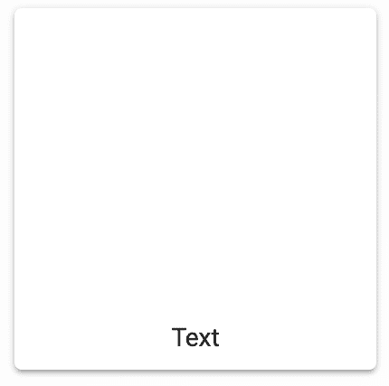

# 第十七章：字体排版 - 控制字体外观和感觉

在本章中，我们将涵盖以下主题：

+   字体排版类型

+   使用主题颜色

+   文本对齐

+   文本换行

# 简介

`Typography`组件由 Material-UI 用于在屏幕上渲染文本。你可以单独使用`Typography`，但它也被其他渲染文本的 Material-UI 组件内部使用。使用`Typography`组件而不是其他 HTML 元素来渲染你的文本，允许 Material-UI 使用一致的字体类型应用主题样式，并且以统一的方式处理字体行为。

# 字体排版类型

当你想在 Material-UI 应用程序中渲染文本时，`Typography`组件就会被使用。文本类型或变体被指定为一个字符串值，该值传递给`variant`属性。

# 如何做到这一点...

下面是一个示例，展示了如何渲染所有可用的`Typography`变体：

```js
import React, { Fragment } from 'react';

import Typography from '@material-ui/core/Typography';

const MyTypography = ({ variant, ...props }) => (
  <Typography variant={variant || 'inherit'} {...props} />
);

const TypesOfTypography = () => (
  <Fragment>
    <Typography variant="h1">h1 variant</Typography>
    <Typography variant="h2">h2 variant</Typography>
    <Typography variant="h3">h3 variant</Typography>
    <Typography variant="h4">h4 variant</Typography>
    <Typography variant="h5">h5 variant</Typography>
    <Typography variant="h6">h6 variant</Typography>
    <Typography variant="subtitle1">subtitle1 variant</Typography>
    <Typography variant="subtitle2">subtitle2 variant</Typography>
    <Typography variant="body1">body1 variant</Typography>
    <Typography variant="body2">body2 variant</Typography>
    <Typography variant="subtitle1">subtitle1 variant</Typography>
    <Typography variant="caption">caption variant</Typography>
    <Typography variant="button">button variant</Typography>
    <Typography variant="overline">overline variant</Typography>
    <Typography variant="title" component="div">
      <Typography variant="inherit">
        inherited title variant
      </Typography>
      <Typography variant="inherit">
        another inherited title variant
      </Typography>
      <Typography variant="caption">
        overridden caption variant
      </Typography>
    </Typography>
    <MyTypography variant="title" component="div">
      <MyTypography>inherited title variant</MyTypography>
      <MyTypography>another inherited title variant</MyTypography>
      <MyTypography variant="caption">
        overridden caption variant
      </MyTypography>
    </MyTypography>
  </Fragment>
);

export default TypesOfTypography;
```

下面是标题变体的样子：


最后，以下是剩余变体的样子：


# 它是如何工作的...

您传递给`variant`属性的值决定了应用于文本的样式。每个这些变体的样式由主题定义，并且可以从一个主题定制到另一个主题。

可能会诱使你添加自己的变体名称，或者在外部添加字体样式。我建议不要这样做，因为这样做会破坏基于 Material Design 的通用字体词汇。如果你偏离了字体变体约定，你最终会得到只有你才能理解的变体名称，或者更糟糕的是，由于从字体系统外部应用到文本上的字体样式，变体将无法工作。

# 还有更多...

如果你希望你的`Typography`组件从其父组件继承变体样式，你可以使用`inherit`变体值，如下面的示例所示：

```js
<Typography variant="title" component="div">
  <Typography variant="inherit">
    inherited title variant
  </Typography>
  <Typography variant="inherit">
    another inherited title variant
  </Typography>
  <Typography variant="caption">
    overridden caption variant
  </Typography>
</Typography>
```

父`Typography`组件使用`title`变体。它还将它的组件更改为`div`元素，因为它实际上并没有将文本作为直接子元素渲染——把它看作是字体样式的容器。在里面，有三个子`Typography`组件。前两个将`inherit`作为`variant`属性值，因此它们实际上会得到`title`变体。第三个`Typography`子组件使用`caption`作为其变体，因此它不会继承`title`。

下面是结果的样子：


你可能考虑对这个方法的一个调整是将`inherit`作为默认变体。这样，如果你有很多需要继承字体样式的子`Typography`组件，你就不必一直输入`variant="inherit"`。以下是一个执行此操作的组件：

```js
const MyTypography = ({ variant, ...props }) => (
  <Typography variant={variant || 'inherit'} {...props} />
);
```

`MyTypography` 组件将渲染一个 `Typography` 组件，其 `variant` 值为 `inherit`，但前提是未传递 `variant` 属性。让我们将前面的代码更改为使用这个新组件：

```js
<MyTypography variant="title" component="div">
  <MyTypography>inherited title variant</MyTypography>
  <MyTypography>another inherited title variant</MyTypography>
  <MyTypography variant="caption">
    overridden caption variant
  </MyTypography>
</MyTypography>
```

结果完全相同。唯一的区别是现在你不需要为想要继承的变体提供 `variant` 属性。

# 相关内容

+   `Typography` 演示：[`material-ui.com/style/typography/`](https://material-ui.com/style/typography/)

+   `Typography` API 文档：[`material-ui.com/api/typography/`](https://material-ui.com/api/typography/)

# 使用主题颜色

使用 `Typography` 组件渲染的文本可以使用应用使用的 Material-UI 主题中的颜色。

# 如何做到...

对于这个示例，你将找到一个 Storybook 控件，允许你使用主题中预定义的颜色名称更改文本颜色，如下面的截图所示：


这是使用通过传递给每个 `Typography` 组件的 `color` 属性来选择颜色的示例的源代码：

```js
import React, { Fragment } from 'react';

import Typography from '@material-ui/core/Typography';

const UsingThemeColors = ({ color }) => (
  <Fragment>
    <Typography variant="h1" color={color}>
      h1 variant
    </Typography>
    <Typography variant="h2" color={color}>
      h2 variant
    </Typography>
    <Typography variant="h3" color={color}>
      h3 variant
    </Typography>
    <Typography variant="h4" color={color}>
      h4 variant
    </Typography>
    <Typography variant="h5" color={color}>
      h5 variant
    </Typography>
    <Typography variant="h6" color={color}>
      h6 variant
    </Typography>
    <Typography variant="subtitle1" color={color}>
      subtitle1 variant
    </Typography>
    <Typography variant="subtitle2" color={color}>
      subtitle2 variant
    </Typography>
    <Typography variant="body1" color={color}>
      body1 variant
    </Typography>
    <Typography variant="body2" color={color}>
      body2 variant
    </Typography>
    <Typography variant="caption" color={color}>
      caption variant
    </Typography>
    <Typography variant="button" color={color}>
      button variant
    </Typography>
    <Typography variant="overline" color={color}>
      overline variant
    </Typography>
  </Fragment>
);

export default UsingThemeColors;
```

# 它是如何工作的...

让我们来看看这些颜色如何改变不同 `Typography` 变体的外观：

| 默认 | `default` 颜色使用为所讨论的 `Typography` 变体定义的任何颜色 |  |
| --- | --- | --- |
| 错误 | `error` 颜色将 `palette.error.main` 主题颜色应用到文本上 |  |
| 继承 | `Typography` 组件将继承其父组件的字体颜色 |  |
| 主要 | `primary` 颜色将 `palette.primary.main` 主题颜色应用到文本上 |  |
| 次要 | `secondary` 颜色将 `palette.secondary.main` 主题颜色应用到文本上 |  |
| 文本主要 | `textPrimary` 颜色将 `palette.text.primary` 主题颜色应用到文本上 |  |
| 文本次要 | `textSecondary` 颜色将 `palette.text.secondary` 主题颜色应用到文本上 |  |

# 相关内容

+   `Typography` 演示：[`material-ui.com/style/typography/`](https://material-ui.com/style/typography/)

+   `Typography` API 文档：[`material-ui.com/api/typography/`](https://material-ui.com/api/typography/)

# 对齐文本

在用户界面中对齐文本是常见的。不幸的是，这并不容易。使用 Material-UI 网格和排版，你可以创建抽象，使对齐文本变得稍微容易一些。

# 如何做到...

如果你试图将文本水平对齐到左、右或居中，那么你可以使用 `Typography` 组件的 `align` 属性，如下面的代码所示：

```js
<Typography align="center">My Centered Text</Typography>
```

这是一种使用 `text-align` 样式的简写，这样你就不必为更常见的对齐场景不断向你的组件添加 CSS。然而，有时你需要能够水平和垂直地对齐你的文本。

例如，假设你有一个 200x200 的 `Paper` 元素，你需要能够在右下角渲染文本。让我们通过一些代码来演示这个例子：

```js
import React from 'react';

import { withStyles } from '@material-ui/core/styles';
import Typography from '@material-ui/core/Typography';
import Paper from '@material-ui/core/Paper';
import Grid from '@material-ui/core/Grid';

const styles = theme => ({
  paper: {
    width: 200,
    height: 200,
    padding: theme.spacing(1)
  }
});

const MyPaper = withStyles(styles)(
  ({ horizontalAlign, verticalAlign, classes, ...props }) => (
    <Grid
      container
      component={Paper}
      className={classes.paper}
      alignContent={verticalAlign}
      justify={horizontalAlign}
      {...props}
    />
  )
);

const MyTypography = ({ ...props }) => (
  <Grid item component={Typography} {...props} />
);

const AligningText = ({ ...props }) => (
  <MyPaper {...props}>
    <MyTypography {...props}>Text</MyTypography>
  </MyPaper>
);

export default AligningText;
```

当屏幕首次加载时，你会看到以下内容：


# 它是如何工作的...

Storybook 中有两个用于对齐文本的控制，如下所示：


水平对齐控制会改变传递给 `MyPaper` 组件的 `horizontalAlign` 属性。同样，垂直对齐控制会改变 `verticalAlign` 属性的值。`horizontalAlign` 值传递给 `Grid` 组件的 `justify` 属性，而 `verticalAlign` 属性则传递给 `alignContent` 属性。

`Grid` 组件的妙处在于你可以传递一个 `component` 属性，这将渲染默认渲染的 `div` 元素。换句话说，你可以将 `Paper` 组件变成一个网格容器，而你要对齐的 `Typography` 组件则变成一个网格项。你不需要先渲染 `Grid` 组件，然后再将实际内容作为子元素渲染。你可以使你的内容成为网格。

当你设置 `justify="center"` 和 `alignContent="flex-end"` 时，网格看起来是这样的：



这里展示了当你设置 `justify="flex-end"` 和 `alignContent="flex-start"` 时它看起来是什么样子：


# 参见

+   `Typography` 演示：[`material-ui.com/style/typography/`](https://material-ui.com/style/typography/)

+   `Typography` API 文档：[`material-ui.com/api/typography/`](https://material-ui.com/api/typography/)

# 文本换行

你在应用程序中用于渲染文本的 `Typography` 组件需要知道文本换行的情况。这意味着，当没有足够的空间渲染一行文本时，它将继续到下一行。如果你没有预料到文本可能会换行，这可能会导致不理想的布局后果。

# 如何做到这一点...

让我们看看一个例子，其中你有两个 `Paper` 组件，它们使用 `Typography` 组件来渲染文本：

```js
import React, { Fragment } from 'react';
import clsx from 'clsx';

import { withStyles } from '@material-ui/core/styles';
import Typography from '@material-ui/core/Typography';
import Paper from '@material-ui/core/Paper';

const styles = theme => ({
  paper: {
    minWidth: 300,
    padding: theme.spacing(2),
    margin: theme.spacing(3)
  },
  fixedHeight: { height: 100 },
  responsive: {
    [theme.breakpoints.down('xs')]: {
      overflow: 'hidden',
      textOverflow: 'ellipsis',
      whiteSpace: 'nowrap'
    }
  }
});

const WrappingText = withStyles(styles)(({ classes }) => (
  <Fragment>
    <Paper className={classes.paper}>
      <Typography noWrap>
        Lorem ipsum dolor sit amet, consectetur adipiscing elit, sed
        do eiusmod tempor incididunt ut labore
      </Typography>
    </Paper>
    <Paper className={clsx(classes.paper, classes.fixedHeight)}>
      <Typography className={classes.responsive}>
        Sed ut perspiciatis unde omnis iste natus error sit voluptatem
        accusantium doloremque laudantium, totam rem aperiam, eaque
        ipsa quae ab illo inventore veritatis et quasi architecto
        beatae vitae dicta sunt explicabo. Nemo enim ipsam voluptatem
        quia voluptas sit aspernatur aut odit aut fugit, sed quia
        consequuntur magni dolores eos qui ratione voluptatem sequi
        nesciunt.
      </Typography>
    </Paper>
  </Fragment>
));

export default WrappingText;
```

当屏幕首次加载时，你会看到以下内容：


第一个 `Paper` 组件没有设置 `height` 组件，并且只有一行文本适合当前屏幕宽度。第二个 `Paper` 组件设置了 `height`，第二个 `Paper` 组件中的文本被换行，以便适合屏幕。

# 它是如何工作的...

现在，让我们尝试更改屏幕分辨率，使可用于渲染文本的可用宽度更小。你会看到以下内容：


两个`Paper`组件中都有换行问题。在第一个中，换行文本导致组件的高度改变，因为它没有固定的高度。这可能会对布局产生多米诺效应，这可能是问题也可能是问题，这取决于你的设计。在第二个`Paper`组件中，`height`是固定的，这意味着换行文本会溢出组件，看起来很糟糕。

# 还有更多...

让我们修复这个例子中两个`Paper`组件中的文本换行问题。以下是一个修改后的版本：

```js
import React, { Fragment } from 'react';
import clsx from 'clsx';

import { withStyles } from '@material-ui/core/styles';
import Typography from '@material-ui/core/Typography';
import Paper from '@material-ui/core/Paper';

const styles = theme => ({
  paper: {
    minWidth: 300,
    padding: theme.spacing(2),
    margin: theme.spacing(3)
  },
  fixedHeight: { height: 100 },
  responsive: {
    [theme.breakpoints.down('xs')]: {
      overflow: 'hidden',
      textOverflow: 'ellipsis',
      whiteSpace: 'nowrap'
    }
  }
});

const WrappingText = withStyles(styles)(({ classes }) => (
  <Fragment>
    <Paper className={classes.paper}>
      <Typography noWrap>
        Lorem ipsum dolor sit amet, consectetur adipiscing elit, sed
        do eiusmod tempor incididunt ut labore
      </Typography>
    </Paper>
    <Paper className={clsx(classes.paper, classes.fixedHeight)}>
      <Typography className={classes.responsive}>
        Sed ut perspiciatis unde omnis iste natus error sit voluptatem
        accusantium doloremque laudantium, totam rem aperiam, eaque
        ipsa quae ab illo inventore veritatis et quasi architecto
        beatae vitae dicta sunt explicabo. Nemo enim ipsam voluptatem
        quia voluptas sit aspernatur aut odit aut fugit, sed quia
        consequuntur magni dolores eos qui ratione voluptatem sequi
        nesciunt.
      </Typography>
    </Paper>
  </Fragment>
));

export default WrappingText;
```

现在，当你缩小屏幕宽度时，这两个组件看起来是这样的：


第一个`Paper`组件通过向`Typography`组件添加`noWrap`属性来修复。这将确保组件的`height`组件永远不会改变，通过隐藏文本溢出并添加省略号来表示文本已被截断。这是因为你知道这只是一行文本，在更宽的显示上永远不会需要换行。另一方面，第二个`Paper`组件需要不同的方法，因为它确实需要换行的能力。

解决方案是使用 Material-UI 的媒体查询功能。调用`theme.breakpoints.down('xs')`会导致一个以媒体查询为前缀的类名，在这种情况下，是`xs`。现在，当屏幕宽度缩小到`xs`断点时，应用于组件的`noWrap`属性的相同样式被应用。

# 参见

+   `Typography` 演示：[`material-ui.com/style/typography/`](https://material-ui.com/style/typography/)

+   `Typography` API 文档：[`material-ui.com/api/typography/`](https://material-ui.com/api/typography/)
