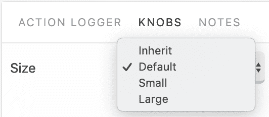

# 图标 - 增强图标以匹配您的外观和感觉

在本章中，你将学习以下内容：

+   着色图标

+   缩放图标

+   动态加载图标

+   主题图标

+   安装更多图标

# 简介

图标在任何 Material-UI 应用程序中都扮演着重要角色。即使你没有打算明确使用它们，许多组件默认情况下也会使用图标。如果一个 Material-UI 组件默认不使用图标，你通常可以找到直接支持集成 Material-UI 图标的选项。图标在应用程序的可用性中发挥着重要作用——它们提供了一种快速扫描屏幕以获取意义的方法，而不是需要不断解析文本。

# 着色图标

Material-UI 图标组件接受一个`color`属性，该属性接受一个命名主题颜色并将其应用到图标上。

# 如何做到...

此示例使用 Storybook 控件来更改渲染的图标的`color`属性：


下面是一段代码，展示了如何使用所选的`color`值渲染多个图标：

```js
import React, { Fragment } from 'react';

import { withStyles } from '@material-ui/core/styles';

import Cast from '@material-ui/icons/Cast';
import CastConnected from '@material-ui/icons/CastConnected';
import CastForEducation from '@material-ui/icons/CastForEducation';
import Computer from '@material-ui/icons/Computer';
import DesktopMac from '@material-ui/icons/DesktopMac';
import DesktopWindows from '@material-ui/icons/DesktopWindows';
import DeveloperBoard from '@material-ui/icons/DeveloperBoard';
import DeviceHub from '@material-ui/icons/DeviceHub';
import DeviceUnknown from '@material-ui/icons/DeviceUnknown';
import DevicesOther from '@material-ui/icons/DevicesOther';
import Dock from '@material-ui/icons/Dock';
import Gamepad from '@material-ui/icons/Gamepad';

const styles = theme => ({
  icon: { margin: theme.spacing(3) }
});

const IconColorAndState = withStyles(styles)(({ color, classes }) => (
  <Fragment>
    <Cast className={classes.icon} color={color} />
    <CastConnected className={classes.icon} color={color} />
    <CastForEducation className={classes.icon} color={color} />
    <Computer className={classes.icon} color={color} />
    <DesktopMac className={classes.icon} color={color} />
    <DesktopWindows className={classes.icon} color={color} />
    <DeveloperBoard className={classes.icon} color={color} />
    <DeviceHub className={classes.icon} color={color} />
    <DeviceUnknown className={classes.icon} color={color} />
    <DevicesOther className={classes.icon} color={color} />
    <Dock className={classes.icon} color={color} />
    <Gamepad className={classes.icon} color={color} />
  </Fragment>
));

export default IconColorAndState;
```

# 它是如何工作的...

`color`属性默认为`inherit`，这意味着图标将与它们的父组件颜色相同。让我们看看不同的颜色值，并看看示例中的这些图标看起来如何：

| 继承  | `inherit`颜色值将使用父组件样式的颜色值： |  |
| --- | --- | --- |
| 主要 | `primary`颜色将`palette.primary.main`主题颜色应用到图标上： |  |
| 次要 | `secondary`颜色将`palette.secondary.main`主题颜色应用到图标上： |  |
| 操作 | `action`颜色将`palette.action.active`主题颜色应用到图标上： |  |
| 错误 | `error`颜色将`palette.error.main`主题颜色应用到图标上： |  |
| 禁用 | `disabled`颜色将`palette.action.disabled`主题颜色应用到图标上： |  |

# 相关内容

+   图标演示：[`material-ui.com/style/icons/`](https://material-ui.com/style/icons/)

+   图标 API 文档：[`material-ui.com/api/icon/`](https://material-ui.com/api/icon/)

# 缩放图标

Material-UI 图标组件的`fontSize`属性接受一个表示预定义图标大小的字符串值。这个属性被称为`fontSize`而不是`size`的原因是，`fontSize`CSS 属性决定了图标的大小。默认值为`24px`。

# 如何做到...

此示例使用 Storybook 控件来更改渲染的图标的`fontSize`属性：



下面是一段代码，展示了如何使用所选的`fontSize`值渲染多个图标：

```js
import React, { Fragment } from 'react';

import { withStyles } from '@material-ui/core/styles';

import Cast from '@material-ui/icons/Cast';
import CastConnected from '@material-ui/icons/CastConnected';
import CastForEducation from '@material-ui/icons/CastForEducation';
import Computer from '@material-ui/icons/Computer';
import DesktopMac from '@material-ui/icons/DesktopMac';
import DesktopWindows from '@material-ui/icons/DesktopWindows';
import DeveloperBoard from '@material-ui/icons/DeveloperBoard';
import DeviceHub from '@material-ui/icons/DeviceHub';
import DeviceUnknown from '@material-ui/icons/DeviceUnknown';
import DevicesOther from '@material-ui/icons/DevicesOther';
import Dock from '@material-ui/icons/Dock';
import Gamepad from '@material-ui/icons/Gamepad';

const styles = theme => ({
  icon: { margin: theme.spacing(3) }
});

const ScalingIcons = withStyles(styles)(({ fontSize, classes }) => (
  <Fragment>
    <Cast className={classes.icon} fontSize={fontSize} />
    <CastConnected className={classes.icon} fontSize={fontSize} />
    <CastForEducation className={classes.icon} fontSize={fontSize} />
    <Computer className={classes.icon} fontSize={fontSize} />
    <DesktopMac className={classes.icon} fontSize={fontSize} />
    <DesktopWindows className={classes.icon} fontSize={fontSize} />
    <DeveloperBoard className={classes.icon} fontSize={fontSize} />
    <DeviceHub className={classes.icon} fontSize={fontSize} />
    <DeviceUnknown className={classes.icon} fontSize={fontSize} />
    <DevicesOther className={classes.icon} fontSize={fontSize} />
    <Dock className={classes.icon} fontSize={fontSize} />
    <Gamepad className={classes.icon} fontSize={fontSize} />
  </Fragment>
));

export default ScalingIcons;
```

# 它是如何工作的...

`fontSize`的默认值是`default`。让我们浏览 Material-UI 图标的不同大小选项，看看它们的外观。

# 默认

`default`值将图标大小设置为 24 像素：


# 继承

`inherit`值将图标设置为父组件设置的`fontSize`。在这个例子中，图标继承了 16 像素作为`fontSize`：


# 小

`small`值将图标大小设置为 20 像素：


# 大

`large`值将图标大小设置为 36 像素：


# 相关内容

+   图标演示：[`material-ui.com/style/icons/`](https://material-ui.com/style/icons/)

+   图标 API 文档：[`material-ui.com/api/icon/`](https://material-ui.com/api/icon/)

# 动态加载图标

在只有少量图标的屏幕上，你可以直接将它们作为组件导入而不会出现任何问题。如果你有一个图标很多的屏幕，或者你的应用程序整体上使用了大量图标（后者会增加包的大小），这可能会很具挑战性。在这两种情况下，答案都是懒加载/动态加载 Material-UI 图标。

# 如何实现...

你可以利用 React 的`lazy()`高阶组件。同时，React 的`Suspense`组件在`lazy`组件被检索和渲染时在你的 UI 中提供占位符。这种整体方法就是 React 中处理代码拆分的方式——Material-UI 图标恰好是一个很好的用例。

这个例子使用 Storybook 控件来选择要加载的图标类别：


这是创建动态加载的`lazy icon`组件的代码：

```js
import React, { lazy, Suspense, Fragment } from 'react';

import { withStyles } from '@material-ui/core/styles';
import CircularProgress from '@material-ui/core/CircularProgress';

const categories = {
  Action: [
    lazy(() => import('@material-ui/icons/ThreeDRotation')),
    lazy(() => import('@material-ui/icons/Accessibility')),
    lazy(() => import('@material-ui/icons/AccessibilityNew')),
    lazy(() => import('@material-ui/icons/Accessible')),
    lazy(() => import('@material-ui/icons/AccessibleForward')),
    lazy(() => import('@material-ui/icons/AccountBalance')),
    lazy(() => import('@material-ui/icons/AccountBalanceWallet')),
    lazy(() => import('@material-ui/icons/AccountBox')),
    lazy(() => import('@material-ui/icons/AccountCircle'))
  ],
  Alert: [
    lazy(() => import('@material-ui/icons/AddAlert')),
    lazy(() => import('@material-ui/icons/Error')),
    lazy(() => import('@material-ui/icons/ErrorOutline')),
    lazy(() => import('@material-ui/icons/NotificationImportant')),
    lazy(() => import('@material-ui/icons/Warning'))
  ],
  Av: [
    lazy(() => import('@material-ui/icons/FourK')),
    lazy(() => import('@material-ui/icons/AddToQueue')),
    lazy(() => import('@material-ui/icons/Airplay')),
    lazy(() => import('@material-ui/icons/Album')),
    lazy(() => import('@material-ui/icons/ArtTrack')),
    lazy(() => import('@material-ui/icons/AvTimer')),
    lazy(() => import('@material-ui/icons/BrandingWatermark')),
    lazy(() => import('@material-ui/icons/CallToAction')),
    lazy(() => import('@material-ui/icons/ClosedCaption'))
  ],
  Communication: [
    lazy(() => import('@material-ui/icons/AlternateEmail')),
    lazy(() => import('@material-ui/icons/Business')),
    lazy(() => import('@material-ui/icons/Call')),
    lazy(() => import('@material-ui/icons/CallEnd')),
    lazy(() => import('@material-ui/icons/CallMade')),
    lazy(() => import('@material-ui/icons/CallMerge')),
    lazy(() => import('@material-ui/icons/CallMissed')),
    lazy(() => import('@material-ui/icons/CallMissedOutgoing')),
    lazy(() => import('@material-ui/icons/CallReceived'))
  ]
};

const styles = theme => ({
  icon: { margin: theme.spacing(3) }
});

const DynamicallyLoadingIcons = withStyles(styles)(
  ({ category, classes }) => (
    <Suspense fallback={<CircularProgress />}>
      {categories[category].map((Icon, index) => (
        <Icon key={index} className={classes.icon} />
      ))}
    </Suspense>
  )
);

export default DynamicallyLoadingIcons;
```

当屏幕首次加载时，你会看到以下内容：


如果你选择`Av`类别，你会看到以下内容：


# 工作原理...

`lazy()`函数接收一个返回`import()`调用的函数。它返回一个`lazy`组件：

```js
const LazyIcon = lazy(() => import('@material-ui/icons/ThreeDRotation'))
```

这段代码实际上并没有`import` `ThreeDRotation`图标。它构建了一个新组件，在渲染时导入图标。例如，以下代码将导致图标被导入：

```js
<LazyIcon />
```

你可以在运行此示例时查看`dev`工具中的网络标签来亲自看到这一点。默认选择`Action`类别，因此你可以看到加载正在渲染的`lazy`组件的网络请求：


然后，如果你将选择的类别更改为`Communication`，你会看到更多网络请求来加载这个类别中正在渲染的懒加载图标：


# 相关内容

+   图标演示：[`material-ui.com/style/icons/`](https://material-ui.com/style/icons/)

+   图标 API 文档：[`material-ui.com/api/icon/`](https://material-ui.com/api/icon/)

# 主题图标

Material-UI 图标有可以应用于它们的主题。它们不要与应用于你使用的每个 Material-UI 组件的样式主题混淆；图标主题专门用于图标。要使用主题图标，你必须导入它的不同版本。

# 如何操作...

为了帮助探索不同的图标主题，此示例使用了一个 Storybook 控件，允许你更改图标主题：


这是源代码：

```js
import React, { lazy, Suspense, Fragment } from 'react';

import { withStyles } from '@material-ui/core/styles';
import CircularProgress from '@material-ui/core/CircularProgress';

const themes = {
  Filled: [
    lazy(() => import('@material-ui/icons/Attachment')),
    lazy(() => import('@material-ui/icons/Cloud')),
    lazy(() => import('@material-ui/icons/CloudCircle')),
    lazy(() => import('@material-ui/icons/CloudDone')),
    lazy(() => import('@material-ui/icons/CloudDownload')),
    lazy(() => import('@material-ui/icons/CloudOff')),
    lazy(() => import('@material-ui/icons/CloudQueue')),
    lazy(() => import('@material-ui/icons/CloudUpload')),
    lazy(() => import('@material-ui/icons/CreateNewFolder')),
    lazy(() => import('@material-ui/icons/Folder')),
    lazy(() => import('@material-ui/icons/FolderOpen')),
    lazy(() => import('@material-ui/icons/FolderShared'))
  ],
  Outlined: [
    lazy(() => import('@material-ui/icons/AttachmentOutlined')),
    lazy(() => import('@material-ui/icons/CloudOutlined')),
    lazy(() => import('@material-ui/icons/CloudCircleOutlined')),
    lazy(() => import('@material-ui/icons/CloudDoneOutlined')),
    lazy(() => import('@material-ui/icons/CloudDownloadOutlined')),
    lazy(() => import('@material-ui/icons/CloudOffOutlined')),
    lazy(() => import('@material-ui/icons/CloudQueueOutlined')),
    lazy(() => import('@material-ui/icons/CloudUploadOutlined')),
    lazy(() => import('@material-ui/icons/CreateNewFolderOutlined')),
    lazy(() => import('@material-ui/icons/FolderOutlined')),
    lazy(() => import('@material-ui/icons/FolderOpenOutlined')),
    lazy(() => import('@material-ui/icons/FolderSharedOutlined'))
  ],
  Rounded: [
    lazy(() => import('@material-ui/icons/AttachmentRounded')),
    lazy(() => import('@material-ui/icons/CloudRounded')),
    lazy(() => import('@material-ui/icons/CloudCircleRounded')),
    lazy(() => import('@material-ui/icons/CloudDoneRounded')),
    lazy(() => import('@material-ui/icons/CloudDownloadRounded')),
    lazy(() => import('@material-ui/icons/CloudOffRounded')),
    lazy(() => import('@material-ui/icons/CloudQueueRounded')),
    lazy(() => import('@material-ui/icons/CloudUploadRounded')),
    lazy(() => import('@material-ui/icons/CreateNewFolderRounded')),
    lazy(() => import('@material-ui/icons/FolderRounded')),
    lazy(() => import('@material-ui/icons/FolderOpenRounded')),
    lazy(() => import('@material-ui/icons/FolderSharedRounded'))
  ],
  TwoTone: [
    lazy(() => import('@material-ui/icons/AttachmentTwoTone')),
    lazy(() => import('@material-ui/icons/CloudTwoTone')),
    lazy(() => import('@material-ui/icons/CloudCircleTwoTone')),
    lazy(() => import('@material-ui/icons/CloudDoneTwoTone')),
    lazy(() => import('@material-ui/icons/CloudDownloadTwoTone')),
    lazy(() => import('@material-ui/icons/CloudOffTwoTone')),
    lazy(() => import('@material-ui/icons/CloudQueueTwoTone')),
    lazy(() => import('@material-ui/icons/CloudUploadTwoTone')),
    lazy(() => import('@material-ui/icons/CreateNewFolderTwoTone')),
    lazy(() => import('@material-ui/icons/FolderTwoTone')),
    lazy(() => import('@material-ui/icons/FolderOpenTwoTone')),
    lazy(() => import('@material-ui/icons/FolderSharedTwoTone'))
  ],
  Sharp: [
    lazy(() => import('@material-ui/icons/AttachmentSharp')),
    lazy(() => import('@material-ui/icons/CloudSharp')),
    lazy(() => import('@material-ui/icons/CloudCircleSharp')),
    lazy(() => import('@material-ui/icons/CloudDoneSharp')),
    lazy(() => import('@material-ui/icons/CloudDownloadSharp')),
    lazy(() => import('@material-ui/icons/CloudOffSharp')),
    lazy(() => import('@material-ui/icons/CloudQueueSharp')),
    lazy(() => import('@material-ui/icons/CloudUploadSharp')),
    lazy(() => import('@material-ui/icons/CreateNewFolderSharp')),
    lazy(() => import('@material-ui/icons/FolderSharp')),
    lazy(() => import('@material-ui/icons/FolderOpenSharp')),
    lazy(() => import('@material-ui/icons/FolderSharedSharp'))
  ]
};

const styles = theme => ({
  icon: { margin: theme.spacing(3) }
});

const ThemedIcons = withStyles(styles)(({ theme, classes }) => (
  <Suspense fallback={<CircularProgress />}>
    {themes[theme].map((Icon, index) => (
      <Icon fontSize="large" key={index} className={classes.icon} />
    ))}
  </Suspense>
));

export default ThemedIcons;
```

# 它是如何工作的...

如果你查看 `themes` 对象，你会看到每个主题都有相同的图标，但它们的 `import` 路径略有不同。例如，`Attachment` 图标是由 `Filled` 主题导入的，如下所示：

```js
import('@material-ui/icons/Attachment')
```

在 `Rounded` 主题中，导入相同图标的示例如下：

```js
import('@material-ui/icons/AttachmentOutlined')
```

你通过将主题名称附加到图标名称来更改图标的主题。每个都遵循相同的模式。

并非每个图标在主题更改时都会改变。这实际上完全取决于图标形状以及是否与给定主题相匹配。导入仍然会工作，但并不总是会有视觉上的变化。

让我们一起来探索它们：

| 填充 | `Filled` 主题是默认主题。以下是将其应用于示例时的外观： |  |
| --- | --- | --- |
| 线框 | 查看前面的 `Filled` 主题——注意，一些图标实际上是默认轮廓的。以下是 `Outlined` 主题应用于示例时的外观： |  |
| 圆角 | 这是将 `Rounded` 主题应用于示例时的外观： |  |
| 双色调 | 这是将 `TwoTone` 主题应用于示例时的外观： |  |
| 锋利 | 这是将 `Sharp` 主题应用于示例时的外观： |  |

# 相关内容

+   图标演示：[`material-ui.com/style/icons/`](https://material-ui.com/style/icons/)

+   图标 API 文档：[`material-ui.com/api/icon/`](https://material-ui.com/api/icon/)

# 安装更多图标

`mdi-material-ui` 包提供了大量的图标，你可以像使用内置图标一样，在你的 Material-UI 应用程序中使用它们。

# 如何操作...

第一步是安装包并将其添加到你的项目中：

```js
npm install --save mdi-material-ui
```

现在，你已经准备好从这个包中 `import` 图标并使用它们：

```js
import React, { Fragment } from 'react';

import { withStyles } from '@material-ui/core/styles';

import Apple from 'mdi-material-ui/Apple';
import Facebook from 'mdi-material-ui/Facebook';
import Google from 'mdi-material-ui/Google';
import Hulu from 'mdi-material-ui/Hulu';
import Linkedin from 'mdi-material-ui/Linkedin';
import Lyft from 'mdi-material-ui/Lyft';
import Microsoft from 'mdi-material-ui/Microsoft';
import Netflix from 'mdi-material-ui/Netflix';
import Npm from 'mdi-material-ui/Npm';
import Reddit from 'mdi-material-ui/Reddit';
import Twitter from 'mdi-material-ui/Twitter';
import Uber from 'mdi-material-ui/Uber';

const styles = theme => ({
  icon: { margin: theme.spacing(3) }
});

const InstallingMoreIcons = withStyles(styles)(({ classes }) => (
  <Fragment>
    <Apple className={classes.icon} />
    <Facebook className={classes.icon} />
    <Google className={classes.icon} />
    <Hulu className={classes.icon} />
    <Linkedin className={classes.icon} />
    <Lyft className={classes.icon} />
    <Microsoft className={classes.icon} />
    <Netflix className={classes.icon} />
    <Npm className={classes.icon} />
    <Reddit className={classes.icon} />
    <Twitter className={classes.icon} />
    <Uber className={classes.icon} />
  </Fragment>
));

export default InstallingMoreIcons;
```

这是加载屏幕时图标的外观：


# 它是如何工作的...

来自 `mdi-material-design` 的图标与 `@material-ui/icons` 的图标类似。它们被导入并作为 React 组件渲染。您可以通过在 [`materialdesignicons.com/`](https://materialdesignicons.com/) 上查找来找到您需要的图标名称。在任何可以使用官方 Material-UI 图标的地方，例如在按钮中，您也可以使用 `mdi-material-ui` 的图标。

# 参见

+   材料设计图标包：[`materialdesignicons.com/`](https://materialdesignicons.com/)

+   图标演示：[`material-ui.com/style/icons/`](https://material-ui.com/style/icons/)

+   图标 API 文档：[`material-ui.com/api/icon/`](https://material-ui.com/api/icon/)
