# 主题 - 中心化您的应用的外观和感觉

在本章中，您将学习以下内容：

+   理解调色板

+   比较浅色和深色主题

+   自定义字体

+   嵌套主题

+   理解组件主题设置

# 简介

所有 Material-UI 应用程序在某种程度上都共享一个共同的外观和感觉。这并不意味着您的银行应用程序会与我的音乐库应用程序看起来和感觉一样，仅仅因为我们都在使用相同的库。共同之处在于，两个应用程序都遵循 Material Design 原则。在这里，我不会深入探讨 Material Design，因为已经有大量资源做得比我好得多。相反，我想强调的是，Material-UI 应用程序可以以高度灵活的方式主题化，而无需牺牲 Material Design 的原则。

# 理解调色板

大多数人在构建新的 Material-UI 主题时，首先考虑的是调色板。调色板可能非常复杂，包含许多可变部分：Material-UI 主题也不例外，但 Material-UI 隐藏了很多复杂性。您需要关注主题的色彩意图，而 Material-UI 则使用这些色彩意图在必要时计算其他颜色。以下内容直接摘自 Material-UI 主题文档，意图如下：

+   主要：用于表示主要界面元素

+   二级：用于表示二级界面元素

+   错误：用于表示用户应了解的界面元素

# 如何操作...

让我们构建一个新的主题，使用 Material-UI 内置的颜色对象设置色彩意图。为了帮助调整您的主题，此示例使用了色调和阴影 Storybook 控件：

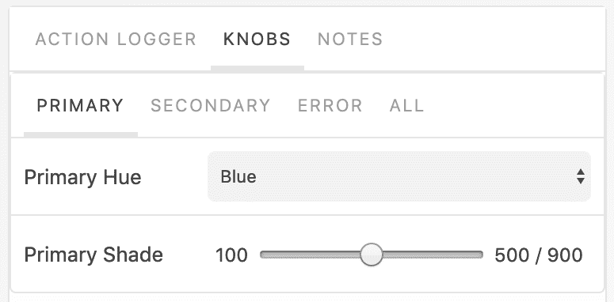

三个色彩意图以标签形式显示在顶部。目前 PRIMARY 意图被选中，它有一个色调选择器和阴影数值范围。每个意图都有相同的控件。色调选择器中填充了可以从 Material-UI `import` 的相同颜色：

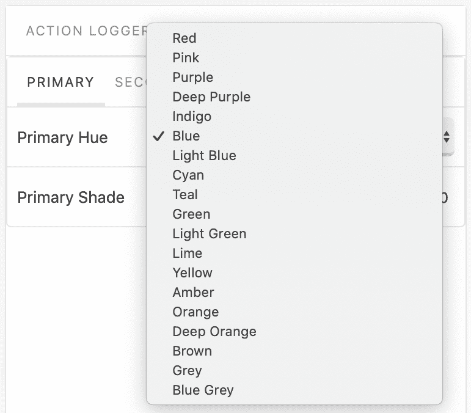

下面是使用这些 Storybook 控件构建新主题并渲染一些 `Button` 和 `Typography` 组件的源代码：

```js
import React, { Fragment } from 'react';

import {
  withStyles,
  createMuiTheme,
  MuiThemeProvider
} from '@material-ui/core/styles';
import Button from '@material-ui/core/Button';
import Typography from '@material-ui/core/Typography';

import red from '@material-ui/core/colors/red';
import pink from '@material-ui/core/colors/pink';
import purple from '@material-ui/core/colors/purple';
import deepPurple from '@material-ui/core/colors/deepPurple';
import indigo from '@material-ui/core/colors/indigo';
import blue from '@material-ui/core/colors/blue';
import lightBlue from '@material-ui/core/colors/lightBlue';
import cyan from '@material-ui/core/colors/cyan';
import teal from '@material-ui/core/colors/teal';
import green from '@material-ui/core/colors/green';
import lightGreen from '@material-ui/core/colors/lightGreen';
import lime from '@material-ui/core/colors/lime';
import yellow from '@material-ui/core/colors/yellow';
import amber from '@material-ui/core/colors/amber';
import orange from '@material-ui/core/colors/orange';
import deepOrange from '@material-ui/core/colors/deepOrange';
import brown from '@material-ui/core/colors/brown';
import grey from '@material-ui/core/colors/grey';
import blueGrey from '@material-ui/core/colors/blueGrey';

const styles = theme => ({
  button: { margin: theme.spacing(2) }
});

const hues = {
  red,
  pink,
  purple,
  deepPurple,
  indigo,
  blue,
  lightBlue,
  cyan,
  teal,
  green,
  lightGreen,
  lime,
  yellow,
  amber,
  orange,
  deepOrange,
  brown,
  grey,
  blueGrey
};

const UnderstandingThePallette = withStyles(styles)(
  ({
    primaryHue,
    primaryShade,
    secondaryHue,
    secondaryShade,
    errorHue,
    errorShade,
    classes
  }) => {
    const theme = createMuiTheme({
      palette: {
        primary: { main: hues[primaryHue][primaryShade] },
        secondary: { main: hues[secondaryHue][secondaryShade] },
        error: { main: hues[errorHue][errorShade] }
      }
    });

    return (
      <MuiThemeProvider theme={theme}>
        <Button className={classes.button} variant="contained">
          Default
        </Button>
        <Button
          className={classes.button}
          variant="contained"
          color="primary"
        >
          Primary
        </Button>
        <Button
          className={classes.button}
          variant="contained"
          color="secondary"
        >
          Secondary
        </Button>
        <Typography className={classes.button} color="error">
          Error
        </Typography>
      </MuiThemeProvider>
    );
  }
);

export default UnderstandingThePallette;
```

当您首次加载选择默认主题值的屏幕时，您将看到以下内容：

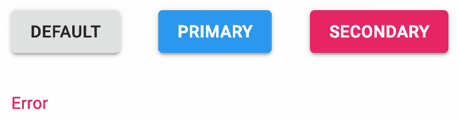

现在，让我们更改默认主题的色彩意图，从 PRIMARY 开始：

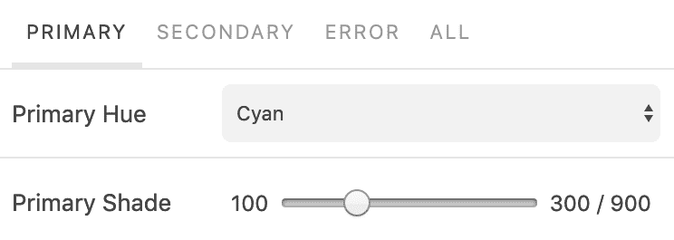

主要色调现在为青色，阴影值为 300。接下来，我们将更改二级意图：

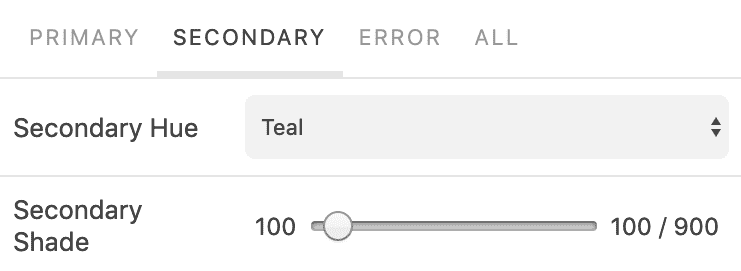

二级色调现在为青绿色，阴影值为 100。最后，我们将更改错误意图：

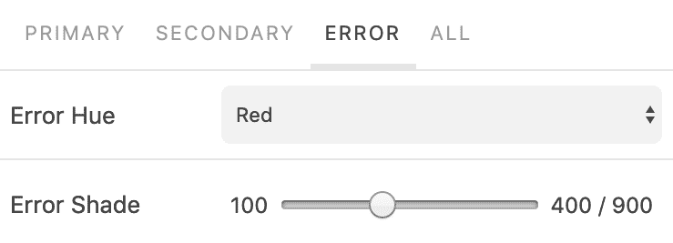

对于这个主题，错误色调仍然是红色，但稍微浅一些，阴影值为 400。以下是最终结果：

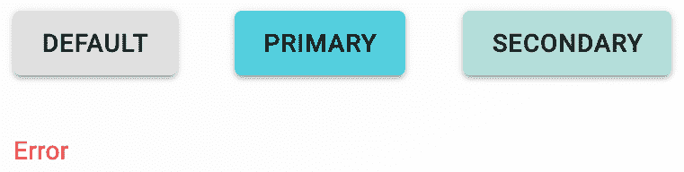

# 它是如何工作的...

Material-UI 有核心的`hues`可以导入，可以帮助你构建你的主题：

```js
import red from '@material-ui/core/colors/red';
import pink from '@material-ui/core/colors/pink';
import purple from '@material-ui/core/colors/purple';
import deepPurple from '@material-ui/core/colors/deepPurple';
import indigo from '@material-ui/core/colors/indigo';
import blue from '@material-ui/core/colors/blue';
import lightBlue from '@material-ui/core/colors/lightBlue';
import cyan from '@material-ui/core/colors/cyan';
import teal from '@material-ui/core/colors/teal';
import green from '@material-ui/core/colors/green';
import lightGreen from '@material-ui/core/colors/lightGreen';
import lime from '@material-ui/core/colors/lime';
import yellow from '@material-ui/core/colors/yellow';
import amber from '@material-ui/core/colors/amber';
import orange from '@material-ui/core/colors/orange';
import deepOrange from '@material-ui/core/colors/deepOrange';
import brown from '@material-ui/core/colors/brown';
import grey from '@material-ui/core/colors/grey';
import blueGrey from '@material-ui/core/colors/blueGrey';
```

你不必`import`每一个色调——这里这样做是因为 Storybook 控件可以动态更改调色板值。每个导入的颜色值都是一个按色调值（例如 500）索引的对象。例如，这些值是以十六进制表示的颜色，例如`#fffffff`。当使用以十六进制表示的颜色时，你必须在创建`theme`时将其传递给`main`属性：

```js
const theme = createMuiTheme({
  palette: {
    primary: { main: hues[primaryHue][primaryShade] },
    secondary: { main: hues[secondaryHue][secondaryShade] },
    error: { main: hues[errorHue][errorShade] }
  }
});
```

属性`primaryHue`、`primaryShade`等是由 Storybook 控件设置的值。`MuiThemeProvider`组件是将`theme`实际应用于你的 Material-UI 组件的方式。它不必是应用程序的根组件，但任何依赖于主题样式的 Material-UI 组件（如`Button`、`Typography`等）都需要是这个组件的子组件。

每当在这个例子中渲染`main`应用程序组件时，都会调用`createMuiTheme()`函数。实际上，这种情况不应该发生。相反，主题应该只创建一次，然后传递给`MuiThemeProvider`组件。这里之所以这样做，是为了当使用 Storybook 控件更改颜色值时，主题能够更新。

# 参见

+   Material-UI `theme` 文档：[`material-ui.com/customization/themes/`](https://material-ui.com/customization/themes/)

+   Material-UI `color` 文档：[`material-ui.com/style/color/`](https://material-ui.com/style/color/)

# 比较亮色和暗色主题

主题的颜色调色板接受一个`type`属性值，可以是亮色或暗色。默认情况下，主题是亮色。将主题更改为暗色不会改变你的主题的其他调色板值（如`primary`、`secondary`、`error`）。

# 如何实现...

让我们创建一个暗色主题和一个亮色主题。这两个主题都将使用相同的颜色值（如`primary`、`secondary`、`error`）来表示意图。示例将使用 Storybook 控件来更改主题：

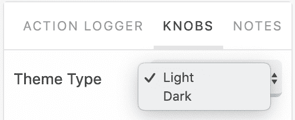

这里是使用此值在`light`和`dark`主题之间进行选择并将其应用于 Material-UI 组件的源代码：

```js
import React, { Fragment } from 'react';

import {
  withStyles,
  createMuiTheme,
  MuiThemeProvider
} from '@material-ui/core/styles';
import Button from '@material-ui/core/Button';
import Dialog from '@material-ui/core/Dialog';
import DialogActions from '@material-ui/core/DialogActions';
import DialogContent from '@material-ui/core/DialogContent';
import DialogContentText from '@material-ui/core/DialogContentText';
import DialogTitle from '@material-ui/core/DialogTitle';

import red from '@material-ui/core/colors/red';
import pink from '@material-ui/core/colors/pink';
import blue from '@material-ui/core/colors/blue';

const styles = theme => ({
  button: { margin: theme.spacing(2) }
});

const light = createMuiTheme({
  palette: {
    type: 'light',
    primary: blue,
    secondary: pink,
    error: { main: red[600] }
  }
});

const dark = createMuiTheme({
  palette: {
    type: 'dark',
    primary: blue,
    secondary: pink,
    error: { main: red[600] }
  }
});

const LightVersusDarkThemes = withStyles(styles)(
  ({ themeType, classes }) => {
    return (
      <MuiThemeProvider theme={{ dark, light }[themeType]}>
        <Dialog open={true}>
          <DialogTitle>Use Google's location service?</DialogTitle>
          <DialogContent>
            <DialogContentText id="alert-dialog-description">
              Let Google help apps determine location. This means
              sending anonymous location data to Google, even when no
              apps are running.
            </DialogContentText>
          </DialogContent>
          <DialogActions>
            <Button color="secondary">Disagree</Button>
            <Button variant="contained" color="primary" autoFocus>
              Agree
            </Button>
          </DialogActions>
        </Dialog>
      </MuiThemeProvider>
    );
  }
);

export default LightVersusDarkThemes;
```

当屏幕首次加载时，你会看到以下对话框：

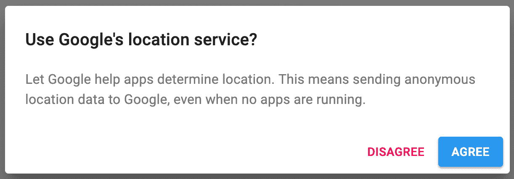

这里是主题类型更改为暗色时的相同对话框：

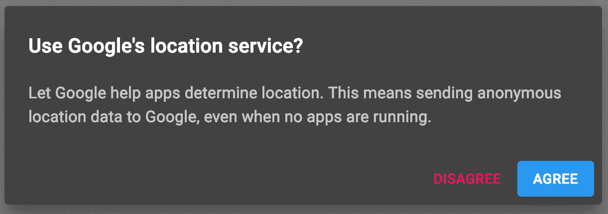

# 它是如何工作的...

当`palette.type`主题值从`light`变为`dark`时，以下调色板值会发生变化：

+   `palette.text`

+   `palette.divider`

+   `palette.background`

+   `palette.action`

让我们看看这个例子中使用的两个主题：

```js
const light = createMuiTheme({
  palette: {
    type: 'light',
    primary: blue,
    secondary: pink,
    error: { main: red[600] }
  }
});

const dark = createMuiTheme({
  palette: {
    type: 'dark',
    primary: blue,
    secondary: pink,
    error: { main: red[600] }
  }
});
```

这两个主题除了 `palette.type` 值相同之外，其他都一样。每次你更改这个值时，都会为该主题计算新的颜色值。例如，你在对话框中看到的新的文本颜色不是静态的——这是一个由 Material-UI 计算的颜色，以便在文本颜色和背景颜色之间提供最佳对比度。

# 相关内容

+   Material-UI `主题` 文档：[`material-ui.com/customization/themes/`](https://material-ui.com/customization/themes/)

# 自定义字体

Material-UI 主题的首选 `字体` 是 **Roboto**。这绝对不是唯一的选择，实际上，你可以安装新的字体并在自定义 Material-UI 主题中使用它们。

# 如何做到这一点...

让我们安装几个新的 `字体` 包，以便它们可用于你的应用程序：

```js
npm install --save typeface-exo typeface-ubuntu
```

接下来，你可以为示例添加一个 Storybook 控制器，允许你切换主题，从而切换字体：

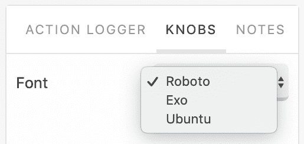

当你首次加载屏幕时，`Dialog` 组件看起来是这样的：

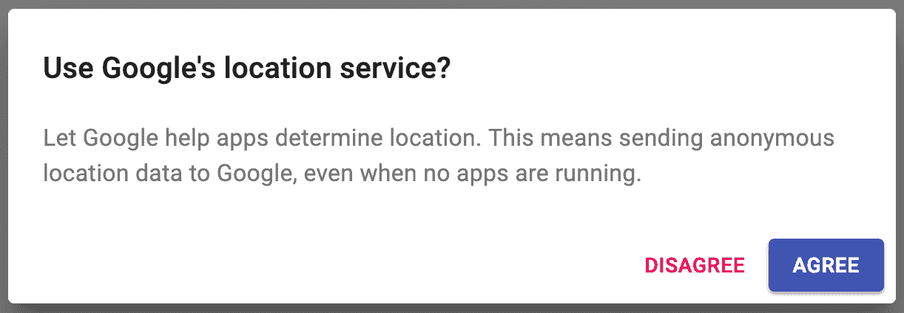

当你将字体类型更改为 Exo 时，`Dialog` 组件看起来是这样的：

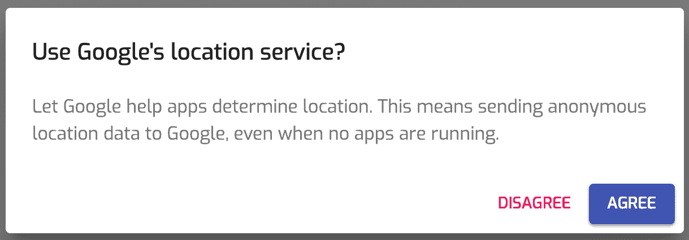

最后，当你将字体类型更改为 Ubuntu 时，`Dialog` 组件看起来是这样的：

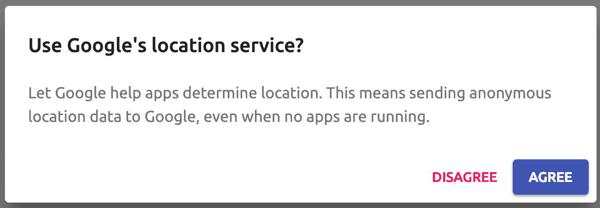

# 它是如何工作的...

在此示例中使用的两种字体已导入：

```js
import 'typeface-exo';
import 'typeface-ubuntu';
```

在实际应用中，你只需 `导入` 你活动主题使用的字体，以减少构建的大小。本书中所有示例中使用的 `roboto` 字体是由 Storybook 的 `index` 文件导入的，因为这是默认主题字体，并在本书的每个示例中使用。

现在你已经导入了字体，你已使字体家族名称可用于主题：

```js
const roboto = createMuiTheme({
  typography: {
    fontFamily: '"Roboto", "Helvetica", "Arial", sans-serif'
  }
});

const exo = createMuiTheme({
  typography: {
    fontFamily: '"Exo", "Roboto", "Helvetica", "Arial", sans-serif'
  }
});

const ubuntu = createMuiTheme({
  typography: {
    fontFamily: '"Ubuntu", "Roboto", "Helvetica", "Arial", sans-serif'
  }
});
```

注意，在 `exo` 和 `ubuntu` 主题中，`roboto` 仍然作为字体家族的一部分使用，因为它是 Material-UI 的首选字体；它是一个很好的后备选项。

# 相关内容

+   Material-UI `主题` 文档：[`material-ui.com/customization/themes/`](https://material-ui.com/customization/themes/)

# 嵌套主题

通过嵌套 `MuiThemeProvider` 组件，你可以将处理主题不同方面的多个主题组合成一个适合在应用程序中使用的单一主题。

# 如何做到这一点...

假设你有一个设置颜色调板的主题和另一个改变边框半径的主题。你可以通过嵌套 `MuiThemeProvider` 组件来合并这两个主题。以下是一个例子：

```js
import React from 'react';

import {
  createMuiTheme,
  MuiThemeProvider
} from '@material-ui/core/styles';
import Button from '@material-ui/core/Button';
import Dialog from '@material-ui/core/Dialog';
import DialogActions from '@material-ui/core/DialogActions';
import DialogContent from '@material-ui/core/DialogContent';
import DialogContentText from '@material-ui/core/DialogContentText';
import DialogTitle from '@material-ui/core/DialogTitle';

import red from '@material-ui/core/colors/red';
import pink from '@material-ui/core/colors/pink';
import blue from '@material-ui/core/colors/blue';

const Blue = createMuiTheme({
  palette: {
    type: 'light',
    primary: blue,
    secondary: pink,
    error: { main: red[600] }
  }
});

const Rounded = theme =>
  createMuiTheme({
    ...theme,
    shape: {
      borderRadius: 8
    }
  });

const NestingThemes = () => (
  <MuiThemeProvider theme={Blue}>
    <MuiThemeProvider theme={Rounded}>
      <Dialog open={true}>
        <DialogTitle>Use Google's location service?</DialogTitle>
        <DialogContent>
          <DialogContentText>
            Let Google help apps determine location. This means
            sending anonymous location data to Google, even when no
            apps are running.
          </DialogContentText>
        </DialogContent>
        <DialogActions>
          <Button color="secondary">Disagree</Button>
          <Button variant="contained" color="primary" autoFocus>
            Agree
          </Button>
        </DialogActions>
      </Dialog>
    </MuiThemeProvider>
  </MuiThemeProvider>
);

export default NestingThemes;
```

当屏幕加载时，你会看到以下内容：

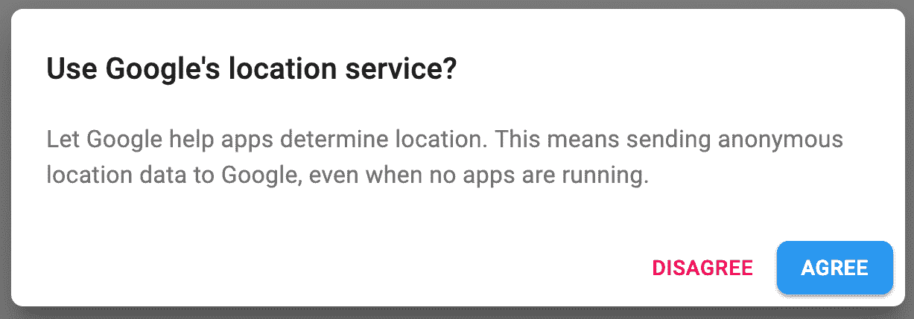

# 它是如何工作的...

`Blue`主题应用颜色调色板`theme`设置，而`Rounded`主题更改`borderRadius`设置。这两个主题都应用于`Dialog`组件——你可以看到蓝色的主要按钮，而且圆角更加圆润。让我们更仔细地看看`Rounded`主题：

```js
const Rounded = theme =>
  createMuiTheme({
    ...theme,
    shape: {
      borderRadius: 8
    }
  });
```

`Rounded`不是一个对象，而是一个返回`theme`对象的函数。当你将函数传递给`MuiThemeProvider`的`theme`属性时，会传递一个`theme`参数。这是外部`theme`，或者在这个例子中，是`Blue`主题。通过将`spread`运算符应用于`theme`参数并传递额外的`theme`值到`createMuiTheme()`，来扩展`theme`。

# 参见

+   Material-UI `theme`文档：[`material-ui.com/customization/themes/`](https://material-ui.com/customization/themes/)

# 理解组件主题设置

**主题**可以覆盖特定于组件类型的样式，例如按钮或抽屉。当你需要将样式更改应用到应用中组件的每个实例时，这非常有用。换句话说，样式是整体主题的一部分，但它只应用于一种类型的组件，而不是例如颜色调色板，它几乎适用于所有 Material-UI 组件。

# 如何操作

假设你想要`Dialog`组件的标题和操作居中。由于你想要在应用中的每个`Dialog`组件上应用相同的样式，因此`theme`是覆盖此设置的合适位置。下面是如何操作的：

```js
import React from 'react';

import {
  createMuiTheme,
  MuiThemeProvider
} from '@material-ui/core/styles';
import Button from '@material-ui/core/Button';
import Dialog from '@material-ui/core/Dialog';
import DialogActions from '@material-ui/core/DialogActions';
import DialogContent from '@material-ui/core/DialogContent';
import DialogContentText from '@material-ui/core/DialogContentText';
import DialogTitle from '@material-ui/core/DialogTitle';

const theme = createMuiTheme({
  overrides: {
    MuiDialogTitle: { root: { textAlign: 'center' } },
    MuiDialogActions: { root: { justifyContent: 'center' } }
  }
});

const ComponentThemeSettings = () => (
  <MuiThemeProvider theme={theme}>
    <Dialog open={true}>
      <DialogTitle>Use Google's location service?</DialogTitle>
      <DialogContent>
        <DialogContentText>
          Let Google help apps determine location. This means sending
          anonymous location data to Google, even when no apps are
          running.
        </DialogContentText>
      </DialogContent>
      <DialogActions>
        <Button color="secondary">Disagree</Button>
        <Button color="primary" autoFocus>
          Agree
        </Button>
      </DialogActions>
    </Dialog>
  </MuiThemeProvider>
);

export default ComponentThemeSettings;
```

下面是自定义对话框的外观：

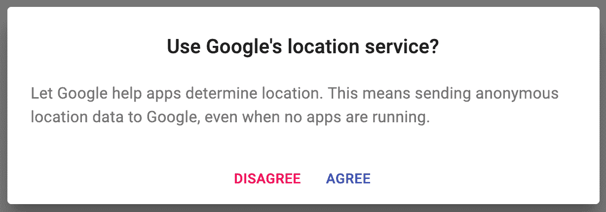

# 它是如何工作的...

让我们更仔细地看看主题的`overrides`部分：

```js
overrides: {
  MuiDialogTitle: { root: { textAlign: 'center' } },
  MuiDialogActions: { root: { justifyContent: 'center' } }
},
```

`MuiDialogTitle`键对应于`DialogTitle`组件，而`MuiDialogActions`键对应于`DialogActions`组件。两个对象中使用的`root`键是规则的名称。在更复杂的组件中，你可以使用这些键来定位组件的特定部分。每个组件的 API 文档详细说明了你可以定位的每个样式规则名称。然后，就是覆盖或提供新的样式的问题。`textAlign`属性默认不在`DialogTitle`组件上设置，所以你添加了它。`justifyContent`设置为`DialogActions`组件的右侧，这意味着你正在覆盖一个现有的值。

# 参见

+   主题覆盖文档：[`material-ui.com/customization/overrides/`](https://material-ui.com/customization/overrides/)
