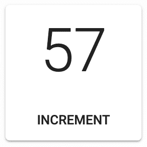
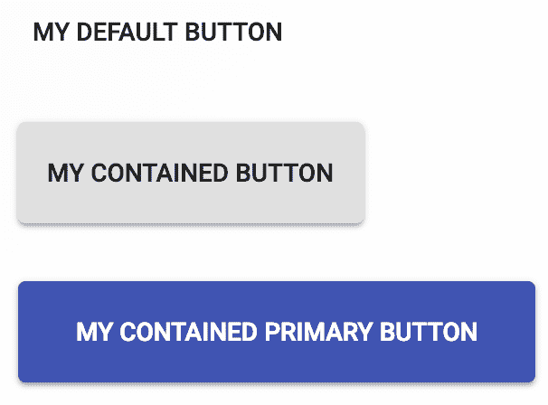

# 样式 - 将样式应用于组件

在本章中，你将学习以下主题：

+   基本组件样式

+   作用域组件样式

+   扩展组件样式

+   将样式移动到主题中

+   其他样式选项

# 简介

应用于 **Material-UI** 组件的大多数样式都是主题样式的一部分。在某些情况下，你可能需要有能力为单个组件设置样式，而不改变主题。例如，一个功能中的按钮可能需要应用特定的样式，而不应该改变应用中的其他按钮。Material-UI 提供了多种方法来为组件整体或组件的特定部分应用自定义样式。

# 基本组件样式

材料设计使用 **JavaScript 样式表**（**JSS**）来为其组件设置样式。你可以使用 Material-UI 提供的实用工具来应用自己的 JSS。

# 如何做到这一点...

`withStyles()` 函数是一个高阶函数，它接受一个样式对象作为参数。它返回的函数将用于样式的组件作为参数。以下是一个示例：

```js
import React, { useState } from 'react';

import { withStyles } from '@material-ui/core/styles';
import Card from '@material-ui/core/Card';
import CardActions from '@material-ui/core/CardActions';
import CardContent from '@material-ui/core/CardContent';
import Button from '@material-ui/core/Button';
import Typography from '@material-ui/core/Typography';

const styles = theme => ({
 card: {
    width: 135,
    height: 135,
    textAlign: 'center'
  },
  cardActions: {
    justifyContent: 'center'
  }
});

const BasicComponentStyles = withStyles(styles)(({ classes }) => {
  const [count, setCount] = useState(0);

  const onIncrement = () => {
    setCount(count + 1);
  };

  return (
    <Card className={classes.card}>
      <CardContent>
        <Typography variant="h2">{count}</Typography>
      </CardContent>
      <CardActions className={classes.cardActions}>
        <Button size="small" onClick={onIncrement}>
          Increment
        </Button>
      </CardActions>
    </Card>
  );
});

export default BasicComponentStyles;
```

这是这个组件的外观：



# 它是如何工作的...

让我们更仔细地看看这个示例中定义的 `styles`：

```js
const styles = theme => ({
  card: {
    width: 135,
    height: 135,
    textAlign: 'center'
  },
  cardActions: {
    justifyContent: 'center'
  }
});
```

你传递给 `withStyles()` 的 `styles` 可以是一个普通对象，也可以是一个返回普通对象的函数，就像这个示例一样。使用函数的好处是，`theme` 值作为参数传递给函数，以防你的 `styles` 需要访问 `theme` 值。在这个示例中定义了两种样式：`card` 和 `cardActions`。你可以把它们看作是 **级联样式表**（**CSS**）类。以下是这两个样式作为 CSS 的样子：

```js
.card {
  width: 135
  height: 135
  text-align: center
}

.cardActions {
  justify-content: center
}
```

通过调用 `withStyles(styles)(MyComponent)`，你返回一个新的组件，它有一个 `classes` 属性。这个对象包含了你现在可以应用于组件的所有类。你不能只是做如下这样的事情：

```js
<Card className="card" />
```

当你定义你的 `styles` 时，它们有自己的构建过程，每个类最终都会得到一个自己的生成名称。这个生成名称就是你在 `classes` 对象中找到的，这就是为什么你会想使用它的原因。

# 更多...

与返回新组件的高阶函数一起工作，你可以利用 Material-UI 样式钩子。这个示例已经依赖于 React 的 `useState()` 钩子，所以在这个组件中使用另一个钩子感觉像是现有模式的一个自然扩展。以下是重构后利用 `makeStyles()` 函数的示例：

```js
import React, { useState } from 'react';

import { makeStyles } from '@material-ui/styles';
import Card from '@material-ui/core/Card';
import CardActions from '@material-ui/core/CardActions';
import CardContent from '@material-ui/core/CardContent';
import Button from '@material-ui/core/Button';
import Typography from '@material-ui/core/Typography';

const useStyles = makeStyles(theme => ({
  card: {
    width: 135,
    height: 135,
    textAlign: 'center'
  },
  cardActions: {
    justifyContent: 'center'
  }
}));

export default function BasicComponentStyles() {
  const classes = useStyles();
  const [count, setCount] = useState(0);

  const onIncrement = () => {
    setCount(count + 1);
  };

  return (
    <Card className={classes.card}>
      <CardContent>
        <Typography variant="h2">{count}</Typography>
      </CardContent>
      <CardActions className={classes.cardActions}>
        <Button size="small" onClick={onIncrement}>
          Increment
        </Button>
      </CardActions>
    </Card>
  );
}
```

`useStyles()` 钩子是通过 `makeStyles()` 函数构建的——它接受与 `withStyles()` 相同的 `styles` 参数。通过在组件内部调用 `useStyles()`，你将拥有你的类对象。另一个需要指出的重要事情是，`makeStyles` 是从 `@material-ui/styles` 而不是 `@material-ui/core/styles` 导入的。

# 相关内容

+   Material-UI CSS in JS 文档：[`material-ui.com/css-in-js/basics/`](https://material-ui.com/css-in-js/basics/).

# 作用域组件样式

大多数 Material-UI 组件都有一个针对组件的特定 CSS API。这意味着，您不需要为每个需要定制的组件分配类名到 `className` 属性，而是可以针对您想要更改的组件的特定方面进行定位。Material-UI 为作用域组件样式奠定了基础；您只需利用这些 API。

# 如何实现...

假设您有以下想要应用到您应用程序中所有 `Button` 组件上的样式定制：

+   默认情况下，每个按钮都需要一个边距。

+   每个使用 `contained` 变体的按钮都应该有额外的顶部和底部填充。

+   每个使用 `contained` 变体和主要颜色的按钮都应该有额外的顶部和底部填充，以及额外的左右填充。

下面是一个示例，展示了如何使用 `Button` CSS API 通过 `styles` 来针对这三种不同的 `Button` 类型：

```js
import React, { Fragment } from 'react';

import { withStyles } from '@material-ui/core/styles';
import Button from '@material-ui/core/Button';

const styles = theme => ({
  root: {
    margin: theme.spacing(2)
  },
  contained: {
    paddingTop: theme.spacing(2),
    paddingBottom: theme.spacing(2)
  },
  containedPrimary: {
    paddingLeft: theme.spacing(4),
    paddingRight: theme.spacing(4)
  }
});

const ScopedComponentStyles = withStyles(styles)(
  ({ classes: { root, contained, containedPrimary } }) => (
    <Fragment>
      <Button classes={{ root }}>My Default Button</Button>
      <Button classes={{ root, contained }} variant="contained">
        My Contained Button
      </Button>
      <Button
        classes={{ root, contained, containedPrimary }}
        variant="contained"
        color="primary"
      >
        My Contained Primary Button
      </Button>
    </Fragment>
  )
);

export default ScopedComponentStyles;
```

下面是三个渲染按钮的样式：



# 它是如何工作的...

`Button` CSS API 接受命名样式并将它们应用到组件上。这些相同的名称也用于此代码中的样式。例如，`root` 应用于每个 `Button` 组件，而 `contained` 只应用于使用 `contained` 变体和 `containedPrimary` 样式的 `Button` 组件，`containedPrimary` 样式只应用于使用 `contained` 变体和 `primary` 颜色的 `Button` 组件。

# 还有更多...

每个样式都是从类属性中解构出来的，然后应用到适当的 `Button` 组件上。然而，您实际上并不需要做所有这些工作。由于 Material-UI CSS API 会以匹配您实际目标的方式将 `styles` 应用到组件上，因此您可以直接将类传递给按钮，并获得相同的结果。以下是这个示例的简化版本：

```js
import React, { Fragment } from 'react';

import { withStyles } from '@material-ui/core/styles';
import Button from '@material-ui/core/Button';

const styles = theme => ({
  root: {
    margin: theme.spacing(2)
  },
  contained: {
    paddingTop: theme.spacing(2),
    paddingBottom: theme.spacing(2)
  },
  containedPrimary: {
    paddingLeft: theme.spacing(4),
    paddingRight: theme.spacing(4)
  }
});

const ScopedComponentStyles = withStyles(styles)(({ classes }) => (
  <Fragment>
    <Button classes={classes}>My Default Button</Button>
    <Button classes={classes} variant="contained">
      My Contained Button
    </Button>
    <Button classes={classes} variant="contained" color="primary">
      My Contained Primary Button
    </Button>
  </Fragment>
));

export default ScopedComponentStyles;
```

输出看起来相同，因为只有符合 CSS API 约束的按钮才会应用样式。例如，第一个 `Button` 将 `root`、`contained` 和 `containedPrimary` 样式传递给类属性，但只有 `root` 被应用，因为它没有使用 `contained` 变体的 `primary` 颜色。第二个 `Button` 也传递了所有三种样式，但只有 `root` 和 `contained` 被应用。第三个 `Button` 因为符合每种样式的标准，所以应用了所有三种样式。

# 参见

+   Material-UI 样式覆盖文档：[`material-ui.com/customization/overrides/`](https://material-ui.com/customization/overrides/).

# 扩展组件样式

你可以用另一个组件应用的`styles`来扩展一个组件应用的`styles`。由于你的`styles`是 JavaScript 对象，一个选项是将一个样式对象扩展到另一个样式对象上。这种方法的唯一问题是，你会在 CSS 输出中得到大量的重复`styles`属性。一个更好的选择是使用`jss`扩展插件。

# 如何做到这一点...

假设你想要渲染三个按钮并共享一些`styles`。一种方法是使用`jss`扩展插件将通用`styles`扩展到更具体的`styles`。下面是如何做到这一点：

```js
import React, { Fragment } from 'react';
import { JssProvider, jss } from 'react-jss';

import {
  withStyles,
  createGenerateClassName
} from '@material-ui/styles';
import {
  createMuiTheme,
  MuiThemeProvider
} from '@material-ui/core/styles';
import Button from '@material-ui/core/Button';

const styles = theme => ({
  root: {
    margin: theme.spacing(2)
  },
  contained: {
    extend: 'root',
    paddingTop: theme.spacing(2),
    paddingBottom: theme.spacing(2)
  },
  containedPrimary: {
    extend: 'contained',
    paddingLeft: theme.spacing(4),
    paddingRight: theme.spacing(4)
  }
});

const App = ({ children }) => (
  <JssProvider
    jss={jss}
    generateClassName={createGenerateClassName()}
  >
    <MuiThemeProvider theme={createMuiTheme()}>
      {children}
    </MuiThemeProvider>
  </JssProvider>
);

const Buttons = withStyles(styles)(({ classes }) => (
  <Fragment>
    <Button className={classes.root}>My Default Button</Button>
    <Button className={classes.contained} variant="contained">
      My Contained Button
    </Button>
    <Button
      className={classes.containedPrimary}
      variant="contained"
      color="primary"
    >
      My Contained Primary Button
    </Button>
  </Fragment>
));

const ExtendingComponentStyles = () => (
  <App>
    <Buttons />
  </App>
);

export default ExtendingComponentStyles;
```

这是渲染后的按钮外观：


# 它是如何工作的...

在你的 Material-UI 应用中使用`jss`扩展插件的最简单方法是使用默认的 JSS 插件预设，这包括`jss`扩展。Material-UI 默认安装了几个 JSS 插件，但`jss`扩展不是其中之一。让我们看看这个例子中的`App`组件，看看这个 JSS 插件是如何提供的：

```js
const App = ({ children }) => (
  <JssProvider
    jss={jss}
    generateClassName={createGenerateClassName()}
  >
    <MuiThemeProvider theme={createMuiTheme()}>
      {children}
    </MuiThemeProvider>
  </JssProvider>
);
```

`JssProvider`组件是 JSS 在 Material-UI 应用中启用的方式。通常，你不需要直接与之交互，但在添加新的 JSS 插件时这是必要的。`jss`属性接受包含`jss extend`插件的 JSS 预设对象。`generateClassName`属性接受一个来自 Material-UI 的函数，该函数有助于生成特定于 Material-UI 的类名。

接下来，让我们更仔细地看看一些`styles`：

```js
const styles = theme => ({
  root: {
    margin: theme.spacing(2)
  },
  contained: {
    extend: 'root',
    paddingTop: theme.spacing(2),
    paddingBottom: theme.spacing(2)
  },
  containedPrimary: {
    extend: 'contained',
    paddingLeft: theme.spacing(4),
    paddingRight: theme.spacing(4)
  }
});
```

`extend`属性接受你想要扩展的样式的名称。在这种情况下，`contained`样式扩展了`root`。`containedPrimary`扩展了`contained`和`root`。现在让我们看看这如何转换为 CSS。这是`root`样式的样子：

```js
.Component-root-1 {
  margin: 16px;
}
```

接下来，这是`包含`样式：

```js
.Component-contained-2 {
  margin: 16px;
  padding-top: 16px;
  padding-bottom: 16px;
}
```

最后，这是`containedPrimary`样式：

```js
.Component-containedPrimary-3 {
  margin: 16px;
  padding-top: 16px;
  padding-left: 32px;
  padding-right: 32px;
  padding-bottom: 16px;
}
```

注意，更通用的属性中的属性包含在更具体的样式里。有一些属性是重复的，但在 CSS 中，你不需要重复 JavaScript 对象属性。此外，你还可以将这些扩展的`styles`放在代码库的更中心位置，这样多个组件就可以使用它们。

# 参见

+   Material-UI JSS 文档：[`material-ui.com/customization/css-in-js/`](https://material-ui.com/customization/css-in-js/)。

# 将样式移动到主题中

随着你开发 Material-UI 应用，你将开始注意到重复出现的样式模式。特别是，应用于一种类型组件（如按钮）的样式会演变成一个主题。

# 如何做到这一点...

让我们回顾一下来自*作用域组件样式*部分的例子：

```js
import React, { Fragment } from 'react';

import { withStyles } from '@material-ui/core/styles';
import Button from '@material-ui/core/Button';

const styles = theme => ({
  root: {
    margin: theme.spacing(2)
  },
  contained: {
    paddingTop: theme.spacing(2),
    paddingBottom: theme.spacing(2)
  },
  containedPrimary: {
    paddingLeft: theme.spacing(4),
    paddingRight: theme.spacing(4)
  }
});

const ScopedComponentStyles = withStyles(styles)(({ classes }) => (
  <Fragment>
    <Button classes={classes}>My Default Button</Button>
    <Button classes={classes} variant="contained">
      My Contained Button
    </Button>
    <Button classes={classes} variant="contained" color="primary">
      My Contained Primary Button
    </Button>
  </Fragment>
));

export default ScopedComponentStyles;
```

这是应用了这些样式后的按钮外观：


现在，假设你已经在应用程序的几个地方实现了这些相同的样式，因为这是你希望按钮看起来的方式。在这个时候，你已经将简单的组件定制发展成了一个主题。当这种情况发生时，你不需要反复实现相同的样式。相反，应该通过使用正确的组件和正确的属性值来自动应用样式。让我们将这些样式移动到`theme`中：

```js
import React from 'react';

import {
  createMuiTheme,
  MuiThemeProvider
} from '@material-ui/core/styles';
import Button from '@material-ui/core/Button';

const defaultTheme = createMuiTheme();

const theme = createMuiTheme({
  overrides: {
    MuiButton: {
      root: {
        margin: 16
      },
      contained: {
        paddingTop: defaultTheme.spacing(2),
        paddingBottom: defaultTheme.spacing(2)
      },
      containedPrimary: {
        paddingLeft: defaultTheme.spacing(4),
        paddingRight: defaultTheme.spacing(4)
      }
    }
  }
});

const MovingStylesToThemes = ({ classes }) => (
  <MuiThemeProvider theme={theme}>
    <Button>My Default Button</Button>
    <Button variant="contained">My Contained Button</Button>
    <Button variant="contained" color="primary">
      My Contained Primary Button
    </Button>
  </MuiThemeProvider>
);

export default MovingStylesToThemes;
```

现在，你可以在不每次都应用相同样式的条件下使用`Button`组件。

# 它是如何工作的...

让我们更仔细地看看你的样式是如何融入 Material-UI 主题的：

```js
overrides: {
  MuiButton: {
    root: {
      margin: 16
    },
    contained: {
      paddingTop: defaultTheme.spacing(2),
      paddingBottom: defaultTheme.spacing(2)
    },
    containedPrimary: {
      paddingLeft: defaultTheme.spacing(4),
      paddingRight: defaultTheme.spacing(4)
    }
  }
}
```

`overrides`属性是一个对象，允许你覆盖主题的特定组件属性。在这种情况下，你想覆盖的是`MuiButton`组件的样式。在`MuiButton`中，你有用于针对组件特定方面的相同 CSS API。这使得将`styles`移动到`theme`中变得简单，因为没有什么需要改变。

在这个示例中必须改变的一点是间距的工作方式。在通过`withStyles()`应用的正常`styles`中，你可以访问当前的主题，因为它作为参数传递。你仍然需要访问间距数据，但由于你不在函数中，所以没有`theme`参数。由于你只是扩展了默认的`theme`，你可以通过调用`createMuiTheme()`而不传递任何参数来访问它，就像这个示例所展示的那样。

# 参考也

+   Material-UI 样式覆盖文档：[`material-ui.com/customization/overrides/`](https://material-ui.com/customization/overrides/)。

# 其他样式选项

除了`withStyles()`之外，你的 Material-UI 应用程序还有其他样式选项。有`styled()`高阶组件函数，它模仿了 styled 组件。你也可以跳出 Material-UI 样式系统，使用内联 CSS 样式或导入 CSS 模块并应用这些样式。

# 如何实现...

这里是一个修改过的`Scoped component styles`示例，展示了你在 Material-UI 应用程序中可用的几种替代样式机制：

```js
import React, { Fragment } from 'react';

import { styled } from '@material-ui/styles';
import Button from '@material-ui/core/Button';

import styles from './OtherStylingOptions.module.css';

const MyStyledButton = styled(Button)({
  margin: 16,
  paddingTop: 16,
  paddingBottom: 16
});

const OtherStylingOptions = () => (
  <Fragment>
    <Button style={{ margin: 16 }}>My Default Button</Button>
    <MyStyledButton variant="contained">
      My Contained Button
    </MyStyledButton>
    <Button
      className={styles.primaryContained}
      variant="contained"
      color="primary"
    >
      My Contained Primary Button
    </Button>
  </Fragment>
);

export default OtherStylingOptions;
```

# 它是如何工作的...

第一个按钮使用内联 CSS 属性，以纯 JavaScript 对象的形式表达，并传递给`Button`组件的`style`属性。第二个`Button`使用`styled()`函数构建一个`MyStyledButton`组件。这个函数与`withStyles`非常相似，主要区别在于它的签名是针对习惯于 styled-component 样式组件方法的人。

第三个`button`使用从导入的 CSS 模块中导入的样式。模块看起来是这样的：

```js
button.primaryContained {
  margin: 16px;
  padding: 16px 32px;
}
```

在使用 CSS 模块和内联样式时要小心。这些方法工作得很好，但由于它们并没有紧密集成到 Material-UI 的样式和主题机制中，因此需要更多的工作来确保你的样式与 Material-UI 组件的其他样式相匹配。

# 参考也

+   Material-UI 样式覆盖文档：[`material-ui.com/customization/overrides/`](https://material-ui.com/customization/overrides/).

+   Material-UI JSS 文档：[`material-ui.com/css-in-js/api/`](https://material-ui.com/css-in-js/api/).
