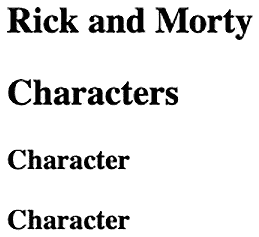

# 第一章：使用 React 创建单页应用程序

当您购买这本书时，您可能已经听说过 React，甚至可能尝试过一些在线可找到的代码示例。这本书的构建方式使得每个章节中的代码示例的复杂度逐渐增加，因此即使您的 React 经验有限，如果您已经阅读了前一章节，每个章节都应该容易理解。到本书结束时，您将了解如何使用 React 及其稳定功能，直到版本 18，并且您还将拥有使用 GraphQL 和 React Native 的经验。

本章首先介绍如何基于流行的电视剧 *Rick and Morty* 构建单页应用程序；该应用程序将向我们提供从外部来源获取的角色信息。我们将应用 React 入门的核心概念，如果您有使用 React 构建应用程序的先前经验，这将容易理解。如果您之前没有使用过 React，也没有问题；本书描述了代码示例中使用的 React 功能。

在本章中，我们将涵盖以下主题：

+   设置新的 React 项目

+   项目结构

让我们开始吧！

# 项目概述

在本章中，我们将使用 React 创建一个单页应用程序，从 API 获取数据，并在浏览器中使用 Webpack 和 Babel 运行。样式将使用 Bootstrap 完成。您将构建的应用程序将展示关于流行电视剧 *Rick and Morty* 的信息，以及图片。

构建时间为 1 小时。

# 开始

本章的完整代码可以在 GitHub 上找到：[`github.com/PacktPublishing/React-Projects-Second-Edition/tree/main/Chapter01`](https://github.com/PacktPublishing/React-Projects-Second-Edition/tree/main/Chapter01)。

对于本书中创建的应用程序，您需要在您的机器上至少安装 Node.js v14.17.0，以便运行 npm 命令。如果您尚未在您的机器上安装 Node.js，请访问 [`nodejs.org/en/download/`](https://nodejs.org/en/download/)，在那里您可以找到 macOS、Windows 和 Linux 的下载说明。

安装 Node.js 后，请在您的命令行中运行以下命令以检查安装的版本：

+   对于 Node.js（应至少为 v14.17.0 或更高版本），请使用以下命令：

    ```js
    node -v
    ```

+   对于 npm（应至少为 v6.14.3 或更高版本），请使用以下命令：

    ```js
    npm -v
    ```

此外，您还应该已经安装了 React 开发者工具插件（适用于 Chrome 和 Firefox）并将其添加到您的浏览器中。此插件可以从 Chrome 网上应用店（[`chrome.google.com/webstore`](https://chrome.google.com/webstore)）或 Firefox 插件（[`addons.mozilla.org`](https://addons.mozilla.org)）安装。

# 创建单页应用程序

在本节中，我们将从头开始创建一个新的单页 React 应用程序，从使用 Webpack 和 Babel 设置新项目开始。从头开始设置 React 项目将帮助您了解项目的基本需求，这对于您创建的任何项目都至关重要。

## 设置项目

每次创建一个新的 React 项目时，第一步是在您的本地机器上创建一个新的目录。由于这是您将要构建的单页应用程序的第一章，因此将此目录命名为`chapter-1`。

在这个新目录中，从命令行执行以下操作：

```js
npm init -y
```

运行此命令将创建一个全新的`package.json`文件，其中包含运行 JavaScript/React 项目所需的最基本信息。通过在命令中添加`-y`标志，我们可以自动跳过设置名称、版本和描述等信息的过程。

运行此命令后，将为项目创建以下`package.json`文件：

```js
{
  "name": "chapter-1",
  "version": "1.0.0",
  "description": "",
  "main": "index.js",
  "scripts": {
    "test": "echo \"Error: no test specified\" && exit 1"
  },
  "keywords": [],
  "author": "",
  "license": "ISC"
}
```

注意

要了解更多关于`package.json`的工作原理，请确保阅读 npm 的文档：[`docs.npmjs.com/cli/v6/configuring-npm/package-json`](https://docs.npmjs.com/cli/v6/configuring-npm/package-json)。

在本节创建`package.json`后，我们就可以添加 Webpack 了，我们将在下一节中这样做。

### 设置 Webpack

要运行 React 应用程序，我们需要安装 Webpack 5（在撰写本文时，Webpack 的当前稳定版本是版本 5）和 Webpack CLI 作为`devDependencies`。Webpack 是一个库，它允许我们创建一个由 JavaScript/React 代码组成的包，可以在浏览器中使用。以下步骤将帮助您设置 Webpack：

1.  使用以下命令从 npm 安装所需的包：

    ```js
    npm install --save-dev webpack webpack-cli
    ```

1.  安装后，这些包将包含在`package.json`文件中，我们可以在`start`和`build`脚本中运行它们。但首先，我们需要将一些文件添加到项目中：

    ```js
    chapter-1
      |- node_modules
      |- package.json
    + |- src
    +    |- index.js
    ```

这将把`index.js`文件添加到一个名为`src`的新目录中。稍后，我们将配置 Webpack，使此文件成为我们应用程序的起点。

1.  首先，必须将以下代码块添加到该文件中：

    ```js
    console.log('Rick and Morty');
    ```

1.  要运行前面的代码，我们将使用 Webpack 将`start`和`build`脚本添加到我们的应用程序中。在本章中不需要测试脚本，因此可以将其删除。此外，`main`字段可以更改为`private`，使用`true`值，因为我们正在构建的是本地项目：

    ```js
      {
        "name": "chapter-1",
        "version": "1.0.0",
        "description": "",
        "main": "index.js",
        "scripts": {
    -     "test": "echo \"Error: no test specified\" && 
                   exit 1"
    +     "start": "webpack --mode development",
    +     "build": "webpack --mode production"
        },
        "keywords": [],
        "author": "",
        "license": "ISC"
      }
    ```

`npm start`命令将以开发模式运行 Webpack，而`npm run build`将使用 Webpack 创建一个生产包。最大的区别是，以生产模式运行 Webpack 将最小化我们的代码并减小项目包的大小。

1.  现在，我们从命令行运行`start`或`build`命令；Webpack 将启动并创建一个名为`dist`的新目录：

    ```js
    chapter-1
      |- node_modules
      |- package.json
    + |- dist
    +    |- main.js 
      |- src
         |- index.js
    ```

1.  在此目录中，将有一个名为 `main.js` 的文件，它包含我们的项目代码，也被称为我们的包。如果成功，以下输出将可见：

    ```js
    asset main.js 794 bytes [compared for emit] (name: main)
    ./src/index.js 31 bytes [built] [code generated]
    webpack compiled successfully in 67 ms
    ```

根据我们是否以开发或生产模式运行 Webpack，此文件中的代码将被最小化。

1.  你可以通过从命令行运行你的包中的 `main.js` 文件来检查你的代码是否工作：

    ```js
    node dist/main.js
    ```

此命令运行我们应用程序的打包版本，并应返回以下输出：

```js
> node dist/main.js
Rick and Morty
```

现在，我们能够从命令行运行 JavaScript 代码。在本节下一部分，我们将学习如何配置 Webpack 以使其与 React 一起工作。

### 配置 Webpack 以与 React 一起工作

现在我们已经为 JavaScript 应用程序设置了一个基本的开发环境，我们可以开始安装运行任何 React 应用程序所需的包。

这些包是 `react` 和 `react-dom`，前者是 React 的通用核心包，后者提供了浏览器 DOM 的入口点并渲染 React。通过在命令行中执行以下命令来安装这些包：

```js
npm install react react-dom
```

仅安装 React 的依赖项不足以运行它，因为默认情况下，并非每个浏览器都能读取你的 JavaScript 代码所使用的格式（如 ES2015+ 或 React）。因此，我们需要将 JavaScript 代码编译成每个浏览器都能读取的格式。

为此，我们将使用 Babel 及其相关包创建一个工具链，以便在浏览器中使用 Webpack 运行 React。这些包可以通过运行以下命令作为 `devDependencies` 安装：

```js
npm install --save-dev @babel/core babel-loader @babel/preset-env @babel/preset-react
```

除了 Babel 核心包之外，我们还将安装 `babel-loader`，这是一个辅助工具，使得 Babel 可以与 Webpack 一起运行，并安装两个预设包。这些预设包有助于确定哪些插件将被用来将我们的 JavaScript 代码编译成浏览器可读的格式（`@babel/preset-env`）以及编译 React 特定的代码（`@babel/preset-react`）。安装了 React 的包和正确的编译器后，下一步是让它们与 Webpack 一起工作，以便在运行我们的应用程序时使用它们。

要做到这一点，需要在项目的 `src` 目录中创建 Webpack 和 Babel 的配置文件：

```js
chapter-1
  |- node_modules
  |- package.json
+ |- babel.config.json
+ |- webpack.config.js
  |- dist
     |- main.js 
  |- src
     |- index.js
```

将 Webpack 的配置添加到 `webpack.config.js` 文件中，以使用 `babel-loader`：

```js
module.exports = {
 module: {
   rules: [
     {
       test: /\.js$/,
       exclude: /node_modules/,
       use: {
         loader: 'babel-loader'
       },
     },
   ],
 },
};
```

此文件中的配置告诉 Webpack 使用 `babel-loader` 处理所有具有 `.js` 扩展名的文件，并排除 `node_modules` 目录中的文件供 Babel 编译器使用。

要使用 Babel 预设，必须在 `babel.config.json` 文件中添加以下配置：

```js
{
  "presets": [
    [
      "@babel/preset-env",
      {
        "targets": {
          "esmodules": true
        }
      }
    ],
    [
      "@babel/preset-react",
      {
        "runtime": "automatic"
      }
    ]
  ]
}
```

`@babel/preset-env` 必须设置为 `esmodules` 以使用最新的 Node 模块。此外，定义 JSX 运行时为 `automatic` 也是必要的，因为 React 18 已经采用了新的 JSX 转换功能：[`reactjs.org/blog/2020/09/22/introducing-the-new-jsx-transform.html`](https://reactjs.org/blog/2020/09/22/introducing-the-new-jsx-transform.html)。

注意

`babel-loader` 的配置也可以放在 `webpack.config.json` 内部的配置中。但通过为这个创建一个单独的 Babel 配置文件，这些设置也可以被 JavaScript/React 生态系统中的其他工具使用。

现在我们已经设置了 Webpack 和 Babel，我们可以从命令行运行 JavaScript 和 React。在本节的下一部分，我们将创建我们的第一个 React 代码，并在浏览器中运行它。

### 渲染 React 项目

使用我们在前面的部分中安装和配置的包来设置 Babel 和 Webpack，我们需要创建一个实际的 React 组件，该组件可以被编译和运行。创建一个新的 React 项目涉及到向项目中添加一些新文件，并修改 Webpack 的设置：

1.  让我们编辑 `src` 目录中已经存在的 `index.js` 文件，以便我们可以使用 `react` 和 `react-dom`。此文件的 内容可以替换为以下内容：

    ```js
    import ReactDOM from 'react-dom/client';
    function App() {
      return <h1>Rick and Morty</h1>;
    }
    const container = document.getElementById('app');
    const root = ReactDOM.createRoot(container);
    root.render(<App />);
    ```

如您所见，此文件导入了 `react` 和 `react-dom` 包，定义了一个简单的组件，该组件返回一个包含您应用程序名称的 `h1` 元素，并且使用 `react-dom` 在浏览器中渲染此组件。代码的最后一行将 `App` 组件挂载到文档中具有 `root` ID 选择器的元素上，这是应用程序的入口点。

1.  我们可以在一个名为 `public` 的新目录中创建一个包含此元素的文件，并将其命名为 `index.html`：

    ```js
    chapter-1
      |- node_modules
      |- package.json
      |- babel.config.json
      |- webpack.config.js
      |- dist
         |- main.js
    + |- public
    +    |- index.html
      |- src
         |- index.js
    ```

1.  在此目录中添加一个名为 `index.html` 的新文件后，我们在其中添加以下代码：

    ```js
    <!DOCTYPE html>
    <html lang="en">
      <head>
        <meta charset="UTF-8" />
        <meta name="viewport" content="width=device-width,
          initial-scale=1.0" />
        <meta http-equiv="X-UA-Compatible" 
          content="ie=edge" />
        <title>Rick and Morty</title>
      </head>
      <body>
        <section id="root"></section>
      </body>
    </html>
    ```

这添加了一个 HTML 标题和正文。在 `head` 标签中是应用程序的标题，在 `body` 标签中是一个具有 "root" ID 选择器的部分。这与我们在 `src/index.js` 文件中挂载 `App` 组件的元素相匹配。

1.  渲染我们的 React 组件的最终步骤是扩展 Webpack，以便在运行时将压缩后的包代码作为脚本添加到 body 标签中。因此，我们应该将 `html-webpack-plugin` 包安装到我们的 `devDependencies` 中：

    ```js
    npm install --save-dev html-webpack-plugin
    ```

要使用这个新包用 React 渲染我们的文件，`webpack.config.js` 文件中的 Webpack 配置必须被扩展：

```js
+ const HtmlWebpackPlugin = 
    require('html-webpack-plugin');
  module.exports = {
    module: {
      rules: [
        {
          test: /\.js$/,
          exclude: /node_modules/,
          use: {
            loader: 'babel-loader',
          },
        },
      ],
    },
+   plugins: [
+     new HtmlWebpackPlugin({
+       template: './public/index.html',
+       filename: './index.html',
+     }),
+   ],
};
```

现在，如果我们再次运行 `npm start`，Webpack 将以开发模式启动，并将 `index.html` 文件添加到 `dist` 目录中。在这个文件中，我们会看到，在我们的 `body` 标签内插入了一个新的 `scripts` 标签，它将我们引导到我们的应用程序捆绑包——即 `dist/main.js` 文件。如果我们在这个浏览器中打开这个文件，或者从命令行运行 `open dist/index.html`，它将直接在浏览器中返回结果。当运行 `npm run build` 命令以启动生产模式下的 Webpack 时，我们可以做同样的事情；唯一的区别是我们的代码将被压缩：


图 1.1 – 在浏览器中渲染 React

通过设置带有 Webpack 的开发服务器，可以加快此过程。我们将在本节的最后部分完成此操作。

### 创建开发服务器

在开发模式下工作期间，每次我们更改应用程序中的文件时，都需要重新运行 `npm start` 命令。由于这有点繁琐，我们将安装另一个名为 `webpack-dev-server` 的包。这个包添加了在每次我们更改项目文件时强制 Webpack 重新启动的选项，并且它通过在内存中管理应用程序文件而不是构建 `dist` 目录来管理我们的应用程序文件。

可以使用 `npm` 安装 `webpack-dev-server` 包：

```js
npm install --save-dev webpack-dev-server
```

此外，我们还需要编辑 `package.json` 文件中的 `dev` 脚本，使其使用 `webpack-dev-server` 而不是 Webpack。这样，每次代码更改后，你就不必重新编译并在浏览器中重新打开捆绑包：

```js
{
    "name": "chapter-1",
    "version": "1.0.0",
    "description": "",
    "private": true,
    "scripts": {
-       "start": "webpack –mode development",
+       "start": "webpack serve –mode development",        
        "build": "webpack –mode production"
    },
    "keywords": [],
    "author": "",
    "license": "ISC"
    …
}
```

上述配置用 `webpack-dev-server` 替换了 `start` 脚本中的 Webpack，它以开发模式运行 Webpack。这将创建一个本地开发服务器，运行应用程序，并确保每次更新任何项目文件时 Webpack 都会重新启动。

从命令行运行以下命令：

```js
npm start
```

这将使本地开发服务器在 `http://localhost:8080/` 上变得活跃，并且每次我们更新项目中的任何文件时，它都会刷新。

现在，我们已经为我们的 React 应用程序创建了基本开发环境，我们将在本章的下一节中进一步开发和结构化它。

# 结构化项目

在设置好开发环境后，是时候开始创建单页应用程序了。在前面的章节中，我们已经在项目中添加了新的目录。但让我们回顾一下项目的当前结构，其中项目根目录下的两个目录很重要：

+   第一个目录称为 `dist`，其中包含 Webpack 打包的应用程序输出。

+   第二个目录称为 `src`，包含我们应用程序的源代码。

    注意

    在我们项目的根目录中还可以找到一个名为 `node_modules` 的目录。这是放置我们使用 `npm` 安装的每个包的源文件的目录。建议您不要对此目录中的文件进行任何手动更改。

在以下子节中，我们将学习如何构建我们的 React 项目。这种结构将在本书的其余章节中也被使用。

## 创建新组件

尽管 React 的官方文档没有说明关于如何结构化我们的 React 项目的首选方法，尽管在社区中有两种常见的方法：要么按功能/页面结构化文件，要么按文件类型结构化。

本章中的单页应用程序将采用混合方法，首先按文件类型结构化文件，其次按功能结构化。在实践中，这意味着将有两种类型的组件：顶层组件，有时也称为容器，以及与这些顶层组件相关的低级组件。创建这些组件需要我们添加以下文件和代码更改：

1.  实现这种结构的第一步是创建一个名为 `components` 的新子目录，位于 `src` 目录下。在这个目录内，创建一个名为 `List.js` 的文件：

    ```js
    chapter-1
      |- node_modules
      |- package.json
      |- babel.config.json
      |- webpack.config.js
      |- dist
         |- main.js
         |- index.html
      |- public
         |- index.html
      |- src
    +    |- components
    +       |- List.js 
         |- index.js
    ```

此文件将返回列出有关 *Rick and Morty* 所有信息的组件：

```js
function List() {
  return <h2>Characters</h2>;
}
export default List;
```

1.  此组件应包含在我们的应用程序入口点中，以便它可见。因此，我们需要在 `src` 目录下的 `index.js` 文件中包含它，并引用它：

    ```js
      import ReactDOM fr'm 'react-dom/client';
    + import List from './components/List';
      function App() {
    -   return <h1>Rick and Morty</h1>;
    +   return (
    +     <div>
    +       <h1>Rick and Morty</h1>
    +       <List />
    +     </div>
    +   );
        }; 

      // ...

    ```

如果我们仍然在运行开发服务器（如果不是，请再次执行 `npm start` 命令），我们会看到我们的应用程序现在在标题下方返回了 **Characters** 标题。

1.  下一步是将组件添加到 `List` 组件中，使其成为一个所谓的组合组件，即由多个组件组成的组件。这个组件将被命名为 `Character`，并且也应该位于名为 `components` 的 `src` 子目录中。在这个目录内，创建一个名为 `Character.js` 的文件，并将以下代码块添加到其中：

    ```js
    function Character() {
      return <h3>Character</h3>;
    };
    export default Character;
    ```

如您从该组件的名称中可能猜到的，它将被用于稍后返回有关 *Rick and Morty* 中角色的信息。

1.  现在，将此 `Character` 组件导入到 `List` 组件中，并在 `h2` 元素之后返回此组件，用以下代码替换 `return` 函数：

    ```js
    + import Character from './Character';
      function List() {
    - return <h2>Characters</h2>;
    + return (
    +   <div>
    +     <h2>Characters</h2>
    +     <Character />
    +     <Character />
    +   </div>
    + );
    }
    export default List;
    ```

如果我们再次在浏览器中访问我们的应用程序 `http://localhost:8080/`，标题和标题下方将显示 **Character** 字样。




图 1.2 – 向 React 添加组件

从这个角度来看，我们无法看到浏览器中正在渲染哪些组件。但幸运的是，我们可以在浏览器中打开 React 开发者工具插件；我们会注意到，应用程序目前由多个堆叠的组件组成：

```js
<App>
    <List>
        <Character>
```

在本节的下一部分，我们将利用我们对构建 React 项目的知识，创建新的组件来检索我们想要在这个单页应用程序中显示的 *Rick and Morty* 的数据。

### 检索数据

随着我们的开发服务器和项目结构都已设置，现在是时候向其中添加一些数据了。为此，我们将使用 *Rick and Morty* REST API ([`rickandmortyapi.com/documentation/#rest`](https://rickandmortyapi.com/documentation/#rest))，该 API 提供了关于这部热门电视剧的信息。

可以使用 JavaScript 中的 `fetch` 方法检索来自 API 的信息，例如，我们的浏览器已经支持此方法。这些数据只会在顶层组件中检索，这意味着我们应该在 `List` 容器中添加一个 `fetch` 函数来检索和存储这些信息。

为了存储信息，我们将使用 React 中的内置状态管理 ([`reactjs.org/docs/state-and-lifecycle.html`](https://reactjs.org/docs/state-and-lifecycle.html))。存储在状态中的任何内容都可以传递给低级组件，之后它们被称为 props。在 React 中使用状态的简单示例是通过使用 `useState` Hook，它可以用来存储和更新变量。每次使用 `useState` Hook 返回的 `update` 方法更改这些变量时，我们的组件都会重新渲染。

注意

自从 16.8.0 版本发布以来，React 采用了 Hooks 的概念，这些是 React 提供的方法，允许您在不使用类组件的情况下使用其核心功能。有关 Hooks 的更多信息，请参阅文档：[`reactjs.org/docs/hooks-intro.html`](https://reactjs.org/docs/hooks-intro.html)。

在添加从 *Rick and Morty* REST API 检索数据的逻辑之前，让我们检查该 API 以查看将返回哪些字段。API 的基本 URL 是 [`rickandmortyapi.com/api`](https://rickandmortyapi.com/api)。

此 URL 返回一个包含此 API 所有可能端点的 JSON 输出，这些端点都是 `GET` 请求，意味着只读，并且通过 `https` 工作。从此基本 URL 开始，我们将使用 `/character` 端点来获取 *Rick and Morty* 中角色的信息。此端点返回的所有信息都不会被使用；以下是我们实际上将使用的字段：

+   `id` (int): 角色的唯一标识符

+   `name` (string): 角色的名字

+   `origin` (object): 包含角色起源名称和链接的对象

+   `image` (string): 角色图像的链接，尺寸为 300 x 300 像素

在检索 *Rick and Morty* 的数据之前，需要准备 `Character` 组件以接收这些信息。为了显示关于 *Rick and Morty* 的信息，我们需要在 `Character` 组件中添加以下行：

```js
- function Character() {
- return <h3>Character</h3>;
+ function Character(character) {
+ return (
+   <div>
+     <h3>{character.name}</h3>
+     
+     <p>{'Origin: ${character.origin && 
        character.origin.name}'}</p>
+   </div>
+ );
};
export default Character;
```

现在，可以通过从 React 中导入 `useState` 并将此 Hook 添加到 `List` 组件中来实现检索数据的逻辑，该组件将包含一个空数组作为字符的占位符：

```js
+ import { useState } from 'react';
  import Character from './Character';
  function List() {
+   const [characters, setCharacters] = useState([]);
    return (
      // ...
```

要进行实际的数据检索，还需要导入另一个 Hook，即 `useEffect` Hook。这个 Hook 可以用来处理副作用，无论是当应用程序挂载时还是当状态或 prop 被更新时。这个 Hook 有两个参数，第一个是一个回调函数，第二个是一个包含此 Hook 所依赖的所有变量的数组——所谓的依赖数组。当这些依赖中的任何一个发生变化时，此 Hook 的回调函数将被调用。当这个数组中没有值时，Hook 将不断被调用。在从源获取数据后，状态将使用结果进行更新。

在我们的应用程序中，我们需要添加此 Hook 并从 API 检索数据，我们应该使用 `async/await` 函数，因为 `fetch` API 返回一个承诺。在检索数据后，`state` 应通过用字符信息替换数据中的空数组来更新：

```js
- import { useState } from 'react';
+ import { useEffect, useState } from 'react';
  import Character from './Character';
  function List() {
    const [characters, setCharacters] = useState([]);
+   useEffect(() => {
+     async function fetchData() {
+       const data = await fetch(
          'https://rickandmortyapi.com/api/character');
+       const { results } = await data.json();
+       setCharacters(results);
+     }
+     fetchData();
+   }, [characters.length]);
  return (
    // ...
```

在 `useEffect` Hook 内部，将调用新的 `fetchData` 函数，因为建议不要直接使用 `async/await` 函数。当 `characters` 状态的长度发生变化时，Hook 仅调用从 API 检索数据的逻辑。你可以通过向应用程序添加一个 `loading` 状态来扩展此逻辑，这样用户就会知道数据仍在被检索：

```js
  function List() {
+   const [loading, setLoading] = useState(true);
    const [characters, setCharacters] = useState([]);
    useEffect(() => {
      async function fetchData() {
        const data = await fetch(
          'https://rickandmortyapi.com/api/character');
        const { results } = await data.json();
        setCharacters(results);
+       setLoading(false);
      }
      fetchData();
    }, [characters.length]);
  return (
    // ...
```

注意

我们之前使用 `fetch` 从 JSON 文件中检索信息的方法没有考虑到对这个文件的请求可能会失败。如果请求失败，`loading` 状态将保持为 `true`，这意味着用户将一直看到加载指示器。如果你想在请求不成功时显示错误消息，你需要将 `fetch` 方法包裹在一个 `try...catch` 块中，这将在本书的后面部分展示。

为了在应用程序中显示字符信息，我们需要将其传递给 `Character` 组件，它最终可以在我们第一步中更改的 `Character` 组件中显示。

当从 API 检索数据时，`loading` 状态为 `true`，所以我们还不能显示 `Character` 组件。当数据检索完成后，加载将变为 `false`，我们可以遍历 `character` 状态，返回 `Character` 组件，并将字符信息作为 props 传递。此组件还将获得一个 `key` prop，这是在迭代中渲染的每个组件所必需的。由于此值需要是唯一的，因此使用字符的 id，如下所示：

```js
  // ...
  return (
    <div>
      <h2>Characters</h2>
-     <Character />
-     <Character />
+     {loading ? (
+       <div>Loading...</div>
+     ) : (
+       characters.map((character) => (
+         <Character
+           key={character.id}
+           name={character.name}
+           origin={character.origin}
+           image={character.image}
+         />
+       ))
+     )}
    </div>
  );
}
export default List;
```

如果我们再次在浏览器中访问我们的应用程序，我们会看到它现在显示了一个字符列表，包括一些基本信息和一张图片。在这个时候，我们的应用程序将类似于以下截图：


图 1.3 – 从本地状态渲染组件列表

如您所见，已经对应用程序应用了有限的样式，并且它只渲染从 API 获取的信息。在下一部分中，我们将使用名为 Bootstrap 的包添加样式。

### 添加样式

只显示角色信息是不够的。我们还需要对项目应用一些基本的样式。通过 Bootstrap 包添加样式到项目，该包根据类名对我们的组件添加样式。

可以使用以下命令从 npm 安装 Bootstrap 并将其添加到`devDependencies`中：

```js
npm install --save-dev bootstrap
```

还需要将此文件导入我们的 React 应用程序的入口点`src/index.js`，这样我们就可以在整个应用程序中使用这些样式：

```js
  import ReactDOM from 'react-dom/client';
  import List from './containers/List';
+ import 'bootstrap/dist/css/bootstrap.min.css';
  function App() {
    // ...    
```

Webpack 无法自行编译 CSS 文件；我们需要添加适当的加载器来实现这一点。我们可以通过运行以下命令来安装这些加载器：

```js
npm install --save-dev css-loader style-loader
```

我们需要将这些包作为规则添加到 Webpack 配置中：

```js
  const HtmlWebpackPlugin = require('html-webpack-plugin');
  module.exports = {
    module: {
      rules: [
        {
          test: /\.js$/,
          exclude: /node_modules/,
          use: {
            loader: 'babel-loader',
          },
        },
+       {
+         test: /\.css$/,
+         use: ['style-loader', 'css-loader'],
+       },
      ],
    },
    plugins: [
      new HtmlWebpackPlugin({
        template: './public/index.html',
        filename: './index.html',
      }),
    ],
  };
```

注意

添加加载器的顺序很重要，因为`css-loader`负责编译 CSS 文件，而`style-loader`将编译后的 CSS 文件添加到 React DOM 中。Webpack 从右到左读取这些设置，CSS 需要在附加到 DOM 之前进行编译。

现在应用程序应该在浏览器中正确运行，并且应该已经从默认的 Bootstrap 样式表中获取了一些小的样式更改。首先让我们对`index.js`文件进行一些更改，并将其样式设置为整个应用程序的容器。我们需要更改渲染到 DOM 中的`App`组件，并将`List`组件包裹在一个`div`容器中：

```js
  // ...
  function App() {
    return (
-     <div>
+     <div className='container'>
        <h1>Rick and Morty</h1>
        <List />
      </div>
    );
  };
  const root = ReactDOM.createRoot(
    document.getElementById('root'));
  root.render(<App />);
```

在`List`组件内部，我们需要设置网格以显示`Characters`组件，这些组件用于显示角色信息。将`map`函数包裹在一个`div`元素中，将其视为 Bootstrap 的行容器：

```js
  // ...
  return (
    <div>
      <h2>Characters</h2>
+     <div className='row'>
        {loading ? (
          <div>Loading...</div>
        ) : (
          // ...
          ))
        )}
+     </div>
    </div>
  );
}
export default List;
```

`Character`组件的代码也必须进行更改，以使用 Bootstrap 添加样式；您可以将该文件的当前内容替换为以下内容：

```js
function Character(character) {
  return (
    <div className='col-3'>
      <div className='card'>
        
        <div className='card-body'>
          <h3 className='card-title'>{character.name}</h3>
          <p>{'Origin: ${character.origin && 
            character.origin.name}'}</p>
        </div>
      </div>
    </div>
  );
};
export default Character;
```

这使我们能够使用 Bootstrap 容器布局，列大小为 3（[`getbootstrap.com/docs/5.0/layout/columns/`](https://getbootstrap.com/docs/5.0/layout/columns/)），并将`Character`组件样式化为 Bootstrap 卡片组件（[`getbootstrap.com/docs/5.0/components/card/`](https://getbootstrap.com/docs/5.0/components/card/))）。

为了添加最后的修饰，打开`index.js`文件并插入以下代码以添加一个标题，该标题将放置在我们的应用程序中*瑞克和莫蒂*角色列表的上方：

```js
  // ...
  function App() {
    return (
      <div className='container'>
-       <h1>Rick and Morty</h1>
+       <nav className='navbar sticky-top navbar-light
          bg-dark'>
+         <h1 className='navbar-brand text-light'>
            Rick and Morty</h1>
+       </nav>
        <List />
      </div>
        );
  // ...

```

确保开发服务器正在运行后，我们会看到应用程序已经通过 Bootstrap 应用了样式，这在浏览器中看起来如下：


图 1.4 – 使用 Bootstrap 样式化的我们的应用程序

Bootstrap 的样式规则已被应用到我们的应用中，使其看起来比之前更加完整。在本节的最后部分，我们将向项目中添加 **ESLint** 包，这将通过在整个项目中同步模式来简化我们代码的维护。

### 添加 ESLint

最后，我们将把 ESLint 添加到项目中，以确保我们的代码符合某些标准——例如，我们的代码遵循正确的 JavaScript 模式。

通过运行以下命令从 npm 安装 ESLint：

```js
npm install --save-dev eslint eslint-webpack-plugin eslint-plugin-react
```

第一个包，名为 `eslint`，是核心包，帮助我们识别 JavaScript 代码中任何可能存在问题的模式。`eslint-webpack-plugin` 是一个由 Webpack 使用，每次我们更新代码时都会运行 ESLint 的包。最后，`eslint-plugin-react` 为 React 应用程序添加了特定的规则。

要配置 ESLint，我们需要在项目的根目录中创建一个名为 `.eslintrc` 的文件，并将以下代码添加到其中：

```js
{
  "env": {
    "browser": true,
    "node": true,
    "es6": true
  },
  "parserOptions": {
    "ecmaVersion": 2020,
    "sourceType": "module"
  },
  "plugins": ["react"],
  "extends": ["eslint:recommended",
              "plugin:react/recommended"],
  "rules": {
    "react/react-in-jsx-scope": "off"
  }
}  
```

`env` 字段设置了代码实际运行的环境，并将使用其中的 `es6` 函数，而 `parserOptions` 字段为使用 `jsx` 和现代 JavaScript 添加了额外的配置。然而，有趣的地方在于 `plugins` 字段，这是我们指定代码使用 `react` 作为框架的地方。`extends` 字段用于使用 `eslint` 的推荐设置，以及 React 的特定框架设置。此外，`rules` 字段包含一个规则来禁用关于 React 未导入的通知，因为在 React 18 中这不再需要。

注意

我们可以通过运行 `eslint --init` 命令来创建自定义设置，但推荐使用前面的设置，以确保我们 React 代码的稳定性。

如果我们查看命令行或浏览器，我们将看到没有错误。然而，我们必须将 `eslint-webpack-plugin` 包添加到 Webpack 配置中。在 `webpack.config.js` 文件中，您需要导入此包并将其添加到配置中：

```js
  const HtmlWebpackPlugin = require('html-webpack-plugin');
+ const ESLintPlugin = require('eslint-webpack-plugin');
  module.exports = {
    // ...
    plugins: [
      new HtmlWebpackPlugin({
        template: './public/index.html',
        filename: './index.html',
      }),
+     new ESLintPlugin(),
    ],
  };
```

通过重启开发服务器，Webpack 现在将使用 ESLint 检查我们的 JavaScript 代码是否遵守 ESLint 的配置。在我们的命令行（或浏览器中的 **控制台** 选项卡），任何 React（或 JavaScript）功能的误用都将显示出来。

恭喜！您已经使用 React、ReactDOM、Webpack、Babel 和 ESLint 从零开始创建了一个基本的 React 应用程序。

# 摘要

在本章中，您从零开始创建了一个 React 单页应用程序，并学习了核心的 React 概念。本章从您使用 Webpack 和 Babel 创建新项目开始。这些库帮助您在浏览器中以最小的设置编译和运行您的 JavaScript 和 React 代码。然后，我们描述了如何构建一个 React 应用程序，这个结构将在整本书中使用。此外，您还学习了使用 React Hooks 进行状态管理和数据获取，以及使用 Bootstrap 进行基本样式设计。应用的原则为您提供了从零开始创建 React 应用程序并按可扩展方式构建它们的基础。

如果您之前使用过 React，那么这些概念可能并不难理解。如果您没有，那么请不要担心，如果某些概念让您感到陌生。接下来的章节将基于本章使用的功能，给您足够的时间完全理解它们。

在下一章中，您将构建的项目将专注于创建具有更高级样式的可重用 React 组件。这将离线可用，因为它将被设置为**渐进式 Web 应用程序**（**PWA**）。

# 进一步阅读

+   React 思维：[`reactjs.org/docs/thinking-in-react.html`](https://reactjs.org/docs/thinking-in-react.html)

+   Bootstrap: [`getbootstrap.com/docs/4.3/getting-started/introduction/`](https://getbootstrap.com/docs/4.3/getting-started/introduction/)

+   ESLint: [`eslint.org/docs/user-guide/getting-started`](https://eslint.org/docs/user-guide/getting-started)
