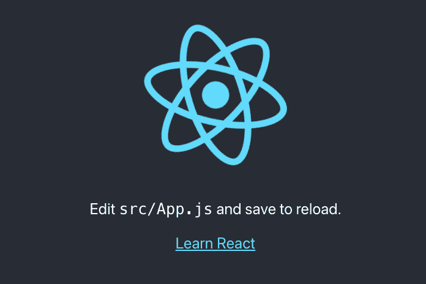
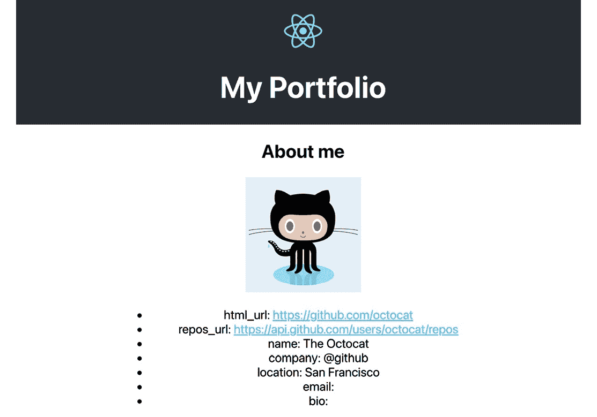
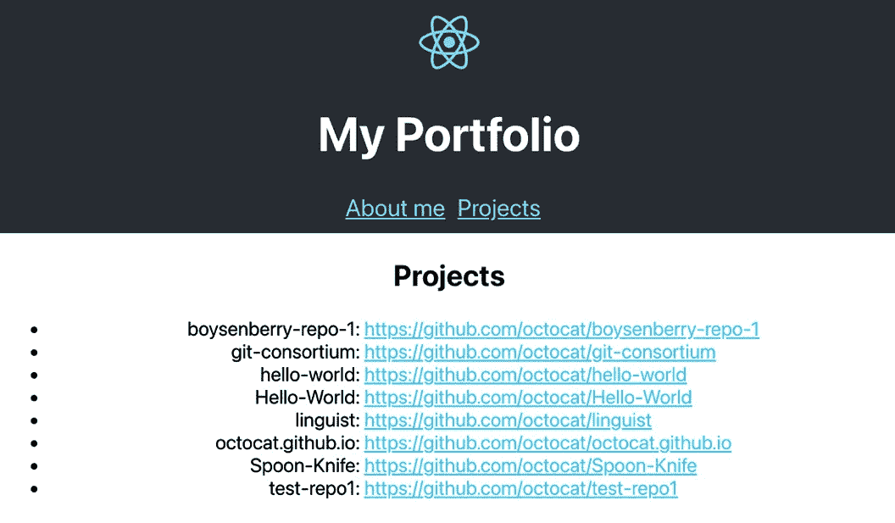

# *第二章*: 使用可重用组件和路由创建 React 个人作品集

完成第一章后，你是否已经熟悉了 React 的核心概念？太好了！本章对你来说将不成问题！如果不熟悉，别担心——你在上一章中遇到的大多数概念都会被重复。然而，如果你想更多地了解 Webpack 和 Babel，建议你再次尝试在 *第一章* 中创建项目，即 *创建 React 单页应用程序*，因为本章不会涉及这些主题。

在本章中，你将使用 **Create React App**，这是 React 核心团队创建的一个启动工具，可以帮助你快速开始使用 React。它将使模块打包器和编译器（如 Webpack 和 Babel）的配置变得不必要，因为 Create React App 包会处理这些。这意味着你可以专注于构建你的个人作品集应用程序，该应用程序重用 React 组件并具有路由。除此之外，我们还将使用 react-router v6 添加路由，这是 React 中路由的领先库。

在设置 Create React App 的同时，本章将涵盖以下主题：

+   使用 Create React App 创建新项目

+   构建可重用 React 组件

+   使用 react-router 进行路由

等不及了？让我们开始吧！

# 项目概述

在本章中，我们将使用 Create React App 和 `styled-components` 创建一个应用程序，该应用程序利用可重用的 React 组件和样式。该应用程序将使用从公共 GitHub API 获取的数据。

构建时间约为 1.5-2 小时。

# 入门

本章中你将创建的项目将使用来自 GitHub 的公共 API，你可以在 [`docs.github.com/en/rest`](https://docs.github.com/en/rest) 找到这些 API。要使用此 API，你需要有一个 GitHub 账户，因为你将需要从 GitHub 用户账户中检索信息。如果你还没有 GitHub 账户，你可以在 GitHub 网站上创建一个。此应用程序的完整源代码也可以在 GitHub 上找到：[`github.com/PacktPublishing/React-Projects-Second-Edition/tree/main/Chapter02`](https://github.com/PacktPublishing/React-Projects-Second-Edition/tree/main/Chapter02)。

# 使用 React 创建个人作品集

在本节中，我们将学习如何使用 Create React App 创建一个新的 React 项目，并使用 `react-router` 添加可重用的 React 组件和路由。

## 使用 Create React App 创建个人作品集

每次创建新的 React 项目时都需要配置 Webpack 和 Babel，这可能会非常耗时。此外，每个项目的设置都可能发生变化，当我们想要向项目中添加新功能时，管理所有这些配置会变得很困难。

因此，React 核心团队引入了一个名为 Create React App 的启动工具包，目前版本为 5。通过使用 Create React App，我们不再需要担心管理编译和构建配置，即使 React 发布了新版本也是如此，这意味着我们可以专注于编码而不是配置。

本节将向我们展示如何使用 Create React App 创建一个 React 应用程序。

在做任何事情之前，让我们看看如何安装 Create React App。

## 安装 Create React App

Create React App 不必全局安装。相反，我们可以使用 `npx`，这是一个与 npm（v5.2.0 或更高版本）预安装的工具，它简化了我们执行 `npm` 包的方式：

```js
npx create-react-app chapter-2
```

这将启动 Create React App 的安装过程，这可能需要几分钟，具体取决于您的硬件。尽管我们只执行了一个命令，但 Create React App 的安装程序将安装我们运行 React 应用程序所需的包。因此，它将安装 `react`、`react-dom` 和 `react-scripts`，最后一个包包含了编译、运行和构建 React 应用程序的配置。

如果我们进入项目的根目录，该目录以我们的项目名称命名，我们会看到它具有以下结构：

```js
chapter-2
  |- node_modules
  |- package.json
  |- public
     |- index.html
  |- src
     |- App.css
     |- App.test.js
     |- App.js
     |- index.css
     |- index.js
```

注意

并非所有由 Create React App 创建的文件都被列出；相反，只有本章中使用的文件被列出。

这种结构看起来与我们第一章节中设置的结构非常相似，尽管有一些细微的差别。`public` 目录包含了所有不应该包含在编译和构建过程中的文件，而这个目录内的文件是唯一可以直接在 `index.html` 文件中使用的文件。

在另一个名为 `src` 的目录中，我们将找到在执行 `package.json` 文件中任何脚本时将被编译和构建的所有文件。有一个名为 `App` 的组件，它由 `App.js`、`App.test.js` 和 `App.css` 文件定义，还有一个名为 `index.js` 的文件，它是 Create React App 的入口点。

如果我们打开 `package.json` 文件，我们会看到已经定义了四个脚本：`start`、`build`、`test` 和 `eject`。由于最后两个在此阶段尚未处理，我们可以暂时忽略这两个脚本。为了能够在浏览器中打开项目，我们只需在命令行中输入以下命令，这将以开发模式运行 `package react-scripts`：

```js
npm start
```

注意

除了 `npm start`，我们还可以运行 `yarn start`，因为 Create React App 推荐使用 Yarn。

如果我们访问 [`localhost:3000/`](http://localhost:3000/)，默认的 Create React App 页面将如下所示：



图 2.1 – 默认的 Create React App 模板

由于`react-scripts`默认支持热重载，我们对代码所做的任何更改都将导致页面重新加载。如果我们运行构建脚本，项目根目录中将会创建一个名为`build`的新目录，其中可以找到我们应用程序的压缩包。

在 Create React App 的基本安装完成后，我们将开始创建我们项目的组件并对它们进行样式设计。

## 构建可重用的 React 组件

在上一章中简要讨论了使用 JSX 创建 React 组件，但在这章中，我们将通过创建可以在整个应用程序中重用的组件来进一步探讨这个主题。首先，让我们看看如何构建我们的应用程序，这是基于上一章的内容。

## 构建应用程序结构

我们的项目仍然只包含一个组件，这并不使其非常可重用。为了开始，我们需要以与第一章相同的方式构建我们的应用程序。这意味着我们需要将`App`组件拆分成多个更小的组件。如果我们查看`App.js`中此组件的源代码，我们会看到在`return`函数中已经有一个 CSS `header`元素。让我们将这个`header`元素改为 React 组件：

1.  首先，在`src`目录下的`components`新目录中创建一个名为`Header.css`的新文件，并将`classNames`、`App-header`、`App-logo`和`App-link`的样式复制到其中：

    ```js
    .App-logo {
      height: 40vmin;
      pointer-events: none;
    }
    @media (prefers-reduced-motion: no-preference) {
      .App-logo {
        animation: App-logo-spin infinite 20s linear;
      }
    }
    .App-header {
      background-color: #282c34;
      min-height: 100vh;
      display: flex;
      flex-direction: column;
      align-items: center;
      justify-content: center;
      font-size: calc(10px + 2vmin);
      color: white;
    }
    .App-link {
      color: #61dafb;
    }
    @keyframes App-logo-spin {
      from {
        transform: rotate(0deg);
      }
      to {
        transform: rotate(360deg);
      }
    }
    ```

1.  现在，在这个目录中创建一个名为`Header.js`的文件。此文件应返回与`<header>`元素相同的内容：

    ```js
    import './Header.css';
    function Header() {
      return (
        <header className='App-header'>
          
          <p>Edit <code>src/App.js</code> 
            and save to reload. </p>
          <a
            className='App-link'
            href='https://reactjs.org'
            target='_blank'
            rel='noopener noreferrer'
          >
            Learn React
          </a>
        </header>
      );
    }
    export default Header;
    ```

1.  在你的`App`组件中导入此`Header`组件并将其添加到`return`函数中：

    ```js
    + import Header from './components/Header';
      import './App.css';
      import logo from './logo.svg';
      function App() {
        return (
          <div className="App">
    -       <header className='App-header'>
    -        
    -        <p>Edit <code>src/App.js</code> and save to
               reload. </p>
    -        <a
    -          className='App-link'
    -          href='https://reactjs.org'
    -          target='_blank'
    -          rel='noopener noreferrer'
    -        >
    -         Learn React
    -       <a>
    -     </header>
    +     <Header />
        </div>
      );
    }
    export default App;
    ```

需要从`App.css`中删除标题的样式。此文件应只包含以下样式定义：

```js
.App { 
  text-align: center; 
} 
.App-link { 
  color: #61dafb; 
}
```

当我们再次在浏览器中访问我们的项目时，我们会看到一个错误，表明 logo 的值未定义。这是因为新的`Header`组件无法访问在`App`组件内部定义的`logo`常量。根据我们在第一章中学到的知识，我们知道这个`logo`常量应该作为属性添加到`Header`组件中，以便它可以显示。现在让我们这样做：

1.  将`logo`常量作为属性发送到`src/App.js`中的`Header`组件：

    ```js
    // ...
    function App() {
       return (
         <div className='App'>
    -      <Header />
    +      <Header logo={logo} />
         </div>
       );
     }
    }
    export default App;
    ```

1.  获取`logo`属性，以便可以在`src/components/Header.js`中的`img`元素作为`src`属性使用：

    ```js
      import './Header.css';
    - function Header() {
    + function Header({ logo }) {
        return (
          <header className='App-header'>
            // ...
    ```

在这里，当我们用浏览器打开项目时，我们不会看到任何可见的变化。但如果我们打开 React 开发者工具，我们会看到项目现在被分为一个`App`组件和一个`Header`组件。此组件以`.svg`文件的形式接收`logo`属性，如下面的截图所示：

![Figure 2.2 – The React Developer Tools]

![img/Figure_2.2_B17390.jpg]

![Figure 2.2 – The React Developer Tools]

`Header`组件仍然被分割成多个元素，这些元素可以被分割成单独的组件。观察`img`和`p`元素，它们看起来已经很简单了。然而，`a`元素看起来更复杂，并具有诸如`url`、`title`和`className`等属性。为了将这个`a`元素转换成一个可重用的组件，我们需要将其移动到我们项目的不同位置。

要做到这一点，在`components`目录中创建一个名为`Link.js`的新文件。此文件应该返回我们在`Header`组件中已经得到的相同的`a`元素。此外，我们还可以将`url`和`title`作为属性发送到这个组件。现在让我们这样做：

1.  从`src/components/Header.css`中删除`App-link`类的样式，并将其放置在一个名为`Link.css`的文件中：

    ```js
    .App-link {
        color: #61dafb;
    }
    ```

1.  创建一个名为`Link`的新组件，该组件接受`url`和`title`属性。此组件将这些属性作为属性添加到`src/components/Link.js`中的`<a>`元素：

    ```js
    import './Link.css';
    function Link({ url, title }) {
      return (
        <a
          className='App-link'
          href={url}
          target='_blank'
          rel='noopener noreferrer'
        >
          {title}
        </a>
      );
    };
    export default Link;
    ```

1.  在`src/components/Header.js`中导入此`Link`组件并将其放置在`Header`组件内部：

    ```js
    + import Link from './Link.js';
      import './Header.css';
      function Header({ logo }) {
        return (
          <header className='App-header'>
            
            <p>Edit <code>src/App.js</code> and save to 
              reload. </p>
    -       <a
    -         className='App-link'
    -         href='https://reactjs.org'
    -         target='_blank'
    -         rel='noopener noreferrer'
    -        >
    -          Learn React
    -       <a>
    +       <Link 
    +         url='https://reactjs.org'
    +         title='Learn React' 
    +        />
        </header>
      );
    }
    export default Header;
    ```

1.  我们现在的代码应该看起来像以下这样，这意味着我们已经成功将`App`组件分割成`components`目录中的不同文件。此外，`logo.svg`文件可以被移动到一个名为`assets`的新目录：

    ```js
    chapter-2
      |- node_modules
      |- package.json
      |- public
         |- index.html
      |- src
         |- assets
            |- logo.svg
         |- components
            |- Header.css
            |- Header.js
            |- Link.css
            |- Link.js
         |- App.css
         |- App.js 
         |- index.css
         |- index.js
    ```

1.  不要忘记也更改`src/App.js`文件中的`import`语句，其中`logo.svg`文件被导入为一个组件：

    ```js
      import Header from './components/Header';
      import './App.css';
    - import logo from './logo.svg';
    + import logo from './assets/logo.svg';
      function App() {
        return (
          // ...
    ```

然而，如果我们查看浏览器中的项目，则没有明显的更改。然而，在 React 开发者工具中，我们应用程序的结构已经形成。`App`组件在组件树中显示为父组件，而`Header`组件是一个子组件，它将`Link`作为子组件。

在本节的下一部分，我们将向此应用程序的组件树中添加更多组件，并使它们在整个应用程序中可重用。

## 在 React 中重用组件

本章中我们正在构建的项目是一个个人作品集页面；它将展示我们的公开信息和公开仓库列表。因此，我们需要获取官方 GitHub REST API（v3）并从两个端点获取信息。在第一章中，我们已经执行了数据获取操作，但这次信息不会来自本地 JSON 文件。获取信息的方法几乎相同。我们将使用`fetch` API 来完成此操作。

我们可以通过执行以下命令从 GitHub 获取我们的公开 GitHub 信息（将代码加粗部分的末尾的`username`替换为你的用户名）：

```js
curl 'https://api.github.com/users/username'
```

注意

如果你没有 GitHub 个人资料或者还没有填写所有必要的信息，你也可以使用`octocat`用户名。这是 GitHub 的吉祥物用户名，并且已经填充了示例数据。

此请求将返回以下输出：

```js
{
  "login": "octocat",
  "id": 583231,
  "node_id": "MDQ6VXNlcjU4MzIzMQ==",
"avatar_url": 
    "https://avatars.githubusercontent.com/u/583231?v=4",
  "gravatar_id": "",
  "url": "https://api.github.com/users/octocat",
  "html_url": "https://github.com/octocat",
  "followers_url":
    "https://api.github.com/users/octocat/followers",
  "following_url":
    "https://api.github.com/users/octocat/following{
      /other_user}",
  "gists_url": 
    "https://api.github.com/users/octocat/gists{/gist_id}",
  "starred_url":
    "https://api.github.com/users/octocat/starred{/owner}{
      /repo}",
  "subscriptions_url": 
    "https://api.github.com/users/octocat/subscriptions",
  "organizations_url":
    "https://api.github.com/users/octocat/orgs",
  "repos_url":
    "https://api.github.com/users/octocat/repos",
  "type": "User",
  "site_admin": false,
  "name": "The Octocat",
  "company": "@github",
  "blog": "https://github.blog",
  "location": "San Francisco",
  "email": null,
  "hireable": null,
  "bio": null,
  "twitter_username": null,
  "public_repos": 8,
  "public_gists": 8,
  "followers": 3555,
  "following": 9
}
```

JSON 输出中的多个字段被突出显示，因为这些是我们将在应用程序中使用的字段。这些是`avatar_url`、`html_url`、`repos_url`、`name`、`company`、`location`、`email`和`bio`，其中`repos_url`字段的值实际上是我们需要调用的另一个 API 端点，以检索此用户的全部仓库。这是我们将在本章后面完成的事情。

由于我们想在应用程序中显示这个结果，我们需要做以下事情：

1.  要从 GitHub 检索这些公开信息，请在新的目录`pages`中创建一个名为`Profile`的新组件。这个目录将持有代表我们应用程序中页面的所有组件。在这个文件中，将以下代码添加到`src/pages/Profile.js`：

    ```js
    import { useState, useEffect } from 'react';
    function Profile({ userName }) {
      const [loading, setLoading] = useState(false);
      const [profile, setProfile] = useState({});
      useEffect(() => {
        async function fetchData() {
          const profile = await fetch(
            'https://api.github.com/users/${userName}');
          const result = await profile.json();
          if (result) {
            setProfile(result);
            setLoading(false);
          }
        }
        fetchData();
      }, [userName]);
      return (
        <div>
          <h2>About me</h2>
          {loading ? (
            <span>Loading...</span>
          ) : (
            <ul></ul>
          )}
        </div>
       );
    }
    export default Profile;
    ```

这个新组件从 React 中导入了两个 Hooks，用于处理状态管理和生命周期。我们在上一章中已经使用了`useState` Hook，用于创建`loading`和`profile`的状态。在第二个 Hook 中，即`useEffect` Hook 中，我们从 GitHub API 进行异步数据获取。由于我们还需要创建新的组件来显示数据，因此还没有渲染任何结果。

1.  现在，将这个新组件导入到`App`组件中，并将`userName`属性传递给它。如果您没有 GitHub 账户，可以使用用户名`octocat`：

    ```js
      import Header from './Header';
    + import Profile from './pages/Profile';
      import './App.css';
      function App() {
        return (
          <div className='App'>
            <Header logo={logo} />
    +       <Profile userName="octocat" />
          </div>
        );
      }
    }
    export default App;
    ```

1.  快速查看运行我们项目的浏览器，我们可以看到这个新的`Profile`组件目前还不可见。这是因为`Header.css`文件中有一个`height`属性，其`view-height`值为`100`，这意味着该组件将占用页面的整个高度。要更改这一点，请打开`src/components/Header.css`文件，并更改以下突出显示的行：

    ```js
      .App-logo {
    -   height: 40vmin;
    +   height: 60px;
        pointer-events: none;
      }
      // ... 
      .App-header {
        background-color: #282c34;
    -   min-height: 100vh;
    +   min-height: 100%;
        display: flex;
        flex-direction: column;
        align-items: center;
        justify-content: center;
        font-size: calc(10px + 2vmin);
        color: white;
      }
    ```

1.  页面上应该有足够的空间来显示`Profile`组件，因此我们可以再次打开`scr/pages/Profile.js`文件，并显示 GitHub API 返回的`avatar_url`、`html_url`、`repos_url`、`name`、`company`、`location`、`email`和`bio`字段：

    ```js
      // ...
      return (
        <div>
          <h2>About me</h2> 
          {loading ? (
            <span>Loading...</span>
          ) : (
            <ul>
    +         <li><span>avatar_url: </span>
                {profile.avatar_url}</li>
    +         <li><span>html_url: </span> 
                {profile.html_url}</li>
    +         <li><span>repos_url: </span> 
                {profile.repos_url}</li>
    +         <li><span>name: </span> {profile.name}</li>
    +         <li><span>company: </span>
                {profile.company}</li>
    +         <li><span>location: </span>
                {profile.location}</li>
    +         <li><span>email: </span>
                {profile.email}</li>
    +         <li><span>bio: </span> {profile.bio}</li>
            </ul>
          )}
        </div>
      );
    }
    export default Profile;
    ```

保存此文件并访问浏览器中的项目后，我们将看到 GitHub 信息的子弹列表正在显示。

由于这看起来不太美观，并且标题与页面内容不匹配，让我们对这两个组件的`styling`文件做一些更改：

1.  更改`Header`组件的代码，使其显示页面不同的标题。此外，可以删除此处的`Link`组件，因为我们将在后面的`Profile`组件中使用它：

    ```js
      import './Header.css';
    - import Link from './Link';
      function Header({ logo }) {
        return (
          <header className='App-header'>
            
    -       <p>
    -         Edit <code>src/App.js</code> and save to
                reload.
    -       </p>
    -       <Link url='https://reactjs.org' 
              title='Learn React' />
    +       <h1>My Portfolio</h1>
          </header>
        );
      }
      export default Header;
    ```

1.  在更改`Profile`组件的样式之前，我们首先需要创建一个 CSS 文件，该文件将包含组件的样式规则。为此，在`pages`目录中创建`Profile.css`文件，并添加以下内容：

    ```js
    .Profile-container {
      width: 50%;
      margin: 10px auto;
    }
    .Profile-avatar {
      width: 150px;
    }
    .Profile-container > ul {
      list-style: none;
      padding: 0;
      text-align: left;
    }
    .Profile-container > ul > li {
      display: flex;
      justify-content: space-between;
    }
    .Profile-container > ul > li > span {
      font-weight: 600;
    }
    ```

1.  在 `src/pages/Profile.js` 中，我们需要导入此文件以应用样式。还记得我们之前创建的 `Link` 组件吗？我们也导入此文件，因为它将被用于创建链接到我们的个人资料和 GitHub 网站上的仓库列表：

    ```js
      import { useState, useEffect } from 'react';
    + import Link from '../components/Link';
    + import './Profile.css';
      function Profile({ userName }) {

        // ..
    ```

1.  在 `return` 语句中，我们将添加我们在样式定义中定义的 `classNames` 函数，并将头像图像与项目符号列表分开。通过这样做，我们还需要将项目符号列表包裹在一个额外的 `div` 中：

    ```js
      // ...
      return (
    -   <div>
    +   <div className='Profile-container'>    
          <h2>About me</h2>
          {loading ? (
            <span>Loading...</span>
          ) : (
    +       <div>
    +         
              <ul>
    -           <li><span>avatar_url: </span>
                  {profile.avatar_url}</li>
    -           <li><span>html_url: </span>
                  {profile.html_url}</li>
    -           <li><span>repos_url: </span>
                  {profile.repos_url}</li>
    +           <li>
    +             <span>html_url: </span>
    +             <Link url={profile.html_url}
                   title={profile.html_url} />
    +           </li>
    +           <li>
    +             <span>repos_url: </span>
    +             <Link url={profile.repos_url} 
                    title={profile.repos_url} />
    +           </li>
                <li><span>name: </span>
                  {profile.name}</li>
                <li><span>company: </span>
                  {profile.company}</li>
                <li><span>location: </span>
                  {profile.location}</li>
                <li><span>email: </span>
                  {profile.email}</li>
                <li><span>bio: </span> {profile.bio}</li>
             </ul>
    +      </div>
         );
       }
       // ..
    ```

最后，我们可以看到应用程序开始看起来像一个加载你的 GitHub 信息的投资组合页面，包括你的头像和公共信息列表。这导致了一个看起来类似于以下截图的应用程序：



图 2.3 – 我们定制的投资组合应用程序

如果我们查看 `Profile` 组件中的代码，我们会看到有很多重复的代码，因此我们需要将显示我们公共信息的列表转换为一个单独的组件。让我们开始吧：

1.  在 `components` 目录内创建一个名为 `List.js` 的新文件，它将接受一个名为 `items` 的属性：

    ```js
    function List({ items }) {
      return (
        <ul></ul>
      );
    }
    export default List;
    ```

1.  在 `Profile` 组件中，我们可以导入这个新的 `List` 组件。应该创建一个名为 `items` 的新变量，它是一个包含我们想要在此列表中显示的所有项目的数组：

    ```js
      import { useState, useEffect } from 'react';
    + import List from '../components/List';
      import Link from '../components/Link';
      import './Profile.css';
      function Profile({ userName }) {
        // …
    +   const items = [
    +     {
    +       field: 'html_url',
    +       value: <Link url={profile.html_url} 
              title={profile.html_url} />,
    +     },
    +     {
    +       field: 'repos_url',
    +       value: <Link url={profile.repos_url}
              title={profile.repos_url} />,
    +     },
    +     { field: 'name', value: profile.name },
    +     { field: 'company', value: profile.company },
    +     { field: 'location', value: profile.location },
    +     { field: 'email', value: profile.email },
    +     { field: 'bio', value: profile.bio },
    +   ];
        // ...
    ```

1.  这将作为属性发送到 `List` 组件，因此这些项目可以从该组件中渲染。这意味着你可以删除 `ul` 元素以及其中所有的 `li` 元素：

    ```js
        // ...  
        return (
          <div className='Profile-container'>
            <h2>About me</h2>
            {loading ? (
              <span>Loading...</span>
            ) : (
              <div>
                
    -           <ul>
    -             // ...
    -           </ul>
    +           <List items={items} />
              </div>
            )}
          </div>
        );
      }
    export default Profile;
    ```

你可以看到，对于具有 `html_url` 和 `repos_url` 字段的列表项，我们将发送 `Link` 组件作为值，而不是从 GitHub API 返回的值。在 React 中，你还可以将完整的组件作为属性发送给不同的组件，因为属性可以是任何东西。

1.  在 `List` 组件中，我们现在可以遍历 `items` 属性并返回列表项：

    ```js
      // ...
      function List({ items }) {
        return (
          <ul>
    +       {items.map((item) => (
    +         <li key={item.field}>
    +           <span>{item.field}: </span>
    +           {item.value}
    +         </li>
    +       ))}
          </ul>
        );
      }
      export default List;
    ```

样式是从 `Profile` 组件继承的，因为 `List` 组件是一个子组件。为了更好地结构化你的应用程序，你可以将信息列表的样式移动到一个单独的 `List.css` 文件中，并在 `List` 组件内导入它。

假设我们正确执行了前面的步骤，你的应用程序在美学上不应该发生变化。然而，如果我们查看 React 开发者工具，我们会看到组件树已经发生了一些变化。

在下一节中，我们将添加使用 `react-router` 的路由，并显示与我们的 GitHub 账户链接的仓库。

## 使用 react-router 进行路由

`react-router` v6 是 React 中最受欢迎的路由库，它支持许多功能，可以帮助你充分利用它。使用这个库，你只需添加组件即可向 React 应用程序添加声明式路由。这些组件可以分为三种类型：路由组件、路由匹配组件和导航组件。

使用 `react-router` 设置路由包括多个步骤：

1.  要使用这些组件，你需要通过执行以下命令安装 `react-router` 网络包，称为 `react-router-dom`：

    ```js
    npm install react-router-dom
    ```

1.  在安装 `react-router-dom` 之后，下一步是将此包中的路由和路由匹配组件导入到应用程序的容器组件中。在这种情况下，是 `App` 组件，它位于 src 目录中：

    ```js
      import React from 'react';
    + import { BrowserRouter, Routes, Route } 
        from 'react-router-dom';
      import logo from './assets/logo.svg';
      import './App.css';
      import Header from './components/Header';
      import Profile from './pages/Profile';
      function App() {
        // …
    ```

1.  实际的路由必须添加到此组件的 `return` 语句中，其中所有路由匹配组件（`Route`）都必须包裹在一个名为 `Router` 的路由组件中。当你的 URL 与 `Route` 的任何迭代定义的路由匹配时，此组件将渲染作为子组件传递的 React 组件：

    ```js
      // ...
      function App() {
        return (
          <div className='App'>
    +       <BrowserRouter>
            <Header logo={logo} />
    -         <Profile userName='octocat' />
    +         <Routes>
    +           <Route 
    +             path='/'
    +             element={<Profile userName='octocat' />}
    +           />
    +         </Routes>
    +       </BrowserRouter>
          </div>
        );
      }
      export default App;
    ```

如果你现在再次在浏览器中访问 `http://localhost:3000` 上的项目，将渲染 `Profile` 组件。

除了我们的 GitHub 个人资料外，我们还想展示我们一直在工作的项目。让我们向应用程序添加一个新的路由，该路由将渲染我们 GitHub 账户的所有仓库：

1.  这个新组件将使用端点来获取所有你的仓库，你可以通过执行以下命令来尝试（将粗体部分代码末尾的 `username` 替换为你自己的用户名）：

    ```js
    curl 'https://api.github.com/users/username/repos'
    ```

调用此端点的输出将类似于以下内容：

```js
[
  {
    "id": 132935648,
    "node_id": "MDEwOlJlcG9zaXRvcnkxMzI5MzU2NDg=",
    "name": "boysenberry-repo-1",
    "full_name": "octocat/boysenberry-repo-1",
    "private": false,
    "html_url":
      "https://github.com/octocat/boysenberry-repo-1",
    "description": "Testing",
    "fork": true,
    "created_at": "2018-05-10T17:51:29Z",
    "updated_at": "2021-01-13T19:56:01Z",
    "pushed_at": "2018-05-10T17:52:17Z",
    "stargazers_count": 9,
    "watchers_count": 9,
    "forks": 6,
    "open_issues": 0,
    "watchers": 9,
    "default_branch": "master"
  },
  // ...
]
```

如前一个示例响应所示，仓库数据是一个包含对象的数组。我们将使用前面突出显示的字段来在 `/projects` 路由上显示我们的仓库。

1.  首先，我们需要在 `pages` 目录中创建一个新的组件，命名为 `Projects`。这个组件将具有与 `Profile` 组件几乎相同的逻辑用于状态管理和数据获取，但它将调用不同的端点来获取仓库：

    ```js
    import { useState, useEffect } from 'react';
    import Link from '../components/Link';
    import List from '../components/List;
    function Projects({ userName }) {
      const [loading, setLoading] = useState(true);
      const [projects, setProjects] = useState({});
      useEffect(() => {
        async function fetchData() {
          const data = await fetch(
           'https://api.github.com/users/${
            userName}/repos',
          );
          const result = await data.json();
          if (result) {
            setProjects(result);
            setLoading(false);
          }
        }
        fetchData();
      }, [userName]);

      // ...
    ```

1.  在将端点的信息放入本地状态变量 projects 之后，我们将使用相同的 `List` 组件来渲染关于仓库的信息：

    ```js
      // ...
      return (
        <div className='Projects-container'>
          <h2>Projects</h2>
          {loading ? (
            <span>Loading...</span>
          ) : (
            <div>
              <List items={projects.map((project) => ({
                field: project.name,
                value: <Link url={project.html_url}
                title={project.html_url} />,
      }))} />
            </div>
          )}
        </div>
      );
    }
    export default Projects;
    ```

1.  要在访问 `/profile` 路由时渲染此组件，我们需要使用 `Route` 组件将其添加到 `App` 组件中：

    ```js
      import React from 'react';
      import { BrowserRouter, Routes, Route } 
        from 'react-router-dom';
      import logo from './assets/logo.svg';
      import './App.css';
      import Header from './components/Header';
      import Profile from './pages/Profile';
    + import Projects from './pages/Projects';
      function App() {
        return (
          <div className='App'>
            <Header logo={logo} />
            <BrowserRouter>
              <Routes>
                <Route path='/' element={  <Profile
                   userName='octocat' />} />
    +           <Route path='/projects' element=
                     {<Projects userName='octocat' />} />
                </Routes>
              </BrowserRouter>
            // ...
    ```

现在，`Profile` 组件只有在访问 `/` 路由时才会渲染，而 `Projects` 组件在访问 `/projects` 路由时渲染。如果你访问任何其他路由，除了 `Header` 组件外，不会渲染任何组件。

注意

你可以通过将 `*` 作为路径传递给 `Route` 组件来设置一个组件，当没有路由可以匹配时将显示该组件。

虽然我们已经设置了两个路由，但访问这些路由的唯一方法是通过在浏览器中更改 URL。使用 `react-router`，我们还可以创建动态链接，从任何组件访问这些路由。在我们的 `Header` 组件中，我们可以添加一个导航栏，渲染指向这些路由的链接：

```js
  import './Header.css';
+ import { Link as RouterLink } from 'react-router-dom';
  function Header({ logo }) {
    return (
      <header className='App-header'>
        
        <h1>My Portfolio</h1>
+       <nav>
+         <RouterLink to='/' className='App-link'>
+           About me
+         </RouterLink>
+         <RouterLink to='/projects' className='App-link'>
+           Projects
+         </RouterLink>
+       </nav>
      </header>
    );
  }
  export default Header;
```

由于我们已自行定义了 `Link` 组件，因此我们将从 `react-router-dom` 中导入 `Link` 组件作为 `RouterLink`。这将防止您在以后进行更改时或在使用 IDE 中的自动完成功能时产生混淆。

最后，我们可以在 `Header.css` 中添加一些样式，以便我们的路由链接显示得更好：

```js
  .App-header {
    background-color: #282c34;
    min-height: 100%;
    display: flex;
    flex-direction: column;
    align-items: center;
    justify-content: center;
    font-size: calc(10px + 2vmin);
    color: white;
  }
+ .App-header > nav {
+   margin-bottom: 10px;
+ }
+ .App-header > nav > .App-link {
+   margin-right: 10px;
+ }
```

如果您现在在浏览器中访问应用程序的 `http://localhost:3000/projects`，它应该看起来像以下截图。点击页眉中的链接将在两个不同的路由之间导航：



图 2.4 – 应用程序中的项目路由

在这些路由设置到位后，还可以向 `router` 组件添加更多路由。一个合理的做法是为单个项目添加一个路由，该路由有一个额外的参数，用于指定应显示哪些项目。因此，我们有一个名为 `ProjectDetailpages` 的新组件目录，其中包含从 GitHub API 获取单个仓库的逻辑。当路径匹配 `/projects/:name` 时，该组件会被渲染，其中 `name` 代表在项目页面点击的项目名称：

1.  此路由使用一个名为 `ProjectDetail.js` 的文件中的新组件，该组件与 `Projects` 组件类似。您也可以在 `pages` 目录中创建此文件，但将是从 [`api.github.com/repos/userName/repo`](https://api.github.com/repos/userName/repo) 端点获取数据，其中 `userName` 和 `repo` 应替换为您自己的用户名和您想要显示的仓库名称：

    ```js
    import { useState, useEffect } from 'react';
    Import { useParams } from 'react-router-dom';
    function Project({ userName }) {
      const [loading, setLoading] = useState(false);
      const [project, setProject] = useState([]);
      const { name } = useParams();
      useEffect(() => {
        async function fetchData() {
          const data = await fetch(
            'https://api.github.com/repos/${
             userName}/${name}',
          );
          const result = await data.json();
          if (result) {
            setProject(result);
            setLoading(false);
          }
        }
        if (userName && name) {
          fetchData();
        }
      }, [userName, name]);
      // ...
    ```

在前面的章节中，您可以看到如何使用您的用户名和仓库名称从 GitHub API 获取数据。仓库名称来自 `react-router-dom` 的 `useParams` 钩子，该钩子为您从 URL 获取 `name` 变量。

1.  通过从 GitHub 获取的仓库数据，您可以使用我们在之前的路由中也使用过的 `List` 组件创建 `items` 变量，以渲染有关此项目的信息。添加到 `items` 中的字段来自 GitHub，也可以在我们之前检查的 `https://api.github.com/users/username/repos` 端点的响应中看到。此外，仓库名称之前也已列出：

    ```js
     // ...
      return (
        <div className='Project-container'>
          <h2>Project: {project.name}</h2>
          {loading ? (
            <span>Loading...</span>
          ) : (
            <div></div>
          )}
        </div>
      );
    }
    export default Project;
    ```

1.  要在 `/projects/:name` 路由上渲染此组件，我们需要在 `App.js` 中的 `Router` 组件内添加此组件：

    ```js
      // ...
    + import ProjectDetail from './pages/ProjectDetail';
      function App() {
        return (
          <div className='App'>
            <BrowserRouter>
              <Header logo={logo} />
              <Routes>
                <Route exact path='/' element=
                  {<Profile userName='octocat' />} />
                <Route path='/projects' elements=
                  {<Projects userName='octocat' />} />
    +           <Route path='/projects/:name' element=
    {<ProjectDetail userName='octocat' />} 
                />
            </Routes>
          </BrowserRouter>
        );
      }
    ```

1.  您可以通过更改浏览器中的 URL 来导航到此路由，但您还希望在 `Projects` 组件中添加到该页面的链接。因此，您需要做出更改，以导入 `RouterLink` 从 `react-router-dom` 并使用它来代替您自己的 `Link` 组件：

    ```js
      import { useState, useEffect } from 'react';
    + import { Link as RouterLink } from 
        'react-router-dom'
      import List from '../components/List';
    - import Link from '../components/Link';
      // ...
      return (
        <div className='Projects-container'>
          <h2>Projects</h2>
          {loading ? (
            <span>Loading...</span>
          ) : (
            <div>
              <List items={projects.map((project) => ({
                field: project.name,
    -           value: <Link url={project.html_url}
                title={project.html_url} />,
                  }))items} />
    +           value: <RouterLink url={project.html_url}
                title={project.html_url} />,
                  }))items} />
            </div>
          )}
        </div>
      );
    }
    export default Projects;
    ```

如果你现在在浏览器中访问`http://localhost:3000/projects`页面，你可以点击项目，进入一个新页面，该页面显示了特定项目的所有信息。

通过这些最后的更改，你已经创建了一个使用`react-router`进行动态路由的资料库应用。

# 摘要

在本章中，你使用了 Create React App 来创建你的 React 应用的起始项目，该应用附带了对 Babel 和 Webpack 等库的初始配置。通过这样做，你不必自己配置这些库，也不必担心你的 React 代码如何在浏览器中运行。我们已经探讨了如何构建可重用组件，并学习了如何使用`react-router`添加动态路由。使用这个库，你可以创建具有大量路由的应用程序，并且能够使用 URL 的变化来更改应用程序内部显示的内容。

接下来的章节都将展示使用 Create React App 或其他零配置库创建的项目，这意味着这些项目不需要你对 Webpack 或 Babel 进行任何更改。

在下一章中，我们将通过使用 React 创建一个动态的项目管理板来构建本章内容，该板使用 styled-components 进行样式设计，并通过自定义 Hooks 重用逻辑。

# 进一步阅读

+   使用 npx: `medium.com/@maybekatz/introducing-npx-an-npm-package-runner-55f7d4bd282b`

+   Create React App: [`create-react-app.dev/`](https://create-react-app.dev/)

+   React Router: [`reactrouter.com/web/guides/quick-start`](https://reactrouter.com/web/guides/quick-start)
