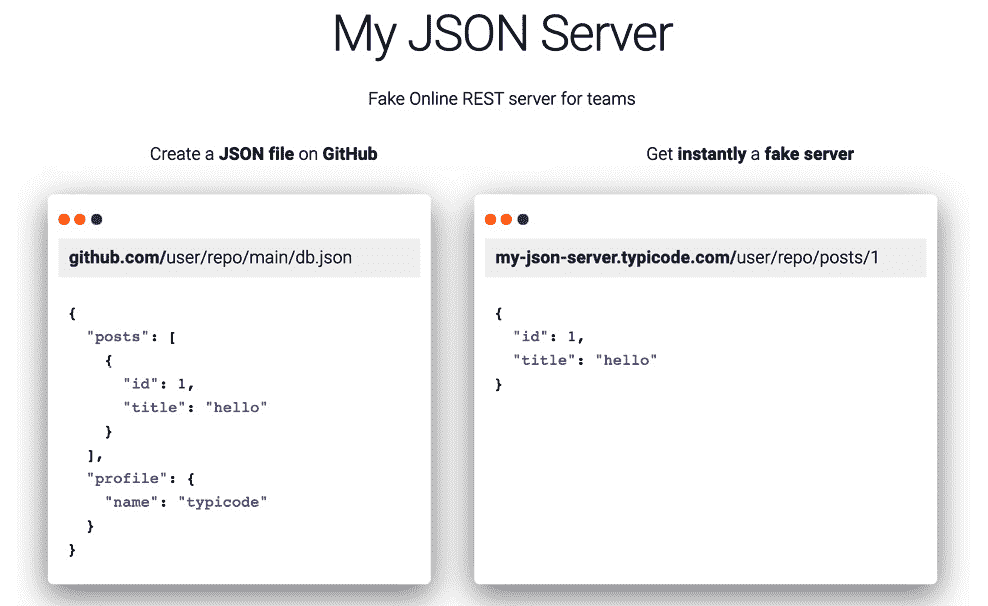
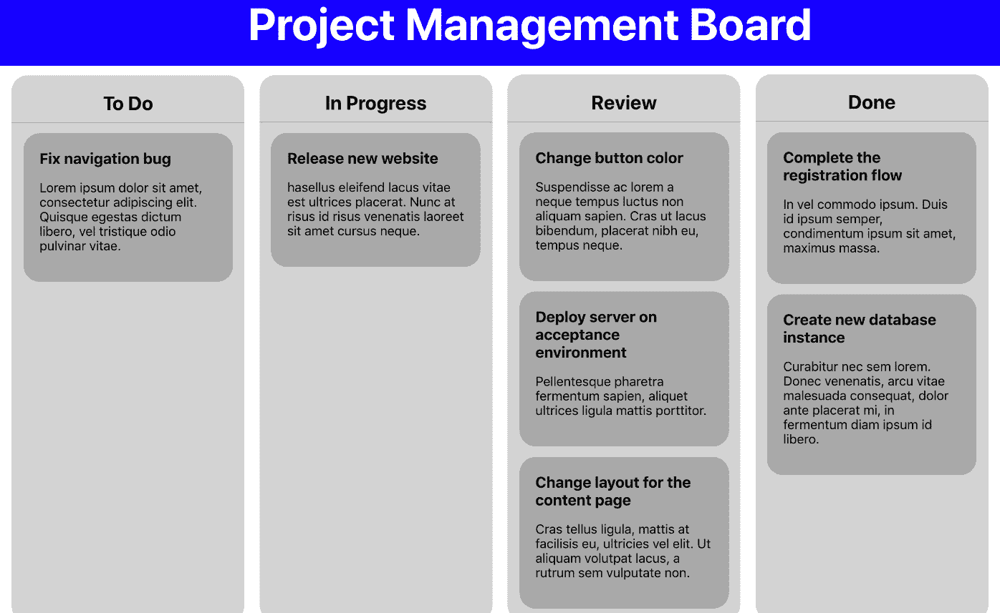
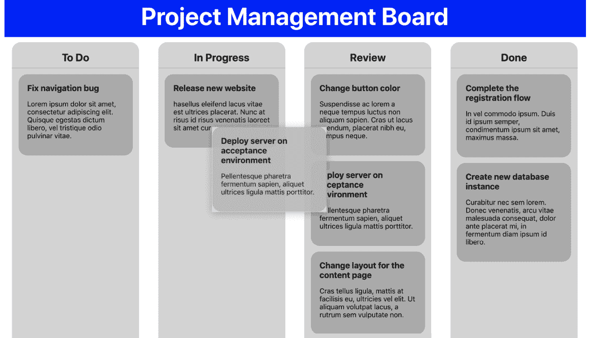

# 第三章：*第三章*: 构建动态项目管理板

在本书的前两章中，你独立创建了两个 React 项目，到现在你应该已经对 React 的核心概念有了扎实的理解。你到目前为止所使用的概念也将在本章中用于创建你的第三个 React 项目，包括一些新的更高级的概念，这些概念将展示使用 React 的优势。再次提醒，如果你觉得你缺少完成本章内容所需的一些知识，你总是可以重复你迄今为止所构建的内容。

本章将再次使用 Create React App，这是你在上一章中使用过的。在本章的项目管理板应用开发过程中，我们将创建并使用一个自定义钩子进行数据获取。将使用 HTML5 网络 API 动态拖放组件，这些组件被设置为可重用组件，并使用`styled-components`进行样式设置。随后，你将使用更高级的 React 技术来控制组件间的数据流，例如通过创建自定义钩子。

本章将涵盖以下主题：

+   处理数据流

+   使用自定义钩子

+   使用 HTML5 网络 API

+   使用`styled-components`为 React 添加样式

# 项目概述

在本章中，我们将创建一个动态项目管理板，它使用 Create React App 和`styled-components`具有可重用 React 组件和样式。该应用将具有一个使用 HTML5 拖放 API 的动态拖放界面。

构建时间约为 1.5-2 小时。

# 开始

本章我们将创建的项目基于 GitHub 上可找到的初始版本：[`github.com/PacktPublishing/React-Projects-Second-Edition/tree/main/Chapter03-initial`](https://github.com/PacktPublishing/React-Projects-Second-Edition/tree/main/Chapter03-initial)。该应用的完整源代码也可以在 GitHub 上找到：[`github.com/PacktPublishing/React-Projects-Second-Edition/tree/main/Chapter03`](https://github.com/PacktPublishing/React-Projects-Second-Edition/tree/main/Chapter03)。

下载初始应用后，我们可以先进入其根目录，并运行`npm install`命令。这将安装 Create React App 的核心包（`react`、`react-dom`和`react-scripts`）。安装完成后，我们可以通过执行`npm start`命令来启动应用，并在浏览器中通过访问`http://localhost:3000`来访问项目。

如以下截图所示，应用有一个带有标题的基本页眉，并分为四个列。这些列是项目管理板的通道，一旦我们将项目连接到数据文件，它们将包含个别任务。

![图 3.1 – 初始应用

![图 3.1]

图 3.1 – 初始应用

如果我们查看项目的结构，我们会看到它与上一章的项目结构相同。应用程序的入口点是`src/index.js`文件，它渲染一个名为`App`的组件，该组件包含两个其他组件，即`Header`和`Board`。第一个是应用程序的实际头部，而`Board`组件包含我们在应用程序中可以看到的四个列。这些列由`Lane`组件表示。

在这个应用程序中，你可以看到我们已经将组件进一步拆分到单独的目录中。现在，`components`或`pages`目录中的每个组件都有自己的子目录：

```js
chapter-3-initial
  |- /node_modules
  |- /public
  |- /src
    |- /components
       |- /Header
          |- Header.css
          |- Header.js
       |- /Lane
          |- Lane.css
          |- Lane.js
    |- /pages
       |- /Board
          |- Board.js
          |- Board.css
    |- App.js
    |- App.css
    |- index.js
    |- index.css
package.json
```

# 创建项目管理板应用程序

在本节中，我们将创建一个使用自定义钩子进行数据获取和 HTML5 拖放 API 使其动态化的项目管理板 PWA。我们将使用一个由 Create React App 设置的样板应用程序，我们可以在本章的 GitHub 仓库中找到它。

## 处理数据流

在应用程序的初始版本就绪后，下一步是获取项目管理板初始数据并处理其通过组件的流动。为此，我们将创建一个用于数据获取的自定义钩子，该钩子可以在其他组件中重用。

本节的第一部分将展示我们如何使用 React 生命周期方法从数据源加载数据，并在 React 组件中显示这些数据。

## 加载和显示数据

加载和显示从数据源检索到的数据是我们上一章所做的事情。本章使用的数据来自一个模拟的 REST API，由 Typicode 的 My JSON Server 创建。使用名为`db.json`的文件，该文件位于本书的仓库中，我们可以自动创建 REST 端点。



图 3.2 – 使用 My JSON Server

使用 My JSON Server，[`my-json-server.typicode.com/PacktPublishing/React-Projects-Second-Edition/tasks`](https://my-json-server.typicode.com/PacktPublishing/React-Projects-Second-Edition/tasks)端点返回一个任务列表，在本节中我们将将其加载到我们的项目管理板中。响应是一个包含 id、标题、正文和通道字段中定义的任务信息的对象数组。

本节将进一步探讨这个问题。按照以下步骤开始：

1.  我们将首先从数据文件中获取项目数据。为此，我们需要向`Board`组件添加必要的函数。我们需要这些函数来使用 Hooks 访问 React 生命周期，这我们在前面的章节中已经做了：

    ```js
    + import { useState, useEffect } from 'react';
      import Lane from '../../components/Lane/Lane';
      import './Board.css';
      // ...
      function Board() {
    +   const [loading, setLoading] = useState(false);
    +   const [tasks, setTasks] = useState([]);
    +   const [error, setError] = useState('');
    +   useEffect(() => {
    +     async function fetchData() {
    +       try {
    +         const tasks = await fetch(
                  `https://my-json-server.typicode.com/
                  PacktPublishing/React-Projects-Second-
                  Edition/tasks`,
            );
    +         const result = await tasks.json();
    +         if (result) {
    +           setTasks(result);
    +           setLoading(false);
    +         }
    +       } catch (e) {
    +         setLoading(false);
    +         setError(e.message);
    +       }
    +     }
    +     fetchData();
    +   }, []);
       return (
         // ...
    ```

在`useEffect`钩子中，数据是在`try..catch`语句中获取的。这个语句捕获数据获取过程中返回的任何错误，并用此消息替换错误状态。

1.  现在，我们可以将任务分配到相应的通道上：

    ```js
        // ...
        return (
          <div className='Board-wrapper'>
            {lanes.map((lane) => (
              <Lane
                key={lane.id}
                title={lane.title}
    +           loading={loading}
    +           error={error}
    +           tasks={tasks.filter((task) => 
                  task.lane === lane.id)}
              />
            ))}
          </div>
        );
      }

      export default Board;
    ```

在`return`语句中，你可以看到一个迭代`lanes`常量的函数，并将这些值作为 props 传递给`Lane`组件。另外，当我们向组件传递任务时，有一些特别的事情正在发生，因为`filter`函数正在被用来只返回与 lane ID 匹配的任务状态。

1.  接下来，我们需要对`Lane`组件做一些修改，以便它能够使用我们从 REST API 获取的数据来显示任务：

    ```js
    + import Task from '../Task/Task';
      import './Lane.css';
    - function Lane({ title }) {
    + function Lane({ title, loading, error, tasks }) {
        return (
          <div className='Lane-wrapper'>
            <h2>{title}</h2>
    +       {loading || error ? (
    +         <span>{error || 'Loading...'}</span>
    +       ) : (
    +         tasks.map((task) => (
    +            <Task
    +              key={task.id}
    +              id={task.id}
    +              title={task.title}
    +              body={task.body}
    +            />
    +         ))
    +       )}
          </div>
        );
      }
      export default Lane;
    ```

`Lane`组件现在接受另外三个 props，分别是`tasks`、`loading`和`error`，其中`tasks`包含从 REST API 获取的任务数组，`loading`指示是否应显示加载消息，而`error`包含当存在错误时的错误消息。我们可以看到，在`map`函数中迭代任务时，将渲染显示信息的`Task`组件。

1.  要创建此任务，我们需要在`components`目录中创建一个名为`Task`的目录，并在其中放置一个名为`Task.js`的新文件，用于`Task`组件：

    ```js
    import './Task.css';
    function Task({ title, body }) {
      return (
        <div className='Task-wrapper'>
          <h3>{title}</h3>
          <p>{body}</p>
        </div>
      );
    }
    export default Task;
    ```

1.  此组件从我们需要在`Task`目录内创建的另一个文件中获取样式，该文件名为`Task.css`，内容如下：

    ```js
    .Task-wrapper {
      background: darkGray;
      padding: 20px;
      border-radius: 20px;
      margin: 0% 5% 5% 5%;
    }
    .Task-wrapper h3 {
      width: 100%;
      margin: 0;
    }
    ```

如果我们在网页浏览器中访问我们的应用程序`http://localhost:3000`，我们将看到以下内容：



图 3.3 – 我们的应用程序，使用模拟 REST API 的数据

从数据源获取数据是可以在我们的应用程序中复用的逻辑。在下一节中，我们将探讨如何通过创建自定义 Hook 来跨多个组件复用这种逻辑。

# 使用自定义 Hooks

Hooks 是一种使用 React 功能来创建本地状态或使用生命周期来监视该状态更新的方法。但 Hooks 也是复用你为 React 应用程序创建的逻辑的一种方式。这是许多为 React 创建功能库中流行的一种模式，例如`react-router`。

注意

在 React 引入 Hooks 之前，创建**高阶组件**（**HOCs**）以复用逻辑是一种流行的模式。HOCs 是 React 的高级特性，专注于组件的可复用性。React 文档这样描述它们：“一个高阶组件是一个函数，它接受一个组件并返回一个新的组件。”

在本节的第一个部分，我们将创建我们的第一个自定义 Hook，它使用逻辑从我们在上一节创建的数据源中检索数据。

## 创建自定义 Hooks

我们已经看到我们可以在 React 中重用组件，但下一步是重用这些组件内部的逻辑。为了解释这在实践中意味着什么，让我们创建一个示例。我们的项目有一个 `Board` 组件，它获取 REST API 并渲染所有通道和任务。这个组件中有逻辑，以 `useState` Hook 创建的本地状态、`useEffect` Hook 内部的数据获取和关于每个 `Lane` 组件如何渲染的信息的形式存在。如果我们只想显示没有通道且只有任务的板怎么办？我们只是从 `Board` 组件发送不同的属性吗？当然，这是可能的，但在 React 中，这就是自定义 Hook 的用途。

没有通道的 `Board` 组件不会遍历所有通道并渲染带有任务的相应通道作为属性。相反，它会遍历所有任务并直接渲染它们。尽管渲染的组件不同，但设置初始状态、获取数据和渲染组件的逻辑可以重用。自定义 Hook 应该能够使用本地状态并在任何使用它的组件中执行数据获取。

要创建自定义 Hook，在 `src` 目录下创建一个名为 `hooks` 的新目录，并在其中创建一个名为 `useDataFetching.js` 的新文件。现在，按照以下步骤操作：

1.  从 React 中导入 `useState` 和 `useEffect` Hook 并为 Hook 创建一个新的函数，该函数成为默认导出。这个函数将接受一个名为 `dataSource` 的参数。由于这个 Hook 将使用数据获取的生命周期，让我们将这个自定义 Hook 命名为 `useDataFetching` 并使其返回一个空数组：

    ```js
    import { useState, useEffect } from 'react';
    function useDataFetching(dataSource) {
      return [];
    }
    export default useDataFetching;
    ```

1.  在这个函数内部，添加 `useState` Hook 来创建 `loading`、`error` 和 `data` 的本地状态，其结构与 `Board` 组件内部的本地状态几乎相同：

    ```js
      import { useState, useEffect } from 'react';
      function useDataFetching(dataSource) {
    +   const [loading, setLoading] = useState(false);
    +   const [data, setData] = useState([]);
    +   const [error, setError] = useState('');
        return [];
      }

      export default useDataFetching;
    ```

1.  接下来，我们需要使用 `useEffect` Hook，这是数据获取将发生的地方。`dataSource` 参数用作获取的位置。注意，常量名称现在更加通用，不再指定单一用途：

    ```js
      import { useState, useEffect } from 'react';
      function useDataFetching(dataSource) {
        // ...
    -   return [];
    +   useEffect(() => {
    +     async function fetchData() {
    +       try {
    +         const data = await fetch(dataSource);
    +         const result = await data.json();
    +         if (result) {
    +           setData(result);
    +           setLoading(false);
    +         }
    +       } catch (e) {
    +         setLoading(false);
    +         setError(e.message);
    +       }
    +     }
    +     fetchData();
    +   }, [dataSource]);
    +   return [loading, error, data];
      }
      export default useDataFetching;
    ```

这添加了进行数据获取的方法，并且在 `return` 语句中，我们返回 `data`、`loading` 和 `error` 状态。

恭喜！你已经创建了你的第一个 Hook！然而，它仍然需要添加到一个支持数据获取的组件中。因此，我们需要重构我们的 `Board` 组件以使用这个自定义 Hook 进行数据获取：

1.  从 `src/hooks/useDataFetching.js` 文件中导入自定义 Hook 并删除 React Hook 的导入：

    ```js
    - import { useState, useEffect } from 'react';
    + import useDataFetching from 
        '../../hooks/useDataFetching';
      import Lane from '../../components/Lane/Lane';
      import './Board.css';
      // ...
    ```

1.  随后，我们可以删除 `Board` 组件中 `useState` 和 `useEffect` Hook 的使用：

    ```js
      // ...
      function Board() {
    -   const [loading, setLoading] = useState(false);
    -   const [tasks, setTasks] = useState([]);
    -   const [error, setError] = useState('');
    -   useEffect(() => {
    -     async function fetchData() {
    -       try {
    -         const tasks = await fetch(
              `https://my-json-server.typicode.com/
               PacktPublishing/React-Projects-Second-
               Edition/tasks`,
            );
    -         const result = await tasks.json();
    -         if (result) {
    -           setTasks(result);
    -           setLoading(false);
    -         }
    -       } catch (e) {
    -         setLoading(false);
    -         setError(e.message);
    -       }
    -     }
    -     fetchData();
    -   }, []);
       return (
         // ...
    ```

1.  相反，使用导入的自定义 Hook 来处理我们的数据获取。该 Hook 返回与之前相同的 `loading`、`error` 和 `tasks` 状态，但数据状态被重命名为 `tasks` 以适应我们组件的需求：

    ```js
      import useDataFetching 
        from '../../hooks/useDataFetching';
      import Lane from '../../components/Lane/Lane';
      import './Board.css';
      function Board() {
    +   const [loading, error, tasks] =
          useDataFetching(`https://my-json-server.
          typicode.com/PacktPublishing/React-Projects-
          Second-Edition/tasks`);
       return (
         // ...
    ```

在下一节中，我们将学习如何通过从不同的组件导入来重复使用自定义钩子。

## 重复使用自定义钩子

在放置了第一个自定义钩子之后，是时候考虑其他可以进行数据获取的组件了，例如仅显示任务的组件。创建此组件的过程包括两个步骤：创建实际组件和使用自定义钩子进行数据获取。让我们开始吧：

1.  在`pages`目录中，我们需要在名为`Backlog`的新目录中创建一个名为`Backlog.js`的新文件。在此文件中，我们可以放置以下代码以创建组件，导入自定义钩子，并导入 CSS 进行样式设置：

    ```js
    import Task from '../../components/Task/Task';
    import useDataFetching from 
      '../../hooks/useDataFetching';
    import './Backlog.css';
    function Backlog() {
      const [loading, error, tasks] = useDataFetching(
        'https://my-json-server.typicode.com/
         PacktPublishing/React-Projects-Second-Edition/
         tasks',
      );
      return (
        <div></div>
      );
    }
    export default Backlog;
    ```

1.  现在的`return`语句正在返回一个空的`div`元素，因此我们需要在此处添加代码以渲染任务：

    ```js
      // ...
      return (
    -   <div>
    +   <div className='Backlog-wrapper'>
    +     <h2>Backlog</h2>
    +     <div className='Tasks-wrapper'>
    +       {loading || error ? (
    +         <span>{error || 'Loading...'}</span>
    +       ) : (
    +         tasks.map((task) => (
    +           <Task
    +             key={task.id}
    +             title={task.title}
    +             body={task.body}
    +           />
    +         ))
    +       )}
    +     </div>
        </div>
      );
    }
    export default Backlog;
    ```

1.  此组件导入`Backlog.css`文件进行样式设置，我们还在此文件中的元素上添加了类。但我们也需要在`Backlog.css`中创建并添加一些基本的样式规则：

    ```js
    .Backlog-wrapper {
      display: flex;
      flex-direction: column;
      margin: 5%;
    }
    .Backlog-wrapper h2 {
      width: 100%;
      padding-bottom: 10px;
      text-align: center;
      border-bottom: 1px solid darkGray;
    }
    .Tasks-wrapper {
      display: flex;
      justify-content: space-between;
      flex-direction: row;
      flex-wrap: wrap;
      margin: 5%;
    }
    ```

1.  在`App`组件中，我们可以导入这个组件，在`Board`组件下方渲染它：

    ```js
      import './App.css';
      import Board from './pages/Board/Board';
      import Header from './components/Header/Header';
    + import Backlog from './pages/Backlog/Backlog';
      function App() {
        return (
          <div className='App'>
            <Header />
            <Board />
    +       <Backlog />
          </div>
        );
      }
      export default App;
    ```

这将在我们的板子下方渲染新的`Backlog`组件，其中包含所有不同的任务。这些任务与`Board`组件中的任务相同，因为我们使用了相同的 REST API 端点。此外，您还可以为这个项目设置`react-router`，以便在另一个页面上渲染`Backlog`组件。

在车道上显示的所有任务仅在我们应用程序的一个部分，因为我们希望能够将这些任务拖放到不同的车道中。我们将在下一节中学习如何做到这一点，我们将为板子添加动态功能。

## 使板子动态化

项目管理板通常具有很好的用户交互能力之一是能够将任务从一个车道拖放到另一个车道。这是可以使用 HTML5 拖放 API 轻松实现的事情，该 API 在所有现代浏览器中都是可用的，包括 IE11。

HTML5 拖放 API 使我们能够在项目管理板之间拖放元素。为了实现这一点，它使用拖放事件。`onDragStart`、`onDragOver`和`onDrop`将用于此应用程序。这些事件应该放置在`Lane`和`Task`组件上。

在`Board`组件的文件中，让我们添加响应拖放事件的函数，这些事件需要发送到`Lane`和`Task`组件。让我们开始吧：

1.  首先为`onDragStart`事件添加`事件处理函数`，该事件在拖动操作开始时触发，并将其添加到`Board`组件中。这个函数需要传递给`Lane`组件，然后可以传递给`Task`组件。此函数为正在拖动的任务设置一个 ID，并将其放置在元素的`dataTransfer`对象中，浏览器使用该对象来识别拖放元素：

    ```js
      // ...
    + function onDragStart(e, id) {
    +   e.dataTransfer.setData('id', id);
    + }
      function Board() {
        const [loading, error, tasks] = useDataFetching(
          'https://my-json-server.typicode.com/
           PacktPublishing/React-Projects-Second-Edition/
           tasks',
        );
        return (
          <div className='Board-wrapper'>
            {lanes.map((lane) => (
              <Lane
                key={lane.id}
                title={lane.title}
                loading={loading}
                error={error}
                tasks={tasks.filter((task) => 
                       task.lane === lane.id)}
    +           onDragStart={onDragStart}
              />
            ))}
          </div>
        );
      }
      export default Board;
    ```

1.  在`Lane`组件中，我们需要将这个`事件处理函数`传递给`Task`组件：

    ```js
      // ...
    - function Lane({ title, loading, error, tasks }) {
    + function Lane({ title, loading, error, tasks, 
        onDragStart }) {
        return (
          <div className='Lane-wrapper'>
            <h2>{title}</h2>
            {loading || error ? (
              <span>{error || 'Loading...'}</span>
            ) : (
              tasks.map((task) => (
                <Task
                  key={task.id}
                  title={task.title}
                  body={task.body}
    +             onDragStart={onDragStart}
                />
              ))
            )}
          </div>
        );
      }
      export default Lane;
    ```

1.  现在，我们可以在 `Task` 组件中调用此函数，在那里我们还需要将可拖动属性添加到具有 `Task-wrapper` 类名的 `div` 元素上。在这里，我们将元素和任务 ID 作为参数传递给事件处理程序：

    ```js
      import './Task.css';
    - function Task({ title, body }) { 
    + function Task({ id, title, body, onDragStart }) {
        return (
          <div
            className='Task-wrapper'
    +       draggable
    +       onDragStart={(e) => onDragStart(e, id)}
          >
            <h3>{title}</h3>
            <p>{body}</p>
          </div>
        );
      }
      export default Task;
    ```

在进行这些更改后，我们应该能够看到每个任务都可以被拖动。但不要将它们放在任何地方——还需要添加其他更新状态的拖放事件和事件处理程序。将任务从一个车道拖动到另一个车道可以通过单击任务而不释放鼠标并将其拖动到另一个车道来完成，如下面的截图所示：



图 3.4 – 交互式项目管理板

实现了 `onDragStart` 事件后，可以实施 `onDragOver` 和 `onDrop` 事件。让我们开始吧：

1.  默认情况下，无法将元素拖放到另一个元素中——例如，将 `Task` 组件拖放到 `Lane` 组件中。这可以通过调用 `onDragOver` 事件的 `preventDefault` 方法来防止：

    ```js
      // ...
      function onDragStart(e, id) {
        e.dataTransfer.setData('id', id);
      }
    + function onDragOver(e) {
    +   e.preventDefault();
    + };
      function Board() {
        const [loading, error, tasks] = useDataFetching(
          'https://my-json-server.typicode.com/
           PacktPublishing/React-Projects-Second-Edition/
           tasks',
        );
        return (
          <div className='Board-wrapper'>
            {lanes.map((lane) => (
              <Lane
                key={lane.id}
                title={lane.title}
                loading={loading}
                error={error}
                tasks={tasks.filter((task) => 
                       task.lane === lane.id)}
                onDragStart={onDragStart}
    +           onDragOver={onDragOver}
              />
            ))}
          </div>
        );
      }
      export default Board;
    ```

1.  此函数需要被导入，并放置在 `Lane` 组件中具有 `Lane-wrapper` 类名的 `div` 元素上作为事件处理程序：

    ```js
      // ...
    - function Lane({ title, loading, error, tasks, 
        onDragStart }) {
    + function Lane({ title, loading, error, tasks, 
        onDragStart, onDragOver }) {
        return (
    -     <div className='Lane-wrapper'>
    +     <div className='Lane-wrapper' 
           onDragOver={onDragOver}>
            <h2>{title}</h2>
            // ...
    ```

1.  `onDrop` 事件是事情变得有趣的地方，因为这个事件使得我们在完成拖动操作后能够修改状态成为可能。在我们能够添加此事件处理程序之前，我们需要在 `Board` 组件中创建一个新的局部状态变量 `tasks`。当从 `useDataFetching` 钩子获取数据时，此状态变量会被覆盖，并用于显示来自 `Lane` 组件的任务：

    ```js
    + import { useEffect, useState } from 'react';
      import Lane from '../../components/Lane/Lane';
      import useDataFetching from
        '../../hooks/useDataFetching';
      import './Board.css';
      // ...
      function Board() {
        const [
          loading, 
          error, 
    -     tasks
    +     data] = useDataFetching(
            'https://my-json-server.typicode.com/
             PacktPublishing/React-Projects-Second-Edition/
             tasks',
      );
    +   const [tasks, setTasks] = useState([]);
    +   useEffect(() => {
    +     setTasks(data);
    +   }, [data]);
      // ...
      return (
        // ...
    ```

1.  现在可以创建新的事件处理函数，当它被调用时，我们可以从 `useState` 钩子中的任务状态调用 `setTasks` 函数：

    ```js
      // ...
      function Board() {
        // ...
    +   function onDrop(e, laneId) {
    +     const id = e.dataTransfer.getData('id');
    +     const updatedTasks = tasks.filter((task) => {
    +       if (task.id.toString() === id) {
    +         task.lane = laneId;
    +       }
    +       return task;
    +     });
    +     setTasks(updatedTasks);
    +   }
        return (
          // ...
    ```

1.  此外，此事件处理函数应作为属性传递给 `Task` 组件：

    ```js
        // ...
        Return (
          <div className='Board-wrapper'>
            {lanes.map((lane) => (
              <Lane
                key={lane.id}
    +           laneId={lane.id}
                title={lane.title}
                loading={loading}
                error={error}
                tasks={tasks.filter((task) => 
                       task.lane === lane.id)}
                onDragStart={onDragStart}
                onDragOver={onDragOver}
    +           onDrop={onDrop}
              />
            ))}
          </div>
        );
      }
      export default Board;
    ```

此 `onDrop` 事件处理函数接受一个元素和车道 ID 作为参数，因为它需要拖动元素的 ID 和它应该放置的新车道。有了这些信息，函数使用 `filter` 函数找到需要移动的任务，并更改车道的 ID。这个新信息将用 `setState` 函数替换状态中当前的任务对象。

1.  由于 `onDrop` 事件是从 `Lane` 组件触发的，因此它作为属性传递给此组件。此外，还添加了车道 ID 作为属性，因为需要将其传递给来自 `Lane` 组件的 `onDrop` 事件处理函数：

    ```js
      import Task from '../Task/Task';
      import './Lane.css';
      function Lane({
    +   laneId,
        title,
        loading,
        error,
        tasks,
        onDragStart,
        onDragOver,
    +   onDrop,
      }) {
        return (
          <div
            className='Lane-wrapper'
            onDragOver={onDragOver}
    +       onDrop={(e) => onDrop(e, laneId)}
          >
          // ...
    ```

通过这种方式，我们能够将任务拖放到我们板上的其他车道上——你也可以为 `Backlog` 组件做同样的事情——或者甚至通过另一个自定义钩子使此逻辑可重用。但相反，我们将探讨如何通过使用 `styled-components` 库来使我们的组件样式更加灵活和可重用，在下一节中。

# 使用 styled-components 在 React 中进行样式设计

到目前为止，我们一直在使用 CSS 文件来为我们的 React 组件添加样式。然而，这迫使我们必须在不同的组件之间导入这些文件，这使得我们的代码的可重用性降低。因此，我们将向项目中添加 `styled-components` 包，这允许我们在 JavaScript 中编写 CSS（所谓 CSS-in-JS）并创建组件。

通过这样做，我们将获得更多样式的灵活性，能够防止由于 `classNames` 而导致的样式重复或重叠，并且可以轻松地为组件添加动态样式。所有这些都可以使用我们用于 CSS 的相同语法，直接在我们的 React 组件内部完成。

第一步是使用 npm 安装 `styled-components`：

```js
npm install styled-components
```

注意

如果您查看 `styled-components` 的官方文档，您会注意到他们强烈建议您也使用此包的 Babel 插件。但是，由于您正在使用 Create React App 来初始化项目，因此您不需要添加此插件，因为 `react-scripts` 已经处理了您应用程序所需的全部编译。

在安装 `styled-components` 之后，让我们尝试从我们的组件中删除 CSS 文件。一个好的开始是 `Task` 组件，因为这个组件非常小，功能有限：

1.  首先，导入 `styled-components` 包并创建一个新的样式组件，命名为 `TaskWrapper`。该组件扩展了一个 `div` 元素，并采用了我们已经在 `Task.css` 中的 `Task-wrapper` 类名所拥有的 CSS 规则。此外，我们不再需要导入此文件，因为所有的样式现在都在这个 JavaScript 文件内部完成：

    ```js
    + import styled from 'styled-components';
    - import './Task.css';
    + const TaskWrapper = styled.div`
    +   background: darkGray;
    +   padding: 20px;
    +   border-radius: 20px;
    +   margin: 0% 5% 5% 5%;
    +   h3 {
    +     width: 100%;
    +     margin: 0;
    +   }
    + `;
      function Task({ id, title, body, onDragStart }) {
        return (
    -     <div className="Task-wrapper"
    +     <TaskWrapper 
            draggable 
            onDragStart={(e) => onDragStart(e, id)}
          >
            <h3>{title}</h3>
            <p>{body}</p>
    -     </div>
    +     </TaskWrapper>
      );
    }
    export default Task;
    ```

1.  在前面的代码块中，我们在 `TaskWrapper` 样式组件中添加了 `h3` 元素的样式，但我们也可以在特定的样式组件内部做同样的事情：

    ```js
      import styled from 'styled-components';

      // ...
    -   h3 {
    -     width: 100%;
    -     margin: 0;
    -   }
    - `;
    + const Title = styled.h3`
    +   width: 100%;
    +   margin: 0;
    + `;
      function Task({ id, title, body, onDragStart }) {
        return (
          <TaskWrapper 
            draggable 
            onDragStart={(e) => onDragStart(e, id)}
          >
    -       <h3>{title}</h3>
    +       <Title>{title}</Title>
            <p>{body}</p>
          </TaskWrapper>
      );
    }
    export default Task;
    ```

1.  我们也可以为项目中的其他组件做同样的事情，从 `Lane` 组件开始，我们需要首先创建使用与 `Lane.css` 文件中相同的样式的样式组件：

    ```js
    + import styled from 'styled-components';
      import Task from '../Task/Task';
    - import './Lane.css';
    + const LaneWrapper = styled.div`
    +   text-align: left;
    +   padding: 0;
    +   background: lightGray;
    +   border-radius: 20px;
    +   min-height: 50vh;
    +   width: 20vw;
    +   @media (max-width: 768px) {
    +     margin-bottom: 5%;
    +   }
    + `;
    + const Title = styled.h2`
    +   width: 100%;
    +   padding-bottom: 10px;
    +   text-align: center;
    +   border-bottom: 1px solid darkGray;
    + `;
      function Lane({
        // ...
    ```

1.  将现有的 `div` 和 `h3` 元素替换为这些新组件：

    ```js
      // ...
      function Lane({
        laneId,
        title,
        loading,
        error,
        tasks,
        onDragStart,
        onDragOver,
        onDrop,
      }) {
        return (
    -     <div className="Lane-wrapper"    
    +     <LaneWrapper 
            onDragOver={onDragOver} 
            onDrop={(e) => onDrop(e, laneId)}
          >
    -       <h3>{title}</h3>
    +       <Title>{title}</Title>
            {loading || error ? (
              <span>{error || 'Loading...'}</span>
            ) : (
              // ...
            )}
    -     </div>
    +     </LaneWrapper>
        );
      }
      export default Lane;
    ```

如果我们在浏览器中再次运行 `npm start` 后访问我们的项目，我们会看到在删除了 Ticket 和 `Lane` 组件的 CSS 文件后，我们的应用程序仍然看起来一样。当然，您也可以为项目中的其他组件做同样的事情。

让我们继续将另一个组件转换为使用 `styled-components` 而不是 CSS，例如 `src/App.js` 文件中的组件。这个组件正在使用 `src/App.css` 文件来为包含我们应用程序中所有组件的 `div` 元素添加样式：

```js
- import './App.css';
+ import styled from 'styled-components';
  import Board from './pages/Board/Board';
  import Header from './components/Header/Header';
  import Backlog from './pages/Backlog/Backlog';
+ const AppWrapper = styled.div`
+   text-align: center;
+ `;
  function App() {
    return (
-     <div className='App'>
+     <AppWrapper>
        <Header />
        <Board />
        <Backlog />
-     </div>
+     </AppWrapper>
    );
  }
  export default App;
```

在进行这些更改后，您可以删除 `src/App.css` 文件，因为我们不再使用它来为 `App` 组件添加样式。

使用`styled-components`的另一种可能性是为我们的应用程序创建一个全局样式，这目前在`src/index.css`中完成。此文件在`src/index.js`中导入，因此被加载到应用程序的每一页，因为它是我们 React 应用程序的入口。但是`src/App.js`中的`App`组件也包装了所有我们的组件，我们可以在其中复制`src/index.css`中的样式规则，并使用它们来创建一个`GlobalStyle`组件：

```js
- import styled from 'styled-components'; 
+ import styled, { createGlobalStyle } from 
    'styled-components';
  import Board from './pages/Board/Board';
  import Header from './components/Header/Header';
  import Backlog from './pages/Backlog/Backlog';
+ const GlobalStyle = createGlobalStyle`
+   body {
+     margin: 0;
+     font-family: -apple-system, BlinkMacSystemFont, 
        'Segoe UI', 'Roboto', 'Oxygen', 'Ubuntu',
'Cantarell', 'Fira Sans', 'Droid Sans', 
        'Helvetica Neue', sans-serif;
+     -webkit-font-smoothing: antialiased;
+     -moz-osx-font-smoothing: grayscale;
+   }
+ `;
  const AppWrapper = styled.div`
    // ...
```

我们刚刚创建的全局样式必须添加到`App`组件的返回语句中，在`AppWrapper`组件之上。因为我们只能从`return`语句返回一个元素或组件，所以我们需要将内容包装到另一个元素中。如果我们想给这个元素应用样式，我们可以使用一个`div`元素。但由于在这个场景中我们不希望这样做，我们将使用 React 片段。使用片段，我们可以包装元素和组件，而不会在浏览器中渲染任何内容：

```js
  // ...
  function App() {
    return (
+     <>
+       <GlobalStyle />
        <AppWrapper>
          <Header />
          <Board />
          <Backlog />
        </AppWrapper>
+     </>
    );
  }
  export default App;
```

注意

`<>`符号是`<React.Fragment>`的简写；你可以在 React 中使用这两种符号。对于`<React.Fragment>`符号，你也可以从 React 中导入`Fragment`来编写`<Fragment>`。

最后，你可以删除`src/index.css`文件和`src/index.js`中导入此文件的行：

```js
  import React from 'react'; 
  import ReactDOM from 'react-dom/client';
- import './index.css';
  import App from './App';
  import reportWebVitals from './reportWebVitals';
  const root = ReactDOM.createRoot(
    document.getElementById('root'));
    // ...
```

通过这些最终添加，我们已使用`styled-components`而不是 CSS 来设计了我们应用程序的大部分样式。通过直接在组件中编写样式规则，我们可以减少项目中的文件数量，并使查找应用于我们元素的风格变得更加容易。

# 摘要

在本章中，你创建了一个项目管理板，允许你使用 HTML5 拖放 API 将任务从一个通道拖放到另一个通道。此应用程序的数据流由本地状态和生命周期处理，并确定哪些任务显示在不同的通道中。本章还介绍了 React 的高级模式自定义 Hooks。使用自定义 Hooks，你可以在你的应用程序中跨功能组件重用状态逻辑。

这种高级模式也将在下一章中使用，下一章将处理 React 应用程序中使用 Next.js 的**服务器端渲染**（**SSR**）和路由。你有没有尝试过使用 Stack Overflow 来寻找你曾经遇到过的编程问题的解决方案？我有！在下一章中，我们将构建一个使用 Stack Overflow 作为数据源并使用 React 来渲染应用程序的社区动态。

# 进一步阅读

+   HTML 拖放 API: [`developer.mozilla.org/en-US/docs/Web/API/HTML_Drag_and_Drop_API`](https://developer.mozilla.org/en-US/docs/Web/API/HTML_Drag_and_Drop_API)

+   DataTransfer: [`developer.mozilla.org/en-US/docs/Web/API/DataTransfer`](https://developer.mozilla.org/en-US/docs/Web/API/DataTransfer)

+   React DnD: [`github.com/react-dnd/react-dnd`](https://github.com/react-dnd/react-dnd)
