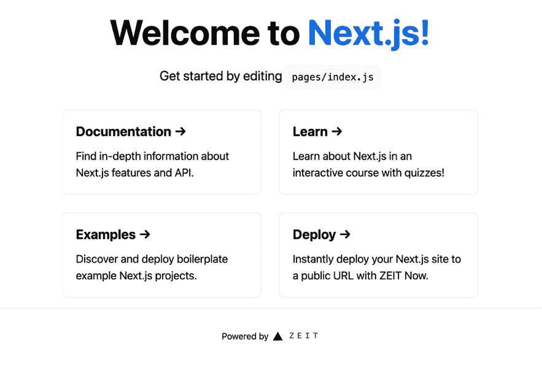
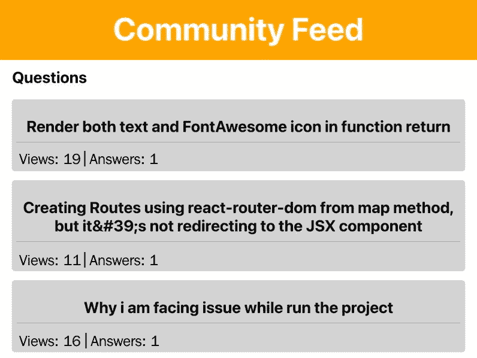
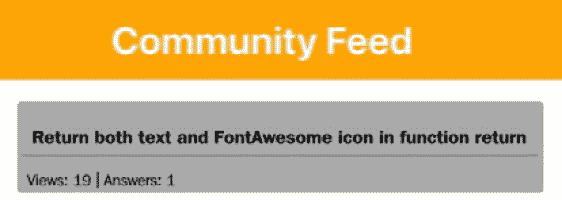
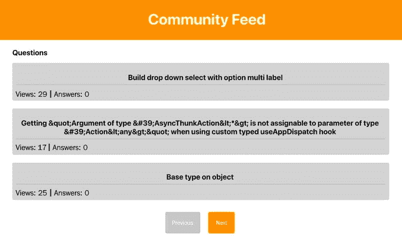
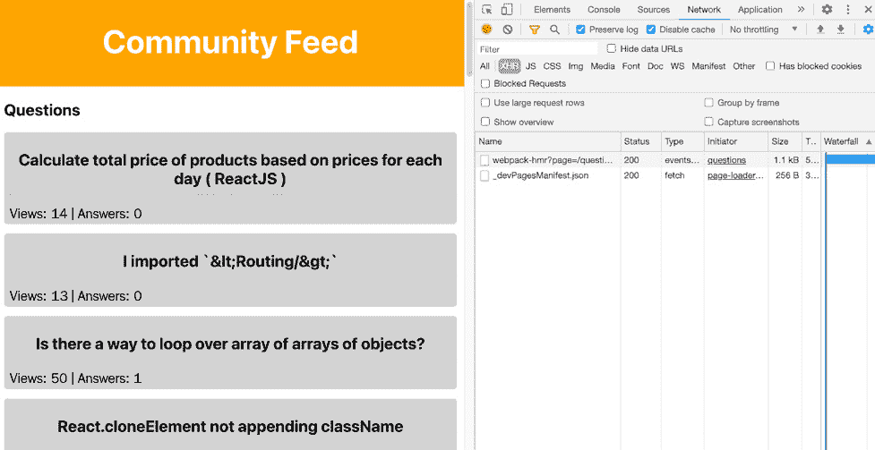

# 第四章：*第四章*：使用 Next.js 构建服务器端渲染的社区信息流

到目前为止，你已经学习了 React 应用程序通常是**单页应用程序**（**SPAs**），并且可以使用 Create React App 启动。这意味着应用程序在客户端渲染，当用户访问你的应用程序时在浏览器中加载。但你是否知道 React 也支持**服务器端渲染**（**SSR**），就像你可能记得的那样，在代码仅从服务器渲染的旧日子里？

在本章中，你将学习如何创建一个从服务器动态加载组件的应用程序，而不是从浏览器加载。为了启用 SSR（服务器端渲染），我们将使用 Next.js 而不是 Create React App。Next.js 是一个用于 React 应用程序的框架，并为 React 添加了额外的功能。如果你对**搜索引擎优化**（**SEO**）感兴趣，SSR 具有以下优势：我们可以向应用程序添加元数据，使其能够被搜索引擎更好地索引。

本章将涵盖以下主题：

+   设置 Next.js

+   服务器端渲染

+   React 中的 SEO

# 项目概述

在本章中，我们将使用 Next.js 创建一个支持 SSR 的社区信息流应用程序，因此它从服务器加载而不是从浏览器加载。此外，该应用程序针对搜索引擎进行了优化。

构建时间为 2 小时。

# 开始

完整的源代码也可以在 GitHub 上找到：[`github.com/PacktPublishing/React-Projects-Second-Edition/tree/main/Chapter04`](https://github.com/PacktPublishing/React-Projects-Second-Edition/tree/main/Chapter04)。此外，该项目使用公开可用的 Stack Overflow API 来填充应用程序的数据。这是通过获取发布到 Stack Overflow 的问题来完成的。有关此 API 的更多信息，请参阅：[`api.stackexchange.com/docs/`](https://api.stackexchange.com/docs/)。

# 社区信息流应用程序

在本节中，你将使用 Next.js 构建一个支持 SSR 的社区信息流应用程序。Next.js 超越了 Create React App 的功能，提供了一个快速构建 React 应用程序的框架。它内置了路由、SEO、SSR 等功能，你将在本章中了解到。在这个社区信息流中，你可以看到带有`reactjs`标签的最近问题的概述，你可以点击它们来查看更多信息以及答案。

# 设置 Next.js

在前面的章节中，我们使用了 Create React App 来运行 React 应用程序。虽然 Create React App 是大多数 React 应用程序的一个很好的起点，但它不支持 SSR。幸运的是，Next.js 确实提供了这个功能，因为它被认为是一个 React 框架。在本章中，我们将使用 Next.js 的最新稳定版本，即版本 12。

## 安装 Next.js

要设置 Next.js，我们运行以下命令：

```js
npx create-next-app chapter-4
```

您将被要求选择一个模板，这可以是默认的启动应用程序或由社区创建的模板。在选择默认模板后，将安装 `react`、`react-dom` 和 `next` 库等。

安装完成后，我们可以进入新的 `chapter-4` 目录并运行以下命令：

```js
npm run dev
```

这将启动一个新的 Next.js 应用程序，该应用程序将在 `http://localhost:3000` 上可用。默认的启动应用程序将类似于以下应用程序：



图 4.1 – 初始 Next.js 应用程序

在这个应用程序中，您不仅可以看到 Next.js 应用程序的外观，还可以找到更多有用的链接，以了解 Next.js 以及如何部署它的示例。

Next.js 项目的应用程序结构与我们前面章节中创建的 Create React App 的结构略有不同：

```js
chapter-4
  |- package.json
  |- node_modules
  |- public
  |- pages
     |- api
        |- hello.js
     |- _app.js
     |- index.js
  |- styles
     |- globals.css
     |- Home.module.css

```

在前面的结构中，您可以再次看到一个名为 `pages` 的目录，该目录将包含作为页面的 React 组件。但与 Create React App 不同，我们不需要设置 `react-router` 来服务页面。相反，Next.js 自动将此目录中的每个组件渲染为页面。在这个目录中，我们还在 `api` 目录中找到了 `hello.js` 文件。Next.js 还可以用来创建 API 端点，我们将在 *第七章* 中进一步探讨，即使用 Next.js 和 GraphQL 构建全栈电子商务应用程序。此外，我们的组件的 CSS 文件放在 `styles` 目录中，您将找到具有全局样式的 `globals.css` 文件以及具有特定组件样式的 `Home.module.css`。

## 添加 styled-components

在我们设置路由之前，让我们将 `styled-components` 添加到项目中，我们也在前面的章节中使用过它。为此，我们需要通过运行以下命令来安装 `styled-components`：

```js
npm install styled-components
```

这将添加包到我们的项目中，我们可以使用它们来创建和样式化可重用组件。

注意

Next.js 使用 `styles` 目录来存储全局和组件特定的 CSS 文件以进行样式化。由于我们使用 `styled-components` 进行样式化，因此我们不需要向此目录添加任何新的 CSS 文件。如果您不使用 CSS-in-JS 的库进行样式化，则可以将全局和组件级别的样式文件放置在 `styles` 目录中。

在 Next.js 中设置 `styled-components` 与 Create React App 相比略有不同：

1.  在 Next.js 中，一个 `Document` 组件包裹 `html`、`body` 和 `head` 标签，并通过所谓的 `renderPage` 方法运行它们，以允许进行 SSR。我们需要在 `pages` 文件夹中的新文件 `_document.js` 中重写这个 `Document` 组件：

    ```js
    import Document from 'next/document';
    import { ServerStyleSheet } from 'styled-components';
    export default class MyDocument extends Document {
      static async getInitialProps(ctx) {
        const sheet = new ServerStyleSheet();
        const originalRenderPage = ctx.renderPage;
        try {
          ctx.renderPage = () =>
            originalRenderPage({
              enhanceApp: (App) => (props) =>
                sheet.collectStyles(<App {...props} />),
            });
          const initialProps = 
            await Document.getInitialProps(ctx);
          return {
            ...initialProps,
            styles: (
              <>
                {initialProps.styles}
                {sheet.getStyleElement()}
              </>
            ),
          };
        } finally {
          sheet.seal();
        }
      }
    }
    ```

上述代码创建了一个 `ServerStyleSheet` 实例，`styled-components` 使用它来检索我们应用程序中所有组件中找到的任何样式。这需要创建一个可以稍后注入到我们的服务器端渲染应用程序中的样式表。`sheets.collectStyles` 方法收集我们组件中的所有样式，而 `sheets.getElement()` 生成 `style` 标签，我们需要将其作为名为 `styles` 的属性返回。

1.  为了支持 `styled-components` 的 SSR，我们还需要在项目根目录中配置 `next.config.json` 文件。此文件需要包含以下配置：

    ```js
    const nextConfig = {
        reactStrictMode: true,
    +   compiler: {
    +     styledComponents: true
    +   }
    }
    module.exports = nextConfig
    ```

1.  与 Next.js 一样，我们没有为应用程序设置全局入口文件。我们需要一个不同的地方来添加我们想要在所有页面上显示的全局样式和组件，例如标题。这些样式和组件必须添加到 `pages` 目录中的 `_app.js` 中，它返回我们当前访问的页面组件以及我们返回的任何其他组件或样式：

    ```js
    - import '../styles/globals.css';
    + import { createGlobalStyle } from 'styled-components';
    + const GlobalStyle = createGlobalStyle' 
    +   body { 
    +     margin: 0; 
    +     padding: 0; 
    +     font-family: -apple-system, BlinkMacSystemFont,
            "Segoe UI", "Roboto", "Oxygen","Ubuntu",  
            "Cantarell", "Fira Sans", "Droid Sans",
            "Helvetica Neue", sans-serif;  
    +     -webkit-font-smoothing: antialiased; 
    +     -moz-osx-font-smoothing: grayscale; 
    +   } 
    + ';
      function MyApp({ Component, pageProps }) {
    -   return <Component {...pageProps} />;
    +   return (
    +     <>
    +       <GlobalStyle />
    +       <Component {...pageProps} />
    +     </>
    +   );
      }
      export default MyApp;
    ```

在前面的文件中，我们删除了导入 `styles/globals.css` 文件的行，并用 `styled-components` 中的样式替换了它。这意味着你也可以安全地从 `styles` 目录中删除 `globals.css` 文件。

1.  这种全局样式现在将出现在我们将在 Next.js 应用程序中创建的所有页面上。但首先，让我们通过在名为 `components` 的新目录中添加一个名为 `Header.js` 的文件来创建一个 `Header` 组件：

    ```js
    import styled from 'styled-components';
    const HeaderWrapper = styled.div'
      background-color: orange;
      height: 100%;
      display: flex;
      flex-direction: column;
      align-items: center;
      justify-content: center;
      font-size: calc(10px + 2vmin);
      color: white;
    ';
    const Title = styled.h1'
      height: 64px;
      pointer-events: none;
    ';
    function Header() {
      return (
        <HeaderWrapper>
          <Title>Community Feed</Title>
        </HeaderWrapper>
      );
    }
    export default Header;
    ```

1.  此组件将返回一个将在每个页面上使用的标题，但我们还需要将其添加到 `_app.js` 中才能生效：

    ```js
      import { createGlobalStyle } from 
        'styled-components';
    + import Header from '../components/Header';
      // ...
      function MyApp({ Component, pageProps }) {
        return (
          <>
            <GlobalStyle />
    +       <Header />
            <Component {...pageProps} />
          </>
        );
      }
      export default MyApp;
    ```

当我们在应用程序中添加第一个路由时，你将在下一节中看到标题的样式。

我们添加了多个新的文件，这些文件使用 `styled-components` 具有全局样式，支持 SSR，并且还有一个包含可重用组件的目录。

在 Next.js 和 `styled-components` 设置完成后，我们就可以开始在本章下一节中使用 Next.js 进行开发了。

# 使用 Next.js 进行路由

使用 `react-router` 包，我们可以为任何 React 应用程序添加声明式路由，但你需要设置定义你想要添加的路由的组件。使用 Next.js，路由是通过文件系统实现的，从 `pages` 目录开始。`pages` 目录中的每个文件和目录都可以代表一个路由。你可以通过访问项目在 `http://localhost:3000` 来检查这一点，其中 `index.js` 的内容正在被渲染。

例如，如果我们想将新的 `/questions` 路由添加到应用程序中，我们需要创建一个名为 `questions.js` 的新文件或一个名为 `questions` 的目录，并在 `pages` 中包含一个 `index.js` 文件。让我们选择第二种方案，并将以下代码添加到该文件中：

```js
import styled from 'styled-components';
const QuestionsContainer = styled.div'
  display: flex;
  justify-content: space-between;
  flex-direction: column;
  margin: 5%;
';
function Questions() {
  return (
    <QuestionsContainer>
      <h2>Questions</h2>
    </QuestionsContainer>
  );
}
export default Questions;
```

这条新路由现在已在 `http://localhost:3000/questions` 上可用，此处只渲染标题。正如本章引言中提到的，我们将使用 Stack Overflow API 来获取此应用程序的数据。

在从端点检索数据之前，我们还需要创建一个组件来渲染这些数据。为此，我们需要创建一个新的组件，该组件将用于显示问题。这个新组件可以创建在 `components` 目录下的 `Card.js` 文件中，内容如下：

```js
import styled from 'styled-components';
const CardWrapper = styled.div'
  text-align: left;
  padding: 1%;
  background: lightGray;
  border-radius: 5px;
  margin-bottom: 2%;
';
const Title = styled.h2'
  width: 100%;
  padding-bottom: 10px;
  text-align: center;
  border-bottom: 1px solid darkGray;
  color: black;
';
const Count = styled.span'
  color: darkGray;
';
function Card({ title, views, answers }) {
  return (
    <CardWrapper>
      <Title>{title}</Title>
      <Count>{
        'Views: ${views} | Answers: ${answers}'}
      </Count>
    </CardWrapper>
  );
}
export default Card;
```

在此组件就位后，让我们从 Stack Overflow API 获取数据。从这个 API 中，我们想要检索带有 `reactjs` 标签的所有问题，使用以下端点：

```js
https://api.stackexchange.com/2.2/questions?order=desc&sort=hot&tagged=reactjs&site=stackoverflow
```

你可以在 [`api.stackexchange.com/docs/questions#order=desc&sort=hot&tagged=reactjs&filter=default&site=stackoverflow&run=true`](https://api.stackexchange.com/docs/questions#order=desc&sort=hot&tagged=reactjs&filter=default&site=stackoverflow&run=true) 找到更多相关信息。

这返回一个在 `items` 字段下的对象数组，并且从每个对象中，我们可以获取有关问题的信息，例如标题和答案数量。

我们可以通过对 `pages` 目录中 `questions` 目录下的 `index.js` 文件进行一些修改，从该端点检索数据并在 `/questions` 路由上显示它：

1.  首先，我们需要在 `Questions` 组件中添加本地状态变量，并添加一个 `useEffect` Hook 来从 Stack Overflow API 获取数据：

    ```js
    + import { useState, useEffect } from 'react';
      import styled from 'styled-components';
    + import Card from '../ ../ components/Card';
      function Questions() {
    +   const [loading, setLoading] = useState(false);
    +   const [questions, setQuestions] = useState([]);
    +   useEffect(() => {
    +     async function fetchData() {
    +       const data = await fetch(
             'https://api.stackexchange.com/2.2/questions?
              order=desc&sort=hot&tagged=reactjs&
              site=stackoverflow');
    +       const result = await data.json();
    +       if (result) {
    +         setQuestions(result.items);
    +         setLoading(false);
    +       }
    +     }
    +     fetchData();
    +   }, []);
      return (
        // ...
    ```

1.  在添加数据获取逻辑后，我们还需要添加一些代码来在页面上显示来自 API 的字段。我们将此数据传递给我们的 `Card` 组件以在页面上渲染它：

    ```js
      // ...
        return (
          <QuestionsContainer>
            <h2>Questions</h2>
    +       {loading ? (
    +         <span>Loading...</span>
    +        ) : (
    +         <div>
    +             {questions.map((question) => (
    +               <Card
    +                 key={question.question_id}
    +                 title={question.title}
    +                 views={question.view_count}
    +                 answers={question.answer_count}
    +               />
    +             ))}
    +         </div>
    +       )}
        </QuestionsContainer>
      );
    }
    export default Questions;
    ```

如果你现在访问 `http://localhost:3000/questions` 上的 `/questions` 路由，你可以看到问题列表正在与 Header 组件一起渲染，如下面的截图所示：



图 4.2 – 我们的带有 Stack Overflow 数据的应用程序

我们将在稍后处理 SSR，但在那之前，我们需要添加支持参数的路由。要创建一个支持参数的路由，我们需要以与 Questions 组件相同的方式创建一个文件。新路由将显示特定问题，这些信息我们也可以从 Stack Overflow API 获取。同样，文件系统将在创建路由时起主导作用：

1.  要创建一个带有参数的新路由，我们需要在 `questions` 目录内创建一个名为 `[id].js` 的文件。此文件包含参数名称，方括号内，并且在此文件中，我们可以使用 Next.js 路由库中的 Hook 来获取此参数值：

    ```js
    import { useRouter } from 'next/router';
    import styled from 'styled-components';
    const QuestionDetailContainer = styled.div'
      display: flex;
      justify-content: space-between;
      flex-direction: column;
      margin: 5%;
    ';
    function QuestionDetail() {
      const router = useRouter();
      const { id } = router.query;
      return (
        <QuestionDetailContainer>
          <h2>Question: {id}</h2>
        </QuestionDetailContainer>
      );
    }
    export default QuestionDetail;
    ```

通过访问 `http://localhost:3000/questions/123`，你可以看到我们添加的参数已经显示在屏幕上。

1.  在 `QuestionDetail` 组件中，我们可以导入 `Card` 组件，并可以使用 Stack Overflow API 获取特定问题的数据。为此，我们需要在之前步骤中创建的 `questions` 目录下的 `[id].js` 文件中添加数据获取逻辑和渲染数据的元素：

    ```js
    + import { useState, useEffect } from 'react';
      import { useRouter } from 'next/router';
      import styled from 'styled-components';
    + import Card from '../../components/Card';
      // ...
      function QuestionDetail() {
        const router = useRouter();
        const { id } = router.query;
    +   const [loading, setLoading] = useState(false);
    +   const [question, setQuestion] = useState({});
    +   useEffect(() => {
    +     async function fetchData() {
    +       const data = await fetch(
             'https://api.stackexchange.com/2.2/questions
             /${id}?site=stackoverflow');
    +       const result = await data.json();
    +       if (result) {
    +         setQuestion(result.items[0]);
    +         setLoading(false);
    +       }
    +     }
    +     id && fetchData();
    +   }, [id]);
        // ...
    ```

1.  在添加数据获取逻辑后，我们可以将 `Card` 组件返回，并将作为 props 传递给它的问题信息：

    ```js
        // ...
        return (
          <QuestionDetailContainer>
    -       <h2>Question: {id}</h2>
    +       {loading ? (
    +         <span>Loading...</span>
    +       ) : (
    +         <Card
    +           title={question.title}
    +           views={question.view_count}
    +           answers={question.answers_count}
    +         />
    +       )}
        </QuestionDetailContainer>
      );
    }
    export default QuestionDetail;
    ```

通过其标识符获取问题的 API 端点返回一个数组，因为它期望一次性提供多个 ID。因此，我们需要获取端点返回的第一个项目，因为我们只提供了一个 ID。

1.  要访问特定问题，你需要有该问题的 ID。这最好从 `Questions` 组件中完成，我们可以从 Next.js 的路由库中导入一个 `Link` 组件。每个 `Link` 组件都需要包裹一个能够进行路由的组件，因此我们将在其中添加一个样式化的 `a` 元素。此外，用于显示问题的元素将被我们之前创建的 `Card` 组件所替换：

    ```js
      import { useState, useEffect } from 'react';
      import styled from 'styled-components';
    + import Link from 'next/link';  
      import Card from '../../components/Card';
      // ...
    + const CardLink = styled.a'
    +   text-decoration: none;
    + ';
      function Questions() {
      // ...
        return (
          <QuestionsContainer>
            // ...
            {questions.map((question) => (
    +         <Link
    +          key={question.question_id}
    +          href={'/questions/${question.question_id}'}
    +          passHref
    +         >
    +           <CardLink>
                  <Card 
    -               key={question.question_id}
                    title={question.title} 
                    views={question.view_count}
                    answers={question.answer_count} 
                  />
    +           </CardLink>
    +         </Link>
            ))}
            // ...
    ```

当你访问 `http://localhost:3000/questions` 时，你可能会注意到 `Card` 组件现在是可点击的，并且会链接到一个新页面，显示你刚刚点击的问题。

1.  最后，我们希望基本的 `/` 路由也能显示 `Questions` 组件。我们可以通过在 `/pages/index.js` 中导入这个组件并从那里返回它来实现这一点：

    ```js
    import Questions from './questions';
    export default function Home() {
      return <Questions />;
    }
    ```

应用程序现在将在 `/` 和 `/questions` 路由上返回问题列表，并且能够在你点击这些路由中的任何问题时代码显示特定问题：



图 4.3 – 带有基本样式和动态路由的应用程序

除了使用参数进行路由外，我们还可以添加使用查询字符串的路由，例如分页功能。这将在本节下一部分中展示，关于使用 Next.js 的路由。

## 处理查询字符串

当你想要在项目中添加路由时，能够导航到单个问题只是其中的一部分，分页可能是另一部分。

Stack Overflow API 已经支持分页，如果你查看 API 响应，就可以看到这一点。当你调用描述在 https://api.stackexchange.com/docs/questions#order=desc&sort=hot&tagged=reactjs&filter=default&site=stackoverflow&run=true 的端点时返回的对象有一个名为 `has_more` 的字段。如果这个字段有 `true` 值，你可以在 API 请求中添加 `page` 查询字符串来请求更多问题。

就像我们从 Next.js 的 `useRouter` 钩子中获取 URL 参数一样，我们也可以使用这个钩子来获取查询字符串。为了给 `Questions` 组件添加分页功能，我们需要进行以下修改：

1.  在`pages/questions/index.js`中的`Questions`页面组件中，我们需要导入`useRouter`钩子并从 URL 中获取查询字符串：

    ```js
      import { useState, useEffect } from 'react';
      import styled from 'styled-components';
      import Link from 'next/link';
    + import { useRouter } from 'next/router';
      import Card from '../components/Card';
      // ...
      function Questions() {
        const [loading, setLoading] = useState(false);
        const [questions, setQuestions] = useState([]);
    +   const router = useRouter();
    +   const { page } = router.query;
        useEffect(() => {
          // ...
    ```

1.  然后，可以将`page`常量附加到端点以从 Stack Overflow API 获取问题：

    ```js
      // ...
      useEffect(() => {
        async function fetchData() {
    page to the dependency array of the useEffect Hook to do the data fetching. When the application first renders, the value for page is not set as the query string should still be retrieved from the API. This is causing the API to be called twice, something that we won't optimize now but will do later once we add SSR to the application.
    ```

你可以通过更改`page`查询字符串为不同的数字来测试这是否正常工作，例如`http://localhost:3000/questions?page=1`或`http://localhost:3000/questions?page=3`。为了使应用程序更友好，让我们在页面底部添加分页按钮。

1.  在`components`目录内创建`Pagination`组件，该目录包含两个来自 Next.js 的`Link`组件。该组件将在当前页码大于 1 时显示上一页的链接，如果还有更多页面，也会显示下一页的链接：

    ```js
    import styled from 'styled-components';
    import Link from 'next/link';
    const PaginationContainer = styled.div'
      display: flex;
      justify-content: center;
    ';
    const PaginationLink = styled.a'
      padding: 2%;
      margin: 1%;
      background: orange;
      cursor: pointer;
      color: white;
      text-decoration: none;
      border-radius: 5px;
    ';
    function Pagination({ currentPage, hasMore }) {
      return (
        <PaginationContainer>
          <Link 
            href={'?page=${parseInt(currentPage) - 1}'}>
            <PaginationLink>Previous</PaginationLink>
          </Link>
          <Link 
            href={'?page=${parseInt(currentPage) + 1}'}>
            <PaginationLink>Next</PaginationLink>
          </Link>
        </PaginationContainer>
      );
    }
    export default Pagination;
    ```

1.  我们需要在`Questions`页面组件中导入这个新的`Pagination`组件，同时还需要从 Stack Overflow API 获取`hasMore`的值：

    ```js
      import { useState, useEffect } from 'react';
      import Link from 'next/link';
      import { useRouter } from 'next/router';
      import styled from 'styled-components';
      import Card from '../../components/Card';
    + import Pagination from
        '../../components/Pagination';
      // ...
      function Questions() {
        const [loading, setLoading] = useState(false);
        const [questions, setQuestions] = useState([]);
    +   const [hasMore, setHasMore] = useState(false);
        const router = useRouter();
        const { page } = router.query;
        useEffect(() => {
          async function fetchData() {
            const data = await fetch(
              'https://api.stackexchange.com/2.2/questions
               ?${page ? 'page=${page}&' : ''}order=
               desc&sort=hot&tagged=reactjs&site=
               stackoverflow');
          const result = await data.json();
            if (result) {
              setQuestions(result.items);
    +         setHasMore(result.has_more);
              setLoading(false);
            }
          }
          fetchData();
        }, [page]);
        // ...
    ```

1.  此外，`Pagination`组件必须在`Questions`组件的末尾渲染。请确保也将`currentPage`和`hasMore`属性传递给组件：

    ```js
      // ...
        return (
          <QuestionsContainer>
            <h2>Questions</h2>
            {loading ? (
              <span>Loading...</span>
            ) : (
    +         <>
                <div>
                  {questions.map((question) => (
                    // ...
                  ))}
                </div>
    +          <Pagination currentPage={parseInt(page) ||
                 1} hasMore={hasMore} />
    +        </>
            )}
          </QuestionsContainer>
        );
      }
      export default Questions;
    ```

1.  最后，我们希望用户无法导航到不存在的页面。因此，在`Pagination`组件中，如果没有页面可用，请禁用上一页或下一页按钮：

    ```js
      // ...
      const PaginationLink = styled.a'
        padding: 2%;
        margin: 1%;
    +   background: ${(props) => 
          (!props.disabled ? 'orange' : 'lightGrey')};
    +   pointer-events: ${(props) => 
          (!props.disabled ? 'all' : 'none')};
    +   cursor: ${(props) => 
          (!props.disabled ? 'pointer' : 'not-allowed')};
        color: white;
        text-decoration: none;
        border-radius: 5px;
      ';  
      function Pagination({ currentPage, hasMore }) {
        return (
          <PaginationContainer>
          <Link href={'?page=${parseInt(currentPage) - 1}'}>
    -       <PaginationLink>Previous</PaginationLink>
    +       <PaginationLink disabled={currentPage <= 1}>
              Previous
             </PaginationLink>
          </Link>
          <Link href={'?page=${parseInt(currentPage) + 1}'}>
    -       <PaginationLink>Next</PaginationLink>
    +       <PaginationLink disabled={!hasMore}>
              Next
            </PaginationLink>
          </Link>
        </PaginationContainer>
      );
    }
    export default Pagination;
    ```

你现在已经实现了查询字符串的解析，以便动态更改应用程序的路由。随着`Pagination`组件的添加，`/`和`/questions`路由将看起来像这样：



图 4.4 – 添加分页后的应用程序

在下一节中，你将探索你可以使用 React 结合 Next.js 和 SRR（服务器端渲染）一起做的另一件事，这使你能够从服务器而不是在运行时渲染你的应用程序。

# 启用 SSR

如果你正在构建一个需要非常快速渲染或希望在网页可见之前加载某些信息的应用程序，使用 SSR 可能会有所帮助。尽管现在大多数搜索引擎都能够渲染 SPA，但这仍然是一个改进，例如，如果你想用户在社交媒体上分享你的页面，或者你想提高应用程序的性能。

## 使用 Next.js 在服务器端获取数据

为你的 React 应用程序启用 SSR 没有标准模式，但幸运的是，Next.js 支持多种数据获取方式，例如从客户端动态获取，在每个请求的服务器端获取，或在构建时静态获取。我们到目前为止已经使用第一种方式，在本节中，我们将请求在每个请求的服务器端获取数据。为此，将使用 Next.js 的`getServerSideProps`方法。

注意

Next.js 还提供了 `getStaticProps` 和 `getStaticPaths` 方法，在构建时生成应用程序的内容。如果你的内容不经常更改，并且你希望尽可能快地提供你的网站，这特别有用。

在本章的开头，我们已经以支持 SSR 的方式设置了 `styled-components`，所以我们只需要改变我们进行数据获取的方式，以便在整个应用程序中启用它。因此，我们需要重构我们的 `Questions` 组件，使其能够在服务器端从 Stack Overflow API 获取数据，而不是从客户端动态获取：

1.  在 `Questions` 页面组件中，我们不再需要导入 `useState` 和 `useEffect` 钩子来设置状态管理和数据获取，因此这些可以删除。Next.js 的 `useRouter` 钩子也可以删除：

    ```js
    - import { useState, useEffect } from 'react';
      import styled from 'styled-components';
      import Link from 'next/link';
    - import { useRouter } from 'next/router';
      import Card from '../../components/Card';
      import Pagination from '../../components/Pagination';
      // ...
      function Questions() {
    -   const [loading, setLoading] = useState(false);
    -   const [questions, setQuestions] = useState([]);
    -   const [hasMore, setHasMore] = useState(false);
    -   const router = useRouter();
    -   const { page } = router.query;
    -   useEffect(() => {
    -     async function fetchData() {
    -       const data = await fetch(
              'https://api.stackexchange.com/2.2/questions
               ?${page ? 'page=${page}&' : ''}order=
               desc&sort=hot&tagged=reactjs&site
               =stackoverflow');
    -       const result = await data.json();
    -       if (result) {
    -         setQuestions(result.items);
    -         setHasMore(result.has_more);
    -         setLoading(false);
    -       }
    -     }
    -     fetchData();
    -   }, [page]);
      return (
        // ...
    ```

1.  相反，需要使用 `getServerSideProps` 方法在服务器端进行数据获取。由于数据不是由客户端检索，我们不再需要设置本地状态变量或生命周期来跟踪数据的变化。一旦我们在浏览器中加载我们的 React 应用程序，数据就已经准备好了：

    ```js
      // ...
    + export async function getServerSideProps(context) {
    +   const { page } = context.query;
    +   const data = await fetch(
    +     'https://api.stackexchange.com/2.2/questions?${
    +       page ? 'page=${page}&' : ''
    +       }order=desc&sort=hot&tagged=reactjs&site=
            stackoverflow',
    +   );
    +   const result = await data.json();
    +   return { 
    +     props: { 
    +       questions: result.items, 
    +       hasMore: result.has_more, 
    +       page: page || 1, 
    +     } 
    +   };
    + }
    export default Questions;
    ```

在这个方法中，`page` 的值是从一个名为 `context` 的常量中检索的，这个常量是通过 Next.js 传递给 `getServerSideProps` 的，并从路由器中获取页面。使用这个值，我们可以像之前在生命周期中做的那样进行数据获取。现在，我们不是将数据存储在本地状态变量中，而是通过从我们创建的方法返回它，将其作为属性传递给 `Questions` 组件。

1.  我们的 `Questions` 页面组件可以使用这些属性在浏览器中渲染我们的问题列表。由于数据是在将应用程序传递给客户端之前从服务器端检索的，我们不再需要设置一个加载指示器来等待数据被检索：

    ```js
      // ...
    - function Questions() {
    + function Questions({ questions, hasMore, page }) {
      return (
        <QuestionsContainer>
          <h2>Questions</h2>
    -     {loading ? (
    -       <span>Loading...</span>
    -     ) : (
    -     <> 
          <div>
            {questions &&
              questions.map((question) => (
                // ...
              ))}
          </div>
          <Pagination currentPage={parseInt(page) || 1} 
            hasMore={hasMore} />
    -    </>
    -    )}
        </QuestionsContainer>
      );
    }
    // ...
    ```

你可以通过访问 `http://localhost:3000/questions` 来检查这一点，你会看到问题不再是在客户端检索，而是在服务器端检索。在 **网络** 选项卡中，没有对 Stack Overflow API 的请求，而问题正在浏览器中渲染。你还可以通过检查页面源代码来验证这一点：



图 4.5 – 使用 Next.js 的 SSR 应用程序

然而，`Questions` 页面组件也被导入到 `pages/index.js` 中，并在那里返回。但是，在 `http://localhost:3000/` 打开我们的主要 `/` 路由时，并没有显示任何问题。这是因为这个文件没有 `getServerSideProps` 来获取数据。因此，我们还需要在 `pages/index.js` 中创建这个方法，并让它返回我们可以从 `pages/questions/index.js` 导入的方法，这样我们就不必重复数据获取逻辑。这个文件中的 `Home` 组件可以从此处获取数据，并将其传递给 `Questions` 组件：

```js
- import Questions from './questions';
+ import Questions, {
+  getServerSideProps as getServerSidePropsQuestions,
+ } from './questions';
+ export function getServerSideProps(context) {
+  return getServerSidePropsQuestions(context);
+ }
- export default function Home() {
-   return <Questions />;
+ export default function Home(props) {
+   return <Questions {...props} />;
}
```

进行此更改后，`/` 和 `/questions` 路由都将启用 SSR。SSR 的另一个优点是您的应用程序可以更有效地被搜索引擎发现。在本节的下一部分，您将添加使您的应用程序可以被这些引擎发现的标签。

## 添加标题标签以进行 SEO

假设您希望您的应用程序被搜索引擎索引，您需要为爬虫设置标题标签以识别您页面上的内容。这是您希望为每个路由动态执行的事情，因为每个路由将具有不同的内容。

Next.js 可以通过从`next/head`导入`Head`来定义任何由您的应用程序渲染的组件中的标题标签。如果嵌套，组件树中`Head`组件的最低定义将被使用。这就是为什么我们可以在`Header`组件中为所有路由以及在每个路由上被渲染的组件创建一个`Head`组件：

1.  在`components/Header.js`文件中导入`Head`组件，并创建一个设置`title`和元描述的`Head`组件：

    ```js
      import styled from 'styled-components';
    + import Head from 'next/head';
    // ...
      const Header = () => (
    +  <>
    +    <Head>
    +      <title>Community Feed</title>
    +      <meta name='description' content='This is a
             Community Feed project build with React' />
    +    </Head>
        <HeaderWrapper>
          <Title>Community Feed</Title>
        </HeaderWrapper>
    +  </>
      );
    export default Header;
    ```

1.  还在`pages/questions/index.js`中创建一个`Head`组件，只为该路由设置标题，因此它将使用`Header`组件的元描述：

    ```js
      import styled from 'styled-components';
      import Link from 'next/link';
    + import Head from 'next/head';
      import Card from '../../components/Card';
      import Pagination from
        '../../components/Pagination';
      // ...
      function Questions({ questions, hasMore, page }) {
        return (
    +     <>
    +       <Head>
    +         <title>Questions</title>
    +       </Head>
            <QuestionsContainer> 
              // ... 
            </QuestionsContainer>
    +     </>
        );
      }
      // ...
    ```

1.  对于`pages/questions/[id].js`文件，您也可以使用问题的标题来使页面标题更加动态：

    ```js
      import { useState, useEffect } from 'react';
      import { useRouter } from 'next/router';
    + import Head from 'next/head';
      import styled from 'styled-components';
      import Card from '../../components/Card';
      // ...
      function QuestionDetail() {
        // ...
        return (
          <QuestionDetailContainer>
            {loading ? (
              <span>Loading...</span>
            ) : (
    +         <>
    +           <Head>
    +             <title>{question.title}</title>
    +           </Head>
                <Card
                  title={question.title}
                  views={question.view_count}
                  answers={question.answer_count}
                />
    +         </>
            )}
          </QuestionDetailContainer>
        );
      }
      export default QuestionDetail;
    ```

这些标题标签现在将在您在服务器和客户端上运行应用程序时使用，使您的应用程序更适合被搜索引擎索引，从而提高您的 SEO。

# 摘要

在本章中，您已经学习了如何将 Next.js 作为 Create React App 的替代品使用。Next.js 是一个用于创建 React 应用程序的框架，无需添加编译和构建代码的配置，也无需处理诸如路由和数据获取等功能。您在本章中创建的项目支持 SSR，因为这是 Next.js 内置的。此外，我们还为应用程序添加了动态标题标签，以提高 SEO。

完成本章后，您应该已经感觉自己像一名 React 专家！下一章将把您的技能提升到新的水平，因为您将学习如何使用上下文 API 来处理状态管理。使用上下文 API，您可以在您的应用程序中共享状态和数据，无论这些组件是否是父组件的直接子组件。

# 进一步阅读

关于 Next.js 的更多信息，您可以参考[`nextjs.org/docs/`](https://nextjs.org/docs/)。
