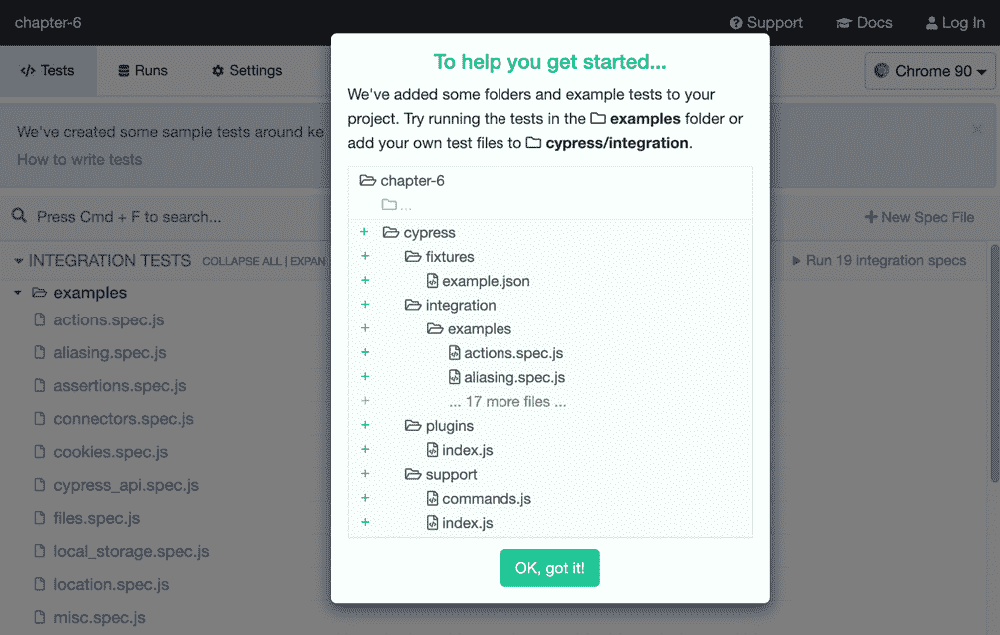
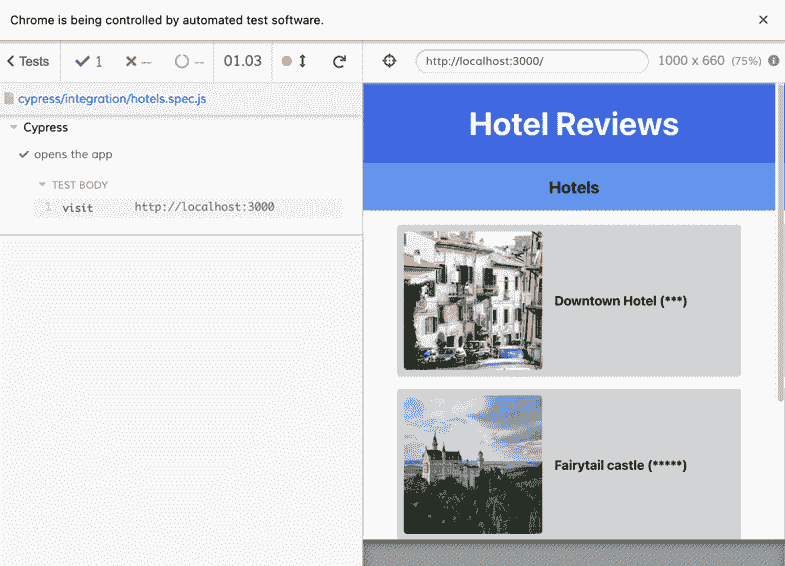

# *第六章*：使用 React Testing Library 和 Cypress 探索 TDD 构建应用

为了保持您的应用可维护，为项目设置测试是一个好的实践。虽然一些开发者讨厌编写测试并因此试图避免编写它们，但其他开发者喜欢将测试作为他们开发过程的核心，通过实施**测试驱动开发**（**TDD**）策略。关于测试应用和如何进行测试有许多不同的观点。幸运的是，当使用 React 构建应用时，许多优秀的库可以帮助您进行测试。

在本章中，您将使用**React Testing Library**工具对 React 应用进行单元测试。这个库由 React 社区本身维护，并随 Create React App 一起提供。它具有许多针对测试组件和其他 React 功能整个生命周期的功能。因此，如果您想测试函数或组件在给定特定输入时是否按预期行为，React Testing Library 是测试大多数 React 应用的绝佳选择。此外，我们还将探索另一个名为**Cypress**的工具，它非常适合对我们的 React 应用进行端到端测试。

本章将涵盖以下主题：

+   单元测试组件

+   测试 React 状态和 Hooks

+   使用 Cypress 进行端到端测试

# 项目概述

在本章中，我们将创建一个使用 React 构建的酒店评论应用，该应用使用 Context API 进行状态管理。我们将添加 React Testing Library 来对这个应用进行单元和集成测试，同时使用 Cypress 进行端到端测试。该应用已经预构建，并使用我们在前几章中查看过的相同模式。

构建时间为 2 小时。

# 开始

本章的应用基于一个初始版本，您可以在[`github.com/PacktPublishing/React-Projects-Second-Edition/tree/main/Chapter06-initial`](https://github.com/PacktPublishing/React-Projects-Second-Edition/tree/main/Chapter06-initial)找到。本章的完整代码可以在 GitHub 上找到：[`github.com/PacktPublishing/React-Projects-Second-Edition/tree/main/Chapter06`](https://github.com/PacktPublishing/React-Projects-Second-Edition/tree/main/Chapter06)。

首先，从 GitHub 下载初始项目，然后进入此项目的根目录，在那里你必须运行`npm install`命令。由于此项目基于 Create React App 构建，运行此命令将安装`react`、`react-dom`和`react-scripts`。此外，还将安装`styled-components`和`react-router-dom`，以便它们可以处理应用程序的样式和路由。还将安装的是 React Test Library，你可以通过`@testing-library/*`前缀来识别它。完成安装过程后，你可以执行`npm start`命令来运行应用程序，以便你可以在浏览器中访问`http://localhost:3000`上的项目。初始应用程序包括一个简单的页眉和酒店列表。这些酒店有标题和元信息，例如缩略图。此页面将如下所示：


图 6.1 – 初始应用程序

如果你点击列表中的任何酒店，将打开一个新页面，显示该酒店的评论列表。通过点击页面左上角的按钮，你可以返回上一页，而通过点击右上角的按钮，将打开一个表单页面，你可以在此添加评论。如果你添加了新的评论，这些数据将被存储在全局上下文中，并发送到模拟 API 服务器：

如果你查看项目的结构，你会看到它与我们之前创建的项目使用相同的结构：

```js
chapter-6-initial 
  |- node_modules 
  |- public 
  |- package.json 
  |- src 
     |- components 
        |- Button 
           |- Button.js 
        |- FormItem 
           |- FormItem.js 
        |- Header 
           |- Header.js 
        |- HotelItem 
           |- HotelItem.js 
        |- NavBar 
           |- NavBar.js 
        |- ReviewItem 
           |- ReviewItem.js 
     |- context 
        |- AppContext.js 
        |- HotelsContext.js 
        |- ReviewsContext.js 
     |- pages 
        |- HotelDetail.js 
        |- Hotels.js 
        |- ReviewForm.js 
     |- App.js 
     |- index.js 
     |- setupTests.js
```

本章中非常重要的文件是`setupTests.js`，该文件用于为此项目配置 React Testing Library。此应用的入口点是一个名为`src/index.js`的文件，它渲染了一个名为`App`的组件。在这个`App`组件中，所有路由都被声明并包裹在一个`Router`组件中。这些路由如下所示：

+   `/`：此页面渲染`Hotels`，显示所有酒店的概述。

+   `/hotel/:hotelId`：此页面渲染`HotelDetail`，显示特定酒店的评论概述。

+   `/hotel/:hotelId/new`：此页面渲染`ReviewForm`，包含一个表单，可以添加特定酒店的评论。

数据是从使用 GitHub 项目根目录中的免费`db.json`文件创建的模拟服务器中获取的。此文件包含一个具有两个字段`hotels`和`reviews`的 JSON 对象，在模拟服务器上创建了多个端点。在本章中，你将使用以下端点：

+   [`my-json-server.typicode.com/PacktPublishing/React-Projects-Second-Edition/hotels`](https://my-json-server.typicode.com/PacktPublishing/React-Projects-Second-Edition/hotels)

+   [`my-json-server.typicode.com/PacktPublishing/React-Projects-Second-Edition/reviews`](https://my-json-server.typicode.com/PacktPublishing/React-Projects-Second-Edition/reviews)

`db.json` 文件必须存在于你的 GitHub 仓库的 master 分支（或默认分支）中，以便 My JSON Server 能够正常工作。否则，当你尝试请求 API 端点时，你会收到一个 **404 Not Found** 的消息。

# 酒店评论应用程序

在本节中，我们将向在 Create React App 中创建的酒店评论应用程序添加单元测试和集成测试。这个应用程序允许你向酒店列表添加评论，并从应用程序上下文中控制这些数据。我们将使用 React Testing Library 来渲染 React 组件，以测试这些组件的断言。

## 组件的单元测试

单元测试是应用程序的重要组成部分，因为你希望知道你的函数和组件在代码更改时仍然按预期行为。为此，我们将使用 React Testing Library，这是一个由 React 社区创建的开源测试包，用于 React 应用程序。使用 React Testing Library，你可以测试断言——例如，函数的输出是否与预期的值匹配。

要开始，我们不需要安装任何东西；它是 Create React App 的一部分。如果你查看 `package.json` 文件，你会看到已经有一个用于运行测试的脚本。让我们看看如果你从终端执行以下命令会发生什么：

```js
npm run test 
```

这将返回一条消息，说明 `No tests found related to files changed since last commit.`，这意味着我们的测试正在监视模式下运行，并且只针对已更改的文件运行测试。在底层，我们使用 Jest 测试运行器来运行我们的测试。按下 *A* 键，你可以运行所有测试，即使你没有修改任何文件。如果你按下这个键，将会显示以下消息：

```js
No tests found related to files changed since last commit. 
```

Jest 将自动检查 `src` 目录下的所有文件，并寻找测试文件。在本节的第一部分，我们将展示如何使用 React Test Library 创建可以运行的测试。

### 创建单元测试

由于 Jest 有多种方法可以检测哪个文件包含测试，让我们选择一个结构，其中每个组件都有一个单独的测试文件。这个测试文件将与包含组件的文件具有相同的名称，并带有 `.test` 后缀。如果我们选择 `NavBar` 组件，我们可以在 `src/components/NavBar` 目录中创建一个名为 `NavBar.test.js` 的新文件。将以下代码添加到该文件中：

```js
test('The NavBar component should render', () => {

});
```

这里使用 Jest 的全局 `test` 函数来定义一个测试；测试断言可以放置在大括号内。或者，你也可以使用 `describe` 或 `it` 函数来声明一个（块）测试。

如果我们现在再次运行 `npm run test` 命令，Jest 运行器将找到我们的第一个测试并显示以下输出：

```js
PASS  src/components/NavBar/NavBar.test.js
  ✓ The NavBar component should render (1 ms)
Test Suites: 1 passed, 1 total
Tests:       1 passed, 1 total
Snapshots:   0 total
Time:        3.105 s
Ran all test suites related to changed files.
```

在测试的定义中，你可以添加如 `toEqual` 或 `toBe` 这样的假设，这些假设检查值是否与某物完全相等，或者类型是否仅匹配。这些假设可以添加到 `test` 函数的回调中：

```js
  test('The NavBar component should render', () => {
+   expect(1 + 2).toBe(3);
  });
```

如果你还在终端中运行测试脚本，你会看到 Jest 已经检测到你的测试。测试成功，因为 `1+2` 确实等于 `3`。让我们继续将假设更改为以下内容：

```js
  test('The NavBar component should render', () => {
-   expect(1 + 2).toBe(3);
+   expect(1 + 2).toBe('3');
  });
```

现在，测试将失败，因为第二个假设不匹配。尽管 `1+2` 仍然等于 `3`，但假设返回的是一个值为 `3` 的字符串类型，而实际上返回的是一个数字类型。如果你还在终端中运行 `npm run test` 命令，你还可以在那里看到这个解释。

然而，这个假设实际上没有使用，因为它没有测试你的组件。要测试你的组件，你需要渲染它。渲染组件以便测试它们将在本节的下一部分处理。

### 渲染 React 组件进行测试

Jest 基于 Node.js，这意味着它不能使用浏览器或（虚拟）DOM 来渲染你的组件并测试其功能。因此，我们将使用 React 测试库来帮助我们渲染这些组件。Create React App 默认包含这个库，它使用的包可以在 `package.json` 文件中找到：

+   `@testing-library/jest-dom`：提供用于测试 DOM 的自定义元素

+   `@testing-library/react`：React 测试库的核心包

+   `@testing-library/user-events`：提供用于测试用户交互的方法

React 测试库可以为我们渲染 React 组件，这样我们就可以为它们编写测试。前面的包将用于创建我们的测试：

1.  在我们的 `NavBar` 组件的测试文件中，我们可以使用 `@testing-library/react` 的 `render` 方法来渲染组件，并获取该组件的输出。通过 Jest 的 `toMatchSnapshot` 假设，我们可以通过从这个渲染创建快照并与每次运行测试时实际组件进行比较来测试组件的结构：

    ```js
    + import { render } from '@testing-library/react';
    + import NavBar from './NavBar';
      test('The NavBar component should render', () => {
    -   expect(1 + 2).toBe('3');
    +   const view = render(<NavBar />);
    +   expect(view).toMatchSnapshot();
      });
    ```

1.  在 `src/components/NavBar` 目录中，Jest 已经创建了一个名为 `__snapshots__` 的新目录。在这个目录中有一个名为 `NavBar.test.js.snap` 的文件，其中包含快照。如果你打开这个文件，你会看到存储在这里的 `NavBar` 组件的渲染版本：

    ```js
    // Jest Snapshot v1, https://goo.gl/fbAQLP
    exports[`The NavBar component should render 1`] = `
    Object {
      "asFragment": [Function],
      "baseElement": <body>
        <div>
          <div
            class="sc-gsDJrp PAvEv"
          >
            <h2
              class="sc-dkPtyc jFfuUr"
            />
          </div>
        </div>
      </body>,
      // ...
    ```

使用 `styled-components` 创建的组件将被渲染为带有 `sc-*` 前缀的类名的 HTML 元素。

1.  由于没有将属性传递给 `NavBar` 组件，React 测试库实际上没有渲染任何值。你可以通过传递，例如，一个 `title` 属性给组件来检查快照是如何工作的：

    ```js
      import { render } from '@testing-library/react';
      import NavBar from './NavBar';
      // ...
    + test('The NavBar component should render with a title',
        () => {
    +   const view = render(<NavBar title='Test application' 
                            />);
    +   expect(view).toMatchSnapshot();
    + });
    ```

1.  下次运行测试时，将在 `src/components/NavBar/__snapshots__/NavBar.test.js.snap` 文件中添加一个新的快照。此快照具有 `title` 属性的渲染值。如果您更改测试文件中 `NavBar` 组件显示的 `title` 属性，渲染的组件将不再匹配快照。您可以通过更改测试场景中的 `title` 属性的值来尝试此操作：

    ```js
      import { render } from '@testing-library/react';
      import NavBar from './NavBar';
      // ...
      test('The NavBar component should render with a
        title', () => {
    -   const view = 
          render(<NavBar title='Test application' />);
    +   const view = 
          render(<NavBar title='Test application #2' />);
        expect(view).toMatchSnapshot();
      });
    ```

Jest 将在终端返回以下消息，其中指定了与快照相比哪些行已更改。在这种情况下，正在显示的标题不再是 `Test Application`，而是 `Test Application #2`，这与快照中的标题不匹配：

```js
FAIL  src/components/NavBar/NavBar.test.js
  ✓ The NavBar component should render (29 ms)
  ✕ The NavBar component should render with a title
    (10 ms)
  ● The NavBar component should render with a title
    expect(received).toMatchSnapshot()
    Snapshot name: `The NavBar component should render
    with a title 1`
    - Snapshot  - 3
    + Received  + 3
    @@ -6,23 +6,23 @@
              class="sc-gsDJrp PAvEv"
            >
              <h2
                class="sc-dkPtyc jFfuUr"
              >
    -           Test application
    +           Test application #2
    // ...
```

通过按 *U* 键，您可以更新快照以处理此新的测试场景。这是一种测试组件结构和查看标题是否已渲染的简单方法。在先前的测试中，最初创建的快照仍然与第一个测试的渲染组件匹配。此外，为第二个测试还创建了一个快照，其中为 `NavBar` 组件添加了 `title` 属性。

注意

您可以对传递给 `NavBar` 组件的其他属性做同样的事情，如果传递或不传递某些属性，该组件的渲染方式将不同。除 `title` 外，此组件还接受 `goBack` 和 `openForm` 作为属性，这些属性也可以进行测试。

我们现在为我们的 `NavBar` 组件创建了两个测试，这是一个良好的开始。但 Jest 还会向您展示您的测试覆盖了多少行代码。测试覆盖率越高，就越有理由假设您的代码是稳定的。您可以通过使用带有 `--coverage` 标志和中间额外一个 `--` 的 `test` 脚本命令来检查代码的测试覆盖率，或者在您的终端中使用以下命令：

```js
npm run test -- --coverage
```

此命令将运行您的测试并生成一个报告，其中包含有关您代码每个文件的所有测试覆盖率信息。在为 `NavBar` 添加测试之后，此报告将如下所示：

```js
---------------------------|---------|----------|---------|---------|
File                       | % Stmts | % Branch | % Funcs | % Lines | Uncovered Line #s 
---------------------------|---------|----------|---------|---------|
All files                  |       5 |     4.68 |    3.12 |       5 |                   
 src                       |       0 |      100 |       0 |       0 |                   
  App.js                   |       0 |      100 |       0 |       0 | 
  index.js                 |       0 |      100 |     100 |       0 |              
 src/components/Button     |     100 |      100 |     100 |     100 |
  Button.js                |     100 |      100 |     100 |     100 |                   
 src/components/FormItem   |       0 |        0 |       0 |       0 |                   
  FormItem.js              |       0 |        0 |       0 |       0 | 
 src/components/Header     |       0 |      100 |       0 |       0 |                   
  Header.js                |       0 |      100 |       0 |       0 | 
 src/components/HotelItem  |       0 |      100 |       0 |       0 |                   
  HotelItem.js             |       0 |      100 |       0 |       0 | 
 src/components/NavBar     |     100 |       60 |     100 |     100 |                   
  NavBar.js                |     100 |       60 |     100 |     100 | 
  // ...
```

注意

测试覆盖率仅告诉我们有关您代码中已测试的行和函数的信息，而不是它们的实际实现。测试覆盖率为 100%并不意味着您的代码中没有错误，因为总会存在边缘情况。此外，达到 100%的测试覆盖率意味着您可能花费更多的时间在编写测试上，而不是实际代码上。通常，测试覆盖率超过 80%被认为是良好的实践。

如您所见，组件的测试覆盖率为 60%，这意味着您的测试覆盖了大多数行。要达到 100%的覆盖率，我们还需要为在 `NavBar` 组件中用于渲染返回上一阶段按钮或 `form` 组件的其他属性添加测试。此外，`Button` 组件的覆盖率为 100%，因为没有实际元素在那里渲染。

然而，使用快照进行测试的方法将会创建大量的新文件和代码行。我们将在本节下一部分探讨其他测试组件的方法。

### 使用断言测试组件

理论上，快照测试并不一定是不良实践；然而，随着时间的推移，你的文件可能会变得相当大。另外，由于你没有明确告诉 Jest 你想测试组件的哪个部分，你可能需要定期更新你的代码。

幸运的是，使用快照并不是测试组件是否正确渲染属性的唯一方法。相反，我们还可以直接比较渲染的属性，通过检查组件的值并做出断言。使用断言测试的优势在于，你可以在不深入测试组件逻辑的情况下测试很多内容。例如，你可以看到正在渲染的子组件的外观。

让我们将`NavBar`组件的第二张快照测试更改为比较对测试覆盖率的影响。我们需要从 React Testing Library 导入`screen`方法，该方法用于扫描渲染的组件。我们不会对整个组件创建快照并在其中找到标题，而是会寻找任何标题组件（如`h2`），并检查它们的值是否等于我们在`NavBar`上设置的属性：

```js
- import { render } from '@testing-library/react';
+ import { render, screen } from '@testing-library/react';
  import NavBar from './NavBar';
  // ...
+ test('The NavBar component should render with a title', 
    () => {
-   const view = 
      render(<NavBar title='Test application #2' />);
-   expect(view).toMatchSnapshot();
+   const title = 'Test application';
+   render(<NavBar title={title} />);
+   expect(screen.getByRole('heading')).
           toHaveTextContent(title);
  });
```

我们已经使用了 React Testing Library 的`getByRole`方法在`NavBar`组件中找到`Title`组件，并使用`toHaveTextContent`方法检查`Title`内部的文本是否与我们设置的属性相等。测试仍然通过，并且允许我们删除快照，因为我们现在正在使用假设来测试组件的这一部分：

```js
PASS  src/components/NavBar/NavBar.test.js
  ✓ The NavBar component should render (13 ms)
  ✓ The NavBar component should render with a title (54 ms)
 › 1 snapshot obsolete.
   • The NavBar component should render with a title 1
Snapshot Summary
 › 1 snapshot obsolete from 1 test suite. To remove it, press `u`.
   ↳ src/components/NavBar/NavBar.test.js
       • The NavBar component should render with a title 1
```

通过按*U*键或使用带有`-u`标志的`npm run test`命令，Jest 将移除`NavBar`组件的快照：

```js
Snapshot Summary
 › 1 snapshot removed from 1 test suite.
   ↳ src/components/NavBar/NavBar.test.js
       • The NavBar component should render with a title 1 
```

`NavBar`组件的测试覆盖率仍应为 60%，因为我们继续测试`title`属性是否被呈现和渲染，你可以通过再次运行来检查：

```js
---------------------------|---------|----------|---------|---------|
File                       | % Stmts | % Branch | % Funcs | % Lines | Uncovered Line #s 
---------------------------|---------|----------|---------|---------|
All files                  |       5 |     4.84 |    3.33 |       5 |                   
 src                       |       0 |      100 |       0 |       0 |                   
  App.js                   |       0 |      100 |       0 |       0 | 
  index.js                 |       0 |      100 |     100 |       0 |               
src/components/NavBar      |     100 |       60 |     100 |     100 |                   
  NavBar.js                |     100 |       60 |     100 |     100 |
  // ...
```

然而，`NavBar`组件不仅接受`title`属性，还接受`goBack`和`openForm`函数作为属性。你还需要测试在点击任何按钮时这些函数是否被触发。

为了测试这些属性，我们需要创建一个模拟函数，并将其作为属性传递给`NavBar`，以模拟用户点击事件来测试该函数是否被调用。React Testing Library 中的`fireEvent`方法可以用来模拟用户事件，并且使用 Jest，我们可以模拟一个函数并检查该函数是否被调用：

```js
- import { render, screen } from '@testing-library/react';
+ import { render, screen, fireEvent } from 
    '@testing-library/react';
  import NavBar from './NavBar';

  // ...
+ test('The NavBar component should respond to button
    clicks', () => {
+   const mockFunction = jest.fn();
+   render(<NavBar goBack={mockFunction} />);
+   fireEvent.click(screen.getByText('< Go Back'));
+   expect(mockFunction).toHaveBeenCalled();
+ });
```

通过运行前面的测试，将在`NavBar`中模拟点击*后退*按钮，Jest 将检查模拟函数是否被调用。同样，也可以对`openForm`属性进行操作：

```js
  // ...
  test('The NavBar component should respond to button
    clicks', () => {
    const mockFunction = jest.fn();
-   render(<NavBar goBack={mockFunction} />);
+   render(<NavBar goBack={mockFunction} openForm=
      {mockFunction} />);
    fireEvent.click(screen.getByText('< Go Back'));
    expect(mockFunction).toHaveBeenCalled();
+   fireEvent.click(screen.getByText('+ Add Review'));
+   expect(mockFunction).toHaveBeenCalledTimes(2);
  });
```

`goBack` 和 `openForm` 属性的模拟函数是相同的，因此我们需要检查在点击打开表单按钮后这个函数是否被调用两次。通过测试这两个按钮上的用户事件，我们已经测试了 `NavBar` 组件的 100%，正如你可以在覆盖率报告中看到的那样：

```js
PASS  src/components/NavBar/NavBar.test.js
  ✓ The NavBar component should render (27 ms)
  ✓ The NavBar component should render with a title (45 ms)
  ✓ The NavBar component should respond to button clicks (13 ms)
---------------------------|---------|----------|---------|---------|
File                       | % Stmts | % Branch | % Funcs | % Lines | Uncovered Line #s 
---------------------------|---------|----------|---------|---------|
All files                  |       5 |     8.06 |    3.33 |       5 |                   
 src                       |       0 |      100 |       0 |       0 |                   
  App.js                   |       0 |      100 |       0 |       0 | 
  index.js                 |       0 |      100 |     100 |       0 |               
 src/components/NavBar     |     100 |      100 |     100 |     100 |
  NavBar.js                |     100 |      100 |     100 |     100 |
  // ...
```

在本节中，我们创建了单元测试来测试我们代码的特定部分。然而，测试我们代码的不同部分如何协同工作可能很有趣。为此，我们将添加集成测试来测试我们的状态管理和 Hooks。

## 测试 React 状态和 Hooks

我们创建的所有测试都渲染了没有状态管理的组件，但使用 React Testing Library，我们也有测试状态和 Hooks 的选项。在我们的设置中，由我们的路由器渲染的页面被包裹在一个应用程序上下文组件中。如果我们想要测试页面组件，我们需要确保这些页面的数据被模拟或存根，以便可以测试该组件与状态集成。

一个很好的例子是我们可以测试的 `Hotels` 组件，它渲染了上下文返回的酒店列表：

1.  和往常一样，起点是在我们想要测试的组件所在的同一目录下创建一个以 `.test` 后缀的新文件。在这里，我们需要在 `src/pages` 目录中创建 `Hotels.test.js` 文件。在这个文件中，我们需要添加以下代码：

    ```js
    import { render, screen } from 
      '@testing-library/react';
    import Hotels from './Hotels';
    import HotelsContext from '../context/HotelsContext';
    test('The Hotels component should render', async () => {
      const wrapper = ({ children }) => (
        <HotelsContext.Provider
          value={{
            loading: true,
            error: '',
            hotels: [],
            fetchHotels: jest.fn(),
          }}
        >
          {children}
        </HotelsContext.Provider>
      );
      render(<Hotels />, { wrapper });
      expect(await screen.findByText(
        'Loading...')).toBeVisible();
    });
    ```

前面的测试导入 `Hotels` 组件用于渲染页面的上下文对象，并创建一个包装函数，该函数在 `HotelsContext` 上创建一个提供者。我们向这个 `Provider` 添加了 `Hotels` 组件使用的上下文的模拟值。我们的测试断言尝试查找具有 `Loading…` 文本值的元素，并检查它是否存在。由于我们上下文中 `loading` 的值为 `true`，该元素确实可以找到。

注意

要运行测试的一部分，你可以在运行 `npm run test` 命令后按 *P* 键；你现在可以在终端中输入一个字符串，该字符串将用于模式匹配测试文件。

1.  要测试当上下文中存在数据时酒店是否被渲染，我们需要在 `Hotels.test.js` 文件中创建一个新的测试来模拟这些数据：

    ```js
      import { render, screen } from 
        '@testing-library/react';
      import Hotels from './Hotels';
      import HotelsContext from 
        '../context/HotelsContext';
    + import { BrowserRouter } from 'react-router-dom';
     // ...
    + test('The Hotels component should render a list of 
        hotels', async () => {
    +   const wrapper = ({ children }) => (
    +     <BrowserRouter>
    +       <HotelsContext.Provider
    +         value={{
    +           loading: false,
    +           error: '',
    +           hotels: [
    +             { id: 1, title: 'Test hotel 1', 
                    thumbnail: '' },
    +             { id: 2, title: 'Test hotel 2', 
                    thumbnail: '' },
    +           ],
    +           fetchHotels: jest.fn(),
    +         }}
    +       >
    +         {children}
    +       </HotelsContext.Provider>
    +     </BrowserRouter>
    +   );
    + });
    ```

在前面的模拟上下文值中，`loading` 的值被设置为 `false`，并添加了模拟的酒店。请注意，我们还用 React Router 的 `BrowserRouter` 包装了 `Provider`，因为 `Hotels` 组件使用 `Link` 组件使酒店可点击。

1.  要测试酒店是否被渲染，我们需要添加一个测试断言来检查 `loading` 消息是否消失以及渲染了正确数量的酒店链接：

    ```js
      // ...
      test('The Hotels component should render a list of
        hotels', async () => {
        const wrapper = ({ children }) => (
          // ...
        );
    +   render(<Hotels />, { wrapper });
    +   expect(screen.queryByText('Loading...')
          ).toBeNull();
    +   expect(screen.getAllByRole('link'
          ).length).toBe(2);
      });
    ```

我们之前使用的 `getBy` 方法在找不到元素时会抛出错误；为了测试某些内容没有被渲染，我们需要使用 `queryBy` 方法。此外，我们需要通过查找 `link` 角色并计数来检查是否存在两个 `Link` 组件。

1.  `Hotels` 组件中的 `useEffect` 钩子也可以被测试，以检查在上下文中没有酒店时是否调用了 `fetchHotels` 函数。因此，我们可以通过从 React Testing Library 导入 `waitFor` 方法并稍微调整上下文值来编辑第一个测试：

    ```js
    - import { render, screen } from 
        '@testing-library/react';
    + import { render, screen, waitFor } from 
        '@testing-library/react';
      import Hotels from './Hotels';
      import HotelsContext from
        '../context/HotelsContext';
      import { BrowserRouter } from 'react-router-dom';
      test('The Hotels component should render', async ()
        => {
    +   const mockFunction = jest.fn()
        const wrapper = ({ children }) => (
          <HotelsContext.Provider
            value={{
              loading: true,
              error: '',
              hotels: [],
    -         fetchHotels: jest.fn(),
    +         fetchHotels: mockFunction,
            }}
          >
            {children}
          </HotelsContext.Provider>
        );
        // ...
    ```

1.  我们还添加了测试断言以等待模拟函数被调用。在这里，我们特别声明模拟的函数，即来自 `HotelsContext` 的 `fetchHotels`，只被调用一次。在我们的 `Hotels` 组件中，`useEffect` 有一个检查，只有在没有数据时才会获取酒店：

    ```js
        // ...
        render(<Hotels />, { wrapper });
        expect(await screen.findByText('Loading...')
          ).toBeVisible();
    +   await waitFor(() => 
          expect(mockFunction).toHaveBeenCalledTimes(1));
      });
      // ...
    ```

通过这个测试，我们已经测试了 `Hotels` 组件中的上下文以及在该函数中获取酒店数据的 `useEffect` 钩子。

再次运行带有 `--coverage` 标志的测试后，我们将能够看到编写这个集成测试对我们覆盖率的影响。由于集成测试不仅测试一个特定的组件，而是同时测试多个组件，因此 `Hotels` 的测试覆盖率将得到更新。这个测试还覆盖了 `HotelItem` 组件，我们将在运行 `npm run test --coverage` 后在覆盖率报告中看到这一点：

```js
---------------------------|---------|----------|---------|---------|
File                       | % Stmts | % Branch | % Funcs | % Lines | Uncovered Line #s 
---------------------------|---------|----------|---------|---------|
All files                  |   19.83 |    29.03 |   16.67 |   19.83 |                   
 src                       |       0 |      100 |       0 |       0 |                   
  App.js                   |       0 |      100 |       0 |       0 | 
  index.js                 |       0 |      100 |     100 |       0 |             
 src/components/HotelItem  |     100 |      100 |     100 |     100 |
  HotelItem.js             |     100 |      100 |     100 |     100 |                   
 src/components/NavBar     |     100 |      100 |     100 |     100 |                   
  NavBar.js                |     100 |      100 |     100 |     100 |                   
 src/context               |    8.16 |        0 |       0 |    8.16 |                   
  AppContext.js            |       0 |      100 |       0 |       0 | 
HotelsContext.js         |   16.67 |        0 |       0 |   16.67 | 
  ReviewsContext.js        |       0 |        0 |       0 |       0 | 
 src/pages                 |   21.95 |    34.21 |      20 |   21.95 |
Hotels.js                |     100 |      100 |     100 |     100 | 

  // ...  

```

根据 Jest，`Hotels` 的覆盖率达到了 100%。`HotelItems` 的测试覆盖率也达到了 100%。这意味着如果我们只在这个 `Hotels` 组件中使用这个组件，我们可以跳过为 `HotelItem` 编写单元测试。我们的 `HotelsContext` 组件已经通过从 `Hotels` 组件测试它而获得了一小部分覆盖率。为了获得更高的覆盖率，我们可以测试更多，例如测试上下文本身或上下文中的 `useReducer` 钩子的行为。

在集成测试相对于单元测试的唯一缺点是，它们更难编写，因为它们通常包含更复杂的逻辑。此外，由于它们包含更多的逻辑并集成了多个组件，这些集成测试的运行速度会比单元测试慢。在本章的最后部分，我们将添加一个端到端测试，该测试将从用户的角度使用 Cypress 测试整个应用程序。

## 使用 Cypress 进行端到端测试

到目前为止，我们已经使用 React Testing Library 覆盖了单元测试和集成测试，该库在隔离环境中测试我们的代码。但为了确保我们的应用程序作为一个整体被测试，我们还可以编写端到端测试来覆盖应用程序的某些方面从开始到结束。端到端测试被认为比单元测试或集成测试编写和运行更耗时。建议您的项目中单元测试和集成测试的数量要多于端到端测试，并考虑您真正希望测试应用程序的哪些方面。

要添加端到端测试，我们将安装开源测试工具 Cypress，它可以用来编写和运行此类测试。将 Cypress 添加到项目需要几个步骤：

1.  通过在终端中运行以下命令，在我们的项目中从 npm 安装库：

    ```js
    npm install cypress --save-dev
    ```

1.  完成安装后，需要将运行 Cypress 的脚本添加到 `package.json` 文件中，以便可以通过单个命令启动：

    ```js
      // ... 
      "scripts": {
        "start": "react-scripts start",
        "build": "react-scripts build",
        "test": "react-scripts test",
    +   "cypress": "cypress open"
        "eject": "react-scripts eject"
      },
      // ...
    ```

1.  您现在可以运行 `npm run cypress` 命令来启动 Cypress。请确保在终端的新标签页中这样做，因为您需要同时运行应用程序和 Cypress。如果您这是第一次运行 Cypress，它将验证是否能在您的系统上运行。一切顺利的话，Cypress 将打开并在我们的项目中创建一个名为 `cypress` 的新目录，如下面的截图所示：



图 6.2 – Cypress 首次运行

1.  Cypress 在 `cypress/integration/examples` 目录中创建了示例测试，您可以使用这些测试来了解库的工作方式。否则，您可以删除这些测试，因为当我们添加新测试时，它们会 clutter Cypress 运行器。在 `cypress/integration` 目录中，我们可以为我们的项目添加一个名为 `hotels.spec.js` 的新端到端测试，其内容如下：

    ```js
    describe('Cypress', () => {   
        it('opens the app', () => {   
            cy.visit('http://localhost:3000') 
        })
    })
    ```

1.  您可以通过在 Cypress 运行器中点击它来运行此测试，之后测试将在浏览器中运行。它使用的浏览器取决于您在 Cypress 右上角选择的选项。此测试将在浏览器中打开应用程序并使用 Cypress 进行测试，输出如下：




图 6.3 – Cypress 在测试中渲染我们的应用程序

注意

您需要确保在您的终端中同时运行 Cypress 和应用程序。这意味着一个终端标签必须运行 `npm run cypress`，另一个运行 `npm start`。如果您没有运行应用程序，您将收到一个错误，表明网页不可用。

前面的测试将仅渲染我们的应用程序，而不进行任何断言。为了使用 Cypress 测试应用程序，我们需要使用库提供的任何断言。使用这些断言，我们将编写一个端到端测试，检查从访问应用程序到为酒店添加评论的整个流程。这样，我们就测试了应用程序中最关键的过程，即酒店评论。

首先，我们需要更改`hotels.spec.js`文件，使其打开应用程序并导航到酒店页面，然后在那个页面上点击按钮以打开表单。填写此表单后，我们希望测试提交表单并检查我们的评论是否已添加。按照以下步骤进行这些更改：

1.  所有在`hotels.spec.js`文件中的测试都将从在浏览器中访问应用程序开始，以便它可以点击此页面上列出的任何酒店。点击酒店后，我们需要使用`cy.location`方法验证浏览器中的位置是否已更改：

    ```js
      describe('Cypress', () => {
    -   it('opens the app', () => {   
    +   it('opens the app and clicks on a hotel', () => {
          cy.visit('http://localhost:3000');
    +     cy.get('a').first().click();
    +     cy.location('pathname').should('include',
            'hotel');
        });  
      });
    ```

运行此测试将验证您是否可以点击酒店并导航到正确的页面，您可以在 Cypress 运行器中检查。

注意

当您需要在不同的开发环境中访问多个 URL 时，您还可以在`cypress.json`文件中定义`baseUrl`：

`{`

`"id": "http://localhost:3000",`

`}`

1.  在第二个测试中，我们告诉 Cypress 找到带有`+ Add Review`文本的按钮并点击它，这将改变浏览器的位置到添加评论的页面。此页面位于`/hotel/:hotelId/new`路由，并包含`new`字符串。请注意，我们不再需要导航到应用程序，因为这个测试基于前面的测试，因此已经位于正确的页面：

    ```js
      describe('Cypress', () => {
        // ...
    +   it('navigates to the form to add a review', () =>
          {
    +     cy.get('button').contains('+ Add 
            Review').click();
    +     cy.location('pathname').should('include',
            'new');
    +   });
    });
    ```

1.  在前面的测试中，Cypress 将寻找包含特定单词的按钮，如果有人更改了按钮的内容，这并不是一个未来兼容的解决方案。在编写测试时决定使用哪个选择器（`id`、`class`或内容）非常重要。为了防止测试失败，您还可以向您的元素添加`data-cy`、`data-test`或`data-testid`属性。因此，我们需要更改`src/components/NavBar`中`Button`组件的渲染方式：

    ```js
      // ...
      function NavBar({ goBack, title, openForm = false })
        {
        return (
          <NavBarWrapper>
            {goBack && <NavBarButton onClick={goBack}>{`< 
              Go Back`} </NavBarButton>}
            <Title>{title}</Title>
            {openForm && 
              <NavBarButton 
                onClick={openForm}
    +           data-cy='addReview'        
              >
               {`+ Add Review`}
              </NavBarButton>
            }
          </NavBarWrapper>
        );
      }
      export default NavBar;
    ```

1.  在`cypress/integrations/hotels.spec.js` Cypress 测试文件中，我们可以寻找`data-cy`属性而不是使用按钮的内容作为选择器：

    ```js
      describe('Cypress', () => {
        // ...
        it('navigates to the form to add a review', () => 
          {
    -     cy.get('button').contains('+ Add 
            Review').click();
    +     cy.get('[data-cy=addReview]').click();
          cy.location('pathname').should('include', 
            'new');
        });
      });
    ```

1.  可以将一个用于填写表单以添加评论并提交的第三个测试也添加到该文件中。使用`cy.get`命令，Cypress 可以找到此页面上的`form`元素，并使用`within`方法在表单内查找`input`元素。它将搜索`input`字段的名称，向其中添加一个值，并最终提交表单内的`button`：

    ```js
      describe('Cypress', () => {
        // ...
    +   it('fills in and submits the form', () => {
    +     cy.get('form').within(() => {
    +       cy.get('input[name=title]').type('Test 
              review');
    +       cy.get('input[name=description]').type('Is a 
              test review by Cypress');
            cy.get('input[name=rating]').type(4);
            cy.get('button').click();
    +     });
    +   });
      });
    ```

1.  最后，我们需要编写一个测试，再次检查酒店详情页面，并尝试找到我们添加的新评论。为了找到这个评论，我们需要在页面上搜索 Cypress 刚刚添加的评论内容；同时，我们还需要添加一个`wait`命令以确保评论已经被处理并显示在屏幕上：

    ```js
      describe('Cypress', () => {
        // ...
    +   it('and verifies if the review is added', () => {
    +     cy.wait(600);
    +     cy.get('h3').contains('Test review');
    +     cy.get('div').contains('Is a test review by 
            Cypress');
    +   });
      });
    ```

通过向 Cypress 添加这个最后的测试，我们已经测试了我们应用程序最重要的场景，您可以通过添加测试边缘情况（如错误消息）来进一步扩展。

小贴士

我们没有为显示评论的元素添加`data-cy`属性，这是您可以自己添加的。由于我们了解我们刚刚添加的内容，因此可以安全地假设我们不需要一个复杂的选择器。

您可以添加更多功能，例如模拟 API 请求和响应，因为前面的测试正在使用与应用程序本身相同的 API。在这种情况下，这并没有什么问题，因为我们使用的 API 已经是一个模拟 API。如果您在生产环境中工作，您将希望用 Cypress 可以生成的模拟响应来替换它。

对于这一点，我们需要在我们的测试文件中添加一个`beforeEach`钩子，以拦截 API 调用并将响应替换为模拟值。这个模拟值的格式应该与实际 API 的格式相同。幸运的是，我们的 API 正在从您可以在本书仓库中找到的`db.json`文件中填充。从该文件的内容中，您可以提取酒店字段的数据，并将其粘贴到`cypress/fixtures`目录内的两个单独的文件中。让我们看看步骤：

1.  第一个可以命名为`hotels.json`，需要有一个包含酒店详细信息的对象数组：

    ```js
    [
      {
        "id": 1,
        "title": "Downtown Hotel (***)",
        "thumbnail": 
          "https://picsum.photos/id/369/400/400"
      }
    ]
    ```

1.  第二个固定值需要有一个单独的对象，用于替换单个酒店的 API 请求，文件名为`hotel.json`：

    ```js
    {
      "id": 1,
      "title": "Downtown Hotel (***)",
      "thumbnail": "https://picsum.photos/id/369/400/400"
    }
    ```

1.  通过在`cypress/integrations/hotels.spec.js`测试文件中添加一个`beforeEach`钩子和`cy.intercept`方法，可以拦截对实际 API 的调用。对于`hotels`和`hotels/*`端点，它可以返回固定值，而对于`reviews`端点，可以返回一个空数组，因为 Cypress 将自行添加评论：

    ```js
      describe('Cypress', () => {
    +   beforeEach(() => {
    +     cy.intercept('GET', 'PacktPublishing/
    React-Projects-Second-Edition/hotels', 
            { fixture: 'hotels.json' });
    +     cy.intercept('GET', 'PacktPublishing/
    React-Projects-Second-Edition/hotels/*', 
            { fixture: 'hotel.json' });
    +     cy.intercept('GET', 'PacktPublishing/
    React-Projects-Second-Edition/hotels/*/reviews', 
            []);
    +   })
        it('opens the app and clicks on a hotel', () => {
          // ...
    ```

通过打开 Cypress 运行器，您可以看到我们的测试现在正在使用固定值中的数据执行，因为 API 调用正在被拦截。

我们在本节中创建的测试为您编写 React 应用程序的端到端测试提供了一个良好的起点。此外，Cypress 还可以用于对您的应用程序进行视觉回归测试或测试 API 响应。

# 摘要

在本章中，我们介绍了使用 React Testing Library 和 Jest 对 React 应用程序进行测试。这两个包都是任何希望向其应用程序添加测试脚本的开发人员的绝佳资源，并且它们与 React 的工作非常出色。本章讨论了为您的应用程序编写测试的优势，并希望您现在知道如何向任何项目添加测试脚本。本章展示了单元测试和集成测试之间的区别，并且您还学习了如何使用 Cypress 编写端到端测试。

由于本章测试的应用程序结构与之前章节中的应用程序相同，因此相同的测试原则可以应用于本书中我们构建的任何应用程序。

下一章将结合本书中我们已经使用过的许多模式和库，因为我们将会使用 React、GraphQL 和 Apollo 创建一个全栈电子商务商店。

# 进一步阅读

更多信息，请参考以下链接：

+   React 测试库：[`testing-library.com/docs/react-testing-library/intro/`](https://testing-library.com/docs/react-testing-library/intro/)

+   Cypress：[`docs.cypress.io/`](https://docs.cypress.io/)
