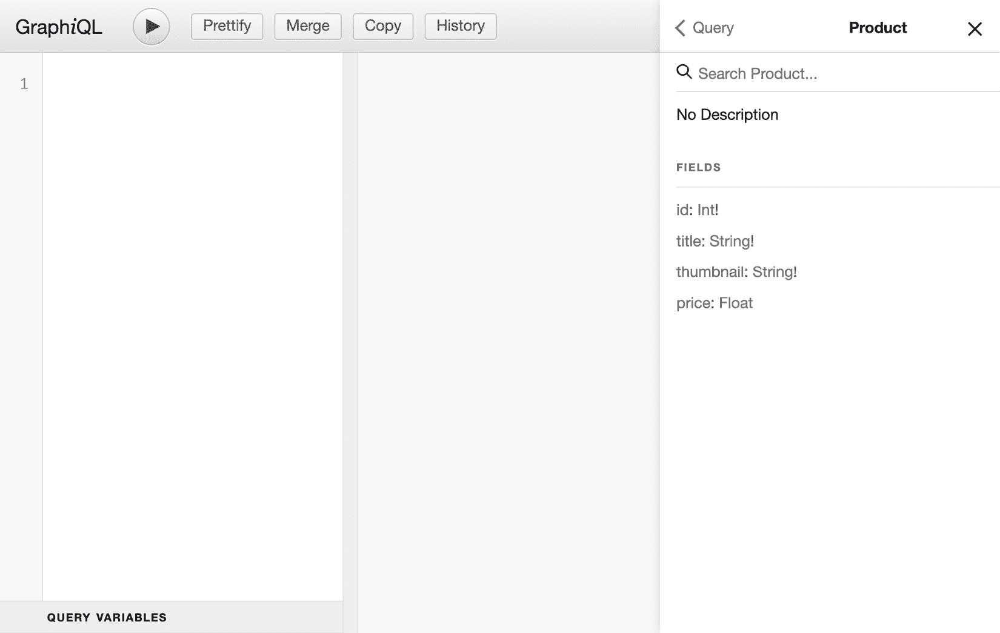
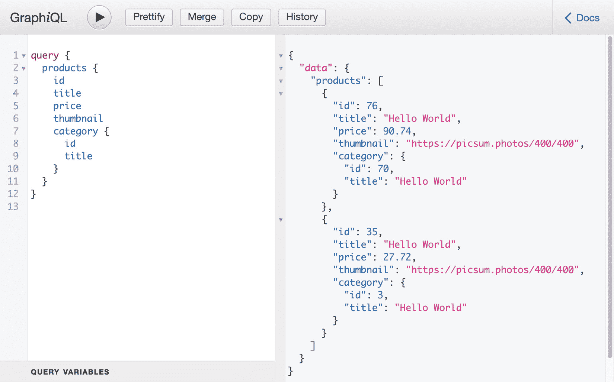
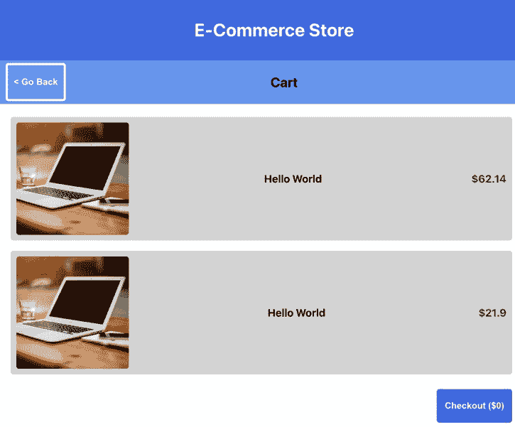
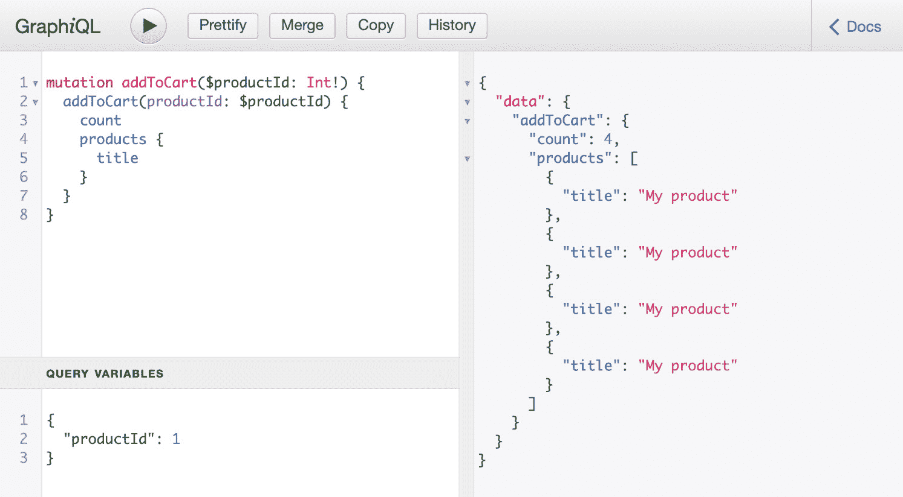
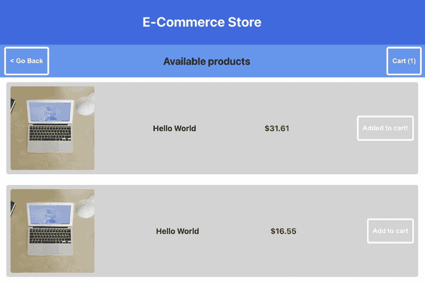
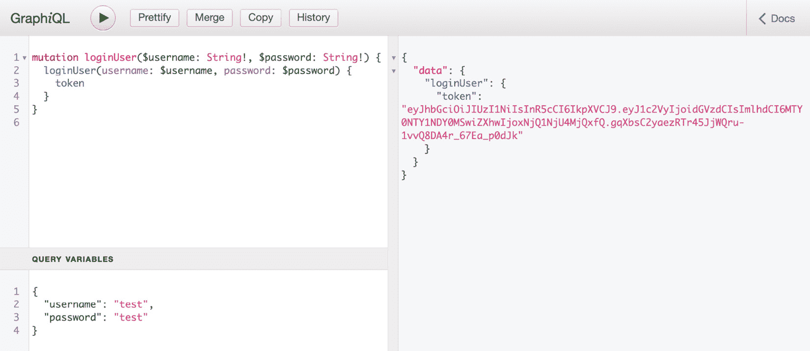

# 第七章：*第七章*：使用 Next.js 和 GraphQL 构建全栈电商应用

如果你正在阅读此内容，这意味着你已经到达了本书的最后一章，该章节专注于使用 React 构建网络应用。在前面的章节中，你已经使用了 React 的核心功能，例如渲染组件、使用 Context 和 Hooks 进行状态管理。你已经学习了如何为你的 React 应用添加路由或使用 Next.js 进行 SSR。此外，你还知道如何使用 Jest 和 Enzyme 为 React 应用添加测试。让我们通过添加 GraphQL 到你迄今为止所学的内容列表中，使这次体验成为全栈的。

在本章中，你不仅将构建应用的前端，还将构建后端。为此，我们将使用 GraphQL，它最好被定义为一个针对 API 的查询语言。使用模拟数据，你将在 Next.js 中创建一个 GraphQL 服务器，该服务器为你的 React 应用提供了一个端点。在前端方面，这个端点将通过 Apollo Client 进行消费，它帮助你处理向服务器发送请求以及对此数据的状态管理。

在本章中，将涵盖以下主题：

+   使用 Next.js 创建 GraphQL 服务器

+   使用 Apollo Client 消费 GraphQL

+   在 GraphQL 中处理身份验证

# 项目概述

在本章中，我们将使用 Next.js 创建一个全栈电商应用，该应用的后端是一个 GraphQL 服务器，并通过 Apollo Client 在 React 中消费这个服务器。对于前端，有一个初始应用可供快速入门。

构建时间为 3 小时。

# 入门

本章中我们将创建的项目基于你可以在 GitHub 上找到的初始版本：[`github.com/PacktPublishing/React-Projects-Second-Edition/tree/main/Chapter07-initial`](https://github.com/PacktPublishing/React-Projects-Second-Edition/tree/main/Chapter07-initial)。完整的源代码也可以在 GitHub 上找到：[`github.com/PacktPublishing/React-Projects-Second-Edition/tree/main/Chapter07`](https://github.com/PacktPublishing/React-Projects-Second-Edition/tree/main/Chapter07)。

初始项目基于 Next.js 的样板应用，旨在快速入门。此应用需要安装几个依赖项，你可以通过运行以下命令来完成：

```js
npm install && npm run dev
```

此命令将安装运行 Next.js 上的 React 应用所需的全部依赖，例如 `react`、`next` 和 `styled-components`。一旦安装过程完成，GraphQL 服务器和 React 应用都将启动。

## 使用初始 React 应用入门

由于该 React 应用程序是用 Next.js 创建的，因此可以使用 `npm run dev` 启动，并在 `http://localhost:3000/` 上可用。这个初始应用程序不显示任何数据，因为它还需要连接到 GraphQL 服务器，您将在本章的后面完成这项工作。因此，此时应用程序将仅渲染一个标题为 **E-Commerce Store** 的页眉以及一个副标题，看起来大致如下：

:


图 7.1 – 初始应用程序

使用 Next.js 构建的此初始 React 应用程序的结构如下：

```js
chapter-7-initial 
  |- /node_modules 
  |- /public 
  |- /pages 
     |- /api 
        |- /hello.js 
     |- /products 
        |- /index.js 
     |- /cart 
        |- /index.js 
     |- /login 
        |- /index.js 
     |- _app.js 
     |- index.js 
  |- /utils 
     |- hooks.js 
     |- authentication.js
  package.json 
```

在 `pages` 目录中，您可以找到此应用程序的所有路由。路由 `/` 由 `pages/index.js` 渲染，而路由 `/cart`、`/login` 和 `/products` 由相应目录中的 `.js` 文件渲染。所有路由都将包含在 `pages/_app.js` 中。在这个文件中，构建了所有页面的页眉。所有路由也将包含一个 `SubHeader` 组件，以及一个 `Button` 用于返回上一页或一个 `Button` 用于 `Cart` 组件。`utils` 目录包含两个文件，其中包含您在本章后面需要使用的方法。此外，此应用程序将在 `http://localhost:3000/api/hello` 下提供一个 REST 端点，该端点来自 `pages/api/hello.js` 文件。

# 使用 React、Apollo 和 GraphQL 构建全栈电子商务应用程序

在本节中，您将连接 React 网络应用程序到 GraphQL 服务器。Next.js API 路由上的 GraphQL 服务器用于创建一个使用动态模拟数据作为源的单一 GraphQL 端点。React 使用 Apollo Client 消费此端点并处理应用程序的状态管理。

## 使用 Next.js 创建 GraphQL 服务器

在 *第三章* 中，*构建动态项目管理板*，我们已经使用 Next.js 创建了一个 React 应用程序，其中已经提到您也可以用它来创建 API 端点。通过查看本章目录中的文件，您可以看到 `pages` 目录中有一个名为 `api` 的目录，其中包含一个名为 `hello.js` 的文件。您在 `pages` 目录中创建的所有目录和文件都将作为浏览器中的路由可用，但如果您在 `pages` 目录下的 `api` 目录中创建它们，它们被称为 API 路由。`hello.js` 文件就是这样一条 API 路由，它位于 `http://localhost:3000/api/hello` 下。此端点返回一个包含以下内容的 JSON 块：

```js
{"name":"John Doe"}
```

这是一个 REST 端点，我们也在本书的前几章中进行了探索。在本章中，我们将使用 GraphQL 端点，因为 GraphQL 是 Web 和移动应用程序使用的 API 的流行格式。

GraphQL 最好描述为 API 的查询语言，它被定义为从 API 检索数据的一种约定。通常，GraphQL API 与 RESTful API 相比较，后者是发送依赖于多个端点的 HTTP 请求的一种知名约定，这些端点将返回各自的数据集合。与知名的 RESTful API 相反，GraphQL API 将提供一个单一端点，允许您查询和/或突变数据源，如数据库。您可以通过向 GraphQL 服务器发送包含查询或突变操作的文档来查询或突变数据。无论什么数据可用，都可以在 GraphQL 服务器的模式中找到，该模式由定义可以查询或突变的数据的类型组成。

在创建 GraphQL 端点之前，我们需要在 Next.js 中设置服务器。因此，我们需要安装以下依赖项，这些依赖项是设置所必需的：

```js
npm install graphql @graphql-tools/schema @graphql-tools/mock express-graphql
```

在我们的应用程序中使用 GraphQL 需要`graphql`库，而`express-graphql`是 Node.js 的 GraphQL 服务器的一个小型实现。`@graphql-tools/schema`和`@graphql-tools/mock`都是开源库，可以帮助您创建 GraphQL 服务器。我们还可以删除`pages/api/hello.js`文件，因为我们不会使用这个 API 路由。

要设置 GraphQL 服务器，我们必须创建一个新的文件，`pages/api/graphql/index.js`，它将包含我们应用程序的单个 GraphQL 端点。我们需要导入`graphqlHTTP`来创建服务器。GraphQL 服务器的模式是在名为`typeDefs`的变量下编写的：

```js
import { graphqlHTTP } from 'express-graphql'; 
import { makeExecutableSchema } from '@graphql-tools/schema'; 
import { addMocksToSchema } from '@graphql-tools/mock';
const typeDefs = /* GraphQL */ ` 
  type Product { 
    id: Int! 
    title: String! 
    thumbnail: String! 
    price: Float 
  } 
  type Query {
    product: Product
    products(limit: Int): [Product]
  }
`;
```

在模式下方，我们可以使用`graphqlHTTP`实例启动 GraphQL 服务器，并将模式传递给它。我们还配置服务器为我们的模式中的所有值创建模拟。在文件底部，我们返回`handler`，这是 Next.js 用来在路由`http://localhost:3000/api/graphql`上使 GraphQL 服务器可用的：

```js
// ...
const executableSchema = addMocksToSchema({ 
  schema: makeExecutableSchema({ typeDefs, }), 
}); 
function runMiddleware(req, res, fn) { 
  return new Promise((resolve, reject) => { 
    fn(req, res, (result) => { 
      if (result instanceof Error) { 
        return reject(result); 
      } 
      return resolve(result); 
    }); 
  }); 
} 
async function handler(req, res) { 
  const result = await runMiddleware( 
    req, 
    res, 
    graphqlHTTP({ 
      schema: executableSchema, 
      graphiql: true, 
    }), 
  ); 
  res.json(result); 
} 
export default handler;
```

确保再次运行应用程序后，GraphQL API 在`http://localhost:3000/api/graphql`上可用。在浏览器页面上，GraphiQL 游乐场将显示，这里您可以使用和探索 GraphQL 服务器。

使用这个游乐场，您可以向 GraphQL 服务器发送查询和突变，这些可以在页面的左侧键入。您可以发送的查询和突变可以在该 GraphQL 服务器的**文档**中找到，您可以通过点击标记为**文档**的绿色按钮来查找。此按钮将打开一个概述，其中包含 GraphQL 服务器所有可能的返回值。



图 7.2 – 使用 GraphiQL 游乐场

当您在此页面的左侧描述查询或突变时，服务器返回的输出将在演示场的右侧显示。GraphQL 查询的构建方式将决定返回数据的结构，因为 GraphQL 遵循 *需要什么，就得到什么* 的原则。由于 GraphQL 查询总是返回可预测的结果，我们可以有一个如下所示的查询：

```js
query {
  products {
    id
    title
    price
  }
}
```

这将返回一个输出，其结构将与您发送到 GraphQL 服务器的文档中定义的查询结构相同。将此文档与查询一起发送到 GraphQL 服务器将返回一个对象数组，其中包含产品信息，默认情况下限制为 10 个产品。结果将以 JSON 格式返回，并且每次发送请求时都会包含不同的产品，因为数据是由 GraphQL 服务器模拟的。响应格式如下：

```js
{
  "data": {
    "products": [
      {
        "id": 85,
        "title": "Hello World",
        "price": 35.610056991945214
      },
      {
        "id": 24,
        "title": "Hello World",
        "price": 89.47561381959673
      }
    ]
  }
}
```

使用 GraphQL 的应用程序通常快速且稳定，因为它们控制着获取的数据，而不是服务器。使用 GraphQL，我们还可以在我们的数据中创建某些字段之间的关系，例如，通过在我们的产品中添加一个类别字段。这是通过在 `pages/api/graphql/index.js` 中的 GraphQL 模式中添加以下内容来完成的：

```js
// ...
  const typeDefs = `
    type Product {
      id: Int!
      title: String!
      thumbnail: String!
      price: Float
+     category: Category
    }
+   type Category {
+     id: Int!
+     title: String!
+   }
    type Query {
      product: Product
      products(limit: Int): [Product]
    }
  `;
  // ...
```

我们还可以通过将其添加到模式中来添加对 `type Category` 的查询：

```js
// ...
  const typeDefs = `
    // ...
    type Category {
      id: Int!
      title: String!
    }
    type Query {
      product: Product
      products(limit: Int): [Product]
+     categories: [Category]
    }
  `;
  // ...
```

产品现在将有一个名为 `category` 的新字段，但您也可以单独查询类别列表。由于 GraphQL 服务器的所有数据目前都是模拟的，您不需要连接一个提供类别信息的数据库。但我们可以指定某些字段应该如何模拟，例如，通过为我们的产品添加缩略图。因此，我们需要创建一个名为 `mocks` 的变量，将 `Product` 类型的字段缩略图设置为指向 [`picsum.photos`](https://picsum.photos) 的 URL。这是一个用于实时生成模拟图像的免费服务器：

```js
  // ...
+ const mocks = {
+     Product: () => ({
+       thumbnail: () => 'https://picsum.photos/400/400'
+     }),
+   };
   const executableSchema = addMocksToSchema({ 
schema: makeExecutableSchema({ typeDefs, }), 
+   mocks, 
  });
  // ...
```

除了在 `Product` 类型上模拟 `thumbnail` 字段外，我们还想模拟所有具有 `Int` 或 `Float` 类型的字段值。这两个字段现在通常是负值，这对其用作标识符或价格是不正确的。`Int` 类型用于定义标识符，而 `Float` 类型用于价格。我们也可以通过添加以下内容来模拟这些字段：

```js
  // ...
  const mocks = {
+   Int: () => Math.floor(Math.random() * 99) + 1,
+   Float: () => (Math.random() * 99.0 + 1.0).toFixed(2),
    Product: () => ({
      thumbnail: () => 'https://picsum.photos/400/400'
    }),
  };

    // ...
```

您可以通过尝试以下查询来检查此操作，该查询还请求产品的类别和缩略图：

```js
query {
  products {
    id
    title
    price
    thumbnail
    category {
      id
      title
    }
  }
}
```

您可以将前面的查询插入到 GraphQL 演示场中，以获取响应，其外观将类似于以下截图：



图 7.3 – 向 GraphQL 服务器发送查询

由于 GraphQL 服务器模拟了数据，因此每次您使用此查询发送新的请求时，值都会发生变化。但您可以通过在 HTTP 请求的正文发送查询来获得相同的响应，无论是从命令行还是从使用`fetch`的 React 应用程序。

您还可以使用像 Apollo Client 这样的库来使这个过程更加直观。这将在本章的下一节中解释，您将使用 Apollo 将 GraphQL 服务器连接到 React Web 应用程序，并从您的应用程序向服务器发送文档。

## 使用 Apollo Client 消费 GraphQL

在设置好 GraphQL 服务器后，让我们继续到从 React 应用程序向该服务器发送请求的部分。为此，您将使用 Apollo 包，这些包可以帮助您在应用程序和服务器之间添加一个抽象层。这样，您就不必担心自己使用例如`fetch`这样的方法将文档发送到 GraphQL 端点，可以直接从组件中发送文档。

### 设置 Apollo Client

如我们之前提到的，您可以使用 Apollo 连接到 GraphQL 服务器；为此，将使用 Apollo Client。使用 Apollo Client，您可以设置与服务器的连接，处理查询和突变，并为从 GraphQL 服务器检索的数据启用缓存，以及其他功能。您可以通过以下步骤将 Apollo Client 添加到应用程序中：

1.  要安装 Apollo Client 及其相关包，您需要从 React 应用程序初始化的`client`目录中运行以下命令：

    ```js
    npm install @apollo/client
    ```

这将安装 Apollo Client 以及您在 React 应用程序中使用 Apollo Client 和 GraphQL 所需的其他依赖项。

注意

通常，在安装 Apollo Client 时，我们还需要安装`graphql`，但这个库已经存在于我们的应用程序中。

1.  这些包应该导入到您想要创建包含与 GraphQL 服务器连接的 Apollo Provider 的`pages/_app.js`文件中：

    ```js
      import { createGlobalStyle } from 
        'styled-components';
    + import {
    +   ApolloClient,
    +   InMemoryCache,
    +   ApolloProvider,
    + } from "@apollo/client";
      import Header from '../components/Header';
      const GlobalStyle = createGlobalStyle` 
        // ...
    ```

1.  现在，您可以使用`ApolloClient`类来定义`client`常量，并将本地 GraphQL 服务器的位置传递给它：

    ```js
      // ...
    + const client = new ApolloClient({
    +   uri: 'http://localhost:3000/api/graphql/',
    +   cache: new InMemoryCache()
    + });
      function MyApp({ Component, pageProps }) {
        return (
          // ...
    ```

1.  在`MyApp`组件的`return`函数中，您需要添加`ApolloProvider`并将您刚刚创建的`client`作为属性传递：

    ```js
      // ...
      function MyApp({ Component, pageProps }) {
        return (
    -     <>
    +     <ApolloProvider client={client}>
            <GlobalStyle />
            <Header />
            <Component {...pageProps} />
    +     </ApolloProvider>
    -     </>
        );
      }
      export default MyApp;
    ```

在这些步骤之后，所有嵌套在`ApolloProvider`内的组件都可以访问此`client`，并通过查询和/或突变将文档发送到 GraphQL 服务器。在 Next.js 中，所有页面组件都是基于路由在`Component`下渲染的。从`ApolloProvider`获取数据的方法与我们之前使用的上下文 API 类似。

### 使用 React 发送 GraphQL 查询

Apollo Client 不仅导出了一个 Provider，还导出了从该 Provider 中消耗值的方法。这样，你可以轻松地使用添加到 Provider 中的客户端获取任何值。其中一种方法是`Query`，它可以帮助你发送一个包含查询的文档到 GraphQL 服务器，而无需使用`fetch`函数，例如。

由于`Query`组件应该始终嵌套在`ApolloProvider`组件内部，它们可以放置在`App`中渲染的任何组件中。其中之一是`pages/product/index.js`中的`Products`组件。该组件正在为`/`路由渲染，应显示电子商务店中可用的产品。

要从`Products`组件发送文档，请按照以下步骤操作，这将指导你使用`react-apollo`发送文档的过程：

1.  在`Products`页面组件中，你可以从`@apollo/client`导入`useQuery`钩子，并为命名查询`getProducts`定义一个常量。此外，你需要导入`gql`，以便在你的 React 文件中使用 GraphQL 查询语言，如下所示：

    ```js
      import styled from 'styled-components';
    + import { useQuery, gql } from '@apollo/client';
      import SubHeader from '../../components/SubHeader';
      import ProductItem from 
        '../../components/ProductItem';
      // ...
    + const GET_PRODUCTS = gql`
    +   query getProducts {
    +     products {
    +       id
    +       title
    +       price
    +       thumbnail
    +     }
    +   }
    + `;
      function Products() {
        // ...
    ```

1.  从`Products`组件中导入的`useQuery`钩子可以调用并处理基于传递给它的查询的数据获取过程。与上下文 API 类似，`useQuery`可以通过返回一个`data`变量来从 Provider 中消耗数据。你可以遍历此对象中的`products`字段，并返回已导入此文件的`ProductItem`组件列表。此外，还会返回一个`loading`变量，当 GraphQL 服务器尚未返回数据时，该变量将为`true`：

    ```js
      // ...
      function Products() {
    +   const { loading, data } = useQuery(GET_PRODUCTS);
        return (
          <>
            <SubHeader title='Available products' goToCart />
    +       {loading ? (
    +         <span>Loading...</span>
    +       ) : (
              <ProductItemsWrapper>
    +           {data && data.products && 
                 data.products.map((product) => (
    +               <ProductItem key={product.id} 
                      data={product} />
    +           ))}
              </ProductItemsWrapper>
    +       )}
                </>
        );
      };
      export default Products;
    ```

这将在你的应用程序挂载时发送一个包含`GET_PRODUCTS`查询的文档到 GraphQL 服务器，并随后在`ProductItem`组件列表中显示产品信息。在添加从 GraphQL 服务器检索产品信息的逻辑后，你的应用程序将类似于以下所示：



图 7.4 – 从 GraphQL 渲染产品

通过点击此页面的右上角按钮，你将导航到`/cart`路由，该路由也需要从 GraphQL 服务器查询数据。由于我们还没有检索购物车的查询，我们需要将其添加到`pages/api/graphql/index.js`中的 GraphQL 服务器。

1.  由于 GraphQL 服务器没有连接的数据源，我们可以使用`let`创建一个可变变量。这是一个我们希望稍后更新的对象，例如，当我们向购物车添加产品时：

    ```js
      import { graphqlHTTP } from 'express-graphql';
      import { makeExecutableSchema } 
        from '@graphql-tools/schema'; 
      import { addMocksToSchema } from '@graphql-tools/mock';
    + let cart = {
    +   count: 0,
    +   products: [],
    +   complete: false,
    + };
      const typeDefs = `
        // ... 
    ```

1.  在模式中，我们需要为`Cart`定义一个类型，并将此类型添加到我们 GraphQL 服务器的查询列表中：

    ```js
      // ...
      const typeDefs = `
        // ...
    +   type Cart {
    +     count: Int
    +     products: [Product]
    +     complete: Boolean
    +   }
        type Query {
          product: Product
          products(limit: Int): [Product]
          categories: [Category]
    +     cart: Cart
        }
      `;
      const mocks = {
        // ...
    ```

1.  在`pages/cart/index.js`文件中，已经导入了用于在购物车中渲染产品的组件。我们确实需要从`@apollo/client`导入`useQuery`钩子和`gql`，并创建查询常量：

    ```js
      import styled from 'styled-components';
    + import { useQuery, gql } from '@apollo/client';
      import { usePrice } from '../../utils/hooks';
      import SubHeader from '../../components/SubHeader';
      import ProductItem from 
        '../../components/ProductItem';
      import Button from '../../components/Button';
      // ...
    + const GET_CART = gql`
    +   query getCart {
    +     cart {
    +       products {
    +         id
    +         title
    +         price
    +         thumbnail
    +       }
    +     }
    +   }
    + `;
      function Cart() {
        // ...
    ```

1.  在 `Cart` 组件中，我们需要使用 `useQuery` 钩子获取我们想要显示的数据。在获取数据后，我们可以返回一个列表，其中包含添加到购物车中的产品以及结账按钮：

    ```js
      // ...
      function Cart() {
    +   const { loading, data } = useQuery(GET_CART);
        return (
          <>
            <SubHeader title='Cart' />
    +       {loading ? (
    +         <span>Loading...</span>
    +       ) : (
              <CartWrapper>
                <CartItemsWrapper>
    +             {data && data.cart.products &&
                   data.cart.products.map((product) => (
    +                <ProductItem key={product.id} 
                       data={product} />
    +              ))}
                </CartItemsWrapper>
    +           {data && data.cart.products.length > 
                  0 && (
    +             <Button backgroundColor='royalBlue'>
                    Checkout
                  </Button>
    +           )}
              </CartWrapper>
    +       )}
          </>
        );
      };
    export default Cart;
    ```

1.  由于购物车为空，这不会显示任何产品；在下一节中，购物车将被产品填充。然而，让我们通过将 `useQuery` 钩子添加到导航到 `SubHeader` 中按钮中，继续操作，`SubHeader` 在除 `/cart` 本身以外的路由上渲染。可以在 `components` 目录中创建一个名为 `CartButton.js` 的新文件。在这个文件中，`useQuery` 钩子将返回一个查询的数据，该查询请求购物车中产品的总数。此外，我们还可以通过向此文件添加以下代码来向 `Button` 组件添加一个值：

    ```js
    import { useQuery, gql } from '@apollo/client';
    import Button from './Button';
    export const GET_CART_TOTAL = gql`
      query getCart {
        cart {
          count
        }
      }
    `;
    function CartButton({ ...props }) {
      const { loading, data } = useQuery(GET_CART_TOTAL);
      return (
        <Button {...props}>
          {loading ? 'Cart' : `Cart (${data.cart.count})`}
        </Button>
      );
    }
    export default CartButton;
    ```

1.  这个 `CartButton` 组件替换了 `Button`，现在在 `components/SubHeader.js` 文件中以购物车中产品数量的占位符形式显示：

    ```js
      import styled from 'styled-components';
      import { useRouter } from 'next/router';
    - import Button from './Button';
    + import CartButton from './CartButton';
      // ...
      function SubHeader({ title, goToCart = false }) {
        const router = useRouter();
        return (
          <SubHeaderWrapper>
            // ...
            {goToCart && (
    -         <Button onClick={() => 
                router.push('/cart')}>
    -           Cart (0)
    -         </Button>
    +           <CartButton onClick={() => 
                  router.push('/cart')} />
            )}
          </SubHeaderWrapper>
        );
      }
      export default SubHeader;
    ```

在将显示产品或购物车信息的组件连接到 GraphQL 服务器后，你可以通过添加将产品添加到购物车的变更来继续操作。如何在应用程序中添加变更以及如何将文档容器变更发送到 GraphQL 服务器将在本节下一部分中展示。

### 处理 GraphQL 中的变更

变更数据使得使用 GraphQL 更有趣，因为当数据被变更时，应该执行一些副作用。例如，当用户将产品添加到他们的购物车时，购物车的数据应该在整个组件中更新。当你使用 Apollo Client 时，这相当简单，因为 Provider 以与上下文 API 相同的方式处理这一点。

现在的 GraphQL 服务器只有查询，还没有操作。添加变更与之前我们添加查询到模式的方式类似，但对于变更，我们还需要添加解析器。解析器是 GraphQL 中的魔法所在，也是模式与获取数据逻辑（可能来自数据源）链接的地方。变更的添加是在 `pages/api/graphql/index.js` 文件中完成的。

1.  第一步是将添加产品到购物车的变更添加到模式中。此变更以 `productId` 作为参数。此外，我们还需要在稍后模拟一个类型列表：

    ```js
       // ...
      const typeDefs =`
      // ...
      const typeDefs = gql`
       // ...
        type Cart {
          total: Float
          count: Int
          products: [Product]
          complete: Boolean
        }
        type Query {
          product: Product
          products(limit: Int): [Product]
          categories: [Category]
          cart: Cart
        }
    +   type Mutation {
    +     addToCart(productId: Int!): Cart
    +   }
      `;
      const mocks = {
        // ...
    ```

1.  到目前为止，我们模式中的所有值都是由 GraphQLServer 模拟的，但通常你会在模式中的每个类型上添加解析器。这些解析器将包含从数据源获取数据的逻辑。由于我们希望将 `Cart` 类型的值存储在此文件顶部创建的 `cart` 对象中，因此我们需要为 `addToCart` 变更添加一个解析器：

    ```js
      // ...
    + const resolvers = {
    +   Mutation: {
    +     addToCart: (_, { productId }) => {
    +       cart = {
    +         ...cart,
    +         count: cart.count + 1,
    +         products: [ 
    +           ...cart.products, 
    +           { 
    +             productId, 
    +             title: 'My product', 
    +             thumbnail: 'https://picsum.photos/400/400', 
    +             price: (Math.random() * 99.0 + 1.0).
    toFixed(2), 
    +             category: null, 
    +           }, 
    +         ],
    +       };
    +       return cart;
    +     },
    +   },
    + };
      const executableSchema = addMocksToSchema({
        // ...
    ```

1.  在创建 `graphqlHTTP` 实例时，我们需要传递我们为其创建的解析器，以便我们的更改生效：

    ```js
      // ...
        const executableSchema = addMocksToSchema({ 
        schema: makeExecutableSchema({ typeDefs, }),
        mocks, 
    +   resolvers,
      });
      // ...
      export default handler;
    ```

您可以通过在`http://localhost:3000/api/graphql`可用的 GraphQL playground 中尝试此突变来测试它。在这里，您需要在页面左上角的框中添加突变。您想要包含在此突变中的`productId`变量必须放置在页面左下角的框中，称为**查询变量**。这将产生以下输出：



图 7.5 – 在 GraphiQL playground 中使用突变

每次您使用此突变将文档发送到 GraphQL 服务器时，列表中都会添加一个新的产品。此外，`count`字段将增加`1`。但是，当您想要使用`Cart`类型的查询检索此信息时，值仍然将由 GraphQL 服务器模拟。为了返回`cart`对象，我们还需要为获取购物车信息的查询添加一个解析器：

```js
  // ...
  const resolvers = {
+   Query: {
+     cart: () => cart,
+   },
    Mutation: {
      // ...
    },
  };
    const executableSchema = addMocksToSchema({
    // ...
```

使用`addToCart`突变返回的响应将反映您可以使用购物车查询检索的内容。

为了能够从我们的 React 应用程序中使用此突变，我们需要进行以下更改：

1.  目前，还没有按钮可以将产品添加到购物车中，因此您可以在`components`目录中创建一个新文件，并命名为`AddToCartButton.js`。在这个文件中，您可以添加以下代码：

    ```js
    import { useMutation, gql } from '@apollo/client';
    import Button from './Button';
    const ADD_TO_CART = gql`
      mutation addToCart($productId: Int!) {
        addToCart(productId: $productId) {
          count
          products {
            id
            title
            price
          }
        }
      }
    `;
    function AddToCartButton({ productId }) {
      const [addToCart, { data }] = 
        useMutation(ADD_TO_CART);
      return (
        <Button
          onClick={() =>
            !data && addToCart({ variables: { productId } })
          }
        >
          {data ? 'Added to cart!' : 'Add to cart'}
        </Button>
      );
    }
    export default AddToCartButton;
    ```

这个新的`AddToCartButton`将`productId`作为属性，并使用来自`@apollo/client`的`useMutation` Hook，该 Hook 使用我们之前创建的突变。`Mutation`的输出是调用此突变的实际函数，该函数接受一个包含输入参数的对象作为参数。点击`Button`组件将执行突变并将`productId`传递给它。

1.  此按钮应显示在`/`或`/products`路由上的产品列表旁边，其中每个产品都通过`ProductItem`组件显示。这意味着您需要在`components/ProductItem.js`中导入`AddCartButton`，并通过以下代码向其传递一个`productId`属性：

    ```js
      import styled from 'styled-components';
      import { usePrice } from '../utils/hooks';
    + import AddToCartButton from './AddToCartButton';
      // ...
      function ProductItem({ data }) {
        const price = usePrice(data.price);
        return (
          <ProductItemWrapper>
            {data.thumbnail && <Thumbnail 
              src={data.thumbnail} width={200} />}
            <Title>{data.title}</Title>
            <Price>{price}</Price>
    +       <AddToCartButton productId={data.id} />
          </ProductItemWrapper>
        );
      }
      export default ProductItem;
    ```

现在，当您在浏览器中打开 React 应用程序时，将在产品标题旁边显示一个按钮。如果您点击此按钮，突变将被发送到 GraphQL 服务器，产品将被添加到购物车中。然而，您不会看到显示`SubHeader`组件的按钮有任何变化。

1.  在发送突变后执行此查询可以通过在`components/AddToCartButton.js`中的`useMutation` Hook 的`refetchQueries`选项中设置值来完成。此选项接受一个包含应请求的查询信息的对象数组。在这种情况下，它仅是`GET_CART_TOTAL`查询，由`CartButton`执行。为此，进行以下更改：

    ```js
      import { useMutation, gql } from '@apollo/client';
      import Button from './Button';
    + import { GET_CART_TOTAL } from './CartButton';
      // ...
      function AddToCartButton({ productId }) {
        const [addToCart, { data }] = 
          useMutation(ADD_TO_CART);
        return (
          <Button
            onClick={() =>
              !data && addToCart({
                variables: { productId },
    +           refetchQueries: 
                  [{ query: GET_CART_TOTAL }],
              })
            }
          >
            {data ? 'Added to cart!' : 'Add to cart'}
          </Button>
        );
      }
    export default AddToCartButton;
    ```

1.  当你点击 `CartButton` 时，我们将导航到 `/cart` 路由，在这里显示我们购物车中的产品。在这里，`AddToCartButton` 也会被渲染，因为这是在 `ProductItem` 组件中定义的。让我们通过访问 `components/ProductItem.js` 文件并添加以下代码行来更改这一点，这将条件性地渲染此按钮：

    ```js
      // ...
    - function ProductItem({ data }) {
    + function ProductItem({ data, addToCart = false }) {
        const price = usePrice(data.price);
        return (
          <ProductItemWrapper>
            {data.thumbnail && <Thumbnail 
              src={data.thumbnail} width={200} />}
            <Title>{data.title}</Title>
            <Price>{price}</Price>
    -       <AddToCartButton productId={data.id} />
    +       {addToCart && <AddToCartButton 
              productId={data.id} />}
          </ProductItemWrapper>
        );
      }
      export default ProductItem;
    ```

1.  从 `Products` 页面组件中，我们需要传递 `addToCart` 属性来渲染此页面上的按钮：

    ```js
        // ...
        return (
          <>
            <SubHeader title='Available products' goToCart 
            />
            {loading ? (
              <span>Loading...</span>
            ) : (
              <ProductItemsWrapper>
                {data && data.products && 
                  data.products.map((product) => (
                  <ProductItem 
                    key={product.id} 
                    data={product} 
    +               addToCart
                  />
                ))}
              </ProductItemsWrapper>
            )}
          </>
        );
      };
      export default Products;
    ```

现在，每次你从这个组件向 GraphQL 服务器发送文档突变时，都会发送 `GET_CART_TOTAL` 查询。如果结果已更改，`CartButton` 和 `Cart` 组件将使用这个新的输出进行渲染。因此，`CartButton` 组件将被更新以显示 `AddToCartButton` 组件：



图 7.6 – 更新购物车中的产品

在本节中，我们学习了如何设置 Apollo 客户端并使用它向 GraphQL 服务器发送文档。在本书的下一节中，我们将通过处理身份验证来扩展这一点。

### 在 GraphQL 中处理身份验证

到目前为止，我们已经创建了一个可以被使用 Next.js 和 React 构建的应用程序消费的 GraphQL 服务器。通过查询和突变，我们可以查看产品列表并将它们添加到购物车中。但我们还未添加检查购物车的逻辑，这将在本节中完成。

当用户将产品添加到购物车后，你希望他们能够进行结账；但在那之前，用户应该进行身份验证，因为你想要知道谁在购买该产品。

对于前端应用程序中的身份验证，大多数情况下使用 **JSON Web Tokens**（JWTs），这些是加密的令牌，可以轻松地用于与后端共享用户信息。JWT 将在用户成功认证后由后端返回，并且通常，此令牌将有一个过期日期。对于用户应该进行身份验证的每个请求，都应该发送此令牌，以便后端服务器可以确定用户是否已认证并且允许执行此操作。尽管 JWT 可以用于身份验证，因为它们是加密的，但不应将任何私人信息添加到其中，因为令牌仅应用于认证用户。只有当发送了包含正确 JWT 的文档时，服务器才能发送私人信息。

在我们能够将结账过程添加到 React 应用程序之前，我们需要使客户能够进行身份验证。这包括多个步骤：

1.  我们需要在模式中创建一个新的类型，该类型定义了用户和用于登录用户的突变，我们可以在 `pages/api/graphql/index.js` 中完成：

    ```js
      // ...
      const typeDefs = `
        // ... 
    +   type User {
    +     username: String!
    +     token: String!
    +   }
        type Query {
          product: Product
          products(limit: Int): [Product]
          categories: [Category]
          cart: Cart
        }
        type Mutation {
          addToCart(productId: Int!): Cart 
    +     loginUser(username: String!, password: String!):
            User
        }
      `;
      // ...
    ```

1.  在模式中定义突变后，可以将其添加到解析器中。在 `utils/authentication.js` 文件中，已经存在一个用于检查 `username` 和 `password` 组合的方法。如果这个组合是正确的，该方法将返回一个有效的令牌以及用户名。从这个文件中，我们还导入了一个用于检查令牌是否有效的方法：

    ```js
      import { graphqlHTTP } from 'express-graphql'; 
      import { makeExecutableSchema } 
        from '@graphql-tools/schema'; 
      import { addMocksToSchema } from '@graphql-tools/mock';
    + import { loginUser, isTokenValid } 
        from '../../../utils/authentication';

      // ...
      const resolvers = {
        Query: {
          cart: () => cart,
        },
        Mutation: {
    +     loginUser: async (_, { username, password }) => 
          {
    +       const user = loginUser(username, password);
    +       if (user) {
    +         return user;
    +       }
    +     },
          // ...
    ```

从 GraphiQL 游乐场，我们现在可以通过输入用户名 `test` 和密码 `test` 来检查这个突变是否工作：



图 7.7 – 使用 GraphQL 创建 JWT

1.  在 `pages/login/index.js` 文件中，我们可以添加逻辑来使用表单的输入来发送包含 `loginUser` 变化的文档到 GraphQL 服务器。`Login` 页面组件已经使用 `useState` 钩子来控制 `username` 和 `password` 输入字段的值。可以从 `@apollo/client` 导入 `useMutation` 钩子：

    ```js
      import { useState } from 'react';
    + import { useMutation, gql } from '@apollo/client';
      // ...
    + const LOGIN_USER = gql`
    +   mutation loginUser($username: String!, $password:
          String!) {
    +     loginUser(username: $username, 
            password: $password) {
    +       username
    +       token
    +     }
    +   }
    + `;
      function Login() {
        const [username, setUsername] = useState('');
        const [password, setPassword] = useState('');
    +   const [loginUser, { data }] = 
          useMutation(LOGIN_USER);
        return (
          // ...
    ```

1.  在创建 `loginUser` 函数后，我们可以将其添加到 `form` 元素的 `onSubmit` 事件中，并将 `username` 和 `password` 的值作为变量传递给此函数：

    ```js
      // ...
      function Login() {
        // ...
        return (
          <>
            <SubHeader title='Login' />
            <FormWrapper>
              <form
    +           onSubmit={(e) => {
    +             e.preventDefault();
    +             loginUser({ variables: { username, 
                    password } });
    +           }}
              >
                // ...
    ```

1.  点击 `Button` 将会发送包含 `username` 和 `password` 值的文档到 GraphQL 服务器，如果成功，它将返回该用户的 JWT。此令牌也应存储在会话存储中，以便以后使用。此外，我们希望在用户登录后将其重定向回主页。为此，我们需要从 React 导入一个 `useEffect` 钩子来监视数据的变化。当令牌存在时，我们可以使用从 `useRouter` 钩子获得的 `router` 对象，我们需要从 Next.js 导入这个钩子：

    ```js
    - import { useState } from 'react';
    + import { useState, useEffect } from 'react';
      import { useMutation, gql } from '@apollo/client';
    + import { useRouter } from 'next/router';
      // ...
      function Login() {
        const [username, setUsername] = useState('');
        const [password, setPassword] = useState('');
        const [loginUser, { data }] = 
          useMutation(LOGIN_USER);
    +   const router = useRouter();
    +   useEffect(() => {
    +     if (data && data.loginUser && 
            data.loginUser.token) {
    +       sessionStorage.setItem('token',
              data.loginUser.token);
    +       router.push('/');
    +     }
    +   }, [data]);
      return (
        // ...
    ```

1.  每次客户通过 `/login` 路由登录时，令牌都会存储在浏览器中的会话存储中。您可以通过访问 `Bearer` 来从会话存储中删除令牌，因为这就是 JWT 被识别的方式。这需要我们对 `pages/_app.js` 进行多次修改：

    ```js
      import { createGlobalStyle } from 
        'styled-components';
      import {
        ApolloClient,
        InMemoryCache,
        ApolloProvider,
    +   createHttpLink,
      } from '@apollo/client';
    + import { setContext } from 
        '@apollo/client/link/context';
      import Header from '../components/Header';
      // ...
    + const httpLink = createHttpLink({
    +   uri: 'http://localhost:3000/api/graphql/',
    + });
    + const authLink = setContext((_, { headers }) => {
    +   const token = sessionStorage.getItem('token');
    +   return {
    +     headers: {
    +       ...headers,
    +       authorization: token ? `Bearer ${token}` : '',
    +     },
    +   };
    + });
      const client = new ApolloClient({
    -   uri: 'http://localhost:3000/api/graphql/',
    +   link: authLink.concat(httpLink),
        cache: new InMemoryCache(),
      });
      function MyApp({ Component, pageProps }) {
        // ...
    ```

在对 GraphQL 服务器的每个请求中，现在都会将令牌添加到 HTTP 请求的头部。

1.  GraphQL 服务器现在可以从 HTTP 请求头部获取令牌并将它们存储在上下文中。上下文是一个对象，您可以使用它来存储您想在解析器中使用的数据，例如 JWT。这可以在 `pages/api/graphql/index.js` 中完成：

    ```js
      // ...
        const executableSchema = addMocksToSchema({ 
        schema: makeExecutableSchema({ typeDefs, }), 
        mocks, 
        resolvers,
    +   context: ({ req }) => {
    +     const token = req.headers.authorization || '';

    +     return { token }
    +   },
      });
      // ...
    ```

最后，我们还可以创建一个用于检查项目的突变。这个突变应该清空卡片，在生产环境中，将客户重定向到支付服务提供商。在这种情况下，我们只需清空卡片并显示订单已成功创建的消息。为了帮助检查过程，我们需要进行以下修改：

1.  我们需要在我们的 GraphQL 服务器 `pages/api/graphql/index.js` 的模式中添加一个新的突变：

    ```js
        // ...
        type Mutation {
          addToCart(productId: Int!): Cart
          loginUser(username: String!, password: String!):
            User
    +     completeCart: Cart
        }
      `;
      const mocks = {
        // ...
    ```

1.  在模式中定义的突变可以被添加到解析器中。这个突变需要清除购物车中的产品，将 `count` 字段设置为 `0`，并将 `complete` 字段设置为 `true`。此外，它应该检查用户是否在上下文中存储了一个令牌，以及这个令牌是否有效。为了检查令牌，我们可以使用之前导入的 `isTokenValid` 方法：

    ```js
      // ...
      const resolvers = {
        Query: {
          cart: () => cart,
        },
        Mutation: {
          // ...
    +     completeCart: (_, {}, { token }) => {
    +       if (token && isTokenValid(token)) {
    +         cart = {
    +           count: 0,
    +           products: [],
    +           complete: true,
    +         };

    +         return cart;
    +       }
    +     },
        },
      };
      // ...
    ```

1.  在 `pages/cart/index.js` 文件中，我们需要从 `@apollo/client` 导入这个 Hook，并从 Next.js 导入 `useRouter` 以将未认证的用户重定向到 `/login` 页面。此外，可以在这里添加完成购物车的突变：

    ```js
      import styled from 'styled-components';
      import { 
        useQuery, 
    +   useMutation, 
        gql 
      } from '@apollo/client';
    + import { useRouter } from 'next/router';
      // ...
    + const COMPLETE_CART = gql`
    +   mutation completeCart {
    +     completeCart {
    +       complete
    +     }
    +   }
    + `;
      function Cart() {
        // ...
    ```

在 `Cart` 组件的返回语句中，有一个用于结账的按钮。这个按钮需要调用由 `useMutation` Hook 创建的函数，该函数接受这个新的突变。这个突变完成购物车并清除其内容。如果用户未认证，它应该将用户重定向到 `/login` 页面：

```js
  // ...
  function Cart() {
    const { loading, data } = useQuery(GET_CART);
+   const [completeCard] = useMutation(COMPLETE_CART);
    return (
      <>
        <SubHeader title='Cart' />
        {loading ? (
          <span>Loading...</span>
        ) : (
          <CartWrapper>
            // ...            
            {data &&
              data.cart.products.length > 0 && 
+             sessionStorage.getItem('token') && (
                <Button
                  backgroundColor='royalBlue'
+                 onClick={() => {
+                   const isAuthenticated = 
                      sessionStorage.getItem(
                        'token');
+                   if (isAuthenticated) {
+                     completeCard();
+                   }
+                 }}
                >
                  Checkout
                </Button>
              )}
          </CartWrapper>
        )}
      </>
    );
  }
  export default Cart;
```

这完成了应用程序的结账过程，从而结束了这一章，在这一章中，你使用了 React 和 GraphQL 来创建一个电子商务应用程序。

# 摘要

在这一章中，你创建了一个全栈 React 应用程序，该应用程序使用 GraphQL 作为其后端。使用 GraphQL 服务器和模拟数据，在 Next.js 中使用 API 路由创建了 GraphQL 服务器。这个 GraphQL 服务器接收查询和突变，为你提供数据，并允许你突变这些数据。这个 GraphQL 服务器被一个使用 Apollo 客户端的 React 应用程序使用，以从服务器发送和接收数据。

就这样！你已经完成了这本书的第七章，并且已经用 React 创建了七个网络应用程序。到现在为止，你应该对 React 和其特性感到很舒适，并且准备好学习更多。在下一章中，你将介绍 React Native，并学习如何通过使用 React Native 和 Expo 创建一个动画游戏来利用你的 React 技能构建一个移动应用程序。

# 进一步阅读

+   Next.js API 路由：[`nextjs.org/docs/api-routes/introduction`](https://nextjs.org/docs/api-routes/introduction)

+   GraphQL：[`graphql.org/learn/`](https://graphql.org/learn/)

+   Apollo 客户端：[`www.apollographql.com/docs/react/`](https://www.apollographql.com/docs/react/)
