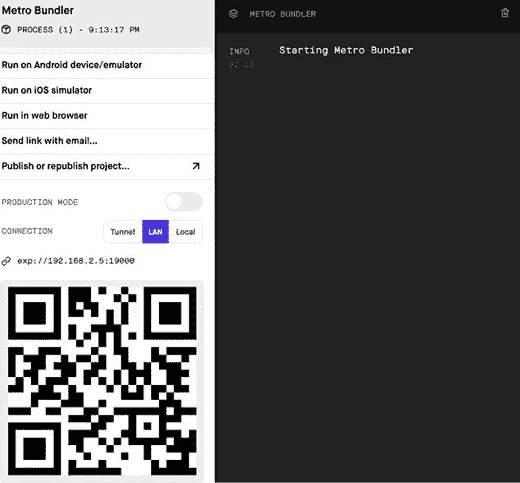
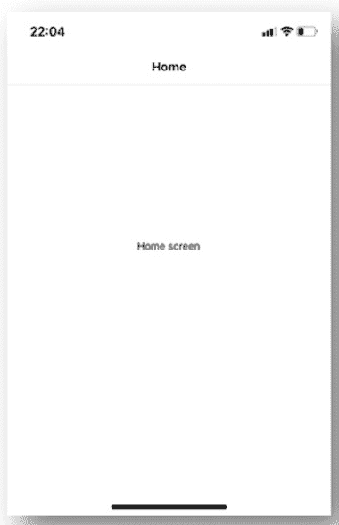
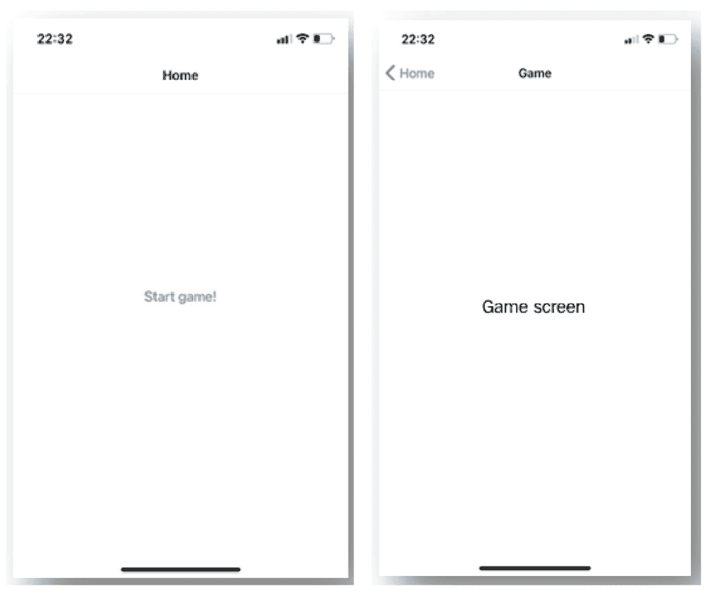
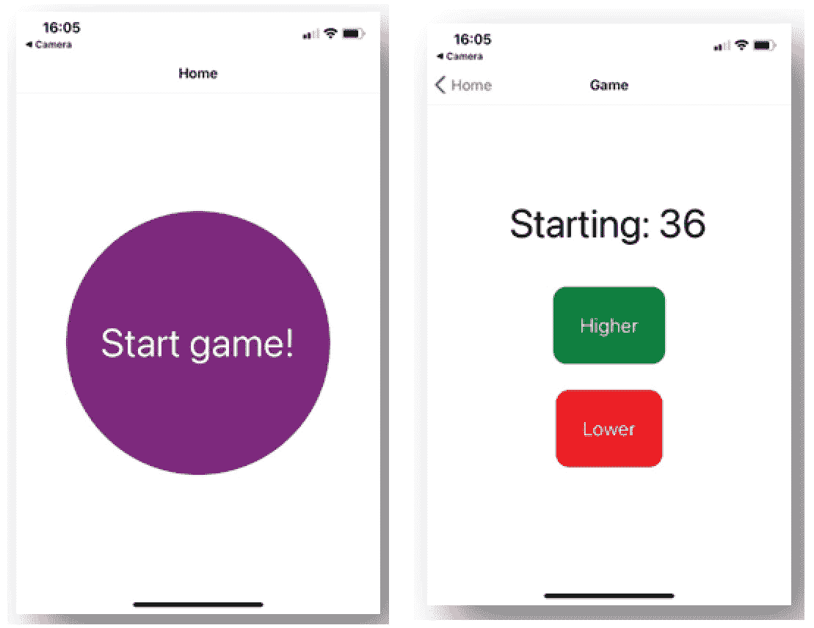

# *第八章*：使用 React Native 和 Expo 构建动画游戏

React 开发的口号之一是*"一次学习，到处编写"，"这得益于 React Native 的存在。使用 React Native，您可以使用 JavaScript 和 React 编写原生移动应用程序，并使用名为**Expo**的工具链轻松运行和部署这些应用程序。本书中创建的先前应用程序都是 Web 应用程序，这意味着它们将在浏览器中运行。在浏览器中运行应用程序的缺点是在您点击按钮或导航到不同页面时缺乏交互。当构建直接在手机上运行的移动应用程序时，您的用户期望有使应用程序使用起来容易且熟悉的动画和手势。这就是您在本章中要关注的内容。

在本章中，您将创建一个 React Native 应用程序，使用 React Native 的 Animated API 和一个名为`GestureHandler`的包添加动画和手势。它们一起使我们能够创建充分利用移动设备交互方法的应用程序，这对于像*高/低*这样的游戏来说非常完美。

要创建这个游戏，以下主题将被涵盖：

+   使用 Expo 设置 React Native

+   向 React Native 添加手势和动画

+   使用 Lottie 的高级动画

# 项目概述

在本章中，我们将使用 React Native 和 Expo 创建一个动画*高/低*游戏，它使用 Animated API 添加基本动画，Lottie 进行高级动画，以及来自 Expo 的`GestureHandler`来处理原生手势。

构建时间为 1.5 小时。

注意

本章使用 React Native 版本 0.64.3 和 Expo SDK 版本 44。由于 React Native 和 Expo 更新频繁，请确保您使用的是这个版本，以确保本章中描述的模式按预期运行。

# 入门

本章中我们构建的项目完整源代码可以在 GitHub 上找到：[`github.com/PacktPublishing/React-Projects-Second-Edition/tree/main/Chapter08`](https://github.com/PacktPublishing/React-Projects-Second-Edition/tree/main/Chapter08)。此外，本章最后部分所需的`winner.json`文件可以在[`github.com/PacktPublishing/React-Projects-Second-Edition/tree/main/Chapter08-assets`](https://github.com/PacktPublishing/React-Projects-Second-Edition/tree/main/Chapter08-assets)找到。

您需要在 iOS 或 Android 移动设备上安装 Expo Go 应用程序，以便在物理设备上运行项目。一旦您下载了应用程序，您需要创建一个 Expo 账户以使开发过程更加顺畅。请确保将您的账户详细信息保存在安全的地方，因为您在本章的后续部分需要使用这些信息。

或者，您可以在计算机上安装 Xcode 或 Android Studio 来在虚拟设备上运行应用程序：

+   **对于 iOS**：有关如何设置本地机器以运行 iOS 模拟器的信息，请在此处查看：[`docs.expo.io/workflow/ios-simulator/`](https://docs.expo.io/workflow/ios-simulator/).

+   **对于 Android**：有关如何设置本地机器以从 Android Studio 运行模拟器的信息，请在此处查看：[`docs.expo.io/workflow/android-studio-emulator/`](https://docs.expo.io/workflow/android-studio-emulator/).

    注意

    **强烈推荐**使用 Expo 客户端应用程序从本章开始在一个物理设备上运行项目。目前，仅支持在物理设备上接收通知，在 iOS 模拟器或 Android Studio 模拟器上运行项目将导致错误信息。

# 使用 React Native 和 Expo 创建一个动画游戏应用程序

在本节中，您将使用 React Native 和 Expo 构建一个在移动设备上直接运行的动画游戏。React Native 允许您使用您已经从 React 熟悉的相同语法和模式，因为它使用核心 React 库。此外，Expo 使得您无需安装和配置 Xcode（对于 iOS）或 Android Studio 即可开始在您的机器上创建原生应用程序。因此，您可以从任何机器上为 iOS 和 Android 平台编写应用程序。

Expo 将 React API 和 JavaScript API 结合到 React Native 开发过程中，例如 JSX 组件、Hooks 以及如相机访问等原生功能。简而言之，Expo 工具链由多个工具组成，这些工具可以帮助您使用 React Native，例如 Expo CLI，它允许您从终端创建 React Native 项目，并包含运行 React Native 所需的所有依赖项。使用 Expo 客户端，您可以从连接到本地网络的 iOS 和 Android 移动设备上打开这些项目，而 Expo SDK 是一个包含所有库的包，使得您的应用程序能够在多个设备和平台上运行。

## 使用 Expo 设置 React Native

我们在这本书中之前创建的应用程序使用了 Create React App 或 Next.js 来设置起始应用程序。对于 React Native，有一个类似的样板代码可用，它是 Expo CLI 的一部分，可以同样轻松地设置。

您需要使用以下命令全局安装 Expo CLI，使用 `Yarn`：

```js
yarn global add expo-cli
```

或者，您可以使用 `npm`：

```js
npm install -g expo-cli
```

注意

Expo 使用 Yarn 作为其默认的包管理器，但您仍然可以使用 npm，就像我们在之前的 React 章节中所做的那样。

这将启动安装过程，这可能需要一些时间，因为它将安装带有所有依赖项的 Expo CLI，以帮助您开发移动应用程序。之后，您将能够使用 Expo CLI 的 `init` 命令创建一个新项目：

```js
expo init chapter-8
```

现在，Expo 将为您创建项目，但在那之前，它会询问您是想创建一个空白模板、带有 TypeScript 配置的空白模板，还是带有一些示例屏幕的样本模板。对于本章，您需要选择第一个选项。Expo 会自动检测您的机器上是否已安装 Yarn；如果是，它将使用 Yarn 安装设置计算机所需的其它依赖项。

您的应用程序现在将根据您之前选择的设置创建。您现在可以通过进入 Expo 刚刚创建的目录，使用以下命令启动此应用程序：

```js
cd chapter-8
yarn start
```

这将启动 Expo，并允许您从终端和浏览器启动您的项目。在终端中，您现在将看到一个 QR 码，您可以使用移动设备上的 Expo 应用程序扫描，或者如果您已安装 Xcode 或 Android Studio，您还可以启动 iOS 或 Android 模拟器。此外，在运行`start`命令后，*Expo DevTools*将在您的浏览器中打开：




图 8.1 – 运行 Expo 时的 Expo DevTools

在此页面上，您将在左侧看到一个侧边栏，以及您的 React Native 应用程序的日志在右侧。如果您使用的是 Android 设备，您可以直接从 Expo Go 应用程序扫描 QR 码。在 iOS 上，您需要使用相机扫描代码，这将要求您打开 Expo 客户端。或者，Expo DevTools 中的侧边栏有按钮可以启动 iOS 或 Android 模拟器，您需要安装 Xcode 或 Android Studio。否则，您还可以找到按钮通过电子邮件发送应用程序链接。

无论您是使用 iOS 或 Android 模拟器打开的应用程序，还是从 iOS 或 Android 设备打开，此时应用程序应该是一个显示**打开 App.js 以开始您的应用程序开发**的白色屏幕。

注意

如果您没有看到应用程序，而是显示错误信息的红色屏幕，您应该确保您在本地机器和移动设备上运行的是正确的 React Native 和 Expo 版本。这些版本应该是 React Native 版本 0.64.3 和 Expo 版本 44。使用任何其他版本都可能导致错误，因为 React Native 和 Expo 的版本应该保持同步。

使用 Expo 创建的此 React Native 应用程序的项目结构与您在前几章中创建的 React 项目非常相似：

```js
chapter-8 
  |- node_modules 
  |- assets
  |- package.json 
  |- App.js
  |- app.json 
  |- babel.config.js  

```

在`assets`目录中，一旦你在移动设备上安装了此应用程序，你就可以找到用作主屏幕应用程序图标的图像，以及将作为启动屏幕使用的图像，该屏幕在启动应用程序时显示。`App.js`文件是应用程序的实际入口点，你将在这里放置在应用程序挂载时将被渲染的代码。应用程序的配置（例如，应用商店）放置在`app.json`中，而`babel.config.js`包含特定的 Babel 配置。

### 添加基本路由

对于使用 React 创建的 Web 应用程序，我们使用了 React Router 进行导航，而对于 Next.js，路由已经通过文件系统内置。对于 React Native，我们需要一个支持 iOS 和 Android 的不同路由库。这个最受欢迎的库是`react-navigation`，我们可以从`Yarn`安装它：

```js
yarn add @react-navigation/native
```

这将安装核心库，但我们需要通过运行以下命令来扩展我们当前的 Expo 安装，以包含`react-navigation`所需的依赖项：

```js
expo install react-native-screens react-native-safe-area-context
```

要将路由添加到你的 React Native 应用程序中，你需要了解浏览器和移动应用程序中路由的区别。React Native 中的历史记录在行为上与浏览器不同，在浏览器中，用户可以通过更改浏览器中的 URL 来导航到不同的页面，并且之前访问过的 URL 会被添加到浏览器历史记录中。相反，你需要自己跟踪页面之间的转换并存储应用程序中的本地历史记录。

使用 React Navigation，你可以使用多个不同的导航器来帮助你完成这项工作，包括栈导航器和标签导航器。栈导航器的行为非常类似于浏览器，因为它在过渡后将页面堆叠在一起，并允许你使用 iOS 和 Android 的原生手势和动画进行导航。让我们开始吧：

1.  首先，我们需要安装这个库来使用栈导航以及来自`react-navigation`的带有导航元素的附加库：

    ```js
    yarn add @react-navigation/native-stack@react-navigation/elements
    ```

1.  从这个库和`react-navigation`的核心库中，我们需要在`App.js`中导入以下内容来创建栈导航器：

    ```js
      import { StatusBar } from 'expo-status-bar';
      import React from 'react';
      import { StyleSheet, Text, View } from 
        'react-native';
    + import { NavigationContainer } 
        from '@react-navigation/native';
    + import { createNativeStackNavigator } 
        from '@react-navigation/native-stack';
    + const Stack = createNativeStackNavigator();
      export default function App() {
        // ...
    ```

1.  从`App`组件中，我们需要返回这个栈导航器，它还需要一个组件来返回主屏幕。因此，我们需要在名为`screens`的新目录中创建一个`Home`组件。这个组件可以在名为`Home.js`的文件中创建，内容如下：

    ```js
    import React from 'react';
    import { StyleSheet, Text, View } from 'react-native';
    export default function Home() {
      return (
        <View style={styles.container}>
          <Text>Home screen</Text>
        </View>
      );
    }
    const styles = StyleSheet.create({
      container: {
        flex: 1,
        backgroundColor: '#fff',
        alignItems: 'center',
        justifyContent: 'center',
      },
    });
    ```

1.  在`App.js`中，我们需要导入这个`Home`组件，并通过从`App`组件返回一个`NavigationContainer`组件来设置栈导航器。在这个组件内部，栈导航器是通过`Stack`组件中的`Navigator`组件创建的，主屏幕在`Stack.Screen`组件中描述。此外，移动设备的状态栏也在这里定义：

    ```js
      import { StatusBar } from 'expo-status-bar';
      import React from 'react';
    - import { StyleSheet, Text, View } from 
        'react-native';
    + import { StyleSheet } from 'react-native';
      import { NavigationContainer } 
        from '@react-navigation/native';
      import { createNativeStackNavigator } 
        from '@react-navigation/native-stack';
    + import Home from './screens/Home';
    const Stack = createNativeStackNavigator();
    export default function App() {
      export default function App() {
        return (
    -     <View style={styles.container}>
    -       <Text>Open up App.js to start working on your 
              app!</Text>
    +     <NavigationContainer>
                  <StatusBar style='auto' />
    +       <Stack.Navigator>
    +         <Stack.Screen name='Home' component={Home} 
              />
    +       </Stack.Navigator>
    +     </NavigationContainer>
    -     </View>
        );
      }
      // ...
    ```

确保您仍在终端中运行 Expo；否则，请使用`yarn start`命令重新启动。现在，您的移动设备或模拟器上的应用程序应该看起来像这样：



图 8.2 – 带有堆栈导航器的应用程序

注意

在 Expo Go 中重新加载应用程序时，您可以使用 iOS 或 Android 手机摇晃设备。通过摇晃设备，将出现一个菜单，其中包含重新加载应用程序的选项。在此菜单中，您还必须选择启用*快速刷新*，以便在您对代码进行更改时自动刷新应用程序。

我们已经设置了堆栈导航器的第一个页面，所以让我们在下一部分添加更多页面，并创建按钮在它们之间导航。

### 在屏幕之间导航

在 React Native 中在屏幕之间导航的工作方式与在浏览器中略有不同，因为再次没有 URL。相反，您需要使用堆栈导航器渲染的组件可用的导航对象，或者通过从`react-navigation`调用`useNavigation`钩子。

在学习如何在屏幕之间导航之前，我们需要添加另一个屏幕进行导航：

1.  您可以通过在`screens`目录下名为`Game.js`的文件中创建一个新的组件来添加此屏幕，代码如下：

    ```js
    import React from 'react';
    import { StyleSheet, Text, View } from 'react-native';
    export default function Game() {
      return (
        <View style={styles.container}>
          <Text>Game screen</Text>
        </View>
      );
    }
    const styles = StyleSheet.create({
      container: {
        flex: 1,
        backgroundColor: '#fff',
        alignItems: 'center',
        justifyContent: 'center',
      },
    });
    ```

1.  此组件必须在`App.js`中导入，并作为新屏幕添加到堆栈导航器中。此外，在导航器上，我们需要设置`initialRouteName`属性来设置必须显示的默认屏幕：

    ```js
      import { StatusBar } from 'expo-status-bar';
      import React from 'react';
      import { StyleSheet } from 'react-native';
      import { NavigationContainer } 
        from '@react-navigation/native';
      import { createNativeStackNavigator } 
        from '@react-navigation/native-stack';
      import Home from './screens/Home';
    + import Game from './screens/Game';
      const Stack = createNativeStackNavigator();
      export default function App() {
        return (
          <NavigationContainer>
            <StatusBar style='auto' />
    -       <Stack.Navigator>
    +       <Stack.Navigator initialRouteName='Home'>
              <Stack.Screen name='Home' component={Home} 
              />
    +         <Stack.Screen name='Game' component={Game} 
              />
            </Stack.Navigator>
          </NavigationContainer>
        );
      }
      // ...
    ```

1.  从`screens/Home.js`中的`Home`组件，我们可以从`useNavigation`钩子中获取导航对象，并创建一个按钮，当按下时将导航到`Game`屏幕。这是通过使用`navigation`对象的`navigate`方法并将其传递给 React Native 的`Button`组件的`onPress`属性来完成的：

    ```js
      import React from 'react';
    - import { StyleSheet, Text, View } from 
        'react-native';
    + import { StyleSheet, View, Button } from 
        'react-native';
    + import { useNavigation } from 
        '@react-navigation/native';
      export default function Home() {
    +   const navigation = useNavigation();
        return (
          <View style={styles.container}>
    -       <Text>Home screen</Text>
    +       <Button onPress={() => navigation.navigate(
              'Game')} title='Start game!' />
          </View>
        );
      }
      // ...
    ```

现在，您可以通过使用我们刚刚创建的按钮或使用页眉中的按钮在**主页**和**游戏**屏幕之间进行切换。此页眉是由 react-navigation 自动生成的，但您也可以自定义它，我们将在*第九章*中这样做，*使用 React Native 和 Expo 构建全栈社交媒体应用程序*：



图 8.3 – 带有基本路由的我们的应用程序

到目前为止，我们已经向应用程序添加了基本路由，但我们还没有游戏。在`screens/Game.js`文件中，可以通过使用本地状态管理（使用`useState`和`useEffect`钩子）来添加*高/低*游戏的逻辑。这些钩子在 React Native 中的工作方式与在 React 网络应用程序中相同。让我们添加游戏逻辑：

1.  在 `Game` 组件中，从 React 导入这些钩子，在 `Button` 和 `Alert` 组件旁边。导入它们之后，我们需要创建一个本地状态变量来存储用户的选择，并为游戏创建随机数和分数。还要从 `react-navigation` 中导入 `useNavigation` 钩子：

    ```js
    - import React from 'react';
    - import { StyleSheet, Text, View } from 
        'react-native';
    + import React, { useEffect, useState } from 'react';
    + import { Button, StyleSheet, Text, View, Alert }
        from 'react-native';
    + import { useNavigation } from 
        '@react-navigation/native';
      export default function Game() {
    +   const baseNumber = Math.floor(Math.random() *
          100);
    +   const score = Math.floor(Math.random() * 100);
    +   const [choice, setChoice] = useState('');

        return (
          <View style={styles.container}>
          // ...
    ```

`baseNumber` 的值是游戏开始时带有 1 到 100 之间的初始随机值的数字，使用 JavaScript 中的 `Math` 方法创建。分数值也有一个随机数作为值，这个值用于与 `baseNumber` 进行比较。`choice` 本地状态变量用于存储用户的选项，如果分数高于或低于 `baseNumber`。

1.  要能够做出选择，我们需要添加两个 `Button` 组件，根据你按下的哪个按钮设置选择值是更高或更低：

    ```js
        // ...
        return (
          <View style={styles.container}>
    -       <Text>Game screen</Text>
    +       <Text>Starting: {baseNumber}</Text>
    +       <Button onPress={() => setChoice('higher')} 
              title='Higher' />
    +       <Button onPress={() => setChoice('lower')}
              title='Lower' />
          </View>
        );
      }
      const styles = StyleSheet.create({
        // ...
    ```

1.  从 `useEffect` 钩子中，我们可以比较 `baseNumber` 和 `score` 的值，并根据值选择显示一个警告。根据选择，用户会看到一个显示消息说明他们是否获胜以及得分的 `Alert` 组件。在显示警告的同时，将使用 `baseNumber`、`score` 和 `choice` 的值来导航回上一页。这将重置 `Game` 组件：

    ```js
      // ...
    + const navigation = useNavigation();
    + useEffect(() => {
    +   if (choice) {
    +     const winner =
    +       (choice === 'higher' && score > baseNumber) ||
    +       (choice === 'lower' && baseNumber > score);
    +     Alert.alert(`You've ${winner ? 'won' : 'lost'}`,
            `You scored: ${score}`);
    +     navigation.goBack();
    +   }
    + }, [baseNumber, score, choice]);
      return (
        <View style={styles.container}>
        // ...
    ```

现在，你能够玩游戏并选择你认为分数是否会高于或低于显示的 `baseNumber`。但我们还没有添加任何样式，这将在本节下一部分完成。

### React Native 中的样式

你可能在前面的组件中看到，我们更改或添加到项目中使用了名为 `StyleSheet` 的变量。使用这个变量从 React Native 中，我们可以创建一个样式对象，我们可以通过传递一个名为 `style` 的属性将其附加到 React Native 组件上。我们已经使用它来使用名为 `container` 的样式来设置组件样式，但让我们做一些更改，也为其他组件添加样式：

1.  在 `screens/Home.js` 中，我们需要将 `Button` 组件替换为 `TouchableHighlight` 组件，因为 React Native 中的 `Button` 组件难以设置样式。这个 `TouchableHighlight` 组件是一个可按的元素，当按下时会高亮显示，为用户提供反馈。在这个组件内部，必须添加一个 `Text` 组件来显示按钮的标签：

    ```js
      import React from 'react';
    - import { StyleSheet, View, Button } from 
        'react-native';
    + import { StyleSheet, Text, View, TouchableHighlight
        } from 'react-native';
      import { useNavigation } from 
        '@react-navigation/native';
      export default function Home() {
        const navigation = useNavigation();

        return (
          <View style={styles.container}>
    -       <Button onPress={() => navigation.navigate(
              'Game')} title='Start game!' />
    +       <TouchableHighlight
    +         onPress={() => navigation.navigate('Game')}
    +         style={styles.button}
    +       >
    +         <Text style={styles.buttonText}>
                Start game!</Text>
    +       </TouchableHighlight>
          </View>
        );
      }
      // ...
    ```

1.  `TouchableHighlight` 和 `Text` 组件使用 `styles` 对象中的 `button` 和 `buttonText` 样式，我们需要将其添加到文件底部的 `StyleSheet` 的 `create` 方法中：

    ```js
      // ...
      const styles = StyleSheet.create({
        container: {
          flex: 1,
          backgroundColor: '#fff',
          alignItems: 'center',
          justifyContent: 'center',
        },
    +   button: {
    +     width: 300,
    +     height: 300,
    +     display: 'flex',
    +     alignItems: 'center',
    +     justifyContent: 'space-around',
    +     borderRadius: 150,
    +     backgroundColor: 'purple',
    +   },
    +   buttonText: {
    +     color: 'white',
    +     fontSize: 48,
    +   },
      });
    ```

使用 React Native 创建样式意味着你需要使用 *camelCase* 表示法，而不是我们习惯的 CSS 中的 *kebab-case* – 例如，`background-color` 变为 `backgroundColor`。

1.  我们还需要通过打开 `screens/Game.js` 文件来为 `Game` 屏幕上的按钮添加样式修改。在这个文件中，我们再次需要用带有内部 `Text` 的 `TouchableHighlight` 组件替换 React Native 的 `Button` 组件：

    ```js
      import React, { useEffect, useState } from 'react';
      import {
    -   Button,
        StyleSheet,
        Text,
        View,
        Alert,
    +   TouchableHighlight,
      } from 'react-native';
        import { useNavigation } from 
          '@react-navigation/native';
      export default function Game() {
        // ...
        return (
          <View style={styles.container}>
    -       <Text>Starting: {baseNumber}</Text>
    -       <Button onPress={() => setChoice('higher')}
    title='Higher' /> 
    -       <Button onPress={() => setChoice('lower')}
              title='Lower' />
    +       <Text style={styles.baseNumber}>
              Starting: {baseNumber}</Text>
    +       <TouchableHighlight onPress={() =>
              setChoice('higher')} style={styles.button}>
    +         <Text style={styles.buttonText}>Higher
              </Text>
    +       </TouchableHighlight>
    +       <TouchableHighlight onPress={() =>
                setChoice('lower')} style={styles.button}>
    +         <Text style={styles.buttonText}>Lower</Text>
    +       </TouchableHighlight>
          </View>
        );
      }
      // ...
    ```

1.  `styles` 对象必须包含新的 `baseNumber`、`button` 和 `buttonText` 样式，我们可以在文件底部添加这些样式：

    ```js
      // ...
      const styles = StyleSheet.create({
        container: {
          flex: 1,
          backgroundColor: '#fff',
          alignItems: 'center',
          justifyContent: 'center',
        },
    +   baseNumber: {
    +     fontSize: 48,
    +     marginBottom: 30,
    +   },
    +   button: {
    +     display: 'flex',
    +     alignItems: 'center',
    +     justifyContent: 'space-around',
    +     borderRadius: 15,
    +     padding: 30,
    +     marginVertical: 15,
    +   },
    +   buttonText: {
    +     color: 'white',
    +     fontSize: 24,
    +   },
      });
    ```

1.  然而，现在两个按钮都将拥有相同的白色背景。我们可以通过为它们添加额外的样式来改变这一点。React Native 组件上的 `style` 属性也可以接受一个样式对象的数组，而不仅仅是单个对象：

    ```js
      // ...
      return (
        <View style={styles.container}>
          <Text style={styles.baseNumber}>
            Starting: {baseNumber}</Text>
          <TouchableHighlight
            onPress={() => setChoice('higher')}
    -       style={styles.button}
    +       style={[styles.button, styles.buttonGreen]}
          >
            <Text style={styles.buttonText}>Higher</Text>
          </TouchableHighlight>
          <TouchableHighlight
            onPress={() => setChoice('lower')}
    -       style={styles.button}
    +       style={[styles.button, styles.buttonRed]}
          >
            <Text style={styles.buttonText}>Lower</Text>
          </TouchableHighlight>
        </View>
      );
      // ...
    ```

1.  这些 `buttonGreen` 和 `buttonRed` 对象也必须添加到样式对象中：

    ```js
      // ...
      const styles = StyleSheet.create({
        // ...
    +   buttonRed: {
    +     backgroundColor: 'red',
    +   },
    +   buttonGreen: {
    +     backgroundColor: 'green',
    +   },
        buttonText: {
          color: 'white',
          fontSize: 24,
        },
      });
    ```

通过这些添加，应用程序现在已经被样式化，这使得它更具吸引力。我们使用了 React Native 的 `StyleSheet` 对象来应用这种样式，使你的应用程序看起来像这样：



图 8.4 – 样式化的 React Native 应用程序

移动游戏通常有令人眼花缭乱的动画，这些动画会让用户想要继续玩游戏，并使游戏更具互动性。目前功能正常的 *Higher/Lower* 游戏还没有使用动画，只是内置了一些 React Navigation 创建的过渡效果。在下一节中，你将为应用程序添加动画和手势，这将改善游戏界面，并让用户在玩游戏时感到更加舒适。

## 在 React Native 中添加手势和动画

在 React Native 中使用动画有多种方式，其中之一是使用 Animated API，这是 React Native 的核心。使用 Animated API，你可以为 React Native 的 `View`、`Text`、`Image` 和 `ScrollView` 组件创建默认的动画。或者，你也可以使用 `createAnimatedComponent` 方法来创建自己的组件。

### 创建基本动画

你可以添加的最简单的动画之一是通过改变元素的透明度值来使元素淡入或淡出。在之前创建的 *Higher/Lower* 游戏中，按钮已经被样式化了。这些颜色已经显示出微小的过渡，因为你在创建按钮时使用了 `TouchableHighlight` 元素。然而，你可以通过使用 Animated API 来添加一个自定义的过渡效果。要添加动画，必须更改以下代码块：

1.  首先，创建一个名为 `components` 的新目录，它将包含我们所有的可重用 `components`。在这个目录中，创建一个名为 `AnimatedButton.js` 的文件，它将包含以下代码来构建新的组件：

    ```js
    import React from 'react';
    import { StyleSheet, Text, TouchableHighlight } 
      from 'react-native';
    export default function AnimatedButton({ action, 
      onPress }) {
            return (
        <TouchableHighlight
          onPress={onPress}
          style={[
            styles.button,
            action === 'higher' ? styles.buttonGreen :
              styles.buttonRed,
          ]}
        >
          <Text style={styles.buttonText}>{action}</Text>
        </TouchableHighlight>
      );
    }
    ```

1.  将以下样式添加到文件底部：

    ```js
    // ...
    const styles = StyleSheet.create({
      button: {
        display: 'flex',
        alignItems: 'center',
        justifyContent: 'space-around',
        borderRadius: 15,
        padding: 30,
        marginVertical: 15,
      },
      buttonRed: {
        backgroundColor: 'red',
      },
      buttonGreen: {
        backgroundColor: 'green',
      },
      buttonText: {
        color: 'white',
        fontSize: 24,
        textTransform: 'capitalize',
      },
    });
    ```

1.  如你所见，这个组件与我们在`screens/Game.js`中拥有的按钮相似。因此，我们可以从该文件中删除`TouchableHighlight`按钮，并用`AnimatedButton`组件替换它们。确保将正确的`action`和`onPress`值作为属性传递给此组件：

    ```js
      import React, { useEffect, useState } from 'react';
      import {
        StyleSheet,
        Text,
        View,
        Alert,
    -   TouchableHighlight,
      } from 'react-native';
      import { useNavigation } from 
        '@react-navigation/native';
    + import AnimatedButton from 
        '../components/AnimatedButton';

      export default function Game() {
        // ...
        return (
          <View style={styles.container}>
            <Text style={styles.baseNumber}>
              Starting: {baseNumber}</Text>
    -       <TouchableHighlight onPress={() =>
              setChoice('higher')} style={[styles.button,
                styles.buttonGreen]}>
    -         <Text style={styles.buttonText}>Higher
              </Text>
    -       </TouchableHighlight>
    -       <TouchableHighlight onPress={() =>
              setChoice('lower')} style={[styles.button,
                styles.buttonRed]}>
    -         <Text style={styles.buttonText}>Lower</Text>
    -       </TouchableHighlight>
    +       <AnimatedButton action='higher' onPress={() =>
              setChoice('higher')} />
    +       <AnimatedButton action='lower' onPress={() =>
              setChoice('lower')} />
          </View>
        );
      }
      // ...
    ```

1.  如果你在移动设备上的应用程序或电脑上的模拟器中查看，则不会看到任何可见的变化，因为我们首先需要将可点击元素从`TouchableHighlight`元素更改为`TouchableWithoutFeedback`元素。这样，带有高亮的默认过渡就会消失，我们可以用我们自己的效果来替换它。`TouchableWithoutFeedback`元素可以从 React Native 的`components/AnimatedButton.js`中导入，并且应该放在一个`View`元素周围，该元素将保留按钮的默认样式：

    ```js
      import React from 'react';
      import {
        StyleSheet,
        Text,
    -   TouchableHighlight,
    +   TouchableWithoutFeedback,
    +   View
      } from 'react-native';
        export default function AnimatedButton({ action, 
          onPress }) {
        return (
    -     <TouchableHighlight onPress={onPress} style={[ 
    styles.button, action === 'higher' ? 
            styles.buttonGreen : styles.buttonRed ]}>
    +     <TouchableWithoutFeedback onPress={onPress}>
    +       <View style={[ styles.button, action === 'higher' 
              ? styles.buttonGreen : styles.buttonRed ]}>
              <Text style={styles.buttonText}>{action}</Text>
    -     </TouchableHighlight>
    +       </View>
    +     </TouchableWithoutFeedback>
        );
      }
      // ...
    ```

1.  要在点击按钮时创建过渡效果，我们可以使用 Animated API。我们将使用它来改变`AnimatedButton`组件在被按下时的不透明度。Animated API 的新实例通过指定在动画过程中应该改变值的值来开始。这个值应该在组件的整个范围内可改变，因此你可以将这个值添加到组件的顶部。这个值应该使用`useRef`钩子创建，因为你希望这个值以后可以改变。此外，我们还需要从 React Native 中导入`Animated`：

    ```js
    - import React from 'react';
    + import React, { useRef } from 'react';
      import {
        StyleSheet,
        Text,
        TouchableWithoutFeedback,
    -   View,
    +   Animated,
      } from 'react-native';
      export default function AnimatedButton({ action,
        onPress }) {
    +   const opacity = useRef(new Animated.Value(1));

        return (
          //  ...
    ```

1.  现在可以使用内置的任何三种动画类型来改变这个值。这些是`decay`、`spring`和`timing`，其中你将使用 Animated API 的`timing`方法在指定的时间范围内改变动画值。Animated API 可以从`TouchableWithoutFeedback`上的`onPress`事件触发，并在动画完成后调用`onPress`属性：

    ```js
      // ...
      export default function AnimatedButton({ action,
        onPress }) {
        const opacity = useRef(new Animated.Value(1));

        return (
          <TouchableWithoutFeedback
    -       onPress={onPress}   
    +       onPress={() => {
    +         Animated.timing(opacity.current, {
    +           toValue: 0.2,
    +           duration: 800,
    +           useNativeDriver: true,
    +         }).start(() => onPress());
    +       }}
          >
          // ...
    ```

`timing`方法接受你在组件顶部指定的`opacity`以及一个包含 Animated API 配置的对象。我们需要获取当前的不透明度值，因为这个是一个`ref`值。其中一个字段是`toValue`，当动画结束时，它将成为`opacity`的值。另一个字段是用于指定动画持续时间的字段。

注意

与`timing`并列的内置动画类型还有`decay`和`spring`。而`timing`方法在一段时间内逐渐改变，`decay`类型具有在开始时快速改变并在动画结束时逐渐减慢的动画。使用`spring`，你可以在动画结束时创建稍微超出其边缘的动画。

1.  可以用`Animated.View`组件替换`View`组件。该组件使用由`useRef`钩子创建的`opacity`变量来设置其不透明度：

    ```js
            // ...
    -       <View
    +       <Animated.View
              style={[
                styles.button,
                action === 'higher' ? styles.buttonGreen :
                  styles.buttonRed,
    +           { opacity: opacity.current },
              ]}
            >
              <Text style={styles.buttonText}>{action}
              </Text>
    -       </View>
    +       </Animated.View>
          </TouchableWithoutFeedback>
        );
      }
      // ...
    ```

现在，当你按下`Game`屏幕上的任何按钮时，它们将会淡出，因为不透明度从`1`过渡到`0.2`需要 400 毫秒。

为了使动画看起来更平滑，你可以向`Animated`对象添加一个`easing`字段。这个字段的值来自`Easing`模块，可以从 React Native 导入。`Easing`模块有三个标准函数：`linear`、`quad`和`cubic`。在这里，`linear`函数可以用于更平滑的时间动画：

```js
  import React, { useRef } from 'react';
  import {
    StyleSheet,
    Text,
    TouchableWithoutFeedback,
    Animated,
+   Easing,
  } from 'react-native';
export default function AnimatedButton({ action, onPress }) {
  const opacity = useRef(new Animated.Value(1));
  return (
    <TouchableWithoutFeedback
      onPress={() => {
        Animated.timing(opacity.current, {
          toValue: 0.2,
          duration: 400,
          useNativeDriver: true,
+         easing: Easing.linear(),      
        }).start(() => onPress());
      }}
    >
    // ...
```

经过这个最后的修改，动画就完成了，游戏界面已经感觉更平滑了，因为按钮是通过我们自己的自定义动画来高亮的。在本节的下一部分，我们将结合一些这些动画，使游戏的用户体验更加先进。

注意

你还可以结合动画——例如，使用`parallel`方法——从 Animated API。这个方法将启动在同一时刻指定的动画，并将一个动画数组作为其值。在`parallel`函数旁边，还有三个其他函数可以帮助你进行动画组合。这些函数是`delay`、`sequence`和`stagger`，它们也可以组合使用。`delay`函数在预定延迟后开始任何动画，`sequence`函数按照你指定的顺序开始动画，并在一个动画解决之前等待，然后开始另一个动画，而`stagger`函数可以在指定延迟之间按顺序和并行地开始动画。

### 使用 Expo 处理手势

手势是移动应用程序的一个重要特性，因为它们区分了平庸和优秀的移动应用程序。在你创建的*高低*游戏中，可以添加几个手势来使游戏更具吸引力。

之前，你使用了`TouchableHighlight`元素，它在用户按下后会通过改变它来提供用户反馈。另一种你可以用来实现这个功能的元素是`TouchableOpacity`元素。这些手势给用户一种印象，即当他们在你的应用程序中做出决策时会发生什么，从而改善了用户体验。这些手势可以自定义并添加到其他元素中，使得可以拥有自定义的可触摸元素。

为了实现这一点，你可以使用一个名为`react-native-gesture-handler`的包，它可以帮助你在每个平台上访问原生手势。所有这些手势都将运行在原生线程上，这意味着你可以在不处理 React Native 手势响应系统性能限制的情况下添加复杂的手势逻辑。它支持的一些手势包括*点击*、*旋转*、*拖动*、*平移*和*长按*。在前一节中，我们已经安装了这个包，因为它是`react-navigation`的要求。

注意

你也可以直接从 React Native 使用手势，而无需使用额外的包。然而，React Native 当前使用的响应者系统不在原生线程中运行。这不仅限制了创建和自定义手势的可能性，还可能导致跨平台或性能问题。因此，建议使用`react-native-gesture-handler`包，但这对于在 React Native 中使用手势并不是必需的。

我们将实现的动作是长按手势，它将被添加到我们的`主页`屏幕上的开始按钮中，位于`screens/Home.js`。在这里，我们将使用来自`react-native-gesture-handler`的`TapGestureHandler`元素，它在原生线程中运行，而不是使用 React Native 的`TouchableWithoutFeedback`元素，后者使用手势响应系统。为了实现这一点，我们需要做以下操作，请确保其余的数字都相应更新：

1.  使用 Expo 进行安装：

    ```js
    expo install react-native-gesture-handler
    ```

1.  从`react-native-gesture-handler`导入`TapGestureHandler`和`State`，紧挨着从 React Native 导入的`View`和`Alert`。可以移除`TouchableHighlight`的导入，因为这将被替换：

    ```js
      import React from 'react';
      import {
        StyleSheet,
            Text,  View,
    +   Alert,
    -   TouchableHighlight,
      } from 'react-native';
      import { useNavigation } from 
        '@react-navigation/native';
    + import { TapGestureHandler, State } from 
        'react-native-gesture-handler';
      export default function Home() {
        // ...
    ```

1.  我们可以将`TouchableHighlight`组件替换为`TapGestureHandler`，并在其中放置一个`View`组件，然后对其应用样式。`TapGestureHandler`不接收`onPress`属性，而是接收`onHandlerStateChange`属性，我们将新的`on` `Tap`函数传递给它。在这个函数中，我们需要检查触摸事件的状态是否为活动状态。为此，你需要知道触摸事件会经过不同的状态：`UNDETERMINED`、`FAILED`、`BEGAN`、`CANCELLED`、`ACTIVE`和`END`。这些状态的名字相当直观，通常处理器的流程如下：`UNDETERMINED` > `BEGAN` > `ACTIVE` > `END` > `UNDETERMINED`：

    ```js
      // ...
      export default function Home() {
        const navigation = useNavigation();
    +   function onTap(e) {
    +     if (e.nativeEvent.state === State.ACTIVE) {
    +       Alert.alert('Long press to start the game');
    +     }
    +   }
        return (
          <View style={styles.container}>
    -       <TouchableHighlight
    -         onPress={() => navigation.navigate('Game')}
    -         style={styles.button}
    -       >
    +      <TapGestureHandler onHandlerStateChange={onTap}>
    +        <View style={styles.button}> <Text 
               style={styles.buttonText}>Start game!</Text>
    +        </View>
    -      </TouchableHighlight>
    +      </TapGestureHandler>
          </View>
        );
      }
      // ...
    ```

1.  如果你现在在“主页”屏幕上按下开始按钮，你会收到需要长按按钮以开始游戏的消息。为了添加这个长按手势，我们需要在`TapGestureHandler`组件内部添加一个`LongPressGestureHandler`组件。此外，我们还需要创建一个可以被`LongPressGestureHandler`组件调用的函数，该函数将带我们进入`游戏`屏幕：

    ```js
      import React  from 'react';
    import { StyleSheet, Text, View, Alert } 
    from 'react-native'; 
    import { useNavigation } 
    from '@react-navigation/native'; 
    import { 
    +   LongPressGestureHandler, 
    TapGestureHandler, 
    State, 
      } from 'react-native-gesture-handler';
      export default function Home() {
        const navigation = useNavigation();
    +   function onLongPress(e) {
    +     if (e.nativeEvent.state === State.ACTIVE) {
    +       navigation.navigate('Game');
    +     }
    +   }
        // ...
    ```

1.  在`TapGestureHandler`内部应放置新导入的`LongPressGestureHandler`组件。该组件接收导航到游戏的函数，以及一个设置长按最小持续时间的属性。如果你不设置此属性，默认的最小持续时间将是 500ms：

    ```js
      // ...  
      export default function Home() {
        // ...
        return (
          <View style={styles.container}>
            <TapGestureHandler 
              onHandlerStateChange={onSingleTap} 
            >
    +         <LongPressGestureHandler+ 
                onHandlerStateChange={onLongPress}
    +           minDurationMs={600}
    +         >
                <View style={styles.button}>
                  <Text style={styles.buttonText}>
                    Start game!</Text>
                </View>
    +         </LongPressGestureHandler>
            </TapGestureHandler>
          </View>
        );
      }
      // ...
    ```

通过这个最新的更改，您只能通过在 **主页** 屏幕上长按 **开始** 按钮来启动游戏。这些手势可以进一步自定义，因为您可以使用组合来拥有多个相互响应的点击事件。通过创建所谓的 **交叉处理程序交互**，您可以创建一个支持 *双击* 和 *长按* 手势的可触摸元素。

下一节将向您展示如何处理更高级的动画，例如在任意两位玩家获胜时显示动画图形。为此，我们将使用 Lottie 包，因为它比内置的 Animated API 支持更多的功能。

## 使用 Lottie 的高级动画

React Native Animated API 对于构建简单的动画来说很棒，但构建更高级的动画可能更困难。幸运的是，Lottie 通过使我们能够在 iOS、Android 和 React Native 中实时渲染 After Effects 动画，为 React Native 提供了创建高级动画的解决方案。

注意

当使用 Lottie 时，您不必自己创建这些 After Effects 动画；有一个完整的资源库，您可以在项目中自定义并使用。这个库叫做 `LottieFiles`，可在 [`lottiefiles.com/`](https://lottiefiles.com/) 获取。

由于我们已经为游戏按钮添加了动画，添加更多高级动画的好地方是在显示您赢或输游戏的消息上。这个消息可以显示在屏幕上而不是弹窗中，如果用户赢了，可以显示奖杯。让我们现在就做这个：

1.  要开始使用 Lottie，运行以下命令，它将安装 Lottie 到我们的项目中：

    ```js
    yarn add lottie-react-native
    ```

1.  安装完成后，我们可以创建一个新的屏幕组件，名为 `screens/Result.js`，其内容如下：

    ```js
    import React from 'react';
    import { StyleSheet, Text, View } from 'react-native';
    export default function Result() {
      return (
        <View style={styles.container}>
          <Text></Text>
        </View>
      );
    }
    const styles = StyleSheet.create({
      container: {
        flex: 1,
        backgroundColor: '#fff',
        alignItems: 'center',
        justifyContent: 'center',
      },
    });
    ```

1.  将此屏幕添加到堆栈导航器中，以便可以通过在 App.js 中导入它来在移动应用的导航中使用。此外，还应该导入导航元素 `HeaderBackButton`：

    ```js
      import { StatusBar } from 'expo-status-bar';
      import React from 'react';
      import { StyleSheet } from 'react-native';
      import { NavigationContainer } 
        from '@react-navigation/native';
      import { createNativeStackNavigator } 
        from '@react-navigation/native-stack';
    + import { HeaderBackButton } 
        from '@react-navigation/elements';
      import Home from './screens/Home';
      import Game from './screens/Game';
    + import Result from './screens/Result';
      // ...
    ```

1.  当添加 `Result` 屏幕时，我们也从 React Navigation 导入了 `HeaderBackButton` 组件，因为我们还想要更改 `主页` 屏幕而不是 `游戏` 屏幕，以便用户在完成游戏后可以开始新游戏：

    ```js
      // ...
      export default function App() {
        return (
          <NavigationContainer>
            <StatusBar style='auto' />
            <Stack.Navigator initialRouteName='Home'>
              <Stack.Screen name='Home' component={Home} />
              <Stack.Screen name='Game' component={Game} />
    +         <Stack.Screen
    +           name='Result'
    +           component={Result}
    +           options={({ navigation }) => ({
    +             headerLeft: (props) => (
    +               <HeaderBackButton
    +                 {...props}
    +                 label='Home'
    +                 onPress={() =>
                        navigation.navigate('Home')}
    +               />
    +             ),
    +           })}
    +         />
          </Stack.Navigator>
        </NavigationContainer>
      );
      // ...
    ```

1.  从 `screens/Game.js` 中的 `Game` 屏幕中，我们可以在游戏后引导用户到 `Result` 屏幕并传递一个参数给这个屏幕。使用此参数，可以显示游戏的结果消息：

    ```js
      // ...
      export default function Game() {
        // ...
        useEffect(() => {
          if (choice.length) {
            const winner = (choice === 'higher' && score >
              baseNumber) || (choice === 'lower' && 
                baseNumber > score);
    -       Alert.alert(`You've ${winner ? 'won' : 
              'lost'}`, `You scored: ${score}`);
    -       navigation.goBack();
    +       navigation.navigate('Result', { winner })
        }
      }, [baseNumber, score, choice]);
      return (
      // ...
    ```

1.  从 `screens/Result.js` 文件中的 `Result` 屏幕中，我们可以从 `lottie-react-native` 导入 `LottieView`，并使用 React Navigation 的 `useRoute` 钩子从 `route` 对象中获取参数。使用此参数，如果用户赢了或输了，我们可以返回一条消息：

    ```js
      import React from 'react';
      import { StyleSheet, Text, View } from 
        'react-native';
    + import LottieView from 'lottie-react-native';
    + import { useRoute } from '@react-navigation/native';
      export default function Result() {
    +   const route = useRoute();
    +   const { winner } = route.params;
        return (
          <View style={styles.container}>
    +       <Text>You've {winner ? 'won' : 'lost'}</Text>
          // ...
    ```

1.  导入的`Lottie`组件可以渲染你自行创建或从`LottieFiles`库下载的任何 Lottie 文件。在本章的 GitHub 仓库中，你可以找到一个名为`winner.json`的 Lottie 文件，该文件可用于本项目。此文件必须放置在`assets`目录中，并且可以通过将组件添加到源代码中由`LottieView`组件渲染。动画的`width`和`height`值可以通过传递一个`style`对象来设置。此外，你应该添加`autoPlay`属性以在组件渲染后开始动画：

    ```js
      // ...
      export default function Result() {
        const route = useRoute();
        const { winner } = route.params;
        return (
          <View style={styles.container}>
            <Text>You've {winner ? 'won' : 'lost'}</Text>
    +       {winner && (
    +         <LottieView
    +           autoPlay
    +           style={{
    +             width: 300,
    +             height: 300,
    +           }}
    +           source={require('../assets/winner.json')}
    +         />
    +       )}
          </View>
        );
      }
      // ...
    ```

1.  作为最后的润色，我们可以在屏幕上显示的消息中添加一些样式，并使其更大：

    ```js
        // ...  
        return (
          <View style={styles.container}>
    -       <Text>You've {winner ? 'won' : 'lost'}</Text>
    +       <Text style={styles.message}>
              You've {winner ? 'won' : 'lost'}</Text>
            // ...
      const styles = StyleSheet.create({
        // ...
    +   message: {
    +     fontSize: 48,
    +   },
      });
    ```

当`Result`屏幕组件接收到带有`true`值的`winner`参数时，用户将看到渲染的奖杯动画，而不是游戏板。当你使用 iOS 模拟器或 iOS 设备运行应用程序时，这个效果的样子可以在这里看到：

![图 8.5 – 游戏获胜后的 Lottie 动画

![img/Figure_8.05_B17390.jpg]

图 8.5 – 游戏获胜后的 Lottie 动画

注意

如果你觉得这个动画的速度太快，你可以通过结合 Animated API 和 Lottie 来降低速度。`LottieView`组件可以接受一个`progress`属性，该属性决定了动画的速度。当你传递由 Animated API 创建的值时，你可以根据你的偏好调整动画的速度。

通过使用 Lottie 添加此动画，我们创建了一个可以玩数小时的动画游戏移动应用程序。

# 摘要

在本章中，我们使用 Expo 创建了一个 React Native 应用程序。React Native 使用与 React 相同的原理，可以用来创建移动应用程序。我们基于堆栈导航添加了基本的路由，即 React Navigation。我们还向游戏中添加了基本和更复杂的手势，这些手势通过`react-native-gesture-handler`包在本地线程中运行。最后，我们使用 React Native Animated API 和 Lottie 创建了动画，这些 API 可通过 Expo CLI 获取。

在下一章中，我们将创建一个探索在 React Native 中处理数据的工程项目。我们还将了解 iOS 和 Android 之间在样式上的差异。

# 进一步阅读

+   Expo：[`docs.expo.io/`](https://docs.expo.io/)

+   各种 Lottie 文件：[`lottiefiles.com/`](https://lottiefiles.com/)

+   更多关于 Animated API 的信息：[`facebook.github.io/react-native/docs/animated`](https://facebook.github.io/react-native/docs/animated)

+   手势处理器：[`docs.swmansion.com/react-native-gesture-handler/`](https://docs.swmansion.com/react-native-gesture-handler/)
