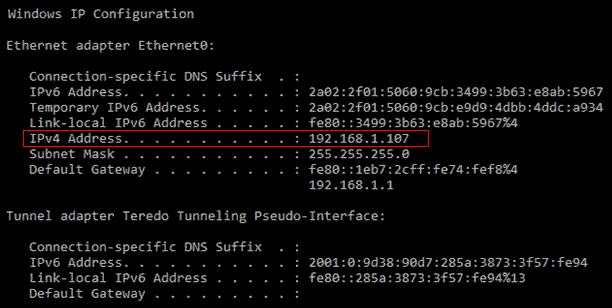
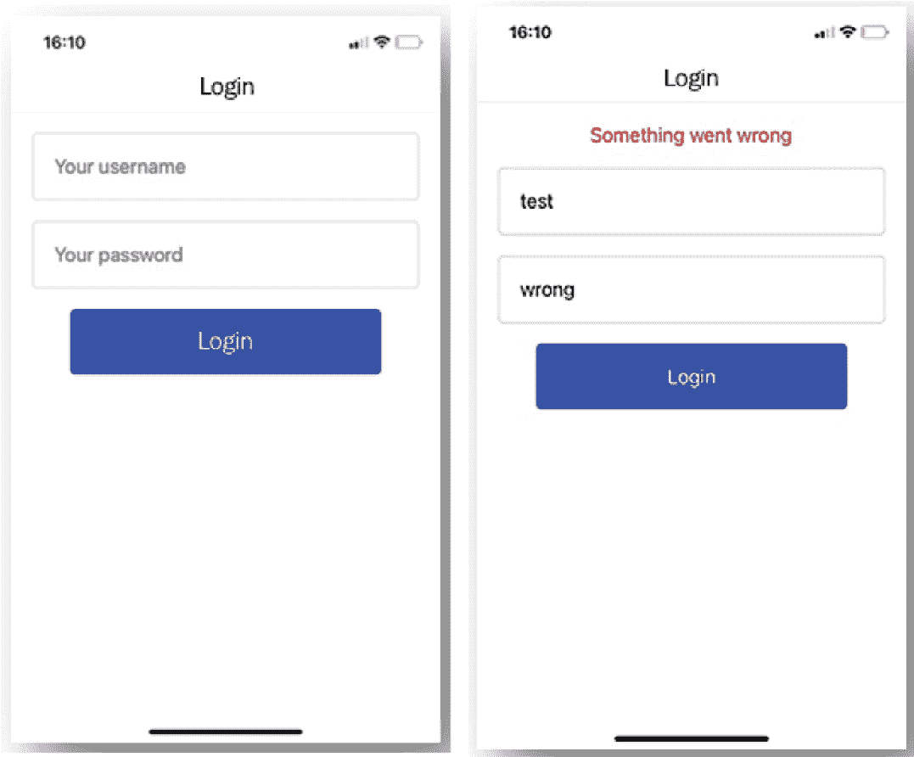
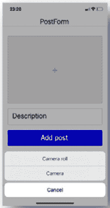

# 第九章：*第九章*：使用 React Native 和 Expo 构建全栈社交媒体应用程序

在本书中您创建的大多数项目都集中在显示数据和在页面之间导航。当我们使用 React Native 创建第一个移动应用程序时，动画是其中一个重点，这在创建移动应用程序时是必不可少的。在本章中，我们将探讨移动应用程序的一个大优势，即能够使用手机上的相机（或相册）。

本章中我们将创建的应用程序将遵循与之前章节相同的数据密集型应用程序模式。使用 React 技术，如 Context 和 Hooks，从支持身份验证的本地 API 获取数据，同时再次使用 React Navigation 创建更高级的路由设置。此外，使用运行应用程序的移动设备的相机通过 Expo 将图片发布到社交动态。

本章将涵盖以下主题：

+   具有身份验证的高级路由

+   在 React Native 和 Expo 中使用相机

+   iOS 和 Android 的样式差异

# 项目概述

在本章中，我们将构建一个使用本地 API 请求并添加帖子到社交动态的应用程序，包括使用移动设备上的相机。通过本地 API 和 React Navigation 添加了具有身份验证的高级路由，同时使用 Expo 来访问相机（滚动）。

构建时间为 2 小时。

注意

本章使用 React Native 版本 0.64.3 和 Expo SDK 版本 44。由于 React Native 和 Expo 经常更新，请确保您使用这些版本以确保本章中描述的模式按预期运行。

# 开始

本章中我们将创建的项目基于您可以在 GitHub 上找到的初始版本：[`github.com/PacktPublishing/React-Projects-Second-Edition/tree/main/Chapter09-initial`](https://github.com/PacktPublishing/React-Projects-Second-Edition/tree/main/Chapter09-initial)。完整的源代码也可以在 GitHub 上找到：[`github.com/PacktPublishing/React-Projects-Second-Edition/tree/main/Chapter09`](https://github.com/PacktPublishing/React-Projects-Second-Edition/tree/main/Chapter09)。

您需要在 iOS 或 Android 移动设备上安装 Expo Go 应用程序，以便在物理设备上运行项目。一旦您下载了应用程序，您需要创建一个 Expo 账户以使开发过程更加顺畅。请确保将您的账户详细信息保存在安全的地方，因为您在本章的后续部分需要这些信息。

或者，您可以在计算机上安装 Xcode 或 Android Studio 来在虚拟设备上运行应用程序：

+   **对于 iOS**：有关如何设置本地机器以运行 iOS 模拟器的信息，请参阅此处：[`docs.expo.io/workflow/ios-simulator/`](https://docs.expo.io/workflow/ios-simulator/)。

+   **对于 Android**：有关如何设置你的本地机器以从 Android Studio 运行模拟器的信息，可以在此处找到：[`docs.expo.io/workflow/android-studio-emulator/`](https://docs.expo.io/workflow/android-studio-emulator/)。

    注意

    **强烈建议**使用 Expo 客户端应用程序在物理设备上运行本章中的项目。目前仅支持在物理设备上接收通知，在 iOS 模拟器或 Android Studio 模拟器上运行项目将导致错误信息。

## 检查初始项目

对于本章，已经使用 Expo 的 CLI 创建了一个初始应用，正如你在上一章所学。要开始，你需要在本章目录下运行以下命令来安装所有依赖项并启动服务器和应用程序：

```js
yarn && yarn start
```

在安装依赖项后，此命令将启动 Expo，并给你从终端或浏览器启动项目的权限。在终端中，你现在可以使用二维码在你的移动设备上打开应用程序，或者在模拟器中打开应用程序。在浏览器中，将打开 Expo DevTools，这也允许你使用手机摄像头或 Expo Go 应用程序扫描二维码。

为我们的应用程序获取数据的本地 API 是使用 JSON Server 创建的。我们之前已经使用过这个库，因为我们在这个存储库中使用了 `db.json` 文件。对于这个项目，我们在本章的目录中有一个单独的 `db.json` 文件，它由 `server.js` 文件加载以创建本地 API。可以通过在单独的终端标签或窗口中运行以下命令来启动本地 API：

```js
yarn start-server
```

这将在 `http://localhost:3000/api/` 上启动一个服务器，例如，`http://localhost:3000/api/posts` 端点，它返回一系列帖子。然而，在构建移动应用程序时，出于安全原因，你不能使用 `localhost` 地址（或任何没有 HTTPS 的其他地址）。为了能够在 React Native 应用程序中使用此端点，你需要找到你机器的本地 IP 地址。

要找到你的本地 IP 地址，你需要根据你的操作系统执行以下操作：

+   **对于 Windows**：打开终端（或命令提示符）并运行以下命令：

    ```js
    Ipconfig
    ```

这将返回一个类似于以下截图中的列表，其中包含你本地机器的数据。在这个列表中，你需要查找 **IPv4 地址** 字段：



图 9.1 – 在 Windows 中查找本地 IP 地址

+   **对于 macOS**：打开终端并运行以下命令：

    ```js
    ipconfig getifaddr en0
    ```

运行此命令后，你的机器的本地 IPv4 地址将被返回，看起来像这样：

```js
192.168.1.107
```

本地 IP 地址可以用作 `localhost` 的替代品，您可以通过访问以下页面来尝试：`http://192.168.1.107/api/posts`。请确保将 IP 地址替换为您自己的。

本章的应用程序已经设置好，需要知道用于本地 API 的 URL。在 Expo 中的配置可以存储在 `app.json` 中，但如果您想存储特定的配置环境变量，也可以存储在 `app.config.js` 中。在此文件中，您可以添加以下配置：

```js
export default {
    extra: {
      apiUrl: 'http://LOCAL_IP_ADDRESS:3000',
    },
  };
```

在前面的 `app.config.js` 文件中，您需要将 `LOCAL_IP_ADDRESS` 替换为您从您的机器上获取的自己的 IP 地址。

要在我们的代码中使用此环境变量，我们使用 `expo-constants` 库。这已经在本章的初始应用程序中安装，如何从 `app.config.js` 获取 `apiUrl` 的示例可以在 `context/PostsContext.js` 文件中看到：

```js
import React from 'react';
import { createContext, useReducer } from 'react';
import Constants from 'expo-constants';
const { apiUrl } = Constants.manifest.extra;
export const PostsContext = createContext();
  // ...
```

`apiUrl` 常量现在用于获取以下本地 API。无论您是从虚拟设备还是物理设备打开的应用程序，此时初始应用程序应该看起来像这样：


图 9.2 – 初始应用程序

初始应用程序的 `screens` 目录包含五个屏幕，分别是 `Posts`、`PostDetail`、`PostForm`、`Profile` 和 `Login`。`Posts` 屏幕将是加载的初始屏幕，显示您可以点击以继续到 `PostDetail` 屏幕的帖子列表。目前，`PostForm`、`Profile` 和 `Login` 屏幕尚未可见，因为我们将在本章后面添加高级路由和身份验证。

从这个 React Native 应用程序的项目结构如下，其中结构与您在这本书中之前创建的项目类似：

```js
chapter-9-initial  
  |- /.expo
  |- /.expo-shared   
  |- /node_modules 
  |- /assets
  |- /components 
     |- Button.js
     |- FormItem.js
     |- PostItem.js 
  |- /context 
     |- AppContext.js 
     |- PostsContext.js 
     |- UserContext.js 
  |- /screens 
     |- Login.js
     |- PostDetail.js 
     |- PostForm.js
     |- Posts.js
     |- Profile.js
  app.config.js
  app.json  
  App.js
  babel.config.js
  db.json
  server.js
```

在 `assets` 目录中，您可以找到在您将此应用程序安装到移动设备上后用作主屏幕应用程序图标的图像，以及将作为启动屏幕显示的图像。`App.js` 文件是您应用程序的实际入口点，所有此应用程序的组件都位于 `screens` 和 `components` 目录中。您还可以找到一个名为 `context` 的目录。此目录包含此应用程序的所有状态管理组件。

**注意**

如果在您的本地设备或模拟器上加载应用程序时出现错误，显示 `app.config.js`。此外，服务器必须在单独的终端标签页中运行。

您的应用程序的配置，例如 App Store，放置在 `app.json` 中，而 `babel.config.js` 包含特定的 Babel 配置。如前所述，`app.config.js` 文件包含本地 API 的 URL 配置。还需要两个文件来创建本地 API。这些是前面在本节中描述的 `db.json` 和 `server.js` 文件。

# 使用 React Native 和 Expo 构建全栈社交媒体应用程序

本章中将要构建的应用程序将使用本地 API 检索和修改应用程序中可用的数据。此应用程序将显示社交媒体源的数据，允许您添加包含图片的新帖子，并允许您对这些社交媒体帖子做出回应。

## 带有身份验证的高级路由

我们已经学习了如何使用 React Navigation 向 React Native 应用程序添加路由。我们添加的路由是使用堆栈导航器，它没有显示所有路由的某种菜单或导航栏的方式。在本节中，我们将使用 React Navigation 添加标签导航器以在应用程序底部显示标签栏。稍后，我们还将添加身份验证流程。

### 添加底部标签

底部标签在 iOS 应用程序中很常见，但在 Android 应用程序中则不太受欢迎。在本章的最后部分，我们将了解 iOS 和 Android 之间在样式上的差异。但首先，我们将专注于向我们的应用程序添加底部标签。

要添加标签导航器，我们需要完成以下操作：

1.  React Navigation 有一个用于创建标签导航器的单独库，我们需要从 npm 安装它：

    ```js
    yarn add @react-navigation/bottom-tabs
    ```

当`@react-navigation/bottom-tabs`的安装完成时，请确保使用`npm start`命令重新启动 Expo。

1.  在`App.js`文件中，列出此应用程序的所有路由，我们需要导入创建标签的方法：

    ```js
      import { StatusBar } from 'expo-status-bar';
      import React from 'react';
      import { NavigationContainer } from 
        '@react-navigation/native';
      import { createStackNavigator } from 
        '@react-navigation/stack';
    + import { createBottomTabNavigator } from 
        '@react-navigation/bottom-tabs';
      // ...
    ```

1.  可以使用`createBottomTabNavigator`方法创建标签导航器。这些导航器屏幕必须在`App.js`文件中的单独组件内创建，其中`Posts`、`PostForm`和`Profile`屏幕将被添加到其中。这些屏幕将后来在底部标签中可用。重要的是要传递不显示标题的选项，因为屏幕标题将由父导航器渲染：

    ```js
      // ...
    + const Tab = createBottomTabNavigator();
    + function Home() {
    +   return (
    +     <Tab.Navigator>
    +       <Stack.Screen 
    +         name='Posts' 
    +         component={Posts} 
    +         options={{ headerShown: false }}
    +       />
    +       <Stack.Screen 
    +         name='Profile' 
    +         component={Profile} 
    +         options={{ headerShown: false }}
    +         />
    +       <Stack.Screen 
    +         name='PostForm' 
    +         component={PostForm} 
    +         options={{ headerShown: false }}
    +       />
    +     </Tab.Navigator>
    +   );
    + }
      export default function App() {
        // ...
    ```

1.  要在应用程序中渲染导航器，我们需要将其添加到`App`组件内的`return`语句中：

    ```js
      export default function App() {
        return (
          <AppContext>
            <NavigationContainer>
              <StatusBar style='auto' />
    -         <Stack.Navigator initialRouteName='Posts'>
    -           <Stack.Screen name='Posts' 
                  component={Posts} />
    -           <Stack.Screen name='Profile'
                  component={Profile} />
    -           <Stack.Screen name='PostForm' 
                  component={PostForm} />
    +         <Stack.Navigator initialRouteName='Home'>
    +           <Stack.Screen name='Home' component={Home} />
                <Stack.Screen name='PostDetail'
                  component={PostDetail} />
                <Stack.Screen name='Login' 
                  component={Login} />
              </Stack.Navigator>
            </NavigationContainer>
          </AppContext>
        );
      }
    ```

1.  当你现在使用标签导航器导航到任何屏幕时，你会看到标题栏中的标题始终是`Home`组件，它本身渲染不同的屏幕。我们可以通过使用 React Navigation 中的`getFocusedRouteNameFromRoute`在主页面的`options`属性中强制标题为活动标签的标题：

    ```js
      import { StatusBar } from 'expo-status-bar';
      import React from 'react';
    - import { NavigationContainer } from 
       '@react-navigation/native';
    + import { NavigationContainer,
        getFocusedRouteNameFromRoute }
          from '@react-navigation/native';

      // ...

      export default function App() {
        return (
          <AppContext>
            <NavigationContainer>
              <StatusBar style='auto' />
              <Stack.Navigator>
                <Stack.Screen
                  name='Home'
                  component={Home}
    +             options={({ route }) => ({
    +               headerTitle:
                      getFocusedRouteNameFromRoute(route),
    +             })}
                />
                <Stack.Screen name='PostDetail'
                 component={PostDetail} />
                <Stack.Screen name='Login'
                 component={Login} />
              </Stack.Navigator>
            </NavigationContainer>
          </AppContext>
        );
      }
    ```

1.  底部标签也可以在激活时拥有一个图标和自定义颜色。为此，我们可以修改标签导航器的`screenOptions`。标签的图标可以从`@expo/vector-icons`导入，该图标已经包含在 Expo 中：

    ```js
      import { StatusBar } from 'expo-status-bar';
      + import { FontAwesome } from '@expo/vector-icons';
      import React from 'react';

      // ...

      function Home() {
        return (
          <Tab.Navigator
    +       screenOptions={({ route }) => ({
    +         tabBarActiveTintColor: 'blue',
    +         tabBarInactiveTintColor: 'gray',
    +         tabBarIcon: ({ color, size }) => {
    +           const iconName =
    +             (route.name === 'Posts' && 'feed') ||
    +             (route.name === 'PostForm' && 
                    'plus-square') ||
    +             (route.name === 'Profile' && 'user');
    +            return <FontAwesome name={iconName} 
                   size={size} color={color} />;
              },
    +       })}
          >
            // ...
          </Tab.Navigator>
        );
      }
      // ...
    ```

1.  最后，我们还可以更改标签的标签，例如，对于显示添加新帖子表单的`PostForm`屏幕：

    ```js
      // ...
      function Home() {
        return (
          <Tab.Navigator
            // ...
          >
              <Stack.Screen
              name='PostForm'
              component={PostForm}
              options={{
                headerShown: false,
    +           tabBarLabel: 'Add post',
              }}
            />
            <Stack.Screen name='Profile' component={Profile} 
            />
          </Tab.Navigator>
        );
      }
      // ...
    ```

通过这些更改，应用程序现在具有具有堆栈导航器和标签导航器的路由，看起来应该像这样：


图 9.3 – 带有底部标签的应用程序

现在，我们几乎可以到达所有屏幕，只有`Login`屏幕仍然隐藏。这个屏幕被添加到堆栈导航器中，并且当用户未认证时应显示。在本节的下一部分，我们将添加认证流程来处理这个问题。

### 认证流程

在前端应用程序中进行身份验证时，大多数情况下使用的是**JSON Web Tokens**（JWTs），这是一种加密的令牌，可以轻松地与后端共享用户信息。当用户成功认证后，后端会返回 JWT，通常这个令牌会有一个过期日期。对于用户需要认证的每个请求，都应该发送这个令牌，以便后端服务器可以确定用户是否已认证并且允许执行此操作。尽管 JWT 可以用于认证，因为它们是加密的，但不应向其中添加任何私人信息，因为令牌仅应用于认证用户。只有当发送了包含正确 JWT 的文档时，服务器才能发送私人信息。

本章中我们正在构建的移动应用程序仅使用`GET`请求检索帖子，但本地 API 也支持`POST`请求。但为了发送`POST`请求，我们需要进行认证，这意味着我们需要检索一个可以与我们的 API 请求一起发送的令牌。为此，我们可以使用 API 的`api/login`端点：

1.  `Login`组件可以用于登录，但目前没有显示。要显示此组件，我们需要更改`App.js`中堆栈导航器的逻辑。我们需要在这个文件中创建一个新的组件，称为`Navigator`，而不是让`App`组件返回堆栈导航器：

    ```js
      // ...
    + function Navigator() {
    +   return (
    +     <NavigationContainer>
    +       <StatusBar style='auto' />
    +       <Stack.Navigator>
    +         <Stack.Screen name='Login' component={Login}
              />
    +         <Stack.Screen
    +           name='Home'
    +           component={Home}
    +           options={({ route }) => ({
    +             headerTitle:  
                    getFocusedRouteNameFromRoute(route),
    +           })}
    +         />
    +         <Stack.Screen name='PostDetail'
                component={PostDetail} />
    +       </Stack.Navigator>
    +     </NavigationContainer>
    +   );
    + }
      export default function App() {
        // ...
    ```

1.  上述代码块可以从`App`中删除，并用这个新的`Navigator`组件替换：

    ```js
      // ...
      export default function App() {
        return (
          <AppContext>
    -       // ...
    +       <Navigator />
          </AppContext>
        );
      }
    ```

1.  我们还需要检查`Navigator`组件中令牌的值，因为我们不希望在未提供令牌时包含主页。登录的逻辑已经存在于`context/UserContext.js`文件中的`UserContext`中，并且可以从`Navigator`组件中获取此上下文中的`user`对象：

    ```js
      import { StatusBar } from 'expo-status-bar';
      import { FontAwesome } from '@expo/vector-icons';
    - import React from 'react';
    + import React, { useContext } from 'react';
      // ...
      import AppContext from './context/AppContext';
    + import UserContext from './context/UserContext';
      const Stack = createStackNavigator();
      const Tab = createBottomTabNavigator();
      function Home() {
        // ...
    ```

1.  现在，我们可以从上下文中获取`user`对象，并添加逻辑以在不存在令牌时仅返回`Login`屏幕：

    ```js
      // ...
      function Navigator() {
    +   const { user } = useContext(UserContext);
        return (
          <NavigationContainer>
            <StatusBar style='auto' />
    -       <Stack.Navigator>
    +       <Stack.Navigator initialRouteName=
              {user.token.length ? 'Home' : 'Login'}>
              <Stack.Screen
                   name='Home'
                   // ...
                  />
                  <Stack.Screen name='PostDetail'
                   component={PostDetail} />
    <Stack.Screen name='Login' 
                   component={Login} />
                )}
              </Stack.Navigator>
            </NavigationContainer>
          );
        }
        export default function App() {
        // ...
    ```

1.  如果你现在刷新应用程序，你可以看到正在显示的`Login`组件。你可以使用用户名和密码组合登录，这两个值都是`test`。登录后，我们希望导航到主页，为此我们需要在`screens/Login.js`中做出更改：

    ```js
    + import { useNavigation } from 
       '@react-navigation/core';
    + import React, { useContext, useState } from 'react';
    - import React, { useContext, useEffect, useState } 
        from 'react';
      // ...
      export default function Login() {
        const [username, setUsername] = useState('');
        const [password, setPassword] = useState('');
    -    const { error, loginUser } = 
           useContext(UserContext);
    +    const { user, error, loginUser } = 
           useContext(UserContext);
    +   const navigation = useNavigation();
    +   useEffect(() => {
    +     if (user.token) {
    +       navigation.navigate('Home');
    +     }
    +   }, [user.token]);
        return (
         // ...
    ```

当上下文中`user`对象的`token`值发生变化时，用户现在将被导航到主页。这可以通过使用用户名和密码组合登录来显示，这两个值都是`test`。如果你输入了错误值，你会看到错误信息，就像这里所显示的：



图 9.4 – 处理认证

然而，由于在重新加载应用程序时上下文会被恢复，令牌并没有被持久化。对于 Web 应用程序，我们可以使用`localStorage`或`sessionStorage`。但对于移动应用程序，你需要使用 React Native 的`AsyncStorage`库来在 iOS 和 Android 上实现持久化存储。在 iOS 上，它将使用原生代码块为你提供`AsyncStorage`提供的全局持久化存储，而在运行 Android 的设备上，将使用基于 RocksDB 或 SQLite 的存储。

注意

对于更复杂的用法，建议在`AsyncStorage`之上使用抽象层，因为默认情况下不支持加密。此外，如果你想要使用`AsyncStorage`存储大量信息，键值系统可能会给你带来性能问题。iOS 和 Android 都会对每个应用程序可以使用的存储量设置限制。

要添加用户令牌的持久性，我们需要从 Expo 安装正确的库并对上下文进行修改：

1.  我们可以通过运行以下命令从 Expo 安装`AsyncStorage`：

    ```js
    expo install @react-native-async-storage/async-storage
    ```

1.  为了持久化，可以在`context/UserContext.js`文件中的`UserContext`中导入`AsyncStorage`令牌：

    ```js
      import React, { createContext, useReducer } 
        from 'react';
    + import AsyncStorage from 
       '@react-native-community/async-storage';
      import Constants from 'expo-constants';
      // ...
    ```

1.  在同一文件中，在将其添加到上下文后，可以使用`AsyncStorage`来存储令牌：

    ```js
      // ...
      export const UserContextProvider = ({ children }) => {
        const [state, dispatch] = useReducer(reducer,
          initialState);
        async function loginUser(username, password) {
          try {
            // ...
            if (result) {
              dispatch({ type: 'SET_USER_TOKEN',
                         payload: result.token });
    +         AsyncStorage.setItem('token', result.token);
            }
          } catch (e) {
            dispatch({ type: 'SET_USER_ERROR',
                       payload: e.message });
          }
        }
        // ...
    ```

1.  现在令牌从本地 API 检索后已持久化，也可以从`AsyncStorage`中检索。因此，我们需要创建一个新的函数来检索令牌并将其添加到上下文中：

    ```js
        // ...  
    +   async function getToken() {
    +     try {
    +       const token = 
              await AsyncStorage.getItem('token');
    +       if (token !== null) {
    +         dispatch({ type: 'SET_USER_TOKEN', 
                        payload: token });
    +       }
    +     } catch (e) {}
    +   }
        return (
    -     <UserContext.Provider value={{ ...state, 
            loginUser, logoutUser }}>
    +     <UserContext.Provider value={{ ...state, 
            loginUser, logoutUser, getToken }}>
            {children}
          </UserContext.Provider>
        );
      };
      export default UserContext;
    ```

1.  最后，当应用程序首次渲染时，需要从`App.js`调用此函数。这样，当应用程序启动或刷新时，你将获得令牌，并且认证会被持久化：

    ```js
      import { StatusBar } from 'expo-status-bar';
      import { FontAwesome } from '@expo/vector-icons';
    - import React, { useContext } from 'react';
    + import React, { useContext, useEffect } from 'react';
      // ...
      function Navigator() {
    -   const { user } = useContext(UserContext);
    +   const { user, getToken } =
          useContext(UserContext);
    +   useEffect(() => {
    +     getToken();
    +   }, []);
        return (
          // ...
    ```

1.  登录一次后，令牌现在已持久化，当应用程序加载时将跳过`Login`屏幕，并且`AsyncStorage`中存在令牌。然而，由于令牌已持久化，我们还需要一种注销并删除令牌的方法。在`context/UserContext.js`文件中，必须修改`logoutUser`函数：

    ```js
      // ...
      async function logoutUser() {
    +   try {
    +     await AsyncStorage.removeItem('token');
          dispatch({ type: 'REMOVE_USER_TOKEN' });
    +   } catch (e) { }
      }
      async function getToken() {
        // ...
    ```

当你现在转到`Profile`屏幕并点击`AsyncStorage`和应用程序状态时，我们需要将用户导航回`Login`屏幕。在不同嵌套导航器之间导航的演示将在本节的下一部分进行。

注意

在使用 iOS 或 Android 手机时，要重新加载 Expo Go 中的应用程序，你可以摇晃设备。通过摇晃设备，会出现一个菜单，其中包含重新加载应用程序的选项。在这个菜单中，你还必须选择启用 **快速刷新**，以便在修改代码时自动刷新应用程序。

### 在嵌套路由之间导航

在 React Navigation 中，我们可以嵌套不同的导航器，例如在应用程序启动时渲染的堆栈导航器，显示 `Login` 屏幕或标签导航器。从嵌套导航器中，无法直接导航到父导航器，因为无法访问父导航器的 `navigation` 对象。但幸运的是，我们可以使用一个 `ref` 来创建对“最高”导航器的引用。从这个引用，我们可以访问 `navigation` 对象，否则我们会使用 `useNavigation` 钩子来访问。为了在我们的应用程序中实现这一点，我们需要更改以下内容：

1.  创建一个名为 `routing.js` 的新文件，并包含以下内容：

    ```js
    import React, { createRef } from 'react';
    export const navigationRef = createRef(); 
    ```

1.  这个 `navigationRef` 可以在 `App.js` 中导入，并将其附加到 `App` 组件中的 `NavigationContainer`：

    ```js
      // ...
      import AppContext from './context/AppContext';
      import UserContext from './context/UserContext';
    + import { navigationRef } from './routing';

       // ...
      function Navigator() {
        const { user, getToken } = 
          useContext(UserContext);
        // ...
        return (
    -     <NavigationContainer>
    +     <NavigationContainer ref={navigationRef}>
            // ...
    ```

1.  包含 `Login` 屏幕的堆栈导航器的 `navigation` 对象现在可以通过 `screens/Profile.js` 中的 `Profile` 屏幕的此 `ref` 访问。使用 `reset` 方法，我们可以重置整个 `navigation` 对象并导航到 `Login` 屏幕：

    ```js
      // ...
    + import { navigationRef } from '../routing';
      export default function Profile() {
        const { logoutUser } = useContext(UserContext);
        return (
          <View style={styles.container}>
            <Button
              onPress={() => {
                logoutUser();
    +           navigationRef.current.reset({
    +             index: 0,
    +             routes: [{ name: 'Login' }],
    +           });
              }}
              label='Logout'
            />
          </View>
        );
      }
      // ...
    ```

用户认证处理完毕后，我们可以在下一节继续添加创建带有图片的新帖子的功能。

## 使用 React Native 和 Expo 的相机

除了显示已添加到本地 API 的帖子外，您还可以使用 `POST` 请求添加帖子，并发送文本和图片作为变量。将图片上传到您的 React Native 应用程序可以通过使用相机拍照或从相册中选择图片来实现。对于这两种用例，React Native 和 Expo 都提供了 API，或者可以从 npm 安装大量可安装的包。对于这个项目，您将使用来自 Expo 的 `ImagePicker` API，它将这些功能合并到一个组件中。

要将创建新帖子功能添加到您的社交媒体应用程序中，需要对创建添加帖子的新屏幕进行以下更改：

1.  我们需要从 Expo 安装一个库，以便我们可以在任何设备上访问相册：

    ```js
    expo install expo-image-picker
    ```

1.  要使用相册，我们需要使用在 `screens/PostForm.js` 文件中导入的 `ImagePicker` 库请求 `CAMERA_ROLL` 权限：

    ```js
      import React, { useContext, useState } from 'react';
      import { StyleSheet, TouchableOpacity, View, Text,
        KeyboardAvoidingView, Platform, Alert, Image } from 
          'react-native';
    + import * as ImagePicker from 'expo-image-picker';
      // ...
      export default function PostForm() {
        // ...
    +   async function uploadImage() {
    +     const { status } = await ImagePicker
            .requestMediaLibraryPermissionsAsync();
    +     if (status !== 'granted') {
    +       Alert.alert('Sorry', 'We need camera roll 
              permissions to make this work!');
    +     }
    +   }
        return (
          // ...
    ```

1.  然后，需要将这个 `uploadImage` 函数添加到同一文件中的 `TouchableOpacity` 组件：

    ```js
      // ...
      return (
        <KeyboardAvoidingView
          behavior={Platform.OS == 'ios' ? 'padding' :
         'height'}
          style={styles.container}
        >
          <View style={styles.form}>
            <TouchableOpacity
    +         onPress={() => uploadImage()}
              style={styles.imageButton}
            >
              <Text style={styles.imageButtonText}>+
              </Text>
            </TouchableOpacity>
            // ...
    ```

1.  当您现在按下此屏幕上添加帖子的按钮时，将显示一个弹出窗口，要求给予 Expo Go 访问相册的权限。此外，请注意，在此页面上，我们不是使用 `View` 组件来包装屏幕，而是使用 `KeyboardAvoidingView` 组件。这确保了当您在输入时，此屏幕上的组件不会被键盘隐藏。

    注意

    您不能再次请求用户权限；相反，您需要手动授予相册权限。要再次设置此权限，您应该在 iOS 的设置屏幕上选择 Expo 应用程序。在下一屏幕上，您能够添加访问相册的权限。

1.  当用户已授予访问相册的权限时，您可以使用来自 Expo 的 `ImagePicker` API 打开相册。这同样是一个异步函数，它接受一些配置字段，例如宽高比。如果用户已选择了一张图片，`ImagePicker` API 将返回一个包含字段 URI 的对象，这是用户设备上图片的 URL：

    ```js
      // ...
      async function uploadImage() {
        const { status } = await ImagePicker
          .requestMediaLibraryPermissionsAsync();
        if (status !== 'granted') {
          Alert.alert(
            'Sorry',
            'We need camera roll permissions to make this 
             work!',
          );
    +   } else {
    +     const result = 
            await ImagePicker.launchImageLibraryAsync({
    +       mediaTypes: ImagePicker.MediaTypeOptions.All,
    +       allowsEditing: true,
    +       aspect: [4, 3],
    +       quality: 1,
    +     });
    +     if (!result.cancelled) {
    +       setImageUrl(result.uri);
    +     }
        }
      }
      return (
        // ...
    ```

1.  由于图像的 URL 现在存储在本地状态中的 `imageUrl` 常量中，您可以在 `Image` 组件中显示此 URL。此 `Image` 组件将 `imageUrl` 作为源值，并已设置为使用 100% 的 `width` 和 `height`：

    ```js
      // ...
      return (
        <KeyboardAvoidingView
          behavior={Platform.OS == 'ios' ? 'padding' :
            'height'}
          style={styles.container}
        >
          <View style={styles.form}>
            <TouchableOpacity onPress={() =>
              uploadImage()} style={styles.imageButton}>
    +         {imageUrl.length ? (
    +           <Image
    +             source={{ uri: imageUrl }}
    +             style={{ width: '100%', height: '100%' 
                        }}
    +           />
    +         ) : (
                <Text style={styles.imageButtonText}>+</Text>
    +         )}
            </TouchableOpacity>
            // ...
    ```

通过这些更改，`AddPost` 屏幕应该看起来像以下截图，这些截图是从运行 iOS 的设备上拍摄的。如果您使用的是 Android Studio 模拟器或运行 Android 的设备，此屏幕的外观可能会有细微差异：

![Figure 9.5 – 使用相册

![img/Figure_9.05_B17390.jpg]

图 9.5 – 使用相册

这些更改将使您能够从相册中选择照片，但您的用户也应该能够通过使用他们的相机上传全新的照片。使用来自 Expo 的 `ImagePicker` API，您可以处理这两种情况，因为该组件还有一个 `launchCameraAsync` 方法。这个异步函数将启动相机，并以相同的方式返回相机相册中的图片的 URL。

要添加直接使用用户设备上的相机上传图片的功能，您可以进行以下更改：

1.  当用户点击图像占位符时，默认情况下将打开图片库。但您也希望给用户选择使用相机的选项。因此，必须在使用相机或相册上传图片之间做出选择，这是一个实现 `ActionSheet` 组件的完美用例。React Native 和 Expo 都有一个 `ActionSheet` 组件；建议使用来自 Expo 的组件，因为它将在 iOS 上使用本地的 `UIActionSheet` 组件，在 Android 上使用 JavaScript 实现：

    ```js
    yarn add @expo/react-native-action-sheet
    ```

1.  在此之后，我们需要在 `App.js` 文件中导入 `ActionSheetProvider` 从 `@expo/react-native-action-sheet`：

    ```js
      import { StatusBar } from 'expo-status-bar';
      import { FontAwesome } from '@expo/vector-icons';
      import React, { useContext, useEffect } from 'react';
      import { NavigationContainer, 
        getFocusedRouteNameFromRoute } 
        from '@react-navigation/native';
      import { createNativeStackNavigator } 
        from '@react-navigation/native-stack';
      import { createBottomTabNavigator } 
        from '@react-navigation/bottom-tabs';
    + import { ActionSheetProvider } 
        from '@expo/react-native-action-sheet';
      // ...
    ```

1.  我们将包含`PostForm`屏幕的导航器包裹在这个相同的文件中，这样我们就可以在该屏幕组件中使用 Hook 创建操作表：

    ```js
      function Home() {
        return (
    +     <ActionSheetProvider>
            // ...
    +     </ActionSheetProvider>
        );
      }
      function Navigator() {
        // ...
    ```

1.  在`screens/PostForm.js`文件中，我们现在可以导入 Hook 来从`@expo/react-native-action-sheet`创建操作表：

    ```js
      // ...
      import * as ImagePicker from 'expo-image-picker';
    + import { useActionSheet } from 
       '@expo/react-native-action-sheet';
      import { useNavigation } from '@react-navigation/core';
      import Button from '../components/Button';
      import FormInput from '../components/FormInput';
      import PostsContext from '../context/PostsContext';
      export default function PostForm() {
        // ...
    ```

1.  要添加操作表，必须添加一个打开此`ActionSheet`的函数，并使用`showActionSheetWithOptions`属性和选项来构建`ActionSheet`。选项是`相机`、`相册`和`取消`，根据按下的按钮的索引，应调用不同的函数：

    ```js
      // ...
      export default function PostForm() {
        // ...
        const { addPost } = useContext(PostsContext);
        const navigation = useNavigation();
    +   const { showActionSheetWithOptions } = 
          useActionSheet();
        // ...
    +   function openActionSheet() {
    +     const options = ['Camera roll', 'Camera',
            'Cancel'];
    +     const cancelButtonIndex = 2;
    +     showActionSheetWithOptions(
    +       { options, cancelButtonIndex },
    +       (buttonIndex) => {
    +         if (buttonIndex === 0) {
    +           uploadImage()
    +         }
    +       },
    +     );
    +   }
        return (
          // ...
    ```

1.  当`buttonIndex`为 0 时，将调用请求访问相册并从中选择图片的函数，但我们还需要一个请求相机权限并使用相机的函数：

    ```js
      // ...
    + async function takePicture() {
    +   const { status } = await 
          ImagePicker.requestCameraPermissionsAsync();
    +   if (status !== 'granted') {
    +     Alert.alert('Sorry', 'We need camera permissions 
            to make this work!');
    +   } else {
    +     const result = 
            await ImagePicker. launchCameraAsync ({
    +       mediaTypes: ImagePicker.MediaTypeOptions.All,
    +       aspect: [4, 3],
    +       quality: 1,
    +     });
    +     if (!result.cancelled) {
    +       setImageUrl(result.uri);
    +     }
    +   }
    + }
      function openActionSheet() {
        // ...
    ```

1.  最后，必须将打开操作表的`openActionSheet`函数附加到`TouchableOpacity`组件：

    ```js
      // ...
      return (
        <KeyboardAvoidingView
          behavior={Platform.OS == 'ios' ? 'padding' : 
            'height'}
          style={styles.container}
        >
          <View style={styles.form}>
            <TouchableOpacity
    -         onPress={() => uploadImage()}
    +         onPress={() => openActionSheet()}
              style={styles.imageButton}
            >
            // ...
    ```

按压图像占位符现在将打开操作表以选择您是想使用相册还是相机来选择图像：



图 9.6 – iOS 上的操作表

您的帖子及图片现在将显示在`帖子`屏幕的顶部，这意味着您已成功添加了帖子。在本章的最后部分，我们将探讨该应用在 iOS 和 Android 之间在样式上的差异。

## iOS 和 Android 的样式差异

在设计您的应用时，您可能希望为 iOS 和 Android 设置不同的样式规则，例如，以更好地匹配 Android 操作系统的样式。有多种方法可以将不同的样式规则应用于不同的平台；其中之一是通过使用`Platform`模块，该模块可以从 React Native 导入。

此模块已经在本应用的某些部分中使用，但让我们通过在导航器的标签中根据设备的操作系统添加不同的图标来更详细地了解其工作原理：

1.  在`App.js`中，我们已经从 Expo 导入了`FontAwesome`图标，但对于 Android，我们希望导入`MaterialIcons`以便它们可以显示。此外，我们还需要从 React Native 导入`Platform`：

    ```js
      import { StatusBar } from 'expo-status-bar';
      import { 
        FontAwesome,
    +   MaterialIcons, 
      } from '@expo/vector-icons';
      import React, { useContext, useEffect } 
        from 'react';
    + import { Platform } from 'react-native';
      // ...
    ```

1.  使用`Platform`模块，您可以通过检查`Platform.OS`的值是否为`ios`或`android`来检查您的移动设备是否正在运行 iOS 或 Android。该模块必须在标签导航器中使用，这样我们就可以在这两个平台之间做出区分：

    ```js
      // ...
      function Home() {
        return (
          <ActionSheetProvider>
            <Tab.Navigator
              // ...
              screenOptions={({ route }) => ({
                tabBarIcon: ({ color, size }) => {
                  // ...
    -             return <FontAwesome name={iconName} 
                    size={size} color={color} />;
    +             return Platform.OS === 'ios' ? (
    +               <FontAwesome name={iconName} 
                     size={size} color={color} />
    +             ) : (
    +               <MaterialIcons name={iconName} 
                      size={size} color={color} />
    +           );
              },
            })}
          >
          // ...
    ```

1.  这将用`MaterialIcons`替换 Android 上的`FontAwesome`图标。此图标库为图标使用不同的名称，因此我们还需要进行以下更改：

    ```js
      // ...
      function Home() {
        return (
          <ActionSheetProvider>
            <Tab.Navigator
              // ...
              screenOptions={({ route }) => ({
                tabBarIcon: ({ color, size }) => {
                  const iconName =
    -               (route.name === 'Posts' && 'feed') ||
    -               (route.name === 'PostForm' && 
                     'plus-square') ||
    -               (route.name === 'Profile' && 'user');
    +               (route.name === 'Posts' &&
    +                 (Platform.OS === 'ios' ? 'feed' :
                       'rss-feed')) ||
    +               (route.name === 'PostForm' &&
    +                 (Platform.OS === 'ios' ? 
                       'plus-square' : 'add-box')) ||
    +               (route.name === 'Profile' &&
                      (Platform.OS === 'ios' ? 'user' :
                       'person'));
                  return Platform.OS === 'ios' ? (
                    // ...
    ```

当您在 Android 移动设备上运行应用程序时，导航标签将显示基于 Material Design 的图标。如果您使用的是苹果设备，它将显示不同的图标；您可以将 `Platform.OS === 'ios'` 条件更改为 `Platform.OS === 'android'`，以将 Material Design 图标添加到 iOS。如果您还没有看到任何变化，请尝试在您的设备上重新加载应用程序。

1.  我们还可以直接在 `StyleSheet` 中使用 `Platform` 模块，例如，更改我们应用程序中 `Button` 组件的颜色。默认情况下，我们的 `Button` 组件具有蓝色背景，但让我们将其在 Android 上更改为紫色。在 `components/Button.js` 中，我们需要导入 `Platform` 模块：

    ```js
      import React from 'react';
      import {
        StyleSheet,
        TouchableOpacity,
        View,
        Text,
    +   Platform,
      } from 'react-native';
      export default function Button({ onPress, label }) {
        // ...
    ```

1.  我们在创建 `StyleSheet` 的过程中使用 `select` 方法：

    ```js
      // ... 
      const styles = StyleSheet.create({
        button: {
          width: '100%',
          padding: 20,
          borderRadius: 5,
    -     backgroundColor: 'blue',
    +     ...Platform.select({
    +       ios: {
    +         backgroundColor: 'blue',
    +       },
    +       android: {
    +         backgroundColor: 'purple',
    +       },
          }),
        },
        // ...
    ```

另一个可以在 iOS 和 Android 之间以不同方式样式的组件是 `PostItem` 组件。如前所述，有多种方法可以做到这一点；除了使用 `Platform` 模块外，您还可以使用平台特定的文件扩展名。任何具有 `*.ios.js` 或 `*.android.js` 扩展名的文件都只会在扩展名指定的平台上渲染。您不仅可以应用不同的样式规则，还可以在不同的平台上进行功能上的更改：

1.  将当前的 `components/PostItem.js` 文件重命名为 `components/PostItem.android.js`，并创建一个名为 `components/PostItem.ios.js` 的新文件，其内容如下：

    ```js
    import React from 'react';
    import { StyleSheet, Text, Dimensions, Image, View }
      from 'react-native';
    const PostItem = ({ data }) => (
      <View style={styles.container}>
        <View style={styles.details}>
          <Text>{data.description}</Text>
        </View>
        <Image source={{ uri: data.imageUrl }} 
         style={styles.thumbnail} />
      </View>
    );
    ```

1.  这将改变 iOS 上帖子标题和图片的顺序，显示标题在图片上方。此外，我们还需要在文件末尾添加以下样式：

    ```js
    // ...
    const styles = StyleSheet.create({
      container: {
        display: 'flex',
        alignItems: 'center',
        justifyContent: 'flex-start',
        backgroundColor: 'white',
        borderWidth: 1,
        borderColor: '#ccc',
        marginBottom: '2%',
      },
      thumbnail: {
        width: Dimensions.get('window').width * 0.98,
        height: Dimensions.get('window').width * 0.98,
        margin: Dimensions.get('window').width * 0.01,
      },
      details: {
        width: '95%',
        margin: '2%',
      },
    });
    export default PostItem;
    ```

1.  在 iOS 上，我们希望显示一个阴影而不是围绕此组件的边框。为了添加此阴影，我们需要更改组件的样式：

    ```js
    // ...
    const styles = StyleSheet.create({
      container: {
        display: 'flex',
        alignItems: 'center',
        justifyContent: 'flex-start',
        backgroundColor: 'white',
    shadowRadius rule, while Android uses the elevation rule. 
    ```

1.  最后，我们还需要更改图像的尺寸，因为我们已经向 `container` 样式添加了边距：

    ```js
    // ...
    const styles = StyleSheet.create({
      // ...
      thumbnail: {
    -   width: Dimensions.get('window').width * 0.98,
    -   height: Dimensions.get('window').width * 0.98,
    +   width: Dimensions.get('window').width * 0.94,
    +   height: Dimensions.get('window').width * 0.94,
        margin: Dimensions.get('window').width * 0.01,
      },
    ```

这将在 iOS 和 Android 上产生以下结果，其中边框已被阴影取代：


图 9.7 – iOS 和 Android 上的样式差异

根据您的手机类型，您也可以将此文件从 `components/PostItem.ios.js` 重命名为 `components/PostItem.android.js`，以在 Android 上看到相同的更改。

就这样。通过这些最终更改，您已经创建了一个将在 Android 和 iOS 设备上运行的 React Native 应用程序，并且这两个平台之间存在样式差异。

# 摘要

在本章中，您已经使用 React Native 和 Expo 创建了一个移动社交媒体应用程序，该应用程序使用本地 API 发送和接收数据，同时也用于身份验证。为了处理身份验证，结合了多种类型的导航器。在获得使用权限后，我们学习了如何使用移动设备的相机和相册。同时，还解释了 iOS 和 Android 之间在样式上的差异。

在完成这个社交媒体应用后，你已经完成了本书的最后一章 React Native 章节，现在可以开始阅读最后一章了。在最后一章中，你将探索 React 的另一个用例，即 VR。通过将 React 与 Three.js 结合，你可以通过编写 React 组件来创建 360 度的 2D 和 3D 体验。

# 进一步阅读

+   Expo 相机：[`docs.expo.io/versions/latest/sdk/camera/`](https://docs.expo.io/versions/latest/sdk/camera/)

+   平台特定代码：[`reactnative.dev/docs/platform-specific-code`](https://reactnative.dev/docs/platform-specific-code)
