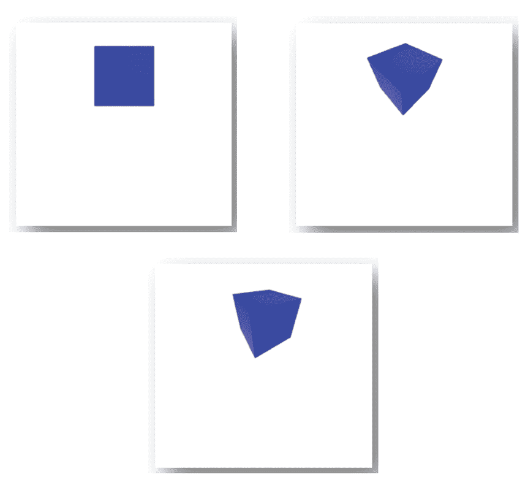

# 第十章：*第十章*：使用 React 和 Three.js 创建虚拟现实应用程序

您几乎完成了——只需再有一章，您就可以自称是一个在所有平台上都经历过 React 的 React 专家。在整个本书中，您已经使用 React 和 React Native 构建了九个应用程序。在本章的最后一章中，我们不会创建一个 Web 或移动应用程序，而是一个 **虚拟现实**（**VR**）应用程序，使用 React 和 **three.js**。使用 three.js，您可以使用 JavaScript 创建动态的 2D、3D 和 VR 体验，并通过使用另一个库将其应用于 React。尽管 VR 仍然是一种新兴技术，但 VR 的最佳用例，例如，零售店希望让客户体验他们的商店或在线游戏。

在本章中，您将探索使用 React 和 three.js 可以实现的基本功能，以及它与 React 的关系。您将构建的应用程序将能够渲染 360 度全景图像，并使用状态管理在屏幕之间进行渲染。通过结合 React 和 three.js 以及其他库，还将显示动画 3D 对象。

本章将涵盖以下主题：

+   开始使用 three.js

+   使用 React 和 three.js 创建全景查看器

+   动画 3D 对象

# 项目概述

在本章中，您将使用 React 和 three.js 构建一个 VR 应用程序，该应用程序结合了 JavaScript 和 React 的原则。该应用程序将添加 2D 全景图像和 3D 对象，并且可以使用 Create React App 在浏览器中运行该项目。

构建时间为 1.5 小时。

# 开始

本章的应用程序将从头开始构建，并使用可在 GitHub 上找到的资产 [`github.com/PacktPublishing/React-Projects-Second-Edition/tree/main/Chapter10-assets`](https://github.com/PacktPublishing/React-Projects-Second-Edition/tree/main/Chapter10-assets)。应将这些资产下载到您的计算机上，以便您可以在本章的后续部分使用它们。本章的完整代码可在 GitHub 上找到 [`github.com/PacktPublishing/React-Projects-Second-Edition/tree/main/Chapter10`](https://github.com/PacktPublishing/React-Projects-Second-Edition/tree/main/Chapter10)。

# 使用 React 和 Three.js 创建 VR 应用程序

您可以通过与其他库结合使用 React 来编写 2D 和 3D VR 应用程序。以前，您可以直接使用 React 360 在 React 中编写 VR 应用程序。但由于其他流行库的出现，例如基于 JavaScript 的 three.js，其开发已被停止。Three.js 允许您创建具有 2D 和 3D UI 组件的应用程序，而无需处理移动或 VR 设备的复杂设置，这与 React 的工作方式类似。

为了在浏览器中渲染 2D 和 3D，three.js 使用 **WebGL**，这是一个在浏览器中直接运行的 JavaScript API。它被所有流行的浏览器最新版本所支持，例如 Chrome、Firefox 和 Microsoft Edge。

## 开始使用 Three.js

Three.js 是基于 JavaScript 开发的，并且可以使用名为 `@react-three/fiber` 的不同库与 React 一起使用，这是一个为 three.js 设计的 React 渲染器，它建立了两者之间的联系。

正如我们在之前的浏览器中渲染的 React 应用程序中所做的那样，我们可以使用 Create React App 作为此应用的起点。要开始使用 three.js 在 React 中构建 2D 和 3D 应用程序，我们首先需要使用 Create React App 创建一个新的项目：

```js
npx create-react-app chapter-10
```

其次，我们需要从 npm 安装 three.js 和 `@react-three/fiber`：

```js
npm install three @react-three/fiber
```

我们不需要任何额外的依赖项或配置，因为 Create React App 已经提供了正确的配置。如果我们进入项目根目录，该目录以我们的项目名称命名，我们会看到它具有以下结构：

```js
chapter-10
  |- /node_modules
  |- package.json
  |- /public
     |- index.html
  |- /src
    |- App.css
    |- App.js
    |- index.css
    |- index.js
```

注意

并非所有由 Create React App 创建的文件都在上面提到；相反，这里只列出了本章中使用的文件。

## 使用 Three.js 创建 3D 对象

使用 Create React App 创建的应用程序基础已经建立，并且我们已经安装了 three.js 以及 `@react-three/fiber`。这个最后的库允许我们在 React 中将 three.js 元素作为组件渲染，并提供了多个 Hooks 来进行更改。这样，我们就可以以我们已从学习 React 中熟悉的声明性和预测性方式使用 three.js。与直接使用 three.js 相比，使用此库不会产生额外的开销，因为组件是在 React 的渲染循环之外渲染的。

要在 React 中使用 three.js 创建 3D 对象，我们需要采取以下步骤：

1.  将 `src/App.js` 的内容替换为以下内容，以便它从 `@react-three/fiber` 返回一个 `Canvas` 组件：

    ```js
    import { Canvas } from '@react-three/fiber';
    import './App.css';
    export default function App() {
      return (
        <div id="Canvas-container">
          <Canvas><Canvas />
        </div>
      )
    }
    ```

此代码添加了一个 `Canvas` 组件，这在我们要在 React 中渲染 three.js 元素时非常重要。有了 `Canvas` 组件，它将渲染我们的 three.js 组件和元素，并且位于 DOM 之外，并自动处理调整大小。

1.  `Canvas` 组件将被调整大小以适应其渲染的 `div` 元素，因此您可以通过更改 CSS 中 `#canvas-container` 的宽度和高度来控制其大小。这可以通过用以下内容替换 `src/App.css` 中的内容来完成：

    ```js
    #Canvas-container {
      height: 100vh;
    }
    ```

1.  要在 `Canvas` 上渲染内容，我们需要向此文件添加一个网格元素，我们不需要导入任何内容。就像我们可以在 React 中添加 `div` 或其他任何元素一样，当 three.js 元素放置在 `@react-three/fiber` 的 `Canvas` 中时，它们将被自动视为 JSX 元素：

    ```js
      import { Canvas } from '@react-three/fiber'
      export default function App() {
        return (
          <div id="Canvas-container">
            <Canvas>
    mesh element inside a Canvas component from @react-three/fiber, under the hood, it will create a THREE.Mesh object.
    ```

1.  这将使用 three.js 的 `boxGeometry` 元素渲染一个小灰色方块，但目前还没有其他功能。此外，我们现在拥有的方块相当小。通过向 `mesh` 元素添加 `scale` 属性，我们可以增加此元素的大小：

    ```js
      // ...
      export default function App() {
        return (
          <div id="Canvas-container">
            <Canvas>
    -         <mesh>
    +         <mesh scale={2}>
                <boxGeometry />
                // ...
    ```

1.  为了给元素添加一些颜色，我们首先需要在 mesh 元素内添加一个带有`color` prop 的`meshStandardMaterial`，并添加另一个名为`ambientLight`的元素。此元素将为组件添加光照，使`boxGeometry`的颜色可见。在这个`ambientLight`元素上，我们可以使用`intensity` prop 来配置光必须有多亮：

    ```js
      // ...
      export default function App() {
        return (
          <div id='canvas-container'>
            <Canvas>
              <mesh scale={2}>
                <boxGeometry />
    +           <meshStandardMaterial color='blue' />
    +           <ambientLight intensity={0.5} />
              </mesh>
            </Canvas>
          </div>
        );
      }
    ```

在我们的应用程序中，我们现在可以看到一个蓝色方块被渲染，而不是灰色方块。你可以通过改变`ambientLight`元素的强度来看到效果，根据强度的值，方块会变亮或变暗。

有一个 2D 方块很酷，但使用 three.js，我们还可以构建 3D 组件。为此，我们需要对组件进行一些修改，以便直接在 React 之外与 three.js 交互，以防止性能问题。为了使元素成为 3D，需要进行以下更改：

1.  让我们为`boxGeometry`元素创建一个单独的组件，这样我们就可以分离关注点并使其可重用。我们可以在`src`目录下的一个名为`components`的新目录中创建一个名为`Box.js`的新文件来完成此操作：

    ```js
    export default function Box() {
      return (
        <mesh scale={2}>
          <boxGeometry />
          <meshStandardMaterial color='blue' />
        </mesh>
      );
    }
    ```

1.  我们需要给`mesh`添加一个`ref`，这样我们就可以在 React 的作用域之外访问它，并使用 three.js 来修改它：

    ```js
    + import { useRef } from 'react';
      export default function Box() {
    +   const mesh = useRef();

        return (
          <mesh
            scale={2}
    +       ref={mesh}
          >
            <boxGeometry />
            <meshStandardMaterial color='blue' />
          </mesh>
        );
      }
    ```

1.  使用 three.js 修改`mesh`元素可以通过更改我们现在可以通过`ref`访问的`mesh`的值来完成。这些更改必须在`@react-three/fiber`的`useFrame` Hook 内完成，该 Hook 由 three.js 在每一帧渲染时触发。当渲染新帧时，我们可以稍微改变网格的旋转，使其旋转：

    ```js
      import { useRef } from 'react';
    Box component continuously on every frame render, you can also use a useEffect Hook to rotate the mesh just once on the initial render or on a set interval.
    ```

1.  在`src/App.js`文件中，我们需要将`boxGeometry`元素替换为这个新组件，以便在应用程序中使其可见：

    ```js
      import { Canvas } from '@react-three/fiber';
    + import Box from './components/Box';
      export default function App() {
        return (
          <div id='canvas-container'>
            <Canvas>
    -         <mesh>
    -           <boxGeometry />
    -           <meshStandardMaterial color='blue' /> */}
    +           <Box />
                <ambientLight intensity={0.5} />
    -          </mesh>
            </Canvas>
          </div>
        );
      }
    ```

1.  最后，我们需要添加两个额外的光源元素来突出显示我们正在渲染 3D 元素，这些是`spotLight`和`pointLight`元素：

    ```js
      // ...
      export default function App() {
        return (
          <div id='canvas-container'>
            <Canvas>
              <Box />
              <ambientLight intensity={0.5} />
    position is an array with three numbers. These numbers represent a Vector3 position. This is a format to describe the position of an object in 3D space where the numbers are the *x*, *y*, and *z* values.
    ```

通过在浏览器中打开应用程序，你现在可以看到一个正在 3D 中旋转的蓝色方块：

图 10.1 – 使用 Three.js 渲染 3D 元素

我们可以使用 three.js 做的一些其他事情是使用我们的鼠标控制`Canvas`。现在`Box`组件在每一帧渲染时都会旋转，但我们可以使用 three.js 控制整个`Canvas`的旋转。`Canvas`组件已经设置了一个相机，我们可以使用 three.js 中的`OrbitControls`组件来控制它。为了在我们的应用程序中实现这一点，我们需要做以下操作：

1.  通过添加一个名为`rotate`的 prop 来禁用`Box`组件的旋转，该 prop 可以是`true`或`false`。如果没有提供值，默认值将是`false`，这意味着`Box`组件不会旋转：

    ```js
      // ...
    - export default function Box() {
    + export default function Box({ rotate  = false }) {
        const mesh = useRef();
        useFrame(() => {
    +     if (rotate) {
            mesh.current.rotation.x = 
            mesh.current.rotation.y += 0.01;
    +     }
        });
        return (
          // ...
    ```

1.  从`src/App.js`文件中，我们不需要设置这个属性，因为我们不希望`Box`组件旋转。相反，我们将在`src/components/Controls.js`文件中创建一个新的组件来控制整个`Canvas`的旋转，从而控制应用程序的相机。为此，我们需要将以下内容添加到这个文件中：

    ```js
    import { useEffect } from 'react';
    import { useThree } from '@react-three/fiber';
    import { OrbitControls } from 
      'three/examples/jsm/controls/OrbitControls';
    export default function Controls() {
      const { camera, gl } = useThree();
      useEffect(() => {
        const controls = new OrbitControls(camera,
          gl.domElement);
        return () => {
          controls.dispose();
        };
      }, [camera, gl]);
      return null;
    };
    ```

这将创建`Controls`组件，并使用 three.js 中的`OrbitControls`组件作为其基础。从`useThree`钩子中，它将获取 three.js 中的`camera`和`gl`，其中第一个是视图视角，第二个是 WebGL 的渲染。在`useEffect`钩子中，`OrbitControls`组件将被创建，并在不再需要时使用`dispose`方法进行清理。

1.  我们需要在`src/App.js`文件中导入这个新的`Controls`组件，并将其放置在`Canvas`组件内部：

    ```js
      import { Canvas } from '@react-three/fiber';
      import Box from './components/Box';
    + import Controls from './components/Controls';
      export default function App() {
        return (
          <div id='canvas-container'>
            <Canvas>
    +         <Controls />
              <Box />
              // ...
    ```

1.  通过之前的更改，我们可以在点击并拖动浏览器中的此组件时旋转`Box`组件。为了使这个体验更流畅，我们可以在`src/components/Box.js`中为此组件添加一个最小和最大控制距离：

    ```js
      // ...
      export default function Controls() {
        // ...
        useEffect(() => {
          const controls = new OrbitControls(camera,
            gl.domElement);
    +     controls.minDistance = 2;
    +     controls.maxDistance = 20;

          // ...
      }, [camera, gl]);
      return null;
    }
    ```

1.  最后，我们可以允许`Controls`组件，例如，进行缩放或平移。这可以通过设置以下值来完成：

    ```js
      // ...
      export default function Controls() {
        // ...
        useEffect(() => {
          const controls = new OrbitControls(camera,
            gl.domElement);
          controls.minDistance = 2;
          controls.maxDistance = 20;
    +     controls.enableZoom = true;
    +     controls.enablePan = true;

          // ...
    ```

添加这两个值后，你可以使用 three.js 和 React 在浏览器中旋转、缩放和平移`Box`组件。在下一节中，我们将渲染 360 度全景图像以便与之交互。

## 渲染 360 度全景图像

应用程序正在使用一个默认的背景，用于显示场景，但也可以动态地更改场景的背景。对于这个应用程序，我们希望场景的背景是 360 度或 3D。符合要求的在线图片可以在众多股票照片网站上找到。

在这本书的 GitHub 仓库中，你可以在`chapter-10-assets`目录下找到本章的资产选择，包括两张 360 度全景图像。你需要下载`beach.jpeg`和`mountain.jpeg`这两个文件，并将它们放置在应用程序的`public`目录中。因此，本章的文件结构将如下所示：

```js
chapter-10
  |- /node_modules
  |- package.json
  |- /public
     |- index.html
     |- beach.jpeg
     |- mountain.jpeg
  |- /src
     |- /components
        |- Box.js
        |- Controls.js
     |- App.css
     |- App.js
     |- index.css
     |- index.js
```

在我们将 360 度全景图像添加到项目中后，我们可以通过在场景的`Canvas`背景中渲染它们来继续操作。使用来自 three.js 和`@react-three/fiber`的组件和钩子，我们可以创建一个 360 度视图，在其中我们还可以渲染本章前一部分创建的 3D 对象。

要添加 360 度背景，我们需要遵循几个步骤：

1.  在项目的`src`文件中的`components`目录下创建一个名为`Panorama.js`的新文件。在这个文件中，添加了使用 360 度图像作为纹理创建新网格的设置。首先，我们需要导入依赖项：

    ```js
    import { useLoader } from '@react-three/fiber';
    import * as THREE from 'three';
    import Box from './Box';
    ```

1.  在导入之后，我们需要定义我们想要为这个应用程序使用的背景：

    ```js
    // ...
    const backgrounds = [
      {
        id: 1,
        url: '/mountain.jpeg',
      },
      {
        id: 2,
        url: '/beach.jpeg',
      },
    ];
    ```

1.  在此文件的底部，必须创建实际的`Panorama`组件，它使用`@react-three/fiber`的钩子，并返回一个来自 three.js 的`mesh`元素以及两个其他 three.js 元素：

    ```js
    // ...
    export default function Panorama() {
      const background = useLoader(THREE.TextureLoader,
        backgrounds[0].url);
      return (
        <mesh>
          <sphereBufferGeometry args={[500, 60, 40]} />
          <meshBasicMaterial map={background} 
            side={THREE.BackSide} />
        </mesh>
      );
    }
    ```

`useLoader`钩子使用`THREE.TextureLoader`和背景图像来创建一个可以被`meshBasicMaterial`用作纹理的对象。它将使用`backgrounds`数组的第一个条目，这是我们稍后可以使其动态化的内容。`sphereBufferGeometry`定义了我们场景中的 360 度视图，在`Canvas`上。

1.  这个新的`Panorama`组件必须在`src/App.js`中导入，以便它可以被渲染。确保在 React 的`Suspense`组件内渲染此组件，因为它是一个动态组件，这是由于使用了`useLoader`钩子：

    ```js
    + import { Suspense } from 'react';
      import { Canvas } from '@react-three/fiber';
    + import Panorama from './components/Panorama';
      // ...
      export default function App() {
        return (
          <div id='Canvas-container'>
             <Canvas>
               <Controls />
    +          <Suspense fallback={null}>
    +           <Panorama />
    +          </Suspense>
               <Box />
               // ...
    ```

现在，你可以再次在浏览器中打开应用程序，看看 360 度全景图像是如何渲染的，也包括我们之前创建的 3D 对象：


图 10.2 – 渲染 360 度全景图像

注意

如果你尝试放大和缩小 360 度全景图像，你会注意到只有`Box`组件的大小在改变。背景图像被设置为覆盖整个背景，并且不在 3D 中。

除了渲染 360 度全景图像外，我们还可以使其具有交互性。通过添加更多的 three.js 元素和使用 React，我们可以让用户通过点击，例如 3D 盒子来更改背景图像。

要更改背景，我们需要将 three.js 与 React 结合使用，并使用本地状态管理来跟踪应该渲染哪个 360 度全景图像。由`@react-three/fiber`渲染的 three.js 元素也可以处理`onClick`事件，使其成为可点击的组件。让我们来实现这个：

1.  在`src/components/Panorama.js`文件中，我们需要从 React 导入`useState`钩子，并使用它创建一个局部状态变量：

    ```js
    + import { useState } from 'react';
      import { useLoader } from '@react-three/fiber';
      import * as THREE from 'three';
      // ...
      export default function Panorama() {
    +   const [activeBackground, setActiveBackground] =
          useState(1);

        // ...
    ```

1.  根据`activeBackground`的值，我们可以选择应该作为背景渲染的 360 度全景图像。`backgrounds`数组的`id`字段用于将本地状态变量与正确的背景匹配：

    ```js
      // ...
      export default function Panorama() {
        const [activeBackground, setActiveBackground] =
          useState(1);

    -   const background = useLoader(THREE.TextureLoader, 
          backgrounds[0].url);
    +   const { url } = backgrounds.find(({ id }) => 
          id === activeBackground);
    +   const background = useLoader(
    +     THREE.TextureLoader,
    +     url
    +   );
        return (
          // ...
    ```

1.  在这个`Panorama`组件的返回语句中，我们需要将返回的`mesh`元素包裹在一个`group`元素中。这个`group`元素允许 three.js 一次返回多个交互元素：

    ```js
      // ...
      export default function Panorama() {
        // ...
        return (
    +     <group>
            <mesh>
              <sphereBufferGeometry args={[500, 60, 40]} />
              <meshBasicMaterial map={background}
                side={THREE.BackSide} />
            </mesh>
    +     </group>
        );
      }
    ```

1.  在这个`group`元素中，我们可以添加另一个带有`onClick`事件的可点击的`group`元素，当点击时将更新`activeBackground`的值：// ...添加带有`onClick`事件的`group`元素，当点击时将更新`activeBackground`的值：

    ```js
      // ...
      export default function Panorama() {
        // ...
        return (
          <group>
            // ...
    +       <group
    +         onClick={(e) => {
    +           e.stopPropagation();
    +           setActiveBackground(activeBackground === 
                                    1 ? 2 : 1);
    +         }}
    +      >
    +         <Box />
    +      </group>
          </group>
        );
      }
    ```

1.  为了防止`Box`组件被多次渲染，我们需要将其从`src/App.js`文件中移除：

    ```js
      import { Suspense } from 'react';
      import { Canvas } from '@react-three/fiber';
    - import Box from './components/Box';
      // ...
      export default function App() {
        return (
          <div id='Canvas-container'>
            <Canvas>
              <Controls />
    -         <Box />
              // ...
          </div>
        );
      }
    ```

从我们的应用程序中，你现在可以通过点击 3D 正方形来更改正在渲染的 360 度全景图像。我们可以通过使`mesh`元素交互式来进一步提高用户体验，例如，当用户悬停在`Box`上时。

1.  在`src/components/Box.js`文件中，我们可以添加一个本地状态变量来检查组件是否被`hovered`，这由`mesh`元素触发：

    ```js
    - import { useRef } from 'react';
    + import { useRef, useState } from 'react';
      import { useFrame } from '@react-three/fiber';
      export default function Box({ rotate = false }) {
        const mesh = useRef();
    +   const [hovered, setHovered] = useState(false);
        // ...
        return (
          <mesh
            scale={2}
            ref={mesh}
    +       onPointerOver={(e) => setHovered(true)}
    +       onPointerOut={(e) => setHovered(false)}
          >
            <boxGeometry />
            <meshStandardMaterial color='blue' />
          </mesh>
        );
      }
    ```

1.  当本地状态变量`hovered`为`true`时，我们希望`meshStandardMaterial`元素的`color`属性改变为不同的颜色：

    ```js
        // ...
        return (
          // ...
            <boxGeometry />
    -       <meshStandardMaterial color='blue' />
    +       <meshStandardMaterial color={hovered ? 
             'purple' : 'blue'} />
          </mesh>
        );
      }
    ```

如果你现在打开`http://localhost:3000`上的应用程序，你可以看到当鼠标悬停在`Box`组件上时，它会从蓝色变为紫色。点击它将渲染一个不同的 360 度全景图像，即海滩：

![图 10.3 – 悬停在 3D 元素上并点击

![img/Figure_10.3_B17390.jpg]

图 10.3 – 悬停在 3D 元素上并点击

除了渲染 360 度背景和创建交互式 3D 组件外，我们还可以使用 three.js 在 React 中导入外部 3D 对象并对其动画化。这将在下一节中展示，通过向我们的应用程序添加`react-spring`。

## 动画 3D 对象

到目前为止，你在这个章节中添加的所有使用 three.js 创建的组件都没有动画。使用 three.js，你还可以导入外部 3D 对象，并使用`react-spring`动画化组件。这个库的工作方式与我们在本书早期用于 React Native 的 Animated API 类似。

### 导入 3D 对象

在 React 中开始动画化 3D 对象之前，让我们首先使用 three.js 导入一个外部 3D 对象。Three.js 可以导入多种 3D 对象的文件格式，包括`.obj`、`.gltf`和`.glb`。这些文件格式是创建可用于其他程序的 3D 对象中最常见的格式。对于本章，我们将使用一个包含 NASA Ingenuity 火星直升机的 3D 版本的`.glb`文件。这个文件可以在本书的`chapter-10-assets`目录中的仓库中找到，并且你可以将它放在你之前在上一节下载的 360 度全景图像旁边的`public`目录中。

`.gltf`和`.glb`文件都可以使用`GLTFLoader`加载到 three.js 中，它可以加载 GLTF 对象。GLTF 是 3D 对象中最受欢迎的格式之一，也可以将`public`目录导入到`components`目录中的一个新的文件`Helicopter.js`中：

```js
import { useLoader } from '@react-three/fiber';
import { GLTFLoader } from 
  'three/examples/jsm/loaders/GLTFLoader';
export default function Helicopter() {
  const gltf = useLoader(GLTFLoader, './ Ingenuity_v3.glb' 
);
  return (
    <group position={[2, 2, 1]}>
      <primitive object={gltf.scene} />
    </group>
  );
}
```

这个组件再次使用了来自`@react-three/fiber`的`useLoader`钩子，并且也导入了它需要的`GLTFLoader`来渲染 3D GLTF 对象。一个包含 GLTF 对象的原始元素被返回在具有自定义位置的`group`元素中：

在`src/App.js`中，我们可以在`Suspense`组件内部返回这个新的`Helicopter`组件，因为`useLoader`钩子使它成为一个动态组件：

```js
  import { Suspense } from 'react';
  import { Canvas } from '@react-three/fiber';
+ import Helicopter from './components/Helicopter';
  // ...
  export default function App() {
    return (
      <div id='Canvas-container'>
        <Canvas>
          // ...
          <Suspense fallback={null}>
            <Panorama />
+           <Helicopter />
          </Suspense>
        </Canvas>
      </div>
    );
  }
```

这将把美国国家航空航天局（NASA）的 Ingenuity Mars Helicopter 添加到我们的应用程序中，渲染在一个接近我们的 3D 盒子的位置。你可以在下面的屏幕截图中看到它的样子：


图 10.4 – 使用 three.js 渲染外部 3D 对象

在本节的下一部分，我们将使用一个流行的 React 库 `react-spring` 来动画化这个 3D 对象。

### 使用 React 动画化 3D 对象

在本书的前一章中，我们使用 Animated API 在 React Native 中动画化组件。对于基于 Web 的 React 应用程序，我们可以使用另一个库来完成这项工作，这个库是 `react-spring`。使用这个库，我们可以添加动画，例如旋转、移动或淡入淡出组件。正如在其他使用 React 的例子中一样，这个库提供了 Hooks 来添加这些交互。

`react-spring` 有一个与 `@react-three/fiber` 协作良好的特殊库，我们可以从 npm 中安装它：

```js
npm install @react-spring/three
```

安装完成后，我们可以在 `src/components/Helicopter.js` 中的 `Helicopter` 组件中导入 `useSpring` 钩子和 `animated` 元素：

```js
  import { useLoader } from '@react-three/fiber';
  import { GLTFLoader } from 
    'three/examples/jsm/loaders/GLTFLoader';
+ import { useSpring, animated } from 
    '@react-spring/three';
  export default function Helicopter() {
    // ...
```

我们可以将动画配置传递给 `useSpring` 钩子，这样它就会创建我们可以传递给想要动画化的元素的属性：

```js
  // ...
  export default function Helicopter() {
    const gltf = 
      useLoader(GLTFLoader, './Ingenuity_v3.glb');
+   const props = useSpring({
+     loop: true,
+     to: [
+       { position: [2, 2, 3] },
+       { position: [2, 2, 6] },
+       { position: [2, 2, 9] },
+       { position: [2, 4, 9] },
+       { position: [2, 6, 9] },
+     ],
+     from: { position: [2, 2, 1] },
+   });
  return (
    // ...
```

我们的动画配置对象描述了我们要改变 3D 对象的 `position` 属性。描述了起始位置以及它应该移动到的不同位置。这个动画也将循环播放。

然后，我们可以使用来自 `react-spring` 的动画元素来扩展 three.js 中的 `group` 元素，该元素包裹着我们的 3D 对象。这个 `group` 元素将变成一个动画元素，并接受由 `useSpring` 钩子创建的属性：

```js
    // ...  
    return (
-     <group position={[2, 2, 1]}>
+     <animated.group {...props}>
        <primitive object={gltf.scene} />
+     </animated.group>
-     </group>
    );
  }
```

现在，当你打开应用程序时，直升机将在 360 度全景图像的不同位置移动。

# 摘要

在本章的最后，你将本书中积累的所有知识结合起来，使用 React 创建了一个 VR 应用程序。我们能够做到这一点，是通过将其与 three.js 结合，这是一个用于创建 3D 应用的 JavaScript 库。本章中创建的项目与其他本书中的 React 项目相比，具有不同的和更专业的用途。它具有基本的动画，以及一个飞向远方的 3D 直升机对象。

通过本章，你已经完成了这本书的所有 10 章，并使用 React 和 React Native 创建了 10 个项目。现在，你对可以使用 React 做什么以及如何在不同的平台上使用它有了坚实的理解。虽然 React 和 React Native 已经是成熟的库，但新功能仍在持续添加。即使你在阅读这本书的过程中，也可能会有新的功能可以探索。我的主要建议是永远不要停止学习，并在新功能宣布时密切关注文档。 

# 进一步阅读

+   Three.js：[`threejs.org/`](https://threejs.org/)

+   @react-three/fiber：[`docs.pmnd.rs/react-three-fiber/getting-started/introduction`](https://docs.pmnd.rs/react-three-fiber/getting-started/introduction)

+   NASA 3D 图像：[`mars.nasa.gov/3d/images/`](https://mars.nasa.gov/3d/images/)


