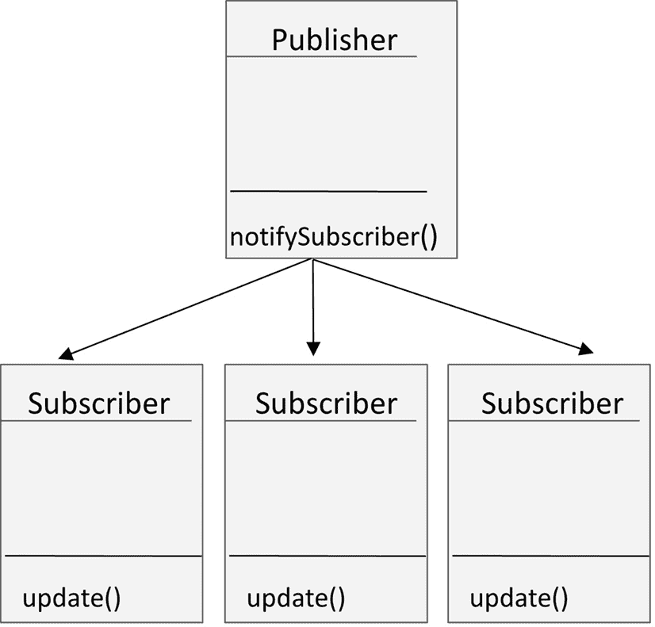
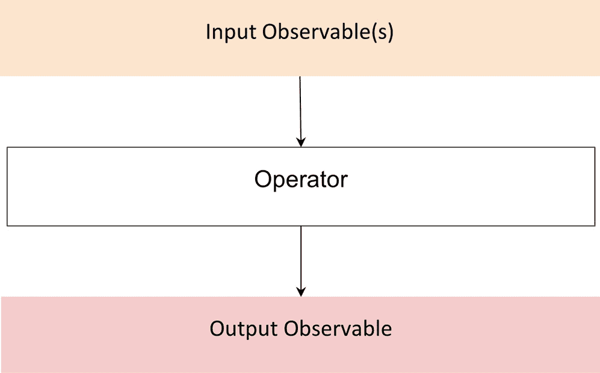
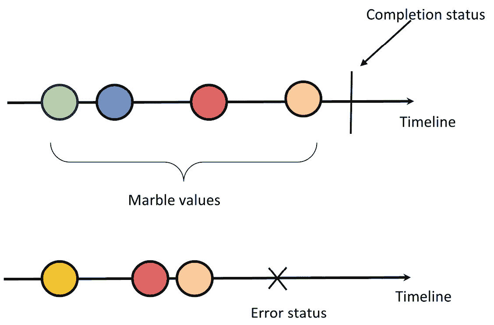
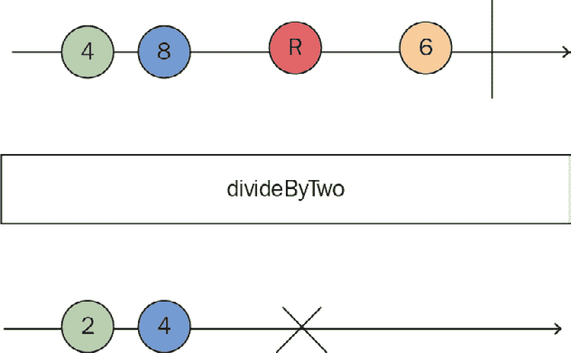

# 第一章：深入了解响应式范式

响应式模式是使用响应式编程对常见问题进行可重用解决方案。在这些模式背后是一种新的思维方式，新的架构，新的编码风格和新的工具。这正是整本书的基础——在 Angular 应用程序中有用的响应式模式。

现在，我知道您迫不及待地想写出您在 Angular 中的第一个响应式模式，但在这样做之前，为了帮助您充分利用所有 RxJS 模式和利用响应式范式，我们将首先详细解释所有基础知识，并为后续章节打下基础。

让我们从对响应式范式的初步理解开始，了解其优势以及它解决的问题。最好的是，让我们培养一种响应式思维，开始以响应式的方式思考。我们将首先强调响应式范式的支柱和优势。然后，我们将解释水珠图及其用途。最后，我们将突出 RxJS 在 Angular 中的应用。

对响应式范式的基本原理进行深入了解至关重要。这将确保您掌握基础知识，帮助您理解响应式方法的有用性，并因此帮助您确定在哪种情况下最好使用它。

在本章中，我们将涵盖以下主题：

+   探索响应式编程的支柱

+   学习水珠图（我们的秘密武器）

+   突出 RxJS 在 Angular 中的应用

# 技术要求

本章不需要任何环境设置或安装步骤。

本章中的所有代码片段只是为了说明概念，所以您不需要代码仓库来跟随。然而，如果您感兴趣，本书的代码可以在[`github.com/PacktPublishing/Reactive-Patterns-with-RxJS-and-Angular-Signals-Second-Edition`](https://github.com/PacktPublishing/Reactive-Patterns-with-RxJS-and-Angular-Signals-Second-Edition)找到。

本书假设您对 Angular 和 RxJS 有基本的了解。

备注

本书使用新的 Angular 文档网站[angular.dev](http://angular.dev)。之前的文档网站[angular.io](http://angular.io)将很快被弃用。通过此链接访问文档，以保持与最新更新和资源的联系。

# 探索响应式编程的支柱

**响应式编程**是全球开发者使用的重大编程范式之一。每种编程范式都解决了一些问题，并有其自身的优势。根据定义，响应式编程是使用异步数据流的编程，基于观察者模式。那么，让我们来谈谈响应式编程的这些支柱吧！

## 数据流

**数据流**是反应式编程的脊柱。所有可能在时间上发生变化或发生的事情（你不知道确切的时间）都表示为异步流，如事件、通知和消息。反应式编程是关于在变化发生时立即做出反应！

数据流的一个很好的例子是 UI 事件。假设我们有一个 HTML 按钮，我们希望在用户点击它时执行一个动作。在这里，我们可以将点击事件视为一个流：

```js
//HTML code
<button id='save'>Save</button>
//JS code
const saveElement = document.getElementById('save');
saveElement.addEventListener('click', processClick);
function processClick(event) {
  console.log('Hi');
}
```

如前代码片段所示，为了对点击事件做出反应，我们注册了一个`EventListener`事件。然后，每次点击发生时，都会调用`processClick`方法来执行副作用。在我们的例子中，我们只是在控制台记录`Hi`。

如你所可能收集到的，为了能够对发生的事情做出反应并执行副作用，你应该监听流以获得通知。为了更接近反应式术语，我们可以说*观察*而不是*监听*。这使我们来到了*观察者*设计模式，它是反应式编程的核心。

## 观察者模式

**观察者模式**基于两个主要角色——发布者和订阅者：

+   **发布者**维护一个订阅者列表，并在每次更新时通知他们或传播一个变化

+   另一方面，**订阅者**每次从发布者收到通知时都会执行更新或执行副作用

观察者模式在此处展示：



图 1.1 – 观察者模式

为了获得更新通知，你需要订阅发布者。一个现实世界的类比就是时事通讯；如果你不订阅它，你不会从特定的时事通讯中收到任何电子邮件。

这使我们来到了 RxJS 的构建块，包括以下内容：

+   **可观察对象**：这些是异步数据流的表示，通知观察者任何变化

+   **观察者**：这些是消费由可观察对象发出的数据流的消费者

RxJS 将观察者模式与迭代器模式和函数式编程相结合，以处理和异步事件。这是对反应式编程基础的一个提醒，知道何时实现反应式实现以及何时避免它至关重要。

通常，当你在 Angular 应用程序中处理异步任务时，总是要想到 RxJS。RxJS 相对于其他异步 API 的主要优势如下：

+   RxJS 使得处理基于事件的程序、异步数据调用和回调变得容易。

+   可观察对象保证了一致性。它们在一段时间内发出多个值，以便你可以消费连续的数据流。

+   可观察对象是懒加载的；它们在你订阅它们之前不会执行。这有助于编写清晰、高效、易于理解和维护的声明式代码。

+   Observables 可以在任何时候取消、完成和检索。这在许多实际场景中非常有意义。

+   RxJS 提供了许多具有函数式风格的操作符来操作集合和优化副作用。

+   Observables 将错误推送到订阅者，并提供了一种处理错误的干净方式。

+   RxJS 允许你编写干净且高效的代码来处理应用中的异步数据。

现在我们已经对反应式编程的支柱进行了介绍，并详细阐述了 RxJS 的主要优势，让我们来探索弹珠图，这对于理解和可视化 Observable 执行非常有用。

# 了解弹珠图（我们的秘密武器）

RxJS 随带超过一百个 **操作符** – 这些是 RxJS 的构建块之一，用于操作流。本书后面将详细介绍的所有的反应式模式都是基于操作符的，当涉及到解释操作符时，最好参考视觉表示 – 这就是弹珠图的作用所在！

**弹珠图**是操作符执行的视觉表示，本书的所有章节都将使用它来理解 RxJS 操作符的行为。一开始可能会觉得有些令人畏惧，但实际上它非常简单。你只需理解图标的解剖结构，然后你就能很好地阅读和翻译它。

弹珠图表示操作符的执行，因此每个图都将包括以下内容：

+   **输入 Observable(s)**：表示作为操作符输入的一个或多个 Observable

+   **操作符**：表示要执行的操作符及其参数

+   **输出 Observable**：表示操作符执行后产生的 Observable

我们可以在此看到执行过程的示例：



图 1.2 – 操作符执行

现在，让我们放大输入/输出 Observable 的表示：



图 1.3 – 弹珠图元素

这些图标的元素包括以下内容：

+   **时间线**：Observables 是异步流，在一段时间内产生数据。因此，在弹珠图中，时间的表示至关重要，它被表示为从左到右流动的箭头。

+   **弹珠值**：这些是 Observable 在一段时间内发出的值。它们由彩色圆圈表示。

+   **完成状态**：垂直线（|）表示 Observable 成功完成。

+   **错误状态**：**X** 代表由 Observable 发出的错误。之后既不会发出值，也不会发出表示完成的垂直线。

这就是你需要了解的所有元素。现在，让我们将这些部分组合到一个真实的弹珠图中：



图 1.4 – 自定义操作符的弹珠图示例

如你所猜，我们有一个自定义操作符叫做 `divideByTwo`，它会发出接收到的每个数字的一半。当输入的可观察对象发出值 `4` 和 `8` 时，输出的可观察对象分别产生 `2` 和 `4`。

然而，当发出非数字的 `R` 值时，则会抛出错误，表示异常终止。这种情况在操作符代码中没有处理。输入的可观察对象继续发射，然后成功完成。然而，该值永远不会被处理，因为在错误之后，流被关闭了。

到目前为止，我们已经走过了构成水滴图的全部元素。你将能够理解接下来章节中使用的操作符。现在，让我们来了解一下 RxJS 在 Angular 中的使用。

# 突出 RxJS 在 Angular 中的使用

在 Angular 中，RxJS 几乎是一个一等公民。它是 Angular 生态系统的一部分，并被用于许多功能来处理异步任务。以下是一些这些功能的例子：

+   HttpClient 模块

+   路由模块

+   响应式表单

+   事件发射器

我们将在接下来的小节中讨论以下每个概念。

注意

我们建议快速浏览一下 [`angular.dev/overview`](https://angular.dev/overview)，在那里你可以找到关于上述功能的更多详细信息。

## HttpClient 模块

你可能熟悉 Angular 提供的 HttpClient API，该 API 用于通过 HTTP 协议与服务器通信。`HttpClient` 服务基于可观察对象来管理所有事务，这意味着调用 API 方法（如 `GET`、`PATCH`、`POST` 和 `PUT`）的结果将是一个可观察对象。

在下面的代码片段中，我们有一个 Angular 服务的例子，它注入了 `HttpClient` 服务，并使用 `HttpClient.get()` 方法从服务器获取数据：

```js
import { Injectable } from '@angular/core';
import { HttpClient } from '@angular/common/http';
import { Observable} from 'rxjs';
import { Recipe } from '../model/recipe.model';
@Injectable()
export class RecipesService {
constructor(private http: HttpClient) { }
getRecipes(): Observable<Recipe[]> {
return this.http.get<Recipe[]>(`api/recipes/`);
}
}
```

`getRecipes()` 方法 – 或者更准确地说，对 ``this.http.get<Recipe>(`api/recipes/`)`` 的调用 – 返回一个可观察对象，你应该订阅它以向服务器发送 `GET` 请求。请注意，这是一个 HTTP 事务的例子，并且对于 API 中可用的所有其他 HTTP 方法（`POST`、`PUT`、`PATCH` 等）都是相同的。

注意

代码中包含对 `recipe.model` 和 `getRecipes()` 的引用 – 在 *第二章**，漫步我们的应用程序* 中，你将介绍我们将在本书的其余部分工作的 Recipe 应用程序。

对于熟悉基于 Promise 的 HTTP API 的人来说，你可能想知道在这个上下文中使用可观测量的优势。对于那些不熟悉 Promise 的人来说，**Promise**是表示异步操作最终完成（或失败）及其结果的 JavaScript 对象。它们提供了一种比传统基于回调的方法更干净、更有结构化的方式来处理异步代码。然而，使用可观测量而不是 Promise 有很多优势，其中最重要的如下：

+   可观测量是可以取消的，因此你可以通过调用取消订阅方法在任何时候取消 HTTP 请求

+   当发生错误或抛出异常时，你也可以重试 HTTP 请求

可观测量不能修改服务器的响应，尽管在 Promise 上链式调用`then()`可能会出现这种情况。

## 路由模块

在`@angular/router`包中可用的路由模块在路由事件和激活路由中使用可观测量。我们在这里将查看这两个方面。

### 路由事件

路由事件允许你拦截导航生命周期。它们在路由器中定义为可观测量。

注意

我们建议快速查看[`angular.dev/api/router/Event`](https://angular.dev/api/router/Event)，在那里你可以找到有关路由事件的更多详细信息。

大多数 Angular 应用程序都有一个路由机制。路由事件随时间频繁变化，因此监听这些变化以执行副作用是有意义的。这就是为什么可观测量是处理这些流的一种灵活方式。

要拦截路由器经过的所有事件，首先，你应该注入`Router`服务，它提供 URL 操作能力。然后，订阅`Router`对象中可用的事件可观测量，并使用 RxJS 过滤操作符过滤出`RouterEvent`类型的事件。

以下是一个 Angular 服务的示例，它在构造函数中注入路由器，订阅路由事件，并在控制台中跟踪事件 ID 和路径：

```js
import { Injectable } from '@angular/core';
import { Router, RouterEvent } from '@angular/router';
import { filter } from 'rxjs/operators';
@Injectable()
export class CustomRouteService {
  constructor(public router: Router) {
    this.router.events.pipe(
      filter(event => event instanceof RouterEvent)
    ).subscribe((event: RouterEvent) => {
      console.log(`The current event is : ${event.id} |
        event.url`);
    });
  }
}
```

这是一个非常基础的示例，你几乎可以引入任何特定的行为。

### 激活路由

`ActivatedRoute`是一个可以将路由器注入到你的组件中以检索有关路由路径和参数信息的路由服务。许多属性基于可观测量。在这里，你可以找到`ActivatedRoute`类的实现：

```js
class ActivatedRoute {
  snapshot: ActivatedRouteSnapshot
  url: Observable<UrlSegment[]>
  params: Observable<Params>
  queryParams: Observable<Params>
  fragment: Observable<string | null>
  data: Observable<Data>
  outlet: string
  component: Type<any> | string | null
  routeConfig: Route | null
  root: ActivatedRoute
  parent: ActivatedRoute | null
  firstChild: ActivatedRoute | null
  children: ActivatedRoute[]
  pathFromRoot: ActivatedRoute[]
  paramMap: Observable<ParamMap>
  queryParamMap: Observable<ParamMap>
  toString(): string
}
```

如你所想，`url`、`params`、`queryParams`、`fragment`、`data`、`paramMap`和`queryParamMap`都表示为可观测量。所有这些参数可能会随时间变化，因此监听这些变化以注册副作用或更新值是有意义的。

以下是一个 Angular 组件的示例，它在构造函数中注入`ActivatedRoute`类，然后在`ngOnInit()`方法中订阅以下属性：

+   `ActivatedRoute`的`url`属性，以便在控制台记录当前 URL

+   `ActivatedRoute` 的 `queryParams` 属性，用于检索 `criteria` 参数并将其存储在名为 `criteria` 的本地属性中：

```js
import { Component, OnInit } from '@angular/core';
import { ActivatedRoute } from '@angular/router';
@Component({
  selector: 'app-recipes',
  templateUrl: './recipes.component.html'
})
export class RecipesComponent implements OnInit {
  criteria: string;
  constructor(private activatedRoute: ActivatedRoute) { }
  ngOnInit() {
    this.activatedRoute.url
      .subscribe(url => console.log('The URL changed to: '
        + url));
    this.activatedRoute.queryParams.subscribe(params => {
      this.processCriteria(params.criteria);
    });
  }
  processCriteria(criteria: string) {
    this.criteria = criteria;
  }
}
```

本例展示了 `url` 和 `queryParams` 属性的使用。为了全面了解所有 `ActivatedRoute` 属性及其功能，我鼓励您访问 Angular 文档页面 [`angular.dev/api/router/ActivatedRoute#properties`](https://angular.dev/api/router/ActivatedRoute#properties)。

## 反应式表单

在 `@angular/forms` 包下可用的反应式表单基于 Observables 来跟踪表单控件的变化。以下是 Angular 中 `FormControl` 类的概述：

```js
class FormControl extends AbstractControl {
//other properties here
valueChanges: Observable<any>
statusChanges: Observable<any>
}
```

`FormControl` 的 `valueChanges` 和 `statusChanges` 属性表示为触发更改事件的 Observables。订阅 `FormControl` 的值变化是触发 `component` 类中应用逻辑的一种方式。

以下是一个示例，它订阅了名为 `rating` 的 `FormControl` 属性的 `valueChanges` Observable，并简单地通过 `console.log(value)` 跟踪值：

```js
import { Component, OnInit } from '@angular/core';
import { FormGroup } from '@angular/forms';
@Component({ ...})
export class MyComponent implements OnInit {
  form!: FormGroup;
  ngOnInit() {
    const ratingControl = this.form.get('rating');
    ratingControl?.valueChanges.subscribe(
      (value) => {
        console.log(value);
      }
    );
  }
}
```

这样，您将获得作为输出的更改值。

## 事件发射器

事件发射器，它是 `@angular/core` 包的一部分，用于通过 `@Output()` 装饰器从子组件向父组件发射数据。`EventEmitter` 类扩展了 RxJS subject 并为该实例发射的事件注册了处理程序：

```js
class EventEmitter<T> extends Subject {
  constructor(isAsync?: boolean): EventEmitter<T>
  emit(value?: T): void
  subscribe(next?: (value: T) => void, error?: (error: any)
    => void, complete?: () => void): Subscription
}
```

当你创建事件发射器并发射一个值时，幕后发生的事情就是这样。

以下代码块是一个示例，展示了如何发射食谱评分的更新值：

```js
import { Component, Output } from '@angular/core';
import { EventEmitter } from 'events';
@Component({ ...})
export class RecipesComponent {
  constructor() {}
  @Output() updateRating = new EventEmitter();
  updateRecipe(value: string) {
    this.updateRating.emit(value);
  }
}
```

因此，`EventEmitter` 通过允许一个组件发射自定义事件，另一个组件监听并响应这些事件，从而平滑了组件之间的通信。这种机制在实现父子组件通信、兄弟组件通信，甚至在 Angular 应用程序中实现无关组件之间的通信中起着至关重要的作用。

注意

在之前的代码片段中，为了演示目的，显式地订阅了 Observables。在现实世界的例子中，如果我们想显式地订阅，我们应该包括取消订阅的逻辑。我们将在 *第三章*，*作为流获取数据* 中详细说明。

# 摘要

在本章中，我们向您介绍了反应式编程的基础以及它在哪些用例中表现出色。然后，我们解释了将作为我们解释所有后续章节中 RxJS 操作符参考的宝石图。最后，我们通过具体示例、实现和优势，突出了在 Angular 中使用反应式编程。

现在我们已经掌握了基础知识，是时候开始准备和解释了，在下一章中，我们将构建整个本书中的应用程序，我们将逐步实现我们将学习的所有反应式模式。
