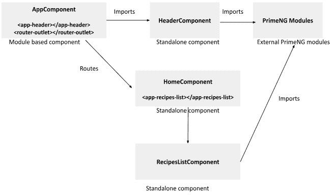
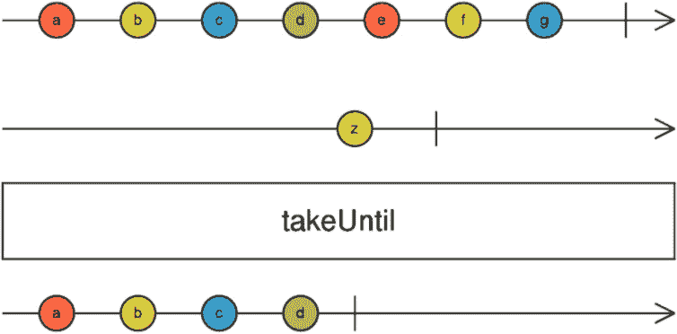
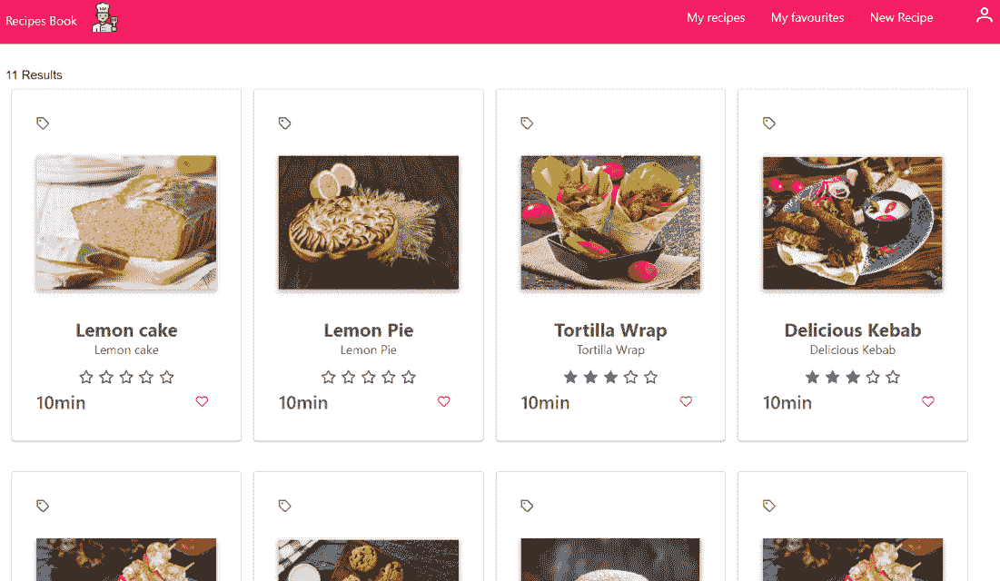

# 3

# 将数据作为流获取

您管理应用程序数据的方式对 UI 性能和用户体验有巨大影响。在我看来，如今，出色的用户体验和性能 UI 不再是可选的——它们是用户满意度的重要决定因素。此外，高效地管理数据可以优化代码并提高其质量，从而降低维护和改进成本。

那么，我们如何有效地管理我们的数据呢？这正是我们将在以下章节中回答的问题。有几个响应式模式在许多用例中都很有用，我们将从探索用于显示从 REST 端点接收到的最基本响应式模式开始，以便用户可以阅读和与之交互。

首先，我们将解释在食谱应用程序中将要实现的需求。然后，我们将介绍用于检索数据的经典模式，接着介绍您可以使用来管理取消订阅及其周围所有重要技术概念的多种方法。我们还将了解 Angular 14+的新特性——独立组件。在此之后，我们将解释用于获取数据的响应式模式，并强调响应式模式相对于经典模式的优点。最后，我们将了解 Angular 17 中引入的新内置控制流。

因此，在本章中，我们将涵盖以下主要主题：

+   定义数据获取需求

+   探索用于获取数据的经典模式

+   探索用于获取数据的响应式模式

+   突出响应式模式的优点

+   深入了解 Angular 17 中的内置控制流

# 技术要求

本章假设您已经对 HttpClient、Angular 组件、Angular 模块和路由有基本的了解。

我们将使用使用 JSON Server 构建的模拟 REST API 后端，它允许您启动一个具有完整工作 API 的 REST API 服务器。我们不会学习如何使用 JSON Server，但如果您有兴趣了解更多信息，您可以在[`github.com/typicode/json-server`](https://github.com/typicode/json-server)找到更多信息。

您可以在 GitHub 仓库中找到本章的项目源代码，网址为[`github.com/PacktPublishing/Reactive-Patterns-with-RxJS-and-Angular-Signals-Second-Edition/tree/main/Chap03`](https://github.com/PacktPublishing/Reactive-Patterns-with-RxJS-and-Angular-Signals-Second-Edition/tree/main/Chap03)。

该项目由两个文件夹组成：

+   `recipes-book-api`：这包含已设置好的模拟 RESTful 服务器。

+   `recipes-book-front`：这包含使用 Angular 17 和 RxJS 7 构建的前端应用程序。作为第三方依赖项，我们添加了`bootstrap`和`primeng`库，以帮助我们快速构建美观的 UI 组件。请参阅上一章的*技术要求*部分以获取环境和依赖项设置。

该项目符合标准的 Angular 风格指南，可在 [`angular.dev/style-guide#`](https://angular.dev/style-guide#) 找到。

第一次运行应用程序时，您需要先安装依赖项。您只需在 `recipes-book-api` 和 `recipes-book-front` 文件夹中运行 `npm i` 命令。

依赖项安装完成后，您需要在 `recipes-book-api` 文件夹中运行以下命令来启动服务器：

```js
npm run server: start
```

服务器将在 `http://localhost:8081` 上运行。

然后，在 `recipes-book-front` 文件夹中运行以下命令来启动前端：

```js
ng serve --proxy-config proxy.config.json
```

您可以在 [`angular.dev/tools/cli/serve#proxying-to-a-backend-server`](https://angular.dev/tools/cli/serve#proxying-to-a-backend-server) 阅读有关 `--proxy-config` 参数的更多信息。

# 定义数据获取需求

首先，让我们定义我们将以响应式方式实现的要求。我们希望在主页上显示从模拟后端检索到的菜谱列表，逐步构建在 *第二章* 的 *视图一 – 登录页面* 部分中详细说明的用户故事：


图 3.1 – 登录页面视图

要做到这一点，我们需要事先获取菜谱列表以将其作为卡片显示给用户，对吧？因此，菜谱列表代表我们首先需要请求的第一份数据，它可以通过以下端点在我们的 `recipes-book-api` 服务器上找到：

```js
GET /api/recipes
```

请不要忘记按照 *技术要求* 部分中的详细说明启动服务器。一旦服务器启动，您可以在 `http://localhost:8081/api/recipes` 检查获取 API 的结果。

在以下章节中，我们将了解如何以经典和响应式风格实现获取数据的需求，以便理解它们之间的基本差异，并看到响应式编程相对于命令式编程带来的好处。

# 探索获取数据的经典模式

让我们先看看获取菜谱列表的经典模式的实现。

## 定义您数据结构

首先，我们需要定义我们数据的结构，以便我们可以对其进行强类型化。这将使我们能够利用 TypeScript 的类型检查功能，并在早期捕获类型错误。

我们可以使用 Angular CLI 生成 `src/app/` `core/model` 文件夹：

```js
$ ng g i Recipe
```

为了遵循惯例，我们将生成的文件名从 `recipe.ts` 更改为 `recipe.model.ts`。然后，我们将使用 `Recipe` 的具体属性填充接口，如下所示：

```js
export interface Recipe {
id: number;
title: string;
ingredients: string;
tags?: string;
imageUrl: string;
cookingTime?: number;
prepTime?: number;
yield: number;
steps?: string;
rating:number;
}
```

我们将逐个输入我们将要使用的菜谱的属性，然后是每个属性的类型。每个属性的描述在 *第二章* 的 *视图二 – 新菜谱界面* 部分中详细说明，*漫步* *我们的应用程序*。

对于可选属性，我们在声明接口时在属性类型注释之前放置一个问号（`?`），以告诉 TypeScript 该属性是可选的。

## 创建获取数据服务

下一步是创建一个名为`RecipesService`的 Angular 服务，该服务将负责管理所有与食谱相关的操作。该服务将封装**创建、读取、更新和删除**（**CRUD**）操作，并将它们提供给各种 UI 组件。在本章中，我们只实现读取（获取）操作。

那么，我们为什么要创建一个服务呢？嗯，我们这样做是为了增加模块化并确保服务在其他组件中的可重用性。

要在`core/services`文件夹下生成服务，我们可以在`core/services`文件夹下执行`ng g s`命令，如下所示：

```js
$ ng g s Recipes
```

现在服务已成功生成，让我们创建并实现一个负责获取数据的函数。我们将在`RecipesService`中注入`HttpClient`并定义一个获取数据的方法。该服务将如下所示：

```js
import { Injectable } from '@angular/core';
import { HttpClient } from '@angular/common/http';
import { Observable } from 'rxjs';
import { Recipe } from '../model/recipe.model';
import { environment } from 'src/environments/environment';
const BASE_PATH = environment.basePath
@Injectable({
providedIn: 'root'
})
export class RecipesService {
constructor(private http: HttpClient) { }
getRecipes(): Observable<Recipe[]> {
return this.http.get<Recipe[]>(`${BASE_PATH}/recipes`);
}
}
```

让我们分析一下`RecipesService`级别的操作。这并不复杂——我们有一个`getRecipes()`方法，它通过 HTTP 获取食谱列表并返回一个强类型 HTTP 响应：`Observable<Recipe[]>`。这个 Observable 代表了当你发出 HTTP GET 请求时将创建的数据流。当你订阅它时，它将作为 JSON 数组发出食谱列表，然后完成。因此，这个 HTTP 请求所代表的流将在发出响应数据后完成。

作为最佳实践，我们在`environment.ts`文件中外部化了`BASE_PATH`，因为在许多情况下，服务器的基路径取决于环境（如测试或生产）。这样，在单个位置更新路径比在所有使用它的服务中更新路径要容易得多。

注意

从 Angular 15 开始，环境文件不再默认提供。然而，你可以选择在需要时通过执行`$ ng g environments`来生成它们。

我们还在构造函数中注入了`HttpClient`依赖项，如下所示：

```js
constructor(private http: HttpClient) { }
```

这种技术被称为**构造函数注入**。Angular 内置的依赖注入系统将在创建组件或服务实例时自动提供注入的依赖项。

此外，从版本 14 开始，Angular 的依赖注入系统提供了`inject()`实用函数。这允许你手动解决和检索组件或服务中的依赖项，如下所示：

```js
private http= inject(HttpClient);
```

当你需要动态解决依赖项或根据运行时条件执行条件依赖注入时，这种方法很有用。

我们将在整本书中使用构造函数注入技术。但是，如果你希望采用更新的方法，你有灵活性这样做。

## 创建 Angular 独立组件

现在，我们应该在 `src/app/recipe-list` 下创建负责显示食谱列表的组件，名为 `RecipesListComponent`。在此之前，让我们先停下来，解释一下在 Angular 14 中引入的一种非常有趣的新类型组件：独立组件。

根据定义，`NgModule` 可以被其他独立组件或基于模块的组件使用。

在 Angular 14 之前，我们只有一种创建组件的方法：

```js
  $ ng g c recipesList
```

此命令将创建一个名为 `RecipesListComponent` 的组件并将其添加到 `NgModule` 中。那么是哪个模块呢？如果您在命令行中指定了 `--module`，后跟您的模块路径，那么 CLI 将将组件添加到该特定模块中。如果没有设置 `--module` 选项，CLI 将检查同一目录中是否有模块；如果没有，它将在最近的父目录中检查。如果这两种选项都不适用，它将在组件相同的目录中生成一个新的模块文件，并在该新模块中声明组件。

简而言之，CLI 总是将组件关联到模块，并将其添加到模块的声明数组中；否则，您将遇到编译错误。

然而，从 Angular 14 开始，您可以通过在命令行中提及 `--standalone` 标志来决定创建不属于任何 `NgModule` 的独立组件：

```js
  $ ng g c recipesList --standalone
```

在我们的项目中使用此方法，`RecipesListComponent` 不会被添加到 `NgModule` 中，并且将在 `@Component` 装饰器内部以及 `imports` 属性中包含 `standalone: true` 标志：

```js
@Component({
  selector: 'app-recipes-list',
  standalone: true,
  imports: [],
  templateUrl: './recipes-list.component.html',
  styleUrls: ['./recipes-list.component.scss'],
})
```

如果独立组件依赖于其他组件，无论是基于模块的还是独立的，您应该在 `imports` 数组中提及这些组件；否则，您将遇到编译错误。

独立组件也可以被基于模块的组件或其他独立组件使用。此外，它们可以在加载路由和懒加载时使用。还值得注意的是，您还可以创建独立的指令和独立的管道。

到目前为止，一切顺利！现在，为什么你应该关心呢？有几个很好的理由我们应该在我们的项目中采用独立组件：

+   代码更少意味着更少的样板代码要编写，因此构建时间更快，代码组织、测试和可维护性也更好。

+   由于独立组件的依赖关系直接在 `imports` 属性中提及，因此更容易理解组件的依赖关系。对于基于模块的组件，您将不得不扫描您的组件代码，然后检查该模块的所有组件共享的模块依赖关系。

+   独立组件的力量在于它们的隔离和自包含特性。您只需导入组件所需的内容，而基于模块的组件有时会导入同一模块中其他组件使用的无用依赖项。

    假设我们有一个模块“M”，它导入了“A”、“B”和“C”组件以及“S1”、“S2”和“S3”服务，并且我们有一个不属于该模块但依赖于组件“B”的“D”组件。由于“B”是一个基于模块的组件，因此“D”应该导入整个模块“M”；这会导致不必要的依赖，因为“D”不需要组件“A”和“B”或服务“S1”和“S2”。因此，集成独立组件使我们能够仅导入所需的组件和服务，因为独立组件是自包含的，并且有自己的依赖关系和逻辑集合。因此，它消除了冗余代码，导致应用程序更加优化。

+   这使得初学 Angular 开发者的学习曲线不那么陡峭。

我们将在我们的食谱应用中使用独立组件，以采用模块化和自包含的方法。我们只保留应用程序组件作为基于模块的组件，尽管我们可以使用独立组件启动应用程序。以下是一个表示我们的组件依赖关系的方案：



图 3.2 – 食谱应用组件的依赖关系

父组件 `AppComponent` 是一个基于模块的组件，它在 `AppModule` 的导入声明中导入了 `HeaderComponent` 独立组件。`HeaderComponent` 使用一些 PrimeNG 外部依赖，因此需要在组件的导入声明中导入。

`HomeComponent` 是一个独立组件，它将通过 `AppComponent` 进行路由。`HomeComponent` 在组件的导入声明中导入了 `RecipesListComponent` 独立组件。后者使用一些 PrimeNG 外部依赖，因此需要在组件的导入声明中导入。所有代码都可在 GitHub 仓库中找到。

注意

关于独立组件的更多信息，你可以查看 [`angular.dev/reference/migrations/standalone`](https://angular.dev/reference/migrations/standalone)

希望独立组件的概念已经清楚，那么让我们继续下一步。

## 在你的组件中注入和订阅服务

在本节中，我们将 `RecipesService` 服务注入到 `RecipesListComponent` 组件中，并在 `ngOnInit()`（组件初始化时）调用 `getRecipes()` 方法。我们还将对 API 服务器执行读取操作。

为了获取发出的数据，我们需要订阅 `getRecipes()` 方法返回的 Observable。然后，我们将数据绑定到我们在组件中创建的本地数组属性，称为 `recipes`。组件的代码将如下所示：

```js
import { Component, OnInit } from '@angular/core';
import { Observable } from 'rxjs';
import { Recipe } from '../core/model/recipe';
import { RecipesService } from '../core/services/recipes.
Service';
@Component({
selector: 'app-recipes-list',
standalone: true,
imports: [CommonModule],
templateUrl: './recipes-list.component.html',
styleUrls: ['./recipes-list.component.scss']
})
export class RecipesListComponent implements OnInit {
recipes!: Recipe[];
constructor(private service: RecipesService) { }
ngOnInit(): void {
this.service.getRecipes().subscribe(result => {
this.recipes = result;
});
}
}
```

现在我们已经检索了数据并将其存储在本地属性中，让我们看看我们如何在 UI 中显示它。

## 在模板中显示数据

现在我们可以使用组件中可用的`recipes`属性在我们的 HTML 模板中显示食谱列表。在我们的案例中，我们使用`DataView` PrimeNG 组件以网格布局显示食谱列表作为卡片（有关此组件的更多详细信息，请参阅[`primeng.org/dataview`](https://primeng.org/dataview)）。

当然，我们的目标是关注模板代码之外的数据操作。正如您在下面的示例中可以看到的，我们将`recipes`数组传递给了数据视图组件的`value`输入（如果您不想包含第三方依赖项，您也可以使用结构化指令以纯 HTML 渲染数据视图组件）：

```js
<div class="card">
<p-dataView #dv [value]="recipes" [paginator]="true"
[rows]="9"    filterBy="name" layout="grid">
/** Extra code here **/
</p-dataView>
</div>
```

这是收集数据的基本模式，您在开始学习 Angular 时就已经发现了，所以您可能之前已经见过类似的东西。

现在只剩下一点——您应该处理 Observable 的取消订阅，因为这段代码手动管理订阅。否则，组件被销毁后，`Observable`的订阅将保持活跃状态，内存引用将不会被释放，导致内存泄漏。这就是为什么您在 Angular 组件内部手动订阅 Observable 时应该始终小心。

注意

虽然在服务器请求响应或超时后`HttpClient`的 Observable 会自动取消订阅，但我们仍将演示如何处理它们的取消订阅以确保我们的实现并展示最佳实践。这还将作为处理其他 Observable 取消订阅的展示。

## 管理取消订阅

管理取消订阅有两种常用的方法：强制性模式和声明性响应模式。让我们详细看看这两种模式。

### 强制性取消订阅管理

强制性取消订阅意味着我们手动调用我们自行管理的订阅对象的`unsubscribe()`方法。以下代码片段说明了这一点：

```js
export class RecipesListComponent implements OnInit,
OnDestroy {
  recipes!: Recipe[];
  subscription: Subscription;
  constructor(private service: RecipesService) { }
ngOnInit(): void {
  this.subscription=this.service.getRecipes()
  .subscribe(result => {
    this.recipes = result;
});
}
ngOnDestroy(): void {
  this.subscription?.unsubscribe();
}
```

在这里，我们只是将订阅存储在一个名为`subscription`的变量中，并在`ngOnDestroy()`生命周期钩子中取消订阅。

这可以正常工作，但并不是一个推荐的模式。有一个更好的方法，利用 RxJS 的力量。

### 声明性取消订阅管理

第二种取消订阅的方法更为简洁且声明性更强，使用了 RxJS 的`takeUntil`操作符。然而，在我们深入探讨这个模式之前，让我们通过以下宝石图来了解`takeUntil`的作用：



图 3.3 – takeUntil 宝石图

`takeUntil()`操作符从源可观察对象（第一个时间轴）发出值，直到输入的可观察对象通知器（第二个时间轴）发出一个值。在那个时刻，`takeUntil()`将停止发出值并完成。在油管图中，源可观察对象发出了`a`、`b`、`c`和`d`的值——所以`takeUntil()`将分别发出它们。之后，可观察对象通知器发出`z`，然后`takeUntil()`将停止发出值并完成。

在我们的应用程序中，`takeUntil`操作符将帮助我们保持订阅在我们定义的期间活跃。我们希望它能在组件被销毁时保持活跃，所以我们将创建一个 RxJS 主题，当组件被销毁时它会发出一个值。然后，我们将这个主题传递给`takeUntil`作为输入：

```js
export class RecipesListComponent implements OnInit,
OnDestroy {
  recipes!: Recipe[];
  destroy$ = new Subject<void>();
  constructor(private service: RecipesService) { }
ngOnInit(): void {
  this.service.getRecipes().pipe(
    takeUntil(this.destroy$)).
    subscribe(result => {
    this.recipes = result;
  });
}
ngOnDestroy(): void {
  this.destroy$.next();
  this.destroy$.complete();
}
}
```

注意

`$`符号是一个非正式约定，用来表示变量是一个可观察对象。

你可能首先注意到的是，这比第一种方法代码更少。此外，当我们对一个返回的订阅对象（第一种方式）调用`unsubscribe()`时，我们无法得到取消订阅发生的通知。然而，使用`takeUntil()`，我们将通过完成处理程序得到可观察对象完成的通告。

值得注意的是，这个实现可以通过使用 Angular 16 中引入的`takeUntilDestroyed`操作符进一步优化。这个操作符简化了 Angular 组件和指令中的可观察对象订阅管理。它会在关联的组件或指令被销毁时自动完成订阅，从而消除了在`ngOnDestroy`生命周期钩子中进行手动清理的需要。

你只需要按照以下方式从`@angular/core/rxjs-interop`包中导入`takeUntilDestroyed`操作符：

```js
import { takeUntilDestroyed } from '@angular/core/rxjs-interop';
```

然后，我们在订阅的管道操作符中使用这个操作符。使用`takeUntilDestroyed`之后，之前的代码将如下所示：

```js
export class RecipesListComponent {
  recipes!: Recipe[];
  constructor(private service: RecipesService) {
    this.service.getRecipes().pipe(takeUntilDestroyed())
      .subscribe(result=>this.recipes = result);
  }
}
```

正如你所见，`ngOnDestroy`生命周期钩子中的手动清理代码以及`destroy$`主题已被移除，从而使得组件实现更加简洁易读。

`takeUntilDestroyed()`操作符将在`RecipesListComponent`被销毁时自动处理订阅清理。

除了`takeUntil`和`takeUntilDestroyed`操作符之外，还有其他操作符可以以更反应式的方式为你管理取消订阅。以下是一些示例：

+   `take(X)`: 这会发出*x*个值然后完成（将不再发出值）。例如，`take(3)`将从给定的可观察对象中发出三个值然后完成。然而，请注意，如果你的网络速度慢，并且*x*次发出没有发生，那么你必须手动取消订阅。

+   `first()`: 这会发出第一个值然后完成。

+   `last()`: 这会发出最后一个值然后完成。

这是我们作为初学者都学过的经典模式，并且对于获取数据来说是一个相对有效的方法。总结一下，以下图表描述了我们走过的所有步骤：


图 3.4 – 经典模式工作流程

然而，我们还可以使用另一种模式，它更加声明性和响应性，并且具有许多优点。我们将在下一部分发现它！

# 探索用于获取数据的响应式模式

这种响应式模式背后的想法是在整个应用程序中保持并使用可观察对象作为流。别担心——当你探索这一部分时，这会对你更加明显。让我们开始吧。

## 以流的形式检索数据

要开始使用响应式模式，我们不是定义一个方法来检索我们的数据，而是在我们的服务中声明一个变量：

```js
import { Injectable } from '@angular/core';
import { HttpClient } from '@angular/common/http';
import { Recipe } from '../model/recipe';
import { environment } from 'src/environments/environment';
const BASE_PATH = environment.basePath
@Injectable({
providedIn: 'root'
})
export class RecipesService {
recipes$ = this.http.get<Recipe[]>(
`${BASE_PATH}/recipes`);
constructor(private http: HttpClient) { }
}
```

在这里，我们声明`recipes$`变量作为 HTTP GET 的结果，它要么是一个可观察对象，要么是数据流。想象一下，随着时间的推移而改变的数据的每一部分都是一个流，并在单独的服务中将它声明为一个可观察对象。这将使它在整个应用程序中可访问，并给我们更多的灵活性，以便在应用程序的不同部分中操作它。

## 在你的组件中定义流

现在，在`RecipesListComponent`中，我们将做与经典模式相同的事情——那就是，声明一个变量来持有从我们的服务返回的流。然而，这次，变量是我们创建在`RecipesService`中的可观察对象：

```js
import { Component, OnDestroy, OnInit } from '@angular/core';
import { RecipesService } from '../core/services/recipes.
Service';
@Component({
selector: 'app-recipes-list',
standalone: true,
imports: [CommonModule],
templateUrl: './recipes-list.component.html',
styleUrls: ['./recipes-list.component.css']
})
export class RecipesListComponent implements OnInit {
recipes$= this.service.recipes$;
constructor(private service: RecipesService) { }
}
```

但是等等！我们需要订阅以获取发出的数据，对吧？这是绝对正确的。让我们看看我们将如何做到这一点。

## 在你的模板中使用异步管道

对于这个模式，我们不会手动订阅，而是使用一种更好的方式，即异步管道。异步管道使得从可观察对象中渲染值变得更容易。

首先，它会自动订阅输入的可观察对象。然后，它返回最新的发出的值。最好的是，当组件被销毁时，它会自动取消订阅，以避免任何潜在的内存泄漏。这意味着当组件被销毁时，不需要手动清理任何订阅。这真是太棒了！

因此，在模板中，我们使用异步管道绑定到一个可观察对象。由于`recipes`描述了值被发出的数组变量，我们可以在模板中如下使用它：

```js
<div *ngIf="recipes$ |async as recipes" class="card">
<p-dataView #dv [value]="recipes" [paginator]="true"
[rows]="9"    filterBy="name" layout="grid">
/** Extra code here **/
</p-dataView>
</div>
```

如你所注意到的，`<div>`元素包含一个`*ngIf`结构指令。这个指令根据`recipes$ | async`表达式的真值条件性地渲染其子元素。

`recipes$ | async`表达式订阅了`recipes$`可观察对象，并在可观察对象发出值时异步渲染`<div>`元素的子元素（在我们的例子中是`DataView`组件）。它还会在元素从**DOM**（**文档对象模型**）中移除时取消订阅并清理订阅。

`*ngIf` 指令后面跟着 `as recipes`，这会将 Observable 发射的值赋给局部的 `recipes` 变量。这使得我们可以在 `<div>` 元素及其子元素的作用域内使用 `recipes` 变量来访问发射的值。

通过使用异步管道，我们不需要 `ngOnInit` 生命周期钩子，因为我们不会在 `ngOnInit()` 中订阅 `Observable` 通知器，也不会在 `ngOnDestroy()` 中取消订阅，就像我们在经典模式中所做的那样。相反，我们只需在我们的组件中设置一个本地属性，我们就准备好了——我们不需要自己处理订阅和取消订阅！

注意

HTML 模板的完整代码可在 GitHub 仓库中找到。

总结这种模式，以下图表描述了我们走过的所有步骤：


图 3.5 – 响应式模式工作流程

现在我们已经解释了响应式模式在实际中的应用，在下一节中，让我们回顾其优点。

# 突出显示响应式模式的优点

我想你可能已经猜到了响应式模式的第一大优点——我们不必手动管理订阅和取消订阅，多么令人欣慰——但还有很多其他的优点。让我们更详细地看看其他优点。

## 使用声明式方法

让我们来看看为什么我们不显式使用 `subscribe()` 方法。`subscribe()` 有什么问题？嗯，在组件内部订阅流意味着我们允许命令式代码泄漏到我们的函数式和响应式代码中。使用 RxJS Observables 并不能使我们的代码系统性地变得响应式和声明式。

但“声明式”究竟是什么意思呢？嗯，首先，我们将确定一些关键术语。然后，让我们从这里开始迭代：

+   **纯函数**是一个函数，无论被调用多少次，对于相同的输入总是返回相同的输出。换句话说，该函数总是可预测地产生相同的输出。

+   **声明式**指的是使用声明的函数来执行操作。你依赖于可以定义事件流的纯函数。在 RxJS 中，你可以以 Observables 和操作符的形式看到这一点。

那么，为什么你应该关心呢？好吧，你应该关心，因为使用 RxJS 操作符和 Observables 的声明式方法有很多优点，具体如下：

+   它使你的代码更简洁、更易读。

+   它使你的代码更容易测试，因为它具有可预测性。

+   它使你能够根据一定的输入缓存流输出，这将提高性能。我们将在*第七章* *Angular 组件间共享数据*、*第九章* *揭秘多播*和*第十章* *使用响应式缓存提升性能*中更详细地探讨这一点。

+   它使你能够利用 RxJS 运算符，转换和组合来自不同服务或甚至同一服务中的流。这就是我们将在*第五章*“组合流”和*第六章*“转换流”中看到的内容。

+   它可以帮助你轻松响应用户交互以执行操作。

因此，更声明式的意味着更具反应性。然而，请注意。这并不意味着你永远不能调用`subscribe()`方法。在某些情况下，触发`Observable`通知器是不可避免的。但试着问问自己：我真的需要在这里订阅吗？我能否通过组合多个流或使用 RxJS 运算符来实现所需的功能，而不需要订阅？除了不可避免的情况外，永远不要使用`subscribe()`。

现在，让我们转向变更检测概念，看看它如何提高性能。

## 使用 OnPush 变更检测策略

另一件非常酷的事情是，我们可以使用`changeDetection`策略，`OnPush`。

**变更检测**是 Angular 最强大的功能之一。它涉及检测组件数据何时发生变化，然后自动重新渲染视图或更新 DOM 以反映这种变化。默认策略“始终检查”意味着，每当任何数据被修改或更改时，Angular 都会运行变更检测器来更新 DOM。因此，直到明确停用，它是自动的。

在`OnPush`策略中，Angular 只有在以下情况之一发生时才会运行变更检测器：

+   *条件 1*：组件的`@Input`属性引用发生变化（请注意，当直接修改输入属性对象时，对象的引用不会改变，因此变更检测器不会运行。在这种情况下，我们应该返回属性对象的新引用以触发变更检测）。

+   *条件 2*：组件事件处理程序被触发或发出。

+   *条件 3*：通过异步管道绑定的 Observable 发出新值。

因此，使用`ChangeDetection`的`OnPush`策略可以最小化任何变更检测周期，并且只有在上述情况下才会检查更改以重新渲染我们的组件。此策略适用于所有子指令，并且不能被覆盖。

在我们的场景中，我们只需要在获取新值时运行变更检测器；否则，我们会得到无用的更新。因此，我们的场景符合*条件 3*。好消息是，我们可以使用变更检测的`onPush`策略，如下所示：

```js
import { ChangeDetectionStrategy, Component} from
'@angular/ core';
@Component({
  selector: 'app-recipes-list',
  standalone: true,
  imports: [CommonModule],
  templateUrl: './recipes-list.component.html',
  styleUrls: ['./recipes-list.component.scss'],
  changeDetection: ChangeDetectionStrategy.OnPush
})
```

如果我们记得尽可能多地使用异步管道，我们将看到一些优点：

+   如果我们需要，我们将使从默认的变更检测策略切换到`OnPush`变得更加容易。

+   使用`OnPush`将减少变更检测周期。

通常情况下，使用异步管道可以帮助你实现高性能的用户界面，如果你的视图正在执行多个任务，这将产生很大的影响。

在本章的所有这些工作之后，以下是我们的 UI 输出：



图 3.6 – 菜单列表概述

所以，总结一下，使用响应式模式来获取数据将提高您应用程序的性能，改变检测策略，以及代码的清晰度和可读性。此外，它将使代码更具声明性和响应性，更容易利用 RxJS 操作符，并更容易响应用户操作。

现在我们已经建立了响应式模式，让我们通过探索 Angular 17 中引入的一个有趣功能来结束本章，了解其好处，并在我们的食谱应用中实际应用它。

# 深入了解 Angular 17 的内置控制流

在 Angular 17 之前，模板中的控制流主要使用结构化指令来管理。让我们首先探索结构化指令。

## 结构化指令

结构化指令负责根据某些条件改变 DOM 的结构，并编排元素如何根据条件添加、删除或重复。以下是 Angular 中用于控制模板执行的可用指令列表：

+   `*ngIf`：这个结构化指令用于根据表达式的真值有条件地包含或排除 DOM 中的元素。例如，考虑以下代码片段，它显示消息`items`数组为空：

    ```js
    <div *ngIf="items.length === 0">No items found </div>
    In this code, if the `items` array is not empty, the content inside the `else` block defined by the `ng-template` element with the `#itemsFound` reference will be displayed, indicating `*ngFor`: This structural directive is used for iteration. It repeats a section of HTML for each item in an iterable collection. For example, this code renders a list of products one by one:

    ```

    <ul>

    <li *ngFor="let product of products">

    {{ product.name }}

    </li>

    </ul>

    ```js

    In order to improve performance, you can optionally add a custom `trackBy` function that provides a unique identifier for each item in the list. This is achieved by modifying the previous code, shown as follows:

    ```

    <ul>

    <li *ngFor="let product of products; trackBy:

    trackProduct>{{ product.name }}

    </li>

    </ul>

    ```js

    Then, define the `trackProduct` function in your component class to return the unique identifier of each product item as follows:

    ```

    trackProduct(index: number, product: Product) {

    return product ? product.id : undefined;

    }

    ```js

    This way, Angular can more efficiently track changes within the list. It will only update the DOM elements that actually changed, instead of re-rendering the entire list for minor changes. This leads to a smoother user experience, especially when dealing with large or frequently updated lists.
    ```

+   `ngSwitch`：这个结构化指令用于根据提供的表达式的评估值有条件地包含或排除 DOM 中的元素。它通常在需要评估多个条件时使用。以下是一个根据用户角色渲染不同视图的示例：

    ```js
    <div [ngSwitch]="userRole">
      <admin-dashboard *ngSwitchCase="admin" >
        </admin-dashboard>
      <user-dashboard *ngSwitchCase="'user'" >
        </user-dashboard>
      <guest-dashboard *ngSwitchDefault >
        </guest-dashboard>
    </div>
    ```

现在我们已经了解了 Angular 中的结构化指令，它提供了一种根据某些条件动态改变 DOM 结构的机制，我们可以深入了解 Angular 模板中控制流管理的下一个发展阶段。随着 Angular 版本 17 的发布，一个新的范式出现：内置控制流。让我们深入了解这个令人兴奋的新功能，并探索它是如何增强 Angular 开发体验的。

## 内置控制流

内置控制流提供了一种更简洁、更具声明性的方式来直接在组件模板中管理控制流逻辑，消除了对结构化指令的需求。以下是新的内置控制流语句。

### 内置 if 语句

`@if`语句根据布尔表达式有条件地渲染内容。

让我们考虑之前的 `*ngIf` 示例：

```js
<div *ngIf="items.length === 0; else itemsFound">
  <div>No items found</div>
</div>
<ng-template #itemsFound>
  <div>Items found</div>
</ng-template>
```

使用新的`@if`和`@else`语句，示例现在将如下所示：

```js
@if (items.length === 0) {
  <div> No items found </div>
} @else {
<div> Items found </div>
}
```

正如你可能注意到的，两个代码块之间存在语法差异。`@if`和`@else`语句通过提供更直观且类似 JavaScript 的语法来处理组件模板中的条件渲染，从而替换了`*ngIf`指令和`ng-template`元素。你可以选择使用`@else`语句，当条件评估为假时提供替代内容。

此外，虽然`*ngIf`需要导入`CommonModule`才能正常工作，但`@if`是一个独立的语句，可以直接在模板中使用，无需任何额外的导入。

此外，`@if`块可以有一个或多个相关的`@else`块。在`@if`块之后，你可以选择性地链接任意数量的`@else if`块和一个`@else`块，如下所示：

```js
@if (age >= 18) {
  You are an adult.
} @else if (age >= 13) {
  You are a teenager.
} @else {
  You are a child.
}
```

### 内置 for 循环语句

`@for`语句遍历数据集合，并为每个项目渲染内容。

让我们再次以之前的`*ngFor`示例为例：

```js
<ul>
  <li *ngFor="let product of products; trackBy:
    trackProduct">{{ product.name }}
  </li>
</ul>
```

使用新的`@for`语句，示例将如下所示：

```js
@for (product of products; track product.id) {
  {{ product.name }}
}
```

替换之前与`*ngFor`一起使用的可选`trackBy`函数的是`@for`语句中的`track`函数。两种方法都服务于相同的核心目的，即通过关注每个项目的唯一标识符而不是其在数组中的位置，使 Angular 能够高效地跟踪迭代列表中的更改。

注意

虽然`trackBy`是可选的，但它的缺失往往会导致性能问题。然而，现在在`@for`循环中使用`track`是强制性的，默认确保了最佳的渲染速度。

`track`的一个显著优势是，与`trackBy`相比，它易于使用。你可以在模板中直接包含一个表示每个项目唯一标识符的表达式，从而消除了在组件类（如前例中的`trackProduct`）中单独使用`trackBy`方法的需求。这简化了你的代码并提高了可读性。

对于已经实现了`trackBy`函数并希望迁移而不删除这些方法的开发者，`track`的过渡被设计得无缝。他们可以无缝保留现有方法，只需更新模板如下：

```js
@for (product of products; track trackProduct($index, product) {
  {{ product.name }}
}
```

这确保了向后兼容性和平滑的过渡过程。

从本质上讲，`track`提供了一种强制性和简化的方法来在`@for`循环中进行更改跟踪，促进了 Angular 应用程序中的最佳性能和更简洁的语法。

注意

值得注意的是，`@for`语句使用了一种新的 diffing 算法，与`*ngFor`相比提供了更优化的实现。根据社区框架基准测试，这种增强使得运行时速度提高了高达 90%。更多信息，请参阅[`krausest.github.io/js-framework-benchmark/current.html`](https://krausest.github.io/js-framework-benchmark/current.html)。

此外，内置的 `@for` 循环有一个快捷方式来处理空集合，称为可选的 `@empty` 块：

```js
@for (product of products; track product.id) {
  {{ product.name }}
} @empty {
  Empty list of products
}
```

`@empty` 块提供了一个方便且高效的方式来显示信息性消息或替代内容，当没有数据可用时。它促进了更好的用户体验，并使组件逻辑保持良好的组织。

我们在那里详细说明了，为了总结，以下是新 `@for` 语句的关键好处：

+   `@for` 语法提供了一种更干净、更易读的方式来遍历列表，在数据不可用时显示替代内容，并为列表项定义唯一标识符。

+   通过要求 `track`，`@for` 确保了高效的 DOM 更新，从而带来了更流畅的用户体验。

+   与 `*ngFor` 相比，`@for` 循环利用了一个新的、优化的 diffing 算法。这导致了显著的性能提升，正如社区基准测试所证明的那样。

从本质上讲，`@for` 语句为在 Angular 应用程序中遍历集合提供了一个全面的升级。它赋予开发者一个更干净、更高效、更用户友好的方式来管理模板中的数据。

### 内置的 switch 语句

`@switch` 语句根据匹配表达式选择内容。

让我们以前面的 `*ngSwitch` 示例为例：

```js
<div [ngSwitch]="userRole">
  <admin-dashboard *ngSwitchCase="admin" >
    </admin-dashboard>
  <user-dashboard *ngSwitchCase="'user'" >
    </user-dashboard>
  <guest-dashboard *ngSwitchDefault >
    </guest-dashboard>
</div>
```

使用新的 `@switch` 语句，它现在看起来是这样的：

```js
@switch (userRole) {
  @case ('admin') { <admin-dashboard/> }
  @case ('user') { <user-dashboard/> }
  @default { <guest-dashboard/> }
}
```

如您可能已经注意到的，`@switch` 和 `*ngSwitch` 都在 Angular 模板中实现了条件渲染。然而，`@switch` 提供了一种更简洁、更现代的方法，与当前的 JavaScript 实践更一致。这种语法更直观，更接近标准的 JavaScript switch 语句，使得代码更容易理解和维护。

`@default` 块是可选的，可以省略。如果没有提供匹配的 `@case` 块，也没有提供 `@default` 块，则不会显示任何内容。

## 在我们的食谱应用中包含内置控制流

既然我们已经了解了新的内置控制流，让我们利用它并使用这种新语法更新我们的模板代码。

我们 `RecipesListComponent.html` 文件的 HTML 代码使用了 Angular 结构性指令 `*ngIf`（用于在 `recipes$` 可观察对象返回值时条件性地渲染数据视图）和 `*ngFor`（用于遍历食谱列表并为每个食谱渲染一张卡片）。以下是代码片段：

```js
<div *ngIf="recipes$ | async as recipes" class="card">
  <p-dataView #dv [value]="recipes" [paginator]="true"
  [rows]="9" filterBy="name" layout="grid">
      <ng-template let-recipes pTemplate="gridItem">
        <div class="grid grid-nogutter">
          <div class="col-12" class="recipe-grid-item card"
          *ngFor="let recipe of recipes">
            /** Extra code here **/
          </div>
        </div>
      </ng-template>
  </p-dataView>
</div>
```

现在，让我们使用新的内置控制流来更新这段代码：

```js
@if (recipes$ | async; as recipes) {
  <div class="card">
    <p-dataView #dv [value]="recipes" [paginator]="true"
    [rows]="9" filterBy="name" layout="grid">
      <ng-template let-recipes pTemplate="gridItem">
        <div class="grid grid-nogutter">
          @for (recipe of recipes; track recipe.id) {
            <div class="col-12"
            class="recipe-grid-item card">
/** Extra code here **/
            </div>
                }
        </div>
      </ng-template>
    </p-dataView>
  </div>
}
```

我们用 `@if` 替换了 `*ngIf`，以便在 `recipes$` 可观察对象返回值时条件性地渲染数据视图。

我们还用 `@for` 替换了 `*ngFor` 来遍历食谱列表并为每个食谱渲染一张卡片。我们在 `@for` 语句中包含了跟踪函数，`track recipe.id`。食谱的 ID 是食谱的唯一标识符。

我们现在有一个更新的模板，它不仅性能更优，而且与 Angular 的最新版本无缝对接。

此外，如果您有现有项目，您可以通过使用以下迁移图轻松地将它们迁移到利用新的内置流语法：

```js
ng generate @angular/core:control-flow
```

## 内置控制流的优点

使用 Angular 的内置控制流语法有几个优点，如下所述：

+   *提高可读性*：语法更接近 JavaScript，使代码更容易理解和维护。

+   *减少样板代码*：您可以消除对单独指令导入和属性的依赖。

+   *内置可用性*：无需额外导入；该功能在模板中开箱即用。

+   *增强的类型安全性*：编译器提供了更稳健的类型缩小，从而提高了类型安全性和错误检测。

+   *性能提升*：虽然性能提升可能因您的应用程序结构和数据大小而异，但`@for`语句相较于`*ngFor`使用了一个更优化的 diffing 算法。这可能导致渲染更加流畅，用户体验更好，尤其是在处理大型或频繁更新的列表时。

简而言之，内置控制流语法促进了编写 Angular 模板的更直观、简洁和高效的方法。它促进了代码可读性，减少了样板代码，并提供了增强的类型安全性。

# 摘要

在本章中，我们探讨了获取数据的经典和响应式模式。我们学习了如何以命令式方式管理取消订阅和响应式模式。我们解释了一些有用的 RxJS 操作符，并阐明了使用响应式模式的优点以及与之相关的所有技术方面。我们还学习了独立组件，这是 Angular 的新增功能，以及如何创建它们以及它们的优点。最后，我们深入探讨了 Angular 17 中引入的新内置控制流，涵盖了其各种应用、语法和相关的优点。

现在我们已经将数据作为 RxJS 流检索，在接下来的章节中，让我们开始使用 RxJS 流来响应用户操作，从而以响应式的方式构建我们的`RecipesApp`应用程序。在下一章中，我们将关注错误处理的响应式模式以及可用的不同策略。
