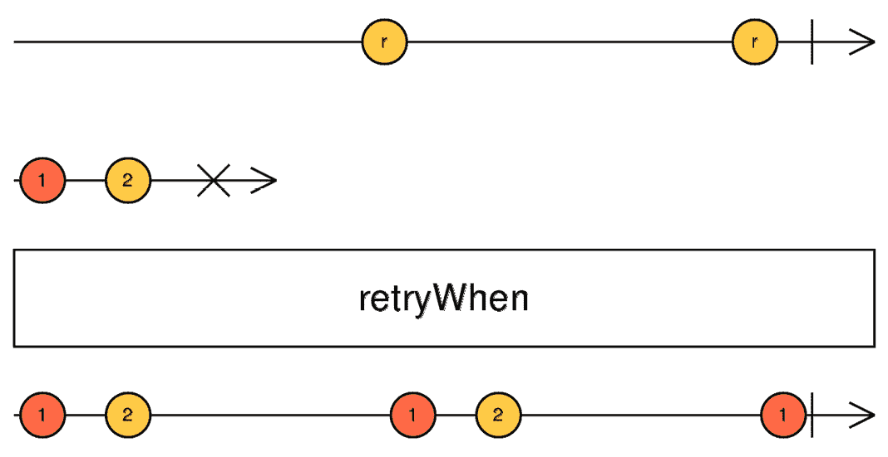

# 4

# 反应式处理错误

编程中的错误时常发生，RxJS 也不例外。处理这些错误是每个应用程序的关键部分。正如我在每次培训课程中总是对我的学生说的，只涵盖愉快情况的流程会导致你的应用程序失败。然而，在 RxJS 中，有许多错误处理策略你需要学习，以便有效地处理错误。

我们将首先解释 RxJS 中可观察者的合约，这是理解接下来内容的关键。然后，我们将学习不同的错误处理模式和 RxJS 提供的用于此目的的操作符。接下来，我们将阐明不同的错误处理策略和每种策略的用例。最后，我们将在我们的食谱应用中实践一种错误处理策略。

在本章中，我们将涵盖以下主要主题：

+   理解可观察者合约的结构

+   探索错误处理模式和策略

+   在我们的食谱应用中处理错误

# 技术要求

本章假设你已对 RxJS 有基本的了解。本章的源代码（除示例外）可在[`github.com/PacktPublishing/Reactive-Patterns-with-RxJS-and-Angular-Signals-Second-Edition/tree/main/Chap04`](https://github.com/PacktPublishing/Reactive-Patterns-with-RxJS-and-Angular-Signals-Second-Edition/tree/main/Chap04)找到。

请参阅*第三章*，*作为流获取数据*中的*技术要求*部分。

# 理解可观察者合约的结构

为了学习错误处理模式，理解**可观察者合约**的结构至关重要。让我们通过探索*第一章*，*深入反应范式*中解释的宝石图来深入了解可观察者执行时间线：


图 4.1 – 宝石图元素

让我们检查之前的图。如果我们看一下流的生存周期，我们可以弄清楚流有两个最终状态：

+   **完成状态**：流在没有错误的情况下结束，不会发出任何进一步的值。这是一个关闭，即可观察者完成。

+   **错误状态**：流在出现错误后结束，错误发生后不会发出任何进一步的值。它也是一个关闭。

这两种状态中只有一个可以发生，不是两者同时发生，每个流最多只能出现一次错误。这就是可观察者合约。

在这一点上，你可能想知道，我们如何从错误中恢复？这就是我们在接下来的几节中要学习的内容。

# 探索错误处理模式和策略

我们将学习的第一个经典错误处理模式基于`subscribe()`方法。`subscribe()`方法接受作为输入的 Observer 对象，它有三个回调：

+   **成功回调**：每次流发出值时都会调用，并接收发出的值作为输入

+   **错误回调**：当发生错误时调用，并接收错误本身作为输入

+   **完成回调**：当流完成时调用

这是一个`subscribe`实现的简单示例：

```js
stream$.subscribe({
    next: (value) => console.log('Value Emitted', value),
    error: (error) => console.log('Error Occurred', error),
    complete: () => console.log('Stream Completed'),
});
```

在代码示例中，`stream$`代表我们的 Observable，我们将一个包含三个回调的对象传递给`subscribe`方法：

+   成功回调，用于在控制台记录接收到的值

+   将接收到的错误记录在控制台中的错误回调

+   完整的回调，用于记录流的完成

因此，为了处理错误，第一种可能性是实现错误回调并跟踪错误消息，显示错误弹出窗口给用户，或执行任何其他自定义行为。很简单！

但等等！在*第三章*，*作为流获取数据*中，我们看到了我们需要避免对流的显式`subscribe()`，并了解了背后的原因和限制，即无法从错误中恢复或发出替代回退。

对，在大多数情况下，我们不会显式使用`subscribe()`。我只是想向你展示做这件事的经典方式，但这并不是最好的方式。相反，让我们看看一些高级错误处理模式，并学习更多有助于我们错误处理过程的操作符。

我认为你可能熟悉许多编程语言中可用的`try-catch`语句，它由一个`try`块后跟一个或多个`catch`子句组成。在`try`块中，你放置你的风险语句，并在`catch`中处理可能的异常：

```js
    try {
      // risky statements
  }
  catch(error) {
      // handle exceptions
   }
```

RxJS 附带`catchError`操作符，它为我们提供了类似于`try-catch`语句的功能。`catchError`操作符在 RxJS 官方文档中定义为“*在 Observable 上捕获错误，通过返回一个新的 Observable 或抛出一个错误来处理*”的操作符。

`catchError`操作符订阅可能发生错误的源 Observable，并向观察者发出值，直到发生错误。当发生错误时，`catchError`操作符执行一个回调函数，传入错误。此回调函数负责处理错误，并始终返回一个 Observable。

如果没有错误，`catchError`返回的输出 Observable 与源 Observable 的工作方式完全相同。

你可以在 Observable 链中多次使用`catchError`，如下所示：

```js
import { catchError} from 'rxjs/operators';
//stream$ is the source Observable that might error out
stream$.pipe(
      catchError(error => {
          //handle the error received
      })
).subscribe()
```

在调用`catchError`操作符之后，我们需要实现一个处理错误的回调函数。当涉及到错误处理时，有三种策略：

+   替换策略

+   重新抛出策略

+   重试策略

让我们在接下来的几个部分中逐一分析这三种策略，并探讨一些示例和用例。

## 替换策略

**替换策略**之所以被命名为这样，是因为错误处理函数返回的 Observable 将替换掉刚刚发生错误的 Observable。然后，这个替换 Observable 被订阅，并且它的值被用来代替出错输入 Observable。以下代码是一个例子：

```js
import { from, of } from 'rxjs';
import { catchError, map } from 'rxjs/operators';
const stream$ = from(['5', '10', '6', 'Hello', '2']);
stream$
  .pipe(
    map((value) => {
      if (isNaN(value as any)) {
        throw new Error('This is not a number');
      }
      return parseInt(value);
    }),
    catchError((error) => {
      console.log('Caught Error', error);
      return of();
    })
  )
  .subscribe({
    next: (res) => console.log('Value Emitted', res),
    error: (err) => console.log('Error Occurred', err),
    complete: () => console.log('Stream Completed'),
  });
//output
Value Emitted 5
Value Emitted 10
Value Emitted 6
Caught Error Error: This is not a number
Stream Completed
```

让我们分解一下这个例子中发生的情况。

首先，我们有一个由字符串值数组`['5', '10', '6', 'Hello', '2']`使用`from`创建操作符创建的 Observable，`stream$`。这个操作符创建了一个 Observable，当订阅它时，将依次发出数组的值，然后完成。

注意

关于`from`操作符的更多详细信息，请参阅官方文档：[`rxjs.dev/api/index/function/from#description`](https://rxjs.dev/api/index/function/from#description)。

接下来，我们在`stream$`的管道方法中组合了两个操作符：

+   `map`操作符：这个操作符用于使用`parseInt()`方法将发出的字符串值转换为整数。如果发出的值不是数字，则抛出一个带有消息`"This is not a"`的`number`错误。

+   `catchError`操作符：我们向其中传递错误处理函数，该函数将记录捕获到的错误并返回`of()`。`of()`创建了一个没有要发出值的 Observable，因此它将立即完成。

然后，我们订阅了`stream$`，并在每个回调中记录一个自定义消息，以查看执行时间确实发生了什么。

在执行时间，`stream$`将依次发出数组的字符串值（分别是`'5'`、`'10'`和`'6'`）。`map`操作符逐个将这些值作为输入，并分别返回`5`、`10`和`6`。`catchError()`操作符接收来自`map`操作符发出的值，并将它们作为输出转发；由于没有错误，错误处理函数将不会被调用。因此，订阅者将接收到`5`、`10`和`6`。

当发出`'Hello'`值时，`catchError()`操作符开始发挥作用。`map`操作符将抛出一个错误，并且`catchError()`中的错误处理函数将相应地被调用。在我们的例子中，错误处理函数只是简单地记录一个错误到控制台，并返回一个由`of()`操作符创建的将立即完成的 Observable。这个 Observable 将替换掉有错误的当前 Observable；这就是为什么我们称之为替换 Observable。

`catchError()`在底层订阅了返回的 Observable。`of()` Observable 将立即完成。然后，`stream$`完成，所以下一个值`'2'`将不会发出。

如您所注意到的，`subscribe()`方法中的错误回调不会被调用，因为我们已经在`catchError`中处理了它。我故意添加它来理解使用`catchError`的错误处理行为。因此，当发生错误时，当前出错流将被`catchError()`返回的流所替换；替换后的 Observable 的值将代替原始流值被发出。这就是我们所说的**回退值**。

因此，总结来说，替换策略在我们要在流内部处理错误，并且不希望错误传播给订阅者时非常有用。

## 重新抛出策略

`catchError`。通知订阅者关于错误的信息将帮助他们执行副作用，例如在弹出窗口中显示错误消息。

为了更深入地了解这种策略，让我们看看以下示例；它与上一节中的示例相同，唯一的区别在于错误处理函数：

```js
import { from, throwError } from 'rxjs';
import { catchError, map } from 'rxjs/operators';
const stream$ = from(['5', '10', '6', 'Hello', '2']);
stream$
  .pipe(
    map((value) => {
      if (isNaN(value as any)) {
        throw new Error('This is not a number');
      }
      return parseInt(value);
    }),
    catchError((error) => {
      console.log('Caught Error', error);
      return throwError(() => error);
    })
  )
  .subscribe({
    next: (res) => console.log('Value Emitted', res),
    error: (err) => console.log('Error Occurred', err),
    complete: () => console.log('Stream Completed'),
  });
//output
Value Emitted 5
Value Emitted 10
Value Emitted 6
Caught Error Error: This is not a number
Error Occurred Error: This is not a number
```

在错误处理函数中，我们返回一个使用`throwError`操作符创建的 Observable。`throwError`操作符创建一个永远不会发出任何值的 Observable；相反，它会立即使用`catchError`捕获的错误出错。这样，错误将被推送到订阅者，如果需要，可以由 Observable 链的其余部分进一步处理。

如您所注意到的，与预期的一样，相同的错误同时在`catchError`块和订阅者错误处理函数中被记录，因此重新抛出策略已经生效。

请注意，在之前的示例中，我们只是为了演示目的在控制台中简单地记录了错误。然而，在现实世界的场景中，你可以做更多的事情，例如向用户显示消息。

## 重试策略

使用`retry`操作符给流提供另一次机会。`retry`操作符会重试一个 Observable 特定次数，这对于重试 HTTP 请求或连接非常有用。这里我们可以看到一个例子：

```js
import { catchError, map, retry } from 'rxjs/operators';
import { from, throwError } from 'rxjs';
const stream$ = from(['5', '10', '6', 'Hello', '2']);
stream$
  .pipe(
    map((value) => {
      if (isNaN(value as any)) {
        throw new Error('This is not a number');
      }
      return parseInt(value);
    }),
    retry(2),
    catchError((error) => {
      console.log('Caught Error', error);
      return throwError(() => error);
    })
  )
  .subscribe({
    next: (res) => console.log('Value Emitted', res),
    error: (err) => console.log('Error Occurred', err),
    complete: () => console.log('Stream Completed'),
  });
//output
Value Emitted 5
10
6
5
10
6
5
10
6
Caught Error Error: This is not a number
Error Occurred Error: This is not a number
```

如您所注意到的，源流的值被发出了两次，因为我们用`2`作为参数调用了`retry`操作符；在抛出错误之前，我们给了 Observable 两次机会。

现在，在这种情况下，我们正在立即重试。但是，如果我们只想在特定情况下重试或者等待一段时间后再重试呢？这就是`retryWhen`操作符发挥作用的地方！

要理解`retryWhen`操作符，没有什么比一个弹珠图更好的了：



图 4.2 – retryWhen 操作符

让我们解释一下这里发生了什么：

+   第一行的 Observable 是**通知 Observable**，它将决定重试何时发生

+   第二行的 Observable 是**源 Observable**，在发出**1**和**2**之后将会出错

当我们订阅源 Observable 时，它将发出`retryWhen`并将这些值作为输出。然后，源 Observable 出错并完成。

通知器 Observable 发出第一个值之前，什么都不会发生，`retryWhen`将订阅源 Observable，因为它已经完成了，所以即使它已经完成，也可以重试。

然后，通知器 Observable 将发出另一个**r**值，发生同样的情况。

接下来，`retryWhen`开始发出第一个**1**值，但很快，通知器 Observable 就完成了；这就是为什么**2**值不会发出。

如你所猜，每当通知器发出值时，`retryWhen`都会重试源 Observable！这意味着你可以使用这个通知器 Observable 在你想要源 Observable 重试并完成的时候发出值，并在你想要停止重试尝试的时候完成它。

现在，让我们看看`retryWhen`操作符的签名：

```js
export declare function retryWhen<T>(notifier: (errors:
Observable<any>) => Observable<any>):
MonoTypeOperatorFunction<T>;
```

`notifier`参数表示返回通知器 Observable 并获取错误 Observable 作为参数的回调。每当源 Observable 出错时，错误 Observable 都会发出。因此，`retryWhen`将订阅通知器 Observable 并按之前描述的方式行为。

这里是替换和重新抛出策略中给出的相同示例，但使用`retryWhen`代替：

```js
import { from} from 'rxjs';
import { map, retryWhen, tap } from 'rxjs/operators';
const stream$ = from(['5', '10', '6', 'Hello', '2']);
stream$
  .pipe(
    map((value) => {
      if (isNaN(value as any)) {
        throw new Error('This is not a number');
      }
      return parseInt(value);
    }),
    retryWhen((errors) => {
      return errors.pipe(
        tap(() => console.log('Retrying the source
                              Observable...'))
      );
    })
  )
  .subscribe({
    next: (res) => console.log('Value Emitted', res),
    error: (err) => console.log('Error Occurred', err),
    complete: () => console.log('Stream Completed'),
  });
//Code runs infinitely
```

在前面的代码中，第一次错误是在接收到值`'Hello'`时抛出的，这不是一个数字。`retryWhen`操作符将捕获这个错误并执行。然后，通知回调（`retryWhen`的参数）简单地以错误 Observable 作为输入并返回它。

我们还使用了`pipe`来调用`tap`操作符，以便在控制台记录一条消息（`'Retrying the source Observable...'`）。`tap()`操作符用于对每个发出的值执行副作用。

注意

关于`tap`操作符的更多详细信息，请参阅官方文档中的此链接：[`rxjs.dev/api/operators/tap`](https://rxjs.dev/api/operators/tap)。

如果你执行这段代码，你会发现它会无限运行。为什么？因为源总是会出错，而`retryWhen`将无限期地订阅源 Observable。

如果源总是出错，立即重试是不正确的。然而，错误并不总是发生，例如，在 HTTP 请求的情况下。有时，HTTP 请求失败是因为服务器宕机，或者有其他可能消失的临时原因，而在下一次尝试中可能没有任何问题。

在那种情况下，你可以使用立即重试，甚至延迟重试，在一定的延迟后重试，例如，在发生错误后等待 5 秒钟再重试。这就是我们将在下一节学习的内容。

现在，让我们看看另一个将帮助我们实现重试策略的操作符：`delayWhen`操作符。`delayWhen()`操作符用于通过给定的时间延迟从源 Observable 发出的值。它与`delay()`操作符类似，但延迟持续时间由一个输入 Observable 确定。

更多细节，让我们看看一个弹珠图：


图 4.3 – delayWhen 操作符

第一个 Observable 是源 Observable。图中的每个值，**a**、**b**和**c**，分别有自己的持续时间选择器 Observable，分别是：**a**持续时间选择器 Observable、**b**持续时间选择器 Observable 和**c**持续时间选择器 Observable，它们将发出一个值**x**，然后完成。

源 Observable 发出的每个值在发出到输出 Observable 之前都会被延迟。实际上，当源 Observable 发出值时，`delayWhen`操作符不会立即将值发出到源 Observable；相反，它将等待**a**持续时间选择器 Observable 在**ta+delay**处发出值，并且在这个确切的时间，值**a**将被发出到输出 Observable。

这对其他值也是如此；当**b**持续时间选择器发出值时，**b**值将在输出 Observable 的**tb+delay**处显示，当**c**持续时间选择器 Observable 发出值时，值**c**将在**tc+delay**处发出。请注意，在这里，**tb**和**tc**分别代表源 Observable 发出值**a**和**b**的时间。

正如你可能已经注意到的，源 Observable 在**b**在**c**之前发出（因为**tb**在**tc**之前）；然而，在输出 Observable 中，**b**的值在**c**的值之后显示（因为**tb+delay**在**tc+delay**之后）；这是因为**b**的选择器（*图 4.3*中的**b**持续时间选择器）在**c**的选择器（*图 4.3*中也显示的**c**持续时间选择器）之后发出。

因此，正如你所看到的，延迟完全可以通过`durationSelector`函数来灵活调整。

另一个函数，`timer`函数，在延迟重试策略中可能很有用：

```js
export declare function timer(dueTime?: number | Date,
periodOrScheduler?: number | SchedulerLike, scheduler?:
SchedulerLike): Observable<number>;
```

这个`timer`函数返回一个 Observable，并接受两个参数：

+   `due`：一个时间周期或确切日期，在此日期之前不会发出任何值

+   `scheduler`：一个周期性间隔，如果我们想定期发出新值

一个例子是`timer(5000,1000)`。返回的 Observable 的第一个值将在 5 秒后发出，并且每秒发出一个新值。第二个参数是可选的，这意味着`timer(5000)`将在 5 秒后发出一个值然后完成。

现在，是时候将`delayWhen`和`retryWhen`操作符结合起来，看看我们如何在每次错误后 5 秒重试失败的 HTTP 请求了：

```js
import { Injectable } from '@angular/core';
import { HttpClient } from '@angular/common/http';
import { Recipe } from '../model/recipe.model';
import { catchError, delayWhen, of, retryWhen, tap, timer } from 'rxjs';
@Injectable({
  providedIn: 'root'
})
export class RecipesService {
recipes$ =
this.http.get<Recipe[]>('http://localhost:3001/recipes')
.pipe(
       retryWhen(errors => {
         return errors
           .pipe(
             delayWhen(() => timer(5000)),
             tap(() => console.log('Retrying the HTTP
                                   request...'))
           );
       }),
);
constructor(private http: HttpClient) { }
}
```

注意

你在 GitHub 仓库中找不到前面的代码，因为它仅仅是一个说明性的示例。然而，你可以将其复制并粘贴到 `RecipesService` 类中以测试延迟重试。此外，记得停止 `recipes-book-api` 模拟服务器以模拟重试尝试。

在这种情况下，我们的源 Observable 是 HTTP `get` 请求的结果。每次请求失败时，`delayWhen` 操作符通过 `timer` 函数创建一个持续时间选择器 Observable。这个持续时间选择器 Observable 将在 5 秒后发出 `0` 值并完成。因此，`retryWhen` 的通知 Observable 将发出一个值，此时，源 Observable 将在 5 秒后重试。

当你打开控制台时，你会看到以下输出：


图 4.4 – 失败的 HTTP 请求

正如你可能已经注意到的，每次 GET HTTP 请求失败后，都会在 5 秒后再次尝试。这就是我们实现延迟重试的方法！所以，总结一下，每种错误处理策略都有其自己的技术，并服务于不同的目的。在下一节中，我们将探讨何时使用每种策略。

## 选择合适的错误处理策略

在 RxJS 中选择最合适的错误处理策略取决于各种因素，例如应用程序的性质、遇到的错误类型以及期望的用户体验。以下是一些关于何时使用每种策略的指导。

替换策略涉及用回退值或 Observable 替换错误。它适用于以下场景：

+   当发生错误时，你有预定义的回退值或行为可以使用，例如显示占位符内容或默认设置。例如，在一个天气应用程序中，如果获取当前天气数据失败，你可以用用户位置的默认天气预报替换错误。

+   错误是可恢复的，并且不需要用户立即干预。

+   你希望通过优雅地处理错误而不中断应用程序流程来提供无缝的用户体验。

重新抛出策略涉及重新抛出错误以将其传播给订阅者进行处理。它适用于以下场景：

+   你希望将错误处理的责任委托给 Observable 的订阅者或消费者。例如，在一个身份验证服务中，如果由于凭据无效导致登录失败，你可以重新抛出错误以允许 UI 组件向用户显示错误消息。

+   错误需要根据其发生的上下文进行特定的处理逻辑或定制。

+   你希望为应用程序的不同部分提供灵活性，以便它们可以以不同的方式处理错误。

重试策略涉及重试导致错误的操作一定次数。它适用于以下场景：

+   错误是瞬时的或间歇性的，例如网络错误或暂时性的服务中断，在后续尝试之后重试操作可能会成功。例如，在一个文件上传服务中，如果由于网络错误上传文件失败，你可以在放弃之前多次重试上传操作，以确保文件成功上传。

+   重试操作有合理的成功机会，并且可以减轻瞬时故障的影响。

+   你希望提高容易偶尔出现故障的操作的可靠性和鲁棒性。

此外，在选择错误处理策略时，还应考虑以下因素：

+   **用户体验**：考虑每种策略如何影响用户体验，例如它是否会导致延迟、重试或回退。

+   **应用程序要求**：将所选策略与您应用程序的具体要求和限制相一致，例如可靠性、响应性和错误容忍度。

+   **性能影响**：重试策略可能会引入额外的开销，尤其是在操作涉及昂贵或耗时任务时。

最终，最合适的错误处理策略取决于您应用程序的具体上下文和要求。通常，尝试不同的策略并在实际场景中观察它们的效果，以确定最佳方法是有益的。

现在我们已经学习了处理错误的不同策略和运算符，让我们在下一节中在我们的食谱应用程序中进行实践。

# 处理我们的食谱应用程序中的错误

我们将要做的第一件事是停止我们的模拟服务。是的，你没听错；停止它。这样，对`getRecipes`服务的调用将会失败，因为服务器已关闭。

现在，如果你刷新前端应用程序，你会看到没有任何内容显示，包括我们的食谱列表。为什么我们会得到这种行为？因为我们没有处理错误。错误被抛出，流完成，之后什么也没有发生。我们有一个空白屏幕，上面什么也没有显示。

现在打开控制台，你会看到失败的请求：


图 4.5 – 显示失败请求的控制台

如果正确处理，失败的 HTTP 请求永远不会破坏我们的应用程序。这就是为什么你在前端应用程序中发起 HTTP 请求时应该非常小心。

那么，我们该如何解决这个问题？我们之前讨论过的哪种策略最适合？

如果我们选择重新抛出或重试策略，那么我们将阻止显示食谱列表。用户将看到一个空白页面，必须等待请求成功执行才能看到屏幕上渲染的食谱列表。当你处理与 UI 显示无关的后台进程时，这是一个有效的选项；然而，如果你提出请求以获取结果并在你的 UI 组件中显示它们，那么你应该提供数据的替代品以继续渲染页面。无论是否有错误，用户界面都应该继续工作；如果有错误，我们将显示一个空列表；如果没有，我们将显示从服务器返回的列表。

正是因为这个替换策略最适合这个特定情况。实际上，我们希望从服务中获取食谱列表，但如果服务因任何原因失败，我不想我的应用程序冻结；我想看到包含零个元素（没有元素）、一个空表或一个列表，仅此而已。所以，我们将要做的是使用`catchError`并返回一个空的 Observable，这是我们备选值。

我们的服务将看起来像这样：

```js
import { Injectable } from '@angular/core';
import { HttpClient } from '@angular/common/http';
import { Recipe } from '../model/recipe.model';
import { environment } from 'src/environments/environment';
import { catchError, of } from 'rxjs';
const BASE_PATH = environment.basePath
@Injectable({
  providedIn: 'root'
})
export class RecipesService {
  recipes$ = this.http.get<Recipe[]>(
    `${BASE_PATH}/recipes`).pipe(
      catchError(()=> of([])));
  constructor(private http: HttpClient) { }
}
```

这种方法确保了你的应用程序保持功能正常，如果你访问应用程序，将显示一个空列表。此外，你可以通过包含类似`recipes-list.component.html`的消息来自定义用户界面，如下所示：

```js
@if (recipes$ | async; as recipes) {
<div class="card">
    <div>{{recipes.length}} Results</div>
    <p-dataView #dv [value]="recipes" [paginator]="true"
    [rows]="9" filterBy="name" layout="grid">
        <ng-template let-recipes pTemplate="gridItem">
            <div class="grid grid-nogutter">
                @for (recipe of recipes; track recipe.id) {
                    <div class="col-12" class="recipe-grid-
                        item card">
                        /** Extra code here **/
                    </div>
                } @empty {
                    <div>There are no recipes</div>
                }
            </div>
        </ng-template>
    </p-dataView>
</div>
} @else {
    <div>There are no recipes</div>
}
```

如你所注意到的，我们使用了在*第三章*中解释的新内置控制流机制，*作为流获取数据*。通过将`@else`块应用于第一个`if`条件，我们能够在`recipes$`Observable 没有发出任何值时显示消息。此外，添加到`@for`语句中的`@empty`语句允许我们在食谱列表为空时显示相同的消息。

# 摘要

在本章中，我们学习了 Observable 合约，并探讨了 RxJS 中最常用的错误处理策略和一些不同的操作符，即`catchError()`、`delayWhen()`、`retry()`和`retryWhen()`。我们还阐明了不同的错误处理策略以及何时选择每种策略。最后，我们在我们的食谱书应用中处理了第一个实现的功能的错误。

现在我们知道了如何在 RxJS 中处理错误，让我们继续下一个反应式模式：合并流。
