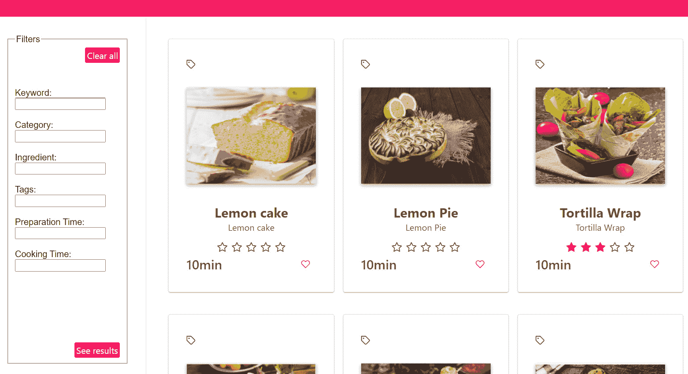
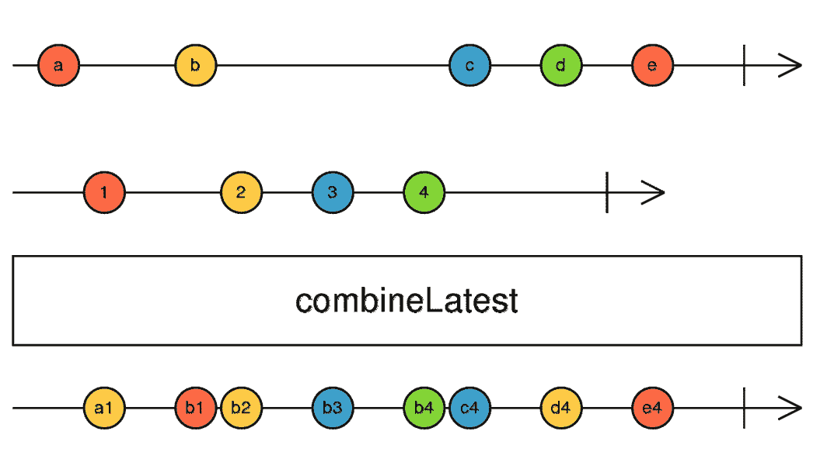
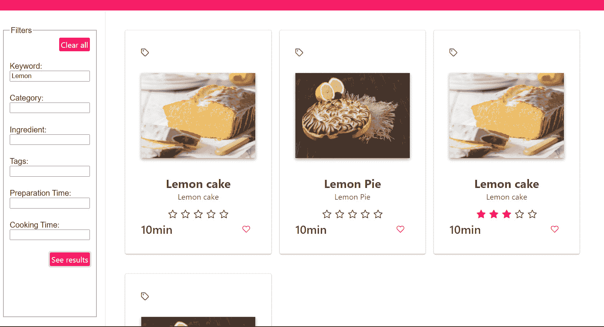

# 第五章：合并流

到目前为止，我们已经学习了关于反应式模式以流的形式获取数据以及错误处理模式。然而，我们只探索了来自单个流的异步数据。如果我们想处理来自不同流的异步数据呢？你知道我们该如何进行吗？

幸运的是，RxJS 附带了一个最强大的概念之一：合并流。合并流是将多个 Observables 的排放汇集到一个流中的过程。这允许你将多个异步数据源视为单个流来探索。合并流背后的主要思想是以更结构化的方式处理异步数据。

本章围绕一个常见用例展开，即过滤数据；我们将通过合并流来解决它。我们首先将解释过滤需求，然后我们将探索可以用来实现此需求的命令式、经典模式，接着是一个声明式、反应式实现。最后，我们将突出合并流时需要避免的常见陷阱，并讨论最佳实践。

在本章中，我们将涵盖以下主要主题：

+   定义过滤需求

+   探索用于过滤数据的命令式模式

+   探索用于过滤数据的声明式模式

+   突出常见陷阱和最佳实践

# 技术要求

本章的源代码（除示例外）可在[`github.com/PacktPublishing/Reactive-Patterns-with-RxJS-and-Angular-Signals-Second-Edition/tree/main/Chap05`](https://github.com/PacktPublishing/Reactive-Patterns-with-RxJS-and-Angular-Signals-Second-Edition/tree/main/Chap05)找到。

# 定义过滤需求

在我们的食谱应用中，我们希望根据某些标准过滤显示的食谱以细化结果。以下图显示了在*第二章*的*视图 1 – 登录页面*部分中描述的模拟实现，*浏览我们的应用*：



图 5.1 – 过滤需求

从用户的角度来看，用户将在**过滤器**区域填写一些标准，并点击**查看结果**按钮来查看符合填写标准的成果。用户可以通过食谱标题、食谱类别、成分、标签、准备时间和烹饪时间中的关键词进行过滤。过滤功能是大多数显示数据集合的应用程序所必需的。

当涉及到过滤时，你可以采用很多策略，选择取决于你的数据量大小：

+   如果你可以完全在客户端获取少量数据，那么执行服务器端过滤是不必要的；相反，执行客户端过滤更快，而且不会损害应用程序的性能。

+   如果你有很多数据，那么在通过分页或虚拟滚动加载数据时应该谨慎，以提高性能和用户体验。因此，在这种情况下，进行服务器端过滤是不可避免的，因为你没有在客户端拥有所有数据。

为了演示目的，我们将只过滤总共 11 道食谱。因此，我们将使用客户端过滤（然而，请注意，我们将讨论的响应式模式不需要特定的过滤类型——它可以与客户端和服务器端过滤一起使用）。

# 探索过滤数据的命令式模式

在本节中，我们将探讨从 UI 到过滤逻辑的命令式方法来处理数据过滤。

让我们从设置 UI 代码开始，创建一个新的独立组件 `RecipesFilterComponent`，位于 `src/app` 目录下。它负责显示不同的过滤器以细化初始结果。过滤器组件的 HTML 模板代码如下：

```js
<div class="rp-data-view">
    <form [formGroup]="recipeForm">
        <fieldset class="rp-filters-group">
            <legend>Filters</legend>
            <div class="rp-filter-button">
                <p-button (onClick)="clearFilter()"
                label="Clear all"></p-button>
            </div>
            <label for="title">Keyword:</label>
            <input type="text" id="title"
            formControlName="title">
            <label for="category">Category:</label>
            <input type="text" id="category"
            formControlName="category">
            <label for="ingredient">Ingredient:</label>
            <input type="text" id="ingredient"
            formControlName="ingredient">
            <label for="text">Tags:</label>
            <input type="text" id="tags"
            formControlName="tags">
            <label for="text">Preparation Time:</label>
            <input type="text" id="prepTime"
            formControlName="prepTime">
            <label for="text">Cooking Time:</label>
            <input type="text" id="cookingTime"
            formControlName="cookingTime">
            <div class="rp-filter-button">
                <p-button class="rp-filter-button"
                (onClick)="filterResults()" label="See
                results"></p-button>
            </div>
        </fieldset>
    </form>
</div>
```

在前面的代码中，我们使用了 Angular 响应式表单在表单内显示搜索条件。然后，我们包含了两个按钮：在 `OnClick` 回调中的 `filterResults()`。此方法将替换显示的食谱与填充的准则相匹配的食谱。然后，由于 Angular 的变更检测机制，UI 将自动更新。

注意

有关响应式表单的更多详细信息，请参阅 [`angular.dev/guide/forms/reactive-forms`](https://angular.dev/guide/forms/reactive-forms)。

现在，让我们转到 `RecipesListComponent`，在那里我们应该考虑对模板进行的小幅修改。我们应该将 `p-dataView` 组件的 `[value]` 输入绑定到一个新的属性，即 `filteredRecipes` 属性，该属性包含过滤后的结果。`filteredRecipes` 属性最初包含从服务器请求的所有食谱。模板如下所示：

```js
<div class="card">
    <p-dataView #dv [value]="filteredRecipes"
    [paginator]="true" [rows]="9" filterBy="name"
    layout="grid">
    /** Extra code here **/
    </p-dataView>
</div>
```

重点当然不是 HTML 模板，而是过滤过程；然而，在提供完整的工作流程时指出这一点很重要。

现在，让我们看看 `RecipesListComponent` 中的经典模式逻辑：

```js
export class RecipesListComponent implements OnInit,
OnDestroy {
  filteredRecipes: Recipe[] = [];
  recipes: Recipe[] = [];
  private destroy$: Subject<boolean> = new
  Subject<boolean>();
  constructor(private service: RecipesService, private fb:
  FormBuilder) {
  }
  ngOnInit(): void {
    this.service.recipes$.pipe(takeUntil(this.destroy$))
      .subscribe((recipes) => {
        this.recipes = recipes;
        this.filteredRecipes = recipes;
      });
  }
  ngOnDestroy(): void {
    this.destroy$.next(true);
    this.destroy$.unsubscribe();
  }
  filterResults(recipe:Recipe) {
    this.filteredRecipes = this.recipes.filter(recipe =>
    recipe.title?.indexOf(recipe.title) !=
    -1)
  }
```

让我们分析正在发生的事情。在这里，我们声明了三个变量：

+   `filteredRecipes`：包含过滤后食谱的数组。它是 HTML 模板中绑定到 `p-dataview` 组件 `[value]` 输入的属性。

+   `recipes`：初始的食谱数组。

+   `destroy$`：一个用于清理订阅的主题。

然后，在 `ngOninit()` 方法中，我们调用了代表我们的可观察食谱的 `recipes`（`recipes$`）。之后，我们订阅它，并用从 `recipes$` 发射的数组初始化食谱和 `filteredRecipes` 数组。

由于在这个例子中我们没有使用异步管道，我们应该手动使用 `takeUntil()` 模式或 `takeUntilDestroyed()` 来清理订阅，正如在 *第三章* 中解释的，*作为流获取数据*。

当点击`recipe.title;`时，会调用`filterResults(recipe:Recipe)`方法，该方法包含用户在标题输入框中填写的值。

注意

为了演示目的，在这个命令式实现示例中，我们选择在`RecipesListComponent`中显示`RecipesFilterComponent`。这种方法涉及发送一个输出事件，该事件封装了在`RecipesFilterComponent`中可用的过滤器表单的值，然后`RecipesListComponent`根据这个输入执行`filterResult`方法

如果你使用服务器端过滤，换句话说，如果你有一个根据给定标准处理过滤数据的服务的，那么`filterResults()`应该调用后端服务，其形式如下：

```js
  filterResults() {
    this.filteredRecipes =
    this.http.get<Recipe[]>(`${BASE_PATH}/recipes`,
    {params:{criteria:this.recipeForm.value}});
  }
```

就这样！它运行得很好，我会说这可能是大多数人实现 Angular 应用程序中过滤功能的方法。命令式方法几乎是显而易见的方法。

然而，你可能已经注意到，我们不能再像在模板中那样利用`recipes$`作为流了，正如在*第三章*中解释的，*以流的形式获取数据*。此外，如果你的食谱服务发出新的食谱呢？这将覆盖活动过滤器，直到用户再次点击**查看结果**来更新带有当前过滤器的列表。这当然可以通过命令式处理，但使用 Observables 而不利用响应式能力的力量是件遗憾的事。

所以，无需多言，让我们探索一种更好的方法来实现过滤需求，即使用组合流的基本原理以声明式和响应式的方式。

记住，我总是想立即突出经典方法和响应式方法，以便从命令式到声明式的平稳过渡。

# 探索过滤数据的声明式模式

你应该把所有事情都想象成一条流；这是黄金法则！

我们已经有了`recipes$`，它已经是我们的**数据流**了，但如果我们把点击**查看结果**按钮也视为一条流呢？我们将称之为**动作流**，并认为它是一个异步的数据流；我们不知道它何时发生，但每次用户点击**查看结果**时，动作流都应该发出过滤器的值。

因此，总共我们需要两个流：

+   *数据流*：在我们的案例中，它是`recipes$`，它在`RecipesListComponent`中定义，我们是在*第三章*中创建的，*以流的形式获取数据*：

    ```js
      export class RecipesListComponent {
      /*Define The data stream */
      recipes$ = this.service.recipes$;
      constructor(private service: RecipesService) { }
    }
    ```

+   *动作流*：在我们的案例中，它被命名为`filterRecipesSubject`；它负责在用户每次点击`RecipesService`服务（我们也在*第三章*中创建了，*以流的形式获取数据*）时发出最新的过滤器值：

    ```js
      /*Create The action stream */
      Private filterRecipeSubject = new
      BehaviorSubject<Recipe>({title:''});
      /* Extract The readonly stream */
      filterRecipesAction$ =
      this.filterRecipeSubject.asObservable();
    ```

    现在，让我们解释前面的代码块。在这里，我们创建了两个属性：

    +   一个名为 `filterRecipeSubject` 的 `BehaviorSubject`，以防止代码的外部部分在流中发出值、出错或完成流。我们在构造函数参数中初始化 `filterRecipeSubject` 为一个默认值——一个空对象。我们可以使用 `Subject` 或 `BehaviorSubject` 来创建我们的动作流：

        +   `Subject` 是一种特殊的可观察对象，它使得多播成为可能。我们将在 *第九章* *揭秘多播* 中详细探讨多播。现在，请记住，主题既是观察者又是可观察对象，因此你可以用它来在观察者之间共享值。

        +   `BehaviourSubject` 是一种特殊的主题，它需要一个初始值，并且总是保留最后一个值以将其发送给新的订阅者。换句话说，如果你有任何后来加入游戏的订阅者，他们将获得流中发出的最后一个值。当你订阅时，这总会给你一个值。我们将在本章末尾讨论为什么我们使用 `BehaviourSubject` 而不是 `Subject`。

    +   通过 `filterRecipeSubject` 的 `asObservable()` 方法创建一个 `filterRecipeAction$`（用于防止代码的外部部分在流中发出值、出错或完成流）。我们使用构造函数参数中的默认值——一个空对象——初始化 `filterRecipeSubject`。我们可以使用 `Subject` 或 `BehaviorSubject` 来创建我们的动作流：

所以，为了总结，在添加之前的代码块后，`RecipesService` 服务将看起来像这样：

```js
export class RecipesService {
  recipes$ =
    this.http.get<Recipe[]>(`${BASE_PATH}/recipes`);
  private filterRecipeSubject = new
    BehaviorSubject<Recipe>({title: '' });
  filterRecipesAction$ =
    this.filterRecipeSubject.asObservable();
  constructor(private http: HttpClient) { }
}
```

现在，是时候合并流了。这两个流都相互依赖；当 `recipes$` 发出一个新值时，过滤器应该保持活跃，而当过滤器发出一个新值时，食谱列表应该相应地更新。

我们真正试图做的是从两个流中获取信息。每次你想从多个可观察对象中合并信息时，你应该考虑 RxJS 的组合策略。我们不是分别从两个流中获取数据，而是可以将其组合成一个单一的新流。RxJS 有一个用于此目的的组合操作符集。在下一节中，我们将探讨最常用的组合操作符之一，即 `combineLatest` 操作符。

## combineLatest 操作符

`combineLatest` 操作符将组合输入可观察对象发出的最新值。所以，每当其中一个可观察对象发出时，`combineLatest` 将发出每个可观察对象发出的最后一个值。这说得通吗？如果不通，别担心；我们将像往常一样使用宝石图进一步详细说明：



图 5.2 – combineLatest 的宝石图

让我们分解一下：

+   晶石图的第一行表示第一个输入可观察对象的时序。

+   第二行表示第二个输入可观察对象的时序。因此，`combineLatest` 有两个输入。

+   最后一行表示从 `combineLatest` 操作符返回的输出可观察对象的时序。

现在，让我们深入执行过程。

第一个 Observable 发出了`combineLatest`的值。为什么？因为`combineLatest`不会发出，直到所有输入 Observables 各自发出一个值。所以，当第二个 Observable 发出时，`combineLatest`将发出**a1**。

请记住，`combineLatest`将不会发出初始值，直到每个 Observable 至少发出一个值。

然后，第一个 Observable 发出了另一个值，`combineLatest`将发出每个输入流发出的最后一个值，即`combineLatest`将发出**b2**，以此类推。

让我们回到我们的例子，看看我们如何结合我们刚刚创建的数据流和动作流，以便使用`combineLatest`操作符反应性地过滤结果。

在`RecipesListComponent`中，我们将创建一个新的流名为`filteredRecipes$`，它代表数据和动作流的组合结果：

```js
filterRecipesAction$ = this.service.filterRecipesAction$;
filteredRecipes$ = combineLatest([this.recipes$,
  this.filterRecipesAction$])
```

因此，在这里，我们使用了`combineLatest`操作符，并将其传递给一个包含两个值的数组（作为参数）：第一个值是`recipes$`数据流，第二个值是`filterRecipeAction$`动作流。`combineLatest`将返回一个包含两个值的数组（作为输入 Observables 的数量）：数组的第一个元素是第一个流发出的最后一个值，数组的第二个元素是第二个流发出的最后一个值。它尊重顺序。

现在，我们将使用`RecipesListComponent`模板中的`filteredRecipes$`，我们将将其绑定到`p-dataview`的`[value]`输入，以便发生以下情况：

+   `filteredRecipes$`应在加载页面时返回所有食谱

+   `filteredRecipes$`应在过滤时仅返回符合选定标准的食谱

然后，`RecipesListComponent`模板的 HTML 代码将看起来像这样：

```js
@if (filteredRecipes$ | async; as recipes) {
<div class="card">
    <p-dataView #dv [value]="recipes" [paginator]="true"
    [rows]="9" filterBy="name" layout="grid">
        /** Extra code here **/
    </p-dataView>
</div>
} @else {
<div>There are no recipes</div>
}
```

注意

在模板中，我们包含了`RecipesList`和`RecipesFilter`组件。这种组件的分离增强了代码库的可维护性和可读性，促进了应用的模块化和可扩展架构。

尽管如此，我们还需要在`RecipesListComponent`中做出一个更改。在我们的 UI 中，我们希望在加载页面时显示所有食谱，在细化结果时显示过滤后的食谱；因此，我们需要编辑`filteredRecipes$`，使其不直接返回组合的结果（而且在大多数情况下，这种情况根本不会发生）。相反，我们将处理组合的结果（返回的数组），从组合的流中获取所需的信息，并将其转换为所需的任何形式。

在这种情况下，我们希望修改结果流，使其不仅提供最新的食谱和标准值，而且还提供一个按接收到的标准过滤的食谱数组，如下所示：

```js
filteredRecipes$ = combineLatest([this.recipes$,
  this.filterRecipesAction$]).pipe(
    map((resultAsArray:[Recipe[], Recipe]) => {
      const filterTitle =
        resultAsArray[1]?.title?.toLowerCase() ?? '';
      return resultAsArray[0].filter(recipe =>
        recipe.title?.toLowerCase().includes(filterTitle));
    })
  );
```

组合的结果是`resultAsArray`参数。第一个元素，`resultAsArray [0]`，代表来自`recipes$`的最后发出的菜谱，第二个元素，`resultAsArray [1]`，代表来自`filterRecipesAction$`的最后发出的标准。

然而，我们可以做得更好！我们可以使用数组解构技术来增强代码，如下所示：

```js
filteredRecipes$ = combineLatest([this.recipes$,
  this.filterRecipesAction$]).pipe(
    map(([recipes, filter]: [Recipe[], Recipe]) => {
      const filterTitle =
        filter?.title?.toLowerCase() ?? '';
      return recipes.filter(recipe =>
        recipe.title?.toLowerCase().includes(filterTitle))
    })
  );
```

在这里，`recipes`参数代表返回数组的第一元素，`filter`参数代表返回数组的第二元素。在`:`之后，我们有参数类型，就是这样。所以，我们不是直接使用索引来获取元素，数组解构技术提供了一种命名数组元素并直接从这些变量中获取值的方法。最后，我们使用了`filter`方法来过滤符合标准的菜谱列表。

到目前为止，我们已经实施了一切机制来反应性地过滤值。剩下要做的就是每次过滤器值改变时更新过滤器值，这就是我们将在下一节中要探讨的内容。

## 更新过滤器值

正如我们所说，每次用户点击`filterRecipesAction$`都应该发出标准，以便我们的`combineLatest`重新执行并返回过滤后的菜谱。为了实现这一点，我们在`RecipesService`中创建了一个名为`updateFilter`的新方法，它接受过滤器值作为输入，并简单地使用`filterRecipesSubject`主题的下一个方法发出它：

```js
  updateFilter(criteria:Recipe) {
    this.filterRecipeSubject.next(criteria);
  }
```

然后，当用户点击**查看结果**按钮时，我们将在`RecipesFilterComponent`中调用此方法来更新过滤器值：

```js
filterResults() {
  this.service.updateFilter(<Recipe>this.recipeForm.value);
}
```

我们将`RecipesFilterComponent`中创建的“过滤器”表单的值传递给`updateFilter`方法。就是这样；现在，每当标准发出时，它将重新执行`combineLatest`运算符，并相应地过滤值。

总结一下，这是`RecipesListComponent`中的完整代码看起来是这样的：

```js
@Component({
  selector: 'app-recipes-list',
  standalone: true,
  imports: [CommonModule],
  templateUrl: './recipes-list.component.html',
  styleUrls: ['./recipes-list.component.scss'],
  changeDetection: ChangeDetectionStrategy.OnPush
})
export class RecipesListComponent {
  /*The data stream */
  recipes$ = this.service.recipes$;
  filteredRecipes$ = combineLatest([this.recipes$,
  this.filterRecipesAction$]).pipe(
    map(([recipes, filter]: [Recipe[], Recipe]) => {
    const filterTitle = filter?.title?.toLowerCase() ?? '';
      return recipes.filter(recipe =>
      recipe.title?.toLowerCase().includes(filterTitle)
    })
  );
  constructor(private service: RecipesService) {
  }
}
```

`RecipesFilterComponent`组件看起来是这样的：

```js
@Component({
  selector: 'app-recipes-filter',
  standalone: true,
  imports: [ButtonModule, ReactiveFormsModule],
  templateUrl: './recipes-filter.component.html',
  styleUrl: './recipes-filter.component.css'
})
export class RecipesFilterComponent {
  recipeForm = this.fb.group<Recipe>({
    title: '',
    category: '',
    ingredients: '',
    tags: '',
    prepTime: undefined,
    cookingTime: undefined,
  });
constructor(private service: RecipesService, private fb:
  FormBuilder) { }
filterResults() {
this.service.updateFilter(<Recipe>this.recipeForm.value);
}
clearFilters() {
this.recipeForm.reset();
}
```

最后，`RecipesService`看起来是这样的：

```js
export class RecipesService {
  recipes$ = this.http.get<Recipe[]>(
  `${BASE_PATH}/recipes`);
  private filterRecipeSubject = new
  BehaviorSubject<Recipe>({ title: '' });
  filterRecipesAction$ =
  this.filterRecipeSubject.asObservable();
  constructor(private http: HttpClient) { }
  updateFilter(criteria:Recipe) {
    this.filterRecipeSubject.next(criteria);
  }
}
```

注意

完整的代码可在 GitHub 仓库中找到。

现在，让我们回答这个问题，为什么我们选择`BehaviorSubject`而不是`Subject`？

在加载页面和点击`filteredRecipes$`以保留所有菜谱之间，如*组合流*部分所述。如果我们使用普通的`Subject`，标准只有在点击按钮时才会发出。这意味着在加载页面时，只有`recipes$`会发出，`combineLatest`会在所有流发出一个值之前等待，然后才会发出更多的值。在我们的 UI 中，我们将会得到一个空列表。

然而，当我们使用`BehaviorSubject`时，它将立即为所有订阅者发出默认值，因此`combineLatest`将发出第一个值，然后一切都会正常工作，就是这样。看起来像是魔法，对吧？

这里是搜索关键字`Lemon`时过滤后的菜谱示例：



图 5.3 – 过滤后的食谱

总结来说，为了解决本章中我们查看的使用案例，我们首先定义了负责获取数据的 数据流；然后，我们创建了动作流。之后，我们将流合并，对合并的流进行了一些操作，将其绑定到我们的模板中，并最终在过滤事件中更新了过滤值。

现在，让我们突出一些在使用 `combineLatest` 时常见的陷阱。

# 突出常见的陷阱和最佳实践

这里有一些在使用 RxJS 中的 `combineLatest` 时应避免的常见陷阱或场景：

## 不必要的订阅

`combineLatest` 会自动订阅所有提供的 Observables。确保当你不再需要合并的值时，从返回的订阅中取消订阅，特别是对于长时间运行或无限的 Observables。这可以防止内存泄漏和不必要的处理。

## 缺失或不完整的数据

`combineLatest` 仅在其所有源 Observables 至少发射了一个值时才发射一个值。如果任何 Observables 在所有 Observables 发射之前完成或抛出错误，`combineLatest` 也会相应地完成或出错。如果你只需要一个 Observables 的最新值与另一个 Observables 的整个发射历史相结合，考虑使用 `withLatestFrom` 操作符。

## 性能开销

使用 `combineLatest` 组合大量 Observables 可能会引入性能开销。评估组合这么多流的需求，并考虑如果只需要所有 Observables 完成后作为一个单一数组，使用更简单的操作符，如 `forkJoin`。我们将在*第十一章*中深入探讨 `forkJoin` 操作符，*执行批量操作*。

## 混乱的错误处理

`combineLatest` 会从其任何源 Observables 中传播错误。如果错误处理复杂，考虑使用自定义操作符来分别处理每个 Observables 的错误，然后再将它们组合。通过在单个 Observables 上使用 `catchError` 操作符或使用一个结合每个源发射和错误的自定义操作符来实现适当的错误处理。

如您所见，`combineLatest` 是一个强大的操作符，用于组合多个 Observables，但了解其行为和潜在陷阱对于在 RxJS 应用程序中有效地使用它非常重要。根据您的特定用例选择正确的操作符，并优先考虑清晰和可维护的代码。

# 摘要

在本章中，我们开始了通过过滤数据的学习之旅，从对命令式模式的探索开始。然后，我们过渡到了 RxJS 中最常用的数据过滤模式之一，该模式可以在许多由动作触发数据更新的用例中使用。通过深入研究，我们概述了实现响应式模式所需的不同步骤，从创建流到使用`combineLatest`操作符进行组合。我们学习了该操作符的工作原理以及如何在实际应用中使用它。我们在模板中使用了组合流，并响应式地处理数据更新。最后，我们探讨了在使用`combineLatest`时需要避免的一些常见陷阱。

组合流是 RxJS 中的一个基本概念，它使您能够构建更复杂和强大的异步数据处理。它允许您从各种来源合并数据，并应用操作符和转换来创建满足您特定应用需求的新流。

现在我们已经了解了这个有用的模式，让我们继续学习下一个响应式模式，即转换流。
