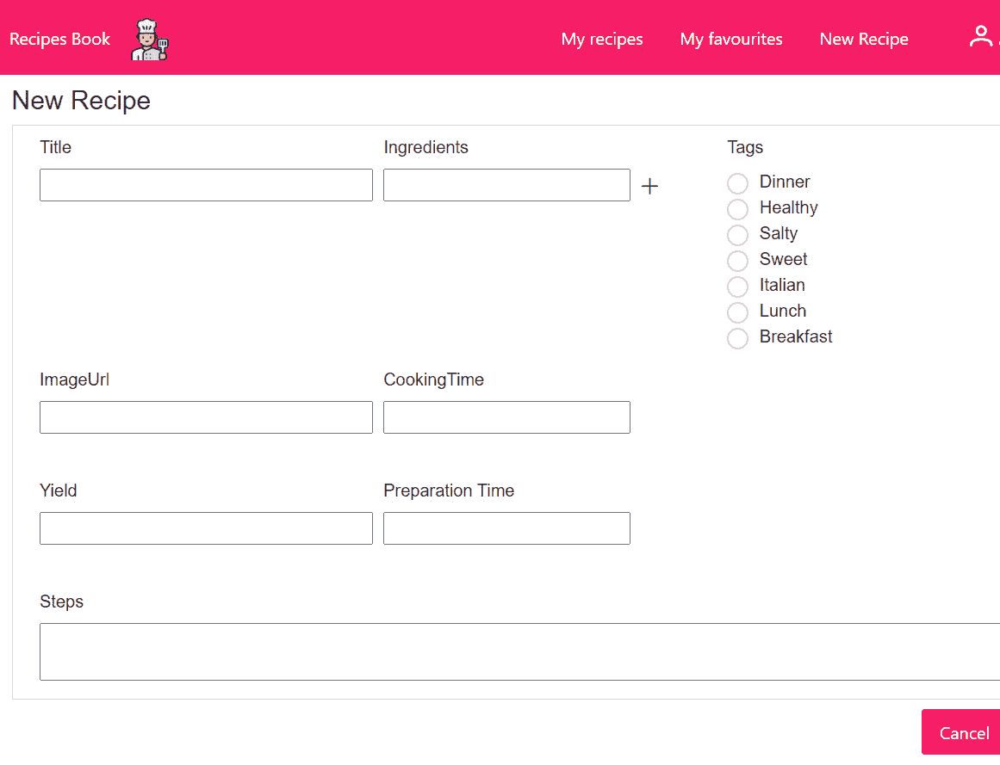
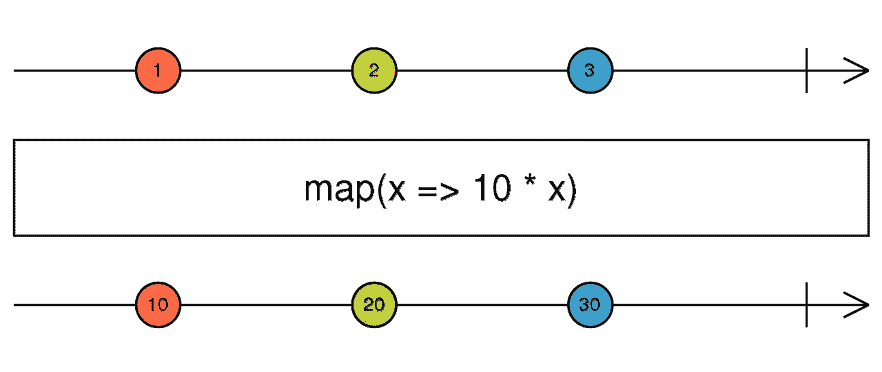
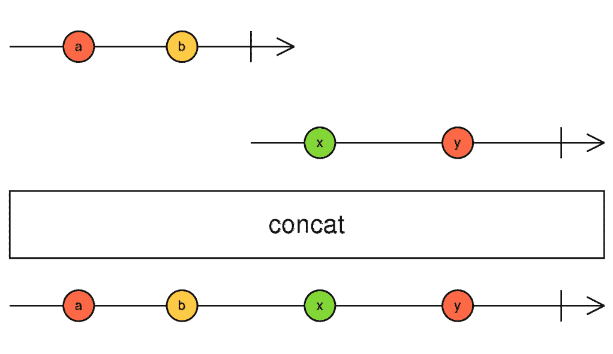
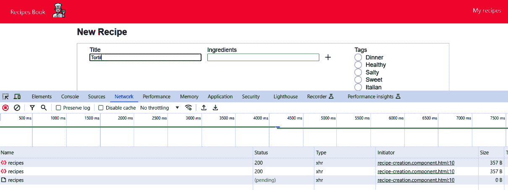
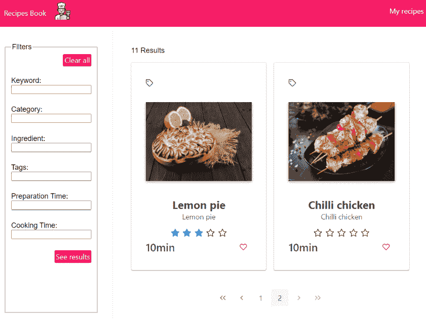
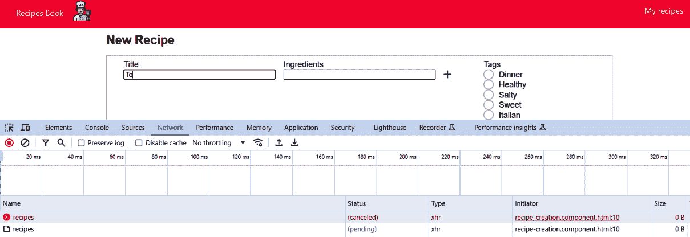
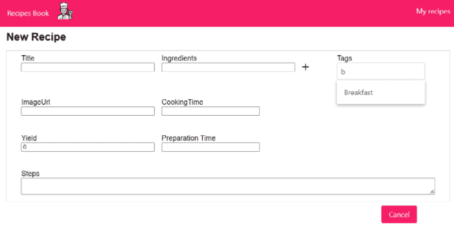
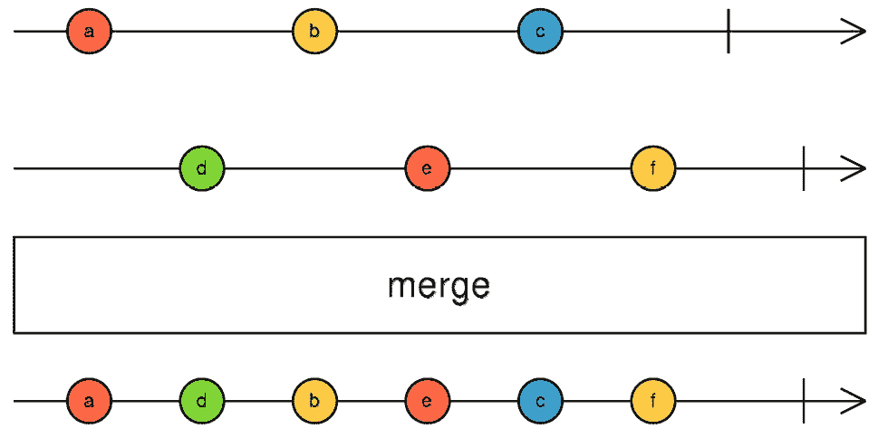
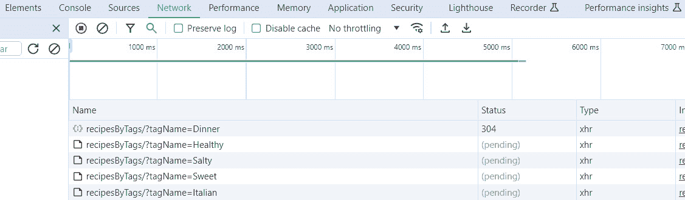
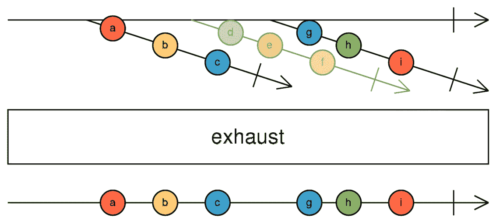

# 6

# 转换流

在处理流时，您将面临的最常见用例之一是需要将某些值的流转换为其他值的流。这正是本章的主题。

本章围绕向我们的项目添加自动保存功能展开，我们将通过转换流来解决。首先，我们将解释我们将要在食谱应用中实现的自定义保存需求。然后，我们将探索实现此功能的命令式方法。之后，我们将了解实现此功能的声明式模式，并研究在此情况下最常用的 RxJS 转换操作符。

最后，我们将深入研究 RxJS 提供的不同转换操作符及其相应的用例，通过实际示例丰富我们的理解。

因此，在本章中，我们将涵盖以下主要内容：

+   定义自动保存需求

+   探索自动保存功能的命令式模式

+   探索自动保存功能的声明式模式

# 技术要求

本章假设您对 RxJS 有基本的了解。

更多关于响应式表单的详细信息，请参阅[`angular.dev/guide/forms/reactive-forms`](https://angular.dev/guide/forms/reactive-forms)。

为了演示目的，我们将使用一个假自动保存服务。其实现可在本书 GitHub 仓库的`recipes-book-api`模块中找到。请注意，我们不会详细介绍这个服务，因为重点不是项目的后端。

本章的源代码可在[`github.com/PacktPublishing/Reactive-Patterns-with-RxJS-and-Angular-Signals-Second-Edition/tree/main/Chap06`](https://github.com/PacktPublishing/Reactive-Patterns-with-RxJS-and-Angular-Signals-Second-Edition/tree/main/Chap06)找到。

# 定义自动保存需求

如*第二章*中“浏览我们的应用”部分的*视图 2 – 新食谱界面*所述，用户可以通过点击**新食谱**菜单项来添加新食谱。这将显示以下需要填写的表单：



图 6.1 – 新食谱表单

负责显示`RecipeCreationComponent`的独立组件，可在`recipes-book-front\src\app\recipe-creation`下找到。

在这里，我们想要实现自动保存行为，这包括自动将用户更改以表单形式存储。在这个例子中，我们将把表单更改存储在后端，以便用户在断开连接、超时或其他问题后随时检索最后更改——这个功能通过防止数据丢失来提高用户体验。

既然我们已经理解了需求，让我们看看实现自动保存功能的命令式方法。

# 探索自动保存功能的命令式模式

我们使用了 Angular 响应式表单来构建`valueChanges` Observable 以跟踪`FormControl`的变化。这使得我们的实现更加简单，因为我们想监听表单值的变化，以便在每次变化时执行保存操作。

您可以在`recipe-creation.component.html`文件模板中找到 HTML 代码。然后，在`recipe-creation.component.ts`中，我们可以定义表单如下：

```js
export class RecipeCreationComponent implements OnInit {
  constructor(private formBuilder: FormBuilder) { }
  recipeForm = this.formBuilder.group<Recipe>({
    id: Math.floor(1000 + Math.random() * 9000),
    title: '',
    ingredients: '',
    tags: '',
    imageUrl: '',
    cookingTime: undefined,
    yield: 0,
    prepTime: undefined,
    steps: '',
  });
  tags = recipeTags.TAGS;
```

在这里，我们使用了 Angular 的`FormBuilder` API 来构建响应式表单，并将其传递给一个 JSON 对象，在该对象中我们定义了表单的不同字段。这个 JSON 对象代表了我们的食谱数据；我们稍后会保存这个数据。每次我们打开**新食谱**表单时，都会创建一个新的空对象。

注意，这个 JSON 对象的第一属性`id`在表单中不会显示。我们只添加它来初始化新的`Recipe`对象，并使用随机标识符来正确地在后端保存食谱数据。`tags`属性是从`src/app/core/model/tags.ts`中声明的常量检索的，它代表了可用的静态标签列表。

现在我们已经准备好了表单，让我们看看如何实现自动保存功能。首先想到的是在`RecipeCreationComponent`的`ngOninit()`实例中订阅`recipeForm`的`valueChanges` Observable。然后，每次`valueChanges` Observable 发出新的表单值时，我们应该发起一个保存请求来保存表单的最新值。我们可以这样做：

```js
ngOnInit(): void {
    this.recipeForm.valueChanges.subscribe(
      formValue => {
        this.service.saveRecipe(<Recipe>formValue);
      }
    );
```

然后，在`RecipeService`中定义并实现了`saveRecipe`方法，如下所示：

```js
saveRecipe(formValue: Recipe) : Observable<Recipe>  {
  return this.http.post<Recipe>(`${BASE_PATH}/recipes`,
    formValue);
}
```

在这里，我们使用了`HTTPClient` API 并调用了后端的保存服务。

注意

本书不关注后端实现。因此，我们在`recipes-book-api`项目中提供了一个 POST 保存服务的模拟实现。在这里，目标是模拟对 HTTP 请求的调用以保存数据。

因此，总结一下，`RecipeCreationComponent`的代码将如下所示：

```js
export class RecipeCreationComponent implements OnInit {
  constructor(private formBuilder: FormBuilder, private
  service: RecipesService) { }
  recipeForm = this.formBuilder.group<Recipe>({
    id: Math.floor(1000 + Math.random() * 9000),
    title: '',
    ingredients: '',
    tags: '',
    imageUrl: '',
    cookingTime: undefined,
    yield: 0,
    prepTime: undefined,
    steps: '',
  });
  tags = recipeTags.TAGS;
  ngOnInit(): void {
    this.recipeForm.valueChanges
      .subscribe(
        formValue => {
          this.service.saveRecipe(<Recipe>formValue);
        }
      );
  }
}
```

然而，这段代码不会工作。您现在应该知道，`this.service.saveRecipe(<Recipe>formValue)`的结果，它调用`this.http.post<Recipe>(`${BASE_PATH}/recipes`, formValue)`，是一个 Observable，由于 Observables 是懒加载的，我们应该订阅`this.service.saveRecipe(<Recipe>formValue)`来初始化 HTTP POST 请求。所以，让我们添加一个`subscribe`值，如下所示：

```js
ngOnInit(): void {
    this.recipeForm.valueChanges.subscribe(
      formValue => {
        this.service.saveRecipe(<Recipe>formValue)
          .subscribe(
            result => this.saveSuccess(result),
            errors => this.handleErrors(errors)
          );
      }
    );
```

如您可能已经注意到的，我们在另一个`subscribe`内部调用了一个`subscribe`值，这被称为嵌套订阅。然而，这在 RxJS 中被认为是一种反模式，并且存在几个问题：

+   每次我们使用`subscribe()`时，我们打开了命令式代码的大门。正如我们在这本书中学到的，我们应该尽可能避免这样做。

+   嵌套订阅需要仔细清理；否则，我们可能会遇到各种性能问题。在上一个例子中，我们没有清理订阅，这意味着可能会出现严重的时序问题。如果有多个表单值连续由`valueChanges`发出，将并行发送许多保存请求。如果请求需要一些时间来完成，无法保证后端会按顺序处理保存请求。例如，我们无法确保最后一个有效的表单值是已保存到后端的那一个。因此，我们最终会得到不一致的数据。

我们想要做的是在先前的请求完成后执行保存请求。幸运的是，RxJS 包括一些有趣的操作符，可以为我们解决这个问题。所以，无需多言，在接下来的部分，我们将学习如何以响应式和声明式的方式实现这一点。

# 探索自动保存功能的响应式模式

你还记得第五章中的黄金法则，对吧？我们应该把所有东西都看作是一个流。所以，让我们首先识别我们的流。

在这里，我们可以将保存操作看作是一个流——它是`this.service.saveRecipe(<Recipe>formValue)`方法的结果，该方法调用`this.http.post<Recipe>(`${BASE_PATH}/recipes`, formValue)`。我们将称之为`saveRecipe$`。

`saveRecipe$`可观察对象负责在后台保存数据，并在订阅时初始化`http`请求。

为了避免嵌套订阅，在这种情况下我们可以将`valueChanges`可观察对象发出的表单值映射或转换成`saveRecipe$`可观察对象。结果是我们要称之为高阶可观察对象的东西。

不清楚？不用担心——我们将在下一节中详细解释。

## 高阶可观察对象

那么，什么是高阶可观察对象？一个**高阶可观察对象**就像其他任何可观察对象一样，但它的值也是可观察对象。所以，它不是发出简单的值，如字符串、数字或数组，而是发出你可以单独订阅的可观察对象。

好吧，但它在什么时候有用？你可以在使用一个可观察对象发出的数据来发出另一个可观察对象时创建高阶可观察对象。在我们的例子中，对于`valueChanges`可观察对象发出的每个表单值，我们想要发出`saveRecipe$`可观察对象。换句话说，我们想要将表单值转换（或映射）到`saveRecipe$`可观察对象。这将创建一个高阶可观察对象，其中每个值代表一个保存请求。

在这种情况下，`valueChanges`可观察对象被称为外部可观察对象，而`saveRecipe$`被称为内部可观察对象。在底层，我们想要订阅每个发出的`saveRecipe$`可观察对象并一次性接收响应，以避免嵌套处理。

现在我们已经了解了高阶可观察对象是什么以及何时使用它们，让我们来看看高阶映射操作符。

## 高阶映射操作符

要转换外部 Observable，我们应该使用高阶映射操作符。这些操作符的作用是将外部 Observable 的每个值映射到一个新的内部 Observable，并自动订阅和取消订阅该内部 Observable。

但常规映射和高阶映射之间有什么区别呢？

好吧，常规映射涉及将一个值映射到另一个值。最常用的基本映射操作符之一是 `map` 操作符：



图 6.2 – 地图操作符 – 琥珀图

如此琥珀图所述，地图操作符将通过将每个发出的值乘以 10 来转换输入流的值。这里，`x=>10*x` 是转换函数。

另一方面，高阶映射是关于将一个值映射到一个 Observable。

RxJS 提供了几个高阶映射操作符。在下一节中，我们将学习 `concatMap()` 操作符——我们将使用它来实现自动保存行为——然后再了解一些其他常用操作符。

### concatMap 操作符

`concatMap` 是连接策略和高阶映射的组合：

*concatMap = concat (连接) + map (高阶映射)*

在上一节中，我们探讨了常规和高阶映射的概念，现在让我们通过以下琥珀图来了解连接策略，以 `concat` 操作符为例：



图 6.3 – concat 操作符 – 琥珀图

让我们分解一下琥珀图：

+   第一行表示传递给 `concat` 操作符的第一个 Observable 的时间线。

+   第二行表示传递给 `concat` 操作符的第二个 Observable 的时间线。

+   在此示例中，`concat` 操作符有两个输入。它将订阅第一个 Observable，但不会订阅第二个。第一个 Observable 将发出值 **a** 和 **b**，这些值将反映在结果 Observable（最后一行）中。

+   然后，第一个 Observable 完成，此时，`concat` 操作符订阅第二个 Observable。这就是保证顺序过程的方式。

+   第二个 Observable 将发出值 **x** 和 **y**，这些值将反映在结果 Observable 中。

+   当第二个 Observable 完成，输出 Observable 也会完成。

正如你可能注意到的，Observable 连接完全是关于 Observable 完成的。这是关键点。它发出第一个 Observable 的值，等待它完成，然后发出下一个 Observable 的值，依此类推，直到所有 Observable 都完成。

现在我们理解了连接策略，我们可以理解`concatMap`运算符是如何结合高阶映射和 Observable 连接的：它在处理下一个之前等待每个内部 Observable 完成。它就像在票务柜台排队，每个客户（Observable）在下一个被叫到之前等待他们的服务。

#### 使用 concatMap 进行自动保存

根据之前的讨论，`concatMap`运算符非常适合我们的自动保存需求，原因如下：

+   我们希望将表单值转换为`saveRecipe$` Observable，并自动订阅和取消订阅`saveRecipe$`内部 Observable - 这就是高阶映射操作所做的事情。

+   我们只想在完成上一个请求后执行保存请求。当一个 HTTP 保存请求正在进行时，在此期间到达的其他请求应该在被调用之前等待其完成，以确保顺序性。因此，我们需要将`saveRecipe$` Observables 连接起来。

这就是我们的代码将看起来像这样：

```js
  valueChanges$ = this.recipeForm.valueChanges.pipe(
    concatMap(formValue =>
      this.service.saveRecipe(<Recipe>formValue)),
    catchError(errors => of(errors)),
    tap(result => this.saveSuccess(result))
  );
```

让我们分解一下正在发生的事情：

+   在这里，外部 Observable `this.recipeForm.valueChanges`发出表单值。对于每个发出的表单值，`concatMap`将其转换为`this.service.saveRecipe(<Recipe>formValue)`，这是`saveRecipe$` Observable - 我们的内部 Observable。

+   `concatMap`自动订阅内部 Observable，并将发出 HTTP POST 请求。

+   另一个表单值可能比在后台保存上一个表单值所需的时间更快。在这种情况下，表单值将不会映射到`saveRecipe$` Observable。相反，`concatMap`将等待之前的保存请求返回响应并完成它，然后再将新的表单值转换为`saveRecipe$`，订阅它，并发送新的保存请求。当所有内部 Observable 完成时，结果流完成。

+   然后，我们使用`catchError`运算符来处理错误，并使用`tap`运算符注册副作用以在后台记录`Saved successfully`消息。当然，您可以自定义此操作，并向最终用户显示一条消息。

总结一下，`RecipeCreationComponent`的完整代码现在将看起来像这样：

```js
export class RecipeCreationComponent {
  constructor(private formBuilder: FormBuilder, private
  service: RecipesService) { }
  recipeForm = this.formBuilder.group<Recipe>({
    id: Math.floor(1000 + Math.random() * 9000),
    title: '',
    ingredients: '',
    tags: '',
    imageUrl: '',
    cookingTime: undefined,
    yield: 0,
    prepTime: undefined,
    steps: '',
  });
  tags = recipeTags.TAGS;
  valueChanges$ = this.recipeForm.valueChanges.pipe(
    concatMap(formValue =>
      this.service.saveRecipe(<Recipe>formValue)),
    catchError(errors => of(errors)),
    tap(result => this.saveSuccess(result))
  );
  saveSuccess(_result: Recipe) {
    console.log('Saved successfully');
  }
}
```

现在，只剩下一件事要做：我们应该订阅`valueChanges$` Observable 以使所有这些工作。像往常一样，我们将在`RecipeCreationComponent` HTML 模板中的异步管道中这样做，如下所示：

```js
<ng-container *ngIf="valueChanges$ | async">
  </ng-container>
/** All the form code here**/
```

这样，响应式实现就完成了。

如您可能已经注意到的，使用`concatMap`的第一个好处是我们不再有嵌套订阅。由于异步管道，我们还消除了显式订阅。除此之外，所有表单值都将按顺序发送到后端。

当后端保存服务（我在提供的保存食谱服务实现中默认设置）引入延迟时，你会注意到在另一个请求仍在处理时不会发起请求。相反，它们会等待当前请求完成后才被触发。这正是`concatMap`旨在实现的效果。

现在，让我们看看`concatMap`在 Chrome DevTools **网络**标签页中表现出的行为：



图 6.4 – concatMap 网络请求

在这里，在输入一个字符后，会向服务器发送一个 POST 保存请求。当尝试在初始请求之前输入其他字符时，会收到响应。你会注意到请求不是立即触发的；它们被排队，并在前一个请求完成后按顺序执行。

我们的示例直接说明了`concatMap`操作符的工作原理。然而，我们可以进一步优化我们的实现，以避免为用户输入的每个字符发送请求。为此，我们可以使用`debounceTime(waitingTime)`操作符等待用户输入稳定后再发送请求。我们还可以通过忽略重复项并让`distinctUntilChanged()`操作符处理无效值来进一步优化它。

注意

关于`debounceTime`和`distinctUntilChanged`操作符的更多详细信息，请参阅[`rxjs.dev/api/operators/debounceTime`](https://rxjs.dev/api/operators/debounceTime)和[`rxjs.dev/api/operators/distinctUntilChanged`](https://rxjs.dev/api/operators/distinctUntilChanged)。

#### 使用 concatMap 进行分页

除了自动保存，我们还可以使用`concatMap`进行列表分页。在我们的食谱应用中，我们在客户端处理食谱列表的分页 – 当加载`RecipesListComponent`时，我们通过向`/api/recipes`服务发送`GET`请求来检索所有食谱，如*第三章*中所述，*作为流获取数据*。

然而，如果我们处理的是一个懒加载机制，在组件初始加载时只获取少量项目（比如说 10 个），然后在用户点击**下一页**或**上一页**按钮时按需加载更多项目，如图所示，我们需要调整我们的逻辑：



图 6.5 – 食谱列表分页

这将涉及发送一个`GET` HTTP 请求来获取下一页的数据，使用类似于`GET /api/recipes?page=1&limit=10`的 URL 结构。

在这种情况下，`concatMap`是一个很好的选项来为每个发出的“下一页”事件发起请求，如下所示：

```js
recipes$ = this.pageNumberChange$.pipe(
    concatMap((pageNumber) =>
      this.http.get<Recipe[]>(`${BASE_PATH}/recipes`, {
        params: {
          page: pageNumber,
          limit: 10,
        },
      })
    )
  );
```

在这里，`pageNumberChange$` 是一个 `BehaviorSubject` 主题，当用户点击 `concatMap` 时，它会发射当前的页面编号，然后触发后续的 HTTP GET 请求，按顺序获取基于当前页面编号和大小限制参数的下一页列表。这种顺序处理确保了数据完整性和系统化的分页流程。

总结一下，当你想确保操作按顺序处理，并且每个内部 Observable 都一次按顺序处理时，`concatMap` 是理想的选择。然而，当使用 `concatMap` 时，重要的是要确保内部 Observable 完成，因为 `concatMap` 等待每个内部 Observable 完成后才订阅序列中的下一个 Observable。如果一个内部 Observable 永远不完成，`concatMap` 也不会订阅序列中的后续 Observable。这可能导致阻塞后续发射，并可能导致挂起的 Observable 堆积，从而引发潜在的内存泄漏或性能问题。因此，永远不要为无限流使用 `concatMap`。

重要的是要注意，并非所有高阶映射操作符都遵循 `concat` 策略。还有其他高阶映射操作符，如 `switch`、`merge` 和 `exhaust`，它们提供不同的策略，并在许多情况下很有用。我们将在以下部分中分析这些操作符及其相应的策略。

### The switchMap operator

`switchMap` 是 switch 和转换（或映射）策略的组合：

*switchMap = switch(switch) + map（高阶映射）*

让我们看看 `switch` 操作符的弹珠图，以了解 switch 策略：


图 6.6 – `switch` 操作符 – 弹珠图

让我们分析一下这里发生的事情（我知道你们不习惯看到那些对角线，我知道！）：

+   顶部行是高阶 Observable。高阶 Observable 发射第一个内部 Observable（具有值 **a**、**b**、**c** 和 **d**）。`switch` 操作符在幕后订阅它。

+   第一个内部 Observable 发射值 **a** 和 **b**，并且它们会自动反射到结果 Observable 中。

+   然后，高阶 Observable 发射第二个内部 Observable（具有值 **e**、**f** 和 **g**）。

+   `switch` 将取消订阅第一个内部 Observable（**a**-**b**-**c**-**d**）并订阅第二个内部 Observable（**e**-**f**-**g**）；这就是为什么 **e**、**f** 和 **g** 的值在 **a** 和 **b** 之后立即反映出来。正如你可能已经注意到的，在切换过程中，如果一个新的 Observable 开始发射值，那么 `switch` 将订阅新的 Observable 并取消订阅之前的那个。

因此，`switchMap`运算符是一个高阶映射运算符，它会取消订阅任何先前的内部 Observable，并切换到任何新的内部 Observable。当你想要在触发新操作时取消操作时，它非常有用。换句话说，`switchMap`只关注最新的数据，确保在取消由先前数据触发的任何正在进行的操作的同时，只处理最新的更新。

将`switchMap`想象成切换电视频道：每次你按按钮，你都会切换到不同的频道，忽略之前正在播放的内容。同样，`switchMap`允许你在源发射时动态切换到新的 Observable 流，丢弃之前发射的任何正在进行的处理。

#### 使用`switchMap`进行自动保存

回到我们在食谱应用中的自动保存响应式实现，如果你想要保存最新的表单值，并且希望在当前操作完成之前启动新的操作时取消任何正在进行的保存操作，那么`switchMap`就是你要使用的运算符（而不是`concatMap`）：

```js
valueChanges$ = this.recipeForm.valueChanges.pipe(
    switchMap(formValue =>
      this.service.saveRecipe(<Recipe>formValue)),
    catchError(errors => of(errors)),
    tap(result => this.saveSuccess(result))
  );
```

如前所述，我在后端保存服务中引入了轻微的延迟，以说明当并发提交后续请求时，如何处理正在进行的请求。因此，当检查网络控制台时，你会注意到以下情况：



图 6.7 – switchMap 网络请求

在这里，我们有两个请求：一个是标记为**已取消**，另一个是**挂起**。挂起的请求是最新的一个，这表明它在先前的请求仍在进行时被发起，导致先前的请求被取消。这正是我们想要的行为。

在这个例子中，我们正在发送一个 HTTP POST 请求，但我们只对成功或失败状态感兴趣，不需要从响应中获取任何其他数据。然而，如果你期望从 POST 请求中获取响应以更新 UI 或执行任务，请记住，**只有最新请求的响应将被传播**。在这种情况下，最好使用`concatMap`。

#### 使用`switchMap`进行自动完成

现在，让我们探索使用`switchMap`的另一个实际场景：自动完成建议。这是网络应用程序中一个非常常见的功能。在我们的食谱应用中，我们将实现`RecipeCreationComponent`中`tags`字段的自动完成下拉菜单。目前，该字段以单选按钮的形式显示，其静态值是从`src/app/core/model/tags.ts`中定义的常量标签检索的。然而，我们将将其转换为一个用户友好的自动完成下拉菜单，该菜单根据用户的输入动态获取标签建议。

当用户键入查询时，我们将从后端服务检索相应的标签。我们已经在我们的现成后端中实现了该服务 – 那就是我们的 `recipes-book-api`。此服务有一个名为 `/api/tags` 的端点，接受一些标准（用户的输入）作为查询参数，并返回与提供的标准匹配的标签列表。代码可在本书的 GitHub 仓库中找到。

让我们深入了解实现细节。首先，让我们准备我们的流。我们有多少个流？我们有两个：

+   一个名为 `searchTerms` 的流，它发出用户输入，由一个初始化为空字符串的 `BehaviorSubject` 主题表示：

    ```js
    private searchTerms = new BehaviorSubject<string>('');
    ```

    我们将使用 `update` 方法来更新此流，每当用户输入更改时：

    ```js
        updateSearchTerm(searchTerm: string) {
          this.searchTerms.next(searchTerm);
        }
    ```

    `searchTerms` 流和 `updateSearchTerm` 方法将在 `RecipeCreationComponent` 中可用。

+   一个名为 `getTags$` 的流，它发出与用户输入匹配的检索到的标签。我们将在 `RecipesService` 中定义此流，如下所示：

    ```js
      getTags$: (term: string) => Observable<Tag[]> =
      (term: string) => {
        return this.http.get<Tag[]>(`${BASE_PATH}/tags`,
          {  params: { criteria: term }  });
      };
    ```

    `getTags$` 代表一个函数，它接受一个字符串参数 `term`，并返回一个 `Tag[]` 类型的可观察对象，该对象发出一个 HTTP GET 请求以检索与提供的搜索词匹配的 `Tag` 对象数组。

    我们在 `\src\app\core\model\tags.ts` 中定义了 `Tag` 类型。

现在，是时候使用 `switchMap` 了，它将映射 `searchTerms` 流发出的每个值到 `getTags$` 可观察对象：

```js
tagValues$ = this.searchTerms.pipe(
distinctUntilChanged(), // ignore if next search term is
                           same as previous
switchMap((term: string) => this.service.getTags$(term))
// switch to new Observable each time
  );
```

我们将在 `RecipeCreationComponent` 中定义 `tagValues$`。所以，总的来说，`tagValues$` 为每个唯一的用户输入发出搜索请求，并确保只显示最新的搜索结果，丢弃之前的搜索结果。

最后，我们将更新 `RecipeCreationComponent` 的 HTML 模板，以修改显示标签的方式，从单选按钮更改为自动完成下拉菜单：

```js
  <div class="col-3">
      <label for="Tags">Tags</label>
      @if (tagValues$ | async; as tags) {
          <p-autoComplete formControlName="tags"
          [suggestions]="tags"
          (completeMethod)=
          "updateSearchTerm($event.query)"
          field="name"></p-autoComplete>
      }
  </div>
```

在这里，我们使用异步管道订阅了 `tagValues$`，并将发出的值存储在 `tags` 数组中。然后，我们使用了 PrimeNG 自动完成组件来提供在用户在 `"Tags"` 输入字段中输入时的建议。自动完成组件绑定到一个名为 `"tags"` 的表单控件，从 `tags` 数组接收建议，并在用户开始输入时触发 `updateSearchTerm` 方法，使用户的查询。`concatMap` 将为每个唯一的用户输入发出 GET 请求，并确保只显示最新的搜索结果，取消之前的请求。

就这样！以下是我们实现行为的说明。在这里，当我们搜索字段中输入 **B** 时，我们收到 **Breakfast** 的建议：



图 6.8 – 自动完成建议

现在，让我们继续介绍另一个操作符，`mergeMap`。

### 合并映射操作符

`mergeMap` 是合并和转换（或映射）策略的组合：

*`mergeMap = merge(merge) + map (高阶映射)*

现在你已经理解了高阶映射的概念，让我们通过查看以下考虑 `merge` 操作符的玛瑙图来了解合并策略：



图 6.9 – 合并操作符 – 玛瑙图

与 `concat` 不同，`merge` 不会等待可观察对象完成再订阅下一个可观察对象。它同时订阅每个内部可观察对象，然后将值输出到组合结果中。如这个玛瑙图所示，输入可观察对象的值会立即反映在输出中。结果只有在所有合并的可观察对象都完成后才会完成。

`mergeMap` 是一个高阶映射操作符，它并行处理每个内部可观察对象。这就像厨房中的多任务处理，你同时处理不同的烹饪任务，如切菜、煮菜和搅拌，所有这些同时进行。然而，只有当结果顺序不重要时才应使用 `mergeMap`，因为这些请求可能会以不同的顺序处理。

假设我们旨在检索匹配特定标签的食谱列表。对于每个标签，我们想要发起一个 HTTP 请求以获取该标签对应的食谱。标签请求的顺序不重要；所有请求都应并发执行。以下是代码：

```js
  selectedTags$ = from(['Salty', 'Sweet', 'Healthy']);
  recipesByTag$ = this.selectedTags$.pipe(
    mergeMap(tag =>
      this.getRecipesByTag(tag)),mergeAll(),toArray());
  getRecipesByTag(name: string): Observable<Recipe[]> {
    return this.http.get<Recipe[]>(
      `${BASE_PATH}/recipesByTags`, { params: { tagName:
        name } });
  }
```

在这里，我们从一个静态的标签数组中创建了一个名为 `selectedTags$` 的可观察对象。`selectedTags$` 逐个发出标签（数组元素）。每当 `selectedTags$` 发出一个标签时，`this.getRecipesByTag(tagName)` 就会发出一个 HTTP 请求以获取相应的食谱。`mergeMap` 操作符用于并发处理多个标签请求。当另一个标签在之前的请求仍在进行时发出，新的请求将并发执行。

我们使用了 `mergeAll` 操作符将来自不同内部可观察对象的结果扁平化到一个单一的观察者流中。这确保了每个内部可观察对象发出的食谱被合并成一个连贯的食谱流。

最后，使用 `toArray` 操作符将所有发出的食谱转换成一个单一的数组，这使得在 UI 中进行列表显示变得方便。

再次，我之前向按标签返回食谱的后端服务添加了延迟。打开控制台后，我们会发现所有请求都是并发运行的，即使有挂起的请求：



图 6.10 – mergeMap 的执行

我们还可以使用 `mergeMap` 并行从多个来源获取数据并合并结果。想象一下，我们有多个针对食谱的评论来源，我们想要收集它们（在这种情况下，顺序并不重要）。以下是代码：

```js
  getRecipesReviews(recipeId: number): Observable<Review[]>
  {
    return from([`${BASE_PATH}/source1/reviews`,
    `${BASE_PATH}/source2/reviews`])
      .pipe(
        mergeMap((endpoint) => this.http.get<Review[]>(
          endpoint, { params: { recipeId: recipeId } })));
  }
```

在这里，`getRecipesReviews(recipeId: number)` 是一个方法，它通过向每个来源（`source1` 和 `source2`）发出并行的 HTTP GET 请求，从两个不同的来源获取由 `recipeId` 标识的菜谱的评论。

`from([${BASE_PATH}/source1/reviews, ${BASE_PATH}/source2/reviews])` 这一行从一个包含两个不同端点的数组创建了一个 Observable，用于获取评论。`from` 操作符将数组中的每个项目作为 Observable 序列中的单独值发出。

然后，使用 `mergeMap` 发起一个 GET 请求以获取每个由 `from` 操作符发出的端点指定的 `recipeId` 的评论，确保这两个请求是并发执行的。

有了这些，让我们继续讨论最后一个我们将要讨论的操作符，`exhaustMap`。

### 排放 Map 操作符

`exhaustMap` 是排放和转换（或映射）策略的组合：

*exhaustMap = exhaust(exhaust) + map ()**高阶映射**

让我们看看这个水晶图来理解排放策略：



图 6.11 – 排放操作符 – 水晶图

顶部行是一个高阶 Observable，它在一段时间内产生三个内部 Observable。当第一个内部 Observable（`exhaust` 将会订阅它，以便 `exhaust` 操作符的值；它不会被订阅（这是 `exhaust` 的关键部分）。

只有当第一个内部 Observable 完成时，`exhaust` 才会订阅新的 Observable。因此，`exhaust` 现在准备好处理其他 Observable。此时，第三个内部 Observable 出现。切换将订阅第三个内部 Observable 的值，**g**-**h**-**i** 的值反映在输出中。

因此，`exhaustMap` 等待当前内部 Observable 完成后再允许下一个 Observable 发射值。一旦内部 Observable 完成，`exhaustMap` 就会订阅序列中的下一个 Observable。它确保一次只有一个内部 Observable 激活，忽略在当前一个仍在进行时发出的任何新的 Observable。这在需要忽略新事件直到先前的操作完成的情况下特别有用，例如处理按钮上的用户点击，后续的点击在当前操作完成之前会被忽略。

这类似于当你忙于重要的事情时处理任务的方式。如果有人试图用新的任务来吸引你的注意力，你可能会说：“我现在很忙，请在我完成手头的事情之前不要打扰我。” `exhaustMap` 以类似的方式操作，确保在考虑新的任务之前完成当前的任务。

让我们考虑在我们的菜谱应用中的一个场景，用户可以编辑菜谱详情并通过 `exhaustMap` 在这里很有用，因为它会忽略后续的保存请求，直到当前的保存操作完成。以下是实现方式：

```js
  private saveClick = new Subject<Boolean>();
  private saveRecipe$ =
    this.service.saveRecipe(<Recipe>this.recipeForm.value);
  saveClick$ = this.saveClick.pipe(exhaustMap(() =>
    this.service.saveRecipe(<Recipe>this.recipeForm.value))
  );
  saveRecipe() {
    this.saveClick.next(true);
  }
```

在负责编辑菜谱的组件中，我们定义了以下内容：

+   一个私有的 `saveClick` 主题，用于跟踪 `saveClick` 代表我们的第一个流。

+   一个私有的 `saveRecipe$` Observable，它发出 HTTP 保存请求以保存食谱。

+   `saveClick$`，我们的第二个流，它监听 `saveClick` 发射并使用 `exhaustMap` 操作符在先前的请求完成后才发出新的保存请求。

+   一个 `saveRecipe` 方法。当 `saveClick` 主题的值为 `true` 时，将调用此方法。

最后，我们必须在 HTML 模板中使用异步管道订阅 `saveClick$`，并将点击处理程序添加到 `saveRecipe` 方法中，如下所示：

```js
<ng-container *ngIf="saveClick$ | async"></ng-container>
<p-button class="recipe-button" (click)="saveRecipe()"
label="Save"></p-button>
```

这确保了一次只处理一个保存请求，防止重复条目或数据损坏。您可以在 `RecipeCreationComponent` 中测试此代码。

您还可以在拖放功能中使用 `exhaustMap`，以确保只有在用户的拖动动作完成后才处理操作，防止同时触发多个操作。

### 总结操作符

让我们总结一下本章中提到的所有操作符：

+   如果顺序很重要，并且您需要在等待完成时按顺序处理操作，那么 `concatMap` 是正确的选择

+   如果顺序不重要，并且您需要并行处理操作以提高性能，则 `mergeMap` 是最佳操作符

+   如果您需要添加取消逻辑来释放资源并始终获取最新信息，那么 `switchMap` 是正确的选择

+   要在当前 Observables 仍在进行时忽略新的 Observables，请使用 `exhaustMap`

您需要做的只是根据您的特定用例选择正确的操作符。

# 摘要

在本章中，我们首先展示了在食谱应用中实现自动保存功能的传统、命令式方法。然而，我们很快遇到了这种方法的一些局限性。在探索更反应式模式来应对这些挑战之前，我们强调了这些问题。

然后，我们深入研究了高阶 Observables 和高阶映射操作符，学习了 `concatMap` 操作符的工作原理以及它如何帮助我们以反应式方式实现食谱应用中的自动保存要求。

此外，我们还扩展了我们的探索，包括其他策略，即 `merge`、`switch` 和 `exhaust` 高阶映射操作符。我们通过使用实际示例和用例来解释它们的功能，以更深入地理解这些概念。

在下一章中，我们将探讨另一种有用的反应式模式，允许您在组件之间共享数据。像往常一样，我们将揭示这些概念，然后学习以反应式方式实现它们。
