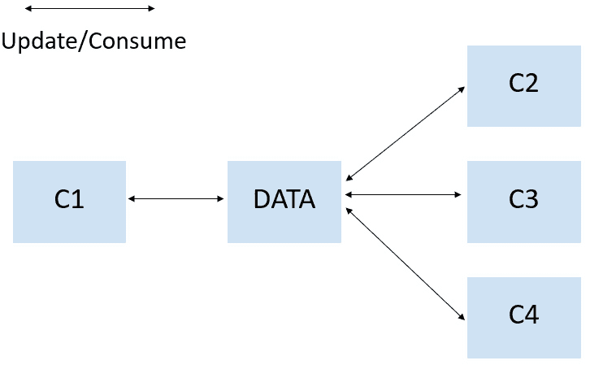
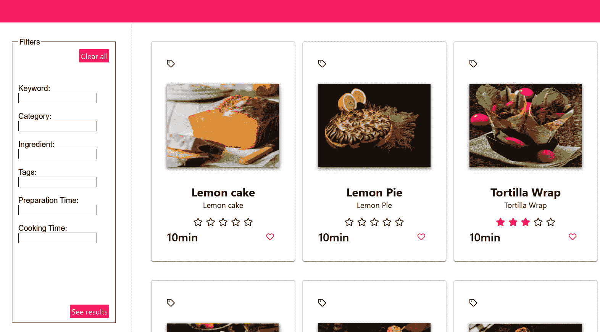

# 7

# Angular 组件之间的数据共享

在 Web 应用程序中，组件之间的数据共享是一个非常常见的用例。Angular 提供了许多在父组件和子组件之间进行通信的方法，例如流行的 `@Input()` 和 `@Output()` 装饰器模式。`@Input()` 装饰器允许父组件向其子组件提供数据，而 `@Output()` 装饰器允许子组件向父组件发送数据。这很好，但当数据需要在深度嵌套或非直接连接的组件之间共享时，这些技术变得效率低下且难以维护。

那么，在兄弟组件之间共享数据最好的方法是什么？这正是本章的核心。我们将首先解释共享数据的需求，然后逐步介绍如何在我们的应用程序中实现兄弟组件之间共享数据的响应式模式。最后，我们将介绍 Angular 的新特性可延迟视图，以最大化应用程序的性能。

在本章中，我们将涵盖以下主要内容：

+   定义共享数据需求

+   探索数据共享的响应式模式

+   利用 Angular 17 中的可延迟视图

# 技术要求

本章节假设您已经对 RxJS 有基本的了解。

本章节的源代码可在[`github.com/PacktPublishing/Reactive-Patterns-with-RxJS-and-Angular-Signals-Second-Edition/tree/main/Chap07`](https://github.com/PacktPublishing/Reactive-Patterns-with-RxJS-and-Angular-Signals-Second-Edition/tree/main/Chap07)找到。

# 定义共享数据需求

假设我们拥有四个组件 – **C1**、**C2**、**C3** 和 **C4** – 它们之间没有任何关系，并且这些组件之间共享信息 – **数据**：



图 7.1 – 组件之间的共享数据

组件可以同时更新和消费**数据**。但在任何过程中，组件都应该能够访问**数据**的最后一个值。

现在，让我们通过一个更具体的例子来使这个解释更加清晰。

在我们的食谱应用程序中，当用户点击一个食谱时，它会被选中，但我们希望所有组件都能访问用户最后选中的食谱。在这种情况下，选中的食谱代表我们的共享数据。

需要访问选中食谱的组件之一是 `RecipeDetailsComponent` 组件，因为它将显示选中食谱的详细信息。

不再赘述，在下一节中，让我们看看如何以响应式的方式使这些数据对每个人可用。

# 探索数据共享的响应式模式

Angular 服务在创建组件之间共享数据和业务逻辑的常见引用方面非常强大和高效。我们将结合 Angular 服务和 Observables – 更具体地说，`BehaviorSubject` 实例 – 来创建具有状态的、反应式服务，这将使我们能够高效地在整个应用程序中同步状态。因此，在接下来的小节中，让我们解释实现反应式模式以在无关或兄弟组件之间共享数据的步骤。

## 步骤 1 – 创建共享服务

首先，我们将使用 Angular CLI 创建一个名为 `SharedDataService` 的 Angular 服务，就像通常在 `src/app/core/services` 文件夹下做的那样：

```js
ng g s SharedData
```

注意

在这里，我们为了演示目的将服务命名为 `SharedDataService`。虽然我们确实已经有一个名为 `RecipesService` 的服务可以容纳共享数据，但本章的目的是强调数据共享的更广泛概念。因此，我们选择了一个更通用的术语。然而，在你的应用程序中，建议使用特定且描述性的名称，如 `RecipesService` 或其他准确反映服务角色和领域的名称。一个准确反映服务目的的名称对于清晰性和可维护性至关重要，尤其是在像 Angular 这样的框架中，其中约定可以指导开发者。

然后，在 `SharedDataService` 类中，我们需要创建以下内容：

+   一个名为 `selectedRecipeSubject` 的私有 `BehaviorSubject` 实例，它发出当前选定食谱的值，这代表要共享的数据：

    ```js
    private selectedRecipeSubject = new BehaviorSubject<Recipe | undefined>(undefined);
    ```

    在这里，`selectedRecipeSubject` 的类型是 `Recipe`，初始值是 `undefined`，因为最初我们没有选定任何值。

    此外，`selectedRecipeSubject` 被声明为 `private`，以确保它只能在定义它的 `SharedDataService` 内部访问，从而保护它免受外部操作。否则，任何外部进程都可以访问该属性，并随后调用下一个方法并更改发射，这是危险的。这种封装对于维护对状态的控制和防止意外更改非常重要。

+   从 `selectedRecipeSubject` 中提取的公共 Observable，命名为 `selectedRecipe$`，用于处理数据作为 Observable：

    ```js
    selectedRecipe$ = this.selectedRecipeSubject.asObservable();
    ```

    在这里，我们使用了 `Subject` 类型中可用的 `asObservable()` 方法，从 `selectedRecipeSubject` 中派生出只读 Observable。这确保了 `selectedRecipeSubject` 的发射仅在只读模式下被消费，防止外部进程更改 `selectedRecipeSubject` 的值。

+   一种名为 `updateSelectedRecipe` 的方法，用于更新共享数据，即选定的食谱：

    ```js
    updateSelectedRecipe(recipe: Recipe) {
      this.selectedRecipeSubject.next(recipe);
    }
    ```

    此方法仅在 `selectedRecipeSubject` 上调用 `next`，以通知所有订阅者作为参数传递的最后一个选定的食谱。更新选定食谱的过程将调用此方法，我们将在下一步讨论。

这是将所有部件组合在一起后的服务外观：

```js
import { Injectable } from '@angular/core';
import { BehaviorSubject } from 'rxjs';
import { Recipe } from '../model/recipe.model';
@Injectable({
  providedIn: 'root'
})
export class SharedDataService {
  private selectedRecipeSubject = new
    BehaviorSubject<Recipe | undefined>(undefined);
  selectedRecipe$ =
    this.selectedRecipeSubject.asObservable();
  updateSelectedRecipe(recipe: Recipe) {
    this.selectedRecipeSubject.next(recipe);
  }
}
```

现在我们已经通过创建我们的共享数据服务和定义将保存共享数据的行为主题来打下基础，让我们看看我们如何在下一节中更新共享数据。

## 第 2 步 - 更新最后选择的食谱

当用户在`RecipesListComponent`组件中点击其中一个食谱卡片时，我们应该更新共享的`selectedRecipe`实例。作为提醒，以下是我们`Recipe`应用程序中的食谱卡片：



图 7.2 – 食谱列表

为了在用户点击卡片时更新共享的`selectedRecipe`实例，我们需要在`RecipesListComponent` HTML 模板中结合`(click)`事件输出，这会触发`editRecipe(recipe)`方法的执行。这是所需的 HTML 代码：

```js
@if (filteredRecipes$ | async; as recipes) {
<div class="card">
    <p-dataView #dv [value]="recipes" [paginator]="true"
    [rows]="9" filterBy="name" layout="grid">
        <ng-template let-recipes pTemplate="gridItem">
            <div class="grid grid-nogutter">
                @for (recipe of recipes; track recipe) {
                <div class="col-12" style="cursor:
                    pointer;" (click)="editRecipe(recipe)"
                        class="recipe-grid-item card">
// extra code here
</div>
} @empty {
<div>There are no recipes</div>
}
            </div>
        </ng-template>
    </p-dataView>
</div>
} @else {
<div>There are no recipes</div>
}
```

在这里，`(click)`事件绑定应用于每个卡片，确保点击时调用`editRecipe(recipe)`方法以更新`selectedRecipe`实例。

在`RecipesListComponent`中，我们按照以下方式实现`editRecipe`方法：

```js
editRecipe(recipe: Recipe) {
  this.sharedService.updateSelectedRecipe(recipe);
  this.router.navigate(['/recipes/details']);
}
```

`editRecipe`方法接受所选食谱作为输入并执行两个操作：

+   它通过调用`SharedDataService`中可用的`updateSelectedRecipe(recipe:Recipe)`方法来通知`selectedRecipeSubject`，`selectedRecipe`的值已更改。因此，我们应该按照以下方式在`RecipesListComponent`中注入`SharedDataService`服务：

    ```js
    import { SharedDataService } from '../core/services/shared-data.service';
    export class RecipesListComponent implements OnInit {
      constructor(private sharedService:
      SharedDataService) {}
    }
    ```

+   它通过路由到`RecipeDetailsComponent`来显示食谱的详细信息，这是负责渲染和显示食谱详细信息的独立组件。我们在`app-routing-module.ts`文件中添加了以下路由配置：

    ```js
    import { RecipeDetailsComponent } from
    './recipe-details/recipe-details.component';
    const routes: Routes = [
      { path: 'recipes/details',
      component: RecipeDetailsComponent},
    ];
    ```

到目前为止，我们已经建立了更新共享数据值的机制。现在，剩下的只是监听共享数据并消费它。

## 第 3 步 - 消费最后选择的食谱

在`RecipeDetails`组件中，我们需要消费最后选择的食谱以便显示其详细信息。因此，我们再次需要注入`SharedDataService`并定义`selectedRecipe$` Observable——它将发出最后选择的食谱——如下所示：

```js
import { SharedDataService } from '../core/services/shared-data.service';
export class RecipeDetailsComponent {
  constructor(private sharedService: SharedDataService) { }
  selectedRecipe$ = this.sharedService.selectedRecipe$;
}
```

然后，我们将使用`RecipeDetailsComponent` HTML 模板中的`async` pipe 订阅`selectedRecipe$` Observable，以便显示所选食谱的详细信息，如下所示：

```js
@if (selectedRecipe$|async;as recipe) {
<div>
    <span> {{recipe.title}} </span>
    <span> {{recipe.steps}} </span>
    <span> {{recipe.ingredients}} </span>
</div>
}
```

就是这样——这就是你如何在应用程序中共享无关组件之间的数据的方法！

现在，我们可以在任何地方使用食谱的最新值——我们只需要将`SharedDataService`注入到需要共享数据的组件中，并订阅发出只读值的公共 Observable。例如，我们可以在`HeaderComponent`中添加以下代码以在应用程序的标题中显示最后选择的食谱的标题：

```js
@if(selectedRecipe$|async; as recipe) {
    <div>
        <span> {{recipe.title}} </span>
    </div>
}
```

如果我们在这个组件中更改共享值，所有监听共享数据的其他组件都将收到通知以更新其过程。

注意

我们在 *第五章* 中使用了这种模式，即 *结合流*，将 `RecipesFilterComponent` 中的过滤器值与 `RecipesListComponent` 实例共享，然后我们将流合并以显示过滤后的结果。

## 总结数据共享的反应式模式

总结一下，以下是步骤的总结：

+   首先，创建一个将在组件间共享的 Angular 服务。在这个服务中，定义一个私有的 `BehaviorSubject` 实例，该实例将向其订阅者发出共享值，记得指定 `BehaviorSubject` 发出的数据类型，并用共享数据的初始值初始化它。

    重要的是要注意，我们使用 `BehaviorSubject` 有两个主要原因：

    +   它允许我们将共享数据广播到多个观察者。

    +   它存储发送给其观察者的最新值，并且任何新的订阅者一旦订阅，就会立即接收到最后发出的值。

+   接下来，在共享服务中定义一个公共 Observable，以保存只读的共享值。

+   在共享服务中实现一个 `update` 方法，通过调用 `Subject` 类型的 `next` 方法来更新共享值，并将更新的值发出给订阅者。

+   在负责更新共享数据值的组件中注入共享服务，并调用服务中实现的 `update` 方法。

+   在消费共享数据值的组件中注入共享服务，并订阅服务中公开的 Observable。

这种反应式共享数据模式有许多优点：

+   它提高了无关组件之间数据共享的效率。

+   它管理可变性风险。事实上，我们只向其他消费者公开只读的提取的 Observable，并保持 `BehaviorSubject` 为私有，从而防止共享数据被订阅者修改，这可能导致数据损坏和意外行为。

+   它使得组件间的通信更加容易，因为你只需在需要的地方注入共享服务，并只关注数据的更新。

就我而言，这是在 Angular 中在无关组件之间共享数据并管理应用程序状态的最简单方法。这在许多情况下都工作得很好，但对于有大量用户交互和多个数据源的大型应用程序来说，在服务中管理状态可能会变得复杂。

在这些情况下，我们可以使用状态管理库来管理我们应用程序的状态。有许多优秀的状态管理库可以用于 Angular 的状态管理，它们都有一个共同点——它们都是建立在 RxJS Observables 之上的，状态存储在 `BehaviorSubject` 中。最受欢迎的状态管理库是 NgRx，你可以在[`ngrx.io/guide/store`](https://ngrx.io/guide/store)了解更多信息。

数据共享机制促进了不同组件之间的通信，并提高了用户体验以及应用的响应性。在结束这一章之前，我想介绍一下 Angular 17 中引入的新特性，可延迟视图，它可以补充数据共享，并有助于创建更响应和高效的程序。让我们在下一节中看看它是如何工作的。

# 利用 Angular 17 中的可延迟视图

**可延迟视图**允许你声明性地标记模板的部分为非必需的立即渲染。这就像延迟页面某些部分的渲染，以提高应用的感知性能，以及优化初始包大小和加载时间。

在许多实际场景中，延迟渲染可以帮助实现更快的加载时间，例如电子商务产品页面 – 在这个例子中，你可以最初显示必要的产品细节，然后在用户点击**阅读更多**按钮或滚动页面时懒加载额外的内容，如评论。

让我们快速看看这是如何工作的。要懒加载一个组件，你需要使用独立组件，否则延迟将不起作用。然后你想要将独立组件包裹在`@defer`块中，如下所示：

```js
@defer {
  <delayed-component />
}
```

你还可以定义延迟组件何时应该加载的条件。你可以通过使用**触发器**来实现，这些触发器指定了启动加载的事件或情况：

```js
@defer(on viewport) {
  <delayed-component />
}
```

在这里，使用`on viewport`触发器来显示当`delayed-component`进入用户浏览器窗口的视口区域时。

除了`on viewport`，还有其他可以使用的触发器，例如`on hover`，它仅在用户的鼠标悬停在延迟内容上时启动内容加载。你可以在这里找到可用的完整触发器列表：[`angular.dev/guide/defer#triggers`](https://angular.dev/guide/defer#triggers)。

此外，`@defer`块还有一些重要的子块。例如，你可以在延迟内容加载之前使用`@placeholder`子块显示替代内容，如下所示：

```js
@defer(on viewport) {
    <delayed-component />
}
@placeholder {
    <div>Placeholder text here</div>
}
```

除了`@placeholder`，`@defer`还提供了两个其他子块 – `@loading`和`@error`：

+   `@loading`块类似于`@placeholder`块，但它专门显示在准备实际内容时的内容，如加载消息。

+   当在获取或处理延迟内容时出现错误时，会显示`@error`块。这允许你在出现问题时提供友好的错误消息或替代内容。

现在，让我们看看如何在我们的食谱应用中利用延迟渲染。鉴于每个食谱的图片具有高分辨率，让我们在`RecipesListComponent` HTML 模板中延迟图片的渲染，以便它们仅在用户悬停在图片上时显示：

```js
@defer (on hover) {
    
}
@placeholder {
    <div>Hover to load the image</div>
}
```

正如您所看到的，我们在显示图像的代码块周围使用了`@defer`块，并使用了`on hover`触发器。然后我们使用`@placeholder`块指定一些在延迟内容尚未加载时应显示的文本。在这种情况下，我们在`<div>`元素中添加了文本，**悬停以加载** **图像**。

有关可延迟视图功能的更多详细信息，请参阅[`angular.dev/guide/image-optimization`](https://angular.dev/guide/image-optimization)。

# 摘要

在本章中，我们解释了组件间共享数据的动机，并学习了如何以反应式的方式实现它。首先，我们学习了如何结合 Angular 服务使用`BehaviorSubject`在无关组件之间共享数据并管理我们的应用程序状态。然后，我们强调了共享数据反应模式的优点。最后，我们探讨了 Angular 的新可延迟视图功能。

本章涵盖的特性将帮助您为您的 Web 应用程序实现一个良好的架构，使其更具反应性和性能，提高加载时间，并降低维护成本。

现在，准备好开始一段激动人心的旅程，因为在下一章中，我们将深入探讨一个全新的功能，称为 Angular 信号！我们将介绍一些使用信号的反应模式，并将它们整合到我们迄今为止所学的内容中。

# 第三部分：Angular 信号的强大之处

沉浸在激动人心的 Angular 信号世界中！

在本节中，您将发现 Angular 信号的核心功能和优势，以及通过利用 Angular 信号和 RxJS 一起解锁反应性的潜力。我们还将介绍最新的 Angular 信号改进。

本部分包括以下章节：

+   *第八章*，*使用 Angular 信号掌握反应性*
