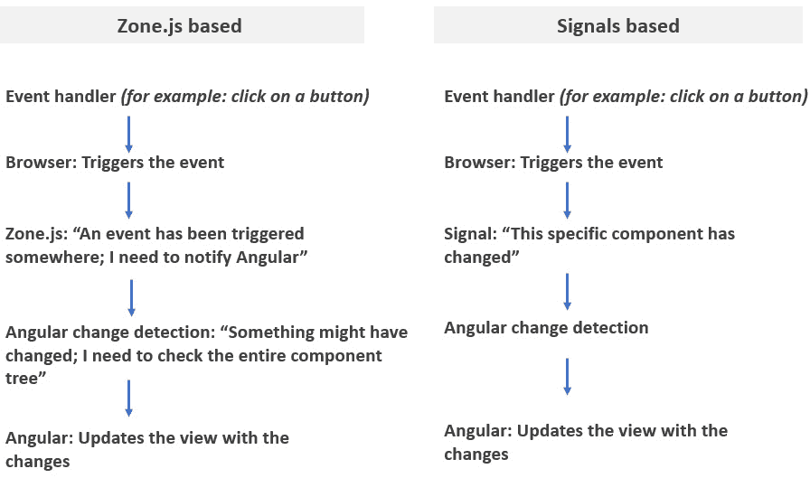

# 8

# 掌握使用 Angular Signals 的反应性

现代网络应用依赖于反应性，数据自动更改，从而触发 UI 的更新。Angular Signals 在版本 17 中引入，通过提供一种强大且简洁的方式来管理 Angular 应用程序中的反应性数据，简化了这一过程。

本章深入探讨了核心概念、API 功能、优势以及 Signals 与 RxJS 之间的关系。我们还将看到如何使用 Angular Signals 进一步提高我们的食谱应用的反应性。

因此，在本章中，我们将涵盖以下主要主题：

+   理解 Signals 背后的动机

+   揭示 Signal API

+   解锁 RxJS 和 Angular Signals 的力量

+   将 Signals 集成到我们的食谱应用中

+   使用 Signals 进行反应性数据绑定

# 技术要求

本章的源代码可在[`github.com/PacktPublishing/Reactive-Patterns-with-RxJS-and-Angular-Signals-Second-Edition/tree/main/Chap08`](https://github.com/PacktPublishing/Reactive-Patterns-with-RxJS-and-Angular-Signals-Second-Edition/tree/main/Chap08)（这仅包括与食谱应用相关的代码）找到。

# 理解 Signals 背后的动机

Angular 团队引入 Signals 的主要目标是向框架添加更多细粒度的反应性。这个基于 Signal 的反应性系统标志着框架在处理动态数据和用户交互方面的重大飞跃。它提供了一种全新的方法来检测和触发框架内的更改，取代了依赖于 Zone.js 的传统方法。

## 传统 Zone.js 方法

Angular 的传统变更检测机制假设任何事件处理程序都可能更改绑定到模板的任何数据。这就是为什么，每当您的 Angular 应用程序中发生事件时，框架都会扫描所有组件及其数据绑定，以查找任何潜在的变化。这可能有点过于强硬，尤其是在复杂的应用程序中。因此，引入了更优化的模式 `OnPush` 变更检测。此模式利用不可变性和 Observables 的概念，使 Angular 能够显著减少需要检查更新的组件数量。这在 *第三章*，*作为流获取数据* 中进行了探讨。

无论您使用默认的变更检测还是更优化的 `OnPush` 模式，Angular 仍需要在事件处理程序运行完毕后保持知情。这提出了一个挑战，因为浏览器——而不是 Angular 本身——触发了这些事件处理程序。这就是 Zone.js 发挥作用的地方，它本质上充当了一个桥梁。Zone.js 可以检测到事件处理程序的运行，告诉 Angular，“嘿，有一个新的事件；你现在可以处理任何必要的更新了。”

虽然这种方法在过去一直表现良好，但它仍然存在一些缺点：当进行更改时，整个组件树以及每个组件上的所有表达式都会被检查。Angular 无法直接识别已更改的组件或仅更新组件的更改部分。这就是为什么 Angular 无法对发生了什么做出任何假设，并需要检查一切的原因！

## 新的信号方法

使用信号，Angular 可以轻松检测应用程序数据中的任何部分何时发生变化，并自动更新任何依赖项。信号使高效的变更检测成为可能，当数据发生变化时，智能地重新渲染，并促进对 DOM 的细粒度更新，减少 Angular 检查所有组件所需的运行时，即使它们消耗的数据保持不变。最终，这可能在未来的某个版本中消除对 Zone.js 的需求：



图 8.1：比较各种变更检测方法

除了改进变更检测外，使用信号还有其他优点：

+   它提供了一种更直观和声明式的方式来管理反应式数据

+   语法与 JavaScript 更接近，使代码更容易阅读、理解和维护。

+   编译器在您的反应式代码中执行更好的类型缩小，以改善类型安全性。

随着我们进入本章，您将更清楚地了解信号。渴望了解更多？让我们继续。 

# 揭示信号 API

在本节中，我们将深入信号的世界，详细介绍它们是什么，如何工作，以及它们给 Angular 带来的革命性变化。所以，无需多言，让我们来发现信号是什么。

## 定义信号

**信号**是 Angular 中的一个反应式实体，它封装了一个值（作为值的容器）并在该值发生变化时自动通知消费者。您可以将 Angular 的信号视为数据值和变更通知机制的组合，提供了一种跟踪变更和无缝更新用户界面的简化方法。

虽然信号的概念并不新颖，并且多年来以各种形式存在于不同的框架中，但它们集成到 Angular 中为开发者提供了一个熟悉且强大的工具，用于管理应用程序内的反应式行为。它们作为值的包装器，允许你高效地跟踪变化并相应地做出反应。

## 使用构造函数创建信号

我们可以使用`@angular/core`包中可用的`signal`构造函数创建信号。

信号必须始终有一个初始值，因为信号必须始终具有值。信号可以持有广泛的价值，包括简单的原始数据类型，如字符串和数字，以及更复杂的数据结构，如数组和对象。

此外，`signal`函数提供了类型灵活性。你可以显式定义信号值的类型，或者根据初始值利用类型推断。例如，以下代码创建并初始化了一个值为`John Doe`的信号：

```js
import { signal } from '@angular/core';
const name=signal('John Doe');
```

在这个例子中，我们没有为 Signal 的值定义类型。如果你没有明确指定类型，`signal`函数可以根据你提供的初始值推断类型。因此，在这里，类型可以从`John Doe`的初始值推断为`string`。

但如果你想要更清晰地说明类型呢？这是完全可以的！以下是显式定义类型的示例：

```js
name = signal<string>('John Doe');
```

如你所见，我们在`signal`之后添加了`<string>`来明确指出信号将持有字符串值。虽然类型推断在许多情况下都很好用，但显式定义类型可以提高代码的可读性和可维护性，尤其是在大型项目中。

现在，让我们看看一个持有数组的信号示例。想象一下，你想定义一个表示货币数组的信号：

```js
currencies=signal(['EURO', 'DOLLAR', 'Japanese yen', 'Sterling'])
```

这里，初始值是一个字符串数组，因此信号的类型将被推断为字符串数组，`string[]`。

现在，考虑我们的 Recipe 应用，`favouriteRecipe`信号持有`Recipe`对象，并且是`Recipe`类型：

```js
favouriteRecipe=signal<Recipe>({
  id: 1,
  title: "Lemon cake",
  prepTime: 10,
  cookingTime: 35,
  yield: 10,
  imageUrl: "lemon-cake.jpg"
})
```

这里，我们显式定义了特定的`Recipe`类型。如果你在代码中一直使用特定类型，显式类型定义可以提供清晰度并防止潜在的类型不匹配。然而，当类型与初始值不同或可能变化时，你可以避免显式编写它，使你的代码更简洁。

一旦我们有了信号，我们通常想读取它并检索其值。但我们如何做到这一点？我们将在下一节中找到答案。

## 读取信号

读取信号值的一种方法是通过使用信号获取器。以下是一个示例，它读取先前创建的信号值并在控制台中记录它：

```js
console.log(this.name());
console.log(this.favouriteRecipe());
//console output
John Doe
{"id": 1,"title": "Lemon cake","prepTime": 10, "cookingTime": 35,"yield": 10,"imageUrl": "lemon- cake.jpg" }
}
```

你可以使用这个 getter 在你的 Angular 组件、服务和指令中读取信号。

你也可以在你的组件模板中读取信号以显示值：

```js
@for (currency of currencies(); track currency) {
<option>{{currency}}</option>
} @empty {
<div>There are no currencies</div>
}
<div>{{favouriteRecipe().title}}</div>
```

在模板中读取信号返回当前信号值并将信号注册为模板的依赖项。如果信号发生变化，模板的部分将被重新渲染。

使用信号创建函数创建的信号是可写的。这意味着你可以在创建后修改它们的值。我们将在下一节中学习如何修改信号值。

## 修改可写信号

使用`creation`函数创建的信号属于`WritableSignal`类型，并提供了一个专门用于更新其值的 API。修改可写信号存储值的两种主要方法如下：

+   使用`set`方法

+   使用`update`方法

让我们来看看这两个。

### 使用 set 方法

`set`方法允许你直接为信号设置新值。以下是一个示例：

```js
name = signal('John Doe');
console.log(this.name());
this.name.set('Mary Jane');
console.log(this.name());
//console output
John Doe
Mary Jane
```

在这里，我们使用了`set`方法将信号值从`John Doe`更新为`Mary Jane`。这是一种简单而有效的方法，在你知道如何更改值时分配新值。

### 使用`update`方法

`update`方法允许我们从上一个值计算出一个新值，如下所示：

```js
name = signal('John Doe');
console.log(this.name());
this.name.update(value=>'Full Name: '+ value);
console.log(this.name());
//console output
Full Name: John Doe
```

在`update`方法中，我们在旧的信号值`John Doe`后面添加了`Full Name:`。信号会记录随时间变化的值变化记录。当值发生变化时，信号会通知已订阅的组件或逻辑，提示必要的 UI 或数据流修改。一旦值发生变化，依赖于该信号的 Angular 组件的每个部分都会自动更新。

到目前为止，一切顺利！现在你已经熟悉了信号的基础知识，那么如果你能创建出能够自动对其他信号变化做出反应的信号怎么办？换句话说，如果你需要依赖于其他信号的信号怎么办？嗯，这就是计算信号发挥作用的地方！

## 计算信号

计算信号从其他信号中推断其值，提供了一种声明式的方式来定义信号之间的关系，并确保你的数据保持一致性。让我们通过一个简单的例子来了解其行为：

```js
import { signal, computed } from '@angular/core';
const firstName = signal('John');
const lastName = signal('Doe');
const fullName = computed(() => `${firstName()} ${lastName()}`);
```

在这个代码块中，`fullName`计算信号从`firstName`和`lastName`信号中获取其值。`computed`函数只是简单地将`firstName`和`lastName`的值拼接在一起。因此，`fullName`依赖于`firstName`和`lastName`信号，这意味着每当`firstName`或`lastName`发生变化时，`fullName`信号会自动更新，反映完整的姓名。

注意，计算信号是惰性评估并缓存的。这意味着`computed`函数不会执行来计算其值，直到你第一次读取计算出的信号（在我们的例子中是`fullName`）。计算出的值随后被缓存，如果你再次读取`fullName`，它将返回缓存的值而不会重新执行计算函数。然后，如果`firstName`或`lastName`的值发生变化，Angular 知道缓存的`fullName`值不再有效，下一次你读取`fullName`时，其新值将被重新计算。因此，计算函数将再次执行。

注意

与`WritableSignals`不同，计算信号是只读的，因此你不能更改它们的值。即使尝试设置值也会导致编译错误。

现在我们已经了解了计算信号，它们会自动对其他信号的变化做出反应，那么如果你需要执行超出简单更新数据之外的操作，比如进行 API 调用或与其他组件交互，怎么办？这就是信号效果介入的地方！

## 信号效果

信号效果是响应信号变化而执行的函数。它们为我们提供了执行副作用的方式，例如记录数据，或操作 DOM 以执行自定义渲染或添加自定义行为。

让我们看看一个例子。以下是在 HTML 模板中的代码：

```js
<button (click)="update()">Update</button>
```

下面是一些 TypeScript 代码：

```js
counter = signal(0);
constructor() {
  effect(() => {
    console.log('The updated value is', this.counter());
  });
}
update() {
  this.counter.update((current) => current + 1);
}
```

此代码创建了一个从 `0` 开始的计数器。然后，点击创建的 `1`，`effect` 将更新的值记录到控制台。

注意，effects 需要一个注入上下文才能正常工作，例如在组件或服务的构建期间。这就是为什么我们在前面的例子中将其放在构造函数中的原因。这意味着它需要在 Angular 的依赖注入系统可用的特定环境中调用。

但为什么？嗯，因为 Signal effects 可能内部依赖于其他由依赖注入系统管理的 Angular 服务或功能。因此，我们应该确保所有必要的依赖都得到适当注入且可供 effects 正常工作。在当前环境之外运行可能会导致错误，因为这些依赖将不可用。

在探索了 Signals 的核心功能和概念之后，你可能想知道它们与 RxJS 的比较。两者都提供了管理数据流的机制，那么它们有什么不同？它们可以一起工作吗？这些问题是我们将在下一节中解决的至关重要的问题。

# 解锁 RxJS 和 Angular Signals 的力量

虽然 Angular Signals 作为具有简化 API 的反应性数据轻量级包装器，但 RxJS 提供了一个用于处理异步流的综合库，因此对于处理更复杂的反应性编程需求至关重要。

这里是 Signals 和 RxJS Observables 的简要比较：

| **特性** | **Signals** | **Observables** |
| --- | --- | --- |
| **值表示** | 一次只保留一个值。 | 随时间发射值。 |
| **订阅** | 订阅是隐式的。 | 需要显式订阅。 |
| **更新能力** | 通过使用 `set`/`update` 方法或使用计算 Signal 来更新。 | 通过发射新值来更新。 |
| **变化检测** | 提高变化检测性能。Angular 可以高效地跟踪变化并在需要时重新渲染。 | 使用 Observables 可能会触发低效的变化检测。 |
| **提供通知** | 当保留的数据发生变化时通知消费者，便于值重新计算或模板重新渲染。 | 当事件发生或数据被发射时通知消费者，便于值重新计算或模板重新渲染。 |
| **对通知的反应** | 使用 effects 对通知做出反应。 | 使用回调对通知做出反应。 |

图 8.2：Signals 与 Observables 的比较

但你何时应该使用哪一个呢？嗯，RxJS 在需要复杂反应性数据流的场景中表现出色。以下是一些例子：

+   管理多个流，通常由异步操作（如 HTTP 请求）引起

+   处理复杂的数据操作，如组合、合并、转换和过滤

+   对每次发射做出反应

另一方面，Signals 适用于以下方面：

+   在组件、副作用和计算中简单管理反应性数据

+   在需要跟踪更改并触发目标 UI 更新的数据绑定场景

+   当希望有更简单的语法和可能改进的变更检测性能时的情况

信号和 RxJS 不是相互排斥的；它们可以是 Angular 开发的互补工具。Angular 有几个 RxJS 互操作功能，使得信号和可观察者在同一应用程序中协同工作，这意味着您可以为更强大的数据管理方式同时获得两者的好处。这些 RxJS 互操作功能可以在`@angular/core/rxjs-interop`包下找到，包括`toSignal()`和`toObservable()`函数。我们现在将查看这两个函数。

## 理解`toSignal()`的行为

`toSignal()`函数允许您从可观察者创建信号。它提供了对从可观察者发出的值的同步访问，始终包含可观察者发出的最新值。但最酷的部分是`toSignal()`会自动订阅定义的可观察者，并在调用`toSignal()`的组件或服务被销毁时取消订阅。

因此，我们不需要管理订阅。这个概念是否让你想起了异步管道？确实如此；信号和异步管道都提供了在 Angular 模板中显示响应式数据的方法。然而，信号提供了更大的灵活性。与主要用于模板中的可观察者的异步管道不同，信号可以在应用程序的任何地方使用，以实现高效的数据管理。

但等等——之前我们了解到信号应该始终有一个值，而可观察者可能不会立即发出值。这是真的。这就是为什么`toSignal`有提供初始值的选项，这个值将代表信号直到可观察者发出。这里有一个简单的例子：

```js
import { toSignal } from '@angular/core/rxjs-interop';
value$ = of([{ name: 'EURO', id: 1 }]);
valueAsSignal = toSignal(this.value$, { initialValue: [] });
constructor() {
effect = effect(() => console.log(this.valueAsSignal()));
}
//console output
{ name: 'EURO', id: 1 }
```

在这个例子中，我们使用`of()`创建函数创建了一个名为`value$`的可观察者，它发出数组`[{ name: 'EURO', id: 1 }]`。然后，我们使用`toSignal`函数创建了一个名为`valueAsSignal`的信号。我们向`toSignal`函数传递了两个参数：

+   `this.value$`: 您想要转换为信号的观察者。

+   `{ initialValue: [] }`: 这是一个可选对象，允许您自定义信号的行为。在这里，我们将`initialValue`属性设置为空数组（`[]`）。这确保了即使在可观察者发出第一个项目之前，信号也有一个已定义的值。

最后，我们注册了一个效果来在控制台记录信号值。

注意，如果您在`toSignal`函数中没有提到初始值，信号将具有`undefined`作为初始值。请注意，使用`undefined`作为初始值可能会始终导致许多错误或不一致，因此最好在创建时管理它并提供初始值。

明确这一点后，为什么这与使用可观察者不同？让我们关注另一个例子：

```js
import { toSignal } from '@angular/core/rxjs-interop';
values$ = of(10, 20, 30);
this.values$.subscribe(value=> console.log(value));
//console output
10, 20, 30
```

在这里，我们创建了一个使用`of`创建函数的可观察对象——我们订阅它并在控制台记录值。这个可观察对象分别发出`10`、`20`和`30`，这些值将记录在控制台。

现在，让我们将这个可观察对象转换为信号：

```js
import { toSignal } from '@angular/core/rxjs-interop';
values$ = of(10, 20, 30);
valuesAsSignal = toSignal(this.values$, { initialValue: 0 });
Constructor() {
  effect = effect(() =>
    console.log(this.valuesAsSignal()));
}
//console output
30
```

在这里，我们使用了相同的`values$`可观察对象，并通过`toSignal`将其转换为信号，同时设置了一个初始值`0`。然后，我们定义了一个效果来记录信号值。控制台输出是`30`。是的，只有`30`。为什么？

`of()`创建函数在订阅时立即发出其值。因此，当`toSignal`订阅时，所有值都会立即发出。当效果计划运行时，`30`已经是信号中最后一个发出的值，这就是它在信号中记录的内容。

现在，让我们使用`delay`操作符将`values$`的发射延迟 5 秒：

```js
import { toSignal } from '@angular/core/rxjs-interop';
  values$ = of(10, 20, 30).pipe(delay(5));
valuesAsSignal = toSignal(this.values$, { initialValue: 0 });
  effect = effect(() =>
    console.log(this.valuesAsSignal()));
//console output
10, 20, 30
```

当你重新执行代码时，你将在控制台看到`10`、`20`和`30`。现在，效果有机会在每次发射后运行，因为我们设置了一个 5 秒的延迟。

这里的问题是，当我们创建信号时，信号并不一定会通知所有发出的项目；这取决于可观察对象是如何创建的以及它的操作符集合。

注意

通过`toSignal()`函数创建的信号是只读的——这是有道理的，因为这里的信号只是可观察对象发出的值的消费者。此外，请注意，`toSignal()`创建了一个订阅——你应该避免对同一个可观察对象重复调用它，而是重用它返回的信号。

关于`toSignal()`，你需要知道的就是这些。现在，让我们来探索`toObservable()`函数。

## 理解`toObservable()`的行为

如果你想要对信号的变化做出反应并执行异步操作，如发起 HTTP 请求，`toObservable()`函数是你的好朋友！

`toObservable()`函数允许你将信号转换为可观察对象。每当信号值发生变化时，可观察对象会自动发出一个包含新值的通知。这允许你根据更新的信号数据轻松触发你的异步操作。在底层，`toObservable()`使用效果来跟踪信号值并向可观察对象发出最新值，正如本章前面所讨论的。

`toObservable()`函数可能会让你想起可用于主题的`asObservable`函数，这是我们曾在*第七章*中探讨的，*在 Angular 组件之间共享数据*，但这两个函数的行为并不相同。

首先，让我们看看`asObservable`函数的一个例子：

```js
  value = new BehaviorSubject(10);
  constructor() {
    this.value.asObservable().pipe(tap(x=>console.log(
      `The value is : ${x}`))).subscribe();
    this.value.next(20);
    this.value.next(30);
}
//console output
The value is : 10
The value is : 20
The value is : 30
```

当使用`Subject`或`BehaviorSubject`时，通知是异步的。在这里，我们定义了一个初始值为`10`的`BehaviourSubject`主题`value`。然后，我们使用`asObservable()`函数提取主题的`readonly`可观察者部分。每个发出的值都通过一个`tap`操作符传递以在控制台记录。然后，我们订阅以开始接收通知。最后，在`constructor`中，我们使用`next`方法发出新的值（`20`和`30`）。

然而，`toObservable`的行为不同。它使用一个效果，其中信号变化通知被安排而不是立即处理，就像可观察者（Observable）通知一样。让我们通过使用信号和`toObservable`来修改相同的示例：

```js
value = signal(10);
  constructor() {
    toObservable(this.value).pipe(tap(x=>console.log(
      `The value is : ${x}`))).subscribe();
    this.value.set(20);
    this.value.set(30);
}
//console output
The value is : 30
```

在这里，我们定义了一个名为`value`的信号（Signal），其初始值为`10`，而不是名为`BehaviorSubject`的主题。然后，我们调用`toObservable(this.value)`来在信号值变化时发出通知。在管道中，我们再次记录发出的值，并订阅可观察者以开始接收通知。最后，我们使用`set`方法更新信号值。

然而，看看控制台输出——即`The value is : 30`。这可能不是你预期的，对吧？这是因为`toObservable`背后的效果仅在信号稳定了值之后才运行。当时信号的当前值是最后一个发出的值，即`30`。

当你决定使用主题（subject）或信号（Signal）时，请记住这种行为——主题将发出其来源的所有值，而`toObservable`只发出信号当前值。

注意

请注意，`toObservable`和`toSignal`函数需要一个注入上下文才能正常工作。

随着我们深入探讨了`toSignal`和`toObservable`的强大功能，你可能会注意到 RxJS 和信号之间的协同作用潜力。在下一节中，我们将学习如何在我们的食谱应用中使用 RxJS 和信号，并得到两者的最佳效果。

# 将信号集成到我们的食谱应用中

在本节中，我们将通过集成信号（Signals）来提升食谱应用（recipe app）的响应式模式。我们将从回顾我们在*第三章*中实现的数据获取用例开始，然后看看我们如何通过在`RecipesListComponent`中使用信号来调整实现，以最大化效率。

## 使用信号作为流来获取数据

让我们简要回顾一下我们在`RecipesService`和`RecipesListComponent`中实现数据获取所涵盖的代码片段。

在`recipes.service.ts`中，我们有以下代码：

```js
export class RecipesService {
  recipes$ =
    this.http.get<Recipe[]>(`${BASE_PATH}/recipes`);
  constructor(private http: HttpClient) { }
}
```

在`recipes-list.component.ts`中，我们有以下代码：

```js
export class RecipesListComponent {
  recipes$ = this.service.recipes$;
  constructor(private service: RecipesService) {
}
```

最后，在`recipes-list.component.html`中，我们有以下代码：

```js
@if (recipes$ | async; as recipes) {
// extra code here
}
```

在这里，`recipes$` 是在 `RecipesService` 中创建的，它代表包含食谱列表的可观察对象。然后，`recipes$` 在 `RecipesListComponent` 中定义，并在模板中使用异步管道进行订阅。这段代码在第 *第三章* 中进行了详细解释。

现在，我们不再将 `recipes$` 作为 `RecipesListComponent` 中的可观察对象（Observable）暴露，而是可以考虑在模板中使用信号（Signal）来绑定它。为了实现这一点，我们将使用 `toSignal()` 函数将 `recipes$` 可观察对象转换为名为 `recipes` 的信号。

首先，为了在单个位置集中管理数据，我们将在 `RecipesService` 中创建 `recipes` 信号：

```js
import { toSignal } from '@angular/core/rxjs-interop';
export class RecipesService {
  recipes$ =
    this.http.get<Recipe[]>(`${BASE_PATH}/recipes`);
  recipes=toSignal(this.recipes$, {initialValue: [] as
    Recipe[]});
  constructor(private http: HttpClient) { }
}
```

在这里，`recipes` 信号是通过 `toSignal` 函数创建的，该函数接受两个参数：

+   `This.recipes$`：要转换为信号的观察对象。

+   `{initialValue: [] as Recipe[]}`：这是一个可选的配置对象，指定了一个空数组 `[]` 的初始值。这确保信号始终有一个值，即使在可观察对象发出任何数据之前也是如此。我们使用了 TypeScript 的 `as` 断言来定义 `Recipe[]` 的类型。

注意

我们可以通过删除 `recipes$` 属性并将结果包含在 `recipes` 属性中来优化 `RecipesService` 代码，如下所示：

``recipes = toSignal(this.http.get<Recipe[]>(`${BASE_PATH}/recipes`), { initialValue: [] as`` `Recipe[] });`

接下来，在 `RecipesListComponent` 中，我们将定义在 `RecipesService` 中创建的信号：

```js
export class RecipesListComponent {
recipes = this.service.recipes;
constructor(private service: RecipesService) {}}
```

最后，由于 `toSignal` 会自动订阅 `recipes$` 可观察对象，我们将 `RecipesListComponent` 模板中的 `recipes$ |async` 更改为 `recipes()`，以便它读取信号值：

```js
@if (recipes(); as recipes) {
// extra code here
}
```

不需要做其他任何更改。如果你访问应用，列表会显示出来，我们的应用仍然可以正常工作。通过这种方式，我们保留了 `RecipesService` 中的基于可观察对象的逻辑，用于通过 HTTP 客户端管理异步操作，然后从该可观察对象创建一个信号用于模板。通过这样做，我们可以提高模板中的变更检测。

那么，我们如何在我们的信号中处理错误呢？如果它们只是简单的值容器，它们如何产生错误？

在 `RecipesService` 中，我们使用 `catchError` 操作符（在第 *第四章*，*反应式错误处理* 中讨论）处理错误，并提供了替代的可观察对象：

```js
recipes$.pipe(catchError(() => of([])));
```

当使用 `toSignal` 时，这段代码运行正常。这是一个在可观察对象级别处理错误的选择，以便当在 `toSignal` 中使用的可观察对象抛出错误时，稍后使用 `catchError` 操作符捕获该错误，并提供替代的可观察对象。

然而，如果 `toSignal` 中调用的可观察对象重新抛出错误而没有处理它（在第 *第四章* 中详细说明的捕获和重新抛出策略），那么每次读取信号时都会抛出这个错误。因此，如果信号被读取多次，错误将反复抛出。

因此，如果您打算重新抛出错误并在 UI 中显示弹出消息等操作，那么在 Observable 级别捕获错误并返回一个错误对象作为值是非常推荐的。以下是一个示例：

```js
observable$.pipe(
    catchError((error: HttpErrorResponse) =>of({ status: 'error', description: error })));
```

在这里，我们有一个捕获`HttpErrorResponse`类型错误的 Observable，并返回一个包含状态（指示是错误还是成功）和错误描述的对象。在此阶段，您可以在组件级别注册一个效果来处理这个错误。

另一个选项是使用`toSignal`的`rejectErrors`参数完全拒绝错误：

```js
  recipes = toSignal(this.http.get<Recipe[]>(`${BASE_PATH}/recipes`), { initialValue: [] as Recipe[], rejectErrors:true });
```

当启用时，错误会被抛回 Observable，并成为未捕获的异常。你可以想象`toSignal`说，“我不想你的错误；把它们拿回去。”然后你可以注册一个全局错误处理器来处理未捕获的异常并执行你的操作：

```js
export class GlobalErrorHandler implements ErrorHandler {
    handleError(error: any): void {
      alert(error.message);
    }
}
```

注意

如果在`toSignal`中使用的 Observable 完成，信号将继续返回完成前的最新发出的值。

现在我们已经使用`toSignal`改进了我们的实现，并理解了它在处理错误时的行为，以及可用的各种推荐选项，让我们回到过滤流的概念，这是我们曾在*第五章*中探讨的，即*结合流*。我们将使用计算信号（computed Signals）来满足过滤需求，使用 RxJS 和信号（Signals）。

## 使用信号结合流

在食谱应用中，我们使用`BehaviorSubjects`实现了过滤，这有效地在过滤更改时通知组件以细化结果。然而，信号（Signals）也提供了一种机制来响应值的变化。它们可以在效果或计算信号（computed Signals）中触发操作。

这个功能与`BehaviorSubjects`有些重叠，这引发了一个问题：我们能否用信号（Signals）来替换`BehaviorSubjects`以过滤流？让我们回顾一下在*第五章*中提供的代码。

在`recipes.service.ts`中，我们有以下代码：

```js
export class RecipesService {
  recipes$ =
    this.http.get<Recipe[]>(`${BASE_PATH}/recipes`);
  private filterRecipeSubject = new
    BehaviorSubject<Recipe>({ title: '' });
  filterRecipesAction$ =
    this.filterRecipeSubject.asObservable();
  constructor(private http: HttpClient) { }
  updateFilter(criteria: Recipe) {
    this.filterRecipeSubject.next(criteria);
  }
}
```

在`recipes-list.component.ts`中，我们有以下代码：

```js
export class RecipesListComponent {
  recipes$ = this.service.recipes$;
  filterRecipesAction$ = this.service.filterRecipesAction$;
  filteredRecipes$ = combineLatest([this.recipes$,
    this.filterRecipesAction$]).pipe(
    map(([recipes, filter]: [Recipe[], Recipe]) => {
    const filterTitle = filter?.title?.toLowerCase() ?? '';
    return recipes.filter(recipe =>
    recipe.title?.toLowerCase() .includes(filterTitle))
  })
  );
  constructor(private service: RecipesService) {
}}
```

在这里，`filterRecipesAction$`是包含最新过滤值的 Observable。它在`RecipesService`中定义，并在`RecipesListComponent`中用于细化搜索。过滤值通过`RecipesFilterComponent`的`updateFilter`方法更新。`filteredRecipes$`代表过滤的结果；我们在`RecipesListComponent`模板中使用异步管道订阅了它。这段代码在*第五章*中有详细解释。

现在，使用信号（Signals），我们可以用单个名为`filterRecipe`的信号替换`BehaviorSubject`和我们在`RecipesService`中创建的 Observable，并用空值初始化它：

```js
export class RecipesService {
  recipes =
    toSignal(this.http.get<Recipe[]>(
    `${BASE_PATH}/recipes`), { initialValue: [] as Recipe[]
    });
  filterRecipe = signal({ title: '' } as Recipe);
  constructor(private http: HttpClient) { }
  updateFilter(criteria: Recipe) {
    this.filterRecipe.set(criteria);
  }}
```

在这里，我们创建了`filterRecipe` Signal 并将其初始化为空标准。在`updateFilter`方法中，它用于通知行为主题的变化，我们将简单地使用`set`方法更新 Signal 的值。

然后，在`RecipesListComponent`中，我们不会使用`combineLatest`来组合流，而是创建一个计算出的 Signal，该 Signal 将根据 Signal 的过滤器和 Signal 的食谱列表返回一个食谱数组。然后，我们将使用相同的过滤函数根据过滤值细化食谱列表：

```js
export class RecipesListComponent {
  recipes = this.service.recipes;
  recipesFilter = this.service.filterRecipe;
  filteredRecipes = computed(() => {
    const filterTitle =
      this.recipesFilter()?.title?.toLowerCase() ?? '';
    return this.recipes().filter(recipe =>
      recipe.title?.toLowerCase()
      .includes(filterTitle));
  })
  constructor(private service: RecipesService) {
  }
}
```

最后，在`RecipesListComponent`模板中，我们将移除异步管道，并用对`filteredRecipes` Signal 的调用替换它，如下所示：

```js
@if (filteredRecipes(); as recipes) {
    // Extra code here// Extra code here
}
```

这样，我们就有更干净的代码和增强的变化检测机制。

我们在*第七章*中使用了`BehaviorSubjects`，以在整个食谱应用中从`RecipesList`组件共享最后选中的食谱。然后，我们消费了最后共享的选中食谱，并在`RecipeDetailsComponent`中显示了其详情。让我们在这个实现中使用 Signal 达到相同的目的。

## 使用 Signal 共享数据

在深入使用 Signal 之前，让我们回顾一下*第七章*中涵盖的步骤。

在`shared-data.service.ts`文件中，我们有以下代码：

```js
export class SharedDataService {
private selectedRecipeSubject = new BehaviorSubject<Recipe>({});selectedRecipeAction$ = this.selectedRecipeSubject.asObservable();updateSelectedRecipe(recipe: Recipe) { this.selectedRecipeSubject.next(recipe);
  }
}
```

在`recipe-details.component.ts`文件中，我们有以下代码：

```js
export class RecipeDetailsComponent {
constructor(private sharedService: SharedDataService) { }
selectedRecipe$ = this.sharedService.selectedRecipeAction$;
}
```

并且在`recipe-details.component.html`文件中，我们有以下代码：

```js
@if (selectedRecipe$ | async; as recipe) {
}
```

`selectedRecipeAction$`是持有最新选中食谱的 Observable。它在`SharedDataService`中定义，并在`RecipeDetailsComponent`中用于显示详情。最后选中的食谱通过`RecipeListComponent`的`updateSelectedRecipe`方法更新。然后，我们在模板中使用异步管道订阅了`selectedRecipe$`。这个代码片段在*第七章*中有详细解释。

现在，我们将从`BehaviorSubject`切换到`SharedDataService`中的 Signal。我们将初始化创建的 Signal，`selectedRecipe`，为一个空对象，并更改`updateSelectedRecipe`方法，使其使用`set`方法更新存储在`selectedRecipe` Signal 中的值：

```js
export class SharedDataService {
  selectedRecipe = signal({} as Recipe);
  updateSelectedRecipe(recipe: Recipe) {
    this.selectedRecipe.set(recipe);
  }
}
```

到目前为止，一切顺利——我们有一个总是持有最后选中食谱的 Signal。

接下来，让我们在`RecipeDetailsComponent`中消费这个 Signal 的值。我们首先定义在`SharedDataService`中创建的 Signal，如下所示：

```js
export class RecipeDetailsComponent {
  constructor(private sharedService: SharedDataService) { }
  selectedRecipe = this.sharedService.selectedRecipe;
}
```

然后，在模板中，将`selectedRecipe$ | async`替换为`selectedRecipe()`以读取 Signal 的值。

完成了。当运行此代码时，你会注意到功能保持不变。每次从列表中选择一个食谱时，`RecipeDetailsComponent`都会显示其详情。现在，让我们使用 Signal 和`toObservable`从服务器获取特定的食谱。

## 使用 Signal 转换流

考虑到前面的示例，显示在`RecipesListComponent`中的配方数组已经包含了所有配方对象及其详细信息，因此我们只需在列表中点击配方时使用客户端配方对象。

现在，想象一下，我们需要根据其 ID 动态地从后端服务（具有`/api/recipes/:recipeID`端点）获取配方详情。这个服务在我们的`recipes-book-api`后端服务器中实现；代码可在本书的 GitHub 仓库中找到。这是我们可以如何调整我们的先前实现以处理此用例的方法。

我们可以继续使用信号来跟踪当前选定的配方 ID。因此，在`SharedDataService`中，我们将调整我们的实现如下：

```js
export class SharedDataService {
  selectedRecipeId = signal<number | undefined>(undefined);
  updateSelectedRecipe(recipeId: number | undefined) {
    this.selectedRecipeId.set(recipeId);
  }
}
```

在这里，我们定义了一个名为`selectedRecipeId`的信号，它被初始化为`undefined`，因为我们没有初始选择。

`updateSelectedRecipe`方法现在接受`recipeId`（可以是数字或未定义）作为输入，并使用`set`方法更新`selectedRecipeId`信号。

现在，在`RecipeListComponent`中，我们将更新`editRecipe`方法，使其只发送配方标识符而不是整个配方对象：

```js
editRecipe(recipe: Recipe) {
    this.sharedService.updateSelectedRecipe(recipe.id);
    this.router.navigate(['/recipes/details']);
}
```

现在，我们需要在从列表中选择配方时发出异步 HTTP 请求以获取配方详情。Observables 非常适合这个过程！正如我们在*第六章*中学习的，*转换流*，我们需要一个高阶映射运算符来完成以下操作：

+   将每个发出的配方标识符转换为一个新 Observable，该 Observable 发出 HTTP 请求

+   当新的配方标识符到达时取消先前的 HTTP 请求，并切换到为最新 ID 创建的新 HTTP 请求

你可能已经猜到了，但`switchMap`是这里使用的理想运算符。

但等等！我们需要两个关键流参与这种情况：

+   *HTTP 请求流*：这个流是通过`this.http.get<Recipe>(`${BASE_PATH}/recipes/${id}`)`创建的，它代表了基于提供的 ID 检索配方数据的实际 HTTP 请求。

+   *选定的配方 ID 流*：目前，选定的配方 ID 存储在`selectedRecipeId`信号中。在这里，我们可以使用`toObservable`函数将`selectedRecipeId`信号转换为 Observable 流，该流将在选定的配方 ID 在信号中发生变化时发出通知。它看起来像这样：`toObservable(this.selectedRecipeId)`。

现在，使用`switchMap`运算符，我们将在`SharedDataService`中定义`recipe$`流，如下所示：

```js
  recipe$ =
    toObservable(this.selectedRecipeId).pipe(filter(
    Boolean), switchMap(id =>
    this.http.get<Recipe>(`${BASE_PATH}/recipes/${id}`)
  ));
```

生成的 Observable，`recipe$`，代表一个特定的配方对象流。每当选定的配方 ID 发生变化并且成功发起 HTTP 请求时，它都会发出一个新的配方。

最后，在`RecipeDetailsComponent`内部，我们可以使用`toSignal`函数将`recipe$`Observable 转换回信号：

```js
selectedRecipe = toSignal(this.sharedService.recipe$);
```

这允许我们使用信号在组件的模板中绑定配方数据。

太棒了，对吧？这种使用信号的转换模式适用于每个需要在你 Angular 应用程序中组合或转换多个数据流的类似用例！

通过利用 Angular 信号和 RxJS，你可以在 Angular 应用程序中实现一种平衡的反应性数据管理方法。这种和谐的融合允许你构建高度动态和响应式的用户界面。现在，让我们深入了解一些关于信号反应性数据绑定的有趣新特性。

# 探索使用信号的反应性数据绑定

Angular 的数据绑定能力一直在稳步提升，以支持反应性。从版本 17.1 开始，Angular 引入了一些强大的功能，利用信号在组件交互和数据绑定中实现反应性，例如输入信号、模型输入（从 17.2 版本开始）以及对内容和视图查询的支持。为了与输入信号保持一致，版本 17.3 提供了一个新的输出 API。

我们将在本节中探讨这些新特性。

## 信号输入

Angular 的`@Input`装饰器用于在组件中定义一个输入属性，允许从父组件或模板传递数据到组件。它本质上创建了一个从父组件到子组件的单向数据流。

Angular 17.1 引入了信号输入，允许将输入数据作为信号传递。这为 Angular 中父组件和子组件之间的数据绑定增添了强大的功能，将传统的 Angular 输入转换成了反应性数据源。以下是一个示例：

```js
TypeScript
@Component({
  selector: 'app-shipping',
})
export class ShippingComponent {
  addressLine2 = input<string>();
  identifier = input(0);
  addressLine1 = input.required<string>();
}
```

在这个示例中，我们定义了三个信号输入：

+   `addressLine2`: 一个可选输入，可以存储字符串值或未定义。

+   `identifier`: 一个可选输入，存储一个数字，默认值为 0。

+   `AddressLine1`: 一个必需输入，存储字符串值。它使用`input.required`函数声明，默认情况下，输入是可选的（这就是为什么信号输入是类型安全的）。如果没有提供，将抛出编译错误，如下所示：**NG8008：组件 ShippingComponent 必需输入‘addressLine1’必须** **指定**。

注意

必需输入不能有默认值。因此，在它们被绑定之前，你不能读取它们的值，Angular 会抛出异常。因此，你无法在构造函数中访问它们的值。然而，你可以在`ngOnInit`、`ngOnChanges`、`computed`或`effects`中安全地访问值，因为它们只会在组件初始化后被触发。

注意

当在模板中引用时，信号输入将自动将`OnPush`组件标记为脏的。

现在我们已经掌握了创建信号输入和理解它们的语法，你可能想知道如何使用它们。信号输入是只读的。你可以在模板中通过调用 getter 函数来访问值，如下所示：

```js
{{addressLine1()}}
{{addressLine2()}}
```

你也可以这样绑定到一个输入信号：

```js
< app-shipping addressLine1 ="2300 Vision Lane">
< app-shipping [addressLine1]="addressProperty">
< app-shipping [label]="addressAsSignalProperty()">
```

在这个例子中，我们将信号输入属性 `addressLine1` 绑定到不同的值：一个名为 `2300 Vision Lane` 的字符串，一个组件属性名为 `addressProperty`，以及一个名为 `addressAsSignalProperty()` 的信号值。

将绑定到信号打开了动态数据流全新水平的大门；父组件中对输入值所做的任何更改都将自动反映在子组件中。这就是真正的魔法所在。在下面的例子中，我们使用信号输入属性的名称来绑定值，但你可以使用以下语法提供一个输入名称的别名：

```js
  identifier = input(0,{alias: 'id'});
```

这允许你使用 `<app-shipping [id]=50>` 作为模板中的别名来引用输入，同时在组件内部仍然使用 `this.identifier` 作为属性名称。

除了在模板中使用信号输入进行值绑定外，它们还可以在 `effects` 和 `computed` 函数中使用。你在想如何做到这一点吗？让我们看看一些例子。

在这里，我们将计算函数中 `addressLine1` 和 `addressLine2` 的值附加起来以构建 `fullAddress`：

```js
  fullAddress = computed(() => `${this.addressLine1()}
    ${this.addressLine2()}` );
```

可以使用 `effect` 函数跟踪信号输入的变化，如下所示：

```js
constructor() {
    effect(() => {
      console.log(this.identifier());
    });
}
```

在这个例子中，每当标识符输入发生变化时，都会调用 `console.log` 函数。这是一种跟踪值变化的新方法。

因此，生命周期钩子如 `ngOnInit` 和 `ngOnChanges` 现在可以用 `computed` 和 `effect` 来替换，使值监控变得更容易。我们不需要在 `ngOnInit` 或 `ngOnChanges` 中实现额外的代码，只需简单地注册 `effect` 来监控值，并使用 `computed` 来执行自动计算。

这样，我们就涵盖了信号输入的基本知识，它实现了一向数据绑定。接下来，我们将探讨如何使用信号实现双向数据绑定。

## 模型输入

模型输入与之前解释的信号输入类似，允许你将值绑定到一个属性中。然而，模型输入允许组件将值写入属性，而与其他只读的输入不同。这实现了双向响应式数据绑定，允许子组件不仅接收来自父组件的数据变化，还可以通知父组件其数据所做的任何更改。

让我们来看一个例子。这里有一些 TypeScript 代码：

```js
    identifier = model(0,{alias: 'id'});;
  constructor() {
    setInterval(() => {
      this. identifier.set("000524");
    }, 4000)
  }
```

下面是 HTML 模板中的代码：

```js
<app-shipping [(id)]=counter></ app-shipping>
{{counter()}}
```

在 TypeScript 代码中，我们将名为 `identifier` 的信号输入转换为初始值为 `0` 的模型输入。然后，在构造函数中，我们设置了一个计时器，将在 `4` 秒后更新 `identifier` 输入的值。

然后，在 HTML 模板中，我们简单地使用了双向数据绑定语法，将一个名为 `counter` 的属性绑定到父组件中定义的属性上，并显示 `counter` 的值。

当运行此代码时，您将看到模型输入值在 4 秒后更新为`000524`，计数器属性也将以`000524`为其值。父组件会自动接收通知。

在定义模型输入时，还有一点需要注意，即底层，Angular 为该模型生成一个输出。输出的名称只是模型输入名称后缀为`Change`：

```js
<app-shipping [(id)]=counter (idChange)="updateMessage()" ></ app-shipping>
```

在这里，我们调用了`idChange`输出并触发了`updateMessagethat`方法，该方法将在模型值变化时显示一个警告。每当您将新值写入模型输入时，`idChange`事件都会被触发。

## 信号查询

信号查询提供了使用`@ContentChild`、`@ContentChildren`、`@ViewChild`或`@ViewChildren`装饰器声明的传统查询的反应式替代方案。信号查询将查询结果公开为信号，这意味着查询结果可以与其他信号（使用`computed`或`effect`）组合，并驱动变更检测。

如需更多详细信息，您可以查看官方文档：[`angular.dev/guide/signals/queries`](https://angular.dev/guide/signals/queries)。

# 摘要

本章深入探讨了 Angular 信号。我们首先弄清楚信号存在的原因以及它们如何帮助管理数据反应式。

然后，我们探索了信号 API，从创建和读取当前值到在值变化时使用计算信号和效果。

接下来，我们比较了信号与 RxJS 的可观察对象。我们看到了每个的优点以及何时使用一个而不是另一个。Angular 甚至提供了特殊的互操作函数，允许信号和可观察对象很好地协同工作，包括`toObservable()`和`toSignals()`，这两个我们都有所讨论。

最后，为了将所有内容付诸实践，我们在我们的食谱应用中使用了信号，以了解它们在实际场景中与 RxJS 是如何协同工作的。这种动手经验帮助我们巩固了关于如何一起使用信号和 RxJS 的知识。我们还探讨了有关使用 Angular 信号进行响应式数据绑定和组件交互的最新改进。

通过将 Angular 信号集成到您的 Angular 应用程序中，您可以简化数据管理，提高代码可读性，并利用响应式编程的力量。记住，信号和 RxJS 协同工作，让您能够构建动态和响应式的用户界面。

在下一章中，我们将继续探讨多播的基本知识，这将在以下章节中很有帮助。

# 第四部分：多播冒险

在本部分中，我们将了解 RxJS 中多播的基本知识，以及许多实际用例中推荐的响应式模式，例如缓存数据、多个异步操作和实时功能。

您还将深入了解使用多播操作符、Subject 和 Behavior Subject 的最佳实践，并学习在多播上下文中应避免的陷阱。

本部分包括以下章节：

+   *第九章*, *揭秘多播*

+   *第十章*, *使用响应式缓存提升性能*

+   *第十一章*, *执行批量操作*

+   *第十二章*, *处理实时更新*
