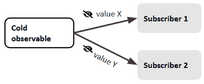
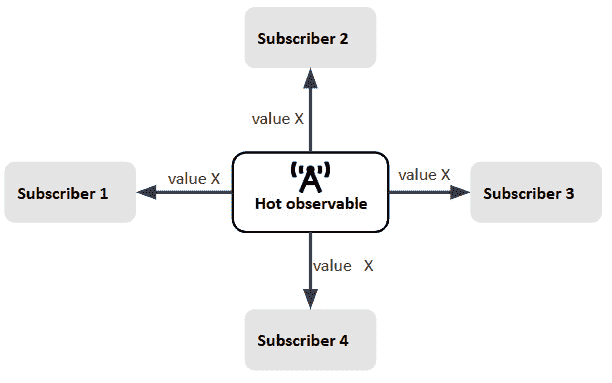
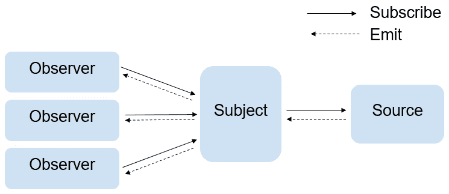

# 第九章：揭秘多播

**多播**指的是在多个订阅者之间共享相同的 Observable 执行。这个概念最初可能难以理解，尤其是对于那些不熟悉响应式编程范式的人来说。然而，它非常有用，解决了许多 Web 应用程序中的问题。

在本章中，我将揭秘这个概念，解释何时何地使用它，RxJS 主题如何参与其中，以及它的优势。

因此，在本章中，我们将涵盖以下主要内容：

+   解释多播与单播的区别

+   探索 RxJS 主题

+   突出多播的优势

# 技术要求

本章假设您对 RxJS 有基本的了解。

本章中的所有源代码都是用于演示目的，因此您不需要访问本书的 GitHub 仓库。

# 解释多播与单播的区别

在我们解释多播与单播之前，让我们先解释另一个关键概念，即生产者，我们将在本章中大量使用这个概念。

**生产者** 是产生 Observable 值的来源——例如，DOM 事件、WebSockets 和 HTTP 请求被认为是生产者。它是任何用于获取值的 数据源。

Observables 分为两种类型：

+   冷，或单播，Observables

+   热的，或多播，Observables

让我们了解它们之间的区别。

## 单播和冷 Observables

在 RxJS 中，冷 Observable 就像是一个个人讲故事会话。想象一下你正在和一个朋友分享一个故事。你和他们一起讲述这个故事，这是你互动的独特体验。每次你和一个不同的朋友分享这个故事，就像开始了一个新的会话，有一个全新的叙述。

在 RxJS 术语中，这意味着 Observable 本身生成它发出的数据。每次有人订阅 Observable，他们都会得到一个私人的讲故事会话。故事（或数据）不会在不同听众之间共享——这是一个一对一的体验。这就是为什么我们称冷 Observables 为“单播”——每个发出的值只被一个订阅者观察：



图 9.1 – 单播冷 Observable

因此，默认情况下，RxJS 中的 Observables 是冷的——它们为每个订阅者创建和传递数据，就像您的个性化讲故事会话一样。

这里是一个冷 Observable 的例子：

```js
import { Observable} from 'rxjs';
const coldObservable$ = new Observable(observer => {
  observer.next(Math.random());
  observer.next(Math.random());
  observer.complete();
});
/** First subscriber */
coldObservable$.subscribe(data => {
  console.log(`The first Observer : ${data}`);
});
/** Second subscriber */
coldObservable$.subscribe(data => {
  console.log(`The second Observer : ${data}`);
});
//console output
The first Observer: 0.043246216289945405
The first Observer: 0.7836505017199451
The second Observer: 0.18013755537578624
The second Observer: 0.23196314531696882
```

让我们分析一下这段代码中发生了什么。

在这里，`Math.random()` 是我们的生产者——它在 Observable 内部被调用。因此，数据是由 Observable 本身产生的。

第一个订阅者在订阅后将会得到两个随机值，而第二个订阅者在订阅后将会得到两个不同的值。每个订阅者都会启动一个新的执行，导致 `Math.random()` 的新调用，从而产生不同的值。

每个订阅者都得到自己独特的一组项目。它只在观察者订阅后才开始发出项目。由于有两个不同的执行，每个 Observable 都将接收到不同的值。这意味着数据是单播的，不会在订阅者之间共享。

简单地看一个现实世界的例子，当用户登录应用程序时，他们的个人资料或仪表板信息会被检索并显示出来。这些数据对每个用户都是唯一的，不应该在多个用户之间共享。使用冷 Observable 确保每个用户在登录时都能收到个性化的数据，从而保持隐私和安全。所以，总结一下，对于冷 Observable，以下适用：

+   Observable 本身生成它发出的数据

+   它只在观察者订阅后才开始发出数据

+   每个观察者（或订阅者）都得到自己独特的一组项目

现在，让我们看看热 Observable。

## 多播和热 Observable

在 RxJS 中，多播就像举办一场现场广播节目。想象一下，你从演播室播出节目，听众可以在任何时候调谐收听相同的内容。一旦开始播出，任何调谐收听的听众都能听到相同的音乐、访谈或讨论。

在 RxJS 术语中，热或多播 Observable 是一个其发出的值在订阅者之间共享的 Observable。有一个单一的数据源，就像广播电台播出内容一样。当你订阅一个多播 Observable 时，你加入了“广播”，你将收到与其他调谐收听的任何人相同的数据：



图 9.2 – 多播热 Observable

与每个订阅者都得到一个私有会话的冷 Observable 不同，多播允许多个订阅者同时收听相同的数据流。

下面是一个热 Observable 的例子：

```js
import { Observable, fromEvent } from 'rxjs';
// Hot Observable
const hotObservable$ = fromEvent(document, 'click');
hotObservable$.subscribe(({ x, y }: MouseEvent) => {
  console.log(`The first subscriber: [${x}, ${y}]`);
});
hotObservable$.subscribe(({ x, y }: MouseEvent)=> {
  console.log(`The second subscriber: [${x}, ${y}]`);
});
//console output
The first subscriber: [108, 104]
The second subscriber: [108, 104]
```

让我们分析一下这段代码中发生的事情。

我们使用 RxJS 的`fromEvent`函数创建了一个 Observable。当订阅时，这个 Observable 将发出 DOM 文档上的点击事件。

注意

关于`fromEvent`的更多详细信息，请参阅[`rxjs.dev/api/index/function/fromEvent`](https://rxjs.dev/api/index/function/fromEvent)。

在这种情况下，数据是在 Observable 外部发出的，正如你可能猜到的，两个订阅者将获得相同的数据。这意味着订阅者共享相同的 DOM 点击事件实例。因此，热 Observable 在多个订阅者之间共享数据。我们称这种行为为多播。换句话说，Observable 对所有订阅者进行多播。

考虑另一个现实世界的场景，比如一个聊天应用，您可能有一个全局聊天服务，该服务公开一个热 Observable，表示来自聊天室中所有用户的消息流。多个组件，如消息源和通知，可以订阅这个热 Observable 以实时显示新消息，而无需为每个组件创建单独的 Observables。

因此，总结一下，对于热 Observables，以下规则适用：

+   数据是在 Observable 外部产生的

+   它可能一创建就开始发射项目

+   发射的项目在订阅者之间共享（多播）

## 将冷 Observables 转换为热 Observables

如果我们要将冷 Observable 转换为热 Observable，我们必须将生产者移出 Observable 之外——这样，我们的订阅者将接收到相同的数据。

让我们回顾一下我们的冷 Observable 示例。我们不会在 Observable 内部生成值，而是在 Observable 外部使用`Math.random()`预先计算值，如下所示：

```js
const value = Math.random();
const coldObservable$ = new Observable(observer => {
  observer.next(value);
  observer.next(value);
  observer.complete();
});
/** first subscriber */
coldObservable$.subscribe(data => {
  console.log(`The first subscriber: ${data}`);
});
/** second subscriber */
coldObservable$.subscribe(data => {
  console.log(`The second subscriber: ${data}`);
});
//console output
The first subscriber: 0.6642828154026537
The first subscriber: 0.6642828154026537
The second subscriber: 0.6642828154026537
The second subscriber: 0.6642828154026537
```

如您可能已经注意到的，执行此代码后，所有订阅者都接收到相同的预先计算值。

现在，在我们结束本节之前，让我们快速总结一下单播和多播：

+   当您想要确保每个订阅者拥有独立的执行和为每个订阅者提供独立的数据流时，应该使用*单播*。

+   另一方面，当您想要确保多个订阅者共享相同的执行和结果时，应该使用*多播*，尤其是在涉及热 Observables、广播或缓存结果的场景中。

    多播还有助于在执行数据昂贵时优化和改进性能。作为一个快速的最终例子，假设 Observable 的执行是发起一个网络请求。如果我们选择冷 Observable（或单播），那么每个订阅者都会发起一个网络请求。相反，多播更适合这种特定场景，因为它将在订阅者之间共享网络请求的执行，从而避免冗余的请求调用。

既然我们已经理解了多播和热 Observables，让我们来探索在 RxJS 中将值多播给观察者的最流行方式，即 RxJS subjects。

# 探索 RxJS subjects

**Subjects**是特殊类型的 Observables。而普通的 Observables 是单播的，subjects 是多播的，允许值被广播给所有订阅者。

您可以将 subjects 视为同时是观察者和 Observables：

+   您可以订阅 subjects 以获取生产者发出的值（这就是为什么它们充当 Observables）：



图 9.3 – RxJS subject

+   您可以通过使用`Observer`接口中可用的`next`、`error`和`complete`方法来发送值、错误和完成信号（这就是为什么它们充当观察者的原因）：

    ```js
    const observer = {
      next: x => console.log('Observer got a next value: '
                             + x),
      error: err => console.error('Observer got an error:
                                  '+err),
      complete: () => console.log('Observer got a
                                  completion'),
    };
    ```

简而言之，主题维护一个订阅者列表，并在新值发出时通知他们。但要深入一点，RxJS 中有多种主题类型。让我们探索最常用的几种。

## 一个普通主题

`plainSubject`是所有主题的父类型。让我们看一个快速示例：

```js
const plainSubject$ = new Subject();
plainSubject$.next(10);
plainSubject$.next(20);
plainSubject$.subscribe({
    next: (message) => console.log(message),
    error: (error) => console.log(error),
    complete: () => console.log('Stream Completed'),
  });
plainSubject$.subscribe({
    next: (message) => console.log(message),
    error: (error) => console.log(error),
    complete: () => console.log('Stream Completed'),
  });
plainSubject$.next(30);
//console output
30
30
```

在前面的代码中，我们创建了`plainSubject$`，它发出了`10`和`20`作为值。之后，我们创建了两个订阅者，它们记录了传入的值、错误和流的完成。最后，`plainSubject$`发出了一个值为`30`的值。

执行此代码后，请注意，在控制台中只有`30`被追踪了两次。这意味着订阅者只接收到了`30`。为什么他们没有收到`10`和`20`？因为那些值是在订阅`plainSubject$`之前发出的，并且每个在订阅之前发生的发射都会丢失。这就是普通主题多播值的方式。

这就是普通主题的行为和值发射方式。

你可以在你的 Web 应用程序中将主题用作通信中心，在 Angular 组件之间共享数据，正如我们在*第七章*中探讨的，*在 Angular 组件之间共享数据*。

此外，主题可以用来管理 Web 应用程序中的认证状态。例如，你可以使用主题在用户登录或登出时发出一个值。这个发出的值可以用来有条件地显示某些组件或根据用户的认证状态触发特定的行为。

如果你希望为后来加入游戏的用户保留之前发出的值的缓冲区，那么`ReplaySubject`可以帮到你！

## replaySubject

`replaySubject`是一种主题变体，类似于`plainSubject`，但具有内存功能：它们会记住并重放给新订阅者的之前的消息。重放主题有内存。

让我们通过以下示例来解释它是如何工作的：

```js
const replaySubject$ = new ReplaySubject();
replaySubject$.next(10);
replaySubject$.next(20);
replaySubject$.next(50);
replaySubject$.subscribe({
  next: (message) => console.log(message),
  error: (error) => console.log(error),
  complete: () => console.log('Stream Completed'),
});
replaySubject$.subscribe({
  next: (message) => console.log(message),
  error: (error) => console.log(error),
  complete: () => console.log('Stream Completed'),
});
replaySubject$.next(30);
//console output
10
20
50
10
20
50
30
30
```

如你所见，所有值都被重放给了新的订阅者。现在，为了控制缓冲区大小（你希望`Replay`主题存储的值的数量），你可以在创建`ReplaySubject`时将其作为参数传递，如下所示：

```js
const  replaySubject$ = new ReplaySubject(2);
```

这只会重放最后两个值。控制台输出将如下所示：

```js
20
50
20
50
30
30
```

作为实际应用案例，让我们考虑一个用户晚些时候加入聊天室的情况。使用`ReplaySubject`，他们仍然可以看到在他们加入之前发送的之前的消息。这对于向新用户提供完整的聊天历史非常有用。

有了这个，让我们继续探讨`Subject`的另一个变体——`BehaviorSubject`。

## BehaviorSubject

`BehaviorSubject`只是`ReplaySubject`，缓冲区大小等于一，因此它只能重放之前的项。我们在*第五章*中使用了`BehaviorSubject`，*组合流*。

`BehaviorSubject` 需要一个初始值，并且总是保留最后一个值，以便它可以将其发射给新的订阅者。换句话说，如果你有任何后来加入的订阅者，他们将获得流中之前发射的值。这将在你订阅时始终给你带来价值。

下面是一个例子：

```js
const behaviourSubject$ = new BehaviorSubject(1);
behaviourSubject$.next(10);
behaviourSubject$.next(20);
behaviourSubject$.next(50);
behaviourSubject$.subscribe({
  next: (message) => console.log(message),
  error: (error) => console.log(error),
  complete: () => console.log('Stream Completed'),
});
behaviourSubject$.subscribe({
  next: (message) => console.log(message),
  error: (error) => console.log(error),
  complete: () => console.log('Stream Completed'),
});
behaviourSubject$.next(30);
//console output
50
50
30
30
```

在这里，`behaviourSubject$` 被创建并具有初始值 `1`。然后，`behaviourSubject` 分别发射了 `10`、`20` 和 `50`。在我们两次订阅 `behaviourSubject$` 后，两个订阅者将立即接收到 `behaviourSubject$` 发射的最后一个值，即 `50` —— 这就是为什么在控制台中 `50` 被追踪两次的原因。最后，`behaviourSubject$` 发射了 `30`；因此，订阅者将接收到 `30` 并追踪它。

如果在订阅之前没有发射任何值，那么 `behaviourSubject$` 将发射初始值，即 `1`：

```js
const behaviourSubject$ = new BehaviorSubject(1);
behaviourSubject$.subscribe({
  next: (message) => console.log(message),
  error: (error) => console.log(error),
  complete: () => console.log('Stream Completed'),
});
behaviourSubject$.subscribe({
  next: (message) => console.log(message),
  error: (error) => console.log(error),
  complete: () => console.log('Stream Completed'),
});
behaviourSubject$.next(30);
//console output
1
1
30
30
```

作为另一个例子，想象你正在构建一个显示当前温度的天气应用。你可以使用 `BehaviorSubject` 来表示温度数据。每当温度发生变化时，你都会用新值更新 `BehaviorSubject`。`BehaviorSubject` 的订阅者将始终接收到最新的温度，即使他们在温度多次变化后才开始使用应用。

总结来说，`PlainSubject`、`BehaviorSubject` 和 `ReplaySubject` 是 RxJS 中使用最频繁的主题，这就是为什么我们在这里讨论它们。然而，还有其他类型的主题，例如 `WebSocketSubject`，使用得较少（尽管我们将在 *第十二章*，*处理实时更新*）中进一步探讨。有关其他类型的详细信息，请参阅 [`rxjs.dev/guide/subject`](https://rxjs.dev/guide/subject)。

注意

在 RxJS 6 中，也有许多用于多播（或共享值/执行）的有用 RxJS 操作符，即 `multicast`、`publish`、`share`、`shareReplay`、`publishReplay`、`publishLast` 和 `refcount`。有关这些操作符的更多详细信息，您可以查看官方文档：[`rxjs.dev/api/operators`](https://rxjs.dev/api/operators)。

在版本 7 中，多播操作符被合并为 `share`、`connectable` 和 `connect`。其他多播 API 现已弃用，将在 RxJS 8 中删除。唯一未被弃用的操作符是 `shareReplay`，因为它非常受欢迎。现在它是一个围绕高度可配置的 `share` 操作符的包装器。

由于我们在本书中使用 RxJS 7，我认为遍历所有已弃用的操作符是无用的。相反，我们专注于 `share` 操作符，因为它满足大多数情况。我们将在下一章，*第十章*，*通过响应式缓存提升性能*中，通过考虑一个现实世界的用例来学习 `share` 操作符的行为。

有关 RxJS 7 多播操作符的详细信息，请参阅 [`rxjs.dev/deprecations/multicasting`](https://rxjs.dev/deprecations/multicasting)。

现在您已经很好地理解了多播以及 RxJS 提供的不同实现方式，让我们来探讨多播的主要优点。

# 突出多播的优点

在 RxJS 中进行多播或能够在多个订阅者之间共享相同的 Observable 执行有许多优点。以下是一些关键点：

+   *优化资源*: 多播通过避免冗余处理来帮助优化资源。在处理昂贵的操作，如建立 HTTP 网络或执行复杂计算时，多播可以帮助您一次完成工作，并将结果共享给所有订阅者。

+   *一致的数据和结果*: 多播确保所有订阅者都接收到由 Observable 发出的相同值集。在数据一致性至关重要的场景中，您希望所有订阅者观察相同的数据序列时，这可能至关重要。

+   *广播*: 多播使您能够一次性将同一组值发送给多个订阅者。这就是我们所说的广播，当您有一个具有多个组件的复杂应用程序，这些组件需要响应同一组值时，这非常有用。

+   *迟到订阅者*: 多播允许迟到订阅者接收与较早加入的订阅者相同的值。这是通过使用 `BehaviorSubject` 和 `ReplaySubject` 以及一些多播 RxJS 操作符（例如 `shareReplay` 操作符）来实现的，我们将在 *第十章* 中解释，*通过响应式缓存提升性能*。

当使用 RxJS 设计应用程序时，多播是一个强大的机制，应该被考虑，因为它增强了应用程序不同部分之间的性能、效率、一致性和交互。然而，根据您的具体用例，谨慎使用多播并意识到潜在的风险是至关重要的。以下是一些例子：

+   *数据修改*: 多播本质上会在所有订阅者之间共享相同的数据流。如果一个订阅者在它的订阅逻辑中修改了数据（例如，使用 `map` 或 `filter` 等操作符），这种修改可能会无意中影响其他订阅者接收到的数据。这可能导致意外的行为和调试挑战。

    例如，想象一个多播 Observable 发射产品列表。一个组件订阅并过滤列表，只显示有折扣的产品。然而，这种过滤修改了原始数据流。如果稍后另一个组件订阅，期望获得完整的产品列表，它将只会收到由于第一次订阅中的意外修改而导致的折扣产品。这就是为什么将主题保持私有，并通过`asObservable()`方法仅公开数据的只读部分是一种常见且有效的做法。这确保了外部组件或消费者不能直接修改主题的内部状态。相反，他们只能观察发射的值，而不干扰数据流。

+   *内存泄漏*：与单播 Observables 不同，单播 Observables 在单个订阅者取消订阅后即完成，而多播 Observables 只要至少有一个订阅者存在就会继续发射数据。如果你不仔细管理订阅，这可能会导致内存泄漏，尤其是在处理无限或长期存在的 Observables 时。

    例如，想象一个发射实时股票价格的多播 Observable。如果组件订阅了这个 Observable，但在不再需要时没有取消订阅，Observable 将继续发射，这可能导致由于 Observable 及其内部状态的引用积累而引起的内存泄漏。

在下一章中，我们将探讨其他多播陷阱和最佳实践。

# 摘要

在本章中，我向您介绍了理解多播最重要的概念和词汇。我们首先解释了生产者的角色，然后学习了冷 Observables 和热 Observables 之间的区别，这使我们到达了多播和单播的定义。然后，我们探讨了 RxJS 的主题，不同类型的主题以及每种主题的使用案例，在介绍 RxJS 中的多播操作符之前。

在下一章中，我们将在一个实际用例中练习所有这些内容。我们将学习如何通过在 RxJS 中使用多播，更具体地说，通过结合多播操作符和主题，在我们的食谱应用中实施一个高效的缓存机制。
