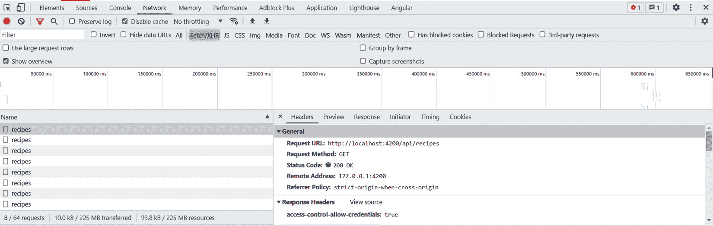
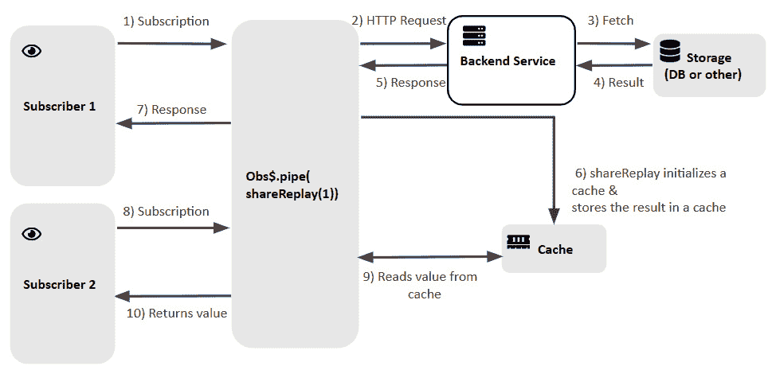

# 第十章：通过反应式缓存提升性能

缓存数据和资源是我们提高 Web 应用程序用户体验最有效的方法之一。这是一个加快我们 Web 应用程序加载时间并保持网络请求数量最小化的好方法。

我们将从这个章节开始，定义我们应用程序客户端的缓存需求及其动机。然后，我们将学习如何使用 RxJS 操作符反应性地实现这个需求。之后，我们将描述使用 RxJS 7 的最新特性来做这件事的更好方法。最后，我们将强调缓存流的一个其他用途，即用于副作用。

在本章中，我们将涵盖以下主要主题：

+   定义缓存需求

+   探索使用反应式模式缓存流

+   强调缓存用于副作用的使用

# 技术需求

本章假设你已对 RxJS 有基本的了解。

本章的源代码可在[`github.com/PacktPublishing/Reactive-Patterns-with-RxJS-and-Angular-Signals-Second-Edition/tree/main/Chap10`](https://github.com/PacktPublishing/Reactive-Patterns-with-RxJS-and-Angular-Signals-Second-Edition/tree/main/Chap10)找到。

# 定义缓存需求

如你在前几章中学到的，`HTTPClient`模块是基于 Observable 的，这意味着`get`、`post`、`put`和`delete`等方法返回一个 Observable。多次订阅这个 Observable 会导致源 Observable 被反复创建，因此每次订阅都会执行一个请求——正如我们在第九章，“揭秘多播”中学到的，这意味着它是一个冷 Observable。这种行为会导致 HTTP 请求的开销，这可能会降低你的 Web 应用程序的性能，尤其是如果服务器响应需要一些时间的话。

通过在客户端缓存结果来减少 HTTP 请求是优化 Web 应用程序最常用的技术之一。**客户端缓存**涉及存储之前请求的数据，这样你就不需要向服务器发送重复的请求，从而损害你的应用程序性能。

让我们用一个流媒体服务场景来形象地说明。想象一下，你正在流媒体服务上观看你最喜欢的电视剧。当你开始观看时，流媒体服务从互联网上获取剧集并将它们流式传输到你的设备。现在，假设你想倒退一点，再看一遍某个场景。而不是再次从互联网上获取剧集，流媒体服务已经将你观看过的剧集存储在一个特殊的记忆库中。这个记忆库允许你倒退并重新观看场景，而无需再次从互联网上重新获取。

但我们何时应该缓存数据呢？当数据被共享（在您的应用程序中由多个组件使用）且不经常变化时，缓存数据并在多个组件之间共享它是非常有意义的。例如，用户的个人资料数据适合进行缓存。我们通常在用户登录后检索用户的个人资料信息，并且在用户会话期间它不会发生变化。

此外，参考数据，如国家列表、货币或类别，也是缓存的主题。由于这些数据不经常变化，您可以将其缓存并在多个组件之间共享。

在`RecipesApp`的情况下，每当`RecipesList`组件被渲染以加载菜谱列表时，都会调用`/api/recipes` GET 请求。换句话说，无论何时用户点击菜谱应用的标志或在不同组件`HomeComponent`和`RecipeCreationComponent`之间导航，都会发出 GET 请求，即使菜谱列表没有变化。

下面的屏幕截图显示了**网络**选项卡中的引发请求：



图 10.1 – GET HTTP 请求及其开销

如您所注意到的，所有这些发出的请求都是由于在`HomeComponent`和其他组件之间的导航而产生的。

在本章中，我们将假设菜谱列表不经常变化。在这种情况下，在每次组件加载时请求服务器是没有用的；最好是缓存结果并从缓存中读取数据以提高性能和用户体验。

但如果出现新的菜谱怎么办？更新怎么办？好吧，我们可以利用两种技术来处理更新：

+   我们可以在每个时间间隔之后更新缓存数据以检索数据的最新版本 – 这种技术称为**轮询**

+   我们可以放置一个服务器推送通知以立即获取实时更新

在本章中，为了通过基本示例了解 RxJS 中的缓存行为，我们将保持简单，并实现具有和没有刷新功能的客户端缓存。

注意

尽管我们将在本章中介绍轮询技术，但我们将介绍第十一章中的第二种技术，*处理实时更新*。

因此，无需多言，让我们看看我们如何实现这一点。

# 探索反应式模式以缓存流

您会高兴地知道，RxJS 附带了一个非常有用的操作符来实现流缓存机制 – 这就是`shareReplay`多播操作符。让我们看看。

## shareReplay 操作符

在 RxJS 中，`shareReplay`的工作方式与流媒体服务的内存银行类似，与多个订阅者共享 Observable 的执行。当你订阅使用`shareReplay`的 Observable 时，它会获取数据，就像流式传输一个节目一样。然而，`shareReplay`会缓存或记住 Observable 发出的值。如果你稍后再次订阅，它不会再次获取数据，而是从其内存银行中重新播放缓存的值。

当你有多个订阅者订阅 Observable，但你不想每个订阅者都触发新的数据获取时，这很有用。相反，你希望他们共享相同的数据集，就像多个观众共享相同的电视剧集一样。这可以提高性能并减少应用程序中不必要的重复数据获取。

因此，简而言之，`shareReplay`操作符执行以下操作：

+   与多个订阅者共享 Observable 的执行

+   为订阅者提供重新播放指定数量的发射值的可能性

现在，让我们看看我们如何使用`shareReplay`操作符来满足我们的需求。

## 在 RecipesApp 中使用 shareReplay

我们的目标是在我们的应用程序中缓存食谱列表。这由`RecipesService`中定义的`recipes$`流表示，如下所示：

```js
export class RecipesService {
recipes$ = this.http.get<Recipe[]>(`${BASE_PATH}/recipes`);
}
```

`recipes$`流最初是一个冷 Observable，这意味着对于每个订阅者，流的数据都会重新发射，这会导致 HTTP 请求的开销。这不是我们想要的。我们希望与所有订阅者共享最后一个流的发射值——换句话说，我们希望使用`shareReplay`操作符将冷流转换为热流，如下所示：

```js
export class RecipesService {
recipes$ =
this.http.get<Recipe[]>(`${BASE_PATH}/recipes`).pipe(
shareReplay(1));
}
```

通过传递`1`作为参数，`shareReplay`缓存了`recipes$`的最后一次发射。

现在，让我们解释完整的数据共享工作流程：

+   首先，初始化`HomeComponent`。

+   然后，`HomeComponent`触发子组件的渲染——即`RecipesListComponent`。

+   `RecipesListComponent`加载`RecipeService`中可用的`recipes$`Observable。它将执行 GET HTTP 请求以检索食谱列表，因为这是我们第一次请求数据。

+   然后，缓存将由从服务器返回的数据初始化。

+   下次请求数据时，它将利用`shareReplay`操作符从缓存中检索。在底层，`shareReplay`操作符创建一个`ReplaySubject`实例，该实例将重新播放源 Observable 的所有未来订阅者的发射值。在第一次订阅之后，它将连接主题到源 Observable 并广播所有其值。

这就是我们之前在*第九章*中解释的多播概念——“揭秘多播”。下次我们请求食谱列表时，我们的缓存将重新播放最新的值并发送给订阅者。不涉及任何额外的 HTTP 调用。因此，当用户离开页面时，它会取消订阅并从缓存中重新播放值。

下面的图表也说明了完整的流程：



图 10.2 – ShareReplay 执行

当数据根本不需要刷新时，这工作得非常好。但如要求所述，我们需要每隔一段时间刷新`RecipesList`。如果使用轮询技术，我们可以这样更新缓存：

```js
import { switchMap, shareReplay, timer } from 'rxjs/operators';
const REFRESH_INTERVAL = 50000;
const timer$ = timer(0, REFRESH_INTERVAL);
export class RecipesService {
recipes$ = timer$.pipe(
    switchMap(_ =>
    this.http.get<Recipe[]>(`${BASE_PATH}/recipes`)),
    shareReplay(1)
  );
}
```

在这里，我们创建了一个每 50 秒发出一次的`timer$`Observable。这个间隔是在`REFRESH_INTERVAL`常量中配置的，使用 RxJS 中的`timer`函数创建`timer$`Observable。有关`timer`函数的更多详细信息，请参阅[`rxjs.dev/api/index/function/timer#examples`](https://rxjs.dev/api/index/function/timer#examples)。

然后，对于每次发出，我们使用`switchMap`操作符将值转换为 HTTP 客户端返回的 Observable。这将每 50 秒发出一个 HTTP GET 请求，并相应地更新缓存。

这是一个已知的 RXJS 模式，用于每*x*秒执行一次处理。

现在，让我们看看我们如何自定义`shareReplay`操作符。

## 自定义`shareReplay`操作符

在 RxJS 6.4.0 中，提供了一个新的`shareReplay`签名来定制操作符的行为。新的签名接受一个`ShareReplayConfig`类型的单个`config`参数，如下所示：

```js
function shareReplay<T>(config: ShareReplayConfig): MonoTypeOperatorFunction<T>;
```

`ShareReplayConfig`接口包含以下属性：

```js
interface ShareReplayConfig {
  refCount: boolean;
  bufferSize?: number;
  windowTime?: number;
  scheduler?: SchedulerLike;
}
```

让我们了解每个属性的目的：

+   `refCount`: 如果启用`refCount`（设置为`true`），当没有订阅者时，`shareReplay`流将取消订阅源 Observable。因此，源将不再发出。这意味着如果稍后出现新的订阅者，则将创建一个新的流来订阅源 Observable。如果禁用`refCount`（设置为`false`），则不会取消订阅源，这意味着内部的`ReplaySubject`仍然会订阅源，并且可能永远运行。为了避免内存问题，强烈建议将`refCount`属性设置为`true`。

+   `bufferSize`: 这指的是您想要回放多少个值。例如，如果您只想为每个新的共享流订阅者回放一个前一个值，那么您应该将`1`作为`bufferSize`值提及，如下所示：`shareReplay({bufferSize: 1})`。

+   `windowTime`: 这指的是存储在缓冲区中的数据在毫秒内被发出到未来订阅者的时间限制。

+   `scheduler`: 这用于控制执行并提供一种管理并发的方式（有关更多详细信息，请参阅官方文档：[`rxjs.dev/api/index/interface/SchedulerLike`](https://rxjs.dev/api/index/interface/SchedulerLike)）。

在我们的案例中，我们需要将`bufferSize`配置为`1`以存储最新的值，并将`refCount`设置为`true`以防止内存泄漏。

因此，使用`shareReplayConfig`对象，`RecipesService`的最终代码将如下所示：

```js
import { switchMap, shareReplay, timer } from 'rxjs/operators';
const REFRESH_INTERVAL = 50000;
const timer$ = timer(0, REFRESH_INTERVAL);
export class RecipesService {
recipes$ = timer$.pipe(
    switchMap(_ =>
    this.http.get<Recipe[]>(`${BASE_PATH}/recipes`)),
    shareReplay({bufferSize: 1, refCount: true })
  );
}
```

当在不需要自行完成的可观察对象上使用 `shareReplay` 时，始终要考虑 `refCount` 标志。

既然我们已经了解了 `shareReplay` 的行为，我想谈谈从 RxJS 7 开始可用的改进，它允许您用 `share` 操作符替换 `shareReplay` 操作符。

## 用 share 操作符替换 shareReplay 操作符

`share` 操作符与 `shareReplay` 类似，但默认情况下，它没有缓冲区，并且在订阅时不会重放该缓冲区。

使用 `share` 操作符，一旦订阅者计数达到 `0`，源可观察对象将自动取消订阅。另一方面，当 `shareReplay` 的 `refCount` 选项设置为 `true` 时，它在引用计数方面与 `share` 操作符的行为相似，但它还提供了重放发射值的能力。

下面是一个比较两个操作符的表格：

| **特性** | `share` | `shareReplay` |
| --- | --- | --- |
| **行为** | 创建一个多播可观察对象。 | 创建一个多播可观察对象。 |
| **重放** | 不重放之前的发射。它使用底层的 `Subjects`。 | 重放最新的或指定数量的之前的发射给新订阅者。它使用底层的 `ReplaySubject`。 |
| **取消订阅逻辑** | 当最后一个订阅者取消订阅时取消订阅。 | 提供一个 `refCount` 选项，当最后一个订阅者取消订阅时取消订阅。默认情况下，`refCount` 设置为 `false`。但是，如果您将其保持为 `false`，即使订阅者计数达到零，源可观察对象也将保持活跃。这种情况可能存在风险，因为如果源可观察对象永远不会完成，可能会导致内存泄漏。 |

图 10.3 – share 和 shareReplay 对比表

在 RxJS 7 中，`share` 操作符通过将可选配置对象作为参数 `share(config)` 进行增强，使其更加灵活，并准备好执行其他操作符的工作，例如 `shareReplay()`。在这个配置对象中，有四个属性：

+   `连接器`：使用此选项，您可以控制 `share` 是否重放发射。您可以选择连接的主题类型（例如 `ReplaySubject`）。

+   `resetOnRefCountZero`：使用此选项，您可以控制您的可观察对象何时应该重置。如果此选项启用，并且我们可观察对象的所有订阅都取消订阅，则可观察对象将被重置。然而，如果此选项被禁用，主题将保持连接到源。

+   `resetOnComplete`：如果启用，结果可观察对象将在完成时重置。

+   `resetOnError`：如果启用，结果可观察对象将在错误后重置。

因此，`shareReplay` 实际上就是一个使用 `ReplaySubject` 作为连接器和特定重置策略的 `share` 操作符。

以下代码展示了如何通过使用 `share` 操作符而不是 `shareReplay` 操作符来实现优化后的 `shareReplay` 操作符的行为：

```js
  recipes$ = timer$.pipe(
    switchMap(_ =>
      this.http.get<Recipe[]>(`${BASE_PATH}/recipes`)),
    share({
      connector: () => new ReplaySubject(),
      resetOnRefCountZero: true,
      resetOnComplete: true,
      resetOnError: true
    })
  );
```

上一段代码展示了与`shareReplay`操作符具有相同行为的`share`操作符。这是因为我们将`ReplaySubject`作为连接器进行引用，因此我们告诉`share`使用重放逻辑。

然后，对于重置策略，我们启用了所有重置选项——`resetOnRefCountZero`、`resetOnComplete`和`resetOnError`——以获得优化的行为和增强的性能。

就这样——通过使用`share`操作符，我们可以实现与`shareReplay`操作符相同的行为！

注意

除了`shareReplay`操作符之外，在 RxJS 7 中做了大量工作来巩固多播操作符。`multicast`、`publish`、`publishReplay`、`publishLast`和`refCount`操作符已被弃用，并将从 RxJS 8 中移除，唯一保留的操作符是`shareReplay`、`share`和`connectable`。

正如我们在本节中看到的，`share`操作符是万能的，这意味着在大多数情况下，强烈建议使用`share`操作符而不是`connectable`和`shareReplay`。`shareReplay`操作符非常流行，因此不建议弃用，但可能在未来的版本中弃用，特别是因为它有一个替代品，尤其是由于`shareReplay`如果不小心使用，可能会导致内存泄漏，尤其是在无限流的情况下。

因此，如果你正在使用 RxJS 7，强烈建议调用`share`操作符而不是`shareReplay`。

现在我们已经学习了如何通过使用`shareReplay`和`share`操作符来缓存我们的数据以优化 HTTP 请求，并将这些操作符放置在`RecipesApp`中以缓存食谱列表，让我们发现另一个缓存流非常有用的场景。

# 突出缓存用于副作用的使用

本章中我们讨论的使用案例涉及优化 HTTP 请求以提升我们 Web 应用的性能。你所要做的就是将结果放入缓存，这个缓存作为所有消费者的共享位置。

存在其他使用场景，其中缓存流非常有意义，特别是当考虑到流上的昂贵副作用时。一般来说，我们称在值发出后执行的操作为**副作用**。这可能是记录、显示消息、执行映射等等。

这里是一个使用`tap`操作符的副作用示例：

```js
import {map, from } from 'rxjs';
import { tap } from 'rxjs/operators';
const stream$ = from([1, 2, 'Hello', 5]);
stream$
  .pipe(
    tap((value) => console.log(value)),
    map((element) => {
      if (isNaN(element as number)) {
        throw new Error(element + ' is not a number');
      }
      return (element as number) * 2;
    })
  )
  .subscribe({
    next: (message) => console.log(message),
    error: (error) => console.log(error),
    complete: () => console.log('Stream Completed'),
  });
//console output
1
2
2
4
Hello
Error
```

在上一段代码中，我们对每个发出的数字执行转换，将其乘以 2，并返回乘积值。如果值不是数字，则会抛出错误。然而，我们需要在转换之前记录初始值。这就是为什么我们在`map`操作符之前调用`tap`操作符的原因——这样我们就可以记录原始值。这是一个基本的副作用示例，但其他副作用也可能发生，例如处理错误或显示消息。

注意

关于`tap`操作符的更多详细信息，请参阅官方文档：[`rxjs.dev/api/operators/tap`](https://rxjs.dev/api/operators/tap)。

在某些情况下，副作用可以执行比记录更复杂的其他操作，例如显示消息和处理错误。这可能包括一些代表性能上昂贵处理的计算。不幸的是，每个订阅者都会执行这些处理，即使只需要运行一次就足够了。否则，这会损害你应用程序的性能。

如果你的应用程序中有这种用例，强烈建议你使用`share`操作符来缓存结果，并且只执行一次重处理。

# 摘要

在本章中，我们解释了网络应用程序中的各种缓存概念，包括它们的优点和用例。我们以我们的食谱应用为例，详细说明了需求，并实现了它。通过这个过程，我们了解了`shareReplay`操作符的行为，以及替代实现——即在 RxJS 7 中使用`share`操作符。最后，我们强调了缓存如何帮助我们处理应用程序中的重副作用。

在下一章中，我们将探讨批量操作的响应式模式。
