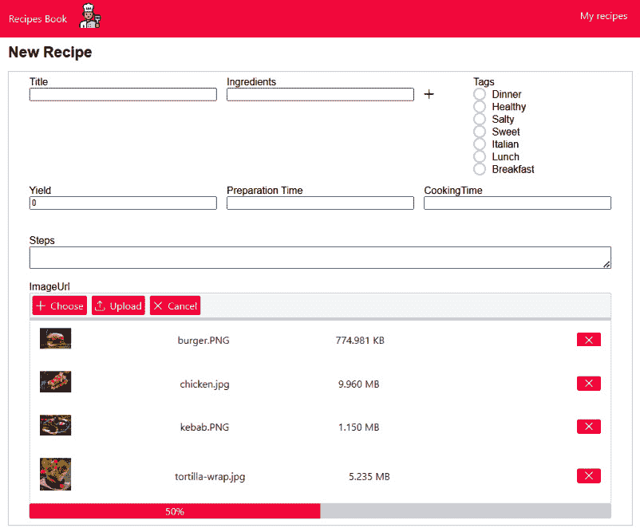
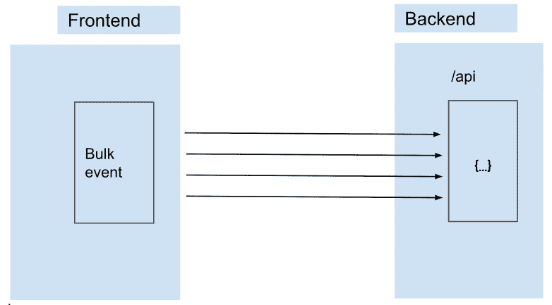
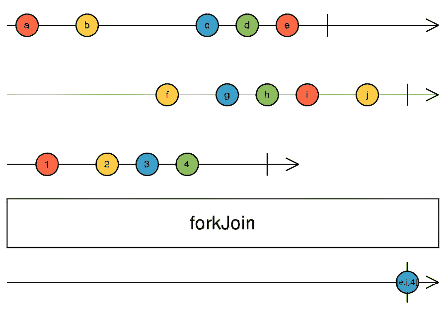
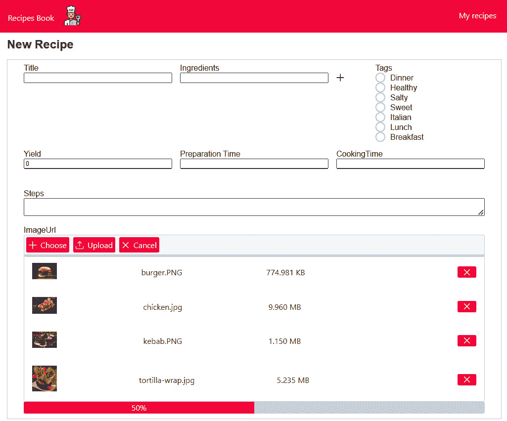

# 11

# 执行批量操作

**批量操作**是在大规模上执行的任务，例如一次性上传多个文件、一次性删除或插入多个项目，或者同时对列表中的多个元素应用转换或计算。

这些操作旨在处理单个操作中的多个更新，通常与单独处理每个项目相比，效率更高，性能更好。跟踪批量操作的进度对于向用户提供反馈、监控操作的健康状况以及识别潜在问题至关重要。

在本章中，我们将首先解释批量操作需求以及我们将考虑的批量操作类型。然后，我们将向您介绍实现批量操作的响应式模式的各个步骤。最后，我们将学习用于跟踪批量操作进度的响应式模式。

在本章中，我们将涵盖以下主要主题：

+   定义批量操作需求

+   学习用于批量操作的响应式模式

+   学习用于跟踪批量操作进度的响应式模式

# 技术要求

本章假设您对 RxJS 有基本的了解。

本章的源代码可在[`github.com/PacktPublishing/Reactive-Patterns-with-RxJS-and-Angular-Signals-Second-Edition/tree/main/Chap11`](https://github.com/PacktPublishing/Reactive-Patterns-with-RxJS-and-Angular-Signals-Second-Edition/tree/main/Chap11)找到。

# 定义批量操作需求

在 Web 应用程序中，批量操作由一个动作或事件表示；然而，在后台，有两种可能的行为：

+   为所有任务运行一个网络请求

+   为每个任务运行并行网络请求

在本章中，我们将使用第二种行为。我们希望允许用户一次性上传菜谱图片，跟踪上传操作的进度，并向用户显示进度条。我们可以在这里看到它将是什么样子：



图 11.1 – 上传菜谱的图片

在`RecipeCreation`接口中，我们将更改**ImageUrl**字段的布局，将其更改为我们组件库 PrimeNG 中可用的**文件上传**布局，如图所示。**文件上传**布局允许用户选择多个文件、清除选择并上传文件。

上传将在服务器上完成，我们有一个专门的上传服务，该服务接受要上传的文件和关联菜谱的标识符作为输入。由于后端上传 API 一次只支持一个文件，我们将并行运行*N*个网络请求来上传*N*个文件（即，如果我们上传两个文件，将发送两个请求）。这是我们将在本章中考虑的大规模更改用例。

在 UI 中，我们将有一个事件，该事件将同时触发多个请求。以下图表提供了批量操作的图形表示：



图 11.2 – 批量操作可视化

因此，总结一下，我们想要做以下事情：

+   允许用户在点击一次 **上传** 按钮后上传多个文件

+   显示此批量操作的进度

既然我们已经定义了需求，让我们看看我们如何以响应式的方式实现它。

# 学习批量操作的响应式模式

如同往常，我们必须将我们的任务视为流。由于我们即将执行的任务是在后端上传食谱图片，让我们想象一个名为 `uploadRecipeImage$` 的流，它将文件和食谱标识符作为输入并执行 HTTP 请求。如果我们有 *N* 个文件需要上传，那么我们将创建 *N* 个流。

我们希望一起订阅所有这些流，但我们对每个流在过程中发射的值不感兴趣。相反，我们只关心最终结果（最后一次发射）——文件是否成功上传，或者发生错误导致上传失败。

有没有 RxJS 操作符可以收集一组可观察对象以获得累积结果？幸运的是，是的：我们有 `forkJoin` 操作符。

## `forkJoin` 操作符

`forkJoin` 操作符属于组合操作符类别。如果我们查看官方文档，我们会找到以下定义：

*“接受一个 ObservableInput 的数组或一个包含 ObservableInput 的字典对象，并返回一个 Observable，该 Observable 会以与传入数组相同的顺序发射值数组，或者以与传入字典相同形状的值字典。”*

换句话说，`forkJoin` 接受一个可观察对象的列表作为输入，等待可观察对象完成，然后将它们最后发射的值合并到一个数组中并返回。结果数组中值的顺序与输入可观察对象的顺序相同。

让我们考虑以下大理石图来更好地理解这一点：



图 11.3 – 一个 forkJoin 大理石图

在这里，`forkJoin` 有三个输入可观察对象（由操作符框之前的三个时间线表示）。

第一个可观察对象发射的 `forkJoin` 不发射任何内容（查看操作符框之后的最后一个时间线，它代表了 `forkJoin` 返回的结果）。

然后，第三个可观察对象发射了 `forkJoin`。为什么？因为，正如我们在定义中所说的，当所有可观察对象都完成时，`forkJoin` 才会发射一次。

因此，如图中大理石图所示，当最后一个可观察对象（第二个）完成时，`forkJoin` 只发射了一次。让我们来分析一下：

+   第三个可观察对象（由第三个时间线表示）首先完成，最后发射的值是 **4**。

+   然后，第一个可观察对象（由第一个时间线表示）完成，最后一个发出的值是`forkJoin`没有发出任何值，因为还有一个可观察对象正在运行。

+   最后，最后一个可观察对象（由第二个时间线表示）完成，最后一个发出的值是`forkJoin`返回一个包含每个输入可观察对象结果的数组，顺序与输入可观察对象（**e**、**j**和**4**）的顺序相同。

完成顺序不考虑；否则，我们会有`[4,e,j]`。即使第三个可观察对象在第一个和第二个可观察对象之前完成，`forkJoin`也尊重输入可观察对象的顺序，并在**4**和**j**值之前返回**e**值。

因此，请记住，当所有输入可观察对象都完成时，`forkJoin`会发出一次，并保留输入可观察对象的顺序。

这很好地符合了我们的要求！`forkJoin`在您有一系列可观察对象且只关心每个可观察对象的最终发出值时使用最佳。这正是我们想要做的。在我们的情况下，我们将发出多个上传请求，并且我们只想在收到所有输入流的响应时采取行动。

现在让我们看看批量操作响应式模式在实际中的应用。

## 批量操作响应式模式

要在我们的菜谱应用中利用此模式，首先，我们需要在`src/app/core/services`下创建一个名为`UploadRecipesPreviewService`的新服务，该服务负责上传文件。以下是该服务的代码：

```js
import { HttpClient } from '@angular/common/http';
import { Injectable } from '@angular/core';
import { Observable } from 'rxjs';
import { UploadStatus } from '../model/upload.status.model';
import { environment } from 'src/environments/environment';
const BASE_PATH = environment.basePath
@Injectable({
  providedIn: 'root'
})
export class UploadRecipesPreviewService {
  constructor(private http: HttpClient) { }
  upload(recipeId: number|undefined|null, fileToUpload:
  File): Observable<UploadStatus> {
    const formData = new FormData()
    formData.append('fileToUpload', fileToUpload as File)
    return this.http.post< UploadStatus >(
      `${BASE_PATH}/recipes/upload/${recipeId}`,
      formData
    )
  }
}
```

`upload`方法发出 HTTP 上传请求并返回上传状态（是否成功或失败）。此方法接受两个参数作为输入：

+   `recipeId`：菜谱的标识符

+   `fileToUpload`：要上传的文件

然后我们使用`FormData`将文件发送到服务器。`FormData`是 JavaScript 中的一个对象，它允许您轻松构建一组键值对，分别代表表单字段及其值。

现在我们需要实现`RecipeCreationComponent`模板的行为，我们需要指定当点击我们的`onUpload`方法时将被调用的方法——并将其作为值放入由我们使用的组件库提供的回调——`uploadHandler`——以在用户上传文件时触发。以下是 HTML 模板片段：

```js
    <div class="form-row">
        <div class="col-12">
            <label for="ImageUrl">ImageUrl</label>
            <p-fileUpload name="imageUrl" [multiple]=true
                [customUpload]="true" (uploadHandler)=
                    "onUpload($event.files)">
            </p-fileUpload>
        </div>
    </div>
```

注意

为了简洁起见，这里已经从模板中删除了一些代码。您可以在书籍的 GitHub 仓库中找到完整的模板代码，该链接可以在*技术要求*部分找到。

接下来，我们需要实现`onUpload`方法并在`RecipeCreationComponent`中定义我们的响应式流。因此，我们将定义以下内容：

+   一个`BehaviorSubject`，它将始终发出上传文件的最后一个值，称为`uploadedFilesSubject$`，并用空数组初始化它：

    ```js
    uploadedFilesSubject$ = new BehaviorSubject<File[]>([]);
    ```

+   `onUpload (files: File[])`方法，当点击`uploadedFilesSubject$`时调用，并带有最后一个上传文件的数组如下：

    ```js
      onUpload(files: File[]) {
        this.uploadedFilesSubject$.next(files);
      }
    ```

+   一个名为 `uploadRecipeImages$` 的流，负责执行批量上传，如下所示：

    ```js
      uploadRecipeImages$ =
      this.uploadedFilesSubject$.pipe(
          switchMap(uploadedFiles=>forkJoin(
          uploadedFiles.map((file: File) =>
            this.uploadService.upload(
            this.recipeForm.value.id, file))))
      )
    ```

    让我们逐个分析这里代码中正在发生的事情。

    每次我们点击 `uploadedFilesSubject$` 时，都会发射要上传的文件。我们需要监听 `uploadedFilesSubject$` 的发射，然后使用 `switchMap`（我们在 *第六章*，*转换流*) 将 `uploadedFilesSubject$` 发射的每个值转换为我们将使用 `forkJoin` 构建的 Observable。

    对于 `forkJoin`，我们传递一个数组，其中包含负责上传每个文件的 Observables。我们通过将 `uploadedFiles` 数组中的每个文件映射到由调用 `UploadRecipesPreviewService` 中的 `upload` 方法生成的流来构建 Observables 数组，该方法接受来自 `recipeForm` 的菜谱的 `id` 属性（我们从中检索）和文件作为输入。

现在我们已经建立了上传逻辑并定义了上传流，是时候订阅 `uploadRecipeImages$` 流了。我们需要在构造函数中注入 `UploadRecipesPreviewService` 并在模板中订阅 `uploadRecipeImages$`，如下所示：

```js
<ng-container *ngIf="uploadRecipeImages$ | async"></ng-
  container>
```

现在，假设其中一个内部流出现错误。`forkJoin` 操作符将不再为我们发射任何值。这是在使用此操作符时需要注意的另一个重要事项。如果你没有正确捕获内部 Observable 上的错误，你将丢失任何其他已经完成的流的值。因此，在这种情况下捕获错误是至关重要的！

这就是我们处理它的方式：

```js
  uploadRecipeImages$ = this.uploadedFilesSubject$.pipe(
    switchMap(uploadedFiles=>forkJoin(uploadedFiles.map((
      file: File) =>
      this.uploadService.upload(this.recipeForm.value.id,
        file).pipe(
          catchError(errors => of(errors)),
      ))))
```

在这里，我们在 `upload` 方法返回的内部流上调用 `catchError`。然后，我们将错误包装在另一个 Observable 中并返回它。这样，`forkJoin` 流将保持活跃并发射值。

捕获错误以向用户显示一些有意义的内容是非常有意义的 - 例如，在我们的案例中，如果上传失败是因为达到了最大图像文件大小或图像扩展名不被允许，那么系统应该向用户显示这样的异常，帮助他们修复文件。

## forkJoin 操作符的优点

总结一下，`forkJoin` 有以下优点：

+   当你对组合结果并只获取一次值感兴趣时，它非常有用

+   它只发射一次，当所有 Observables 完成时

+   它保留了输入 Observables 在发射中的顺序

+   当其中一个流出现错误时，它将完成，所以请确保你处理了错误

现在，在这个阶段，我们的代码运行得很好。但如果我们需要在过程中了解某些信息，比如已经上传了多少文件？操作进度如何？我们还需要等待多长时间？

在当前的 `forkJoin` 实现中，这是不可能的，但让我们看看在下一节中我们如何做到这一点。

# 学习反应式模式以跟踪批量操作进度

跟踪大量操作的进度非常重要，因为它为用户提供反馈并可以识别潜在问题。当涉及到跟踪进度的方法时，根据大量操作的性质和所使用的技术堆栈，有不同的策略和技术。例如，你可以使用递增计数器来显示每次操作的处理情况，使用百分比来跟踪操作的进度，或者甚至将进度记录到文件或数据库中。

在我们的食谱应用中，为了跟踪大量上传的进度，我们将使用完成百分比策略。为了实现此策略，我们将使用一个非常有用的运算符，称为`finalize`。

`finalize`运算符允许你在 Observable 完成或出错时调用一个函数。想法是调用此运算符并执行一个计算进度的函数。这样，每次 Observable 完成时，进度都会得到更新。

这就是代码的样子：

```js
  counter: number = 0;
  uploadProgress: number=0;
uploadRecipeImages$ = this.uploadedFilesSubject$.pipe(
  switchMap(uploadedFiles =>
  forkJoin(uploadedFiles.map((file: File) =>
    this.uploadService.upload(this.recipeForm.value.id,
      file).pipe(
        catchError(errors => of(errors)),
        finalize(() => this.calculateProgressPercentage(
          ++this.counter, uploadedFiles.length))
      ))))
  )
  private calculateProgressPercentage(completedRequests:
  number, totalRequests: number) {
    this.uploadProgress =
      Math.round((completedRequests / totalRequests) *
        100);
  }
onUpload(files: File[]) {
  this.uploadProgress=0;
  this.counter=0;
  this.uploadedFilesSubject$.next(files);
}
```

`finalize`运算符调用`calculateProgressPercentage`私有函数，该函数接受以下参数：

+   *完成的请求数量*：我们只声明一个`counter`属性，每次 Observable 完成时我们将增加它

+   *请求总数*：此数字是从`uploadedFiles`数组中检索的

在`calculateProgressPercentage`函数内部，我们执行一个简单的计算来识别完成百分比并将结果存储在`uploadProgress`属性中。当用户点击`uploadProgress`和`counter`属性时，应将它们重置为`0`。

然后，你可以将此属性的值映射到 UI 中的任何`ProgressBar`组件。在我们的例子中，我们使用了 PrimeNG 的`p-progressBar`组件，如下所示：

```js
    <div class="row">
        <div class="col-12">
            <label for="ImageUrl">ImageUrl</label>
            <!-- <input type="text" name="imageUrl"
            formControlName="imageUrl"> -->
            <p-fileUpload name="imageUrl" [multiple]=true
                [customUpload]="true"
                (uploadHandler)="onUpload($event.files)"
                accept="image/*"></p-fileUpload>
            @if(uploadProgress>0) {
            <p-progressBar [value]=uploadProgress>
                </p-progressBar>
            }
        </div>
    </div>
```

在这里，我们只在上传过程中显示`p-progressBar`（当`uploadProgress>0`时）并将`uploadProgress`值作为输入传递给进度组件。这样，你就能向用户显示进度。

在我们的应用中，这是结果：



图 11.4 – 文件上传进度条

# 摘要

在本章中，我们解释了大量操作的概念，并学习了如何以响应式的方式实现一个实际的大量任务示例。我们学习了`forkJoin`运算符的行为和用例，并了解了实现大量上传的不同步骤。最后，我们通过使用`finalize`运算符实现跟踪进度功能的方法进行了响应式技术介绍。

在下一章中，我们将探讨实时更新模式以及 RxJS 中可用的不同技术，以最低的成本实现它们。
