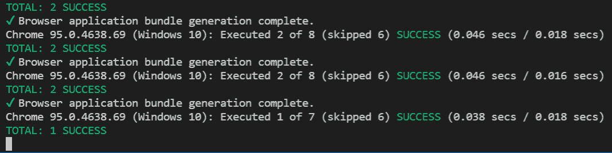
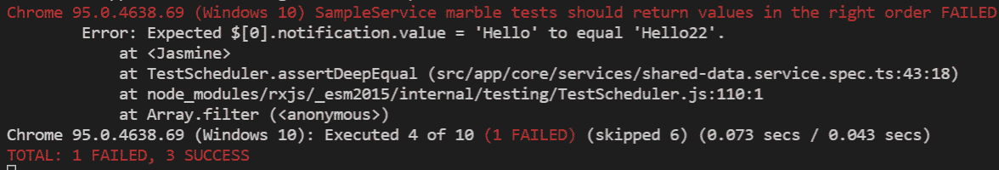

# 第十三章：测试 RxJS 可观察者

可观察者在管理异步数据流和事件驱动交互中扮演着核心角色。通过彻底测试可观察者，开发者可以验证其异步代码的正确性，预测并处理各种边缘情况，并确保在不同环境和用例中的一致行为。

对可观察者的全面测试不仅增强了应用程序的健壮性，还提高了代码质量，减少了错误和回归的可能性，并最终提升了整体用户体验。有了严格的测试实践，开发者可以自信地部署符合高标准的可靠性、性能和可用性的响应式应用程序。

许多开发者认为测试可观察者是一项具有挑战性的任务。这是真的。然而，如果您掌握了正确的技术，您就可以以非常有效的方式实现可维护和可读的测试。

在本章中，我们将向您介绍三种常用的测试流模式。我们将首先解释订阅和断言模式，然后讨论弹珠测试模式。最后，我们将通过关注我们的食谱应用中的具体示例，突出一种适合测试由`HTTPClient`返回的流的模式。

在本章中，我们将涵盖以下主要内容：

+   了解订阅和断言模式

+   了解弹珠测试模式

+   使用`HTTPClientTestingModule`突出显示测试流

# 技术要求

本章假设您对 RxJS 和 Angular 中使用 Jasmine 进行单元测试有基本的了解。有关更多信息，请点击此链接：[`angular.dev/guide/testing#set-up-testing`](https://angular.dev/guide/testing#set-up-testing)。

注意

[angular.dev](http://angular.dev)将成为 Angular 开发者的新文档网站；它提供了更新的功能和文档。[angular.io](http://angular.io)将在未来的版本中弃用。

我们将在 Angular 环境中测试可观察者。本章的源代码可在[`github.com/PacktPublishing/Reactive-Patterns-with-RxJS-for-Angular-16-2nd-Edition/tree/main/Chap13`](https://github.com/PacktPublishing/Reactive-Patterns-with-RxJS-for-Angular-16-2nd-Edition/tree/main/Chap13)找到。

我们将完成对`saveRecipe`方法的单元测试，该方法位于`RecipesService`类下。您可以在`recipes.service.spec`文件中找到完整的代码。

# 了解订阅和断言模式

如您所知，可观察者是懒惰的，我们只有在订阅它们之后才能获得任何值。在测试中，情况也是如此；可观察者不会发出任何值，直到我们订阅它们。为了解决这个问题，程序员总是倾向于在测试中手动订阅可观察者，然后对发出的值进行断言。这就是我们所说的**订阅和断言**模式。

让我们深入探讨使用订阅和断言模式在三个不同场景下的测试。我们将演示测试返回单个值的方法、返回多个值的方法以及返回定时值的方法（在指定时间后返回的值）。

## 测试单值输出方法

假设我们必须测试一个返回单个值的方法。该方法名为 `getValue(value: boolean)`，并在名为 `SampleService` 的 Angular 服务中可用。

该方法本身非常简单，返回一个 Observable，将按照以下方式发出布尔输入值：

```js
import { Observable, of } from 'rxjs';
export class SampleService {
  getValue(value: boolean): Observable<boolean> {
    return of(value);
  }
}
```

该方法的测试看起来是这样的：

```js
describe('SampleService', () => {
  let service: SampleService;
  beforeEach(() => {
    service = TestBed.inject(SampleService);
  });
  it('should return true as a value', () => {
    service.getValue(true).subscribe(
      result=>expect(result).toEqual(true))
  });
});
```

在这里，我们首先使用 Jasmine 的 `describe()` 函数定义我们的测试套件。该函数用于定义一个测试套件，它是一组逻辑上相关的测试用例，用于执行单个任务的不同测试场景。它作为组织和管理测试的方式，使测试更加可读和可维护。

`describe()` 函数接受两个参数：

+   测试套件的字符串描述（在前面的代码片段中，`SampleService` 是我们要测试的服务名称，它指的是测试套件的描述）。

+   包含该套件测试用例的函数（在测试框架中，“测试用例”和“规格”通常指测试套件内的单个测试单元）。在这个函数中，我们将 `SampleService` 注入到 `beforeEach` 语句中，以提供我们将要在所有测试用例中使用的服务的共享实例。最后，我们使用 Jasmine 的 `it()` 函数定义我们的 `getValue(value: boolean)` 方法的测试用例。`it()` 函数接受两个参数：

    +   测试用例的字符串描述（在前面的代码片段中，`should return true as a value` 指的是测试用例的描述）。

    +   包含测试逻辑的函数。在这个函数中，我们订阅 `getValue(true)` 方法，并期望结果等于 `true`，因为我们传递了 `true` 作为输入值。期望是通过使用 Jasmine 的 `expect()` 函数构建的，并在测试执行期间用于断言或验证是否满足某些条件。

现在，让我们运行 `ng test`；测试通过，一切正常：



图 13.1 – ng 测试输出

非常简单，对吧？这是运行正面场景时的预期行为。正面场景通常涉及提供与正在测试的代码预期行为一致的输入或条件，从而在没有错误或失败的情况下成功执行。

现在，让我们通过提供旨在触发正在测试的代码中失败的输入或条件来处理一个负面场景。为此，我们将以下断言中的 `true` 替换为 `false`：

```js
  it('should return true as a value', () => {
  service.getValue(true).subscribe(
    result=>expect(result).toEqual(false))
  });
```

当你再次运行 `ng test` 时，我们的测试将失败。

然而，在某些情况下，测试仍然会通过。这是怎么可能的？

测试中的预期问题是，如果你有一个未满足的断言，它会抛出一个错误。此外，如果你在 RxJS 订阅中有一个未处理的错误，它将在另一个调用堆栈上抛出，这意味着它是异步抛出的。因此，使用订阅和断言模式的测试有时可能会显示为绿色，尽管实际上它们是失败的。

为了克服这个问题，我们应该向测试函数传递一个`done`回调，并在测试完成后的预期时间手动调用它，如下所示：

```js
   it('should return true as a value', (done) => {
    service.getValue(true).subscribe(
      result => {
        expect(result).toEqual(false);
        done();
      }
    );
  });
```

`done`回调是在异步测试中用于向测试框架发出测试用例完成信号的一种机制。它被许多测试框架支持，如 Jasmine、Jest 和 Mocha。调用`done`回调确保在所有异步任务执行和断言验证之前，测试不会提前完成。因此，我们防止了假阳性，并确保我们的测试准确地反映了被测试代码的行为，尤其是在异步场景中。所以，不要忘记在异步场景中调用`done`回调！

现在，让我们考虑一个更复杂的方法，该方法将返回多个值而不是一个值。

## 测试多值输出方法

让我们考虑一个名为`getValues`的方法，它将返回多个值，如下所示：

```js
export class SampleService {
  getValues(): Observable<String> {
    return of('Hello', 'Packt', 'Readers');
  }
}
```

值将按照上述顺序逐个发出。

当使用断言和订阅模式时，测试将看起来像这样：

```js
it('should return values in the right order', (done) => {
  const expectedValues = ['Hello', 'Packt', 'Readers'];
  let index = 0;
  service.getValues().subscribe(result => {
    expect(result).toBe(expectedValues[index]);
    index++;
    if (index === expectedValues.length) {
      done();
    }
  });
});
```

在前面的代码中，我们创建了一个数组，表示预期的值顺序；然后，我们订阅了`getValues`方法，并使用计数器（`expectedValues[index]`）将发出的值与预期值进行比较。完成后，我们调用了`done()`回调。

然而，我们可以使用 RxJS 的`toArray`操作符而不是计数器，它将发出的值放入一个数组中，然后比较得到的数组与我们定义的预期数组：

```js
it('should return values in the right order', (done) => {
  const expectedValues = ['Hello', 'Packt', 'Readers'];
  service.getValues().pipe(toArray()).subscribe(result => {
    expect(result).toEqual(expectedValues);
    done();
  });
});
```

好吧，这工作得很好，`ng test`将会通过。然而，在这两种情况下，尽管我们处理的是一个简单的流，但我们被迫添加一些逻辑；在第一个例子中，我们添加了一个计数器，而在第二个例子中，我们使用了`toArray`操作符。这简化了测试并添加了一些不必要的测试逻辑；这些都是订阅和断言模式的最显著缺点。

现在，让我们转向一个不同的例子，并探索输出定时值的测试方法。

## 测试定时值输出方法

让我们更新`getValues()`方法，并添加一个计时器，在特定持续时间后返回值，如下所示：

```js
  getValues(): Observable<String> {
    return timer(0, 5000).pipe(
      take(3),
      switchMap((result) => of('Hello', 'Packt',
                               'Readers'))
    )
```

这里，我们在该方法中使用了 RxJS 的`timer`，每 5 秒发出一个值。由于`timer`产生一个无止境的流，我们调用`take`操作符来返回前三个发出值并完成它们。然后，对于每个发出值，我们使用`switchMap`操作符返回一个连续发出三个值的 Observable。

这很棘手，对吧？如果我们在这里使用 subscribe 和 assert 模式，测试将会非常复杂，并且可能需要很多时间，这取决于传递给`timer`的值。然而，单元测试应该是快速且可靠的。

在这种情况下，拥有一个虚拟计时器可能会有所帮助。虚拟计时器指的是由测试框架控制的模拟时间流逝。我们不需要等待实际时间的流逝，这可能导致测试缓慢且不可靠，虚拟计时器允许测试人员以编程方式控制时间。这意味着他们可以根据需要向前或向后推进时间，以触发某些事件或测试场景，这使得为依赖于基于时间的行为的代码编写可靠且确定性的测试变得更容易。这种方法确保测试快速、可预测，并且独立于实时条件。

简而言之，subscribe 和 assert 模式是一种有效且易于采用的技术，大多数开发者都会采用。然而，它也有一些我在本节中指出的缺点：

+   我们需要记住在异步测试中调用`done`回调；否则，测试将返回无效的结果。

+   在某些情况下，我们可能会遇到过度的测试和不需要的测试逻辑。

+   定时观察者非常难以测试。

现在，让我们探索另一种测试可观察者的方法：使用 RxJS 测试工具的弹珠测试。

# 了解弹珠测试模式

弹珠图对于可视化可观察者执行非常有用。您已经知道了这一点，因为我们早在*第一章*中介绍了弹珠图，*深入响应式范式*，并且我们在本书中实现的几乎所有响应式模式中都用到了它们。它们易于理解，阅读起来令人愉悦。那么，为什么不在代码中也使用它们呢？您可能会惊讶地知道，RxJS 引入了弹珠测试作为一种直观且干净的测试可观察者的方式。

让我们首先解释下一节中的语法，然后学习我们如何在代码中编写弹珠测试。

## 理解语法

要理解语法，我们应该了解以下语义：

| **字符** | **含义** |
| --- | --- |
| `' '` | 这代表一个特殊字符，它不会被解释。它可以用来对齐您的弹珠字符串。 |
| `'-'` | 这代表虚拟时间的流逝帧。 |
| `'&#124;'` | 这代表了一个可观察对象的完成。 |
| `[``a-z]` | 这代表由可观察者发出的值。它是一个字母数字字符。 |
| `'#'` | 这代表了一个错误。 |
| `'()'` | 这代表在同一帧中发生的事件组。它可以用来组合任何发出的值、错误和完成。 |
| `'^'` | 这代表订阅点，并且仅在您处理热可观察者时使用。 |
| `[``0-9]+[ms&#124;s&#124;m]` | 这代表时间进度，并允许你通过特定数量推进虚拟时间。它是一个数字，后面跟着一个时间单位，以 **毫秒**（**ms**）、**秒**（**s**）或 **分钟**（**m**）表示，它们之间没有空格。 |

图 13.2 – 宝石测试语法

这是基本语法。让我们看看一些例子来练习语法：

+   `---`: 这代表一个永远不会发出的可观察对象。

+   `-x--y--z|`: 这代表一个在第一帧发出 `x`，在第四帧发出 `y`，在第七帧发出 `z` 的可观察对象。在发出 `z` 之后，可观察对象完成。

+   `--xy--#`: 这代表一个可观察对象，在第二帧发出 `x`，在第三帧发出 `y`，并在第六帧发出错误。

+   `-x^(yz)--|`: 这是一个在订阅之前发出 `x` 的热可观察对象。

你已经明白了，现在让我们学习如何在我们的代码中实现宝石测试。

## 介绍 TestScheduler

有不同的包可以帮助你编写宝石测试，包括 `jasmine-marbles`、`jest-marbles` 和 `rxjs-marbles`。然而，RxJS 提供了开箱即用的测试实用工具，所有库都是围绕 RxJS 测试实用工具的包装。我建议使用 RxJS 实用工具，以下是一些原因：

+   你不需要包含第三方依赖项

+   你可以保持核心实现的最新状态

+   你可以保持对最新功能的了解

提供的 RxJS API 用于测试是基于 `TestScheduler` 的。这个 API 允许你以可控和确定性的方式测试基于时间的 RxJS 代码，这对于编写基于时间操作符的可靠和可预测的可观察对象测试至关重要。

要定义我们的测试逻辑，`TestScheduler` API 提供了一个具有以下签名的 `run` 方法：

```js
run<T>(callback: (helpers: RunHelpers) => T): T;
```

`run` 方法接受一个 `callback` 函数作为参数。这个 `callback` 函数是你定义测试逻辑的地方，包括设置可观察对象、定义期望和进行断言。`callback` 函数接受一个名为 `helpers` 的参数，其类型为 `RunHelpers`，它提供了各种实用函数和属性，以帮助你编写可观察对象的宝石测试。

`RunHelpers` 接口包含以下属性：

```js
    export interface RunHelpers {
    cold: typeof TestScheduler.prototype.
    createColdObservable;
    hot: typeof TestScheduler.prototype.
    createHotObservable;
    flush: typeof TestScheduler.prototype.flush;
    expectObservable: typeof TestScheduler.
    prototype.expectObservable;
    expectSubscriptions: typeof TestScheduler.
    prototype.expectSubscriptions;
}
```

让我们逐一查看这些属性：

+   `cold`: 这根据给定的宝石图产生一个冷可观察对象。以下是该方法的签名：

    ```js
    /**
        * @param marbles A diagram in the marble DSL.
          Letters map to keys in `values` if provided.
        * @param values Values to use for the letters in
          `marbles`. If ommitted, the letters themselves
          are used.
        * @param error The error to use for the `#`
          marble (if present).
        */
    createColdObservable<T = string>(marbles: string,
    values?: {
            [marble: string]: T;
        }, error?: any): ColdObservable<T>;
    ```

+   `hot`: 这根据给定的宝石图产生一个热可观察对象。以下是该方法的签名：

    ```js
    /**
        * @param marbles A diagram in the marble DSL.
          Letters map to keys in `values` if provided.
        * @param values Values to use for the letters in
          `marbles`. If ommitted, the letters themselves
          are used.
        * @param error The error to use for the `#`
          marble (if present).
        */
    createHotObservable<T = string>(marbles: string,
    values?: {
            [marble: string]: T;
        }, error?: any): HotObservable<T>;
    ```

    当你创建一个热可观察对象时，可以使用 `^` 来指出第一帧：

+   `flush`: 这开始虚拟时间。只有在你在 `run` 回调之外使用辅助工具或想要多次使用 `flush` 时才需要。

+   `expectObservable`: 这断言一个可观察对象与宝石图匹配。

+   `expectSubscriptions`: 这断言一个可观察对象与预期的订阅匹配。

现在，让我们学习如何使用 `TestScheduler` 在下一节中实现弹珠测试。

## 实现弹珠测试

在本节中，我们将考虑实现之前在订阅和断言模式中提到的 `getValues` 方法的弹珠测试：

```js
export class SampleService {
  getValues(): Observable<String> {
    return of('Hello', 'Packt', 'Readers');
  }
}
```

编写弹珠测试实现模式的步骤很简单：

1.  从 `rxjs/testing` 中导入 `TestScheduler`：

    ```js
    import { TestScheduler } from 'rxjs/testing';
    ```

1.  在 `beforeEach` 语句中，注入 `SampleService`。然后，实例化 `TestScheduler` 并传递一个输入函数，该函数比较实际输出与 Observable 的预期输出：

    ```js
    import { TestScheduler } from 'rxjs/testing';
    describe('Service: SampleService', () => {
      let scheduler : TestScheduler;
      let service: SampleService;
      beforeEach(() => {
          service = TestBed.inject(SampleService);
          scheduler = new TestScheduler((actual, expected) => {
          expect(actual).toEqual(expected);
        });
      });
    });
    ```

    如果预期输出和实际输出不相等，它会抛出一个错误，导致测试失败。

1.  使用 `TestScheduler` 通过调用 `run` 方法并传递一个回调来测试你的流（记住，回调需要接受 `RunHelpers` 作为第一个参数）：

    ```js
    it('should return values in the right order', () => {
      scheduler.run((helpers) => {
      });
    });
    ```

    将辅助函数解构到变量中并直接使用它们来实现弹珠测试也是有用的。我们将解构 `expectObservable` 变量，因为我们将会使用它来断言 Observable 是否与弹珠图匹配，如下所示：

    ```js
    it('should return values in the right order', () => {
      scheduler.run(({expectObservable}) => {
      });
    });
    ```

1.  最后，声明预期的弹珠和值，并执行期望：

    ```js
    it('should return values in the right order', () => {
      scheduler.run(({expectObservable}) => {
      const expectedMarble = '(abc|)' ;
      const expectedValues = {a:'Hello', b:'Packt',
                              c:'Readers'};
      expectObservable(service.getValues()).toBe(
        expectedMarble, expectedValues)
      });
    });
    ```

    `expectedMarble` 常量代表弹珠图。由于 `getValues` 方法连续返回三个值，我们使用了括号来分组 `a`、`b` 和 `c` 的发射。然后流完成，所以我们使用 `|` 字符。

    `expectedValues` 常量代表我们放入 `expectedMarble` 中的 `a`、`b` 和 `c` 字符的值。它代表 `'Hello'`、`'Packt'` 和 `'Readers'`，连续的，这不过是我们要测试的 Observable 发射的值。

    最后一条指令是期望；我们应该提供我们的方法应该返回的预期结果。在这里，我们必须使用 `expectObservable`，它接受我们想要测试的 Observable 作为参数，并将其与 `expectedMarble` 和 `expectedValues` 匹配。

就这些。让我们看看完整的测试设置：

```js
describe('SampleService marble tests', () => {
let scheduler : TestScheduler ;
let service: SampleService;
beforeEach(() => {
  service = TestBed.inject(SampleService);
  scheduler = new TestScheduler((actual, expected) => {
  expect(actual).toEqual(expected);
});
});
it('should return values in the right order', () => {
  scheduler.run(({expectObservable}) => {
  const expectedMarble = '(abc|)' ;
  const expectedValues = {a:'Hello', b:'Packt',
                          c:'Readers'};
  expectObservable(service.getValues()).toBe(
    expectedMarble, expectedValues)
  });
});
});
```

当你运行 `ng test` 时，这个测试将会通过。如果你在 `expectedValues` 中输入错误值，测试将会失败：



图 13.3 – ng test 失败

好吧，这比订阅和断言模式实现要干净。

现在，让我们看一个更复杂的例子，看看我们如何使用弹珠测试来实现它。

## 测试定时值输出方法

我们将考虑测试一个使用订阅和断言模式实现起来复杂的定时 Observable。让我们回顾一下我们在订阅和断言模式部分中解释过的定时器示例：

```js
  getValues(): Observable<String> {
    return timer(0, 5000).pipe(
      take(3),
      switchMap((result) => of('Hello', 'Packt',
      'Readers'))
    )
  }
```

在这里能帮到我们的酷炫功能是**虚拟时间**；这允许我们通过虚拟化时间来同步测试异步流，并确保正确的时间发出正确的内容。多亏了时间进度语法，我们可以以毫秒（ms）、秒（s）甚至分钟（m）为单位推进虚拟时间。这在测试定时 Observables 的情况下非常有用。

让我们考虑以下大理石图：

```js
e 999ms (fg) 996ms h 999ms (i|)';
```

在这里，图表明`e`立即发出。然后，1 秒后，`f`和`g`发出。然后，1 秒后，`h`发出，之后`I`发出，流最终完成。

为什么使用`999`和`996`？嗯，我们使用`999`是因为`e`发出需要 1 毫秒，而`996`是因为`(fg)`组中的字符每个需要 1 毫秒。

考虑到所有这些，`getValues`的大理石测试将看起来像这样：

```js
  const expectedMarble ='(abc) 4995ms (abc) 4995ms
    (abc|)' ;
```

值组`(abc)`每 5 秒或 5000 毫秒发出一次，由于字符在组内计数，所以我们放置`4995ms`。因此，整个测试用例将看起来像这样：

```js
it('should return values in the right time', () => {
  scheduler.run(({expectObservable}) => {
  const expectedMarble ='(abc) 4995ms (abc) 4995ms (abc|)';
  const expectedValues = {a:'Hello', b:'Packt',
                          c:'Readers'};
  expectObservable(service.getValues()).toBe(
    expectedMarble, expectedValues)
  });
});
```

这就是我们如何通过大理石测试解决了定时 Observables 的测试。

大理石测试非常强大且有用。它允许您测试非常详细和复杂的事情，如并发和定时 Observables。它还使您的测试更加简洁。然而，它要求您学习一种新的语法，并且不建议用于测试业务逻辑。大理石测试是为测试具有任意时间的操作符而设计的。

注意

关于大理石测试的更多细节，您可以在[`rxjs.dev/guide/testing/marble-testing`](https://rxjs.dev/guide/testing/marble-testing)的官方文档中查看。

现在，让我们突出一个用于测试业务逻辑的非常常见的模式。

# 使用 HttpClientTestingModule 突出测试流

从 HTTP 客户端返回的 Observables 在我们的 Angular 代码中经常被使用，但我们是怎样测试这些流的呢？让我们看看我们可以用来测试这些 Observables 的模式。我们将把我们的重点从一般测试实践转移到具体测试我们的食谱应用。

考虑以下`RecipeService`中的方法：

```js
  saveRecipe(formValue: Recipe): Observable<Recipe> {
    return this.http.post<Recipe>(
      `${BASE_PATH}/recipes`, formValue);
  }
```

`saveRecipe`方法发出一个 HTTP 请求并返回一个食谱的 Observable。为了测试输出 Observable，有一个非常有用的 API 可以用来：`HttpClientTestingModule`。此 API 允许我们测试使用 HTTP 客户端的 HTTP 方法。它还允许我们通过提供`HttpTestingController`服务来轻松模拟 HTTP 请求。简而言之，它使我们能够在测试时模拟请求，而不是向我们的 API 后端发出真实的 API 请求。

让我们看看使用`HttpClientTestingModule`测试`saveRecipe`方法所需的步骤：

1.  在您可以使用`HttpClientTestingModule`之前，请在`beforeEach`语句中导入并注入它到您的`TestBed`中，如下所示：

    ```js
    import { TestBed } from '@angular/core/testing';
    import { HttpClientTestingModule} from '@angular/common/http/testing';
    describe('RecipesService', () => {
      beforeEach(() => {
        TestBed.configureTestingModule({
          imports: [HttpClientTestingModule],
        });
      });
    });
    ```

1.  然后，导入并注入 `HttpTestingController` 和 `RecipesService`，并为每个测试提供一个共享实例：

    ```js
    import { TestBed } from '@angular/core/testing';
    import { HttpClientTestingModule, HttpTestingController } from '@angular/common/http/testing';
    import { RecipesService } from './recipes.service';
    describe('RecipesService', () => {
      let service: RecipesService;
      let httpTestingController: HttpTestingController;
      beforeEach(() => {
        TestBed.configureTestingModule({
          imports: [HttpClientTestingModule],
          providers: [RecipesService]
        });
        httpTestingController =
          TestBed.inject(HttpTestingController)
        service = TestBed.inject(RecipesService)
      });
    });
    ```

1.  接下来，实现保存菜谱的测试用例。我们将按照以下方式模拟 `saveRecipe`：

    ```js
      it('should save recipe from API', () => {
        const recipeToSave : Recipe= {
          "id": 9,
          "title": "Lemon cake",
          "prepTime": 10,
          "cookingTime": 35,
          "rating": 3,
          "imageUrl": "lemon-cake.jpg"
        }
        const subscription =
        service.saveRecipe(recipeToSave)
          .subscribe(_recipe => {
            expect(recipeToSave).toEqual(_recipe, 'should
            check mock data')
          });
        const req = httpTestingController.expectOne(
          `/api/recipes`);
        req.flush(recipeToSave);
        subscription.unsubscribe();
      });
    ```

    在这里，我们创建了一个名为 `recipeToSave` 的常量，它代表我们将要发送到服务器保存的模拟菜谱。然后，我们订阅了 `saveRecipe` 方法，并将 `recipeToSave` 作为参数传递给它。在订阅内部，我们定义了我们的期望。然后，我们调用了 `expectOne` 方法，它期望一个已发送到匹配给定 URL（在我们的情况下，是 `/api/recipes`）的单个请求，并使用 `flush` 方法返回模拟数据，该方法通过返回模拟体来解析请求。最后，我们释放了订阅。

1.  最后一步是添加一个 `afterEach()` 块，在其中运行我们控制器的 `verify` 方法：

    ```js
      afterEach(() => {
        httpTestingController.verify();
      });
    ```

    `verify()` 方法确保没有未处理的 HTTP 请求未被处理或刷新。当您在测试中使用 `HttpClientTestingModule` 发送 HTTP 请求时，它们会被 `httpTestingController` 截获，而不是通过网络发送。`verify()` 方法确保所有请求都得到了适当的处理，并且只有当没有挂起的请求时，测试才能通过。

    总结来说，在 Angular 测试中使用 `afterEach()` 块和 `httpTestingController.verify()` 来清理并验证在每个测试用例之后没有未处理的 HTTP 请求留下。这有助于确保您的测试是隔离和可靠的，没有意外的网络交互。

就这样，测试发出 HTTP 请求的方法的模式就完成了。只需运行 `ng test` 命令并确保一切正常。

注意

`HttpClientTestingModule` 在这个用例中非常有用。有关更多详细信息，请参阅 [`angular.dev/guide/testing/services#httpclienttestingmodule`](https://angular.dev/guide/testing/services#httpclienttestingmodule)。

# 摘要

在本章中，我阐述了在 RxJS 和 Angular 中测试可观察对象的三种常见方法。每种解决方案都有其优点和缺点，并没有一种适合所有情况的答案。

首先，我们学习了订阅和断言模式，以及它的优点和缺点。这种模式易于理解，但可能无法涵盖所有边缘情况，尤其是在处理复杂的异步行为时。

然后，我们学习了宝石测试模式及其语法、特性、优点和缺点。我们研究了一个基本示例和一个使用虚拟时间来测试定时可观察对象的示例。宝石测试提供了可观察对象行为的可视化表示；它适用于测试复杂的异步场景。然而，它需要特殊的语法，这意味着对于初学者来说可能有一个陡峭的学习曲线。

最后，我们了解了一种可以用来测试从 HTTP 客户端返回的流的模式。这个模式可以控制响应，并且不依赖于外部 API。然而，设置和维护它可能很繁琐，并且在某些情况下可能无法准确模拟现实世界的网络行为。

总之，每种测试方法都提供了其优势和权衡。根据您的项目需求，您可以选择最适合您测试需求和项目约束的解决方案。

到目前为止，我们对反应式模式的探索即将结束。在这本书中，我试图突出最常用的反应式模式，这些模式解决了许多在 Web 应用程序中反复出现的用例。您可以直接在当前项目中使用它们，根据您的需求进行修改，或者从中获得灵感来创建您自己的反应式模式。

尽管这本书不仅仅关于模式；它还涉及反应式方法以及如何将你的思维方式从命令式转变为反应式思考；在大多数章节中，这就是为什么我在反应式模式之前先强调经典模式，以便您在这两种模式之间有一个平滑的过渡。

就这样，我们的共同之旅到达了终点。感谢您阅读并与我一起踏上这场反应式冒险之旅！
