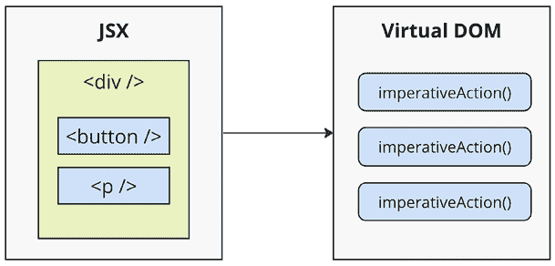

# 1

# 为什么选择 React？

如果你正在阅读这本书，你可能已经熟悉**React**了。但如果你不熟悉，不要担心。我会尽力将哲学定义保持到最小。然而，这是一本内容丰富的长书，所以我感觉设定基调是一个合适的第一步。我们的目标是学习 React 和**React Native**，但也是构建一个可扩展和适应性强的架构，可以处理我们今天和未来想要用 React 构建的一切。换句话说，我们想要围绕 React 建立一个基础，并配备一套额外的工具和方法，这些工具和方法能够经受时间的考验。本书将指导你使用诸如路由、TypeScript 类型、测试等工具的过程。

本章首先简要解释了 React 存在的理由。然后，我们将思考 React 的简洁性以及它如何能够处理许多网络开发者面临的典型性能问题。接下来，我们将探讨 React 的声明式哲学以及 React 程序员可以期望与之一起工作的抽象级别。然后，我们将简要介绍 React 的一些主要功能。最后，我们将探讨如何设置一个项目以开始使用 React。

一旦你对 React 及其如何解决 UI 开发问题有了概念性的理解，你将更有能力应对本书的其余部分。本章将涵盖以下主题：

+   什么是 React？

+   React 的新功能有哪些？

+   设置新的 React 项目

# 什么是 React？

我认为 React 在其主页上的一行描述([`react.dev/`](https://react.dev/))简洁且准确：

> “一个用于构建用户界面的 JavaScript 库。”

这非常完美，因为事实证明，这是我们大多数时候想要的全部。我认为这个描述最好的部分就是它省略了所有内容。它不是一个大型框架。它不是一个全栈解决方案，将处理从数据库到通过**WebSocket**连接的实时更新的所有事情。我们可能实际上并不需要大多数这些预包装的解决方案。如果 React 不是一个框架，那么它究竟是什么呢？

## React 只是视图层

通常认为 React 是应用程序中的*视图层*。应用程序通常分为不同的层，如视图层、逻辑层和数据层。在这个背景下，React 主要处理视图层，这涉及到根据数据和应用状态的变化来渲染和更新 UI。React 组件改变用户看到的内容。以下图表说明了 React 在我们前端代码中的位置：


图 1.1：React 应用程序的层级

这就是 React 的全部内容——核心概念。当然，随着我们阅读本书，这个主题可能会有细微的变化，但流程大致相同：

1.  **应用逻辑**：从一些生成数据的应用逻辑开始

1.  **将数据渲染到 UI 上**：下一步是将这些数据渲染到 UI 上。

1.  **React 组件**：为了实现这一点，您将数据传递给 React 组件。

1.  **组件的角色**：React 组件承担将 HTML 放入页面的责任。

你可能会想这有什么大不了的；React 看起来只是另一种渲染技术。在章节的剩余部分，我们将讨论 React 在哪些关键领域可以简化应用程序开发。

## 简单是好的

React 没有太多需要学习和理解的部分。虽然 React 吹嘘有一个相对简单的 API，但重要的是要注意，在表面之下，React 以一定程度的复杂性运行。在这本书的整个过程中，我们将深入研究这些内部工作原理，探索 React 架构和机制的各个方面，以提供给您一个全面的理解。使用小型 API 的优势在于，您可以花更多的时间熟悉它，实验它，等等。相反，大型框架则不同，您所有的时间都用于弄清楚一切是如何工作的。以下图表为您提供了一个大致的概念，当使用 React 编程时，我们需要考虑哪些 API：


图 1.2：React API 的简单性

React 分为两个主要 API：

+   **React 组件 API**：这些是页面由**React DOM**渲染的部分。

+   **React DOM**：这是用于在网页上执行渲染的 API。

在 React 组件中，我们有以下区域需要考虑：

+   **数据**：这是来自某处（组件并不关心它来自哪里）的数据，并由组件渲染。

+   **生命周期**：例如，生命周期的一个阶段是组件即将被渲染的时候。在 React 组件中，方法或钩子会响应组件在 React 渲染过程中的进入和退出阶段，这些阶段随着时间的推移而发生。

+   **事件**：这是我们编写的响应用户交互的代码。

+   **JSX**：这是在 React 组件中描述 UI 结构的常用语法。尽管 JSX 与 React 紧密相关，但它也可以与其他**JavaScript**框架和库一起使用。

不要一开始就专注于这些不同的 React API 区域代表什么。这里的要点是，React 本质上很简单。只需看看有多少东西需要弄清楚！这意味着我们不必花很多时间在这里详细研究 API。相反，一旦掌握了基础知识，我们就可以花更多的时间在符合声明式 UI 结构的细微 React 使用模式上。

## 声明式 UI 结构

React 新手往往难以理解组件如何将标记与 JavaScript 混合以声明 UI 结构。如果你看过 React 示例并产生了相同的负面反应，请不要担心。起初，我们可能会对这个方法持怀疑态度，我认为原因是我们几十年来一直被“关注点分离”原则所影响。这个原则指出，不同的关注点，如逻辑和展示，应该彼此分离。现在，每当我们看到事物结合在一起时，我们就会自动假设这是不好的，不应该发生。

React 组件使用的语法称为 **JSX**（即 **JavaScript XML**，也称为 **JavaScript 语法扩展**）。组件通过返回一些 JSX 来渲染内容。JSX 本身通常是 HTML 标记，混合了 React 组件的自定义标签。具体细节在此处并不重要；我们将在接下来的章节中详细介绍。

声明式 JSX 方法令人耳目一新的地方在于，我们不必手动执行复杂的操作来更改组件的内容。相反，我们描述 UI 在不同状态下的外观，React 高效地更新实际的 DOM 以匹配。因此，React UI 变得更容易和更高效地处理，从而带来更好的性能。

例如，想想使用 jQuery 来构建你的应用程序。你有一个页面，上面有一些内容，你想要在按钮点击时给一个段落添加一个类：

```js
$(document).ready(function() {
  $('#my-button').click(function() {
    $('#my-paragraph').addClass('highlight');
  });
}); 
```

执行这些步骤足够简单。这被称为命令式编程，对于 UI 开发来说是有问题的。命令式编程在 UI 开发中的问题在于，它可能导致难以维护和修改的代码。这是因为命令式代码通常紧密耦合，意味着对代码某一部分的更改可能会在别处产生意外的后果。此外，命令式代码可能难以推理，因为它可能很难理解控制流的流动和应用程序在任何给定时间的状态。虽然这个更改元素类的例子很简单，但真实的应用程序往往需要超过三四个步骤才能实现某个功能。

React 组件不需要你以命令式的方式执行步骤。这就是 JSX 成为 React 组件核心的原因。XML 风格的语法使得描述 UI 应该是什么样子变得容易——也就是说，组件将要渲染哪些 HTML 元素？

```js
export const App = () => {
  const [isHighlighted, setIsHighlighted] = useState(false);
  return (
    <div>
      <button onClick={() => setIsHighlighted(true)}>Add Class</button>
      <p className={isHighlighted && "highlight"}>This is paragraph</p>
    </div>
  );
}; 
```

在这个例子中，我们不仅仅是编写浏览器应该执行的命令式程序。这更像是一条指令，我们说明 UI 应该是什么样子，以及用户应该如何与之交互。这被称为声明式编程，非常适合 UI 开发。一旦你声明了你的 UI 结构，你需要指定它如何随时间变化。

## 数据会随时间变化

另一个对 React 新手来说难以掌握的领域是 JSX 就像一个静态字符串，代表了一块渲染输出的片段。这就是数据和时间的流逝发挥作用的地方。React 组件依赖于传入它们的数据。这些数据代表了 UI 的动态部分——例如，基于布尔值的渲染 UI 元素可能会在组件下一次渲染时发生变化。以下是一个说明这个概念的图示：


图 1.3：React 组件随时间变化

每次 React 组件渲染时，就像在那个确切时刻对 JSX 进行快照。随着你的应用程序随时间推移，你将有一个有序的渲染 UI 组件集合。除了声明性地描述 UI 应该是什么样子之外，重新渲染相同的 JSX 内容使开发者的工作变得更加容易。挑战在于确保 React 可以处理这种方法的性能需求。

## 性能很重要

使用 React 构建 UI 意味着我们可以用 JSX 声明 UI 的结构。这比逐个组装 UI 的命令式方法更不容易出错。然而，声明式方法在性能上确实提出了挑战。

例如，对于初始渲染来说，具有声明性 UI 结构是可行的，因为页面上还没有任何内容。所以 React 渲染器可以查看 JSX 中声明的结构，并在 DOM 浏览器中渲染它。

**文档对象模型**（**DOM**）代表浏览器中渲染后的 HTML。DOM API 是 JavaScript 如何更改页面内容的方式。

以下图示说明了这个概念：


图 1.4：JSX 语法在浏览器 DOM 中如何转换为 HTML

在初始渲染时，React 组件及其 JSX 与其他模板库没有区别。例如，有一个名为**Handlebars**的模板库用于服务器端渲染，它将模板渲染为 HTML 标记字符串，然后将其插入到浏览器 DOM 中。React 与 Handlebars 等库的不同之处在于，React 可以在数据发生变化并且我们需要重新渲染组件时进行适应，而 Handlebars 将仅仅重新构建整个 HTML 字符串，就像它在初始渲染时做的那样。由于这对性能来说是个问题，我们通常最终会实现命令式的工作区，手动更新 DOM 的一小部分。我们最终会得到一个声明性模板和命令式代码的混乱组合，用于处理 UI 的动态方面。

我们在 React 中不这样做。这就是 React 与其他视图库不同的地方。组件在初始渲染时是声明性的，即使在它们重新渲染时也是如此。这就是 React 在底层如何使声明性 UI 结构的重新渲染成为可能。

然而，在 React 中，当我们创建一个组件时，我们清楚地描述了它应该看起来是什么样子。即使我们更新我们的组件，React 也会在幕后平滑地处理这些变化。换句话说，组件在初始渲染时是声明式的，即使在重新渲染时也是如此。这是可能的，因为 React 使用虚拟 DOM，它用于在内存中保持真实 DOM 元素的表示。它这样做是为了每次我们重新渲染一个组件时，它都可以将新内容与页面上已显示的内容进行比较。根据差异，虚拟 DOM 可以执行必要的命令步骤来做出更改。因此，当我们需要更新 UI 时，我们不仅保留了我们的声明式代码，React 还会确保它是高效完成的。以下是这个过程的样子：



图 1.5：React 将 JSX 语法转换为命令式 DOM API 调用

当您阅读有关 React 的内容时，您经常会看到诸如 **diffing** 和 **patching** 这样的词汇。Diffing 意味着比较 *旧内容*（UI 的先前状态）与 *新内容*（更新的状态）以识别差异，就像比较文档的两个版本以查看发生了什么变化一样。Patching 意味着执行必要的 DOM 操作以渲染新内容，确保只做出特定的更改，这对于性能至关重要。

与任何其他 JavaScript 库一样，React 受限于主线程的 *运行至完成* 特性。例如，如果 React 虚拟 DOM 逻辑正忙于比较内容并修补真实 DOM，浏览器就无法响应用户输入，如点击或交互。

在本章的下一节中，您将看到对 React 内部渲染算法进行了修改，以减轻这些性能陷阱。在解决了性能问题后，我们需要确保 React 足够灵活，能够适应我们未来可能希望部署应用程序的不同平台。

## 正确的抽象层次

在我们深入研究 React 代码之前，我想在较高层次上讨论另一个主题，那就是 **抽象**。

在上一节中，您看到了 JSX 语法如何转换为低级操作来更新我们的 UI。React 将我们的声明式 UI 组件转换为更好的方式是，我们并不一定关心渲染目标是什么。在 React 中，渲染目标恰好是浏览器 DOM，但正如我们将要看到的，它并不局限于浏览器 DOM。

React 有潜力用于我们想要创建的任何 UI，在任何可想象设备上。我们只是刚开始看到 React Native，但可能性是无限的。我不会对*React Toast*（这根本不是一回事）突然变得相关而感到惊讶，其中 React 针对的是可以将 JSX 渲染输出烧焦到面包上的烤面包机。React 的抽象级别在多功能性和适应性之间取得了平衡，同时保持了实际和高效的用户界面开发方法。

以下图表展示了 React 如何针对不仅仅是浏览器：


图 1.6：React 将目标渲染环境从我们实现的组件中抽象出来

从左到右，我们有**React DOM**、**React Native**、**React PDF**和**React Unity**。所有这些 React 渲染器库都接受 React 组件并返回特定平台的输出。正如你所见，要针对新事物，相同的模式适用：

+   实现特定于目标组件。

+   实现一个 React 渲染器，使其能够在底层执行特定平台的操作。

这显然是对任何给定 React 环境中实际实现内容的过度简化。但对于我们来说，细节并不那么重要。重要的是，我们可以利用我们的 React 知识来专注于描述我们任何平台上的 UI 结构。

现在你已经了解了 React 中抽象的作用，让我们看看 React 的新特性。

# React 的新特性是什么？

React 是一个在不断变化的 Web 开发领域中持续演进的库。当你开始学习并掌握 React 的旅程时，了解库的演变及其随时间的变化是很重要的。

React 的一个优点是，其核心 API 在近年来相对稳定。这提供了一种连续性，并允许开发者利用他们从先前版本中获得的知识。React 的概念基础保持完整，这意味着三五年前获得的技能今天仍然适用。让我们回顾一下，从 React 的早期版本到最近的版本，React 的历史。从**React 0.x**到**React 18**，已经进行了许多关键的变化和增强，如下所示：

+   **React 0.14**：在这个版本中，函数组件的引入允许开发者将函数用作组件，简化了基本 UI 元素的创建。当时，没有人知道现在我们只会编写函数组件，几乎完全放弃基于类的组件。

+   **React 15**：采用新的版本方案，React 15 的下一个更新对内部架构进行了全面的重构，从而提高了性能和稳定性。

+   **React 16**：然而，这个版本是 React 历史上最引人注目的发布之一。它引入了 hooks，这是一个革命性的概念，使开发者能够在不使用类组件的情况下使用状态和其他 React 功能。Hooks 使代码更简单、更易读，改变了开发者编写组件的方式。本书将探讨许多 hooks。此外，React 16 还引入了 **Fiber**，这是一种新的协调机制，显著提高了性能，尤其是在处理动画和复杂 UI 结构时。

+   **React 17**：这个版本专注于更新和维护与先前版本的兼容性。它引入了一个新的 JSX 转换系统。

+   **React 18**：这次发布继续了改进的轨迹，强调了性能提升和新增功能，例如渲染的自动批处理、状态转换、服务器组件和流式服务器端渲染。与性能相关的大部分重要更新将在**第十二章**，**高性能状态更新**中进行探讨。关于服务器端渲染的更多细节将在**第十四章**，**使用 React 框架进行服务器端渲染和静态站点生成**中介绍。

+   **React 19**：引入了几个主要功能和改进。**React 编译器**是一个新的编译器，它能够实现自动记忆化并优化重新渲染，消除了手动 `useMemo`、`useCallback` 和记忆优化。增强的 **Hooks**，如用于数据获取的 `use`(promise)、用于表单处理的 `useFormStatus()` 和 `useFormState()`、以及用于乐观 UI 的 `useOptimistic()` 简化了常见任务。React 19 还带来了简化的 API，例如 ref 成为常规属性、React.lazy 被取代，以及 Context.Provider 变为 Context。异步渲染允许在渲染过程中异步获取数据，而不会阻塞 UI，而错误处理改进提供了更好的机制来诊断和修复应用程序中的问题。

React 的稳定性和兼容性使其成为长期使用的可靠库，而持续的更新确保它始终处于网络和移动开发的前沿。在这本书中，所有示例都将使用最新的 React API，确保它们在未来版本中仍然功能性和相关性。

现在我们已经探讨了 React 的演变和更新，我们可以更深入地了解 React，并检查如何设置新的 React 项目。

# 设置新的 React 项目

在开始创建 React 项目时，有几种方法可以创建 React 项目。在本节中，我们将探讨三种常见的方法：

+   使用网络打包器

+   使用框架

+   使用在线代码编辑器

    要开始开发和预览您的 React 应用程序，您首先需要在您的计算机上安装 **Node.js**。Node.js 是执行 JavaScript 代码的运行环境。

让我们接下来在以下子节中深入了解每种方法。

# 使用网络打包器

使用网络打包器是创建 React 项目的有效方法，尤其是如果你正在构建一个**单页应用程序**（**SPA**）。在这本书的所有示例中，我们将使用**Vite**作为我们的网络打包器。Vite 以其卓越的速度和易于设置及使用而闻名。

要使用 Vite 设置你的项目，你需要采取以下步骤：

1.  请确保你的计算机上已安装 Node.js，你可以通过访问官方 *Node.js* 网站 ([`nodejs.org/`](https://nodejs.org/)) 并下载适合你操作系统的相应版本来做到这一点。

1.  打开你的终端或命令提示符，导航到你想要创建项目的目录：

    ```js
    mkdir react-projects
    cd react-projects 
    ```

1.  运行以下命令以使用 Vite 创建一个新的 React 项目：

    ```js
    npm create vite@latest my-react-app -- --template react 
    ```

    此命令创建一个名为 `my-react-app` 的新目录，并使用 Vite 模板设置一个 React 项目。

1.  一旦项目创建完成，你的终端应该如下所示：

    ```js
    Scaffolding project in react-projects/my-react-app...
    Done. Now run:
      cd my-react-app
      npm install
         npm run dev 
    ```

1.  导航到项目目录并安装依赖项。终端的结果应该如下所示：

    ```js
    added 279 packages, and audited 280 packages in 21s
    103 packages are looking for funding
      run 'npm fund' for details
    found 0 vulnerabilities 
    ```

最后，通过运行以下命令启动开发服务器：`npm run dev`

此命令启动开发服务器，你可以通过打开浏览器并访问 `http://localhost:3000` 来查看你的 React 应用程序。

到目前为止，你已经成功使用 Vite 作为网络打包器设置了你的 React 项目。有关 Vite 及其可能的配置的更多信息，请访问官方网站 [`vitejs.dev/`](https://vitejs.dev/)。

## 使用框架

对于现实世界和商业项目，建议使用构建在 React 之上的框架。这些框架提供了额外的功能，例如路由和资产管理（图像、SVG 文件、字体等）。它们还指导你有效地组织项目结构，因为框架通常强制执行特定的文件组织规则。一些流行的 React 框架包括**Next.js**、**Gatsby**和**Remix**。

在**第十三章**，**服务器端渲染**中，我们将探讨设置 Next.js 以及它与使用普通网络打包器之间的差异。

## 在线代码编辑器

在线代码编辑器结合了网络打包器和框架的优点，但允许你在云端或直接在浏览器中设置你的 React 开发环境。这消除了在你的机器上安装任何东西的需要，并让你可以直接在浏览器中编写和探索 React 代码。

虽然有各种在线代码编辑器可供选择，其中一些最受欢迎的选项包括**CodeSandbox**、**StackBlitz**和**Replit**。这些平台提供了一个用户友好的界面，并允许你创建、分享和协作 React 项目，而无需任何本地设置。

要开始使用在线代码编辑器，您甚至不需要账户。只需在浏览器上遵循此链接：[`react.new`](https://react.new)。几秒钟后，您将看到 CodeSandbox 已经准备好使用模板项目进行工作，并且编辑器的实时预览可以直接在浏览器标签中查看。如果您想保存更改，则需要创建账户。

使用在线代码编辑器是学习和实验 React 的便捷方式，尤其是如果您更喜欢基于浏览器的开发环境。

在本节中，我们探讨了不同的方法来设置您的 React 项目。无论您选择 Web 打包器、框架还是在线代码编辑器，每种方法都提供了其独特的优势。选择您喜欢且适合您项目需求的方法。现在，我们准备好进入 React 开发的领域了！

# 摘要

在本章中，我们全面介绍了 React，以便您对其有一个大致的了解以及其必要的方面，为本书的其余部分定下基调。React 是一个具有小型 API 的库，用于构建 UI。然后，我们向您介绍了 React 的一些关键概念。我们讨论了 React 之所以简单，是因为它没有很多可移动部件。

之后，我们探讨了 React 组件和 JSX 的声明性本质。在此之后，您了解到 React 通过编写可重复渲染的声明性代码来实现有效的性能。

您还深入了解了渲染目标的概念以及 React 如何轻松成为各种平台的首选 UI 工具。然后，我们为您提供了 React 历史的简要概述并介绍了最新进展。最后，我们深入探讨了如何设置新的 React 项目并启动学习过程。

目前，这些就足够作为入门和概念性内容了。随着我们继续阅读本书，我们将重新审视这些概念。接下来，让我们退后一步，牢固掌握基础知识，从下一章使用 JSX 进行渲染开始。

# 加入我们的 Discord 吧！

与其他用户和作者一起阅读本书。提出问题，为其他读者提供解决方案，与作者聊天等等。扫描二维码或访问链接加入社区。

[`packt.link/ReactAndReactNative5e`](https://packt.link/ReactAndReactNative5e)


