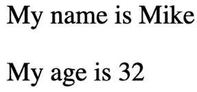
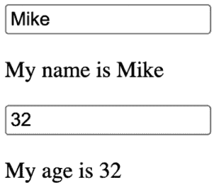
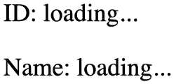
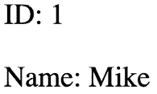
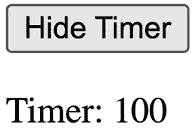

# 第三章：理解 React 组件和 Hooks

在本章中，我们将深入探讨 React 组件及其基本方面，并介绍**Hooks**的强大功能。

我们将探讨组件数据的基本概念以及它是如何塑造你的 React 应用结构的。我们将讨论两种主要的组件数据类型：**属性**和**状态**。属性允许我们向组件传递数据，而状态使组件能够动态地管理和更新其内部数据。我们将探讨这些概念如何应用于函数组件，并说明设置组件状态和传递属性的工作原理。

在本章中，我们将涵盖以下主题：

+   React 组件简介

+   组件属性是什么？

+   组件状态是什么？

+   React Hooks

+   使用 Hooks 维护状态

+   执行初始化和清理操作

+   使用 context Hooks 共享数据

+   使用 Hooks 进行记忆化

# 技术要求

本章的代码可以在以下链接找到：[`github.com/PacktPublishing/React-and-React-Native-5E/tree/main/Chapter03`](https://github.com/PacktPublishing/React-and-React-Native-5E/tree/main/Chapter03)

# React 组件简介

React 组件是现代 Web 和移动应用的基础构建块。它们封装了可重用的代码部分，用于定义用户界面不同部分的架构、行为和外观。通过将 UI 分解成更小、更独立的组件，React 使开发者能够创建可扩展、可维护和交互式的应用。

在本质上，React 组件是一个返回类似 HTML 标记的 JSX 语法的 JavaScript 函数或类。在本书中，我们将主要关注函数组件，因为它们在近年来已成为构建组件的首选方法。与类组件相比，函数组件更简单、更简洁、更容易理解。它们利用 JavaScript 函数的力量，并利用 React Hooks 来管理状态和执行副作用。

在 React 中使用组件的主要优势之一是它们的可重用性。组件可以在应用的多个部分中重用，减少代码重复并提高开发效率。此外，组件促进了模块化开发方法，使开发者能够将复杂的 UI 分解成更小、更易于管理的部分。

# 组件属性是什么？

在 React 中，**组件属性**，通常称为**props**，允许我们将数据从父组件传递到其子组件。Props 提供了一种定制和配置组件的方式，使它们灵活且可重用。Props 是只读的，这意味着子组件不应直接修改它们。相反，父组件可以更新 props 值并触发子组件的重新渲染，以使用更新的数据。

当定义一个函数组件时，你可以将其作为参数访问传递给它的 props：

```js
const MyComponent = (props) => {
  return (
    <div>
      <h1>{props.title}</h1>
      <p>{props.description}</p>
    </div>
  );
}; 
```

在上面的例子中，`MyComponent`函数组件将 props 对象作为参数接收。我们可以通过点符号访问单个属性，例如`props.title`和`props.description`，以在组件的 JSX 标记中渲染数据。也可以通过解构来访问属性：

```js
const MyComponent = ({ title, description }) => {
  return (
    <div>
      <h1>{title}</h1>
      <p>{description}</p>
    </div>
  );
}; 
```

如你所见，这种方法甚至更简洁，还允许我们使用另一个解构特性，默认值，我们将在本章中讨论。

## 传递属性值

React 组件属性是通过在渲染组件时传递 JSX 属性来设置的。在第七章*Type Checking and Validation with TypeScript*中，我将更详细地介绍如何验证传递给组件的属性值。现在，让我们创建一些额外的组件，除了`MyComponent`之外，它们期望不同类型的属性值：

```js
const MyButton = ({ disabled, text }) => {
  return <button disabled={disabled}>{text}</button>;
}; 
```

这个简单的按钮组件期望一个布尔值禁用属性和一个字符串文本属性。当我们创建组件来展示如何传递以下属性时，你会注意到我们已经在按钮 HTML 元素中传递了这些属性：

+   **禁用属性**：我们将其放入按钮属性中，属性名为`disabled`

+   **文本属性**：我们将其作为子属性传递给按钮

还重要的是要知道，你想要传递给组件的任何 JavaScript 表达式都应该用大括号括起来。

让我们再创建一个期望数组属性值的组件：

```js
const MyList = ({ items }) => (
  <ul>
    {items.map((i) => (
      <li key={i}>{i}</li>
    ))}
  </ul>
); 
```

你可以通过 JSX 传递几乎任何你想要的属性值，只要它是一个有效的 JavaScript 表达式。`MyList`组件接受一个 items 属性，一个映射到`<li>`元素的数组。

现在，让我们编写一些代码来设置这些属性值：

```js
import * as ReactDOM from "react-dom";
import MyButton from "./MyButton";
import MyList from "./MyList";
import MyComponent from "./MyComponent";
const root = ReactDOM.createRoot(document.getElementById("root"));
const appState = {
  text: "My Button",
  disabled: true,
  items: ["First", "Second", "Third"],
};
function render(props) {
  root.render(
    <main>
      <MyComponent
        title="Welcome to My App"
        description="This is a sample component."
      />
      <MyButton text={props.text} disabled={props.disabled} />
      <MyButton text="Another Button" disabled />
      <MyList items={props.items} />
    </main>
  );
}
render(appState);
setTimeout(() => {
  appState.disabled = false;
  appState.items.push("Fourth");
  render(appState);
}, 1000); 
```

`render`函数看起来每次被调用时都会创建新的 React 组件实例。React 足够智能，能够判断这些组件已经存在，并且它只需要确定新属性值将导致输出差异。在这个例子中，`setTimeout`的调用导致 1 秒的延迟。然后，`appState.disabled`的值被更改为 false，`appState.items`数组末尾添加了一个新值。对`render`的调用将使用新的属性值重新渲染组件。

从这个例子中，我们还可以得到一个启示，即你有一个`appState`对象，它保留着应用程序的状态。当组件渲染时，这个状态的一部分会被作为属性传递给组件。状态必须存在于某个地方，在这个例子中，它位于组件之外。我们将在*第十二章*，*React 中的状态管理*中深入探讨这种方法，以及为什么它很重要。

希望你已经注意到我们渲染了另一个按钮，我们以不同的方式传递了 props：

```js
<MyButton text="Another Button" disabled /> 
```

这是一个有效的 JSX 表达式，如果我们想向组件传递常量值，我们可以传递不带花括号的字符串，并传递布尔值 `true`，只需在组件中留下属性名即可。

## 默认属性值

除了传递数据之外，我们还可以使用 `defaultProps` 属性指定属性的默认值。当属性未提供时，这很有用，确保组件仍然表现正确：

```js
const MyButton = ({ disabled, text }) => (
  <button disabled={disabled}>{text}</button>
);
MyButton.defaultProps = {
  disabled: false,
  text: "My Button",
}; 
```

在此情况下，如果父组件没有提供 `text` 或 `disabled` 属性，组件将回退到在 `defaultProps` 中指定的默认值。

如我之前所述，使用解构，我们有更方便的方式来设置默认属性。

让我们看看 `MyButton` 组件的更新示例：

```js
const MyButton = ({ disabled = false, text = "My Button" }) => (
  <button disabled={disabled}>{text}</button>
); 
```

使用解构，我们可以在函数内部定义属性并设置默认值。当组件有很多属性时，这更简洁且易于查看。

在接下来的章节中，我们将进一步探讨使用 Hooks 和其他关键概念的组件状态。

# 什么是组件状态？

在 React 中，组件状态指的是组件持有的内部数据。它代表可以在组件内部使用并可随时间更新的可变值。状态允许组件跟踪可能发生变化的信息，例如用户输入、API 响应或任何需要动态和响应式的其他数据。

状态是 React 提供的一个特性，它使组件能够管理和更新它们自己的数据。它允许组件在状态变化时重新渲染，确保用户界面反映了最新的数据。

要在 React 组件中定义状态，你应该在组件内部使用 `useState` hook。然后你可以在组件的方法或 JSX 代码中访问和修改状态。当状态更新时，React 会自动重新渲染组件及其子组件以反映这些更改。

在跳转到组件中使用状态的示例之前，让我们简要地探索一下 React hook 是什么。

# React Hooks

React Hooks 是在 **React 16.8** 中引入的一个特性，它允许你在函数组件中使用状态和其他 React 特性。在 Hooks 之前，状态管理和生命周期方法主要在类组件中使用。Hooks 提供了一种在函数组件中实现类似功能的方法，使它们更强大、更容易编写和理解。

Hooks 是一些函数，它们使你能够“挂钩”到 React 的内部特性，例如状态管理、上下文、效果等。它们以 `use` 关键字为前缀（例如 `useState`、`useEffect`、`useContext` 等）。React 提供了几个内置的 Hooks，你也可以创建自定义 Hooks 来封装可重用的状态逻辑。

最常用的内置 Hooks 包括：

+   `useState`：这个钩子允许你在函数式组件中添加状态。它返回一个包含两个元素的数组：当前状态值和一个用于更新状态的函数。

+   `useEffect`：这个钩子允许你在组件中执行副作用，例如获取数据、订阅事件或手动操作 DOM。它默认在每次渲染后运行，可以用来处理组件的生命周期事件，比如组件挂载、更新或卸载。

+   `useContext`：这个钩子允许你从 React 上下文中消费值。它提供了一种方法来访问上下文值，而无需嵌套多个组件。

+   `useCallback` 和 `useMemo`：这些钩子用于性能优化。`useCallback` 缓存了一个函数，防止它在每次渲染时被重新创建，而 `useMemo` 缓存了一个值，只有当它的依赖项改变时才会重新计算。

我们将在本章中检查所有这些钩子，并在整本书中使用它们。让我们继续讨论状态，并探索如何使用 `useState` 钩子来管理它。

## 使用 Hooks 维护状态

我们将要查看的第一个 React 钩子 API 被称为 `useState`，它使你的函数式 React 组件能够拥有状态。在本节中，你将学习如何使用 Hooks 初始化状态值并改变组件的状态。

## 初始状态值

当我们的组件首次渲染时，它们可能期望设置一些状态值。这被称为组件的初始状态，我们可以使用 `useState` 钩子来设置初始状态。

让我们来看一个例子：

```js
export default function App() {
  const [name] = React.useState("Mike");
  const [age] = React.useState(32);
  return (
    <>
      <p>My name is {name}</p>
      <p>My age is {age}</p>
    </>
  );
} 
```

`App` 组件是一个功能性的 React 组件，它返回 JSX 标记。但现在它也是一个有状态的组件，多亏了 `useState` 钩子。这个例子初始化了两个状态值，`name` 和 `age`。这就是为什么有两个 `useState` 调用，每个状态值一个。

你可以在组件中拥有你需要的任意数量的状态。最佳实践是每个状态值使用一个 `useState` 调用。你当然可以使用一个 `useState` 调用来定义一个对象作为组件的状态，但这会使事情变得复杂，因为你必须通过对象来访问状态值，而不是直接访问。使用这种方法更新状态值也会更复杂。如果有疑问，请为每个状态值使用一个 `useState` 钩子。

当我们调用 `useState` 时，我们得到一个返回给我们的数组。这个数组的第一个值是状态值本身。由于我们在这里使用了数组解构语法，我们可以将值命名为我们想要的任何名称；在这种情况下，它是 `name` 和 `age`。这两个常量在组件首次渲染时都有值，因为我们已经将每个的初始状态值传递给了 `useState`。以下是渲染后的页面外观：



图 3.1：使用状态钩子值渲染的输出

既然你已经看到了如何设置组件的初始状态值，让我们来了解一下如何更新这些值。

### 更新状态值

React 组件使用状态来表示随时间变化的价值。组件使用的状态值最初处于一种状态，就像我们在上一节中看到的那样，然后响应某些事件而改变：例如，服务器响应 API 请求并返回新数据，或者用户点击了按钮或更改了表单字段。

要更新状态，`useState` 钩子为每一块状态提供了一个单独的函数，我们可以从 `useState` 钩子返回的数组中访问它。第一个元素是状态值，第二个是用于更新值的函数。让我们看看一个例子：

```js
function App() {
  const [name, setName] = React.useState("Mike");
  const [age, setAge] = React.useState(32);
  return (
    <>
      <section>
        <input value={name} onChange={(e) => setName(e.target.value)} />
        <p>My name is {name}</p>
      </section>
      <section>
        <input
          type="number"
          value={age}
          onChange={(e) => setAge(e.target.value)}
        />
        <p>My age is {age}</p>
      </section>
    </>
  );
} 
```

就像初始状态值部分中的示例一样，本例中的 `App` 组件有两个状态：`name` 和 `age`。与前面的示例不同，此组件使用两个函数来更新每一块状态。这些函数是从 `useState` 调用中返回的。让我们更仔细地看看：

```js
const [name, setName] = React.useState("Mike");
const [age, setAge] = React.useState(32); 
```

现在，我们有两个函数：`setName` 和 `setAge`，它们可以用来更新我们组件的状态。让我们看看更新 `name` 状态的文本输入字段：

```js
<section>
  <input value={name} onChange={(e) => setName(e.target.value)} />
  <p>My name is {name}</p>
</section> 
```

当用户更改 `<input>` 字段中的文本时，会触发 `onChange` 事件。此事件的处理器调用 `setName`，并将 `e.target.value` 作为参数传递给它。传递给 `setName` 的参数是名称的新状态值。接下来的段落显示了每次用户更改文本输入时，文本输入也会更新名称的新值。

接下来，让我们看看 `age` 数字输入字段以及这个值是如何传递给 `setAge` 的：

```js
<section>
  <input
    type="number"
    value={age}
    onChange={(e) => setAge(e.target.value)}
  />
  <p>My age is {age}</p>
</section> 
```

`age` 字段遵循与 `name` 字段完全相同的模式。唯一的区别是我们将输入类型设置为数字。每当数字发生变化时，`setAge` 就会被调用，并带有 `onChange` 事件响应的更新值。接下来的段落显示了随着 `age` 状态的每次更改，数字输入也会更新。

当这两个输入及其对应的段落在屏幕上渲染时，它们看起来是这样的：



图 3.2：使用 Hooks 更改状态值

在本节中，你学习了 `useState` 钩子，它用于向功能 React 组件添加状态。每一块状态都使用它自己的钩子，并有自己的值变量和自己的设置函数。这大大简化了在组件中访问和更新状态。任何给定的状态值都应该有一个初始值，这样组件才能在第一次渲染时正确显示。要重新渲染使用状态钩子的功能组件，你可以使用 `useState` 返回的设置函数来按需更新你的状态值。

你接下来要学习的下一个钩子用于执行初始化和清理操作。

# 执行初始化和清理操作

通常，我们的 React 组件需要在组件创建时执行某些操作。例如，一个常见的初始化操作是获取组件需要的 API 数据。另一个常见操作是在组件移除时确保任何挂起的 API 请求被取消。在本节中，你将了解 `useEffect` 钩子以及它如何帮助你在这些两种场景下。你还将了解如何确保初始化代码不会运行得太频繁。

## 获取组件数据

`useEffect` 钩子用于在组件中运行“副作用”。另一种思考副作用代码的方式是，函数组件只有一个任务：返回用于渲染的 JSX 内容。如果组件需要做其他事情，例如获取 API 数据，这应该在 `useEffect` 钩子中完成。例如，如果你只是将 API 调用作为组件函数的一部分，你可能会引入竞态条件和其他难以修复的故障行为。

让我们看看一个使用 Hooks 获取 API 数据的示例：

```js
function App() {
  const [id, setId] = React.useState("loading...");
  const [name, setName] = React.useState("loading...");
  const fetchUser = React.useCallback(() => {
    return new Promise((resolve) => {
      setTimeout(() => {
        resolve({ id: 1, name: "Mike" });
      }, 1000);
    });
  }, []);
  React.useEffect(() => {
    fetchUser().then((user) => {
      setId(user.id);
      setName(user.name);
    });
  });
  return (
    <>
      <p>ID: {id}</p>
      <p>Name: {name}</p>
    </>
  );
} 
```

`useEffect` 钩子期望一个函数作为参数。这个函数在组件完成渲染后以安全的方式被调用，不会干扰 React 在组件背后进行的任何其他操作。让我们更仔细地看看这个示例的各个部分，从模拟 API 函数开始：

```js
const fetchUser = React.useCallback(() => {
  return new Promise((resolve) => {
    setTimeout(() => {
      resolve({ id: 1, name: "Mike" });
    }, 1000);
  });
}, []); 
```

`fetchUser` 函数使用 `useCallback` 钩子定义。这个钩子用于记忆函数，意味着它只会创建一次，并且除非依赖项发生变化，否则不会在后续渲染中重新创建。`useCallback` 接受两个参数：第一个是我们想要记忆的函数，第二个是用于识别 React 应该重新创建此函数而不是使用记忆版本的依赖项列表。`fetchUser` 函数将空数组 (`[]`) 作为依赖项列表传递。这意味着函数在初始渲染期间只会创建一次，并且在后续渲染中不会重新创建。

`fetchUser` 函数返回一个承诺。承诺解析一个包含两个属性 `id` 和 `name` 的简单对象。`setTimeout` 函数将承诺解决延迟 1 秒，因此这个函数是异步的，就像正常的 `fetch` 调用一样。

接下来，让我们看看 `App` 组件使用的 Hooks：

```js
const [id, setId] = React.useState("loading...");
const [name, setName] = React.useState("loading...");
React.useEffect(() => {
  fetchUser().then((user) => {
    setId(user.id);
    setName(user.name);
  });
}); 
```

如您所见，除了 `useCallback`，我们还在这个组件中使用了两个 Hooks：`useState` 和 `useEffect`。以这种方式组合 hook 功能非常强大且被鼓励。首先，我们设置组件的 `id` 和 `name` 状态。然后，使用 `useEffect` 设置一个函数，当承诺解决时调用 `fetchUser` 并设置组件的状态。

这是 `App` 组件首次渲染时的样子，使用初始状态 `id` 和 `name`：



图 3.3：在数据到达之前显示加载文本

1 秒后，`fetchUser` 返回的 promise 使用 API 数据解析，然后用于更新 ID 和名称状态。这导致 `App` 重新渲染：



图 3.4：状态变化，移除加载文本并显示返回值

有很大可能性，你的用户会在 API 请求挂起时在应用中导航。`useEffect` 钩子可以用来处理取消这些请求。

## 取消操作和重置状态

有很大可能性，在某个时刻，你的用户会在 API 请求的响应到达之前导航你的应用，导致组件卸载。有时你的组件可以监听某些事件，你应该在卸载组件之前删除所有监听器以避免内存泄漏。一般来说，当相关组件从屏幕中删除时，停止执行任何后台操作是很重要的。

幸运的是，`useEffect` 钩子有一个机制来清理组件移除时挂起的 `setInterval` 等效果。让我们看看一个实际应用的例子：

```js
import * as React from "react";
function Timer() {
  const [timer, setTimer] = React.useState(100);
  React.useEffect(() => {
    const interval = setInterval(() => {
      setTimer((prevTimer) => (prevTimer === 0 ? 0 : prevTimer - 1));
    }, 1000);
    return () => {
      clearInterval(interval);
    };
  }, []);
  return <p>Timer: {timer}</p>;
}
export default Timer; 
```

这是一个简单的 `Timer` 组件。它具有 `timer` 状态，它在 `useEffect()` 中设置间隔回调以更新 `timer`，并使用当前 `timer` 值渲染输出。让我们更仔细地看看 `useEffect()` 钩子：

```js
React.useEffect(() => {
  const interval = setInterval(() => {
    setTimer((prevTimer) => (prevTimer === 0 ? 0 : prevTimer - 1));
  }, 1000);
  return () => {
    clearInterval(interval);
  };
}, []); 
```

此效果通过调用带有回调的 `setInterval` 函数创建一个间隔计时器，该回调更新我们的 `timer` 状态。你在这里会发现有趣的是，对于 `setTimer` 函数，我们传递的是一个回调而不是一个数字。这是一个有效的 React API：当我们需要使用前一个状态值来计算新值时，我们可以传递一个回调，其中第一个参数是当前或“前一个”状态值，我们应该从这个回调中返回新状态值以更新我们的状态。

在 `useEffect` 中，我们还在返回一个函数，React 在组件移除时运行此函数。在这个例子中，通过调用 `setInterval` 创建的间隔被调用 `useEffect` 中返回的函数的 `clearInterval` 清除。从 `useEffect` 返回的函数将在组件将要卸载时触发。

现在，让我们看看渲染和移除 `Timer` 组件的 `App` 组件：

```js
const ShowHideTimer = ({ show }) => (show ? <Timer /> : null);
function App() {
  const [show, setShow] = React.useState(false);
  return (
    <>
      <button onClick={() => setShow(!show)}>
        {show ? "Hide Timer" : "Show Timer"}
      </button>
      <ShowHideTimer show={show} />
    </>
  );
} 
```

`App` 组件渲染一个按钮，用于切换 `show` 状态。此状态值决定是否渲染 `Timer` 组件，但通过使用 `ShowHideTimer` 便利组件。如果 `show` 为真，则渲染 `<Timer />`；否则，移除 `Timer`，触发我们的 `useEffect` 清理行为。

这是屏幕首次加载时的样子：


图 3.5：用于启动状态变化的按钮

由于`App`组件的`show`状态为`false`，`Timer`组件没有被渲染。尝试点击显示计时器按钮。这将改变`show`状态并渲染`Timer`组件：



图 3.6：显示计时器

你可以再次点击**隐藏计时器**按钮来移除`Timer`组件。如果没有添加到`useEffect`中的清理间隔，这将每次计时器渲染时创建新的监听器，这将影响内存泄漏。

React 允许我们控制何时运行我们的效果。例如，当我们想在第一次渲染后进行所有 API 请求，或者当特定状态改变时执行效果。我们将看看如何做到这一点。

## 优化副作用操作

默认情况下，React 假设每个运行的效果都需要清理，并且应该在每次渲染时运行。这通常不是情况。例如，你可能有一些特定的属性或状态值需要清理，并在它们改变时再运行一次。你可以将一个要观察的值的数组作为`useEffect`的第二个参数传递：例如，如果你有一个在改变时需要清理的解析状态，你会这样编写你的效果代码：

```js
const [resolved, setResolved] = useState(false);
useEffect(() => {
  // ...the effect code...
  return () => {
    // ...the cleanup code
  };
}, [resolved]); 
```

在此代码中，效果将在状态值解析改变时触发，并且只有在解析状态值改变时才会运行。如果效果运行但解析状态没有改变，则清理代码将不会运行，原始效果代码也不会再次运行。另一个常见的情况是，除了组件被移除时，从不运行清理代码。实际上，这正是我们在“获取用户数据”部分示例中想要发生的。目前，效果在每次渲染后都会运行。这意味着我们反复获取用户 API 数据，而我们真正想要的只是当组件首次挂载时获取一次。

让我们对从获取组件数据请求示例中的`App`组件进行一些修改：

```js
React.useEffect(() => {
  fetchUser().then((user) => {
    setId(user.id);
    setName(user.name);
  });
}, []); 
```

我们向`useEffect`添加了一个第二个参数，一个空数组。这告诉 React 没有要观察的值，并且我们只想在渲染后运行效果，并在组件移除时运行清理代码。我们还向`fetchUser`函数中添加了`console.count('fetching user')`。这使得查看浏览器开发者工具控制台并确保我们的组件数据只获取一次变得更容易。如果你从传递给`useEffect`的`[]`参数中移除，你会注意到`fetchUser`被多次调用。

在本节中，你了解了 React 组件中的副作用。效果是一个重要的概念，因为它们是 React 组件和外部世界之间的桥梁。效果最常见的使用场景之一是在组件首次创建时获取组件所需的数据，然后在组件移除后进行清理。

现在，我们将探讨另一种与 React 组件共享数据的方法：上下文。

# 使用上下文 Hooks 共享数据

React 应用程序通常有一些全局性质的数据。这意味着几个组件，可能是一个应用程序中的所有组件，共享这些数据：例如，当前登录用户的信息可能在多个地方使用。这就是**Context API**派上用场的地方。Context API 提供了一种创建共享数据存储的方法，任何树中的组件都可以访问，无论其深度如何。

要利用 Context API，我们需要使用**React**库中的`createContext`函数创建一个上下文：

```js
import { createContext } from 'react';
const MyContext = createContext(); 
```

在上面的例子中，我们使用`createContext`创建了一个名为`MyContext`的上下文。这创建了一个包含`Provider`和`Consumer`的上下文对象。

`Provider`组件负责将共享数据提供给其子组件。我们用`Provider`包装组件树的相关部分，并通过`value`属性传递数据：

```js
<MyContext.Provider value={/* shared data */}>
  {/* Child components */}
</MyContext.Provider> 
```

在`MyContext.Provider`内的任何组件都可以使用`Consumer`组件或`useContext`钩子访问共享数据。让我们看看如何使用钩子读取上下文：

```js
import React, { useContext } from 'react';
const MyComponent = () => {
  const value = useContext(MyContext);
  // Render using the shared data
}; 
```

通过利用 Context API，我们可以避免需要通过多个组件层级传递数据的 prop-drilling 问题。它简化了数据共享的过程，并允许组件直接访问共享数据，使代码更易于阅读和维护。

值得注意的是，Context API 并不适用于所有场景，应谨慎使用。它对于共享真正全局或与组件树大部分相关联的数据最有用。对于较小规模的数据共享，属性仍然是推荐的方法。

# 使用 Hooks 进行缓存

在 React 中，函数组件在每次渲染时都会被调用，这意味着昂贵的计算和函数创建可能会对性能产生负面影响。为了优化性能并防止不必要的重新计算，React 提供了三个 Hooks：`useMemo`、`useCallback`和`useRef`。这些 Hooks 允许我们分别缓存值、函数和引用。

## useMemo 钩子

`useMemo`钩子用于缓存计算结果，确保只有当依赖项发生变化时才重新计算。它接受一个函数和一个依赖项数组，并返回缓存的值。

下面是使用`useMemo`钩子的一个例子：

```js
import { useMemo } from 'react';
const Component = () => {
  const expensiveResult = useMemo(() => {
    // Expensive computation
    return computeExpensiveValue(dependency);
  }, [dependency]);
  return <div>{expensiveResult}</div>;
}; 
```

在这个例子中，`expensiveResult`值使用`useMemo`进行了缓存。函数内的计算只有在`dependency`值改变时才会执行。如果`dependency`保持不变，则返回之前缓存的值，而不是重新计算结果。

## useCallback 钩子

我们已经在本章中探讨了 `useCallback` 钩子，但我想要强调一个重要的用例。当一个函数组件渲染时，它所有的函数都会被重新创建，包括在组件内部定义的任何内联回调。这可能导致接收这些回调作为属性的孩子组件的不必要重新渲染，因为这些组件将回调视为新的引用并触发重新渲染。让我们看看下面的例子：

```js
const MyComponent = () => {
  return <MyButton onClick={() => console.log("click")} />;
}; 
```

在这个例子中，我们提供给 `onClick` 属性的匿名函数将在 `MyComponent` 每次渲染时创建。这意味着 `MyButton` 组件每次都会接收到一个新的函数引用，正如我们已知的，这将导致 `MyButton` 组件的新渲染。

下面是一个演示 `useCallback` 钩子使用的例子：

```js
const MyComponent = () => {
  const clickHandler = React.useCallback(() => {
    console.log("click");
  }, []);
  return <MyButton onClick={clickHandler} />;
}; 
```

在这个例子中，`clickHandler` 函数是通过 `useCallback` 进行缓存的。空依赖数组 `[]` 表示该函数没有依赖项，并且应该在组件的生命周期内保持不变。

因此，在 `MyComponent` 的每次渲染中，都会向 `MyButton` 提供相同的函数实例，从而防止孩子组件的不必要重新渲染。

## useRef 钩子

`useRef` 钩子允许我们创建一个在组件渲染之间持续存在的可变引用。它通常用于存储需要在渲染之间保留的值或引用，而不会触发重新渲染。此外，`useRef` 可以用来访问 DOM 节点或 React 组件实例：

```js
const Component = () => {
  const inputRef = useRef();
  const handleButtonClick = () => {
    inputRef.current.focus();
  };
  return (
    <div>
      <input type="text" ref={inputRef} />
      <button onClick={handleButtonClick}>Focus Input</button>
    </div>
  );
}; 
```

在这个例子中，`inputRef` 是通过 `useRef` 创建的，并且被分配给了 `input` 元素的 `ref` 属性。这使我们能够通过 `inputRef.current` 属性访问 DOM 节点。在 `handleButtonClick` 函数中，我们调用 `inputRef.current` 上的 focus 方法，以便在按钮被点击时聚焦输入元素。

通过使用 `useRef` 访问 DOM 节点，我们可以直接与底层的 DOM 元素交互，而不会触发组件的重新渲染。

通过利用 `useMemo`、`useCallback` 和 `useRef` 钩子的缓存功能，我们可以通过避免不必要的计算、防止不必要的重新渲染以及跨渲染保留值和引用来优化我们的 React 应用程序的性能。这导致更平滑的用户体验和更高效地使用资源。

# 摘要

本章向您介绍了 React 组件和 React Hooks。您通过实现将属性值从 JSX 传递到组件的代码来学习了组件属性或 props。接下来，您了解了状态是什么以及如何使用 `useState` 钩子来操作它。然后，您学习了 `useEffect`，它使功能 React 组件能够进行生命周期管理，例如在组件挂载时获取 API 数据，以及在组件移除时清理任何挂起的异步操作。然后，您学习了如何使用 `useContext()` 钩子来访问全局应用程序数据。最后，您学习了使用 `useMemo`、`useCallback` 和 `useMemo` 钩子进行记忆化。

在下一章中，您将学习如何使用 React 组件处理事件。
