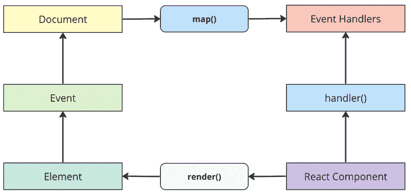
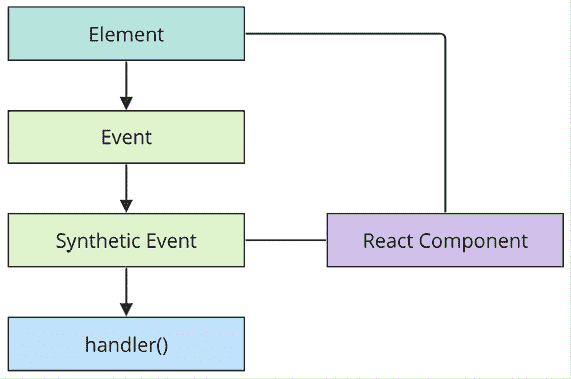
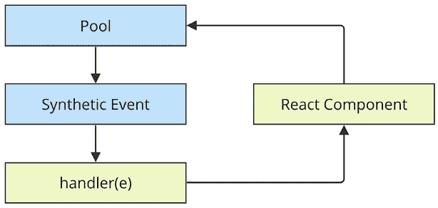

# 第四章：React 方式的事件处理

本章的重点是`高阶事件处理器`函数。

之后，你将学习 React 如何在底层将事件处理器映射到 DOM 元素。最后，你将了解 React 传递给事件处理器函数的合成事件以及它们如何为了性能目的而被池化。一旦你完成这一章，你将能够轻松地在你的 React 组件中实现事件处理器。到那时，你的应用程序将因为用户能够与之交互而变得生动起来。

本章涵盖了以下主题：

+   声明事件处理器

+   声明内联事件处理器

+   将处理器绑定到元素上

+   使用合成事件对象

+   理解事件池化

# 技术要求

本章中展示的代码可以在以下链接找到：[`github.com/PacktPublishing/React-and-React-Native-5E/tree/main/Chapter04`](https://github.com/PacktPublishing/React-and-React-Native-5E/tree/main/Chapter04)

# 声明事件处理器

与 React 组件中的事件处理相比，其区分因素在于它是声明式的。将此与例如**jQuery**进行比较，在 jQuery 中，你必须编写命令式代码来选择相关的 DOM 元素并将事件处理器函数附加到它们上。

JSX 标记中声明式事件处理器方法的优点是它们是 UI 结构的一部分。不必追踪分配事件处理器的代码，这在心理上是一种解放。

在本节中，你将编写一个基本的事件处理器，以便你可以感受到在 React 应用程序中找到的声明式事件处理语法。然后，你将学习如何使用通用事件处理器函数。

## 声明处理器函数

让我们看看一个基本的组件，它声明了一个元素的点击事件处理器：

```js
function MyButton(props) {
  const clickHandler = () => {
    console.log("clicked");
  };
  return <button onClick={clickHandler}>{props.children}</button>;
} 
```

`clickHandler`函数被传递到`<button>`元素的`onClick`属性。通过查看这个标记，你可以确切地看到当按钮被点击时将运行哪些代码。

在[`react.dev/reference/react-dom/components/common`](https://react.dev/reference/react-dom/components/common)查看官方 React 文档，以获取支持的完整事件属性名称列表。

接下来，让我们看看如何使用同一元素的不同事件处理器来响应多种类型的事件。

## 多个事件处理器

我非常喜欢声明式事件处理器语法的是，当分配给一个元素多个处理器时，它很容易阅读。有时，例如，一个元素有两个或三个处理器。对于单个事件处理器，命令式代码就很难处理，更不用说多个处理器了。当一个元素需要更多处理器时，它只是另一个 JSX 属性。从代码可维护性的角度来看，这一点从以下示例中可以看出：

```js
function MyInput() {
  const onChange = () => {
    console.log("changed");
  };
  const onBlur = () => {
    console.log("blured");
  };
  return <input onChange={onChange} onBlur={onBlur} />;
} 
```

这个`<input>`元素可以有更多的事件处理器，代码的可读性仍然很好。

当你继续向你的组件添加更多的事件处理器时，你会注意到其中很多都在做同样的事情。接下来，你将学习关于内联事件处理器函数的内容。

# 声明内联事件处理器

将处理函数分配给 JSX 属性的传统方法是使用**命名**函数。然而，有时你可能想使用**内联**函数，其中函数作为标记的一部分被定义。这是通过将箭头函数直接分配给 JSX 标记中的事件属性来完成的：

```js
function MyButton(props) {
  return (
    <button onClick={(e) => console.log("clicked", e)}>
      {props.children}
    </button>
  );
} 
```

使用这种内联事件处理器的最主要用途是当你有一个想要传递给另一个函数的**静态参数**值时。在这个例子中，你正在调用`console.log`并传入点击的字符串。你可以通过创建一个新的函数或使用高阶函数，在 JSX 标记之外设置一个特殊函数来达到这个目的。但那样你就需要为另一个函数想一个新的名字。有时候内联处理器的使用会更简单一些。

接下来，你将学习 React 是如何将处理函数绑定到浏览器中底层的 DOM 元素上的。

# 将处理器绑定到元素上

当你在 JSX 中将事件处理器函数分配给一个元素时，React 实际上并没有将事件监听器附加到底层的 DOM 元素上。相反，它将函数添加到内部函数映射中。页面上有一个文档级别的单一事件监听器。当事件通过 DOM 树向上冒泡到文档时，React 处理器会检查是否有任何组件具有匹配的处理器。这个过程在这里被展示出来：



你可能会问，为什么 React 要费这么大的劲？这与我在前几章中一直在讲述的相同原则：尽可能地将声明性 UI 结构从 DOM 中分离出来。DOM 仅仅是一个渲染目标；React 的架构允许它对最终的渲染目的地和事件系统保持中立。

例如，当一个新组件被渲染时，它的处理函数被简单地添加到 React 维护的内部映射中。当一个事件被触发并击中文档对象时，React 将事件映射到处理器。如果找到匹配项，它将调用处理器。最后，当**React 组件**被移除时，处理器将从处理器列表中简单地移除。

这些 DOM 操作实际上并没有触及 DOM。这一切都被一个单独的事件监听器抽象了。这对性能和整体架构（换句话说，保持渲染目标与应用代码的分离）是有好处的。

在接下来的部分，你将学习 React 如何使用合成事件实现来确保良好的性能和安全的异步行为。

# 使用合成事件对象

当您使用原生的 `addEventListener` 函数将事件处理函数附加到 DOM 元素时，回调将获得一个事件参数传递给它。React 中的事件处理函数也传递一个事件参数，但它不是标准的事件实例。它被称为 `SyntheticEvent`，它是原生事件实例的简单包装。

**合成事件**在 React 中具有两个目的：

+   它们提供了一个一致的事件接口，标准化了浏览器的不一致性。

+   它们包含传播所需的信息。

这里是一个**React 组件**上下文中合成事件的图示：



图 4.2：合成事件是如何创建和处理的

当一个 DOM 元素作为**React 组件**的一部分派发事件时，React 将处理该事件，因为它为它们设置了自有的监听器。然后，根据可用性，它将创建一个新的**合成事件**或从池中重用其中一个。如果为该组件声明了任何与派发的 DOM 事件匹配的事件处理程序，它们将使用传递给它们的合成事件运行。

React 中的事件对象具有与原生 JavaScript 事件类似的属性和方法。您可以通过 `event.target` 访问属性来检索触发事件的 DOM 元素，或通过 `event.currentTarget` 来引用事件处理程序附加到的元素。

此外，事件对象提供了如 `event.preventDefault()` 这样的方法来阻止与事件关联的默认行为，例如表单提交或链接点击。您还可以使用 `event.stopPropagation()` 来阻止事件进一步向上传播到组件树，防止事件冒泡。

**事件传播**在 React 中与传统 JavaScript 事件处理不同。在传统方法中，事件通常通过 DOM 树向上冒泡，触发祖先元素上的处理程序。

在 React 中，事件传播基于组件层次结构而不是 DOM 层次结构。当一个事件在子组件中发生时，React 会在组件树的根处捕获该事件，然后向下遍历到触发事件的特定组件。这种方法称为事件委托，通过在组件树的根处集中事件逻辑来简化事件处理。

React 的事件委托提供了几个好处。首先，它减少了附加到单个 DOM 元素上的事件监听器的数量，从而提高了性能。其次，它允许您处理动态创建或删除的元素的事件，而无需担心手动附加或移除事件监听器。

在下一节中，您将看到这些合成事件如何为了性能原因而被池化，以及这对异步代码的影响。

# 理解事件池化

将原生事件实例包装起来的一大挑战是它可能会引起性能问题。每个创建的合成事件包装器最终都需要进行垃圾收集，这在 CPU 时间上可能代价高昂。

当垃圾收集器运行时，你的任何 JavaScript 代码都无法运行。这就是为什么内存效率很重要；频繁的垃圾收集意味着响应用户交互的代码有更少的 CPU 时间。

例如，如果你的应用程序只处理少量事件，这不会有多大影响。但即使按照适度标准，应用程序也会响应许多事件，即使处理程序实际上并没有对它们做任何事情。如果 React 不断需要分配新的合成事件实例，这就会成为问题。

React 通过分配一个**合成实例池**来处理这个问题。每当一个事件被触发时，它会从池中取出一个实例并填充其属性。当事件处理程序运行完成后，**合成事件**实例被释放回池中，如下所示：



图 4.3：合成事件被重复使用以节省内存资源

这防止了在触发大量事件时垃圾收集器频繁运行。池保留了合成事件实例的引用，因此它们永远不会符合垃圾收集的条件。React 也永远不会需要分配新实例。

然而，有一个需要注意的陷阱。它涉及到从事件处理程序中的异步代码访问合成事件实例。这是一个问题，因为一旦处理程序运行完成，实例就会回到池中。当它回到池中时，所有属性都会被清除。

下面是一个示例，说明这可能会出错：

```js
function fetchData() {
  return new Promise((resolve) => {
    setTimeout(() => {
      resolve();
    }, 1000);
  });
}
function MyButton(props) {
  function onClick(e) {
    console.log("clicked", e.currentTarget.style);
    fetchData().then(() => {
      console.log("callback", e.currentTarget.style);
    });
  }
  return <button onClick={onClick}>{props.children}</button>;
} 
```

第二次调用 `console.log` 尝试从一个异步回调中访问合成事件属性，该回调直到事件处理程序完成才运行，这导致事件清空了其属性。这会产生一个警告和一个未定义的值。

本例的目的是说明当你编写与事件交互的异步代码时，事情可能会出错。只是不要这样做！

在本节中，你了解到事件被池化是为了性能原因，这意味着你永远不应该以异步方式访问事件对象。

# 摘要

本章介绍了 React 中的事件处理。React 与其他事件处理方法的关键区别在于处理程序是在 JSX 标记中声明的。这使得追踪哪些元素处理哪些事件变得简单得多。

你了解到在单个元素上添加多个事件处理程序只是添加新的 JSX 属性的问题。然后，你学习了内联事件处理函数及其潜在用途，以及 React 实际上如何将单个 DOM 事件处理程序绑定到文档对象。

合成事件是封装原生事件的抽象；你已经了解到它们为何是必要的，以及它们是如何为了高效内存消耗而被池化的。

在下一章中，你将学习如何创建适用于多种目的的可重用组件。而不是为每个遇到的使用案例编写新的组件，你将学会必要的技能来重构现有组件，以便它们可以在多个上下文中使用。
