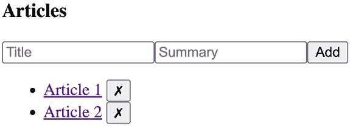
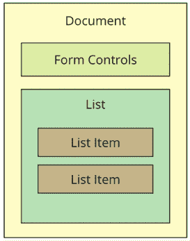
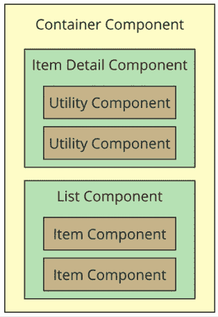

# 5

# 构建可复用组件

本章的目标是向您展示如何实现具有多个目的的 React 组件。阅读本章后，您将对自己的应用功能组合充满信心。

本章首先简要介绍了 HTML 元素及其在帮助实现功能与具有高度实用性方面的作用。然后，您将看到**单一组件**的实现，并发现它将带来的问题。下一节将致力于以这种方式重新实现单一组件，即功能由更小的组件组成。

最后，本章以对 React 组件渲染树的讨论结束，并为您提供一些关于如何避免在分解组件时引入过多复杂性的建议。我将在最后一节重申高级功能组件与实用组件的概念。

本章将涵盖以下主题：

+   可复用 HTML 元素

+   单一组件的困难之处

+   重构组件结构

+   渲染属性

+   渲染组件树

# 技术要求

您可以在 GitHub 上找到本章的代码文件，链接为[`github.com/PacktPublishing/React-and-React-Native-5E/tree/main/Chapter05`](https://github.com/PacktPublishing/React-and-React-Native-5E/tree/main/Chapter05)。

# 可复用 HTML 元素

让我们暂时思考一下 HTML 元素。根据 HTML 元素的类型，它要么是功能中心的，要么是实用中心的。实用中心的 HTML 元素比功能中心的 HTML 元素更易于复用。例如，考虑`<section>`元素。这是一个通用元素，几乎可以用于任何地方，但其主要目的是组成功能的结构方面：功能的壳体和功能的内部部分。这就是`<section>`元素最有用的地方。

在另一边，您有像`<p>`、`<span>`和`<button>`这样的元素。这些元素因为设计上的通用性而提供了高级的实用性。当用户可以点击并执行操作时，您应该使用`<button>`元素，这比功能的概念低一个层次。

虽然谈论具有高度实用性的 HTML 元素与针对特定功能设计的元素很容易，但当涉及数据时，讨论会更加详细。HTML 是静态标记；React 组件将静态标记与数据相结合。问题是，您如何确保您正在创建正确的以功能为中心和以实用为中心的组件？

本章的目标是找出如何将定义功能的单一 React 组件转变为更小的以功能为中心的组件，并结合实用组件。

# 单一组件的困难之处

如果你只为任何给定的功能实现一个组件，这将简化你的工作。至少，维护的组件不会很多，数据的流动路径也不会很多，因为所有内容都在组件内部。

然而，这个想法由于多种原因而不可行。拥有单体功能组件使得协调任何类型的团队开发工作变得困难，例如**版本控制**、**合并冲突**和**并行开发**。单体组件越大，将来重构为更好的组件就越困难。

还有一个功能重叠和功能通信的问题。重叠是由于功能之间的相似性造成的；一个应用程序不太可能有一组完全独特的功能。这将使应用程序非常难以学习和使用。组件通信基本上意味着一个功能中某个东西的状态将影响另一个功能中某个东西的状态。状态很难处理，当有很多状态被封装在单体组件中时，情况更是如此。

学习如何避免单体组件的最佳方式是亲身体验。你将在本节的剩余部分实现一个单体组件。在下一节中，你将看到这个组件是如何被重构为更可持续的样式的。

## JSX 标记

我们将要实现的**单体组件**是一个列出文章的功能。这只是为了说明目的，所以我们不想让组件的大小过大。它将简单而单体。用户可以向列表中添加新项目，切换列表中项目的摘要，并从列表中删除项目。

这是组件的 JSX 标记：

```js
<section>
      <header>
        <h1>Articles</h1>
        <input placeholder="Title" value={title} onChange={onChangeTitle} />
        <input
          placeholder="Summary"
          value={summary}
          onChange={onChangeSummary}
        />
        <button onClick={onClickAdd}>Add</button>
      </header>
      <article>
        <ul>
          {articles.map((i) => (
            <li key={i.id}>
              <a
                href={'#${i.id}'}
                title="Toggle Summary"
                onClick={() => onClickToggle(i.id)}
              >
                {i.title}
              </a>
              &nbsp;
              <button
                href={'#${i.id}'}
                title="Remove"
                onClick={() => onClickRemove(i.id)}
              >
                &#10007;
              </button>
              <p style={{ display: i.display }}>{i.summary}</p>
            </li>
          ))}
        </ul>
      </article>
    </section> 
```

这里的 JSX 明显比必要的多。我们将在下一节中改进这一点，但现在，让我们为这个组件实现初始状态。

## 初始状态

现在，让我们看看这个组件的初始状态：

```js
 const [articles, setArticles] = React.useState([
    {
      id: id.next(),
      title: "Article 1",
      summary: "Article 1 Summary",
      display: "none",
    },
    {
      id: id.next(),
      title: "Article 2",
      summary: "Article 2 Summary",
      display: "none",
    },
  ]);
  const [title, setTitle] = React.useState("");
  const [summary, setSummary] = React.useState(""); 
```

状态由一个`articles`数组、一个`title`字符串和一个`summary`字符串组成。`articles`数组中的每个文章对象都有几个字符串字段来帮助渲染文章，以及一个`id`字段，这是一个数字。这个数字是由`id.next()`生成的。

让我们看看这是如何工作的：

```js
const id = (function* () {
  let i = 1;
  while (true) {
    yield i;
    i += 1;
  }
})(); 
```

`id` 常量是一个生成器。它通过定义一个内联生成器函数并立即调用它来创建。这个生成器将无限期地产生数字。所以，第一次调用`id.next()`返回`1`，下一次是`2`，依此类推。这个简单的实用工具在需要添加新文章并需要一个新唯一 ID 时会很有用。

## 事件处理器实现

到目前为止，你已经有了组件的初始状态和 JSX 代码。现在，是时候实现事件处理器了：

```js
 const onChangeTitle = useCallback((e) => {
    setTitle(e.target.value);
  }, []);
  const onChangeSummary = useCallback((e) => {
    setSummary(e.target.value);
  }, []); 
```

`onChangeTitle()`和`onChangeSummary()`方法分别使用钩子的`setState()`来更新`title`和`summary`状态值。新值来自`event`参数的`target.value`属性，这是用户输入到文本输入中的值：

```js
 const onClickAdd = useCallback(() => {
    setArticles((state) => [
      ...state,
      {
        id: id.next(),
        title: title,
        summary: summary,
        display: "none",
      },
    ]);
    setTitle("");
    setSummary("");
  }, [summary, title]); 
```

`onClickAdd()`方法向`articles`状态添加一篇新文章。这个状态值是一个数组。我们使用扩展运算符从现有数组（`[...state]`）构建一个新数组，并将新对象添加到新数组的末尾。我们构建新数组并将其传递给`setArticles()`的原因是为了避免意外。换句话说，我们将状态值视为不可变，以便更新相同状态的其它代码不会意外地造成问题。接下来，我们将使用一个处理程序来删除文章：

```js
 const onClickRemove = useCallback((id) => {
    setArticles((state) => 
      state.filter((article) => article.id !== id)
    );
  }, []); 
```

`onClickRemove()`方法从`articles`状态中删除具有给定 ID 的文章。它是通过在数组上调用`filter()`来实现的，这返回一个新数组，因此操作是不可变的。过滤器删除具有给定 ID 的对象：

```js
 const onClickToggle = useCallback((id) => {
    setArticles((state) => {
      const articles = [...state];
      const index = articles.findIndex((article) => article.id === id);
      articles[index] = {
        ...articles[index],
        display: articles[index].display ? "" : "none",
      };
      return articles;
    });
  }, []); 
```

`onClickToggle()`方法切换具有给定 ID 的文章的可见性。在这个方法中，我们执行了两个不可变操作。首先，我们构建一个新的`articles`数组。然后，根据给定 ID 的索引，我们用新对象替换索引处的文章对象。我们使用对象扩展运算符来填充属性（`{...articles[index]}`），然后根据现有的显示值切换显示属性值。

这里是输出渲染的截图：



图 5.1：渲染的文章

到目前为止，我们有一个组件，它完成了我们需要的所有功能。然而，它是单体化的，难以维护。想象一下，如果我们应用中的其他地方也使用了相同的`MyFeature`片段。他们必须重新发明它们，因为他们无法共享。在下一节中，我们将努力将`MyFeature`分解为更小的可重用组件。

# 重构组件结构

你有一个单体功能组件：*接下来怎么办*？让我们让它变得更好。

在本节中，你将学习如何将上一节中实现的功能组件拆分为更易于维护的组件。你将从**JSX**开始，因为这可能是最佳的重构起点。然后，你将为功能实现新的组件。

接下来，你将使这些新组件具有功能性，而不是基于类的。最后，你将学习如何使用**渲染属性**来减少应用程序中直接组件依赖项的数量，以及如何通过在功能组件中使用钩子来管理状态来完全删除类。

## 从 JSX 开始

任何**单体组件**的**JSX**是将其重构为更小组件的最佳起点。让我们可视化我们目前正在重构的组件结构：



图 5.2：构成 React 组件的 JSX 可视化

JSX 的上半部分是表单控件，因此这可以很容易地成为一个自己的组件：

```js
<header>
  <h1>Articles</h1>
  <input 
    placeholder="Title" 
    value={title} 
    onChange={onChangeTitle} />
  <input 
    placeholder="Summary" 
    value={summary} 
    onChange={onChangeSummary} />
  <button onClick={onClickAdd}>Add</button>
</header>; 
```

接下来，你有文章列表：

```js
<ul>
  {articles.map((i) => (
    <li key={i.id}>
      <a
        href={`#${i.id}`}
        title="Toggle Summary"
        onClick={() => onClickToggle(i.id)}
      >
        {i.title}
      </a>
      &nbsp;
      <button
        href={'#${i.id}'}
        title="Remove"
        onClick={() => onClickRemove(i.id)}
      >
        &#10007;
      </button>
      <p style={{ display: i.display }}>{i.summary}</p>
    </li>
  ))}
</ul> 
```

在这个列表中，有一个文章组件的潜力，它包括了 `<li>` 标签中的所有内容。让我们尝试构建这个组件。

## 实现文章列表组件

这是 ArticleList 组件的实现看起来像：

```js
function ArticleList({ articles, onClickToggle, onClickRemove }) {
  return (
    <ul>
      {articles.map((i) => (
        <li key={i.id}>
          <a
            href={'#${i.id}'}
            title="Toggle Summary"
            onClick={() => onClickToggle(i.id)}
          >
            {i.title}
          </a>
          &nbsp;
          <button
            href={'#${i.id}'}
            title="Remove"
            onClick={() => onClickRemove(i.id)}
          >
            &#10007;
          </button>
          <p style={{ display: i.display }}>{i.summary}</p>
        </li>
      ))}
    </ul>
  );
} 
```

我们将相关的 JSX 从单体组件中提取出来，并将其放在这里。现在，让我们看看功能组件的 JSX 看起来像：

```js
 <section>
      <header>
        <h1>Articles</h1>
        <input placeholder="Title" value={title} onChange={onChangeTitle} />
        <input
          placeholder="Summary"
          value={summary}
          onChange={onChangeSummary}
        />
        <button onClick={onClickAdd}>Add</button>
      </header>
      <ArticleList
        articles={articles}
        onClickRemove={onClickRemove}
        onClickToggle={onClickToggle}
      />
    </section> 
```

文章列表现在由 `ArticleList` 组件渲染。要渲染的文章列表作为属性传递给此组件，同时还有两个事件处理程序。

为什么我们要将事件处理程序传递给子组件？原因是为了让 `ArticleList` 组件不必担心状态或状态如何变化。它只关心渲染内容和确保适当的事件回调被连接到适当的 DOM 元素。这是一个容器组件的概念，我将在本章后面进一步阐述。

现在我们有了 `ArticleList` 组件，让我们看看我们是否可以进一步将其分解成更小的可重用组件。

## 实现文章项目组件

在实现了文章列表组件之后，你可能会决定将其分解成更小的组件。

另一种看待它的方法是：如果最终我们发现实际上不需要将项目作为自己的组件，这个新组件不会引入太多的间接或复杂性。无需多言，以下是文章项目组件：

```js
function ArticleItem({ article, onClickRemove }) {
  const [isOpened, setIsOpened] = React.useState(article.display !== "none");
  const onClickToggle = React.useCallback(() => {
    setIsOpened((state) => !state);
  }, []);
  return (
    <li>
      <a href={'#${article.id}'} title="Toggle Summary" onClick={onClickToggle}>
        {article.title}
      </a>
      &nbsp;
      <button
        href={'#${article.id}'}
        title="Remove"
        onClick={() => onClickRemove(article.id)}
      >
        &#10007;
      </button>
      <p style={{ display: isOpened ? "block" : "none" }}>{article.summary}</p>
    </li>
  );
} 
```

实际上，组件除了一个增强之外没有变化：我们将展开和折叠文章的逻辑重新定位到了 `ArticleItem` 组件，这提供了几个优点。首先，我们减少了原始的 `MyFeature` 组件，因为它根本不需要知道何时隐藏或展开文章。其次，由于在展开文章时，我们不再使用展开操作符重新创建文章数组，而是仅更改本地状态，因此我们提高了应用程序的性能。结果，在展开文章时，文章列表保持不变，React 不会重新渲染页面，但只有一个组件被重新渲染。

这是 `ArticleList` 组件正在渲染的新 `ArticleItem` 组件：

```js
function ArticleList({ articles, onClickRemove }) {
  return (
    <ul>
      {articles.map((article) => (
        <ArticleItem
          key={article.id.value}
          article={article}
          onClickRemove={onClickRemove}
        />
      ))}
    </ul>
  );
} 
```

你看到这个列表是如何映射文章列表的吗？如果你想要实现另一个具有过滤功能的文章列表，那么拥有一个可重用的 `ArticleItem` 组件是有益的。接下来，我们将添加文章的标记移动到自己的组件中。

## 实现添加文章组件

现在我们完成了文章列表，是时候考虑用于添加新文章的表单控件了。让我们为这个功能方面实现一个组件：

```js
function AddArticle({
  name,
  title,
  summary,
  onChangeTitle,
  onChangeSummary,
  onClickAdd,
}) {
  return (
    <section>
      <h1>{name}</h1>
      <input placeholder="Title" value={title} onChange={onChangeTitle} />
      <input placeholder="Summary" value={summary} onChange={onChangeSummary} />
      <button onClick={onClickAdd}>Add</button>
    </section>
  );
} 
```

现在，我们的功能组件只需要渲染 `<AddArticle>` 和 `<ArticleList>` 组件：

```js
<section>
  <AddArticle
    name="Articles"
    title={title}
    summary={summary}
    onChangeTitle={onChangeTitle}
    onChangeSummary={onChangeSummary}
    onClickAdd={onClickAdd}
  />
  <ArticleList articles={articles} onClickRemove={onClickRemove} />
</section> 
```

这个组件的焦点在于功能数据，而它将渲染 UI 元素的任务委托给其他组件。在下一节中，我们将探讨渲染属性如何使得将组件作为属性传递而不是直接作为依赖项导入成为可能。

# 渲染属性

想象一下实现一个由几个较小的组件组成的功能，就像你在本章中一直在做的那样。`MyFeature` 组件依赖于 `ArticleList` 和 `AddArticle`。现在，想象一下在不同的应用部分使用 `MyFeature`，在这些部分使用不同的 `ArticleList` 或 `AddArticle` 实现是有意义的。基本挑战是替换一个组件为另一个组件。

**渲染属性** 是解决这个挑战的好方法。其思路是，你向你的组件传递一个属性，其值是一个返回要渲染的组件的函数。这样，你就可以配置它们，而不是让功能组件直接依赖于其子组件；它们将它们作为渲染属性值传递。让我们看看一个例子。与其让 `MyFeature` 直接依赖于 `AddArticle` 和 `ArticleList`，不如将它们作为渲染属性传递。以下是 `MyFeature` 使用渲染属性填充 `add` 之前所在空缺处的样子：

```js
 <section>
      {addArticle({
        title,
        summary,
        onChangeTitle,
        onChangeSummary,
        onClickAdd,
      })}
      {articleList({ articles, onClickRemove })}
    </section> 
```

`addArticle()` 和 `articleList()` 函数使用与 `<AddArticle>` 和 `<ArticleList>` 分别传递的相同属性值被调用。现在的不同之处在于，这个模块不再将 `AddArticle` 或 `ArticleList` 作为依赖项导入。

现在，让我们看看 `<MyFeature>` 被渲染的 `main.js` 文件：

```js
const root = ReactDOM.createRoot(document.getElementById("root"));
root.render(
  <MyFeature
    addArticle={({
      title,
      summary,
      onChangeTitle,
      onChangeSummary,
      onClickAdd,
    }) => (
      <AddArticle
        name="Articles"
        title={title}
        summary={summary}
        onChangeTitle={onChangeTitle}
        onChangeSummary={onChangeSummary}
        onClickAdd={onClickAdd}
      />
    )}
    articleList={({ articles, onClickRemove }) => (
      <ArticleList articles={articles} onClickRemove={onClickRemove} />
    )}
  />
); 
```

与仅仅渲染 `<MyFeature>` 时相比，这里现在发生的事情要多得多。让我们分析一下为什么会这样。这是你传递 `addArticle` 和 `articleList` 渲染属性的地方。这些属性值是接受来自 `MyComponent` 的参数值的函数。例如，`onClickRemove()` 函数来自 `MyFeature`，并用于改变该组件的状态。你可以使用 **渲染属性** 函数将此传递给将要渲染的组件，以及任何其他值。这些函数的返回值是最终要渲染的内容。

在本节中，你了解到通过传递渲染属性值：渲染 JSX 标记的函数，你可以避免在可能想要共享功能的地方硬编码依赖项。向组件传递不同的属性值通常比更改给定模块使用的依赖项更容易。

# 渲染组件树

让我们花点时间回顾一下本章到目前为止所取得的成果。曾经是单体的功能组件最终几乎完全专注于状态数据。它处理初始状态，处理转换状态，并且如果有的话，它会处理获取状态的网络请求。这是一个典型的 React 应用程序中的容器组件，也是数据的起点。

你为了更好地组合功能而实现的新的组件是这些数据的接收者。这些组件与它们的容器之间的区别在于，它们只关心在渲染时传入它们的属性。换句话说，它们只关心特定时间点的数据快照。从这里，这些组件可能会将属性数据作为属性传递给它们自己的子组件。组合 React 组件的通用模式如下：



图 5.3：从较小组件组合较大 React 组件的模式

**容器组件**通常包含一个直接**子组件**。在这个图中，你可以看到容器包含一个**项目详情组件**或一个**列表组件**。当然，这两个类别中会有所变化，因为每个应用程序都是不同的。这种通用模式有三个组件组合级别。数据从**容器**单向流向底层的**实用组件**。

一旦添加超过三层，应用程序架构就难以理解。可能会有需要添加四层 React 组件的异常情况，但作为一个经验法则，你应该避免这样做。

## 功能组件和实用组件

在本章中，我们讨论的**单体组件**示例中，你从一个完全专注于一个功能的单一组件开始。这意味着该组件在应用程序的其他地方几乎没有实用性。

原因在于顶层组件处理应用程序状态。**有状态组件**在其它任何上下文中都难以使用。随着你对单体功能组件进行重构，你创建了新的组件，这些组件进一步远离了数据。一般规则是，你的组件离有状态数据越远，它们的实用性就越大，因为它们的属性值可以从应用程序的任何地方传入。

# 概述

本章是关于避免单体组件设计。然而，单体通常是在任何 React 组件设计中必要的起点。

你首先学习了不同 HTML 元素具有不同程度的实用性。接下来，你了解了单体 React 组件的问题，并了解了单体组件的实现。

然后，你花费了几个章节学习如何将单体组件重构为更可持续的设计。从这个练习中，你了解到容器组件只需考虑处理状态，而较小的组件因为它们的属性值可以从任何地方传递，所以具有更多的实用性。你还了解到，你可以使用渲染属性来更好地控制组件依赖和替换。

在下一章中，你将学习关于组件属性验证和类型检查的内容。
