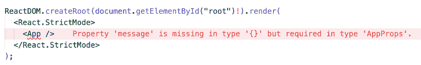
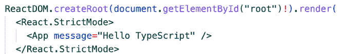

# 6

# 使用 TypeScript 进行类型检查和验证

在本章中，我们将探讨在 React 组件中属性验证的重要性，以创建健壮、无错误的程序。我们将介绍 **TypeScript**，这是一种在 JavaScript 中进行静态类型检查的强大工具。

我们将指导您在项目中设置 TypeScript 并介绍其基本和高级概念。我们还将提供如何使用 TypeScript 在 React 组件中进行类型检查的示例。

到本章结束时，您将在属性验证和类型检查方面打下坚实的基础，并准备好使用 TypeScript 创建更可预测、更可靠的组件。

本章将涵盖以下主题：

+   了解预期内容

+   TypeScript 简介

+   在 React 中使用 TypeScript

# 技术要求

本章的代码文件可以在 GitHub 上找到：[`github.com/PacktPublishing/React-and-React-Native-5E/tree/main/Chapter05`](https://github.com/PacktPublishing/React-and-React-Native-5E/tree/main/Chapter05)。

# 了解预期内容

在任何应用程序中，可预测性都是关键。一个可预测的应用程序会以预期的行为运行，减少错误，提高用户体验，并简化维护。当我们谈论 React 中的可预测性时，我们通常指的是组件根据其接收的属性如何行为。Props 是属性的简称，作为 React 组件的输入，决定了其行为和渲染。这就是 **属性验证** 概念发挥作用的地方。

## 属性验证的重要性

属性验证是一种确保组件接收正确类型数据的方法。它就像组件之间的合同。当组件指定它期望接收的属性类型时，它承诺如果接收了这些类型的属性，它将以某种方式行为。

属性验证对于以下几个原因至关重要：

+   **它有助于在开发过程中早期捕获错误**：如果组件接收到了一个意外的属性类型，它可能不会按预期行为，导致难以追踪的错误。通过验证属性，我们可以在它们造成问题之前捕获这些错误。

+   **属性验证提高了代码可读性**：通过查看组件的属性类型，您可以快速了解组件期望接收哪些数据。这使得在整个应用程序中使用和重用组件变得更加容易。

+   **属性验证使组件更具可预测性**：当组件明确指定它期望接收的属性类型时，更容易理解组件将如何根据其属性行为。

## 没有属性验证的潜在问题

如果没有足够的属性验证，组件可能会变得不可预测，并容易产生错误。让我们看看一个组件：

```js
const MyList = ({ list }) => (
  <ul>
    {list.map((user) => (
      <li key={user.name}>
        {user.name} ({user.email})
      </li>
    ))}
  </ul>
); 
```

在这个例子中，一个组件期望接收一个**list prop**，它应该是一个包含名称和电子邮件属性的数组对象。如果这个组件接收到的 list prop 是一个字符串、一个数字，甚至是一个数组，但没有对象，它可能会尝试访问`user.name`或`user.email`，这会导致错误。

这种类型的错误可能很难调试，尤其是在具有许多组件的大型应用程序中。也可能很难理解我们应该向组件提供什么，而不必阅读这个组件的每一行代码。错误也可能导致应用程序崩溃或出现意外的行为。但如果我们能向我们的组件添加 props 验证，这可以帮助我们提前捕获这些错误并确保组件按预期行为？让我们来探索一下。

## props 验证的选项

你可以使用几种工具在 React 和 React Native 中进行 props 验证。其中之一是`PropTypes`，这是一个库，允许你指定组件应接收的属性类型。另一个选项是 TypeScript，它是 JavaScript 的一个静态类型超集，提供了强大的类型检查工具。

现在，我想向您展示带有`PropTypes`的`MyList`组件的示例。请看这个组件：

```js
import PropTypes from 'prop-types';
const MyList = ({ list }) => (
  <ul>
    {list.map((user) => (
      <li key={user.name}>
        {user.name} ({user.email})
      </li>
    ))}
  </ul>
);
MyList.propTypes = {
  list: PropTypes.arrayOf(
    PropTypes.shape({
      name: PropTypes.string.isRequired,
      email: PropTypes.string.isRequired,
    })
  ).isRequired,
}; 
```

在这个例子中，我们使用`PropTypes`来指定`list` prop 应该是一个对象数组，并且每个对象都应该有一个`name`和`email`属性，这两个属性都应该是字符串。

接下来，让我们看看 TypeScript 的示例：

```js
type User = {
  name: string;
  email: string;
};
type MyListProps = {
  list: User[];
};
const MyList = ({ list }: MyListProps) => (
  <ul>
    {list.map((user) => (
      <li key={user.name}>
        {user.name} ({user.email})
      </li>
    ))}
  </ul>
); 
```

在这个 TypeScript 示例中，我们定义了一个`User`类型和一个`MyListProps`类型。`User`类型是一个具有`name`和`email`属性的对象，这两个属性都是字符串。`MyListProps`类型是一个具有`list`属性的对象，该属性是一个`User`对象的数组。

虽然 PropTypes 和 TypeScript 都提供了用于 props 验证的有价值工具，但我们将在这本书的剩余部分专注于 TypeScript。TypeScript 提供了一种更全面、更强大的类型检查方法，并且在 React 和 React Native 社区中越来越受欢迎。

在接下来的章节中，所有示例都将使用 TypeScript。到这本书结束时，你将有一个扎实的 TypeScript 理解，并知道如何在你的 React 和 React Native 项目中使用它。所以，让我们深入探索 TypeScript 的世界吧！

# TypeScript 简介

在我们开始学习类型检查和验证的旅程时，让我们暂时从 React 和 React Native 中抽身，将注意力转向 TypeScript。你可能想知道，“TypeScript 究竟是什么？”

**TypeScript** 是由微软开发和维护的 **JavaScript** 的静态类型超集。这意味着它为 JavaScript 添加了额外的功能，其中最显著的是静态类型。虽然 JavaScript 是动态类型的，但 TypeScript 引入了一个类型系统，允许你明确地定义变量、函数参数和函数返回值可以具有的数据类型。

但不用担心，TypeScript 与 JavaScript 完全兼容。事实上，任何有效的 JavaScript 代码也是有效的 TypeScript 代码。TypeScript 使用一个转译器（一种编译器类型）将 TypeScript 代码转换为浏览器无法直接理解的 JavaScript 代码，这样就可以在任何 JavaScript 可以运行的环境中运行。

考虑以下 JavaScript 函数：

```js
function greet(name) {
  return "Hello, " + name;
}
console.log(greet("Mike")); // "Hello, Mike"
console.log(greet(32)); // "Hello, 32" 
```

当你传递一个字符串作为参数时，这个函数按预期工作。但是，如果你传递一个数字，它不会抛出错误，尽管问候一个数字在逻辑上并不合理。

现在，让我们看看我们如何用 TypeScript 编写这个函数：

```js
function greet(name: string) {
  return "Hello, " + name;
}
console.log(greet("Mike")); // "Hello, Mike"
console.log(greet(32)); // Error: Argument of type 'number' is not assignable to parameter of type 'string'. 
```

在 TypeScript 版本中，我们为`name`参数添加了类型注解。这告诉 TypeScript`name`始终应该是字符串类型。如果我们尝试用数字调用`greet`，TypeScript 会给出错误。这有助于我们在运行代码之前就捕获到错误。

这是一个简单的例子，但它说明了 TypeScript 的一个关键好处：它可以帮助我们在错误导致代码中的 bug 之前尽早捕获错误。这就像有一个有用的副驾驶，在问题变得严重之前指出潜在的问题。

## 为什么使用 TypeScript？

现在我们已经介绍了 TypeScript 是什么，让我们深入探讨为什么你可能想在项目中学习和使用它：

+   **尽早捕获错误**：我们之前已经讨论过这一点，但将其放在列表的第一位仍然很有价值。TypeScript 最大的优点之一就是能够在编译时捕获错误，甚至在代码运行之前。这有助于防止许多在常规 JavaScript 中可能直到运行时才被捕获的常见错误。

+   **提高代码可读性**：TypeScript 的类型注解使得函数期望的参数类型或函数返回的类型值一目了然。这使得代码更容易阅读和理解，尤其是对于可能正在同一代码库上工作的其他开发者来说。

+   **更容易重构**：TypeScript 的静态类型还使得代码重构变得更加容易。如果你更改变量的类型或函数的签名，TypeScript 可以帮助你找到代码中需要做出相应更改的所有位置。

+   **社区和工具支持**：TypeScript 在 JavaScript 社区中获得了显著的流行度，并被微软、谷歌和 Airbnb 等许多大型公司使用。这意味着有一个庞大的开发者社区可以提供支持，并提供丰富的学习 TypeScript 的资源。此外，许多代码编辑器对 TypeScript 提供了出色的支持，提供如 **自动完成**、**类型推断**和**错误突出显示**等功能。

+   **与现代框架和库的集成**：TypeScript 与现代 JavaScript 框架如 React 和 React Native 集成良好，这些框架内置了 TypeScript 定义，使得构建强类型应用变得更加容易。此外，大多数流行的 JavaScript 库都提供了 TypeScript 定义。这些定义通常由社区贡献，提供了关于库函数和对象类型信息，使得在 TypeScript 项目中使用这些库更加容易和安全。

    这种在 JavaScript 生态系统中对 TypeScript 的广泛应用确保了你可以几乎在代码库的任何地方利用 TypeScript 的益处。

+   **增加就业市场需求**：TypeScript 的流行不仅限于开发实践：它在就业市场上也越来越受欢迎。许多公司，从小型初创公司到大型企业，都在其项目中采用 TypeScript，因此对熟练掌握 TypeScript 的开发者的需求不断增长。这对于涉及 React 和 React Native 的职位尤其如此，在这些职位中，TypeScript 通常用于其在大规模代码库扩展和维护方面的优势。通过学习 TypeScript，你不仅为你的项目获得了一项宝贵的技能，而且作为开发者，也使自己在市场上更具竞争力。

总结来说，TypeScript 提供了一系列可以帮助你编写更健壮、可维护代码的益处。它是任何 JavaScript 开发者工具箱中的宝贵工具，其在就业市场上的日益流行使其成为你职业发展的值得投资。

但理解 TypeScript 的好处只是第一步。要真正发挥其威力，你需要知道如何在项目中使用它。在下一节中，我们将指导你通过在 React 项目中设置 TypeScript 的过程。我们将从安装 TypeScript 到配置项目使用 TypeScript 的所有内容进行讲解。那么，让我们深入探索 TypeScript 的实际应用吧！

## 在项目中设置 TypeScript

在第一章中，我们介绍了使用 **Vite** 创建新 React 项目的流程。现在，让我们看看如何创建一个 TypeScript 项目。

**Vite** 为创建新的 React 和 TypeScript 项目提供了一个模板。你可以使用以下命令创建一个新项目：

```js
npm create vite@latest my-react-app -- --template react-ts 
```

此命令使用 `react-ts` 模板创建一个新的 Vite 项目，该模板包含 TypeScript。基于此模板的项目将在您的项目根目录中包含 `tsconfig.json` 文件。此文件用于为您的项目配置 TypeScript。

下面是 `tsconfig.json` 文件可能的样子：

```js
{
  "compilerOptions": {
    "target": "esnext",
    "module": "esnext",
    "jsx": "react-jsx",
    "strict": true,
    "moduleResolution": "node",
    "esModuleInterop": true
  }
} 
```

这些设置告诉 TypeScript 将您的代码编译为最新版本的 JavaScript (`"target": "esnext"`), 使用最新的模块系统 (`"module": "esnext"`), 并使用 *React 17* 中引入的新 JSX 转换 (`"jsx": "react-jsx"`). `"strict": true` 选项启用了一组广泛的类型检查行为，以捕获更多问题。

在设置好 TypeScript 之后，让我们编写一些代码。然而，TypeScript 使用与 JavaScript 不同的文件扩展名：没有 JSX 的文件使用 `*.ts` 扩展名，而带有 JSX 的文件使用 `*.tsx` 扩展名。因此，让我们使用 TypeScript 创建我们的第一个 React 组件：

```js
type AppProps = {
  message: string;
};
function App({ message }: AppProps) {
  return <div>{message}</div>;
} 
```

在这个例子中，我们正在为 `App` 组件的 props 定义一个 `AppProps` 类型。这告诉 TypeScript，`message` prop 应该是一个字符串。

现在，让我们看看 `main.tsx` 现在的样子：



图 6.1：main.tsx 文件中的 App 组件及其 TypeScript 错误

这就是 TypeScript 如何检查和验证组件中 props 的使用。在这里，我们应该传递 `message` prop：



图 6.2：main.tsx 文件中没有错误的 App 组件

最后，您可以使用以下命令运行您的项目：

```js
npm run dev 
```

此命令启动 **Vite 开发服务器**。如果您的代码中存在任何 **类型错误**，TypeScript 也会在控制台中显示它们。

## TypeScript 中的基本类型

TypeScript 的一个关键特性是其丰富的类型系统。TypeScript 引入了几种基本类型，您可以使用它们来描述您数据的结构。要指定变量的类型，您在变量名后使用冒号，然后跟类型。

让我们探索这些基本类型：

+   **布尔值**: 最基本的类型是简单的 `true`/`false` 值，JavaScript 和 TypeScript 称其为 Boolean：

    ```js
    let isDone: boolean = false; 
    ```

+   **数字**: 与 JavaScript 一样，TypeScript 中的所有数字都是浮点值。这些浮点数获得 `number` 类型：

    ```js
    let age: number = 32; 
    ```

+   **字符串**: 在 JavaScript 中创建用于网页和服务器程序的基本部分之一是处理 **文本数据**。与其他语言一样，我们使用 `string` 类型来引用这些文本数据类型：

    ```js
    let color: string = "blue"; 
    ```

+   **数组**: TypeScript，就像 JavaScript 一样，允许您使用值数组。数组类型可以用两种方式之一来编写。在第一种方式中，您使用元素的类型，然后跟上一个 `[]` 来表示该元素类型的数组：

    ```js
    let list: number[] = [1, 2, 3]; 
    ```

    第二种方式使用泛型数组类型，`Array<elemType>`：

    ```js
    let list: Array<number> = [1, 2, 3]; 
    ```

+   **元组**: 元组类型允许您表达一个数组，其中已知固定数量元素的类型，但不需要它们相同。例如，您可能希望将一个值表示为一个 `string` 和一个 `number` 的对：

    ```js
    let x: [string, number];
    x = ["hello", 10]; // OK 
    ```

+   **枚举**：JavaScript 标准数据类型集的一个有用补充是 `enum`。类似于 C# 等语言，`enum` 是为数值集合提供更友好名称的一种方式：

    ```js
    enum Color {
      Red,
      Green,
      Blue,
    }
    let c: Color = Color.Green; 
    ```

+   **Any**：当我们编写应用程序时，我们可能需要描述我们不知道的变量的类型。这些值可能来自动态内容，例如用户或第三方库。在这些情况下，我们希望退出类型检查并让值通过编译时检查。为此，我们用 `any` 类型标记这些值：

    ```js
    let notSure: any = 4;
    notSure = "maybe a string instead";
    notSure = false; // okay, definitely a Boolean 
    ```

+   **Unknown**：`unknown` 类型是 `any` 的类型安全对应物。任何东西都可以赋值给 `unknown`，但 `unknown` 只能赋值给自己和 `any`（在没有类型断言或基于控制流的缩窄的情况下）。同样，在没有首先断言或缩窄到更具体的类型之前，不允许对 `unknown` 执行任何操作：

    ```js
    let notSure: unknown = 4;
    notSure = "maybe a string instead";
    // OK, because of structural typing
    notSure = false; 
    let surelyNotAString: string = notSure; // Error, 'unknown' is not assignable to 'string' 
    ```

    在这个例子中，如果没有类型检查，我们不能将 `notSure` 赋值给 `surelyNotAString`，因为 `notSure` 是 `unknown` 类型。这有助于防止错误，因为我们不能在不首先检查其类型的情况下意外地对 `unknown` 类型的变量执行操作。

    `unknown` 的一个常见用例是在 `catch` 子句中，其中 `error` 对象的类型是未知的：

    ```js
    try {
      // some operation that might throw
    } catch (error: unknown) {
      if (error instanceof Error) {
        console.log(error.message);
      }
    } 
    ```

    在这个例子中，我们不知道 `error` 类型可能是什么，所以我们给它赋予 `unknown` 类型。这迫使我们在与它交互之前检查其类型。

+   **Void**：`void` 类似于 `any` 的对立面：完全没有类型。你可能会常见到它是没有返回值的函数的返回类型：

    ```js
    function warnUser(): void {
      console.log("This is my warning message");
    } 
    ```

+   **Null 和 undefined**：在 TypeScript 中，`undefined` 和 `null` 实际上分别有自己的类型，分别命名为 `undefined` 和 `null`。与 `void` 类似，它们本身并不非常有用：

    ```js
    let u: undefined = undefined;
    let n: null = null; 
    ```

    然而，`undefined` 在可选类型中起着至关重要的作用。在 TypeScript 中，你可以在类型名称后添加 `?` 来使一个类型可选。这意味着值可以是指定的类型或 `undefined`。例如：

    ```js
    function greet(name?: string) {
      return 'Hello ${name}';
    }
    greet("Mike");
    greet(undefined); // OK
    greet(); // Also OK 
    ```

+   **永不**：在 TypeScript 中，`never` 类型代表一种永远不会发生值的类型。它在函数永远不会返回值或达到其执行路径的末尾时使用。例如，抛出错误的函数或具有无限循环的函数可以用 `never` 类型进行注解：

    ```js
    function throwError(errorMsg: string): never {
        throw new Error(errorMsg);
    }
    function infiniteLoop(): never {
        while (true) {
        }
    } 
    ```

理解这些基本类型是在 TypeScript 中工作的关键第一步。当你开始在项目中使用 TypeScript 时，你会发现这些类型是编写健壮、可维护代码的强大工具。

在下一节中，我们将更深入地探讨 TypeScript 的类型系统，并探索接口和类型别名，它们提供了一种定义复杂类型的方法。

## 接口和类型别名

虽然基本类型对于简单数据类型很有用，但在处理更复杂的数据结构时，我们需要更强大的工具。这就是接口和类型别名发挥作用的地方。它们允许我们定义复杂类型并给它们命名。

### 接口

在 TypeScript 中，接口是一种定义复杂类型合同的方式。它描述了一个对象应该具有的形状。以下是一个示例：

```js
interface User {
  name: string;
  email: string;
} 
```

在这个示例中，我们定义了一个具有两个属性`name`和`email`的`User`接口，这两个属性都是字符串类型。我们可以使用这个接口来进行对象类型检查：

```js
const user: User = {
  name: "Alice",
  email: "alice@example.com",
}; 
```

如果我们尝试将一个不符合`User`接口的对象赋值给用户变量，TypeScript 将会给我们一个错误。

### 类型别名

类型别名与接口非常相似，但也可以用于其他类型，而不仅仅是对象。以下是一个`type`别名的示例：

```js
type Point = {
  x: number;
  y: number;
};
type ID = number | string; 
```

在这个示例中，我们定义了一个`Point`类型，它代表二维空间中的一个点，以及一个可以是字符串或数字的`ID`。我们可以像使用接口一样使用这些`type`别名：

```js
const point: Point = {
  x: 10,
  y: 20,
};
const id: ID = 100; 
```

### 接口与类型别名

那么，何时应该使用接口，何时应该使用类型别名？在许多情况下，两者可以互换，这主要是个人的偏好问题。

然而，也有一些不同之处。接口更具有可扩展性，因为它们可以被多次声明，并且会合并在一起。类型别名不能重新打开以添加新属性。另一方面，类型别名可以表示其他类型，如联合类型、交叉类型、元组以及其他在接口中目前不可用的类型。

通常，如果你正在定义对象的形状，无论是接口还是类型别名都可以。如果你正在定义一个可能不是对象的类型，你需要使用类型别名。

在本节中，我们迈出了 TypeScript 世界的第一步。我们学习了在**Vite**项目中设置 TypeScript、其基本类型以及如何使用接口和类型别名定义复杂类型。

现在，让我们探索如何将 TypeScript 与 React 组件、状态、事件处理程序一起使用。

# 在 React 中使用 TypeScript

好的，我们已经走到这一步了！我们已经学习了 TypeScript 的基础知识，并讨论了它的好处。现在，是时候卷起袖子，用一些实际的 TypeScript 在 React 中动手实践了。

在本节中，我们将探讨如何使用 TypeScript 来检查 React 应用程序的所有不同部分。我们将查看组件、props、状态、事件处理程序、上下文，甚至是 refs。不用担心：我会通过大量的示例来帮助你理解这些概念。

## 在 React 组件中检查 props

在一个 React 应用程序中，我们可以利用 TypeScript 的主要领域之一是在我们的组件中，特别是与 props 相关。让我们看看示例：

```js
type GreetingProps = {
  name: string;
};
const Greeting = ({ name }: GreetingProps) => {
  return <h1>Hello, {name}!</h1>;
}; 
```

在这个例子中，我们定义了一个`GreetingProps`类型，它指定了`Greeting`应该接收的 props 的形状。然后我们使用这个类型来检查`Greeting`组件中的`name` prop。

这是一个只有一个 props 的简单例子，但同样的方法也可以用于具有更复杂 props 的组件。例如，如果一个组件接收一个对象或数组作为 props，我们可以定义一个类型来描述该对象或数组的形状。以下是一个例子：

```js
type UserProps = {
  user: {
    name: string;
    email: string;
  };
};
const UserCard = ({ user }: UserProps) => {
  return (
    <div>
      <h1>{user.name}</h1>
      <p>{user.email}</p>
    </div>
  );
}; 
```

在这个例子中，`UserCard`组件接收一个包含`name`和`email`属性的对象类型的`user`属性。我们定义一个`UserProps`类型来描述这个对象的形状，并使用它来检查`user`属性的类型。

让我们考虑 React 中另一个常见的场景：**可选 props**。有时，一个组件的 props 不是总是必需的。在这些情况下，我们可以为 prop 提供一个默认值，并在我们的类型定义中将其标记为可选。以下是一个例子：

```js
type ButtonProps = {
  children: React.ReactNode;
  disabled?: boolean;
};
const Button = ({ children, disabled = false }: ButtonProps) => {
  return <button disabled={disabled}>{children}</button>;
}; 
```

在`ButtonProps`类型中，我们使用`React.ReactNode`作为`children` prop 的类型。这是 React 提供的一个特殊类型，可以接受任何可渲染的内容。这包括字符串、数字、JSX 元素、这些类型的数组，甚至是返回这些类型的函数。通过使用`React.ReactNode`，我们表示`children` prop 可以是 React 可以渲染的任何类型的内容。此外，我们还使用了可选的`disabled` prop。我们通过在`ButtonProps`类型中将`disabled` prop 名称后面添加一个`?`来表示`disabled`是可选的。我们还在组件函数参数中为`disabled`提供了默认值 false。

这样，我们可以在有或没有`disabled` prop 的情况下使用`Button`组件，TypeScript 仍然会正确地进行类型检查：

```js
<Button>Click me!</Button> // OK
<Button disabled>Don't click me!</Button> // OK 
```

## 类型化状态

正如我们对 props 进行了类型检查一样，我们也可以使用 TypeScript 来检查组件中的状态。这确保了我们始终使用正确的状态值类型，为我们的代码提供了另一层安全保障。

让我们看看如何将 TypeScript 应用于函数组件中的状态的例子：

```js
const Counter = () => {
  const [count, setCount] = React.useState<number>(0);
  return (
    <div>
      <p>Count: {count}</p>
      <button
        onClick={() => {
          setCount(count + 1);
        }}
      >
        Increment
      </button>
    </div>
  );
}; 
```

在这个`Counter`组件中，我们使用`React.useState<number>(0)`来声明一个初始值为`0`的状态变量`count`。通过将`<number>`作为`useState`的类型参数，我们告诉 TypeScript `count`始终应该是数字类型。顺便说一句：我们可以省略传递`<number>`，因为 TypeScript 足够智能，可以根据初始值的类型推断出`count`应该是数字类型。

这也意味着`setCount`函数只会接受数字。如果我们尝试用非数字参数调用`setCount`，TypeScript 会给我们一个错误。

## 类型化事件处理器

另一个 TypeScript 在 React 应用程序中非常有用的领域是在**事件处理器**。通过类型检查我们的事件处理器，我们可以确保我们使用正确的事件类型，并访问事件对象上的正确属性。

让我们看看一个具有输入字段和类型化事件处理器的函数组件的例子：

```js
const InputField = () => {
  const [value, setValue] = React.useState("");
  const handleChange = (event: React.ChangeEvent<HTMLInputElement>) => {
    setValue(event.target.value);
  };
  return <input value={value} onChange={handleChange} />;
}; 
```

在这个`InputField`组件中，我们定义了一个`handleChange`函数，该函数将在输入字段值变化时被调用。我们使用`React.ChangeEvent<HTMLInputElement>`类型作为事件参数，以指定这个函数应该接收来自输入字段的更改事件。

这个类型包括我们从输入字段更改事件中期望的所有属性，例如`event.target.value`。如果我们尝试访问这个类型上不存在的属性，TypeScript 会给我们一个错误。

## 类型化上下文

当使用 TypeScript 与 React 时，我们还可以对上下文进行类型检查，以确保我们始终使用正确的值类型。让我们看看一个例子：

```js
type ThemeContextType = {
  theme: string;
  setTheme: (theme: string) => void;
};
const ThemeContext = React.createContext<ThemeContextType | null>(null);
const ThemeProvider = ({ children }: { children: React.ReactNode }) => {
  const [theme, setTheme] = React.useState('light');
  return (
    <ThemeContext.Provider value={{ theme, setTheme }}>
      {children}
    </ThemeContext.Provider>
  );
};
const useTheme = () => {
  const context = React.useContext(ThemeContext);
  if (context === null) {
    throw new Error('useTheme must be used within a ThemeProvider');
  }
  return context;
}; 
```

在这个例子中，我们使用`React.createContext`创建了一个`ThemeContext`。我们向`createContext`提供一个`ThemeContextType`作为类型参数，以指定上下文值的形状。这个类型包括一个主题字符串和一个`setTheme`函数。

然后，我们创建一个`ThemeProvider`组件，它将主题和`setTheme`值提供给上下文。在`useTheme`钩子内部，我们使用`React.useContext`来消费`ThemeContext`。如果上下文是`null`，我们抛出一个错误。

这是一个常见的模式，以确保在提供者内部使用上下文。

通过这个例子，我想强调 TypeScript 的一个重要特性。在`useTheme`钩子中，我们不需要指定类型。它返回上下文值，TypeScript 知道它是`ThemeContextType`类型而不是`null`，这要归功于错误检查。这意味着当我们使用`useTheme`时，TypeScript 会自动提供正确的非空上下文类型。

## 输入引用

现在，让我们将注意力转向 React 中的另一个强大特性：refs。正如你从*第三章*，*理解 React 组件和 Hooks*中已经知道的，refs 给我们提供了一个在组件内部直接访问**DOM 节点**或**React 元素**的方法。但我们是怎样确保正确使用 refs 的呢？TypeScript 来帮忙。

考虑这个例子，我们将 TypeScript 应用到 refs 上：

```js
const InputWithRef = () => {
  const inputRef = React.useRef<HTMLInputElement>(null);
  const focusInput = () => {
    if (inputRef.current) {
      inputRef.current.focus();
    }
  };
  return (
    <div>
      <input ref={inputRef} type="text" />
      <button onClick={focusInput}>Focus the input</button>
    </div>
  );
}; 
```

在这个`InputField`组件中，我们使用`React.useRef`创建了一个引用。我们向`useRef`提供一个`HTMLInputElement`作为类型参数，以指定引用的类型。`HTMLInputElement`是 TypeScript 内置 DOM 类型提供的一个类型，它代表 DOM 中的一个输入元素。这个类型对应于引用附加到的 DOM 元素的类型。

这意味着`inputRef.current`将是`HTMLInputElement | null`类型，TypeScript 会知道它有一个`focus`方法。

# 摘要

在这一章中，我们深入探讨了 React 中的类型检查和验证的世界。我们从属性验证的重要性开始，然后介绍了 TypeScript 及其在健壮类型检查方面的好处。

我们随后将 TypeScript 应用于 React，展示了它在检查 React 组件各个方面（从 props 和 state 到事件处理器、上下文和 refs）中的使用。所有这些功能都允许你创建不仅更可靠而且更容易维护的应用程序，能够早期发现错误，显著提高你的代码质量和作为开发者的效率。

随着我们进入下一章，*使用路由处理导航*，我们将把我们的重点转向 React 应用程序中的导航。我们将学习如何设置和使用路由在应用程序的不同部分之间进行导航。
