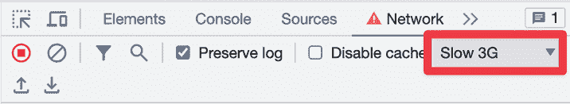

# 8

# 使用懒组件和 Suspense 进行代码拆分

**代码拆分**在 React 应用程序中已经是一个重要的部分，甚至在官方支持被包含在**React API**中之前就已经存在。React 的演变带来了专门设计用于帮助代码拆分场景的 API。当处理包含大量需要发送到浏览器的 JavaScript 代码的大型应用程序时，代码拆分变得至关重要。

在过去，包含整个应用的**单体 JavaScript 包**可能会因为页面加载时间过长而导致可用性问题。多亏了代码拆分，我们现在可以更细致地控制代码从服务器传输到浏览器的方式。这为我们提供了大量优化加载时间**用户体验**（**UX**）的机会。

在本章中，我们将回顾如何在 React 应用程序中使用`lazy()` API 和`Suspense`组件来实现这一点。这些功能是 React 工具箱中非常强大的工具。通过深入了解这些组件的工作原理，你将完全准备好无缝地将代码拆分集成到你的应用程序中。

本章将涵盖以下主题：

+   使用`lazy()` API

+   使用`Suspense`组件

+   避免使用**懒组件**

+   探索**懒加载页面**和**路由**

# 技术要求

你可以在 GitHub 上找到本章的代码文件，链接为[`github.com/PacktPublishing/React-and-React-Native-5E/tree/main/Chapter08`](https://github.com/PacktPublishing/React-and-React-Native-5E/tree/main/Chapter08)。

# 使用懒 API

在 React 中使用`lazy()` API 涉及两个部分。首先，将组件打包到它们自己的单独文件中，以便浏览器可以单独从应用程序的其他部分下载它们。其次，一旦创建了这些包，你就可以构建懒加载的 React 组件：它们在需要之前不会下载任何内容。让我们看看这两个方面。

## 动态导入和包

本书中的代码示例使用**Vite**工具创建包。这种方法的优点是，你不需要维护任何包配置。相反，根据你如何导入模块，包会自动为你创建。如果你在所有地方都使用普通的`import`语句（不要与`import`方法混淆），你的应用程序将一次性下载在一个包中。当你的应用程序变大时，可能会出现一些用户可能永远不会使用或不如其他用户频繁使用的功能。你可以使用`import()`函数按需导入模块。通过使用此函数，你是在告诉 Vite 为动态导入的代码创建一个单独的包。

让我们看看一个我们可能希望与应用程序其他部分分开打包的简单组件：

```js
export default function MyComponent() {
  return <p>My Component</p>;
} 
```

现在，让我们看看如何使用`import()`函数动态导入这个模块，从而创建一个单独的包：

```js
function App() {
  const [MyComponent, setMyComponent] = React.useState<() => React.ReactNode>(
    () => () => null
  );
  React.useEffect(() => {
    import("./MyComponent").then((module) => {
      setMyComponent(() => module.default);
    });
  }, []);
  return <MyComponent />;
} 
```

当你运行这个示例时，你会立即看到`<p>`文本被渲染。如果你打开浏览器开发者工具并查看网络请求，你会注意到有一个单独的调用去获取包含`MyComponent`代码的包。这是因为对`import("./MyComponent")`的调用。`import()`函数返回一个解析为模块对象的 promise。由于我们需要默认导出以访问`MyComponent`，我们在调用`setMyComponent()`时引用`module.default`。

我们将组件设置为`MyComponent`状态的原因是，当`App`组件首次渲染时，我们还没有加载`MyComponent`的代码。一旦加载，`MyComponent`将引用正确的值，从而渲染出正确的文本。

现在你已经了解了包是如何被创建并由应用获取的，是时候看看`lazy()` API 如何极大地简化了这个过程。

## 使组件懒加载

你不需要手动处理`import()`返回的 promise，通过返回默认导出和设置状态，而是可以依赖`lazy()` API。这个函数接收一个返回`import()` promise 的函数。返回值是一个懒加载组件，你可以直接渲染。让我们修改`App`组件以使用这个 API：

```js
import * as React from "react";
const MyComponent = React.lazy(() => import("./MyComponent"));
function App() {
  return <MyComponent />;
} 
```

`MyComponent`的值是通过调用`lazy()`创建的，将动态模块导入作为参数传递。现在，你有一个为你的组件创建的单独包和一个在首次渲染时加载这个包的懒加载组件。

在本节中，你学习了代码拆分的工作原理。你了解到`import()`函数为你处理了包的创建。你还了解到`lazy()` API 使你的组件变得懒加载，并为你处理了导入组件的所有繁琐工作。但我们需要最后一件事，即`Suspense`组件，以帮助在组件加载时显示占位符。

# 使用`Suspense`组件

在本节中，我们将探讨`Suspense`组件的一些更常见的使用场景。我们将查看在组件树中放置`Suspense`组件的位置，如何在获取包时模拟延迟，以及我们可以用作回退内容的选项。

## 最高层级的`Suspense`组件

**懒加载组件**需要被渲染在`Suspense`组件内部。然而，它们不必是`Suspense`的直接子组件，这很重要，因为这意味着你可以有一个`Suspense`组件来处理你应用中的所有懒加载组件。让我们用一个例子来说明这个概念。这是一个我们希望单独打包并懒加载的组件：

```js
export default function MyFeature() {
  return <p>My Feature</p>;
} 
```

接下来，让我们将`MyFeature`组件懒加载，并在`MyPage`组件中渲染它：

```js
const MyFeature = React.lazy(() => import("./MyFeature"));
function MyPage() {
  return (
    <>
      <h1>My Page</h1>
      <MyFeature />
    </>
  );
} 
```

在这里，我们使用`lazy()` API 使`MyFeature`组件变为懒加载。这意味着当`MyPage`组件被渲染时，包含`MyFeature`的代码包将会被下载，因为`MyFeature`也被渲染了。需要注意的是，对于`MyPage`组件来说，它正在渲染一个懒加载组件（`MyFeature`），但它没有渲染一个`Suspense`组件。这是因为我们的假设应用有许多页面组件，每个页面都有自己的懒加载组件。让每个组件都渲染自己的`Suspense`组件将是多余的。相反，我们可以在`App`组件内部渲染一个`Suspense`组件，如下所示：

```js
function App() {
  return (
    <React.Suspense fallback={"loading..."}>
      <MyPage />
    </React.Suspense>
  );
} 
```

当`MyFeature`代码包正在下载时，`<MyPage>`会被替换为传递给`Suspense`的回退文本。所以，即使`MyPage`本身不是懒加载的，它也会渲染一个`Suspense`所知的懒加载组件，并在这一过程中用回退内容替换其子组件。

到目前为止，我们还没有真正看到在懒加载组件加载代码包时显示的回退内容。这是因为当本地开发时，这些包几乎会立即加载。为了能够看到回退组件和加载过程，你可以在开发者工具的**网络**选项卡中启用限制：



图 8.1：在浏览器中启用限制

这个设置模拟了慢速的互联网连接。页面不会立即加载，而是会渲染几秒钟，你将看到一个**加载中…**的回退。

在下一节中，我们将探讨使用加载`spinner`作为回退组件的方法。

## 使用`spinner`回退

你可以使用`Suspense`组件的最简单的回退是一些指示用户正在发生什么的文本。回退属性可以是任何有效的 React 元素，这意味着我们可以增强回退，使其更具视觉吸引力。例如，`react-spinners`包提供了一系列`spinner`组件，所有这些都可以作为`Suspense`的回退使用。

让我们将上一节中的`App`组件修改一下，以包含来自`react-spinners`包的`spinner`作为`Suspense`的回退：

```js
import * as React from "react";
import { FadeLoader } from "react-spinners";
import MyPage from "./MyPage";
function App() {
  return (
    <React.Suspense fallback={<FadeLoader color="lightblue" />}>
      <MyPage />
    </React.Suspense>
  );
} 
```

`FadeLoader`组件将渲染一个我们配置了`lightblue`颜色的`spinner`。`FadeLoader`组件的渲染元素被传递到`fallback`属性。使用慢速 3G 限制，你应该能在首次加载应用时看到`spinner`：


图 8.2：加载组件渲染的图像

现在，我们不再显示文本，而是显示一个动画`spinner`。这很可能会提供一个用户更习惯的用户体验。`react-spinners`包提供了几个`spinner`供你选择，每个`spinner`都有几个配置选项。你也可以使用其他`spinner`库，或者自己实现。

在本节中，你学习了如何使用单个 `Suspense` 组件来显示其回退内容，这对于树中任何较低级别的懒加载组件都是有效的。你学习了如何在本地开发期间模拟延迟，以便你可以体验你的用户将如何体验你的 `Suspense` 回退内容。最后，你学习了如何使用来自其他库的组件作为回退内容，以提供比纯文本看起来更好的东西。

在下一节中，你将了解到为什么将应用中的每个组件都做成懒加载组件是没有意义的。

# 避免使用懒加载组件

可能会很有诱惑力将大多数 React 组件做成懒加载组件，这些组件各自存在于自己的包中。毕竟，设置单独的包和创建懒加载组件并不需要做太多额外的工作。然而，这样做也有一些缺点。如果你有太多的懒加载组件，你的应用最终会同时发起多个 HTTP 请求来获取它们：这并没有为在应用同一部分使用的组件使用单独的包带来任何好处。你最好尝试以某种方式将组件打包在一起，使得只需一个 HTTP 请求就能加载当前页面上所需的内容。

有助于思考的一种方式是将 **页面** 与 **包** 相关联。如果你有懒加载的页面组件，该页面上的一切也将是懒加载的，并且与其他页面上的组件打包在一起。让我们构建一个示例，演示如何组织我们的懒加载组件。假设你的应用有几个页面，每个页面上都有一些功能。如果当页面加载时这些功能都需要，我们就不一定想使这些功能成为懒加载的。以下是显示用户选择要加载哪个页面的 `App` 组件：

```js
const First = React.lazy(() => import("./First"));
const Second = React.lazy(() => import("./Second"));
function ShowComponent({ name }: { name: string }) {
  switch (name) {
    case "first":
      return <First />;
    case "second":
      return <Second />;
    default:
      return null;
  }
} 
```

`First` 和 `Second` 组件是我们应用中的页面，因此我们希望它们成为按需加载其包的懒加载组件。当用户更改选择器时，`ShowComponent` 组件会渲染适当的页面：

```js
function App() {
  const [component, setComponent] = React.useState("");
  return (
    <>
      <label>
        Load Component:{" "}
        <select
          value={component}
          onChange={(e) => setComponent(e.target.value)}
        >
          <option value="">None</option>
          <option value="first">First</option>
          <option value="second">Second</option>
        </select>
      </label>
      <React.Suspense fallback={<p>loading...</p>}>
        <ShowComponent name={component} />
      </React.Suspense>
    </>
  );
} 
```

接下来，让我们看看第一页，看看它是如何组成的，从 `First` 组件开始：

```js
import One from "./One";
import Two from "./Two";
import Three from "./Three";
export default function First() {
  return (
    <>
      <One />
      <Two />
      <Three />
    </>
  );
} 
```

`First` 组件会引入三个组件并将它们渲染出来：`One`、`Two` 和 `Three`。这三个组件将构成同一个包。虽然我们可以使它们成为懒加载的，但这并没有什么意义，因为我们所做的只是同时发起三个 HTTP 请求来获取包，而不是一个。

现在你已经更好地理解了如何将应用页面的结构映射到包上，让我们看看另一个用例，其中我们使用路由组件在应用中导航。

# 探索懒加载页面和路由

在 *Avoiding lazy components*（避免使用懒加载组件）部分，你看到了在没有好处的情况下应避免使组件成为懒加载的地方。当你在使用 `react-router` 作为在应用中导航的机制时，可以应用相同的模式。让我们看看一个例子。以下是我们需要导入的内容：

```js
const First = React.lazy(() => import("./First"));
const Second = React.lazy(() => import("./Second"));
function Layout() {
  return (
    <section>
      <nav>
        <span>
          <Link to="first">First</Link>
        </span>
        <span> | </span>
        <span>
          <Link to="second">Second</Link>
        </span>
      </nav>
      <section>
        <React.Suspense fallback={<FadeLoader color="lightblue" />}>
          <Outlet />
        </React.Suspense>
      </section>
    </section>
  );
}
export default function App() {
  return (
    <Router>
      <Routes>
        <Route path="/" element={<Layout />}>
          <Route path="/first" element={<First />} />
          <Route path="/second" element={<Second />} />
        </Route>
      </Routes>
    </Router>
  );
} 
```

在前面的代码中，我们有两个将单独打包的懒加载页面组件。在这个例子中，回退内容使用了在*使用旋转器回退*部分中引入的相同的`FadeLoader` `spinner`组件。

注意，`Suspense`组件放置在导航链接之下。这意味着当内容加载时，将在这个位置渲染出最终显示的页面内容。`Suspense`组件的子元素是`Route`组件，它们将渲染我们的懒加载页面组件：例如，当`/first`路由被激活时，`First`组件将首次渲染，触发包下载。

这就带我们结束了这一章。

# 摘要

本章全部关于代码拆分和打包，这些是大型 React 应用程序中的重要概念。我们首先通过使用`import()`函数查看如何在你的 React 应用程序中将代码拆分成包。然后，我们探讨了`lazy()` React API 以及它是如何帮助简化首次渲染组件时的包加载。接下来，我们更深入地研究了`Suspense`组件，该组件用于在组件包被检索时管理内容。`fallback`属性是我们指定在加载包时显示的内容的方式。只要你的应用程序遵循一致的打包模式，通常你不需要在应用程序中使用超过一个`Suspense`组件。

在下一章中，你将学习如何使用**Next.js**框架来处理在服务器上渲染 React 组件。Next.js 框架允许你创建作为 React 组件的页面，这些页面可以在服务器和浏览器上渲染。这对于需要良好的初始页面加载性能的应用程序来说是一个重要的功能：也就是说，所有应用程序。
