# 9

# 用户界面框架组件

当你开发 React 应用程序时，通常依赖于现有的**UI 库**而不是从头开始构建。有许多 React UI 组件库可供选择，只要组件使你的生活变得更简单，就没有错误的选择。

在本章中，我们将深入研究 Material UI React 库，这是 React 开发的流行选择。Material UI 因其全面的定制组件套件、遵循 Google 的 Material Design 原则以及广泛的文档而脱颖而出，使其成为寻求 UI 设计效率和美学一致性的开发者的最佳选择。以下是我们将涵盖的具体主题：

+   布局和 UI 组织

+   使用**导航组件**

+   收集用户输入

+   与**样式**和**主题**一起工作

# 技术要求

你可以在 GitHub 上找到本章中存在的代码文件，地址为[`github.com/PacktPublishing/React-and-React-Native-5E/tree/main/Chapter09`](https://github.com/PacktPublishing/React-and-React-Native-5E/tree/main/Chapter09)。

你也可以在[`mui.com/material-ui/`](https://mui.com/material-ui/)找到更多关于 Material UI 组件及其 API 的信息。

# 布局和组织

**Material UI**在简化应用程序布局的复杂过程中表现出色。通过提供强大的组件集，特别是**容器**和**网格**，它使开发者能够高效地构建和组织 UI 元素。**容器**作为基础，提供了一种灵活的方式来封装和定位整体布局中的内容。另一方面，**网格**允许更精细的控制，能够精确地放置和对齐不同屏幕尺寸下的组件，确保响应性和一致性。

本节旨在解开 Material UI 中容器和网格的功能。我们将探讨如何利用这些工具创建直观且美观的布局，这对于提升用户体验至关重要。

## 使用容器

在页面上水平对齐组件通常是一个重大挑战，因为这需要在间距、对齐和响应性之间保持复杂的平衡。这种复杂性源于需要在各种屏幕尺寸上保持视觉吸引力和功能性布局的需求，确保元素均匀分布，并保持其预期的外观，避免意外的重叠或间隙。Material UI 的`Container`组件是一个简单但功能强大的布局工具。它控制其子元素的横向宽度。让我们看看一个例子，看看可能实现什么：

```js
import Typography from "@mui/material/Typography";
import Container from "@mui/material/Container";
export default function MyApp() {
  const textStyle = {
    backgroundColor: "#cfe8fc",
    margin: 1,
    textAlign: "center",
  };
  return (
    <>
      <Container maxWidth="sm">
        <Typography sx={textStyle}>sm</Typography>
      </Container>
      <Container maxWidth="md">
        <Typography sx={textStyle}>md</Typography>
      </Container>
      <Container maxWidth="lg">
        <Typography sx={textStyle}>lg</Typography>
      </Container>
    </>
  );
} 
```

这个例子有三个`Container`组件，每个组件都包裹一个`Typography`组件。`Typography`组件用于在 Material UI 应用程序中渲染文本。在这个例子中使用的每个`Container`组件都包含一个`maxWidth`属性。它接受一个断点字符串值。这些断点代表常见的屏幕尺寸。这个例子使用了小(`sm`)、中(`md`)和大型(`lg`)。当屏幕达到这些断点大小时，容器宽度将停止增长。以下是当宽度小于`sm`断点时页面看起来像什么：

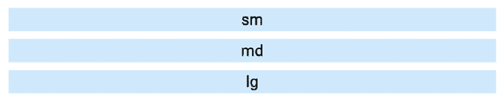

图 9.1：sm 断点

现在，如果我们调整屏幕大小，使其大于`md`断点，但小于`lg`断点，它看起来会是这样：

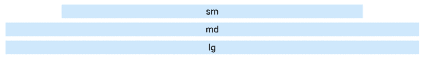

图 9.2：lg 断点

注意，现在我们已经超过了其`maxWidth`断点，第一个容器保持固定宽度。`md`和`lg`容器将继续随着屏幕增长，直到它们的断点被超过。

让我们看看当屏幕宽度超过所有断点时这些`Container`组件看起来像什么：

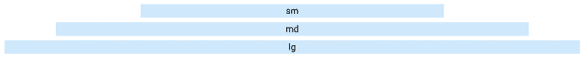

图 9.3：所有断点

`Container`组件让您控制页面元素如何水平增长。它们也是响应式的，因此当屏幕尺寸变化时，您的布局将得到更新。

在下一节中，我们将探讨使用 Material UI 组件构建更复杂和响应式布局。

## 构建响应式网格布局

Material UI 有一个`Grid`组件，我们可以用它来组合响应式复杂布局。从高层次来看，一个`Grid`组件可以是容器或容器内的一个项目。通过结合这两个角色，我们可以为我们的应用程序实现任何类型的布局。为了熟悉 Material UI 网格布局，让我们放在一起一个例子，它使用我们在许多 Web 应用程序中常见的常见布局模式。这是结果看起来像什么：

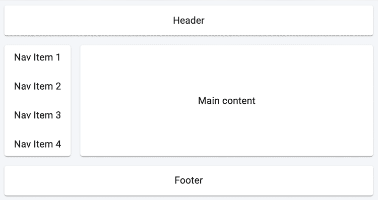

图 9.4：一个示例响应式网格布局

如您所见，这个布局有在许多 Web 应用程序中常见的熟悉部分。这只是一个示例布局；您可以使用`Grid`组件构建任何您能想象到的布局。让我们看看创建这个布局的代码：

```js
const headerFooterStyle = {
  textAlign: "center",
  height: 50,
};
const mainStyle = {
  textAlign: "center",
  padding: "8px 16px",
};
const Item = styled(Paper)(() => ({
  height: "100%",
  display: "flex",
  alignItems: "center",
  justifyContent: "center",
}));
export default function App() {
  return (
    <Grid container spacing={2} sx={{ backgroundColor: "#F3F6F9" }}>
      <Grid xs={12}>
        <Item sx={headerFooterStyle}>
          <Typography sx={mainStyle}>Header</Typography>
        </Item>
      </Grid>
      <Grid xs="auto">
        <Item>
          <Stack spacing={1}>
            <Typography sx={mainStyle}>Nav Item 1</Typography>
            <Typography sx={mainStyle}>Nav Item 2</Typography>
            <Typography sx={mainStyle}>Nav Item 3</Typography>
            <Typography sx={mainStyle}>Nav Item 4</Typography>
          </Stack>
        </Item>
      </Grid>
      <Grid xs>
        <Item>
          <Typography sx={mainStyle}>Main content</Typography>
        </Item>
      </Grid>
      <Grid xs={12}>
        <Item sx={headerFooterStyle}>
          <Typography sx={mainStyle}>Footer</Typography>
        </Item>
      </Grid>
    </Grid>
  );
} 
```

让我们分析这个布局中的部分是如何创建的。我们将从页眉部分开始：

```js
<Grid xs={12}>
  <Item sx={headerFooterStyle}>
    <Typography sx={mainStyle}>Header</Typography>
  </Item>
</Grid> 
```

`xs`断点属性值`12`意味着页眉将始终占据整个屏幕宽度，因为`12`是这里可以使用的最高值。接下来，让我们看看导航项：

```js
<Grid xs="auto">
  <Item>
    <Stack spacing={1}>
      <Typography sx={mainStyle}>Nav Item 1</Typography>
      <Typography sx={mainStyle}>Nav Item 2</Typography>
      <Typography sx={mainStyle}>Nav Item 3</Typography>
      <Typography sx={mainStyle}>Nav Item 4</Typography>
    </Stack>
  </Item>
</Grid> 
```

在导航部分，我们有一个带有`xs="auto"`属性的网格。它使列的大小与其内容的宽度相匹配。此外，您还可以看到我们使用`Stack`组件以垂直方向和间距放置组件。

接下来，我们将查看主要内容部分：

```js
<Grid xs>
  <Item>
    <Typography sx={mainStyle}>Main content</Typography>
  </Item>
</Grid> 
```

`xs`断点是一个用于在网格中填充导航部分之后所有空闲空间的真值。

在本节中，你了解了 Material UI 在布局方面能提供什么。你可以使用`Container`组件来控制节宽以及它们如何响应屏幕尺寸变化。然后你了解到`Grid`组件用于组合更复杂的网格布局。

在下一节中，我们将查看 Material UI 中的一些导航组件。

# 使用导航组件

一旦我们有了我们应用程序布局的外观和工作方式的初步想法，我们就可以开始考虑导航了。这是我们的 UI 的一个重要部分，因为它是用户在应用程序中导航的方式，并且会被频繁使用。在本节中，我们将了解 Material UI 提供的两个导航组件。

## 使用抽屉导航

`Drawer`组件就像一个物理抽屉一样，滑动打开以显示易于访问的内容。当我们完成时，抽屉再次关闭。这对于导航来说效果很好，因为它不会妨碍，允许屏幕上有更多空间用于用户正在参与的活动。让我们看一个例子，从`App`组件开始：

```js
<BrowserRouter>
  <Button onClick={toggleDrawer}>Open Nav</Button>
  <section>
    <Routes>
      <Route path="/first" element={<First />} />
      <Route path="/second" element={<Second />} />
      <Route path="/third" element={<Third />} />
    </Routes>
  </section>
  <Drawer open={open} onClose={toggleDrawer}>
    <div
      style={{ width: 250 }}
      role="presentation"
      onClick={toggleDrawer}
      onKeyDown={toggleDrawer}
    >
      <List component="nav">
        {links.map((link) => (
          <NavLink
            key={link.url}
            to={link.url}
            style={{ color: "black", textDecoration: "none" }}
          >
            {({ isActive }) => (
              <ListItemButton selected={isActive}>
                <ListItemText primary={link.name} />
              </ListItemButton>
            )}
          </NavLink>
        ))}
      </List>
    </div>
  </Drawer>
</BrowserRouter> 
```

让我们看看这里发生了什么。这个组件渲染的任何内容都在`BrowserRouter`组件内部，因为抽屉中的项目是路由的链接：

```js
<Button onClick={toggleDrawer}>Open Nav</Button>
<section>
  <Routes>
    <Route path="/first" element={<First />} />
    <Route path="/second" element={<Second />} />
    <Route path="/third" element={<Third />} />
  </Routes>
</section> 
```

`First`、`Second`和`Third`组件用于在用户点击抽屉中的链接时渲染主要应用程序内容。当点击`打开导航`按钮时，抽屉本身会打开。让我们更仔细地看看用于控制此状态的变量：

```js
const [open, setOpen] = useState(false);
const toggleDrawer = ({ type, key }: { type?: string; key?: string }) => {
  if (type === "keydown" && (key === "Tab" || key === "Shift")) {
    return;
  }
  setOpen(!open);
}; 
```

`open`状态控制抽屉的可见性。`Drawer`组件的`onClose`属性也会调用此函数，这意味着当抽屉内的任何链接被激活时，抽屉会关闭。接下来，让我们看看抽屉内的链接是如何生成的：

```js
<List component="nav">
  {links.map((link) => (
    <NavLink
      key={link.url}
      to={link.url}
      style={{ color: "black", textDecoration: "none" }}
    >
      {({ isActive }) => (
        <ListItemButton selected={isActive}>
          <ListItemText primary={link.name} />
        </ListItemButton>
      )}
    </NavLink>
  ))}
</List> 
```

在`Drawer`组件中显示的项目实际上是列表项，正如你在这里可以看到的。`links`属性包含所有具有`url`和`name`属性的链接对象。items 数组中的每个项目都映射到`NavLink`，用于处理导航并突出显示活动路由。在`NavLink`内部，我们有`ListItemButton`组件，它通过渲染`ListItemText`组件来生成带有文本的列表项。

最后，让我们看看`links`属性的默认值：

```js
const links = [
  { url: "/first", name: "First Page" },
  { url: "/second", name: "Second Page" },
  { url: "/third", name: "Third Page" },
]; 
```

这是屏幕首次加载后打开抽屉的样子：

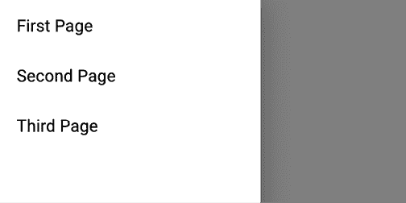

图 9.5：显示到我们页面链接的抽屉

尝试点击`第一页`链接。抽屉关闭并渲染`/first`路由的内容。然后，当你再次打开抽屉时，你会注意到`第一页`链接被渲染为活动链接：

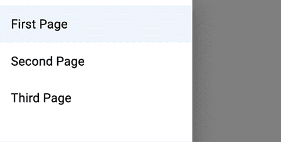

图 9.6：在抽屉中，`第一页`链接被样式化为活动链接

在本节中，你学习了如何使用`Drawer`组件作为应用程序的主要导航。在下一节中，我们将探讨`Tabs`组件。

## 使用标签导航

标签是现代网络应用中另一种常见的导航模式。Material UI 的`Tabs`组件允许我们使用标签作为链接并将它们连接到路由器。让我们看看如何做到这一点的示例。以下是`App`组件：

```js
export default function App() {
  return <RouterProvider router={router} />;
}
const router = createBrowserRouter([
  {
    path: "/",
    element: <RouteLayout />,
    children: [
      {
        path: "/page1",
        element: <Typography>Item One</Typography>,
      }, // same routes for /page2 and /page3
    ],
  },
]);
function RouteLayout() {
  const routeMatch = useRouteMatch(["/", "/page1", "/page2", "/page3"]);
  const currentTab = routeMatch?.pattern?.path;
  return (
    <Box>
      <Tabs value={currentTab}>
        <Tab label="Item One" component={Link} to="/page1" value="/page1" />
        <Tab label="Item Two" component={Link} to="/page2" value="/page2" />
        <Tab label="Item Three" component={Link} to="/page3" value="/page3" />
      </Tabs>
      <Outlet />
    </Box>
  );
} 
```

为了节省空间，我省略了`/page2`和`/page3`的路由配置；它们的模式与`/page1`相同。Material UI 中的`Tabs`和`Tab`组件实际上不会在选中的标签下渲染任何内容。这取决于我们提供内容，因为`Tabs`组件只负责显示标签并标记其中一个为选中状态。本例旨在让`Tab`组件使用`Link`组件，这些组件链接到由路由渲染的内容。

现在我们来仔细看看`RouteLayout`组件。每个`Tab`组件都使用`Link`组件，这样当它被点击时，路由器就会激活`to`属性中指定的路由。然后使用`Outlet`组件作为路由内容的子组件。为了匹配激活的标签，我们使用`useRouteMatch`来处理当前路由的简单方法：

```js
function useRouteMatch(patterns: readonly string[]) {
  const { pathname } = useLocation();
  for (let i = 0; i < patterns.length; i += 1) {
    const pattern = patterns[i];
    const possibleMatch = matchPath(pattern, pathname);
    if (possibleMatch !== null) {
      return possibleMatch;
    }
  }
  return null;
} 
```

`useRouteMatch`钩子使用`useLocation`获取当前的`pathname`，然后检查它是否与我们的模式匹配。

这是页面首次加载时的样子：

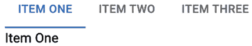

图 9.7：第一个选项处于激活状态

如果你点击**项目二**标签，URL 将更新，激活的标签将改变，标签下面的页面内容也会改变：

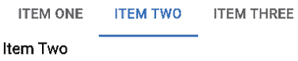

图 9.8：第二个选项处于激活状态

到目前为止，你已经了解了在 Material UI 应用程序中可以使用的两种导航方法。第一种是使用仅在用户需要访问导航链接时显示的`Drawer`。第二种是使用始终可见的`Tabs`。在下一节中，你将学习如何收集用户输入。

# 收集用户输入

从用户那里收集输入可能很困难。如果我们想要提供良好的用户体验，我们需要考虑每个字段许多细微之处。幸运的是，Material UI 中可用的`Form`组件为我们处理了许多可用性问题。在本节中，你将简要了解你可以使用的输入控件。

## 复选框和单选按钮

复选框用于从用户那里收集`true/false`答案，而单选按钮用于让用户从少量选项中选择一个。让我们看看 Material UI 中这些组件的示例：

```js
export default function Checkboxes() {
  const [checkbox, setCheckbox] = React.useState(false);
  const [radio, setRadio] = React.useState("First");
  return (
    <div>
      <FormControlLabel
        label={'Checkbox ${checkbox ? "(checked)" : ""}'}
        control={
          <Checkbox
            checked={checkbox}
            onChange={() => setCheckbox(!checkbox)}
          />
        }
      />
      <FormControl component="fieldset">
        <FormLabel component="legend">{radio}</FormLabel>
        <RadioGroup value={radio} onChange={(e) => setRadio(e.target.value)}>
          <FormControlLabel value="First" label="First" control={<Radio />} />
          <FormControlLabel value="Second" label="Second" control={<Radio />} />
          <FormControlLabel value="Third" label="Third" control={<Radio />} />
        </RadioGroup>
      </FormControl>
    </div>
  );
} 
```

此示例包含两件状态信息。`checkbox`状态控制`Checkbox`组件的值，而`radio`值控制`RadioGroup`组件的状态。`checkbox`状态传递给`Checkbox`组件的`checked`属性，而`radio`状态传递给`RadioGroup`组件的`value`属性。这两个组件都有`onChange`处理程序，它们调用它们各自的状态设置函数：`setCheckbox()`和`setRadio()`。你会注意到许多其他 Material UI 组件都参与了这些控件显示。例如，`checkbox`的标签使用`FormControlLabel`组件显示，而单选控件使用`FormControl`组件和`FormLabel`组件。

下面是这两个输入控件的外观：

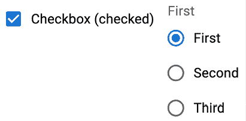

图 9.9：复选框和单选组

这两个控件标签都更新以反映组件的状态变化。复选框标签显示复选框是否被选中，而单选按钮标签显示当前选定的值。在下一节中，我们将查看文本输入和选择组件。

## 文本输入和选择输入

**文本字段**允许我们的用户输入文本，而`选择`允许他们从几个选项中进行选择。选择和单选按钮之间的区别在于，由于选项仅在用户打开选项菜单时才显示，因此选择在屏幕上占用的空间更少。

现在让我们看看`Select`组件：

```js
import { useState } from "react";
import InputLabel from "@mui/material/InputLabel";
import MenuItem from "@mui/material/MenuItem";
import FormControl from "@mui/material/FormControl";
import Select from "@mui/material/Select";
export default function MySelect() {
  const [value, setValue] = useState<string | undefined>();
  return (
    <FormControl>
      <InputLabel id="select-label">My Select</InputLabel>
      <Select
        labelId="select-label"
        id="select"
        label="My Select"
        value={value}
        onChange={(e) => setValue(e.target.value)}
        inputProps={{ id: "my-select" }}
      >
        <MenuItem value="first">First</MenuItem>
        <MenuItem value="second">Second</MenuItem>
        <MenuItem value="third">Third</MenuItem>
      </Select>
    </FormControl>
  );
} 
```

在此示例中使用的值状态控制`Select`组件中的选定值。当用户更改他们的选择时，`setValue()`函数会更改值。

`MenuItem`组件用于指定`select`字段中可用的选项；当选择给定项时，`value`属性设置为值状态。以下是菜单显示时的`select`字段外观：

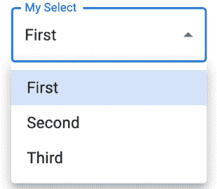

图 9.10：第一个项目处于活动状态的菜单

接下来，让我们看看一个`TextField`组件的示例：

```js
export default function MyTextInput() {
  const [value, setValue] = useState("");
  return (
    <TextField
      label="Name"
      value={value}
      onChange={(e) => setValue(e.target.value)}
      margin="normal"
    />
  );
} 
```

值状态控制文本输入的值，并随着用户的输入而改变。下面是`text`字段的外观：

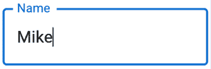

图 9.11：带有用户提供的文本的文本字段

与其他`FormControl`组件不同，`TextField`组件不需要其他几个支持组件。我们所需的一切都可以通过属性来指定。在下一节中，我们将查看`Button`组件。

## 与按钮一起工作

Material UI 按钮与 HTML 按钮元素非常相似。区别在于它们是 React 组件，与 Material UI 的其他方面（如主题和布局）配合得很好。让我们看看一个渲染不同样式按钮的示例：

```js
type ButtonColor = "primary" | "secondary";
export default function App() {
  const [color, setColor] = useState<ButtonColor>("secondary");
  const updateColor = () => {
    setColor(color === "secondary" ? "primary" : "secondary");
  };
  return (
    <Stack direction="row" spacing={2}>
      <Button variant="contained" color={color} onClick={updateColor}>
        Contained
      </Button>
      <Button color={color} onClick={updateColor}>
        Text
      </Button>
      <Button variant="outlined" color={color} onClick={updateColor}>
        Outlined
      </Button>
      <IconButton color={color} onClick={updateColor}>
        <AndroidIcon />
      </IconButton>
    </Stack>
  );
} 
```

此示例渲染了四种不同的按钮样式。我们使用`Stack`组件来渲染按钮行。当按钮被点击时，状态会在主要和次要之间切换。

这是按钮首次渲染时的样子：

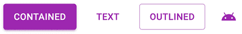

图 9.12：四种 Material UI 按钮样式

这是每个按钮被点击后的样子：

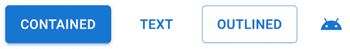

图 9.13：按钮被点击后的样子

在本节中，你了解了 Material UI 中一些可用的用户输入控件。`复选框`和`单选按钮`在用户需要开启或关闭某个功能或选择一个选项时非常有用。当用户需要输入一些文本时，文本输入是必要的，而`选择框`在您有一系列选项可供选择但显示空间有限时非常有用。最后，你了解到 Material UI 有几种按钮样式，当用户需要启动一个动作时可以使用。在下一节中，我们将探讨在 Material UI 中样式和主题是如何工作的。

# 与样式和主题一起工作

Material UI 包含用于扩展 UI 组件样式和扩展应用于所有组件的**主题样式**的系统。在本节中，你将了解如何使用这两个系统。

## 制作样式

Material UI 自带一个`styled()`函数，可以用来基于 JavaScript 对象创建样式化组件。这个函数的返回值是一个应用了新样式的新的组件。

让我们更详细地看看这种方法：

```js
const StyledButton = styled(Button)(({ theme }) => ({
  "&.MuiButton-root": { margin: theme.spacing(1) },
  "&.MuiButton-contained": { borderRadius: 50 },
  "&.MuiButton-sizeSmall": { fontWeight: theme.typography.fontWeightLight },
}));
export default function App() {
  return (
    <>
      <StyledButton>First</StyledButton>
      <StyledButton variant="contained">Second</StyledButton>
      <StyledButton size="small" variant="outlined">
        Third
      </StyledButton>
    </>
  );
} 
```

在这个样式中使用的名字（`MuiButton-root`、`MuiButton-contained`和`MuiButton-sizeSmall`）并不是我们想出来的。这些都是**按钮 CSS API**的一部分。根样式应用于所有按钮，因此在这个例子中，所有三个按钮都将具有我们在这里应用的边距值。`contained`样式应用于使用包含变体的按钮。`sizeSmall`样式应用于具有小尺寸属性值的按钮。

这是自定义按钮样式的外观：

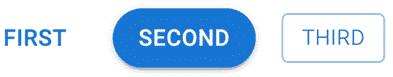

图 9.14：使用自定义样式的按钮

现在你已经知道了如何更改单个组件的外观和感觉，是时候考虑如何自定义整个应用程序的外观和感觉了。

## 自定义主题

Material UI 自带默认主题。我们可以以此为基础创建自己的主题。在 Material UI 中创建新主题主要有两个步骤：

1.  使用`createTheme()`函数来自定义默认主题设置，并返回一个新的主题对象。

1.  使用`ThemeProvider`组件包裹我们的应用程序，以便应用适当的主题。

让我们看看这个流程在实际中是如何工作的：

```js
import Menu from "@mui/material/Menu";
import MenuItem from "@mui/material/MenuItem";
import { ThemeProvider, createTheme } from "@mui/material/styles";
const theme = createTheme({
  typography: {
    fontSize: 11,
  },
  components: {
    MuiMenuItem: {
      styleOverrides: {
        root: {
          marginLeft: 15,
          marginRight: 15,
        },
      },
    },
  },
});
export default function App() {
  return (
    <ThemeProvider theme={theme}>
      <Menu anchorEl={document.body} open={true}>
        <MenuItem>First Item</MenuItem>
        <MenuItem>Second Item</MenuItem>
        <MenuItem>Third Item</MenuItem>
      </Menu>
    </ThemeProvider>
  );
} 
```

我们在这里创建的自定义主题做了两件事：

+   它将所有组件的默认字体大小更改为`11`。

+   它更新了`MenuItem`组件的左右边距值。

在 Material UI 主题中可以设置许多值；更多自定义信息请参考自定义文档。`components` 部分用于组件特定的自定义。当你需要为应用中每个组件实例设置样式时，这非常有用。

# 摘要

本章是对 Material UI 的非常简要介绍，它是最受欢迎的 React UI 框架。我们首先查看用于帮助布局我们页面的组件。然后我们查看可以帮助用户在应用中导航的组件。接下来，你学习了如何使用 Material UI 表单组件收集用户输入。最后，你学习了如何通过样式和修改主题来设置你的 Material UI。

从本章中获得的认识使你能够在不从头开发 UI 组件的情况下构建复杂界面，从而加速你的开发过程。此外，React 应用开发本质上依赖于各种辅助库的协同使用。对 React 生态系统及其关键库的深入了解使开发者能够快速原型设计和迭代他们的应用，使开发更有效。

在下一章中，我们将探讨使用 React 最新版本中提供的最新功能来提高组件状态更新效率的方法。
