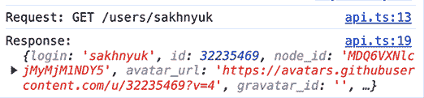
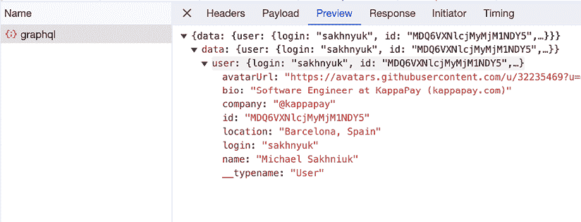

# 11

# 从服务器获取数据

网络技术的发展使得浏览器与服务器之间的交互以及服务器数据的处理成为网络开发的一个核心部分。如今，很难在传统网页和完整的网络应用之间划清界限。这一变革的核心是浏览器中 JavaScript 的能力，它能够向服务器发起请求，高效地处理接收到的数据，并在页面上动态显示。这个过程已成为创建我们今天所看到的交互式和响应式网络应用的基础。在本章中，我们将探讨从服务器获取数据的各种方法和途径，讨论它们对网络应用架构的影响，并熟悉这一领域的现代实践。

因此，在本章中，我们将涵盖以下主题：

+   处理远程数据

+   使用 **Fetch API**

+   使用 **Axios**

+   使用 **TanStack Query**

+   使用 **GraphQL**

# 技术要求

您可以在 GitHub 上找到本章的代码文件，地址为[`github.com/PacktPublishing/React-and-React-Native-5E/tree/main/Chapter11`](https://github.com/PacktPublishing/React-and-React-Native-5E/tree/main/Chapter11)。

# 处理远程数据

在网络开发领域，从服务器获取数据的过程经历了显著的变革。在 20 世纪 90 年代初，随着**HTTP 1.0**的出现，标志着服务器通信的开始。网页是静态的，HTTP 请求也很基础，仅用于获取整个页面或静态资源。每次请求都需要建立新的连接，交互性非常有限，主要限于 HTML 表单。安全性也很基础，反映了网络的初级阶段。

千禧年的转折点见证了**异步 JavaScript 和 XML**（**AJAX**）的兴起，这带来了增强的交互性，允许网络应用在后台与服务器通信，而无需重新加载整个页面。它由`XMLHttpRequest`对象驱动。以下是一个使用`XMLHttpRequest`获取数据的简单示例：

```js
var xhr = new XMLHttpRequest();
xhr.onreadystatechange = function() {
  if (xhr.readyState == XMLHttpRequest.DONE) {
    if (xhr.status === 200) {
      console.log(xhr.responseText);
    } else {
      console.error('Error fetching data');
    }
  }
};
xhr.open('GET', 'http://example.com', true);
xhr.send(); 
```

这个例子说明了典型的**XHR 请求**。成功和错误响应通过回调函数管理。这反映了异步代码严重依赖回调的时代。

随着我们的进步，HTTP 演变为**1.1**版本，通过持久连接增强了效率，并标准化了**RESTful API**。这些 API 使用标准的 HTTP 方法，并围绕可识别的资源设计，大大提高了可扩展性和开发者的生产力。

**Fetch API**的出现提供了一种现代的、基于 Promise 的机制来发起网络请求。Fetch 比`XMLHttpRequest`更强大、更灵活。以下是一个使用 Fetch 的示例：

```js
fetch('http://example.com/data')
  .then(response => response.json())
  .then(data => console.log(data))
  .catch(error => console.error('Error:', error)); 
```

此外，还有许多基于 Fetch API 和 XHR 开发的社区工具。例如，Axios、GraphQL 和 React Query 进一步简化了服务器通信和数据获取，增强了开发者的体验。

**Axios**是一个现代的 HTTP 客户端库，通过基于 Promise 的 API 和一系列有用的功能（如拦截请求和响应）进一步简化了数据获取。以下是如何使用 Axios 进行**GET**请求的示例：

```js
axios.get('http://example.com/data')
  .then(response => console.log(response.data))
  .catch(error => console.error('Error:', error)); 
```

这个例子可能看起来与**Fetch** API 相同，但在实际项目中，当你设置了拦截器时，它就变成了一个节省大量时间的游戏改变者。**拦截器**允许你在请求发送之前拦截并修改请求，在响应处理之前拦截并修改响应。一个常见的用例是在访问令牌过期时刷新访问令牌。拦截器可以将新令牌添加到所有后续请求中。通过使用像 Axios 这样的库，许多低级网络代码被抽象化，让你可以专注于发送请求和处理响应。拦截器、错误处理和其他功能以可重用的方式解决跨切面问题，从而产生更干净的代码。

接下来是**GraphQL**，它通过允许客户端请求他们确切需要的数据，从而彻底改变了数据获取方式，消除了过度获取和不足获取的问题。它提供了一种灵活且高效的方式从服务器检索数据。而不是预定义的端点，客户端指定他们的数据需求，服务器则返回精确请求的数据。这减少了网络负载并提高了应用程序的性能。

```js
import { GraphQLClient, gql } from 'graphql-request';
const endpoint = 'http://example.com/graphql';
const client = new GraphQLClient(endpoint);
const query = gql'
  query {
    user(id: 123) {
      name
      email
    }
  }
';
client.request(query)
  .then(data => console.log(data))
  .catch(error => console.error('Error:', error)); 
```

在这里，我们通过`ID`请求用户，只指定了两个字段：`name`和`email`。无论用户对象的大小如何，GraphQL 服务器都能高效地处理它，只向客户端发送请求的数据。

我还想探讨另一个工具**React Query**。这个库旨在简化 React 应用程序中的数据获取和状态管理。它抽象掉了获取和缓存数据的复杂性，处理后台更新，并提供 Hooks 以方便与组件集成。React Query 通过使以高效和可维护的方式与服务器数据一起工作变得简单，从而提高了开发过程。

```js
import { useQuery } from 'react-query';
function UserProfile({ userId }) {
  const { data, error, isLoading } = useQuery(userId, fetchUser);
  if (isLoading) return <div>Loading...</div>;
  if (error) return <div>Error: {error.message}</div>;
  return (
    <div>
      <h1>{data.name}</h1>
      <p>Email: {data.email}</p>
    </div>
  );
} 
```

如您所见，我们甚至不需要处理错误或手动设置和更新加载状态。所有这些都是由一个 Hook 提供的。

服务器通信的另一个显著发展是**WebSockets**，它实现了实时双向通信。这对于需要实时数据更新的应用程序，如聊天应用或交易平台来说是一个游戏改变者。以下是一个使用 WebSockets 的基本示例：

```js
const socket = new WebSocket('ws://example.com');
socket.onopen = function(event) {
  console.log('Connection established');
};
socket.onmessage = function(event) {
  console.log('Message from server ', event.data);
};
socket.onerror = function(error) {
  console.error('WebSocket Error ', error);
}; 
```

在这里，我们仍然使用回调方法，因为双向通信的心理模型。

总之，服务器通信在 Web 开发中的演变对于提升用户体验和开发者生产力至关重要。从**HTTP 1.0**的初级阶段到今天的复杂工具，我们见证了巨大的转变。Ajax、Fetch API、Axios、GraphQL 和 React Query 等技术的引入不仅简化了服务器交互，还标准化了应用程序中的异步行为。这些进步对于高效管理加载、错误和离线场景等状态至关重要。这些工具在现代 Web 应用程序中的集成标志着在构建更响应、更健壮和用户友好的界面方面迈出了重要一步。这是对技术不断演变及其对网络内容创建和消费深远影响的证明。

在下一节中，我们将探讨如何使用 Fetch API 从服务器获取数据的真实示例。

# 使用 Fetch API

让我们探索如何在实践中从服务器检索数据。我们将从最常见和基础的**Fetch API**开始。

在我们开始之前，让我们创建一个小型应用程序，该应用程序从 GitHub 获取用户数据并在屏幕上显示他们的头像和基本信息。为此，我们需要一个空的**Vite**项目，并使用 React。您可以使用以下命令创建它：

```js
npm create vite@latest 
```

由于我们在示例中使用**TypeScript**，让我们首先定义`GitHubUser`接口和所有必要的参数。

为了找出服务器返回的数据，我们通常需要参考文档，通常由后端开发者提供。在我们的案例中，由于我们使用 GitHub REST API，我们可以在官方 GitHub 文档中找到用户信息，链接如下：[`docs.github.com/en/rest/users/users?apiVersion=2022-11-28`](https://docs.github.com/en/rest/users/users?apiVersion=2022-11-28)。

让我们按照以下方式创建`GitHubUser`接口：

```js
export interface GitHubUser {
  login: string;
  id: number;
  avatar_url: string;
  html_url: string;
  gists_url: string;
  repos_url: string;
  name: string;
  company: string | null;
  location: string | null;
  bio: string | null;
  public_repos: number;
  public_gists: number;
  followers: number;
  following: number;
} 
```

这些是我们将在应用程序中使用的必要字段。实际上，`user`对象中还有更多字段，但我只包括了我们将要使用的那些。

现在我们知道了用户将拥有的字段，让我们创建一个组件，该组件将在屏幕上显示用户数据：

```js
const UserInfo = ({ user }: GitHubUserProps) => {
  return (
    <div>
      
      <h2>{user.name || user.login}</h2>
      <p>{user.bio}</p>
      <p>Location: {user.location || "Not specified"}</p>
      <p>Company: {user.company || "Not specified"}</p>
      <p>Followers: {user.followers}</p>
      <p>Following: {user.following}</p>
      <p>Public Repos: {user.public_repos}</p>
      <p>Public Gists: {user.public_gists}</p>
      <p>
        GitHub Profile:{" "}
        <a href={user.html_url} target="_blank" rel="noopener noreferrer">
          {user.login}
        </a>
      </p>
    </div>
  );
}; 
```

在这里，我们将用户的头像和一些有用的信息以及一个打开他们 GitHub 个人资料页面的链接一起展示。

现在让我们看看`App`组件，在那里我们处理服务器数据检索逻辑：

```js
function App() {
  const [user, setUser] = useState<GitHubUser>();
  const [loading, setLoading] = useState(true);
  useEffect(() => {
    setLoading(true);
    fetch("https://api.github.com/users/sakhnyuk")
      .then((response) => response.json())
      .then((data) => setUser(data))
      .catch((error) => console.log(error))
      .finally(() => setLoading(false));
  }, []); 
```

我们使用`useState`钩子来存储`user`数据和加载状态。在`useEffect`中，我们通过 Fetch API 请求从 GitHub API 获取数据。如您所见，`fetch`函数接受一个 URL 作为参数。我们处理响应，将其保存到状态中，使用`catch`块处理错误，并最终使用`finally`块关闭加载过程。

为了完成应用程序，我们展示检索到的用户数据：

```js
 return (
    <div>
      {loading && <p>Loading...</p>}
      {!loading && !user && <p>No user found.</p>}
      {user && <UserInfo user={user} />}
    </div>
  );
} 
```

您可以使用以下命令运行您的应用程序：

```js
npm run dev 
```

打开终端中出现的链接，你会看到：


图 11.1：由 Fetch API 请求的 GitHub 用户

现在你已经知道了如何使用 Fetch API 获取数据。让我们探索一个类似的应用程序的实施，其中我们使用其他工具请求数据。

# 使用 Axios

在本节中，我们将探索一个用于与服务器交互的最受欢迎的库，称为 **Axios**。这个库类似于 Fetch API，但也提供了额外的功能，使其成为处理请求的强大工具。

让我们把我们的前一个项目拿来做一些修改。首先，让我们将 Axios 作为依赖项安装：

```js
npm install axios 
```

Axios 的一个特性是能够创建具有特定配置的实例，例如头部信息、基本 URL、拦截器等。这使得我们可以拥有一个预先配置的实例，以满足我们的需求，减少代码重复，并使其更具可扩展性。

让我们创建一个 API 类，它封装了与服务器交互所需的所有必要逻辑：

```js
class API {
  private apiInstance: AxiosInstance;
  constructor() {
    this.apiInstance = axios.create({
      baseURL: "https://api.github.com",
    });
    this.apiInstance.interceptors.request.use((config) => {
      console.log("Request:", '${config.method?.toUpperCase()} ${config.url}');
      return config;
    });
    this.apiInstance.interceptors.response.use(
      (response) => {
        console.log("Response:", response.data);
        return response;
      },
      (error) => {
        console.log("Error:", error);
        return Promise.reject(error);
      }
    );
  }
  getProfile(username: string) {
    return this.apiInstance.get<GitHubUser>('/users/${username}');
  }
}
export default new API(); 
```

在这个类的构造函数中，我们创建并存储一个 Axios 实例，并设置基本 URL，从而消除在未来的请求中重复此域的需要。接下来，我们为每个请求和响应配置拦截器。这是为了演示目的，所以当我们运行应用程序时，我们可以在控制台日志中看到所有的请求和响应：



图 11.2：Axios 拦截器日志

现在，让我们看看使用我们新的 API 类的 `App` 组件将是什么样子：

```js
function App() {
  const [user, setUser] = useState<GitHubUser>();
  const [loading, setLoading] = useState(true);
  useEffect(() => {
    setLoading(true);
    api
      .getProfile("sakhnyuk")
      .then((res) => setUser(res.data))
      .finally(() => setLoading(false));
  }, []);
  return (
    <div>
      {loading && <p>Loading...</p>}
      {!loading && !user && <p>No user found.</p>}
      {user && <UserInfo user={user} />}
    </div>
  );
} 
```

如前所述，Axios 与 Fetch API 并无显著差异，但它提供了更强大的功能，使得创建更复杂的用于处理服务器数据的解决方案变得容易。

在下一节中，我们将探索使用 TanStack Query 实现的相同应用程序。

# 使用 TanStack Query

**TanStack Query**，更常被称为 **React Query**，是一个将服务器交互提升到新高度的库。这个库允许我们请求数据并将其缓存。因此，我们可以在一次渲染期间多次调用相同的 `useQuery` 钩子，但只需向服务器发送一个请求。该库还包括内置的加载和错误状态，简化了请求状态的处理。

要开始，让我们将库作为我们项目的依赖项安装：

```js
npm install @tanstack/react-query 
```

接下来，我们需要通过添加 `QueryClientProvider` 来配置库：

```js
const queryClient = new QueryClient();
ReactDOM.createRoot(document.getElementById("root")!).render(
  <QueryClientProvider client={queryClient}>
    <App />
  </QueryClientProvider>
); 
```

在此设置之后，我们可以开始工作在应用程序上。这个库的一个独特特性是它对用于数据获取的工具是中立的。你只需要提供一个返回数据的承诺函数。让我们使用 Fetch API 创建这样一个函数：

```js
const userFetcher = (username: string) =>
  fetch("https://api.github.com/users/sakhnyuk")
  .then((response) => response.json()); 
```

现在，让我们看看我们的 `App` 组件变得多么简单：

```js
function App() {
  const {
    data: user,
    isPending,
    isError,
  } = useQuery({
    queryKey: ["githubUser"],
    queryFn: () => userFetcher("sakhnyuk"),
  });
  return (
    <div>
      {isPending && <p>Loading...</p>}
      {isError && <p>Error fetching data</p>}
      {user && <UserInfo user={user} />}
    </div>
  );
} 
```

现在，所有制作请求和处理加载和错误状态的逻辑都包含在一个单一的 `useQuery` 钩子中。

在下一节中，我们将探索一个更强大的用于数据获取的工具，即 GraphQL。

# 使用 GraphQL

在本章早期，我们讨论了 **GraphQL** 是什么以及它如何允许我们指定从服务器获取的确切数据，从而减少传输的数据量并加快数据获取速度。

在这个例子中，我们将探索与 `@apollo/client` 库结合使用的 GraphQL，该库提供了与 React Query 类似的功能，但与 GraphQL 查询一起工作。

首先，让我们使用以下命令安装必要的依赖项：

```js
npm install @apollo/client graphql 
```

接下来，我们需要在我们的应用程序中添加一个提供者：

```js
const client = new ApolloClient({
  uri: "https://api.github.com/graphql",
  cache: new InMemoryCache(),
  headers: {
    Authorization: 'Bearer YOUR_PAT', // Put your GitHub personal access token here
  },
});
ReactDOM.createRoot(document.getElementById("root")!).render(
  <ApolloProvider client={client}>
    <App />
  </ApolloProvider>
); 
```

在这个阶段，在客户端设置过程中，我们指定我们想要与之工作的服务器 URL、缓存设置和身份验证。在早期示例中，我们使用了公共 GitHub API，但 GitHub 也支持 GraphQL。为此，我们需要提供一个 **GitHub 个人访问令牌**，您可以在您的 GitHub 个人资料设置中获取。

对于我们的示例，为了演示我们如何仅选择所需的字段，让我们缩减用户数据。组件中的 GraphQL 查询将如下所示：

```js
const GET_GITHUB_USER = gql'
  query GetGithubUser($username: String!) {
    user(login: $username) {
      login
      id
      avatarUrl
      bio
      name
      company
      location
    }
  }
'; 
```

现在一切准备就绪，让我们看看 `App` 组件将是什么样子：

```js
function App() {
  const { data, loading, error } = useQuery(GET_GITHUB_USER, {
    variables: { username: "sakhnyuk" },
  });  
  if (loading) return <p>Loading...</p>;
  if (error) return <p>Error fetching data</p>;
  const user = data.user;
  return (
    <div>
      <UserInfo user={user} />
    </div>
  );
} 
```

与 React Query 类似，我们有访问加载状态、错误和实际数据的能力。当我们打开应用程序时，我们将看到结果：


图 11.3：通过 GraphQL 请求的 GitHub 用户

为了确保服务器返回我们请求的确切数据，我们可以打开 Chrome 开发者工具，转到 **网络** 选项卡，并检查我们的请求：



图 11.4：GraphQL 请求

如 *图 11.4* 所示，服务器发送给我们我们在查询中指定的精确数据。你可以通过实验查询参数来查看差异。

# 摘要

在本章中，我们探讨了如何从服务器获取数据。我们首先简要回顾了客户端-服务器通信的历史，并强调了与服务器交互的主要方法。接下来，我们构建了一个应用程序，使用 Fetch API、Axios、TanStack Query 和 Apollo GraphQL 来检索 GitHub 用户数据。

本章中你学到的技术将使你能够显著扩展你自己的 Web 应用程序的功能。通过从服务器高效地获取数据，你可以为用户创建动态、数据驱动的体验。无论你是构建一个显示实时流的社交媒体应用程序，一个提供最新产品信息的电子商务网站，还是一个可视化实时数据的仪表板，你获得的技术将证明是无价的。

在下一章中，我们将深入探讨使用状态管理库来管理应用程序状态。
