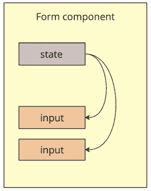
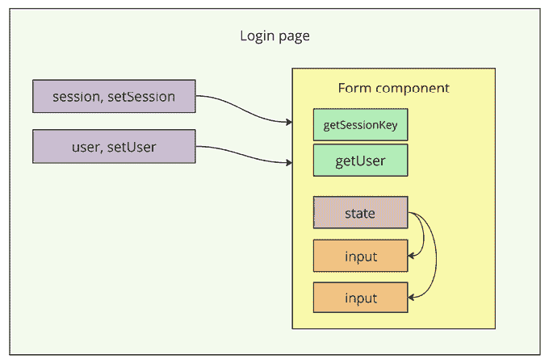
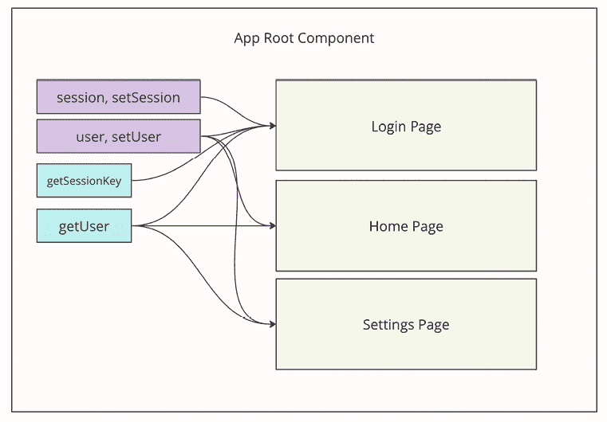
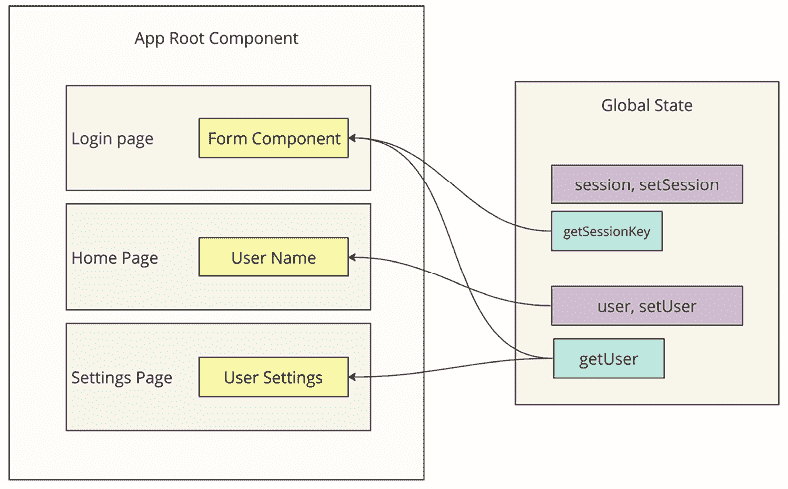
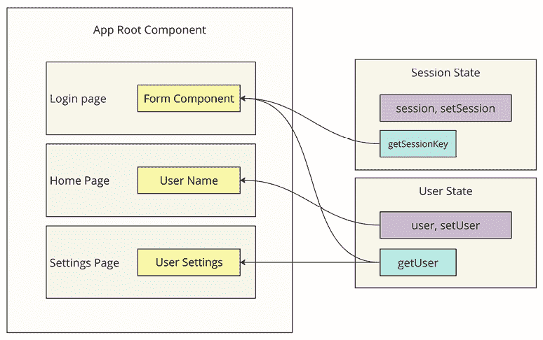

# 12

# React 中的状态管理

在前面的章节中，我们探讨了 React 中的状态概念，并掌握了使用`useState`钩子与之交互的基础。现在，我们需要深入探讨应用的**全局状态管理**。在本章中，我们将关注全局状态：我们将定义它是什么，它的关键优势以及有效管理的策略。

本章将涵盖以下主题：

+   什么是全局状态？

+   React 上下文 API 和 useReducer

+   Redux

+   Mobx

# 什么是全局状态？

在开发 React 应用程序时，需要特别注意的一个关键方面是**状态管理**。我们已经熟悉了`useState`钩子，它允许我们在组件内部创建和管理状态。这种类型的状态通常被称为**局部**，它在一个组件内部非常有效，简单且易于使用。

为了更清晰地说明，考虑一个具有小型表单组件的例子，其中我们有两个**输入**元素，并为每个**输入**创建了两个状态：



图 12.1：带有局部状态的表单组件

在这个例子中，一切都很简单：用户在`input`中输入一些内容，这会触发一个`onChange`事件，我们通常在这里改变我们的`state`，导致表单的全局重新渲染，然后我们在屏幕上看到输入的结果。

然而，随着应用程序的复杂性和规模的增加，不可避免地需要一种更可扩展和灵活的状态管理方法。让我们进一步考虑我们的例子，并想象在填写表单信息后，我们需要向服务器发送用户授权请求并获取**会话键**。然后，使用这个键，我们需要请求用户数据：姓名、姓氏和头像。

在这里，我们立即遇到了困难：会话键和用户数据应该存储在哪里？也许我们可以在表单内部直接检索数据，然后将其传递给父组件，因为它是更全局的并且负责。好吧，让我们来展示这一点并看看：



图 12.2：带有表单组件的登录页面

因此，现在我们有一个登录页面，其中我们为**会话**和**用户**对象创建了局部状态。使用 props，我们可以将像`onSessionChange`和`onUserChange`这样的函数传递给表单组件，这最终使我们能够将数据从表单传输到登录页面。此外，在表单中，我们现在有`getSessionKey`和`getUser`这样的函数。这些方法与服务器交互，在成功响应后，它们不会在本地存储数据，而是调用上述的`onSessionChange`和`onUserChange`。

有些人可能会认为数据存储问题已经解决，但很可能在用户授权并获得他们的数据后，我们需要将用户重定向到我们应用程序的某个主页。我们可能再次重复将数据提升到更高层次的小把戏，但在这样做之前，让我们提前思考并想象获取用户数据可能不仅仅是授权表单的工作，这种功能可能在其他页面上也需要。

最终，我们理解到，除了数据本身之外，我们还需要将处理数据的逻辑保持在组件树的上层：



图 12.3：应用程序根组件

这张图片清楚地展示了当我们需要将所有必要的数据和方法从应用程序的最顶层组件传递到所有页面和组件时，应用程序如何变得更加复杂。

除了实现和维护这种组织应用程序状态的方法的复杂性之外，还存在一个重大的性能问题。例如，在根组件中通过`useState`创建的状态，每次我们更新它时，整个应用程序都会重新渲染，因为应用程序的根组件将被重新绘制。

因此，我们已经识别出在大型应用程序的组件中组织本地状态的主要问题：

+   组件树过于复杂，所有重要数据都必须通过 props 从上到下传递。这紧密耦合了组件，使代码及其维护变得复杂。

+   性能问题，当应用程序不需要时，可能会不必要地重新渲染。

看到最后一张图，人们可能会想是否可以切断我们组件的连接，并将所有数据和逻辑提取到组件之外。这就是全局状态概念发挥作用的地方。

**全局状态**是一种数据管理方法，它允许状态在应用程序的不同层次和组件之间可访问和可修改。这种解决方案克服了本地状态的局限性，促进了组件之间的数据交换，并提高了大规模项目中的状态可管理性。

为了清楚地了解全局状态在我们例子中的样子，请看下面的图片：



图 12.4：应用程序根组件和全局状态

在这个例子中，我们有一个位于组件和整个树之外的全局状态。只有那些实际上需要从状态中获取数据的组件可以直接访问它并订阅其变化。

通过实现全局状态，我们可以一次解决两个问题：

+   简化了组件树和依赖关系，从而扩展并支持了应用程序。

+   提高了应用程序的性能，因为现在，只有订阅了全局状态数据的组件在状态变化时才会重新渲染。

然而，重要的是要理解，局部状态仍然是一个非常强大的工具，不应该为了全局状态而放弃。我们只有在状态需要在应用组件的不同层级之间使用时才能获得优势。否则，如果我们开始将所有变量和状态转移到全局状态，我们只会使应用复杂化而不会获得任何好处。

既然我们知道全局状态仅仅是组织数据的一种方式，我们该如何管理全局状态呢？**状态管理器** 是一个帮助组织和管理应用状态的工具，尤其是在处理复杂交互和大量数据时。它为应用的所有状态提供了一个**集中式存储库**，并以有序和可预测的方式管理其更新。在实践中，状态管理器通常以 npm 包的形式表示，作为项目依赖项安装。然而，也可以使用 React 的 API 独立管理全局状态，而不使用任何库。我们将在稍后探讨这种方法。

# React Context API 和 useReducer

要自己组织全局状态，你可以使用 React 生态系统中的现有工具，即 **Context API** 和 `useReducer`。它们是一对强大的状态管理工具，尤其是在使用第三方状态管理器显得过多的情况下。这些工具非常适合在更紧凑的应用中创建和管理全局状态。

**React Context API** 的设计是为了在组件树中传递数据，而不需要在每个层级传递 props。这简化了深层嵌套组件中数据的访问，并减少了 **prop 传递**（通过多个层级传递 props），如图 *12.4* 所示。React Context API 对于像主题设置、语言偏好或用户信息这样的数据尤其有用。

这里是一个如何使用上下文来存储主题设置的示例：

```js
const ThemeContext = createContext();
const ThemeProvider = ({ children }) => {
  const theme = 'dark';
  return (
    <ThemeContext.Provider value={theme}>
      {children}
    </ThemeContext.Provider>
  );
};
const useTheme = () => useContext(ThemeContext);
export { ThemeProvider, useTheme }; 
```

在这个例子中，我们使用 `createContext` 函数创建了 `ThemeContext`。然后，我们创建了一个 `ThemeProvider` 组件，它应该包裹应用的根组件。这将允许使用 `useTheme` 钩子在任何嵌套组件的层级上访问，该钩子是用 `useContext` 钩子创建的：

```js
const MyComponent = () => {
  const theme = useTheme();
  return (
    <div>
      <p>Current theme: {theme}</p>
    </div>
  );
}; 
```

在组件树的任何层级上，我们都可以使用 `useTheme` 钩子访问当前的主题。

接下来，让我们看看这对中的一员，即那个将帮助我们构建全局状态的特殊钩子。`useReducer` 是一个钩子，允许你使用还原器（reducer）来管理复杂的状态：还原器是接受当前状态和动作，然后返回新状态的函数。`useReducer` 对于需要复杂逻辑或多个子状态的状态管理来说非常理想。让我们考虑一个使用 `useReducer` 的简单计数器示例：

```js
import React, { useReducer } from 'react';
const initialState = { count: 0 };
function reducer(state, action) {
  switch (action.type) {
    case 'increment':
      return { count: state.count + 1 };
    case 'decrement':
      return { count: state.count - 1 };
    default:
      throw new Error();
  }
}
function Counter() {
  const [state, dispatch] = useReducer(reducer, initialState);
  return (
    <>
      Count: {state.count}
      <button onClick={() => dispatch({ type: 'increment' })}>+</button>
      <button onClick={() => dispatch({ type: 'decrement' })}>-</button>
    </>
  );
} 
```

在这个例子中，实现了一个具有两个动作的还原器：`增加` 和 `减少` 计数器。

Context API 和`useReducer`的组合为创建和管理应用程序的全局状态提供了一个强大的机制。这种方法对于小型应用程序来说很方便，因为现成的和更大的状态管理解决方案可能显得多余。然而，也值得注意，这种解决方案并没有完全解决性能问题，因为在`useTheme`示例中的主题更改或计数器示例中的计数器更改都会导致提供者，进而导致整个组件树重新渲染。这可以通过额外的逻辑和编码来避免。

因此，更复杂的应用程序需要更强大的工具。为此，有几个现成的和流行的解决方案用于处理状态，每个解决方案都有其独特的功能和适用于不同的用例。

# Redux

这些工具中的第一个当然是**Redux**。它是管理复杂 JavaScript 应用程序状态最受欢迎的工具之一，尤其是在与 React 一起使用时。Redux 通过维护单个全局对象中的应用程序状态来提供可预测的状态管理，简化了更改跟踪和数据管理。

Redux 基于三个核心原则：单一事实来源（一个全局状态）、状态是只读的（不可变）和更改是通过纯函数（还原器）进行的。这些原则确保了有序和受控的数据流。

```js
function counterReducer(state = { count: 0 }, action) {
  switch (action.type) {
    case 'INCREMENT':
      return { count: state.count + 1 };
    case 'DECREMENT':
      return { count: state.count - 1 };
    default:
      return state;
  }
}
const store = createStore(counterReducer);
store.subscribe(() => console.log(store.getState()));
store.dispatch({ type: 'INCREMENT' });
store.dispatch({ type: 'DECREMENT' }); 
```

在这个例子中，应用程序的状态是从计数器示例实现的。我们有一个`counterReducer`，它是一个常规函数，它接受当前状态和要对其执行的操作。还原器始终返回一个新的状态。

在 Redux 世界中实现异步操作是一个复杂的问题，因为默认情况下它只提供了中间件，这是第三方解决方案使用的。其中一个解决方案是`redux-thunk`。

`redux-thunk`是一个中间件，允许你调用返回函数而不是动作对象的动作创建函数。这提供了通过异步请求延迟动作分发或分发多个动作的能力。

```js
function fetchUserData() {
  return (dispatch) => {
    dispatch({ type: 'LOADING_USER_DATA' });
    fetch('/api/user')
      .then((response) => response.json())
      .then((data) => dispatch({ type: 'FETCH_USER_DATA_SUCCESS', payload: data }))
      .catch((error) => dispatch({ type: 'FETCH_USER_DATA_ERROR', error }));
  };
}
const store = createStore(reducer, applyMiddleware(thunk));
store.dispatch(fetchUserData()); 
```

正如你在示例中所见，我们创建了一个函数`fetchUserData`，它不会立即改变状态。相反，它返回另一个带有`dispatch`参数的函数。这个`dispatch`可以根据需要多次使用来改变状态。

还有其他更强大但更复杂的异步操作解决方案。我们在这里不会讨论这些。

Redux 非常适合在应用程序中管理复杂的全局状态。它提供了强大的调试工具，例如时间旅行。由于数据与其处理之间的清晰分离，Redux 还简化了状态和逻辑的测试。

要将 Redux 与 React 集成，使用`React-Redux`库。它提供了`Provider`组件，以及`useSelector`和`useDispatch`钩子，这些钩子允许轻松地将 Redux 存储连接到你的 React 应用程序。

```js
function Counter() {
  const count = useSelector((state) => state.count);
  const dispatch = useDispatch();
  return (
    <div>
      <div>Count: {count}</div>
      <button onClick={() => dispatch({ type: 'INCREMENT' })}>+</button>
      <button onClick={() => dispatch({ type: 'DECREMENT' })}>-</button>
    </div>
  );
} 
```

在上面的示例中，`Counter`组件通过`useSelector`订阅变化来与 Redux 状态交互。这种订阅更为细致，改变计数器不会导致整个应用的重新渲染，而只会导致调用此钩子的特定组件重新渲染。

然而，需要注意的是 Redux 的缺点。尽管它是最受欢迎的解决方案，但它存在一些重大问题，这些问题影响了我个人对这个解决方案的选择：

+   Redux 的语法较为繁琐。实现一个大型全局状态需要编写大量的样板代码，例如 reducers、actions、selectors 等。

+   随着项目的增长，维护和扩展 Redux 状态复杂性的增加是不成比例的。

随着项目和全局状态的增长，应用性能显著下降。这发生是因为需要大量计算，即使只是将一个值的状态从`false`改为`true`。

Redux 不支持开箱即用的异步操作，需要额外的解决方案，这进一步增加了项目理解和维护的复杂性。

将状态和业务逻辑分割成块以实现懒加载需要大量的工作。因此，应用的大小及其初始加载速度受到影响。

尽管存在这些缺点，许多公司和开发者仍然使用这个解决方案，因为它适合大多数业务任务，因此我认为了解这个工具并能够使用它非常重要。

# MobX

管理全局状态的下一个流行解决方案是**MobX**库。这个库与 Redux 有显著的不同，在某些方面甚至可以说是相反的。

MobX 是一个状态管理库，它提供了对数据的反应性和灵活的交互。其主要思想是将应用状态尽可能简化并透明化，通过创建尽可能多次的小对象和类来实现，这些对象和类可以嵌套在一起。

技术上，这个库允许创建不仅是一个全局状态，还可以直接与某些应用功能相关联的多个小对象，这在处理大型应用时提供了显著的优势。要了解一个全局状态和 MobX 状态之间的区别，可以查看以下图表：



图 12.5：MobX 状态

在 MobX 中，应用状态是通过`observable`方法管理的，该方法自动跟踪变化并通知相关的计算值和反应。这使得应用能够自动根据状态变化更新，简化数据流并增加灵活性。

```js
class Store {
  @observable accessor count = 0;
  @computed get doubleCount() {
    return this.count * 2;
  }
  @action increment() {
    this.count += 1;
  }
  @action decrement() {
    this.count -= 1;
  }
}
const myStore = new Store(); 
```

在示例中，相同的计数器使用 MobX 实现。在一个类中，既有实际数据，也有计算数据，以及用于改变状态的操作。

谈及异步操作，MobX 在这方面没有任何问题，因为你可以在一个常规类中工作，并添加一个返回 Promise 的新方法。

```js
class Store {
  @observable count = 0;
  @computed get doubleCount() {
    return this.count * 2;
  }
  @action increment() {
    this.count += 1;
  }
  @action decrement() {
    this.count -= 1;
  }
  @action async fetchCountFromServer() {
    const response = await fetch('/count');
    const data = await response.json();
    this.count = data.count;
  }
}
const myStore = new Store(); 
```

MobX 非常适合需要高性能和简单管理复杂数据依赖的应用程序。它提供了一种优雅直观的方式来处理复杂的状态，使开发者能够专注于业务逻辑而不是状态管理。

这个库的一个缺点是它在组织状态方面提供了相当大的自由度，这可能导致在不熟练的手中遇到困难和可扩展性问题。例如，MobX 允许直接操作对象数据，这可以触发组件更新，但这也可能导致大型项目中的意外状态变化和调试挑战。同样，这种自由度往往导致小的、干净的 MobX 类变得紧密耦合，使得测试和项目开发更具挑战性。

要将 MobX 与 React 集成，使用`mobx-react`库，它提供了`observer`函数。这允许 React 组件自动响应观察数据的变化。

```js
import React from 'react';
import { observer } from 'mobx-react';
import myStore from './myStore';
const Counter = observer(() => {
  return (
    <div>
      <div>Count: {myStore.count}</div>
      <div>Double: {myStore.doubleCount}</div>
      <button onClick={() => myStore.increment()}>-</button>
      <button onClick={() => myStore.decrement()}>+</button>
    </div>
  );
}); 
```

在示例中，使用 MobX 实现了相同的计数器。正如你所见，我们不需要使用 hooks 来访问状态或使用 providers 将其存储在应用程序上下文中。我们只需从文件中导入变量并使用它。从`Store`类创建的`myStore`本身就是状态。在组件中使用对象的观察值非常简单，因为组件会立即订阅该值的所有变化，并且每次它变化时都会重新渲染。

只从示例中，你就可以看到 MobX 在管理状态方面的简单和方便。由于它只是一个对象，当需要时可以轻松地懒加载它，当数据不再需要时，可以清除应用程序的缓存和内存。我认为它是状态管理的一个强大工具，并强烈推荐在实际项目中尝试使用它。

# 摘要

在本章中，我们学习了全局状态及其管理方法。以有限局部状态为例，我们讨论了为什么在应用程序的不同层级需要共享数据时，拥有全局状态很重要。

我们通过使用 React Context API 的示例，确定了何时使用它以及何时更倾向于更强大的状态管理解决方案。接下来，我们探讨了两种这样的解决方案，即 Redux 和 MobX。

在下一章中，我们将讨论服务器端渲染及其对我们应用程序可能带来的好处。
