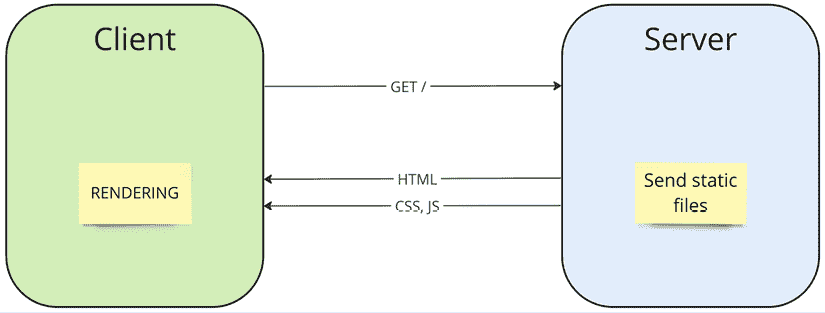
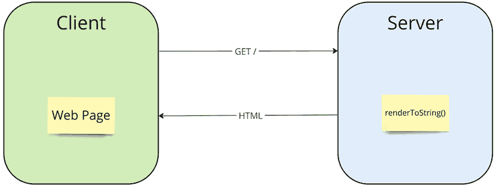
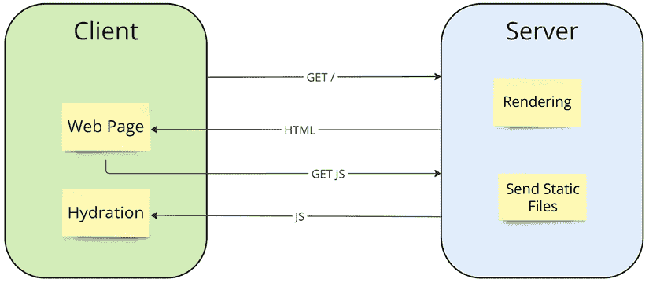
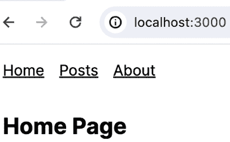
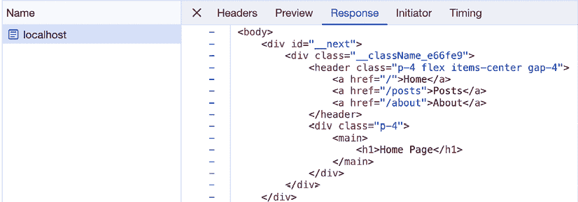
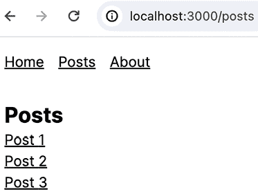
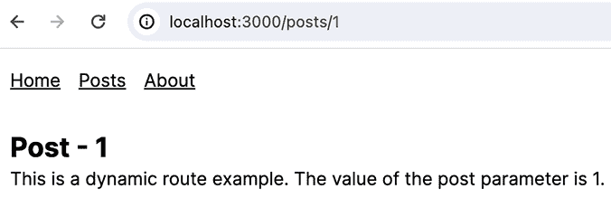

# 13

# 服务器端渲染

正如我们在*第一章*，*为什么选择 React*中讨论的那样，React 库在将我们的组件转换为各种目标格式方面非常灵活。你可能已经猜到了，其中一个目标格式是标准的 HTML 标记，以字符串形式呈现并在服务器上生成。在本章中，我们将深入探讨 React 中**服务器端渲染**（**SSR**）的工作原理以及它为用户和开发者提供的优势。你将了解为什么这种方法对你的应用程序来说很有价值，以及它是如何增强整体用户体验和性能的。

本章涵盖了以下主题：

+   在服务器上工作

+   使用 Next.js

+   React 服务器组件

# 技术要求

你可以在 GitHub 上找到本章的代码文件，链接为[`github.com/PacktPublishing/React-and-React-Native-5E/tree/main/Chapter13`](https://github.com/PacktPublishing/React-and-React-Native-5E/tree/main/Chapter13)。

# 在服务器上工作

网络技术已经走了很长的路，或者更准确地说，已经回到了起点。一切始于由服务器准备的静态网页。服务器是所有网站和应用逻辑的基础，因为它们完全负责其功能。然后，我们试图摆脱**SSR**，转向在浏览器中渲染页面，这导致了网页作为完整应用程序的开发取得了重大飞跃，现在可以与桌面应用程序相媲美。因此，浏览器成为了应用逻辑的核心，而服务器只是为应用程序提供数据。

目前，开发周期已经让我们回到了 SSR 和服务器组件，但现在我们有了服务器和客户端的统一逻辑和代码。为什么会出现这种情况，以及我们在技术演变过程中获得了哪些结论和经验，我们将在本节中尝试理解，同时我们还将了解我们的应用程序在服务器上执行的工作类型。

## 服务器端渲染

在传统的**单页应用程序**（**SPA**）方法中，我们完全依赖本地浏览器渲染。我们编写所有代码、样式和标记，专门针对浏览器，在应用程序构建过程中，我们得到静态的 HTML、CSS 和 JavaScript 文件，然后这些文件被加载到浏览器中。

在大多数情况下，初始的 HTML 文件是空的，没有任何内容。在这个文件中唯一重要的事情是连接的 JavaScript 文件，它将渲染我们所需的一切。

下面是一个示意图，说明了单页应用程序（SPA）应用是如何加载和渲染的：



图 13.1：单页应用程序（SPA）应用

这种方法引入了交互性，使得应用程序感觉和功能就像真正的桌面应用程序一样。不再需要每次更新内容、接收通知、新电子邮件或消息时都重新加载页面，因为整个应用程序逻辑直接在浏览器中。随着时间的推移，浏览器应用程序几乎完全取代了桌面应用程序。现在，我们可以在单个浏览器中写电子邮件、处理文档、观看电影以及做更多的事情。许多公司，而不是开发桌面应用程序，开始将他们的项目作为 Web 应用程序来创建。浏览器能够在任何架构和操作系统上运行的能力显著降低了开发成本。

同时，服务器也经历了变化，远离了页面模板、缓存等。后端开发者不再需要关注页面布局，可以更多地投入到更复杂的逻辑和架构中。

然而，单页应用程序（SPA）确实存在一些缺点，包括由于需要下载和处理脚本而导致的长时间初始加载时间。在这个过程中，用户会看到一个空白屏幕或加载指示器。此外，空白的初始 HTML 文件不适合搜索引擎优化，因为搜索引擎将其视为一个空白页面。

在创建在线商店等场景的背景下，普通的 React SPA 可能不适合，因为用户和搜索引擎需要立即看到页面内容。在 SPAs 出现之前，这类任务是由仅在服务器端工作的工具解决的，这些工具始终准备内容。在 React 中，解决这个问题更复杂，因为我们知道 React 在浏览器端工作。

解决方案的第一步显然是使用 React 在服务器上渲染页面内容。这不会是问题。自从其发布以来，React 就提供了用于此目的的`renderToString`函数，该函数可以在**Node.js 服务器**环境中调用。此函数返回一个 HTML 字符串，当发送到浏览器时，允许内容在用户的屏幕上渲染。

让我们看看使用`renderToString`函数的 SSR 会如何工作：



图 13.2：使用 renderToString 进行服务器渲染

在这个例子中，当在浏览器中请求页面时，服务器通过调用`renderToString`函数并将它传递给 React 组件树，输出 HTML。通过将这个 HTML 字符串作为对浏览器请求的响应发送，浏览器渲染结果。

然而，在这样的例子中，服务器上生成的并在浏览器中渲染的 HTML 缺乏交互性和客户端应用程序的功能。对于像按钮、导航以及我们在单页应用程序（SPAs）中习惯的所有功能，都需要 JavaScript。因此，在实现服务器渲染的交互式网站或应用程序的下一步中，不仅要传输 HTML，还要传输 JavaScript，这将提供我们需要的所有交互性。

为了解决这个问题，引入了**同构 JavaScript**的方法。以这种风格编写的代码可以先在服务器上执行，然后再在客户端执行。这允许你在服务器上准备初始渲染，并将准备好的 HTML 以及 JavaScript 包发送到客户端，然后允许浏览器提供交互性。这种方法加快了应用的初始加载速度，同时保持其功能，并允许搜索引擎在搜索结果中索引页面。

当用户打开一个页面时，他们立即看到服务器上执行的渲染结果，甚至在 JavaScript 加载之前。这种快速的初始响应显著提高了用户体验。页面和 JS 包加载后，浏览器对页面进行**激活**至关重要，正如我们从`renderToString`示例中所知，我们所有的元素都缺乏交互性。为此，脚本需要将所有必要的事件监听器附加到元素上。这个过程被称为**激活**，与从头开始的全页渲染相比，这是一个更轻更快的过程。

交互性的另一个重要特性是能够瞬间或平滑地导航到应用中的下一个页面，而无需重新加载浏览器页面。通过同构 JavaScript，这成为了可能，因为只需要加载下一个页面的 JavaScript 代码，然后应用就可以在本地渲染下一个页面。



图 13.3：SSR

上图以示意图的形式展示了 SSR 方法，其中应用是完全交互式的。最初，当请求一个页面时，服务器渲染内容并返回带有附加 JavaScript 包的 HTML。然后，浏览器加载 JS 文件并使页面上先前显示的所有内容生效。这种方法就是现在所知的 SSR。它已经在 React 开发者中得到了广泛应用，并在现代网络技术中找到了其位置。SSR 结合了页面内容的快速加载和服务器渲染的高性能，以及客户端应用的灵活性和交互性。

## 静态站点和增量静态生成

虽然 SSR 代表了一个重大的改进，但它并不是万能的解决方案，有其缺点，包括需要为每个请求从头生成一个页面。例如，没有动态内容的页面每次都必须在服务器上生成，这可能会使用户的显示延迟。此外，即使是简单的应用或网站，SSR 也需要一个 Node.js 服务器进行渲染，与 SPAs 不同，在 SPAs 中，只需要使用**内容分发网络**（**CDN**）将应用文件放置得更靠近用户，从而加快加载速度。

解决这些问题的方案在于**静态站点生成**（**SSG**）方法。SSG 的逻辑是在项目构建过程中在服务器上渲染所有静态页面。因此，我们得到许多准备就绪的 HTML 页面，可以在请求时立即交付。与 SSR 类似，在 SSG 中，JavaScript 包在页面加载后进行激活，使其具有交互性。最终，我们获得与单页应用（SPAs）相同但不是空 HTML 文件的经验：而是充满内容以便快速渲染。SSG 项目可以托管在快速 Web 服务器或 CDNs 上，这也允许进行额外的缓存，并加快此类应用程序的加载时间。

SSG 成为网站、博客和简单在线商店的理想解决方案，确保快速页面加载时间，不阻塞请求，支持 SEO，并且与 SPAs 具有相同的交互性。此外，现在可以将 SSR 用于动态数据和 SSG 用于静态页面结合起来。这种混合方法为实施更复杂的项目开辟了新的可能性，结合了两种方法的优势。它允许开发者通过选择最佳的渲染方法来优化性能和用户体验，具体取决于网站或应用的每一页的具体要求。

开发者和公司面临的一个问题是更新静态生成的页面。例如，传统上，添加新的博客文章或更新在线商店的库存需要完全重建项目，这可能既耗时又麻烦，尤其是在大型项目中。想象一下，一个有 1,000 篇文章的博客因为添加了一篇新文章而不得不完全重建和重新渲染。

这个问题通过一种称为**增量静态生成**（**ISR**）的方法得到解决。ISR 结合了 SSG 和 SSR 的原则以及缓存功能。为了理解这种方法，想象我们在构建阶段生成的所有 HTML 和 JS 文件只是一个**缓存**，代表项目构建的当前结果。与任何缓存一样，我们现在需要引入其重新验证的逻辑。只要我们的缓存有效，所有页面请求都像以前一样使用 SSG 方法工作。但是，当重新验证时间到期时，下一个页面请求将启动在 SSR 模式下在服务器上的重新渲染。生成的输出被发送到客户端，并同时用新的 HTML 文件替换旧的 HTML 文件，即更新缓存。然后应用程序继续在 SSG 模式下运行。

多亏了**增量静态生成**（**ISR**），现在可以实施包含数百万页面的大规模项目，这些页面不需要为小更新而不断重建。还可能完全跳过构建阶段的页面生成，因为所需的页面将在请求时进行渲染和保存。对于大型项目，这提供了项目构建速度的显著提升。

目前，结合 ISR 的 SSG 和传统的 SSR 是实施简单网站、博客以及复杂应用程序中最受欢迎的方法之一。然而，传统的 SPA 仍然是一个非常受欢迎的解决方案。但如果我们知道如何创建和组装 SPA，那么我们刚才讨论的所有其他内容又该如何呢？针对这个问题，重要的是要注意，你不需要手动开发所有这些方法。有几个基于 React 的框架提供了上述所有功能：

+   **Next.js**：这个框架以其灵活性和强大的功能而闻名。Next.js 最初是 SSR，但现在支持 SSR 和 SSG，包括 ISR 支持。最近，Next.js 一直在深入研究一个新的概念，即使用服务器组件实现应用程序，我们将在本章末尾讨论这一点。

+   **Gatsby**：Gatsby 的主要区别在于它对使用来自各种来源（如**CMS**或**Markdown**）的数据生成静态站点的强烈关注。尽管与 Next.js 的差异没有以前那么大，但它仍然是一个相当受欢迎的解决方案。

+   **Remix**：这是一个相对较新的框架，专注于与 Web 标准的更紧密集成和提升用户体验。Remix 提供了独特的数据处理和路由方法，我们可以按页面部分而不是按页面工作，通过仅更改和缓存需要动态内容的页面部分来实现嵌套导航。

所有这些框架共同提供了我们讨论过的方法的相似体验和实现。接下来，我们将探讨如何使用 Next.js 实现 SSR 和静态生成。

# 使用 Next.js

在熟悉了 SSR 的理论之后，让我们看看如何使用**Next.js**框架在实践上实现所有这些。

**Next.js** 是一个流行的基于 React 的框架，专门设计用来简化 SSR 和静态站点生成的过程。它提供了创建高性能 Web 应用程序的强大和灵活的功能。

Next.js 的功能：

+   **一个易于使用的 API，自动实现 SSR 和静态生成**：你只需要使用提供的方法和函数编写代码，框架将自动确定哪些页面应该在服务器端渲染，哪些可以在项目构建过程中渲染。

+   **基于文件的路由**：Next.js 使用基于项目文件夹和文件结构的简单直观的路由系统。这大大简化了应用程序中路由的创建和管理。

+   通过 API 路由实现创建全面的全栈应用程序的能力，这些 API 路由允许你实现服务器端 REST API 端点。

+   图像、字体和脚本的优化，提高项目的性能。

框架的另一个重要特性是与 React Core 团队紧密合作以实现新的 React 特性。因此，Next.js 目前支持两种应用程序实现类型，称为**Pages Router**和**App Router**。前者实现了我们之前讨论的主要功能，而后者是一种为与 React Server Components 一起工作而设计的新方法。我们将在本章的后面部分检查这种方法，但现在，让我们从 Pages Router 开始。

要开始使用 Next.js，你只需要执行一个命令，这个命令会为你设置一切：

```js
npx create-next-app@latest 
```

这个 CLI 命令会问你几个问题：

```js
✔ What is your project named? … using-nextjs
✔ Would you like to use TypeScript? … No / Yes
✔ Would you like to use ESLint? … No / Yes
✔ Would you like to use Tailwind CSS? … No / Yes
✔ Would you like to use `src/` directory? … No / Yes
✔ Would you like to use App Router? (recommended) … No / Yes
✔ Would you like to customize the default import alias (@/*)? … No / Yes
✔ What import alias would you like configured? … @/* No / Yes 
```

对于我们当前的示例，你应该对所有问题回答“是”，除了关于使用 App Router 的问题。此外，你可以访问提供的链接中我们将进一步讨论的现成示例：[`github.com/PacktPublishing/React-and-React-Native-5E/tree/main/Chapter13/using-nextjs`](https://github.com/PacktPublishing/React-and-React-Native-5E/tree/main/Chapter13/using-nextjs)。

在示例中，我们将创建一个包含多个页面的小型网站，每个页面使用不同的服务器渲染方法。在 Next.js 中，网站的每一页都应该放置在具有与 URL 路径对应的名称的单独文件中。在我们的项目示例中：

+   网站的主页，可通过根路径`domain.com/`访问，将位于`pages`文件夹中的`index.tsx`文件。为了理解以下示例，主页面文件的路径将是`pages/index.tsx`。

+   `/about`页面将位于`pages/about.tsx`文件中。

+   接下来，我们将在路径`pages/posts/index.tsx`创建一个`/posts`页面。

+   每个单独的帖子页面将位于一个使用路径`pages/posts/[post].tsx`的文件中。带有方括号名称的文件指示 Next.js 这将是一个动态页面，其中帖子变量作为参数。这意味着像`/posts/1`和`/posts/2`这样的页面将使用此文件作为页面组件。

+   这就是文件路由的工作方式。项目的主要目录是`pages`文件夹，我们可以嵌套文件，这些文件将用于根据文件和文件夹的结构和名称生成网站页面。

在`pages`文件夹中，还有两个服务文件，它们不是实际的页面，但被框架用于准备页面：

+   `_document.tsx`文件对于准备 HTML 标记是必要的。在这个文件中，我们可以访问`<html>`和`<body>`标签。这个文件始终在服务器上渲染。

+   `_app.tsx`文件用于初始化页面。你可以使用这个组件来连接脚本或用于在路由之间重复使用的页面的根布局。

让我们在`App`组件中给我们的网站添加一个标题。下面是`_app.tsx`文件的样子：

```js
const inter = Inter({ subsets: ["latin"] });
export default function App({ Component, pageProps }: AppProps) {
  return (
    <div className={inter.className}>
      <header className="p-4 flex items-center gap-4">
        <Link href="/">Home</Link>
        <Link href="/posts">Posts</Link>
        <Link href="/about">About</Link>
      </header>
      <div className="p-4">
        <Component {...pageProps} />
      </div>
    </div>
  );
} 
```

`App`组件返回的标记将被用于我们项目的每个页面，这意味着我们将在任何页面上看到这个标题。此外，我们还可以使用组件控制，其中将放置项目的其余动态部分。

现在，让我们看看我们项目的首页将是什么样子：



图 13.4：主页

在这个页面上，我们可以看到带有链接和标题的网站标题，这些内容是从`pages/index.tsx`文件中取出的：

```js
export default function Home() {
  return (
    <main>
      <h1>Home Page</h1>
    </main>
  );
} 
```

`pages/index.tsx`文件只导出一个包含标题的组件。重要的是要注意，这个页面没有其他函数或参数，将在项目构建过程中自动渲染。这意味着当我们访问这个页面时，我们会得到浏览器可以立即渲染的预制的 HTML。

通过访问`localhost:3000/`，我们可以确认我们收到了准备好的标记。为此，我们只需要打开浏览器开发者工具，检查这个请求返回的内容。



图 13.5：Chrome DevTools 中的主页响应

我们可以看到 Next.js 如何从`App`和`Home`组件中提取内容，并从它组装 HTML。所有这些都是在服务器端完成的，而不是在浏览器中。

接下来，让我们看看`/about`页面。在这个页面上，我们将实现 SSR，这意味着页面不是在构建过程中生成 HTML，而是在每次请求时渲染。为此，Next.js 提供了`getServerSideProps`函数，它在页面请求时运行，并返回组件用于渲染的 props。

对于我们的示例，我从第十一章*从服务器获取数据*中取了一些逻辑，其中我们从 GitHub 获取了用户数据。让我们看看`about.tsx`文件将是什么样子：

```js
export const getServerSideProps = (async () => {
  const res = await fetch("https://api.github.com/users/sakhnyuk");
  const user: GitHubUser = await res.json();
  return { props: { user } };
}) satisfies GetServerSideProps<{ user: GitHubUser }>; 
```

在`getServerSideProps`函数中，我们使用**Fetch API**请求用户数据。我们接收到的数据存储在`user`变量中，然后作为`props`对象返回。

重要的是要理解这个函数是 Node.js 环境的一部分，在那里我们可以使用服务器端 API。这意味着我们可以读取文件、访问数据库等。这为实施复杂的全栈项目提供了显著的能力。

接下来，在同一个`about.tsx`文件中，我们有`About`组件：

```js
export default function About({
  user,
}: InferGetServerSidePropsType<typeof getServerSideProps>) {
  return (
    <main>
      <Image src={user.avatar_url} alt={user.login} width="100" height="100" />
      <h2>{user.name || user.login}</h2>
      <p>{user.bio}</p>
      <p>Location: {user.location || "Not specified"}</p>
      <p>Company: {user.company || "Not specified"}</p>
      <p>Followers: {user.followers}</p>
      <p>Following: {user.following}</p>
      <p>Public Repos: {user.public_repos}</p>
    </main>
  );
} 
```

在`About`组件中，我们使用从`getServerSideProps`函数返回的`user`变量来创建页面的标记。仅通过这个一个函数，我们就实现了 SSR（服务器端渲染）。

接下来，让我们创建`/posts`和`/posts/[post]`页面，在这些页面中我们将实现 SSG（静态生成）和 ISR（增量静态化）。为此，Next.js 提供了两个函数：`getStaticProps`和`getStaticPaths`：

+   `getStaticProps`：这个函数与`getServerSideProps`具有类似的作用，但在项目构建过程中被调用。

+   `getStaticPaths`：这个函数用于动态页面，其中路径包含参数（如`[post].tsx`）。这个函数确定在构建过程中应该预生成哪些路径。

让我们看看 `Posts` 页面组件是如何实现的：

```js
export async function getStaticProps() {
  const posts = ["1", "2", "3"];
  return {
    props: {
      posts,
    },
  };
}
export default function Posts({ posts }: { posts: string[] }) {
  return (
    <main>
      <h1>Posts</h1>
      <ul>
        {posts.map((post) => (
          <li key={post}>
            <Link href={`/posts/${post}`}>Post {post}</Link>
          </li>
        ))}
      </ul>
    </main>
  );
} 
```

在这个例子中，`getStaticProps` 函数没有请求任何数据，只是简单地返回三个页面。然而，就像在 `getServerSideProps` 中一样，您可以使用 `getStaticProps` 来获取数据或与文件系统交互。然后，`Posts` 组件接收帖子作为 `props` 并使用它们来显示帖子链接列表。

下面是 **Posts** 页面的外观：



图 13.6：帖子页面

当打开任何帖子时，来自 `[post].tsx` 文件的组件将被加载。以下是它的外观：

```js
export const getStaticPaths = (async () => {
  return {
    paths: [
      {
        params: {
          post: "1",
        },
      },
      {
        params: {
          post: "2",
        },
      },
      {
        params: {
          post: "3",
        },
      },
    ],
    fallback: true,
  };
}) satisfies GetStaticPaths; 
```

此函数通知构建器在构建过程中只需要渲染三个页面。在此函数中，我们还可以进行网络请求。我们返回的 `"fallback"` 参数表明，理论上可能存在比我们返回的更多帖子页面。例如，如果我们访问 `/posts/4` 页面，它将以 SSR 模式渲染并保存为构建结果：

```js
Export const getStaticProps = (async (context) => {
  const content = `This is a dynamic route example. The value of the post parameter is ${context.params?.post}.`;
  return { props: { content }, revalidate: 3600 };
}) satisfies GetStaticProps<{
  content: string;
}>; 
```

在 `getStaticProps` 函数中，我们现在可以从 `context` 参数中读取页面参数。我们从函数中返回的 `revalidate` 值启用了 ISR，并告诉服务器在从上次构建后的 `3600` 秒后，在下一个请求中重建此页面。以下是 `Post` 页面的外观：

```js
export default function Post({
  content,
}: InferGetStaticPropsType<typeof getStaticProps>) {
  const router = useRouter();
  return (
    <main>
      <h1>Post – {router.query.post}</h1>
      <p>{content}</p>
    </main>
  );
} 
```

当我们通过链接打开任何帖子时，我们将看到以下内容：



图 13.7：帖子页面

在这个例子中，我们创建了一个网站，其中页面使用不同的服务器端渲染方法，这对于构建大型和复杂的项目非常有用且方便。然而，Next.js 的功能远不止于此。接下来，我们将探讨使用 App Router 构建网站的新方法。

# React 服务器组件

React 服务器组件代表了在 Next.js 中处理组件的新范式，它消除了同构 JavaScript。此类组件的代码仅在服务器上运行，并且可以作为结果进行缓存。在这个概念中，您可以直接从组件中读取服务器的文件系统或访问数据库。

在 Next.js 中，React 服务器组件允许您将组件分为两种类型：**服务器端**和**客户端**。服务器端组件在服务器上处理，并以静态 HTML 的形式发送到客户端，从而减少浏览器的负载。客户端组件仍然具有浏览器 JavaScript 的所有功能，但有一个要求：您需要在文件开头使用 `use client` 指令。

要在 Next.js 中使用服务器端组件，您需要创建一个新的项目。对于路由，您仍然使用文件，但现在，项目的主要文件夹是 `app` 文件夹，并且路由名称仅基于文件夹名称。在每一个路由（文件夹）内部，应该有框架指定的文件。以下是一些关键文件：

+   `page.tsx`: 此文件及其组件将用于显示页面。

+   `loading.tsx`：这个文件的组件将在`page.tsx`文件中的组件执行和加载时作为加载状态发送到客户端。

+   `layout.tsx`：这相当于`_app.tsx`文件，但在这个情况下，我们可以有多个布局，它们可以在嵌套路由中相互嵌套。

+   `route.tsx`：这个文件用于实现 API 端点。

现在，让我们使用基于**App Router**的新架构重构我们的带有帖子的网站。让我们从主页开始。由于我们的网站没有交互元素，我建议添加一个。让我们创建一个最简单的带有计数器的按钮并将其放置在主页上。下面是这个按钮的代码：

```js
"use client";
import React from "react";
export const Counter = () => {
  const [count, setCount] = React.useState(0);
  return <button onClick={() => setCount(count + 1)}>{count}</button>;
}; 
```

这个组件渲染了一个带有计数器的按钮。通过点击按钮，我们更新计数器。为了让这个组件与 App Router 一起工作，我们需要添加“`use client`"指令，这告诉 Next.js 在请求时将这个组件的代码包含在包中并发送到浏览器。

现在，让我们把这个按钮添加到主页上，下面是这个按钮的代码示例：

```js
export default function Home() {
  return (
    <main>
      <h1>Home Page</h1>
      <Counter />
    </main>
  );
} 
```

由于页面很简单，它与我们之前在 Pages Router 中看到的不同之处仅在于新按钮。尽管如此，默认情况下，App Router 将所有组件视为服务器端组件，在这种情况下，页面将在构建过程中渲染并保存为静态页面。

现在，让我们继续到“关于”页面。为了创建这个页面，我们需要创建一个名为`about`的文件夹，并在其中创建一个名为`page.tsx`的文件，我们将在这里放置组件。下面是这个文件的代码：

```js
export const dynamic = "force-dynamic";
export default async function About() {
  const res = await fetch("https://api.github.com/users/sakhnyuk");
  const user: GitHubUser = await res.json();
  return (
    <main>
      <Image src={user.avatar_url} alt={user.login} width="100" height="100" />
      <h2>{user.name || user.login}</h2>
      <p>{user.bio}</p>
      <p>Location: {user.location || "Not specified"}</p>
      <p>Company: {user.company || "Not specified"}</p>
      <p>Followers: {user.followers}</p>
      <p>Following: {user.following}</p>
      <p>Public Repos: {user.public_repos}</p>
    </main>
  );
} 
```

如您所见，与使用 Pages Router 相比，这个页面的代码变得更加简单。`About`组件已经变为异步的，这允许我们进行网络请求并等待结果。由于在我们的例子中，我们想要使用 SSR 并在每个请求时在服务器上渲染页面，我们需要从文件中导出带有`force-dynamic`值的“dynamic”变量。这个参数明确告诉 Next.js 我们希望为每个请求生成一个新的页面。否则，Next.js 会在项目构建期间生成页面并将结果保存为静态页面（通过使用 SSG）。

然而，如果 App Router 只是重复之前的功能而不提供任何新功能，那就很奇怪了。如果我们创建一个位于`about`文件夹中的`loading.tsx`文件，当打开“关于”页面时，它将立即使用来自`loading`文件的内容作为后备来提供页面，而不是等待服务器从 GitHub 请求信息并准备页面。一旦`page.tsx`文件中的组件准备好，服务器就会将其发送到客户端以替换`loading`组件。这提供了显著的性能优势并改善了用户体验。

现在，让我们继续到“帖子”页面。在它里面创建一个`posts`文件夹和一个`page.tsx`文件。下面是更新后的`/posts`页面的代码示例：

```js
export default async function Posts() {
  const posts = ["1", "2", "3"];
  return (
    <main>
      <h1>Posts</h1>
      <ul>
        {posts.map((post) => (
          <li key={post}>
            <Link href={`/posts/${post}`}>Post {post}</Link>
          </li>
        ))}
      </ul>
    </main>
  );
} 
```

再次强调，代码已经变得非常简洁。在渲染页面之前，我们需要获取的所有内容都可以直接在组件内部获取和创建。在我们的例子中，我们硬编码了三个将被渲染为链接的页面。

要实现一个“帖子”页面，在`posts`文件夹内，你需要创建一个名为 `[post]` 的文件夹，并在其中创建 `page.tsx` 文件。以下是代码，现在它更加简洁和易读：

```js
export async function generateStaticParams() {
  return [{ post: "1" }, { post: "2" }, { post: "3" }];
} 
```

我们不是使用 `getStaticPaths`，而是通过 `generateStaticParams` 函数向 Next.js 提供有关在项目构建期间生成静态页面的列表信息。然后，我们使用组件内部的 props 来显示页面内容：

```js
export const revalidate = 3600
export default async function Post({ params }: { params: { post: string } }) {
  return (
    <main>
      <h1>Post - {params.post}</h1>
      <p>
        This is a dynamic route example. The value of the post parameter is
        {params.post}.
      </p>
    </main>
  );
} 
```

内容基本保持不变。要激活 ISR，我们只需要从包含重新验证值的文件中导出 `revalidate` 变量。

在这个例子中，我们介绍了使用 React Server Components 和 Next.js 的 App Router 构建应用程序的基本方法。本章提供的 Page Router 和 App Router 示例并没有涵盖 Next.js 的所有可能性。为了更深入地了解这个框架，我建议查看其网站上的优秀文档：[`nextjs.org/docs`](https://nextjs.org/docs)。

# 摘要

在本章中，我们探讨了在 React 应用程序上下文中使用 SSR。我们讨论了如 SSR、SSG 和 ISR 等方法，学习了每种方法的优缺点。

然后，我们学习了如何在 Next.js 和 Pages Router 的应用中应用这些方法。最后，我们介绍了一种名为 React Server Components 的新技术，以及 Next.js 的更新版架构，称为 App Router。

在下一章中，我们将学习如何测试我们的组件和应用。
