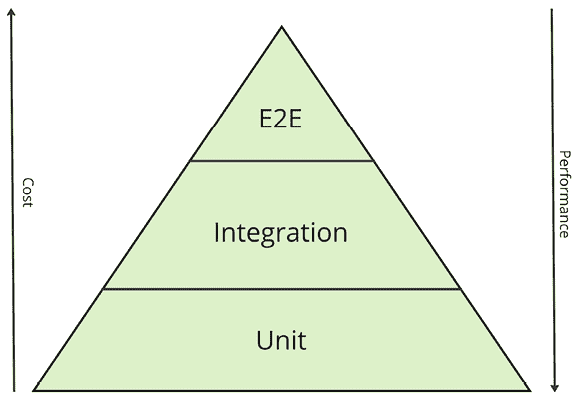

# 14

# React 的单元测试

尽管测试是软件开发过程的一个组成部分，但在现实中，开发人员和公司往往对它投入的关注出奇地少，尤其是对自动化测试。在本章中，我们将试图了解为什么关注测试很重要以及它带来的优势。我们还将探讨 ReactJS 中单元测试的基础，包括一般测试理论、工具和方法，以及测试 ReactJS 组件的特定方面。

在本章中，我们将涵盖以下主题：

+   一般测试

+   单元测试

+   测试 ReactJS

# 技术要求

您可以在 GitHub 上找到本章的代码文件，地址为 [`github.com/PacktPublishing/React-and-React-Native-5E/tree/main/Chapter14`](https://github.com/PacktPublishing/React-and-React-Native-5E/tree/main/Chapter14)。

# 一般测试

**软件测试**是一个旨在识别错误和验证产品功能的过程，以确保其质量。测试还允许开发人员和测试人员评估系统在各种条件下的行为，并确保新的更改没有导致回归，即它们没有破坏现有的功能。

测试过程包括一系列执行的动作，旨在检测和识别任何不符合要求或预期的方面。这样的动作的一个例子可能是**手动测试**，其中开发人员或测试人员手动检查应用。然而，这种方法耗时且几乎不能保证应用在操作上安全且没有关键错误。

为了确保在测试上节省时间的同时提高应用的可靠性，存在**自动化测试**。它们允许在无需人工干预的情况下验证应用的功能。

自动化测试通常由一系列预定义的测试和一个软件产品组成，通常被称为**运行器**，它启动这些测试并分析结果以确定每个测试的成功或失败。除此之外，自动化测试还可以用于检查性能、稳定性、安全性、可用性和兼容性，使您能够编写真正稳定、大型和成功的项目。这就是为什么避免测试从来都不是一个好主意；相反，了解它们并尝试在所有可能的项目中使用它们是值得的。

作为开发者，我们显然对自动化测试比对手动测试更感兴趣，因此本章将专注于这一点。但在那之前，让我们简要地看看测试的方法和存在的测试类型。

## 测试类型和方法

软件测试可以根据各种标准进行分类，包括测试的级别和它追求的目标。

通常，以下类型的测试被区分出来：

+   **单元测试**：对程序的单个模块或组件进行正确操作的测试。单元测试通常由开发者编写和执行，以检查特定的函数或方法。这类测试通常编写快速，执行也快，但它们并不测试最终应用程序的临界错误，因为被测试和稳定的组件在相互交互时可能存在问题。一个单元测试的例子是检查单个函数、React 组件或 Hook 的功能。

+   **集成测试**：这种测试是在各种模块或系统组件之间检查交互的测试。目标是检测集成组件之间的接口和交互中的缺陷。这类测试通常在服务器端进行，以确保所有系统协同工作，并且业务逻辑符合指定的要求。

    例如，一个集成测试可能是一个检查用户注册是否正常工作的测试，通过向 REST API 端点发出真实调用并检查返回的数据。这种测试对应用程序的实现和代码的依赖性较小，更多地是检查行为和业务逻辑。

+   **端到端（E2E）测试**：测试一个完整且集成的软件系统，以确保它符合指定的要求。端到端测试评估整个程序。这种测试是最可靠的，因为它完全抽象了应用程序的实现，并通过直接与应用程序交互来检查最终行为。在测试过程中，例如，在一个网络应用程序中，在一个特殊环境中启动一个真实浏览器，其中脚本执行与应用程序的真实操作，如点击按钮、填写表单和浏览页面。

尽管集成和端到端测试等测试类型在验证应用程序质量方面提供了更大的信心，但它们也伴随着复杂性和测试开发速度、执行速度等缺点，从而增加了成本。因此，被认为是一种良好的实践，在保持平衡的同时，优先考虑单元测试，因为它们更容易维护且运行速度更快。然后，所有主要业务流程和逻辑都通过集成测试进行验证，而端到端测试仅覆盖最关键的业务案例。这种方法可以用金字塔的形式表示：



图 14.1：测试金字塔

金字塔完美地描述了我们上面讨论的方法。其底部是**单元**测试，应该尽可能全面地覆盖应用程序的源代码。它具有最低的开发和维护成本，以及最高的测试执行性能。中间是**集成**测试，执行速度快，但开发成本较高。在最顶部，我们有**端到端**测试，执行时间最长，开发成本最高，但它们提供了对正在测试的产品质量的最高信心。

由于集成测试和端到端测试抽象了实现，以及应用程序中使用的编程语言或库，我们不会涉及这些类型的测试。因此，让我们更详细地关注单元测试。

# 单元测试

我们已经知道，单元测试是验证代码单个“**单元**”正确性的过程：即，**函数**和**方法**。单元测试的目标是确保每个单独的单元能够正确执行其任务，这反过来又增加了对整个应用程序可靠性的信心。

```js
export function sum(a: number, b: number): number {
  return a + b;
}
test('adds 1 + 2 to equal 3', () => {
  expect(sum(1, 2)).toBe(3);
}); 
```

上面的例子代表了添加两个值的最基本和最简单的函数测试。测试代码本身是一个函数，它调用一个特殊的方法，`expect`，该方法接受一个值，然后有一系列方法允许检查和比较结果。

看到这段代码，可能会产生的第一个问题是，真的有必要为这么简单的三行函数再写三条测试代码吗？为什么要测试这样的函数呢？我会明确地回答：是的。经常会出现这样的情况，一个函数可以被一个比它本身更大的测试覆盖，而这并没有什么问题。让我们来理解一下原因。

单元测试在测试**纯函数**时最有用和有效，这些函数没有副作用且不依赖于外部状态。相反，当被测试的函数由于外部因素或仅仅是因为函数的设计方式而改变其行为时，单元测试就毫无用处。例如，从服务器请求数据、从`localStorage`获取数据或依赖于全局变量的函数可能会对相同的输入返回不同的结果。由此我们可以得出结论，在需要通过测试实现代码覆盖率的应用程序开发方法中，你将自动努力编写**可测试的代码**，这意味着更加模块化、独立、清洁和可扩展的代码。这在大型项目中尤其明显。如果从一开始就编写了测试，这样的项目可以继续增长而无需进行大规模的重构或从头开始重写功能。此外，在带有测试的项目中，新来者更容易理解，因为测试可以作为模块的额外文档，通过阅读测试可以了解模块负责的内容以及它具有的行为。

对于编写单元测试来说，存在一系列的概念和方法。其中最主要和最受欢迎的是在代码开发之后的传统测试覆盖率。这种方法的优点是主要功能开发的速度快，因为测试通常是在之后处理的。因此，这种方法的问题在于延迟测试，这可能导致积累未经过测试的代码。后来，在编写测试时，通常需要修正主要代码，使其更加模块化和清洁，这需要额外的时间。

还有一种直接针对编写测试的方法，称为**测试驱动开发**（**TDD**）。这是一种软件开发方法，其中测试是在代码本身之前编写的。这种方法的优点是代码将立即被测试覆盖，这意味着代码将更加清洁和可靠。然而，这种方法可能不适合原型设计或需求经常变化的项目。

在 TDD（测试驱动开发）和开发后测试之间的选择取决于许多因素，包括团队文化、项目需求和开发者的偏好。重要的是要理解，这两种方法都不是万能的解决方案，不同的情境下可能会有不同的合理选择。最重要的是，要理解测试的重要性，并且应该避免那种完全不编写测试的工作方法，因为在大多数情况下，这样的代码注定要完全重写。

现在我们已经了解了单元测试及其重要性，让我们更深入地了解一下。在编写测试之前，我们应该设置我们将要运行测试的环境。

## 设置测试环境

编写和运行单元测试最流行的框架是 **Jest**。然而，我们将探讨其性能更优的替代方案，它与 **Vite** 完全兼容，被称为 **Vitest**。要在你的项目中安装 Vitest，你需要执行以下命令：

```js
npm install -D vitest 
```

对于基本操作，Vitest 不需要任何配置，因为它与 Vite 配置文件完全兼容。

接下来，为了开始，我们需要创建一个扩展名为 `*.test.ts` 的文件。文件的位置不是关键；最重要的是文件要在你的项目内部。通常，测试文件与被测试的函数文件相关联，并放置在同一目录下；例如，对于位于 `sum.ts` 文件中的 `sum` 函数，会创建一个名为 `sum.test.ts` 的测试文件，并将其放置在同一文件夹中。

要运行测试，我们需要在 `package.json` 文件中添加一个启动脚本：

```js
{
  "scripts": {
    "test": "vitest"
  }
} 
```

然后，要调用它，只需在终端中执行命令：

```js
npm run test 
```

这个命令将启动 Vitest 进程，它会扫描项目中的 `.test` 扩展名的文件，然后执行每个这样的文件中的所有测试。一旦所有测试完成，你将在终端窗口中看到结果，然后进程将等待测试文件的变化以重新运行它们。这特别设计为开发测试的模式，其中你不需要不断运行测试命令。对于一次性测试运行，你可以添加另一个命令，在测试完成后关闭进程：

```js
"test:run": "vitest run" 
```

`run` 参数正是用来告诉 Vitest 你只想运行一次测试。

## Vitest 特性

现在，让我们看看 Vitest 的主要特性和我们可以编写的测试类型。让我们从一个简单的函数 `squared` 开始：

```js
export const squared = (n: number) => n * n 
```

这个函数返回一个数字的平方。以下是这个函数的测试示例：

```js
import { expect, test } from 'vitest'
test('Squared', () => {
  expect(squared(2)).toBe(4)
  expect(squared(4)).toBe(16)
  expect(squared(25)).toBe(625)
}) 
```

`test` 和 `expect` 函数是 Vitest 包的一部分。`test` 函数将其名称作为第一个参数，将测试函数本身作为第二个参数。`expect` 方法作为检查被测试函数期望结果的基础。调用 `expect` 方法会创建一个包含大量方法的对象，允许以不同的方式检查执行结果。在我们的例子中，我们明确比较了执行 `squared` 函数的结果与期望值。

运行这个测试后，在终端窗口中，我们会看到以下信息：

```js
✓ test/basic.test.ts (1)
   ✓ Squared
 Test Files  1 passed (1)
      Tests  1 passed (1)
   Start at  17:39:33
   Duration  1.14s 
```

为了检查测试是否正确工作，让我们将期望值从 `4` 改变，看看我们会得到什么结果：

```js
FAIL  test/basic.test.ts > Squared
AssertionError: expected 4 to be 5 // Object.is equality
- Expected
+ Received
 ❯ eval test/basic.test.ts:13:22
     11| 
     12| test('Squared', () => {
     13|   expect(squared(2)).toBe(5);
       |                      ^
     14|   expect(squared(4)).toBe(16);
     15|   expect(squared(25)).toBe(625);
⎯⎯⎯⎯⎯⎯⎯⎯⎯⎯⎯⎯⎯⎯⎯⎯⎯⎯⎯⎯⎯⎯⎯⎯⎯⎯⎯⎯⎯⎯⎯⎯⎯⎯⎯⎯⎯⎯⎯⎯⎯⎯⎯⎯⎯⎯⎯⎯⎯⎯⎯⎯⎯⎯⎯⎯⎯⎯⎯⎯⎯⎯⎯⎯⎯⎯⎯⎯⎯⎯⎯⎯⎯⎯⎯⎯⎯⎯⎯⎯⎯⎯⎯⎯⎯⎯⎯⎯⎯⎯⎯⎯⎯⎯⎯⎯⎯⎯⎯⎯⎯⎯⎯⎯⎯[1/1]⎯
 Test Files  1 failed (1)
      Tests  1 failed (1)
   Start at  17:41:45
   Duration  1.15s 
```

当测试失败时，我们可以在结果中直接看到错误发生的位置，我们得到了什么结果，以及我们期望的是什么。

`toBe` 方法对于直接比较结果非常有用，但对于对象和数组呢？让我们考虑这个测试示例：

```js
test('objects', () => {
  const obj1 = { a: 1 };
  const obj2 = { a: 1 };
  expect(obj1).not.toBe(obj2);
  expect(obj1).toEqual(obj2);
}); 
```

在这个测试中，我们创建了两个相同的对象，但作为变量它们不会相等。为了期望相反的断言，我们使用额外的`.not.`键，这最终给出了两个变量不相等的陈述。如果我们仍然想检查对象具有相同的结构，有一个名为`toEqual`的方法，它可以递归地比较对象。这个方法也与数组类似工作。

对于数组，也有一些额外的方法可以用来检查元素是否存在，这通常非常有用：

```js
test('Array', () => {
  expect(['1', '2', '3']).toContain('3');
}); 
```

`toContain`方法也可以与字符串和 DOM 元素一起工作，检查`classList`中是否存在类。

单元测试的下一个重要部分是处理函数。Vitest 允许你创建**可模拟的假函数**，这让你可以检查这个函数是如何以及使用什么参数被调用的。让我们看看一个示例函数：

```js
const selector = (onSelect: (value: string) => void) => {
  onSelect('1');
  onSelect('2');
  onSelect('3');
}; 
```

这个函数只是为了演示，但我们很容易想象一些模块或选择器组件，它接受`onSelect`回调函数，该函数将在某些条件下被调用：在我们的例子中，连续调用三次。现在让我们看看我们如何使用可观察的函数进行测试：

```js
test('selector', () => {
  const onSelect = vi.fn();
  selector(onSelect);
  expect(onSelect).toBeCalledTimes(3);
  expect(onSelect).toHaveBeenLastCalledWith('3');
}); 
```

在测试中，我们使用`Vitest`包中的`vi`模块创建了`onSelect`函数。现在这个函数允许我们检查它被调用了多少次以及使用了什么参数。为此，我们使用了`toBeCalledTimes`和`toHaveBeenLastCalledWith`方法。还有一个名为`toHaveBeenCalledWith`的方法，它可以逐步检查在观察函数的每次调用中使用了哪些参数。在我们的例子中，有效的检查会是这三行：

```js
 expect(onSelect).toHaveBeenCalledWith('1');
  expect(onSelect).toHaveBeenCalledWith('2');
  expect(onSelect).toHaveBeenCalledWith('3'); 
```

Vitest 还允许你模拟一个真实函数，你需要使用`vi.spyOn`方法。然而，为了做到这一点，函数必须可以从一个对象中访问。让我们看看模拟一个真实函数的示例：

```js
test('spyOn', () => {
  const cart = {
    getProducts: () => 10,
  };
  const spy = vi.spyOn(cart, 'getProducts');
  expect(cart.getProducts()).toBe(10);
  expect(spy).toHaveBeenCalled();
  expect(spy).toHaveReturnedWith(10);
}); 
```

要为函数创建一个观察，我们调用`vi.spyOn`并传递对象作为第一个参数以及方法的名称作为第二个参数。然后，我们可以处理原始函数，稍后通过使用`spy`变量进行必要的检查。在上面的例子中，你还可以注意到新的方法`toHaveReturnedWith`，它允许你检查观察到的函数返回了什么。

## 模拟

接下来，我想提到单元测试中最具挑战性的部分之一：即处理具有副作用或依赖于外部数据或库的函数。之前，我提到在具有副作用的函数中进行测试是无用的，比如在底层调用某些东西。实际上，这并不完全正确。在某些情况下，编写一个纯函数可能是不可能的，但这并不意味着它不能被测试。为了测试这样的函数，我们可以使用**模拟**：即模拟外部行为或简单地替换某些模块或库的实现。

一个例子可能是一个依赖于计算机系统时间的函数，或者一个从服务器返回数据的函数。在这种情况下，我们可以应用一个特定的模拟指令来更改计算机的当前日期，以便为这个测试创建一个干净的结果，这样更容易进行测试。同样，也可以创建一个网络请求的模拟实现，它最终将在本地执行并返回预定的值。让我们在本节中讨论一些这些场景。

考虑到测试和使用**计时器**的例子。在测试环境中，我们可以避免等待计时器，并手动控制它们，以便更彻底地测试函数的行为。让我们看看一个例子：

```js
function executeInMinute(func: () => void) {
  setTimeout(func, 1000 * 60)
}
function executeEveryMinute(func: () => void) {
  setInterval(func, 1000 * 60)
}
const mock = vi.fn(() => console.log('done')) 
```

我们创建了`executeInMinute`和`executeEveryMinute`函数，分别用于延迟函数调用一分钟和每分钟循环执行。我们还创建了一个模拟函数，我们将随后对其进行监视。以下是测试将呈现的样子：

```js
describe('delayed execution', () => {
  beforeEach(() => {
    vi.useFakeTimers()
  })
  afterEach(() => {
    vi.restoreAllMocks()
  })
  it('should execute the function', () => {
    executeInMinute(mock)
    vi.runAllTimers()
    expect(mock).toHaveBeenCalledTimes(1)
  })
  it('should not execute the function', () => {
    executeInMinute(mock)
    vi.advanceTimersByTime(2)
    expect(mock).not.toHaveBeenCalled()
  })

  it('should execute every minute', () => {
    executeEveryMinute(mock)
    vi.advanceTimersToNextTimer()
    expect(mock).toHaveBeenCalledTimes(1)
    vi.advanceTimersToNextTimer()
    expect(mock).toHaveBeenCalledTimes(2)
  })
}) 
```

在这个例子中，有很多东西可以讨论，但让我们从我们没有使用`test`函数这个事实开始；相反，我们使用了`describe`和`it`。`describe`函数允许我们创建一个可以有自己的上下文和生命周期的测试套件。在测试套件中，我们可以设置初始参数或模拟某些行为，以便我们的测试用例可以在以后重用这个上下文和这些参数。在我们的例子中，我们使用了`beforeEach`和`afterEach`方法，这些方法在每个测试之前设置模拟计时器，然后在每个测试之后将一切恢复到原始状态。

`it`方法是对`test`方法的别名，在功能上与它没有区别。它只是为了让测试用例在结果中更易于阅读。例如，在结果中使用`describe`的`delayed execution`和`it`的`should execute the function`将看起来像这样：

```js
delayed execution > should execute the function 
```

然而，使用`test`，我们会看到的结果是：

```js
delayed execution > if should execute the function 
```

现在，让我们看看测试本身。第一个测试使用`executeInMinute`函数，实际上，它将在一分钟后才调用我们观察的方法，但在测试中，我们可以控制时间。通过使用`vi.runAllTimers()`，我们强制环境启动并跳过所有计时器，并立即检查结果。在下一个测试中，我们使用`vi.advanceTimersByTime(2)`将时间向前推进 2 毫秒，这已经允许我们确保原始函数不会被调用。

接下来，让我们讨论`executeEveryMinute`方法，它应该每分钟通过调用一个参数来启动一个计时器。在这种情况下，我们可以通过使用`advanceTimersToNextTimer`逐步遍历这个计时器的每个迭代，这样我们就可以在不等待真实时间的情况下精确控制时间。

在编写单元测试时，我们经常会遇到被测试的函数依赖于某些库甚至是一个包。

通常情况下，你会在 React Native 中遇到这种情况，如果某个库或某些方法使用了设备的原生功能。在这种情况下，为了编写测试，我们需要创建一个模拟版本的逻辑，该逻辑将在测试期间被调用。

让我们考虑一个简单的例子，我们假设我们有一个可以与设备交互并获取当前步数的包。为了获取步数，我们将使用`getSteps`函数：

```js
export function getSteps() {
  // SOME NATIVE LOGIC
  return 100;
} 
```

作为例子，这个函数本身将非常简单，它只会返回`100`的值。然而，在现实中，这样的函数将与智能手机 API 交互，这在测试范围内是无法调用的。接下来，让我们看看在编写测试时我们可以做什么：

```js
import { beforeAll, describe, expect, it, vi } from 'vitest';
import { getSteps } from './ios-health-kit';
describe('IOS Health Kit', () => {
  beforeAll(() => {
    vi.mock('./ios-health-kit', () => ({
      getSteps: vi.fn().mockImplementation(() => 2000),
    }));
  });
  it('should return steps', () => {
    expect(getSteps()).toBe(2000);
    expect(getSteps).toHaveBeenCalled();
  });
}); 
```

测试和整个例子相当简单，但它们将帮助你理解模拟是如何工作的。在文件的开头，我们导入我们的原始包`ios-health-kit`，然后使用`beforeAll`方法调用`vi.mock`，将包的路径作为第一个参数传递，并传递一个函数，该函数将返回原始文件的实现：即创建一个具有`getSteps`方法作为假函数的对象，其实施将返回`2000`的值。然后，在测试中，我们检查它确实返回了这个值。

在这个测试中，`vi.mock`函数创建了一个导入包的模拟，并用它替换了原始导入，这使得我们能够成功测试这个功能。

实际上，这个例子本质上并没有测试任何东西，只是展示了模拟的可能性。在实际项目中，你可能会需要测试一些函数，这些函数内部可能使用了需要模拟的重要库。为此，在真正的测试之前不断手动编写模拟可能不太方便；为了解决这个问题，你可以在全局级别模拟库和 API。为此，你需要创建一个配置文件或使用`vi.stubGlobal`。我不建议在没有理解和学习基础知识的情况下立即深入下去，所以让我们继续。

更多关于通过配置进行依赖项模拟的信息可以在[`vitest.dev/guide/mocking`](https://vitest.dev/guide/mocking)找到。

最后但同样重要的是，我想讨论的例子是模拟**网络请求**。你将要开发的任何应用程序几乎都会与需要从服务器获取的数据交互。对于单元测试来说，这可能是一个问题，因为测试单元时，重要的是要测试与外部环境抽象的单元。因此，在单元测试中，你应该始终模拟服务器请求并提供当前测试用例所需的数据。有一个名为`Mock Service Worker`的库用于模拟服务器请求。它允许你非常灵活地模拟 REST 和 GraphQL 请求。让我们看一个例子：

```js
import { http, HttpResponse } from 'msw';
import { setupServer } from 'msw/node';
import { describe, it, expect, beforeAll, afterEach, afterAll } from 'vitest';
const server = setupServer(
  http.get('https://api.github.com/users', () => {
    return HttpResponse.json({
      firstName: 'Mikhail',
      lastName: 'Sakhniuk',
    });
  })
);
describe('Mocked fetch', () => {
  beforeAll(() => server.listen());
  afterEach(() => server.resetHandlers());
  afterAll(() => server.close());
  it('should returns test data', async () => {
    const response = await fetch('https://api.github.com/users');
    expect(response.status).toBe(200);
    expect(response.statusText).toBe('OK');
    expect(await response.json()).toEqual({
      firstName: 'Mikhail',
      lastName: 'Sakhniuk',
    });
  });
}); 
```

在这个测试中，我们为路径 `https://api.github.com/users` 创建了一个模拟网络请求，它返回我们需要的数据。为此，我们使用了来自 `Mock Service Worker` 包的 `setupServer` 函数。接下来，在生命周期方法中，我们设置了模拟服务器以监听服务器请求，然后实现了一个标准测试，其中使用常规 Fetch API 请求数据。正如您在结果中可以看到的，我们可以检查状态码和返回的数据。

使用这种模拟方法，我们确实有广泛的测试不同逻辑的可能性，这取决于从服务器返回的数据、状态码、错误等。

在本节中，我们介绍了单元测试的基础：即它们是什么以及为什么我们需要编写它们。我们学习了如何设置测试环境并为我们的未来项目编写基本测试。接下来，让我们继续本章的主要主题，即测试 ReactJS 组件。

# 测试 ReactJS

我们已经知道单元测试涉及检查小的单元，通常是函数，这些函数执行一些逻辑并返回一个结果。为了理解 ReactJS 中的测试是如何工作的，概念和想法是相同的。我们知道在核心上，React 组件实际上是返回节点的 `createElement` 函数，这些节点作为 `render` 函数的结果，在浏览器屏幕上以 HTML 元素的形式显示。在单元测试中，我们没有浏览器，但这对我们来说不是问题，因为我们知道 React 的渲染目标几乎可以是任何东西。正如您可能已经猜到的，在 ReactJS 组件的单元测试中，我们将渲染组件到专门创建的 **JSDOM** 格式，它与 DOM 完全相同，**React Testing Library** 将帮助我们完成这项工作。

这个库包含一套工具，允许渲染组件、模拟事件，并以各种方式检查结果。

在我们开始之前，让我们设置测试 React 组件的环境。为此，在一个新的 Vite 项目中，执行以下命令：

```js
npm install --save-dev \
  @testing-library/react \
  @testing-library/jest-dom \
  vitest \
  jsdom 
```

此命令将安装我们需要的所有依赖项。接下来，我们需要创建一个 `tests/setup.ts` 文件，以集成 Vitest 和 React Testing Library：

```js
import { expect, afterEach } from 'vitest';
import { cleanup } from '@testing-library/react';
import * as matchers from "@testing-library/jest-dom/matchers";
expect.extend(matchers);
afterEach(() => {
  cleanup();
}); 
```

接下来，我们需要更新 `vite.config.ts` 配置文件，并在其中添加以下代码：

```js
 test: {
    globals: true,
    environment: "jsdom",
    setupFiles: "./tests/setup.ts",
  }, 
```

这些参数告诉 Vitest 在开始测试之前使用一个额外的环境和执行我们的设置脚本。

最后一步是配置 TypeScript 类型，我们将指定 `expect` 函数现在将具有与 React 组件一起工作的额外方法。为此，我们需要将以下代码添加到 `src/vite-env.d.ts` 文件中：

```js
import type { TestingLibraryMatchers } from "@testing-library/jest-dom/matchers";
declare global {
  namespace jest {
    interface Matchers<R = void>
      extends TestingLibraryMatchers<typeof expect.stringContaining, R> {}
  }
} 
```

这种结构为 React Testing Library 提供的所有新方法添加了类型。有了这个，环境设置就完成了，我们可以继续编写测试。

首先，让我们考虑一个最基础的检查，即组件是否已成功渲染并存在于文档中。为此，我们将创建一个返回带有`Hello world`文本的标题的`App`组件：

```js
export function App() {
  return <h1>Hello world</h1>;
} 
```

这样一个组件的测试看起来会是这样：

```js
import { render, screen } from "@testing-library/react";
import { describe, it, expect } from "vitest";
import { App } from "./App";
describe("App", () => {
  it("should be in document ", () => {
    render(<App />);
    expect(screen.getByText("Hello world")).toBeInTheDocument();
  });
}); 
```

测试本身的架构与之前相同，并且我们已经非常熟悉。需要注意的是，在测试开始时，我们使用来自`testing-library`的`render`函数来渲染组件，之后我们就可以执行检查。为了处理渲染结果，我们使用`screen`模块。它允许我们以各种方式与我们的虚拟 DOM 树进行交互，并搜索必要的元素。

我们将在稍后介绍主要的方法，但在本例中，我们使用了`getByText`方法，它查询包含文本“`Hello World`”的元素。为了检查该元素是否存在于文档中，我们使用`toBeInTheDocument`方法。这是运行测试时的输出：

```js
✓ src/App.test.tsx (1)
   ✓ App (1)
     ✓ should be in document
 Test Files  1 passed (1)
      Tests  1 passed (1)
   Start at  14:19:01
   Duration  198ms 
```

现在让我们考虑一个更复杂的例子，其中我们需要检查点击按钮会给组件添加一个新的`className`属性：

```js
export function ClassCheck() {
  const [clicked, setClicked] = useState(false);
  return (
    <button
      className={clicked ? "active" : ""}
      onClick={() => setClicked(true)}
    >
      Click me
    </button>
  );
} 
```

通过点击按钮，我们更新了状态，这更新了组件并给它添加了一个`active`类。现在，让我们为这个组件编写一个测试：

```js
describe("ClassCheck", () => {
  it("should have class active when button was clicked", () => {
    render(<ClassCheck />);
    const button = screen.getByRole("button");
    expect(button).not.toHaveClass("active");
    fireEvent.click(button);
    expect(button).toHaveClass("active");
  });
}); 
```

在这个测试中，你首先渲染`ClassCheck`组件，然后我们需要找到按钮元素，为此，我们使用带有`getByRole`方法的`screen`模块。这是下一个允许在文档中查询元素的方法，但重要的是要理解，如果文档中存在多个`button`元素，这个测试将产生错误。因此，在不同情况下应用合适的查询方法是必要的。现在按钮是可访问的，我们首先使用带有`not`前缀的`toHaveClass`方法确保组件不包含`active`类。

要点击这个按钮，React Testing Library 提供了`fireEvent`模块，它允许生成点击事件。点击按钮后，我们检查元素中是否存在所需的类。

使用`fireEvent`，可以生成所有可能的事件，如点击、拖动、播放、聚焦、失焦等。一个非常重要且需要测试的常见事件是输入元素中的`change`事件。让我们以`Input`组件为例来讨论这个问题：

```js
export function Input() {
  return <input type="text" data-testid="userName" />;
} 
```

这个组件简单地返回一个`input`元素，但在这个例子中，我还添加了一个特殊的属性，`data-testid`。这个属性用于在文档中更方便地搜索元素，因为它抽象了你对组件内容或元素角色的操作。在项目开发过程中，你经常会更新你的组件，而`data-testid`属性将帮助你更频繁地修复由于内容更新或更改（例如从`h1`到`h2`或`div`到更语义化的元素）而导致的损坏的测试。

现在让我们为这个组件编写一个测试：

```js
describe("Input", () => {
  it("should handle change event", () => {
    render(<Input />);
    const input = screen.getByTestId<HTMLInputElement>("userName");
    fireEvent.change(input, { target: { value: "Mikhail" } });
    expect(input.value).toBe("Mikhail");
  });
}); 
```

在这个测试中，像往常一样，我们渲染组件，然后使用更方便的方法 `getByTestId` 找到我们的元素。接下来，我们使用 `fireEvent.change` 方法在 `input` 上模拟 `change` 事件，该方法接受事件对象，并在测试结束时断言输入的值与预期的值相符。这样，我们现在可以测试具有各种逻辑的大型表单，例如格式化、验证等。

就像测试组件一样，React 测试库也可以测试 Hooks。这允许我们只测试自定义逻辑，并从组件中抽象出来。让我们编写一个小的 `useCounter` Hook，它将返回当前的 `counter` 值和 `increment` 及 `decrement` 函数：

```js
export function useCounter(initialValue: number = 0) {
  const [count, setCount] = useState(initialValue);
  const increment = () => setCount((c) => c + 1);
  const decrement = () => setCount((c) => c - 1);
  return { count, increment, decrement };
} 
```

为了测试这个 Hook，而不是使用 `render` 函数，React 测试库有一个 `renderHook` 方法。这就是这个 Hook 的测试看起来像：

```js
test("useCounter", () => {
  const { result } = renderHook(() => useCounter());
  expect(result.current.count).toBe(0);
  act(() => {
    result.current.increment();
  });
  expect(result.current.count).toBe(1);
  act(() => {
    result.current.decrement();
  });
  expect(result.current.count).toBe(0);
}); 
```

首先，我们渲染 Hook 本身并检查初始值是否为零。`renderHook` 方法返回 `result` 对象，通过它我们可以读取 Hook 返回的数据。接下来，我们需要测试 `increment` 和 `decrement` 方法。为此，仅仅调用它们是不够的，因为 Hooks 本质上不是纯函数，并且在其内部包含大量逻辑。因此，我们需要将这些方法包裹在 `act` 方法中调用，这将同步等待方法执行和 Hook 重新渲染。之后，我们可以以通常的方式断言期望。输出将看起来与我们在上一个示例中看到的一样，但现在让我们尝试更新测试以使结果失败。将第一个断言从 `.toBe(0)` 更新到 `.toBe(10)` 将看起来像：

```js
AssertionError: expected +0 to be 10 // Object.is equality
- Expected
+ Received
- 10
+ 0
 ❯ src/useCounter.test.ts:8:32
      6|   const { result } = renderHook(() => useCounter());
      7| 
      8|   expect(result.current.count).toBe(10);
       |                                ^
      9| 
     10|   act(() => {
⎯⎯⎯⎯⎯⎯⎯⎯⎯⎯⎯⎯⎯⎯⎯⎯⎯⎯⎯⎯⎯⎯⎯⎯⎯⎯⎯⎯⎯⎯⎯⎯⎯⎯⎯⎯⎯⎯⎯⎯⎯⎯⎯⎯⎯⎯⎯⎯⎯⎯⎯⎯⎯⎯⎯⎯⎯⎯⎯⎯⎯⎯⎯⎯⎯⎯⎯⎯⎯⎯⎯⎯⎯⎯⎯⎯⎯⎯⎯⎯⎯⎯⎯⎯⎯⎯⎯⎯⎯⎯⎯⎯⎯⎯⎯⎯⎯⎯⎯⎯⎯⎯⎯⎯⎯⎯⎯⎯⎯⎯⎯⎯⎯⎯⎯⎯⎯⎯⎯⎯⎯⎯⎯⎯⎯⎯⎯⎯⎯⎯⎯⎯⎯⎯⎯⎯⎯⎯⎯⎯⎯⎯⎯⎯⎯⎯⎯⎯⎯⎯⎯⎯⎯⎯⎯⎯⎯⎯⎯⎯⎯[1/1]⎯
 Test Files  1 failed (1)
      Tests  1 failed (1)
   Start at  14:24:06
   Duration  200ms 
```

你将注意到 Vitest 如何突出显示我们得到失败断言的代码部分。

在本节中，我们学习了如何使用 React 测试库测试组件和 Hooks。

# 摘要

在本章中，我们探讨了广泛的测试主题。我们熟悉了测试的概念、测试类型和不同的方法。然后，我们深入研究了单元测试，学习了它是什么，以及这种测试类型提供了哪些可能性。之后，我们学习了如何设置环境并为常规函数和逻辑编写测试。在本章结束时，我们检查了测试 React 组件和 Hooks 的基本功能。

通过本章，我们结束了与惊人的 ReactJS 库的相识，并将深入探索 React 生态系统，利用创建基于 React Native 的移动应用程序的惊人机会。

# 加入我们的 Discord 社群！

与其他用户和作者一起阅读这本书。提出问题，为其他读者提供解决方案，与作者聊天，等等。扫描二维码或访问链接加入社区。

`packt.link/ReactAndReactNative5e`


