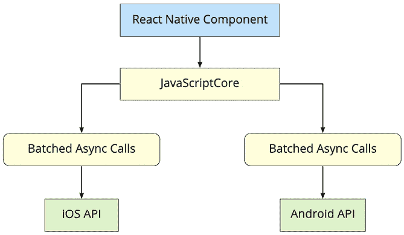

# 第十五章：为什么选择 React Native？

Meta（原名 Facebook）创建了 React Native 来构建其移动应用程序。它始于 2013 年夏天的 Facebook 内部黑客马拉松项目，并于 2015 年开源。这样做的原因源于 React 在 Web 上的成功。因此，如果 React 是 UI 开发的优秀工具，而你需要一个原生应用程序，那么为什么要与之抗争呢？只需让 React 与原生移动操作系统 UI 元素协同工作！因此，同年，Facebook 将 React 分为两个独立的库，`React`和`ReactDOM`，从那时起，React 必须只与接口工作，而不关心这些元素将在哪里渲染。

在本章中，你将了解使用 React Native 构建原生移动 Web 应用程序的动机。以下是本章我们将涵盖的主题：

+   什么是 React Native？

+   React 和 JSX 熟悉

+   移动浏览器体验

+   Android 和 iOS：不同却相同

+   移动 Web 应用程序的案例

# 技术要求

本章没有技术要求，因为它是对 React Native 的简要概念介绍。

# 什么是 React Native？

在本书的早期部分，我介绍了渲染目标的概念，即 React 组件渲染到的对象。对于 React 程序员来说，渲染目标是抽象的。例如，在 React 中，渲染目标可以是字符串，也可以是**文档对象模型**（**DOM**）。因此，你的组件永远不会直接与渲染目标接口，因为你永远无法确定渲染发生在哪里。

移动平台有**UI 小部件库**，开发者可以利用这些库为该平台构建应用程序。在 Android 上，开发者使用**Java**或**Kotlin**实现应用程序，而在 iOS 上，开发者实现**Objective-C**或**Swift**应用程序。如果你想有一个功能性的移动应用程序，你必须选择一个。然而，你需要学习这两种语言，因为只支持两个主要平台中的一个对于成功来说并不现实。

对于 React 开发者来说，这不是问题。你构建的相同 React 组件可以在任何地方工作，甚至在移动浏览器上！需要学习两种额外的编程语言来构建和发布移动应用程序既费时又费力。解决方案是引入一个新的 React 平台，该平台支持新的渲染目标：原生移动 UI 小部件。

React Native 使用一种技术，对底层移动操作系统进行异步调用，该系统调用原生小部件 API。有一个 JavaScript 引擎，React API 与 Web 上的 React 大致相同。区别在于目标；不是 DOM，而是异步 API 调用。这个概念在这里得到了可视化：

图 15.1：React Native 工作流程

这过于简化了底层发生的一切，但基本思想如下：

+   在 Web 上使用的相同 React 库也被**React Native**使用，并在**JavaScriptCore**上运行。

+   发送到原生平台 API 的消息是异步的，并且为了性能目的而批量处理。

+   React Native 附带适用于移动平台的组件，而不是 HTML 元素。

+   React Native 仅仅是通过 iOS 和 Android API 渲染组件的一种方式。它可以使用相同的概念替换为 tvOS、Android TV、Windows、macOS，甚至再次用于 Web。这可以通过 React Native 的**分支**和附加组件来实现。在本书的这一部分，我们将学习如何为 iOS 和 Android 编写移动应用。有关其他可能平台的更多信息，请在此处查看：[`reactnative.dev/docs/out-of-tree-platforms`](https://reactnative.dev/docs/out-of-tree-platforms)。

关于 React Native 的历史和机制，更多信息可以在[`engineering.fb.com/2015/03/26/android/react-native-bringing-modern-web-techniques-to-mobile/`](https://engineering.fb.com/2015/03/26/android/react-native-bringing-modern-web-techniques-to-mobile/)找到。

# React 和 JSX 都很熟悉

为 React 实现一个新的渲染目标并不简单。这本质上与在 iOS 和 Android 上运行的新 DOM 的发明是一样的。那么，为什么要费这么大的劲呢？

首先，对移动应用的需求量很大。原因是移动 Web 浏览器的用户体验不如原生应用。其次，JSX 是构建 UI 的绝佳工具。你不必学习新技术，使用你已知的工具就足够了。

最后一点对你来说最为相关。如果你正在阅读这本书，你很可能对使用 React 来开发 Web 应用和原生移动应用感兴趣。我无法用言语表达 React 在开发资源方面的价值。你不需要一个专门负责 Web UI 的团队、一个专门负责 iOS 的团队、一个专门负责 Android 的团队等等，只需要一个理解 React 的 UI 团队。

在接下来的部分，你将了解在移动 Web 浏览器上提供良好用户体验的挑战。

# 移动浏览器的体验

移动浏览器缺乏许多移动应用的功能。这是因为浏览器无法像 HTML 元素那样复制相同的原生平台小部件。你可以尝试这样做，但通常最好是直接使用原生小部件而不是尝试复制它。这部分的理由是这需要你更少的维护工作，部分是因为使用平台原生的小部件意味着它们与平台的其他部分保持一致。例如，如果你的应用程序中的日期选择器与用户在手机上交互的所有日期选择器都不同，这并不是一个好现象。熟悉度是关键，使用原生平台小部件使得熟悉度成为可能。

移动设备上的用户交互与你在 Web 上通常设计的交互在本质上是有区别的。例如，Web 应用假设存在鼠标，并且按钮上的点击事件只是一个阶段。然而，当用户用手指与屏幕交互时，事情变得更加复杂。移动平台有一个所谓的 **手势系统** 来处理这种情况。React Native 在处理这些类型的事情上比 Web 上的 React 更合适，因为这些事情在 Web 应用中你不必过多考虑。

随着移动平台的更新，你希望你的应用组件也保持更新。在 React Native 中这不是问题，因为应用使用的是平台实际组件。再次强调，一致性和熟悉性对于良好的用户体验至关重要。因此，当你的应用中的按钮看起来和表现方式与设备上其他应用中的按钮相同，你的应用就会感觉像是设备的一部分。

现在你已经了解了为什么为移动浏览器开发 UI 比较困难，是时候看看 React Native 如何弥合不同原生平台之间的差距了。

# Android 和 iOS：不同却相同

当我第一次听说 React Native 时，我自然而然地认为它将是一种跨平台解决方案，让你能够编写一个可以在任何设备上本地运行的单一 React 应用。然而，现实更加复杂。虽然 React Native 允许在平台之间共享大量代码，但重要的是要理解 iOS 和 Android 在许多基本层面上是不同的，它们的用户体验哲学也不同。

React Native 的目标是“一次学习，到处编写”而不是“一次编写，到处运行”。这意味着在某些情况下，你可能希望你的应用利用平台特定的控件来提供更好的用户体验。

话虽如此，React Native 生态系统已经取得了进步，使得跨平台开发更加无缝。

例如，**Expo** 现在支持 Web 开发，允许你使用 **React Native for Web** 在 Web 上运行你的应用。这意味着你可以使用单一代码库开发在 Android、iOS 和 Web 上运行的应用。此外，**Tamagui UI 套件** 对 Web 和移动平台都提供 100%的支持，这使得创建在多个平台上运行且不牺牲用户体验的应用变得更加容易。

鉴于这些发展，重要的是要认识到，虽然 React Native 可能不会提供一个完美的“一次编写，到处运行”的解决方案，但它已经在实现更高效的跨平台开发方面取得了长足的进步。有了像 Expo 和 Tamagui 这样的工具，开发者可以创建在不同平台上运行的应用，同时在必要时利用平台特定的功能。

在下一节中，我们将探讨移动 Web 应用在浏览器中运行可能更适合你的用户的情况。

# 移动 Web 应用的优势

并非你的每一位用户都愿意安装应用，尤其是如果你还没有高下载量和评分。Web 应用进入门槛要低得多：用户只需要一个浏览器。

尽管无法复制原生平台 UI 所能提供的一切，你仍然可以在移动 Web UI 中实现很棒的事情。也许拥有一个好的 Web UI 是提高你的移动应用下载量和评分的第一步。

理想情况下，你应该追求以下目标：

+   标准 Web（笔记本电脑/台式机浏览器）

+   移动 Web（手机/平板浏览器）

+   移动应用（手机/平板原生平台）

在这三个空间中投入相同数量的努力可能没有太多意义，因为你的用户可能更倾向于其中一个领域而不是另一个。例如，一旦你知道你的移动应用的需求比网络版本高，那么你就可以在那里分配更多的努力。

# 摘要

在本章中，你了解到 React Native 是 Facebook 为了重用 React 来创建原生移动应用的努力。React 和 JSX 擅长声明 UI 组件，鉴于现在对移动应用的需求巨大，使用你所知道的 Web 知识是有意义的。

对于移动应用的需求超过移动浏览器的原因是它们感觉更好。Web 应用缺乏像应用那样处理移动手势的能力，并且从外观和感觉的角度来看，它们通常不像移动体验的一部分。

React Native 在过去的几年里发展迅速，使开发者能够创建更高效的跨平台应用。虽然 iOS 和 Android 确实存在根本性的差异，但 React Native 在提供更无缝的开发体验方面取得了进展。然而，重要的是要记住，React Native 的目标是“一次学习，到处编写”而不是“一次编写，到处运行”。这意味着开发者仍然可以利用平台特定的功能来提供更好的用户体验。

现在你已经了解了 React Native 是什么以及它的优势，你将在下一章学习如何开始新的 React Native 项目。
