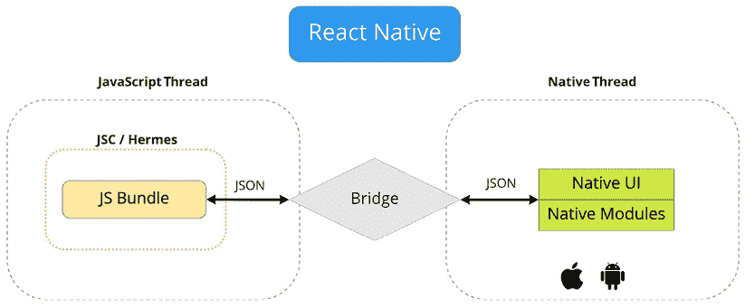

# 第十六章：React Native 内部机制

上一章简要介绍了 React Native 是什么以及用户在 React Native UI 和移动浏览器之间体验到的差异。

在本章中，我们将深入探讨 React Native，深入了解它在移动设备上的表现以及我们在开始使用此框架之前应该达到的目标。我们还将探讨我们可以执行哪些原生功能选项以及我们将面临哪些限制。

我们将涵盖以下主题：

+   探索 React Native 架构

+   解释 JavaScript 和本地模块

+   探索 React Native 组件和 API

# 探索 React Native 架构

在理解 React Native 的工作原理之前，让我们回顾一下关于 React 架构和网页与原生移动应用之间差异的历史观点。

## 过去网页和移动应用的状态

Meta 在 2013 年发布了 **React**，这是一个用于创建应用的单一工具，采用组件方法和 **虚拟 DOM**。它为我们提供了开发无需考虑浏览器进程（如解析 JS 代码、创建 DOM、处理层和渲染）的网页应用的机会。我们只需使用状态和属性创建界面，用于数据和 CSS 用于样式，从后端获取数据，保存在本地存储中等。

React 与浏览器一起，使我们能够在更短的时间内创建性能应用。当时，React 的架构看起来是这样的：


图 16.1：2013 年的 React 架构

由于快速开发和低门槛，新的声明式接口开发方法变得更加受欢迎。此外，如果你的后端是用 **Node.js** 构建的，你可以通过仅使用一种编程语言来享受整个项目的支持和开发的便利。

同时，移动应用需要更复杂的技术来创建应用。对于 Android 和 iOS 应用，公司应该管理三个不同团队，这些团队具有无与伦比的经验，以支持三个主要生态系统：

+   网页开发者应该了解 HTML、CSS、JS 和 React。

+   **Java** 或 **Kotlin** SDK 经验对于 Android 开发者来说是必需的。

+   iOS 开发者应该熟悉 **Objective-C** 或 **Swift** 和 **CocoaPods**。

开发应用的每一步，从原型设计到发布，都需要独特的技能。在跨平台解决方案出现之前，网页和移动应用开发看起来是这样的：


图 16.2：网页和移动应用的状态

即使是一家公司执行一个基本应用，也可能面临一些重大问题：

+   这些团队中的每一个都实现了相同的企业逻辑。

+   在团队之间共享代码没有替代方案。

+   在团队之间共享资源是不可能的（Android 开发者无法为 iOS 应用编写代码，反之亦然）。

由于这些重大问题，我们在测试资源方面也遇到了复杂性，因为存在更多可能产生错误的地方。开发速度也各不相同，因为移动应用程序需要更多时间来实现相同的功能。所有这些都累积成了对公司来说成本高昂的大问题。其中许多公司提出了如何编写单一代码库或重用现有代码库的想法，这些代码库可以在多个生态系统中使用。最简单的方法是使用浏览器将 Web 应用程序包装成移动应用，但正如我们在 *第十五章* 中探讨的，“为什么选择 React Native？” 这在处理触摸和手势方面存在局限性。

针对这些问题的回应，Meta 开始投资资源开发跨平台框架，并在 2015 年发布了 **React Native 库**。它还将 React 分为两个独立的库。现在，为了在浏览器中渲染我们的应用程序，我们应该使用 **ReactDOM** 库。

在 *图 16.3* 中，我们可以看到 **React** 如何与 **ReactDOM** 和 **React Native** 协同工作以渲染我们的应用程序：


图 16.3：ReactDOM 和 React Native 流程

现在，React 只负责管理组件树。这种方法封装了任何渲染 API，并隐藏了许多平台特定的方法。我们可以专注于开发界面，而无需猜测它们将如何被渲染。

正因如此，React 常常被宣称为一个渲染无关的库。此外，对于 Web 应用程序，我们使用 ReactDOM，它形成元素并将它们直接应用到浏览器 DOM 上。对于移动应用程序，React Native 直接在移动屏幕上渲染我们的界面。

但是，React Native 是如何替换整个浏览器 API，并允许我们编写熟悉的代码并在移动设备上运行的呢？

# React Native 当前架构

React Native 库允许您通过利用原生构建块使用 React 和 JS 创建原生应用程序。例如，`<Image/>` 组件代表了两个其他原生组件，Android 上的 `ImageView` 和 iOS 上的 `UIImageView`。这是可行的，因为 React Native 的架构包括两个专门的层，分别由 **JS** 和 **Native** 线程表示：


图 16.4：React Native 线程

在接下来的章节中，我们将探索每个线程，并了解它们如何进行通信，确保 JS 能够集成到原生代码中。

## JS 作为 React Native 的一部分

由于浏览器通过 **JS 引擎**（如 **V8**、**SpiderMonkey** 等）执行 JS，React Native 也包含一个 **JS 虚拟机**。在那里，我们的 JS 代码被执行，API 调用被处理，触摸事件被处理，以及许多其他过程发生。

最初，React Native 只支持苹果的 **JavaScriptCore** 虚拟机。在 iOS 设备上，这个虚拟机是内置的，并且可以直接使用。在 Android 设备的情况下，JavaScriptCore 是与 React Native 一起打包的。这增加了应用程序的大小。

因此，React Native 的**Hello World**应用程序在 Android 上大约消耗 3 到 4 MB。从 0.60 版本开始，React Native 开始使用新的**Hermes 虚拟机**，从 0.64 版本开始，也提供了对 iOS 的支持。

Hermes 虚拟机为两个平台带来了许多改进：

+   提高了应用的启动时间

+   减少了下载的应用大小

+   减少了内存使用

+   内置代理支持，使**react-native-firebase**和**mobx**可用

在面试中，了解新旧架构之间的比较优势是一个相对常见的话题。有关 Hermes 的更多信息，请参阅[`reactnative.dev/docs/hermes`](https://reactnative.dev/docs/hermes)。

在 React Native 中，与浏览器一样，JS 是在单个线程中实现的。这个线程负责执行 JS。我们编写的业务逻辑在这个线程上执行。这意味着我们所有的常见代码，如组件、状态、Hooks 和 REST API 调用，都将由应用中的 JS 部分处理。

我们整个应用程序结构都使用**Metro**打包器打包成一个文件。它还负责将 JSX 代码转换为 JS。如果我们想使用 TypeScript，**Babel**可以支持它。它直接可用，因此无需进行任何配置。在未来的章节中，我们将学习如何启动一个现成的项目。

### “原生”部分

这里是执行原生代码的地方。React Native 为每个平台实现了这部分的原生代码：Android 使用 Java，iOS 使用 Objective-C。**原生**层主要由与 Android 或 iOS SDK 通信的 Native 模块组成，旨在为我们提供使用统一 API 的原生功能。例如，如果我们想显示一个警告对话框，**原生**层为两个平台提供了一个统一的 API，我们可以通过 JS 线程使用单个 API 来调用它。

当你需要更新界面或调用原生函数时，这个线程会与 JS 线程交互。这部分有两个部分：

+   第一个是**React Native UI**，负责使用原生界面塑造工具。

+   第二个是**原生模块**，允许应用程序访问它们运行的平台上的特定功能。

### 线程间的通信

如前所述，每个 React Native 层为应用中的每个原生和 UI 功能实现了一个独特的 API。层与层之间的通信是通过桥接完成的。该模块是用 C++编写的，基于异步队列。当桥接从一方接收数据时，它会将其序列化，将其转换为**JSON**字符串，并通过队列传递。到达目的地后，数据会被反序列化。

如警报示例所示，本地部分接受来自 JS 的调用并显示对话框。实际上，当 JS 方法被调用时，它会向 **桥** 发送消息，并在接收到这条消息后，本地部分执行指令。本地消息也可以转发到 **JS** 层。例如，在点击按钮时，**Native** 层会向 **JS** 层发送一个带有 `onClick` 事件的 **Native** 消息。可以想象如下：



图 16.5：桥梁

JS 和该架构的本地部分，连同桥一起，类似于网络应用的客户端和服务器端，它们通过 REST APIs 进行通信。对我们来说，本地部分是用哪种语言或如何实现的不重要，因为 JS 中的代码是隔离的。我们只需通过桥发送消息并接收响应。这既是显著的优势，也是巨大的劣势：首先，它允许我们用一个代码库实现跨平台应用，但当我们应用中有大量业务逻辑时，它可能成为瓶颈。应用中的所有事件和动作都依赖于异步的 JSON-bridged 消息。每一方发送这些消息，期望在未来某个时刻收到这些消息的响应（这并不保证）。在这种数据交换方案中，存在过载通信通道的风险。

这里有一个常用的例子，用来说明这种通信方案如何导致应用出现性能问题。假设一个应用的用户在滚动一个巨大的列表。当在本地环境中发生 `onScroll` 事件时，信息会异步传递到 JS 环境中。但是本地机制不会等待 JS 应用部分完成工作并向其报告。因此，在显示内容之前，列表中空白的区域会出现延迟。我们可以通过使用分页的 `FlatList` 等特殊方法来避免许多常见问题。我们将在未来的章节中探讨主要技巧，但记住当前架构的限制是很重要的。

### 设计

我们已经理解了跨平台的概念，因此可以假设每个平台都有自己的技术来创建和设计界面。为了统一这些技术，React Native 使用 **CSS-in-JS** 语法来设计应用的外观。使用 **Flexbox**，组件能够指定其子组件的布局。这确保了在不同屏幕尺寸上保持一致的布局。这通常与网页上 CSS 的工作方式相似，只是名称采用驼峰式，例如 `backgroundColor` 而不是 `background-color`。

在 JS 中，它是一个具有样式属性的普通对象，在原生代码中，它是一个名为**Shadow**的独立线程。它使用 Meta 开发的**Yoga**引擎重新计算应用程序的布局，在这个线程中执行与形成应用程序界面相关的计算。这些计算的结果被发送到负责显示界面的原生 UI 线程。

当所有部分组合在一起时，React Native 的最终架构如图所示：


图 16.6：当前 React Native 架构

当前 React Native 的架构解决了主要的商业问题：可以在同一个团队内开发 Web 和移动应用程序，可以重用大量的业务逻辑代码，甚至没有移动开发经验的开发者也能轻松使用 React Native。

然而，当前的架构并不理想。在过去的几年里，React Native 团队一直在努力解决桥接瓶颈问题。新的架构旨在解决这个问题。

## React Native 的未来架构

React Native 引入了一系列重大改进，这将简化开发过程，使每个人都更加方便。

React Native 的重构将逐步弃用桥接，并用一个新的组件**JS 接口**（**JSI**）来替代它。此外，这个元素将启用新的`Fabric`组件和`TurboModules`。

使用 JSI 为改进打开了众多可能性。在*图 16.7*中，你可以看到 React Native 架构的主要更新：


图 16.7：新的 React Native 架构

第一个变化是 JS 包不再依赖于**JavaScriptCore**虚拟机。实际上，它现在是当前架构的一部分，因为现在我们可以在两个平台上启用新的**Hermes JS 引擎**。换句话说，JavaScriptCore 引擎现在可以轻松地被其他东西取代，很可能是性能更好的东西。

第二个改进是新的 React Native 架构的核心所在。JSI 允许 JS 直接调用原生方法和函数。这是通过`HostObject` C++对象实现的，它存储了对原生方法和属性的引用。在 JS 中，`HostObject`将原生方法和属性绑定到一个全局对象上，因此直接调用 JS 函数将调用 Java 或 Objective-C API。

新的 React Native 的另一个好处是能够完全控制名为`TurboModules`的原生模块。而不是一次性启动它们，应用程序将只在需要时使用它们。

**Fabric** 是新的 UI 管理器，在 *图 16.7* 中被称为 **Renderer**，它预计将通过消除对桥接器的需求来改变渲染层。现在可以直接在 C++ 中创建 **Shadow Tree**，这提高了速度并减少了渲染特定元素所需的步骤数量。

为了确保 React Native 和本地部分之间的通信顺畅，Meta 目前正在开发一个名为 **CodeGen** 的工具。它预计将自动化强类型本地代码和动态类型 JS 的兼容性，使它们同步。通过这次升级，将不再需要为两个线程重复代码，从而实现平滑的同步。

新的架构可能为开发能够实现旧 React Native 应用程序中不可用的新设计开辟了道路。事实上，我们现在可以利用 C++ 的力量。这意味着，使用 React Native，现在将能够创建比以前更多的应用程序种类。

在这里，我们讨论了解释 React Native 如何工作的基本原理。了解我们使用的工具的架构非常重要。拥有这些知识可以让你在规划和原型设计时避免错误，并最大限度地发挥未来应用程序的潜力。在下一节中，我们将简要探讨如何通过模块扩展 React Native。

# 解释 JS 和本地模块

React Native 并没有提供所有内置的本地功能。它只提供了在基本应用程序中需要的最常见功能。此外，Meta 团队最近将一些功能移动到其自己的模块中，以减少整体应用程序的大小。例如，用于在设备上存储数据的 `AsyncStorage` 被移动到单独的包中，如果你打算使用它，就必须安装。

然而，React Native 是一个可扩展的框架。我们可以添加自己的本地模块，并使用相同的桥接器或 JSI 暴露 JS API。在这本书中，我们的重点不会放在开发本地模块上，因为我们需要先有 Objective-C 或 Java 的经验。此外，这也不是必要的，因为 React 社区已经为所有情况创建了大量现成的模块。我们将在后续章节中学习如何安装本地包。

以下是一些最受欢迎的本地模块，没有它们，大多数项目都无法繁荣发展。

## React Navigation

**React Navigation** 是创建应用导航菜单和屏幕的最佳 React Native 导航库之一。它对于初学者来说是个好工具，因为它稳定、快速且错误较少。文档非常好，并为所有用例提供了示例。

我们将在第十九章“屏幕间导航”中了解更多关于 React Navigation 的内容。

## UI 组件库

UI 组件库使您能够快速组装应用布局，而无需花费时间设计和编码原子元素。此外，此类库通常更稳定、更一致，这导致 UI 和 UX 方面都取得更好的结果。

这些是一些最受欢迎的库（我们将在未来的章节中更详细地探讨其中的一些）：

+   **NativeBase**：这是一个组件库，使开发者能够构建通用设计系统。它建立在 React Native 之上，允许您为 Android、iOS 和网页开发应用。

+   **React Native Element**：这提供了一个用于在 React Native 中创建应用的综合性 UI 工具包。

+   **UI Kitten**：这是**Eva 设计系统**的 React Native 实现。该框架包含一组以类似方式设计的通用 UI 组件。

+   **React-native-paper**：这是一个为 React Native 提供的可定制和现成组件集合，遵循谷歌的 Material Design 指南。

+   **Tamagui**：这个 UI 工具包提供可以在移动设备和网页上运行的组件。

## 启动画面

将启动画面添加到您的移动应用中可能是一项繁琐的任务，因为这个屏幕应该在 JS 线程开始之前出现。**react-native-bootsplash**包允许您从命令行创建一个花哨的启动画面。如果您提供图像和背景颜色，该包将为您完成所有工作。

## 图标

图标是界面可视化的一个重要部分。每个平台都使用不同的方法来显示图标和其他矢量图形。React Native 为我们统一了这一点，但仅限于使用如**react-native-vector-icons**等额外库。使用**react-native-svg**，你还可以在 React Native 应用中渲染**可缩放矢量图形**（**SVG**）。

## 处理错误

通常，当我们开发 Web 应用时，我们能够轻松处理错误，因为它们不会超出 JS 的作用域。因此，在出现关键错误的情况下，我们拥有更多的控制和稳定性，因为如果应用根本无法启动，我们可以轻松地看到原因并在**DevTools**中打开日志。

由于 React Native 应用中除了环境的 JS 之外还有一个本地组件，这可能会在应用执行过程中引起错误，因此存在更多复杂性。因此，当发生错误时，我们的应用将立即关闭。这将使我们很难找出原因。

`react-native-exception-handler`提供了一种处理本地和 JS 错误并提供反馈的简单技术。要使其工作，您需要安装并链接该模块。然后，注册您的全局处理器以处理 JS 和本地异常，如下所示：

```js
import { setJSExceptionHandler, setNativeExceptionHandler }
  from "react-native-exception-handler";
setJSExceptionHandler((error, isFatal) => {
  // …
});
const exceptionhandler = (exceptionString) => {
  // your exception handler code here
};
setNativeExceptionHandler(
  exceptionhandler,
  forceAppQuit,
  executeDefaultHandler
); 
```

`setJSExceptionHandler`和`setNativeExceptionHandler`方法是一些自定义的全局错误处理器。如果发生崩溃，您可以显示错误消息，使用 Google Analytics 进行跟踪，或者使用自定义 API 通知开发团队。

## 推送通知

我们生活在一个通知至关重要的世界。我们每天打开数十个应用，仅仅是因为我们收到了它们的推送通知。

推送通知通常与一个网关提供商相关联，该提供商向用户的设备发送消息。以下库可以用于向你的应用添加推送通知：

+   `react-native-onesignal`：用于推送通知、电子邮件和短信的 OneSignal 提供商

+   `react-native-firebase`：Google Firebase

+   `@aws-amplify/pushnotification`：AWS Amplify

## 空中传输更新

作为正常应用更新的一个部分，当你构建新版本并将其上传到应用商店时，你可以通过空中传输（**OTA**）来替换 JS 包。由于包中只包含一个文件，更新它并不复杂。你可以随时更新你的应用，无需等待苹果或谷歌验证你的应用。这就是 React Native 的真正力量。

我们可以使用它是因为微软提供的 **CodePush** 服务。你可以在以下链接中找到更多关于 CodePush 的信息：[`docs.microsoft.com/en-gb/appcenter/distribution/codepush/`](https://docs.microsoft.com/en-gb/appcenter/distribution/codepush/)。

Expo 也支持使用 `expo-updates` 包进行空中传输更新。

## JS 库

对于 JS（非原生）模块，我们几乎没有限制，除了使用不受支持的 API 的库，如 DOM 和 Node.js。我们可以使用任何用 JS 编写的包：`Moment`、`Lodash`、`Axios`、`Redux`、`MobX` 和成千上万个其他包。

在本节中，我们仅仅触及了使用各种模块扩展应用的潜力。因为 React Native 有数千个库，逐一浏览它们几乎毫无意义。为了找到所需的包，有一个名为 **React Native 目录** 的项目收集并评估了大量包。该项目可以在以下地址找到：[`reactnative.directory/`](https://reactnative.directory/)。

我们现在知道了 React Native 的内部组织结构以及如何扩展其功能。我们的下一步是检查这个框架提供的 API 和组件。

# 探索 React Native 组件和 API

每个新章节将详细讨论主要模块和组件，但就目前而言，让我们先熟悉它们。React Native 框架中提供了一些核心组件，可以在应用中使用。

几乎所有应用都至少使用这些组件中的一个。这些是 React Native 应用的基本构建块：

+   `View`：任何应用的基石。这相当于 `<div>`，在移动设备上表示为 `UIView` 或 `android.view`。任何 `<View/>` 组件都可以嵌套在另一个 `<View/>` 组件内部，并且可以有零个或多个任何类型的子组件。

+   `Text`：这是一个用于显示文本的 React 组件。与 `View` 一样，`<Text/>` 支持嵌套、样式化和触摸处理。

+   `Image`：这显示来自各种来源的图像，如网络图像、静态资源、临时本地图像和相册中的图像。

+   `TextInput`：这允许用户使用键盘输入文本。属性可以配置各种功能，包括自动更正、自动大写、占位文本以及不同的键盘类型，如数字键盘。

+   `ScrollView`：这个组件是用于滚动多个视图和组件的通用容器。对于可滚动项，可以有垂直和水平滚动（通过调整水平属性）。如果你需要渲染大量或无限列表项，你应该使用`FlatList`。它支持一系列特殊属性，如**下拉刷新**和**滚动加载**（懒加载）。如果你的列表需要分成几个部分，那么也有专门用于此的特殊组件：`SectionList`。

+   `Button`：React Native 有高级组件可以用来创建自定义按钮和其他触摸组件，例如`TouchableHighlight`、`TouchableOpacity`和`TouchableWithoutFeedback`。

+   `Pressable`：这为 React Native 0.63 版本提供了更精确的触摸控制。基本上，它是一个用于检测触摸的包装器。它是一个定义良好的组件，可以用作`TouchableOpacity`和`Button`等触摸组件的替代品。

+   `Switch`：这个组件类似于复选框；然而，它以我们在移动设备上熟悉的开关形式呈现。

在接下来的章节中，我们将更深入地探讨常见组件及其属性，以及探索很少使用的组件。我们还将查看代码示例，展示如何组合组件以创建应用程序界面。

所有可用组件的详细信息可以在[`reactnative.dev/docs/components-and-apis`](https://reactnative.dev/docs/components-and-apis)找到。

# 摘要

在本章中，我们探讨了跨平台框架 React Native 的历史以及它为公司解决了哪些问题。有了它，公司可以使用单一的全能开发团队构建一个业务逻辑，并将其同时应用于所有平台，从而节省大量时间和金钱。详细考虑 React Native 在底层的工作原理使我们能够在规划阶段识别潜在问题并解决它们。

此外，我们开始检查 React Native 的基本组件，并且随着每一章的新内容，我们将更多地了解它们。

在下一章中，你将学习如何开始新的 React Native 项目。
