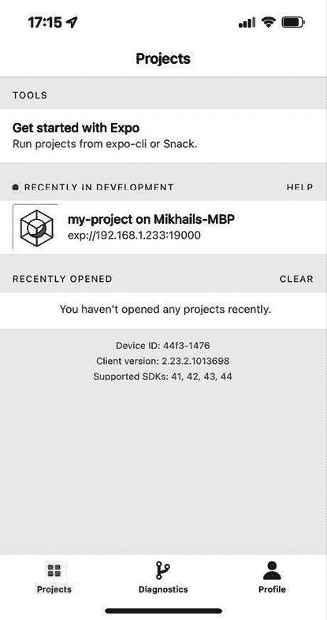
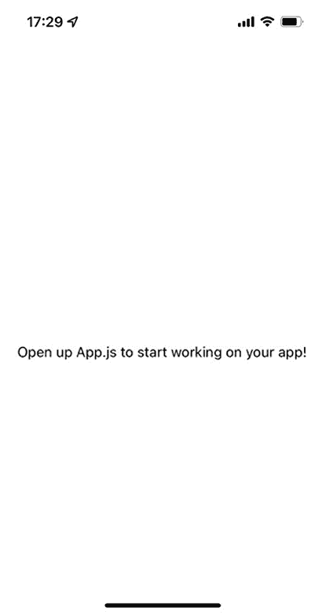
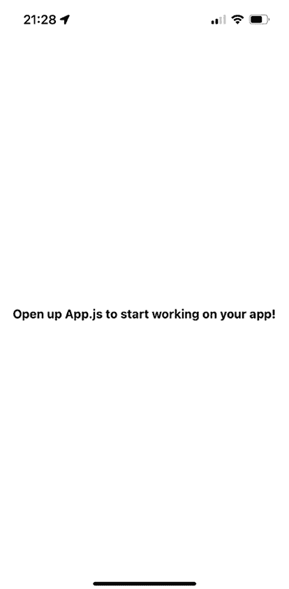
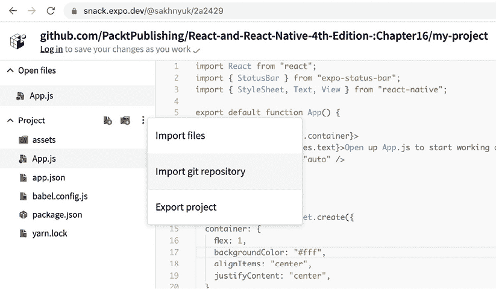
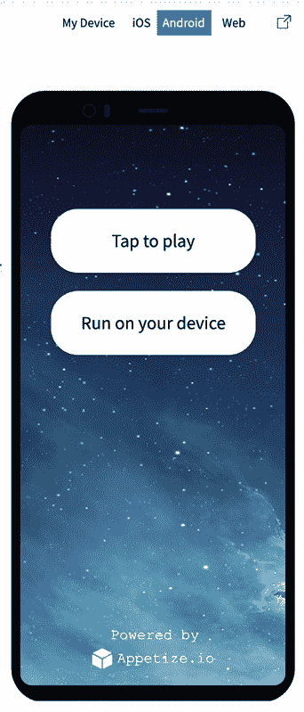
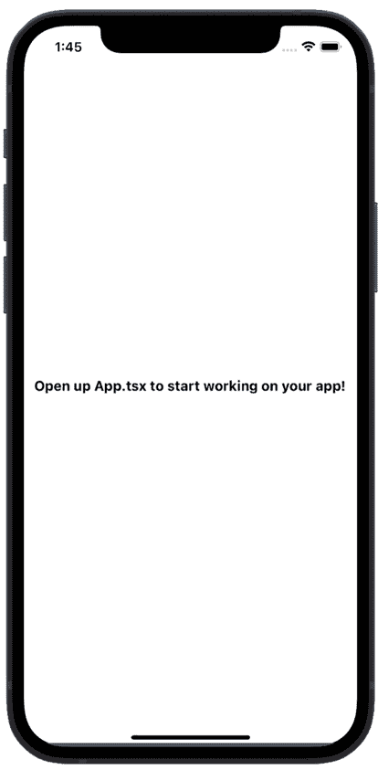
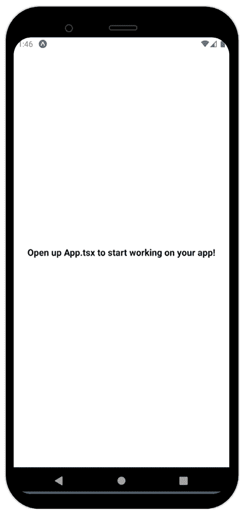

# 17

# 快速启动 React Native 项目

在本章中，你将开始使用 React Native。幸运的是，创建新项目时涉及的大量样板代码由命令行工具为你处理。我们将探讨 React Native 应用程序的不同 CLI 工具，并创建我们的第一个简单应用程序，你将能够直接在你的设备上上传并启动。

在本章中，我们将涵盖以下主题：

+   探索 React Native CLI 工具

+   安装和使用 Expo 命令行工具

+   在你的手机上查看你的应用程序

+   在 Expo Snack 上查看你的应用程序

# 技术要求

你可以在 GitHub 上找到本章的代码文件，地址为[`github.com/PacktPublishing/React-and-React-Native-5E/tree/main/Chapter17`](https://github.com/PacktPublishing/React-and-React-Native-5E/tree/main/Chapter17)。

# 探索 React Native CLI 工具

为了简化并加快开发过程，我们使用特殊的命令行工具，这些工具安装带有应用程序模板、依赖项和其他工具的空白项目，以启动、构建和测试。我们可以应用两种主要的 CLI 方法：

+   React Native CLI

+   Expo CLI

**React Native CLI**是由 Meta 创建的一个工具。该项目基于原始 CLI 工具，包括三个部分：原生 iOS 和 Android 项目以及一个 React Native JavaScript 应用程序。要开始，你需要**Xcode**或**Android Studio**。React Native CLI 的主要优势之一是其灵活性。你可以将任何具有原生模块的库连接起来，或者直接编写代码到原生部分。然而，所有这些都需要至少对移动开发有基本的了解。

**Expo CLI**是开发 React Native 应用程序的大生态系统的一部分。**Expo**是一个用于通用 React 应用程序的框架和平台。围绕 React Native 和原生平台构建，它允许你从单个 JavaScript/TypeScript 代码库中构建、部署、测试，并快速迭代 iOS、Android 和 Web 应用程序。

Expo 框架提供以下功能：

+   **Expo CLI**：一个命令行工具，可以创建空白项目，然后运行、构建和更新它们。

+   **Expo Go**：一个 Android 和 iOS 应用程序，可以直接在你的设备上运行你的项目（无需编译和签名原生应用程序）并与你的整个团队共享。

+   **Expo Snack**：一个在线游乐场，允许你在浏览器中开发 React Native 应用程序。

+   **Expo 应用程序服务**（**EAS**）：一套深度集成的云服务，用于 Expo 和 React Native 应用程序。应用程序可以使用 EAS 在云中编译、签名并上传到商店。

Expo 附带大量可用的功能。以前，它对项目施加了限制，因为它不支持自定义原生模块。然而，这种限制不再存在。现在，Expo 支持通过 Expo 开发构建添加自定义原生代码和自定义原生代码（Android/Xcode 项目）。要使用任何自定义原生代码，您可以创建开发构建和配置插件。

由于 Expo 对没有移动开发技能的新开发者很有用，我们将用它来设置我们的第一个 React Native 项目。

# 安装和使用 Expo 命令行工具

**Expo 命令行工具**负责创建项目所需的所有脚手架，以便运行基本的 React Native 应用程序。此外，Expo 还有一些其他工具，使在开发期间运行我们的应用程序变得简单直接。但首先，我们需要设置环境和项目：

1.  在我们能够使用 Expo 之前，我们需要安装**Node.js**、**Git**和**Watchman**。Watchman 是一个用于监视项目中文件的工具，当文件发生变化时，它可以触发诸如重建等操作。所有必需的工具和详细信息都可以在这里找到：[`docs.expo.dev/get-started/installation/#requirements`](https://docs.expo.dev/get-started/installation/#requirements)。

1.  一旦安装完成，我们可以通过运行以下命令来启动新项目：

    ```js
    npx create-expo-app --template 
    ```

1.  接下来，CLI 将询问您关于您未来项目的问题。您应该在终端看到类似以下内容：

    ```js
    ? Choose a template: ' - Use arrow-keys. Return to submit.
        Blank
    ❯   Blank (TypeScript) - blank app with TypeScript enabled
        Navigation (TypeScript)
        Blank (Bare) 
    ```

    我们将选择`Blank (TypeScript)`选项。

1.  接下来，进程将询问您项目名称：

    ```js
    ? What is your app named? ' my-project 
    ```

    让我们称它为`my-project`。

1.  安装所有依赖项后，Expo 将为您完成项目的创建：

    ```js
    ✅ Your project is ready! 
    ```

现在我们已经创建了一个空白 React Native 项目，您将学习如何在您的计算机上启动 Expo 开发服务器并在您的设备之一上查看应用程序。

# 在手机上查看您的应用

为了在开发期间在您的设备上查看 React Native 项目，我们需要启动 Expo 开发服务器：

1.  在命令行终端中，请确保您位于项目目录中：

    ```js
    cd path/to/my-project 
    ```

1.  一旦您进入`my-project`目录，您可以通过运行以下命令来启动开发服务器：

    ```js
    npm start 
    ```

1.  这将在终端显示有关开发服务器的一些信息：

    ```js
    ▄▄▄▄▄▄▄▄▄▄▄▄▄▄▄▄▄▄▄▄▄▄▄▄▄▄▄
    █ ▄▄▄▄▄ █▄▀▀▄▄▀▀█ █ ▄▄▄▄▄ █
    █ █   █ ███▄█  ▀▄▄█ █   █ █
    █ █▄▄▄█  █▄▀▄▀ ██▀█ █▄▄▄█ █
    █▄▄▄▄▄▄▄█ █ ▀▄▀ ▀ █▄▄▄▄▄▄▄█
    █ ▄▀▄▄▀▄▀█ ▄▄▀▀█▀ █▄█▀█▀▀▄█
    █ █▄█▀▀▄▀▄▀  ▀█▄▄ ▀███▄▀▀ █
    █ █▄ ▀█▄▄▀▄█▄▄▀▄ █ ▄▀▀█▀ ██
    █ ▄ ▀▄▀▄▄ █▄ ▄▄▀ ▄  ██▄▀  █
    █▄██▄▄█▄▄ █ ▀▀  █ ▄▄▄  ▄▀▄█
    █ ▄▄▄▄▄ ██ █▄▀  █ █▄█ ██▀▄█
    █ █   █ █ ███▄██▄ ▄  ▄ █  █
    █ █▄▄▄█ █▀█▄█▄█  ▄█▀▀▄█   █
    █▄▄▄▄▄▄▄█▄▄██▄▄▄▄▄▄█▄▄███▄█
    ' Metro waiting on exp://192.168.1.15:8081
    ' Scan the QR code above with Expo Go (Android) or the Camera app (iOS)
    ' Using Expo Go
    ' Press s │ switch to development build
    ' Press a │ open Android
    ' Press i │ open iOS simulator
    ' Press w │ open web
    	' Press j │ open debugger
    ' Press r │ reload app
    ' Press m │ toggle menu
    ' Press o │ open project code in your editor
    ' Press ? │ show all commands 
    ```

1.  为了在我们的设备上查看应用程序，我们需要安装**Expo Go**应用程序。您可以在 Android 设备的 Play Store 或 iOS 设备的 App Store 中找到它。一旦您安装了 Expo，您可以使用设备上的原生相机扫描二维码：

    图 17.1：Expo Go 应用

    如果您登录到 Expo Go 和 Expo CLI，您将能够运行应用程序而无需二维码。在*图 17.1*中，您可以查看为`my-project`打开的开发会话；如果您点击它，应用程序将运行。

1.  一旦扫描二维码或您在 Expo Go 上打开的会话被点击，您将在终端中注意到新的日志和新的连接设备：

    ```js
    iOS Bundling complete 205ms 
    ```

1.  现在您应该能看到应用程序正在运行：



图 17.2：在 Expo Go 中打开的应用程序

到目前为止，您已经准备好开始开发您的应用程序了。实际上，如果您同时想要使用多个物理设备，您可以重复此过程。这个 Expo 设置的最好部分是我们可以在计算机上对代码进行更新时，在物理设备上免费获得实时重新加载。现在让我们尝试一下，以确保一切按预期工作：

1.  让我们打开 `my-project` 文件夹内的 `App.ts` 文件。在那里，您将看到 `App` 组件：

    ```js
    export default function App() {
      return (
        <View style={styles.container}>
          <Text>Open up App.tsx to start working on your app!</Text>
          <StatusBar style="auto" />
        </View>
      );
    } 
    ```

1.  现在让我们进行一个小小的样式更改，使字体加粗：

    ```js
    export default function App() {
      return (
        <View style={styles.container}>
          <Text style={styles.text}>
            Open up App.tsx to start working on your app!
          </Text>
          <StatusBar style="auto" />
        </View>
      );
    }
    const styles = StyleSheet.create({
      container: {
        flex: 1,
        backgroundColor: "#fff",
        alignItems: "center",
        justifyContent: "center",
      },
    **text****: {** **fontWeight****:** **"bold"** **},**
    }); 
    ```

1.  我们添加了一个名为 `text` 的新样式，并将其应用于 `Text` 组件。如果您保存文件并返回到您的设备，您将立即看到更改被应用：



图 17.3：更新了文本样式的应用程序

现在您能够在物理设备上本地运行您的应用程序了，是时候看看如何使用 Expo Snack 服务在多种虚拟设备模拟器上运行您的 React Native 应用程序了。

# 在 Expo Snack 中查看您的应用程序

Expo 提供的 **Snack** 服务是您 React Native 代码的游乐场。它允许您像在本地计算机上一样组织您的 React Native 项目文件。如果您最终组合出值得构建的东西，您可以导出您的 Snack。您还可以创建一个 Expo 账户并保存您的 Snacks 以继续工作或与他人分享。您可以通过此链接找到 Expo Snack：[`snack.expo.dev/`](https://snack.expo.dev/).

我们可以在 Expo Snack 中从头开始创建一个 React Native 应用程序，它将被存储在 Expo 账户中，或者我们可以从 Git 仓库导入现有项目。导入仓库的好处是，当您向 Git 推送更改时，您的 Snack 也会更新。本章中我们工作的示例的 Git URL 看起来是这样的：[`github.com/PacktPublishing/React-and-React-Native-5E/tree/main/Chapter17/my-project`](https://github.com/PacktPublishing/React-and-React-Native-5E/tree/main/Chapter17/my-project).

我们可以在 Snack 项目菜单中点击 **导入 Git 仓库** 按钮，并粘贴此 URL：



图 17.4：将 Git 仓库导入到 Expo Snack

一旦导入仓库并保存 Snack，您将获得一个更新的 Snack URL，该 URL 反映了 Git 仓库的位置。例如，本章中的 Snack URL 看起来是这样的：`https://snack.expo.dev/@sakhnyuk/2a2429`.

如果您打开此 URL，Snack 界面将加载，您可以在运行之前对代码进行更改以进行测试。Snack 的主要优势是能够在虚拟化设备上轻松运行。运行应用程序在虚拟设备上的控件可以在 UI 的右侧找到，看起来像这样：



图 17.5：Expo Snack 模拟器

在手机图片上方的顶部控制栏用于选择要模拟的设备类型：**Android**、**iOS**或**Web**。**点击播放**按钮将启动选定的虚拟设备。**在您的设备上运行**按钮允许您使用二维码方法在 Expo Go 中运行应用。

这是我们的应用在虚拟 iOS 设备上的样子：



图 17.6：Expo Snack iOS 模拟器

然后这是我们的应用在虚拟安卓设备上的样子：



图 17.7：Expo Snack 安卓模拟器

此应用仅显示文本并对它应用一些样式，因此在不同的平台上看起来几乎相同。随着我们在这本书的 React Native 章节中继续前进，你会看到 Snack 这样的工具在比较两个平台以及理解它们之间的差异方面是多么有用。

# 摘要

在本章中，你学习了如何使用 Expo 命令行工具启动 React Native 项目。首先，你学习了如何安装 Expo 工具。然后，你学习了如何初始化一个新的 React Native 项目。接下来，你启动了 Expo 开发服务器，并了解了开发服务器 UI 的各个部分。

特别是，你学习了如何将开发服务器与任何你想要测试应用的设备上的 Expo 应用连接起来。Expo 还提供了 Snack 服务，它允许我们实验代码片段或整个 Git 仓库。你学习了如何导入仓库并在虚拟 iOS 和 Android 设备上运行它。

在下一章中，我们将探讨如何在我们的 React Native 应用中构建响应式布局。
