# 18

# 使用 Flexbox 构建响应式布局

在本章中，你将感受到在移动设备屏幕上布局组件的感觉。幸运的是，React Native 填充了许多你过去可能用于在 Web 应用程序中实现页面布局的 CSS 属性。

在你深入实现布局之前，你将简要了解 Flexbox 以及如何在 React Native 应用程序中使用 CSS 样式属性：它并不完全像你习惯的常规 CSS 样式表那样。然后，你将使用 Flexbox 实现几个 React Native 布局。

在本章中，我们将涵盖以下主题：

+   介绍 Flexbox

+   介绍 React Native 样式

+   使用 Styled Components 库

+   构建 Flexbox 布局

# 技术要求

你可以在 GitHub 上找到本章中存在的代码文件，链接为[`github.com/PacktPublishing/React-and-React-Native-5E/tree/main/Chapter18`](https://github.com/PacktPublishing/React-and-React-Native-5E/tree/main/Chapter18)。

# 介绍 Flexbox

在引入灵活的盒模型布局模型到 CSS 之前，用于构建布局的各种方法都是复杂的，并且容易出错。例如，我们使用了**浮动**，它最初是为了让文本围绕图像而设计的，用于表格布局。**Flexbox**通过抽象出许多你通常需要提供的属性来解决这一问题，以便使布局工作。

从本质上讲，Flexbox 模型可能对你来说听起来就是这样：一个灵活的盒模型。这就是 Flexbox 的美丽之处：它的简单性。你有一个充当容器的盒子，你在这个盒子内有**子元素**。容器和**子元素**在屏幕上的渲染方式都是灵活的，如下所示：

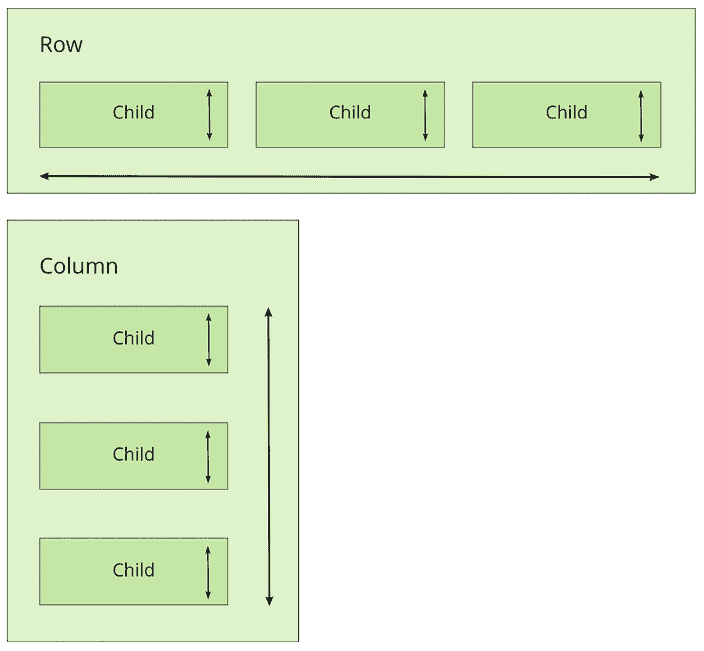

图 18.1：Flexbox 元素

Flexbox 容器有一个方向，要么是列（上/下），要么是行（左/右）。这实际上在我最初学习 Flexbox 时让我感到困惑；我的大脑拒绝相信行是从左到右并排组织的。行是堆叠在一起的！要记住的关键点是，它是盒子伸缩的方向，而不是盒子在屏幕上放置的方向。

对于 Flexbox 概念的更深入探讨，请参阅[`css-tricks.com/snippets/css/a-guide-to-Flexbox`](https://css-tricks.com/snippets/css/a-guide-to-Flexbox)。

现在我们已经从高层次上了解了 Flexbox 布局的基础知识，是时候学习 React Native 应用程序中的样式是如何工作的了。

# 介绍 React Native 样式

是时候实现你的第一个 React Native 应用程序了，超越由**Expo**生成的样板代码。我想确保你在开始下一节实现 Flexbox 布局之前，对使用 React Native 样式表感到舒适。

这就是 React Native 样式表的样子：

```js
import { Platform, StyleSheet, StatusBar } from "react-native";
export default StyleSheet.create({
  container: {
    flex: 1,
    justifyContent: "center",
    alignItems: "center",
    backgroundColor: "ghostwhite",
    ...Platform.select({
      ios: { paddingTop: 20 },
      android: { paddingTop: StatusBar.currentHeight },
    }),
  },
  box: {
    width: 100,
    height: 100,
    justifyContent: "center",
    alignItems: "center",
    backgroundColor: "lightgray",
  },
  boxText: {
    color: "darkslategray",
    fontWeight: "bold",
  },
}); 
```

这是一个 **JavaScript** 模块，而不是 CSS 模块。如果你想声明 React Native 样式，你需要使用纯对象。然后，你调用 `StyleSheet.create()` 并从样式模块导出它。请注意，样式名称与 web CSS 非常相似，只是它们是驼峰式命名的；例如，`justifyContent` 而不是 `justify-content`。

如你所见，这个样式表有三个样式：`container`、`box` 和 `boxText`。在 `container` 样式中，有一个对 `Platform.select()` 的调用：

```js
...Platform.select({
ios: { paddingTop: 20 },
android: { paddingTop: StatusBar.currentHeight }
}) 
```

这个函数将根据移动设备的平台返回不同的样式。在这里，你正在处理顶级 `container` 视图的顶部填充。你可能会在大多数应用中使用这段代码来确保你的 React 组件不会渲染在设备的状态栏下方。根据平台的不同，填充需要不同的值。如果是 iOS，`paddingTop` 是 `20`。如果是 Android，`paddingTop` 将是 `StatusBar.currentHeight` 的值。

之前的 `Platform.select()` 代码是一个需要实现平台差异解决方案的例子。例如，如果 `StatusBar.currentHeight` 在 iOS 和 Android 上都可用，你就不需要调用 `Platform.select()`。

让我们看看这些样式是如何导入并应用到 React Native 组件中的：

```js
import React from "react";
import { Text, View } from "react-native";
import styles from "./styles";
export default function App() {
  return (
    <View style={styles.container}>
      <View style={styles.box}>
        <Text style={styles.boxText}>I'm in a box</Text>
      </View>
    </View>
  );
} 
```

样式是通过 `style` 属性分配给每个组件的。你正在尝试渲染一个在屏幕中间带有文本的盒子。让我们确保它看起来像我们预期的那样。

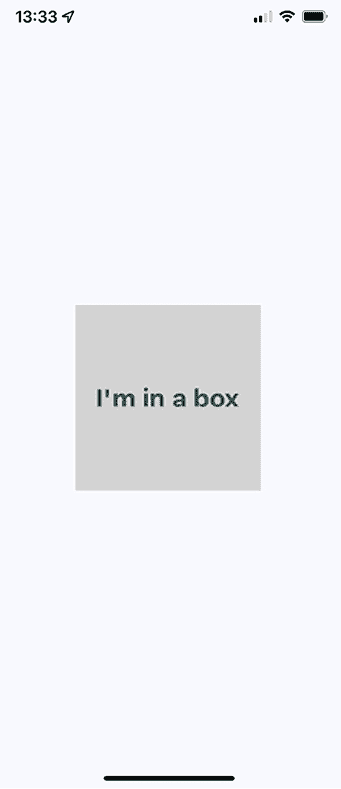

图 18.2：屏幕中间的盒子

我们已经找到了如何使用内置模块应用样式的办法，但定义样式的方法不止一种。我们还有在 React Native 中编写 CSS 的选项。让我们快速了解一下。

# 使用 Styled Components 库

**Styled Components** 是一个 CSS-in-JS 库，它使用纯 CSS 来设置 React Native 组件的样式。使用这种方法，你不需要通过对象定义样式类并提供样式属性。CSS 本身是通过 `styled-components` 提供的标签模板字面量来确定的。

要安装 `styled-components`，在你的项目中运行以下命令：

```js
npm install --save styled-components 
```

让我们尝试重写 *介绍 React Native 样式* 部分的组件。这是我们的 `Box` 组件的样子：

```js
import styled from "styled-components/native";
const Box = styled.View'
  width: 100px;
  height: 100px;
  justify-content: center;
  align-items: center;
  background-color: lightgray;
';
const BoxText = styled.Text'
  color: darkslategray;
  font-weight: bold;
'; 
```

在这个例子中，我们有两个组件，`Box` 和 `BoxText`。现在我们可以像平常一样使用它们，但不需要任何其他额外的样式属性：

```js
const App = () => {
  return (
    <Box>
      <BoxText>I'm in a box</BoxText>
    </Box>
  );
}; 
```

在接下来的章节中，我将使用 `StyleSheet` 对象，但为了避免性能问题，我会避免使用 `styled-components`。如果你想了解更多关于 `styled-components` 的信息，你可以在这里阅读更多：[`styled-components.com/`](https://styled-components.com/)。

完美！现在你已经了解了如何在 React Native 元素上设置样式，让我们使用 Flexbox 开始创建一些屏幕布局。

# 构建 Flexbox 布局

在本节中，你将了解你可以在你的 React Native 应用程序中使用的一些潜在布局。我不想强调一个布局比另一个布局更好。相反，我会向你展示 Flexbox 布局模型在移动屏幕上的强大之处，这样你就可以设计最适合你应用程序的布局。

## 简单的三列布局

首先，让我们实现一个简单的布局，包含三个在列方向（从上到下）上伸缩的部分。我们首先看看我们想要达到的结果。

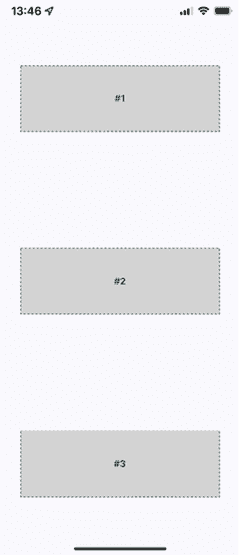

图 18.3：简单三列布局

在这个例子中，想法是这样的：你给三个屏幕部分添加样式和标签，使它们突出。换句话说，在真实的应用程序中，这些组件可能不会有任何样式，因为它们是用来在屏幕上排列其他组件的。

现在，让我们看看创建这个屏幕布局所使用的组件：

```js
import React from "react";
import { Text, View } from "react-native";
import styles from "./styles";
export default function App() {
  return (
    <View style={styles.container}>
      <View style={styles.box}>
        <Text style={styles.boxText}>#1</Text>
      </View>
      <View style={styles.box}>
        <Text style={styles.boxText}>#2</Text>
      </View>
      <View style={styles.box}>
        <Text style={styles.boxText}>#3</Text>
      </View>
    </View>
  );
} 
```

容器视图（最外层的`<View>`组件）是列，子视图是行。`<Text>`组件用于标记每一行。从 HTML 元素的角度来看，`<View>`类似于`<div>`元素，而`<Text>`类似于`<p>`元素。

也许这个例子可以被称为三行布局，因为它有三行。但与此同时，这三个布局部分正在它们所在的列方向上伸缩。使用对你最有概念意义的命名约定。

现在，让我们看看创建这个布局所使用的样式：

```js
import { Platform, StyleSheet, StatusBar } from "react-native";
export default StyleSheet.create({
  container: {
    flex: 1,
    flexDirection: "column",
    alignItems: "center",
    justifyContent: "space-around",
    backgroundColor: "ghostwhite",
    ...Platform.select({
      ios: { paddingTop: 20 },
      android: { paddingTop: StatusBar.currentHeight }
    })
  },
  box: {
    width: 300,
    height: 100,
    justifyContent: "center",
    alignItems: "center",
    backgroundColor: "lightgray",
    borderWidth: 1,
    borderStyle: "dashed",
    borderColor: "darkslategray"
  },
  boxText: {
    color: "darkslategray",
    fontWeight: "bold"
  }
}); 
```

`container`的`flex`和`flexDirection`属性使得行的布局可以从上到下流动。`alignItems`和`justifyContent`属性分别将子元素对齐到容器的中心，并在它们周围添加空间。

让我们看看当您将设备从纵向旋转到横向时，这个布局看起来如何：

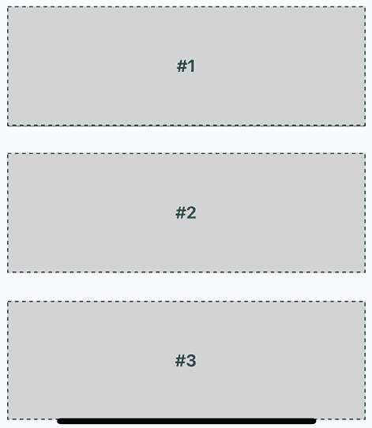

图 18.4：横幅方向

Flexbox 自动为你解决了布局问题。然而，你可以稍微改进一下。例如，横幅方向现在左右两侧有很多浪费的空间。你可以为你要渲染的盒子创建自己的抽象。在下一节中，我们将改进这个布局。

## 改进的三列布局

有几件事情我认为你可以从上一个例子中改进。让我们调整样式，使得 Flexbox 的子元素可以拉伸以利用可用空间。你还记得在最后一个例子中，当您将设备从纵向旋转到横向时吗？有很多浪费的空间。如果组件能自动调整自己会很好。下面是新样式模块的样子：

```js
import { Platform, StyleSheet, StatusBar } from "react-native";
export default StyleSheet.create({
  container: {
    flex: 1,
    flexDirection: "column",
    backgroundColor: "ghostwhite",
    justifyContent: "space-around",
    ...Platform.select({
      ios: { paddingTop: 20 },
      android: { paddingTop: StatusBar.currentHeight },
    }),
  },
  box: {
    height: 100,
    justifyContent: "center",
    alignSelf: "stretch",
    alignItems: "center",
    backgroundColor: "lightgray",
    borderWidth: 1,
    borderStyle: "dashed",
    borderColor: "darkslategray",
  },
  boxText: {
    color: "darkslategray",
    fontWeight: "bold",
  },
}); 
```

关键的改变在于 `alignSelf` 属性。这告诉具有 `box` 样式的元素根据其容器的 `flexDirection` 改变其 `width` 或 `height`（取决于容器的 `flexDirection`），以填充空间。此外，`box` 样式不再定义 `width` 属性，因为这将现在实时计算。

下面是在纵向模式下的部分外观：

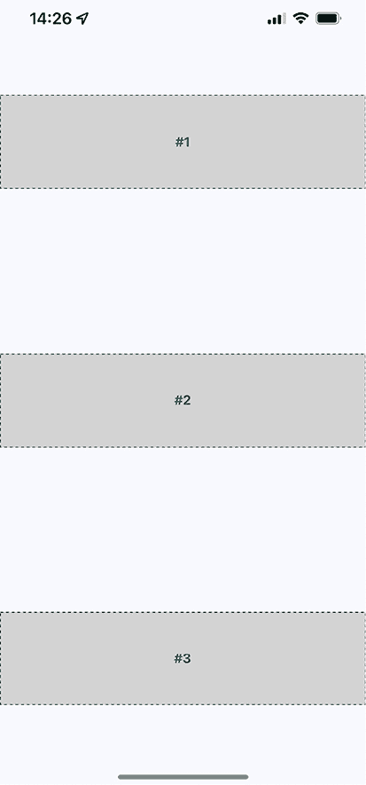

图 18.5：纵向布局中的改进三列布局

现在，每个部分都占据了屏幕的全宽，这正是你想要的。实际上，浪费空间的问题在横向布局中更为普遍，所以让我们旋转设备，看看这些部分现在会发生什么。

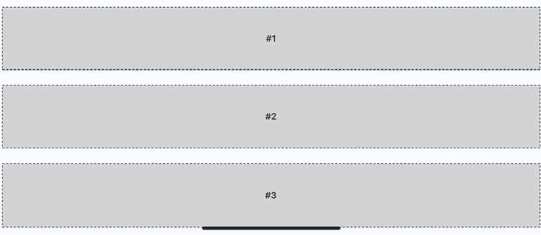

图 18.6：横向布局中的改进三列布局

现在布局正在利用屏幕的整个宽度，无论方向如何。最后，让我们实现一个可以由 `App.js` 使用的正确 `Box` 组件，而不是在布局中放置重复的样式属性。以下是 `Box` 组件的外观：

```js
import React from "react";
import { PropTypes } from "prop-types";
import { View, Text } from "react-native";
import styles from "./styles";
export default function Box({ children }) {
  return (
    <View style={styles.box}>
      <Text style={styles.boxText}>{children}</Text>
    </View>
  );
}
Box.propTypes = {
  children: PropTypes.node.isRequired,
}; 
```

现在，你已经有了良好的布局基础。接下来，你将学习关于其他方向的弹性：从左到右。

## 灵活的行

在本节中，你将学习如何使屏幕布局部分从顶部延伸到底部。要做到这一点，你需要一个 **灵活的行**。以下是该屏幕的样式：

```js
import { Platform, StyleSheet, StatusBar } from "react-native";
export default StyleSheet.create({
  container: {
    flex: 1,
    flexDirection: "row",
    backgroundColor: "ghostwhite",
    alignItems: "center",
    justifyContent: "space-around",
    ...Platform.select({
      ios: { paddingTop: 20 },
      android: { paddingTop: StatusBar.currentHeight },
    }),
  },
  box: {
    width: 100,
    justifyContent: "center",
    alignSelf: "stretch",
    alignItems: "center",
    backgroundColor: "lightgray",
    borderWidth: 1,
    borderStyle: "dashed",
    borderColor: "darkslategray",
  },
  boxText: {
    color: "darkslategray",
    fontWeight: "bold",
  },
}); 
```

下面是 `App` 组件，使用你在上一节中实现的相同的 `Box` 组件：

```js
import React from "react";
import { Text, View, StatusBar } from "react-native";
import styles from "./styles";
import Box from "./Box";
export default function App() {
  return (
    <View style={styles.container}>
      <Box>#1</Box>
      <Box>#2</Box>
    </View>
  );
} 
```

下面是在纵向模式下的屏幕结果：

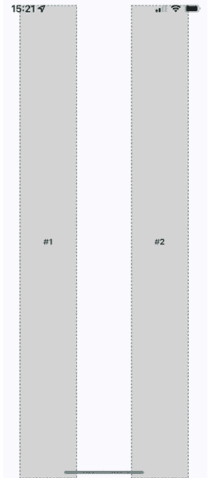

图 18.7：纵向布局中的灵活行

由于 `alignSelf` 属性，两列从屏幕顶部延伸到底部，实际上并没有指定拉伸的方向。两个 `Box` 组件从顶部到底部拉伸，因为它们以 **flex 行** 的形式显示。注意这两个部分之间的间距是如何从左到右变化的？这是因为容器具有 `flexDirection` 属性，其值为 `row`。

现在，让我们看看这个弹性方向如何影响屏幕旋转到横向布局时的布局。

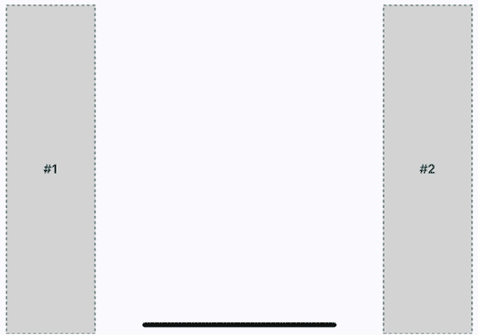

图 18.8：横向布局中的灵活行

由于 **Flexbox** 的 `justifyContent` 样式属性值为 `space-around`，空间会按比例添加到左侧、右侧以及部分之间。在下一节中，你将了解灵活的网格。

## 灵活的网格

有时，你需要一个像网格一样流动的屏幕布局。例如，如果你有多个宽度相同、高度相同的部分，但你不确定这些部分将渲染多少个？Flexbox 使得构建从左到右流动直到屏幕末尾的行变得容易。然后，它将自动在下一行从左到右渲染元素。

下面是一个纵向模式下的布局示例：

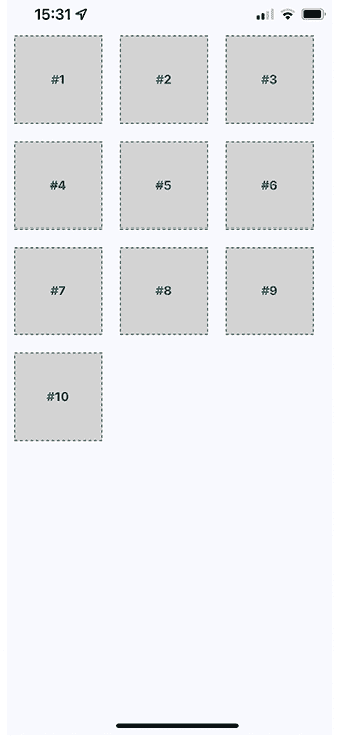

图 18.9：纵向布局的灵活网格

这种方法的优点是您不需要事先知道给定行中有多少列。每个子组件的尺寸决定了什么可以放入给定行中。

要查看创建此布局所使用的样式，您可以点击此链接：[`github.com/PacktPublishing/React-and-React-Native-5E/tree/main/Chapter18/flexible-grids/styles.ts`](https://github.com/PacktPublishing/React-and-React-Native-5E/tree/main/Chapter18/flexible-grids/styles.ts).

这是渲染每个部分的`App`组件：

```js
import React from "react";
import { View, StatusBar } from "react-native";
import styles from "./styles";
import Box from "./Box";
const boxes = new Array(10).fill(null).map((v, i) => i + 1);
export default function App() {
  return (
    <View style={styles.container}>
      <StatusBar hidden={false} />
      {boxes.map((i) => (
        <Box key={i}>#{i}</Box>
      ))}
    </View>
  );
} 
```

最后，让我们确保横向布局与这个布局兼容：

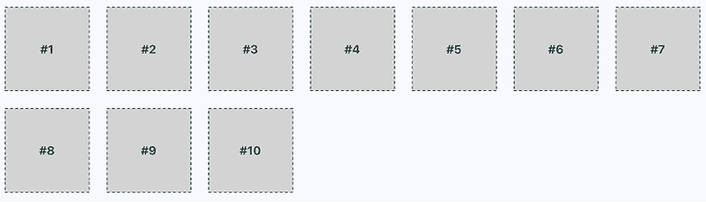

图 17.10：横向布局的灵活网格

您可能已经注意到右侧有一些多余的空间。记住，这些部分之所以在这个书中可见，是因为我们希望它们可见。在实际应用中，它们只是对其他 React Native 组件进行分组。然而，如果屏幕右侧的空间成为问题，您可以尝试调整子组件的边距和宽度。

现在您已经了解了**灵活网格**的工作原理，我们将接下来查看灵活的行和列。

## 灵活的行和列

让我们学习如何组合行和列来为您的应用创建一个复杂的布局。例如，有时您需要将列嵌套在行内或行嵌套在列内的能力。要查看嵌套列在行内的应用的`App`组件，您可以点击此链接：[`github.com/PacktPublishing/React-and-React-Native-5E/tree/main/Chapter18/flexible-rows-and-columns/App.tsx`](https://github.com/PacktPublishing/React-and-React-Native-5E/tree/main/Chapter18/flexible-rows-and-columns/App.tsx).

您已经为布局组件（`<Row>`和`<Column>`）和内容组件（`<Box>`）创建了抽象。让我们看看这个屏幕看起来像什么：

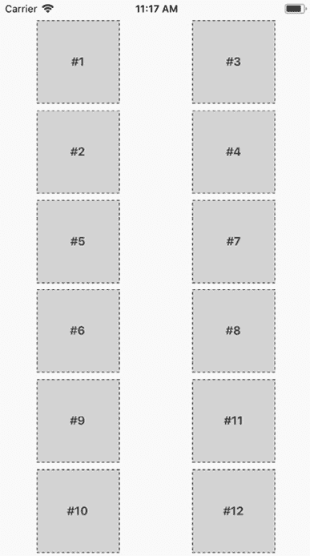

图 18.11：灵活的行和列

这个布局可能看起来很熟悉，因为您在*灵活网格*部分已经做过。与*图 18.9*相比，关键的区别在于这些内容部分的顺序。

例如，**#2**不会放在**#1**的右边，它会放在下面。这是因为我们将**#1**和**#2**放在了`<Column>`中。**#3**和**#4**也是同样的情况。这两个列被放置在同一行中。然后，下一行开始，以此类推。

这只是通过嵌套行 Flexbox 和列 Flexbox 所能实现的可能布局之一。现在让我们看看`Row`组件：

```js
import React from "react";
import PropTypes from "prop-types";
import { View, Text } from "react-native";
import styles from "./styles";
export default function Box({ children }) {
  return (
    <View style={styles.box}>
      <Text style={styles.boxText}>{children}</Text>
    </View>
  );
}
Box.propTypes = {
  children: PropTypes.node.isRequired,
}; 
```

此组件将行样式应用于`<View>`组件。当创建复杂布局时，`App`组件中的最终结果是更干净的 JSX 标记。最后，让我们看看`Column`组件：

```js
import React from "react";
import PropTypes from "prop-types";
import { View } from "react-native";
import styles from "./styles";
export default function Column({ children }) {
  return <View style={styles.column}>{children}</View>;
}
Column.propTypes = {
  children: PropTypes.node.isRequired,
}; 
```

这看起来就像`Row`组件，只是应用了不同的样式。它也服务于与`Row`相同的目的：为其他组件中的布局提供更简单的 JSX 标记。

# 摘要

本章向你介绍了 React Native 中的样式。虽然你可以使用许多你熟悉的相同 CSS 样式属性，但用于 Web 应用的 CSS 样式表看起来非常不同。具体来说，它们由纯 JavaScript 对象组成。

然后，你学习了如何使用 React Native 的主要布局机制：**Flexbox**。这是目前大多数 Web 应用布局的首选方式，因此能够在原生应用中重用这种方法是有意义的。你创建了几个不同的布局，并看到了它们在纵向和横向方向上的外观。

在下一章中，你将开始为你的应用实现导航功能。
