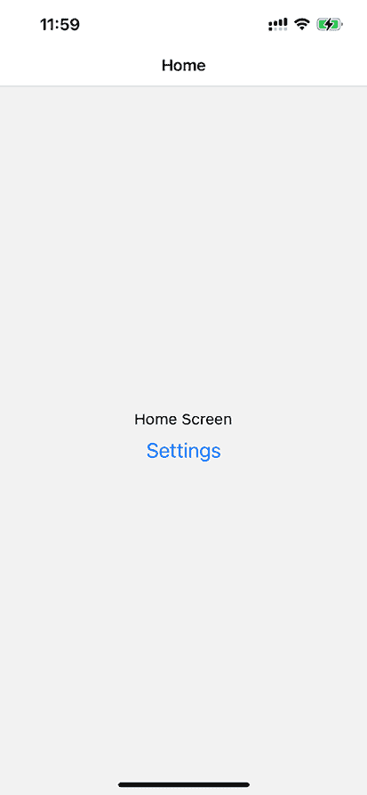
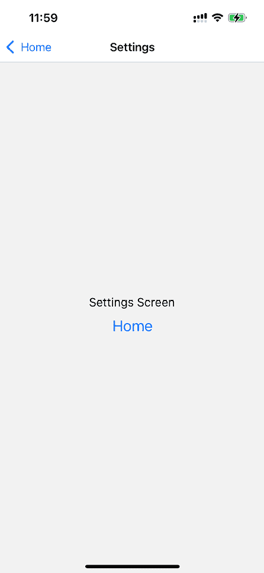
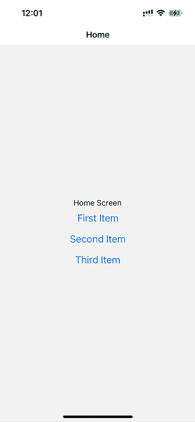
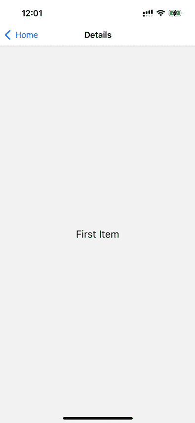
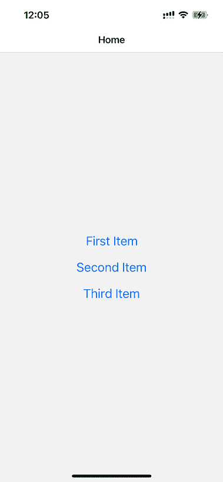
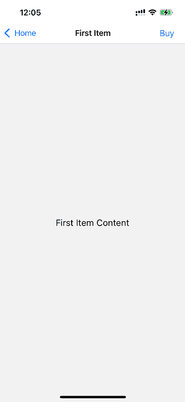
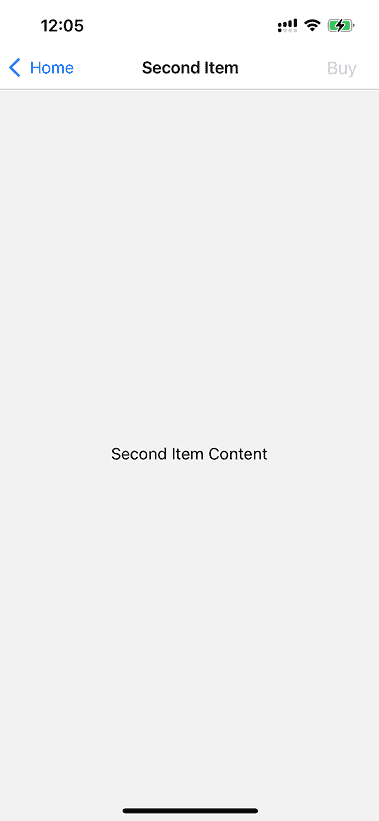
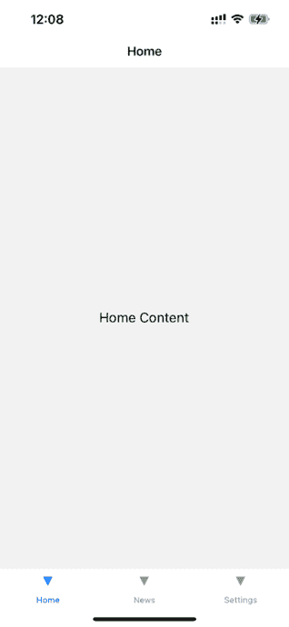
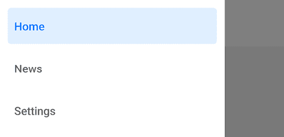

# 19

# 屏幕间导航

本章的重点是导航 React Native 应用程序中构成屏幕之间的导航。在原生应用中的导航与在网页应用中的导航略有不同：主要是因为用户没有意识到任何 URL 的概念。在 React Native 的早期版本中，有一些原始的导航组件，你可以使用它们来控制屏幕间的导航。这些组件存在一些挑战，导致完成基本导航任务需要更多的代码。例如，初始导航组件，如 `Navigator` 和 `NavigatorIOS`，实现起来复杂且功能不足，导致性能问题和跨平台的不一致性。

更新版本的 **React Native** 鼓励你使用 `react-navigation` 包，这将是本章的重点，尽管还有其他几个选项。你将学习导航基础知识、向屏幕传递参数、更改标题内容、使用标签和抽屉导航以及使用导航处理状态。我们还将探讨一种现代导航方法，称为基于文件的导航。

本章我们将涵盖以下主题：

+   导航的基本知识

+   路由参数

+   导航标题

+   标签和抽屉导航

+   基于文件的导航

# 技术要求

你可以在 GitHub 上找到本章的代码文件，链接为 [`github.com/PacktPublishing/React-and-React-Native-5E/tree/main/Chapter19`](https://github.com/PacktPublishing/React-and-React-Native-5E/tree/main/Chapter19)。

# 导航的基本知识

在 React Native 中，导航至关重要，因为它管理着应用中不同屏幕之间的过渡。它通过逻辑组织应用流程来提高用户体验，使用户能够直观地了解如何访问功能和信息。有效的导航使应用感觉快速且响应灵敏，减少用户挫败感并提高用户参与度。它还支持应用架构，通过明确定义组件之间的链接和交互，使应用更容易扩展和维护。没有适当的导航，应用可能会变得令人困惑且难以使用，这会严重影响其成功和用户留存。本节将通过创建一个小型应用来引导你设置应用中的导航，在这个小应用中你可以导航到不同的屏幕。

让我们从使用 `react-navigation` 包从一个页面跳转到另一个页面的基本操作开始。

在开始之前，你应该将 `react-navigation` 包安装到一个新项目中，以及一些与示例相关的附加依赖：

```js
npm install @react-navigation/native 
```

然后，使用 `expo` 安装本地依赖：

```js
npx expo install react-native-screens react-native-safe-area-context 
```

上一节的安装步骤将适用于本章的每个示例，但我们还需要添加一个与堆栈导航相关的包：

```js
npm install @react-navigation/native-stack 
```

现在，我们已经准备好开发导航。下面是 `App` 组件的样貌：

```js
import Home from "./Home";
import Settings from "./Settings";
const Stack = createNativeStackNavigator<RootStackParamList>();
export default function App() {
  return (
    <NavigationContainer>
      <Stack.Navigator>
        <Stack.Screen name="Home" component={Home} />
        <Stack.Screen name="Settings" component={Settings} />
      </Stack.Navigator>
    </NavigationContainer>
  );
} 
```

`createNativeStackNavigator()`是一个设置导航的函数。它返回一个对象，包含两个属性，即`Screen`和`Navigator`组件，它们用于配置堆栈导航器。

此函数的第一个参数映射到可以导航的屏幕组件。第二个参数用于更通用的导航选项：在这种情况下，你正在告诉导航器主页应该是默认的屏幕组件。`<NavigationContainer>`组件是必要的，这样屏幕组件就能获得它们需要的所有导航属性。

这是`Home`组件的外观：

```js
type Props = NativeStackScreenProps<RootStackParamList>;
export default function Home({ navigation }: Props) {
  return (
    <View style={styles.container}>
      <StatusBar barStyle="dark-content" />
      <Text>Home Screen</Text>
      <Button
        title="Settings"
        onPress={() => navigation.navigate("Settings")}
      />
    </View>
  );
} 
```

这是一个典型的功能 React 组件。你在这里可以使用基于类的组件，但不需要，因为没有状态或生命周期方法。它渲染一个应用了容器样式的`View`组件。

这后面跟着一个`Text`组件，用于标记`screen`，然后是一个`Button`组件。`screen`可以是任何你想要的东西：它只是一个普通的 React Native 组件。导航组件为你处理路由和屏幕之间的转换。

此按钮的`onPress`处理程序在点击时导航到**设置屏幕**。这是通过调用`navigation.navigate('Settings')`完成的。导航属性通过`react-navigation`传递给你的`screen`组件，并包含你需要的所有路由功能。与在 React web 应用中处理 URL 相比，这里你调用导航器 API 函数，并传递屏幕名称。

要在导航中获得类型安全的环境，我们需要定义一个名为`RootStackParamList`的类型，它包含有关我们路由的所有信息。我们使用它和`NativeStackScreenProps`一起定义路由`Props`。这是`RootStackParamList`的外观：

```js
export type RootStackParamList = {
  Home: undefined;
  Settings: undefined;
}; 
```

我们为每个路由传递 undefined，因为我们没有在路由上设置任何参数。因此，我们只能用`Settings`或`Home`调用`navigation.navigate()`。

让我们看看`Settings`组件：

```js
type Props = NativeStackScreenProps<RootStackParamList>;
export default function Settings({ navigation }: Props) {
  return (
    <View style={styles.container}>
      <StatusBar barStyle="dark-content" />
      <Text>Settings Screen</Text>
      <Button title="Home" onPress={() => navigation.navigate("Home")} />
    </View>
  );
} 
```

此组件与`Home`组件类似，只是文本不同，当按钮被点击时，你将被带回到**主页**。

这就是**主页**的外观：



图 19.1：主页

如果你点击**设置**按钮，你将被带到**设置屏幕**，其外观如下：



图 19.2：设置屏幕

这个屏幕看起来几乎与**Home 屏幕**完全相同。它有不同的文本和不同的按钮，点击该按钮将带你返回到**Home 屏幕**。然而，还有另一种返回**Home 屏幕**的方法。看看屏幕顶部，你会注意到一个白色的导航栏。在导航栏的左侧，有一个返回箭头。这就像网页浏览器中的返回按钮一样，会带你回到上一个屏幕。react-navigation 的好处是它会为你渲染这个导航栏。

在这个导航栏设置好之后，你不必担心你的布局样式如何影响状态栏。你只需要担心你每个屏幕的布局。

如果你在这个 Android 应用上运行，你会在导航栏中看到相同的返回按钮。但你也可以使用大多数 Android 设备上应用外部的标准返回按钮。

在下一节中，你将学习如何向你的路由传递参数。

# 路由参数

当你开发 React Web 应用时，一些路由中包含**动态数据**。例如，你可以链接到一个详情页面，在该 URL 中，你将有一个某种标识符。组件将拥有渲染特定详细信息所需的内容。在`react-navigation`中，也存在同样的概念。你不仅可以指定你想要导航到的屏幕名称，还可以传递额外的数据。

让我们看看路由参数的实际应用。

我们将从`App`组件开始：

```js
const Stack = createNativeStackNavigator<RootStackParamList>();
export default function App() {
  return (
    <NavigationContainer>
      <Stack.Navigator>
        <Stack.Screen name="Home" component={Home} />
        <Stack.Screen name="Details" component={Details} />
      </Stack.Navigator>
    </NavigationContainer>
  );
} 
```

这看起来就像*导航基础*部分中的例子，只不过没有`Settings`页面，而是有一个`Details`页面。这是你想要动态传递数据以渲染适当信息的页面。

要为我们的路由启用 TypeScript，需要定义`RootStackParamList`：

```js
export type RootStackParamList = {
  Home: undefined;
  Details: { title: string };
}; 
```

接下来，让我们看看`Home`屏幕组件：

```js
type Props = NativeStackScreenProps<RootStackParamList, "Home">;
export default function Home({ navigation }: Props) {
  return (
    <View style={styles.container}>
      <StatusBar barStyle="dark-content" />
      <Text>Home Screen</Text>
      <Button
        title="First Item"
        onPress={() => navigation.navigate("Details", { title: "First Item" })}
      />
      <Button
        title="Second Item"
        onPress={() => navigation.navigate("Details", { title: "Second Item" })}
      />
      <Button
        title="Third Item"
        onPress={() => navigation.navigate("Details", { title: "Third Item" })}
      />
    </View>
  );
} 
```

`Home`屏幕有三个`Button`组件，每个都导航到`Details`屏幕。注意，在`navigation.navigate()`调用中，除了屏幕名称外，每个都有一个第二个参数。这些参数是包含特定数据的对象，这些数据被传递到`Details`屏幕。

接下来，让我们看看`Details`屏幕，看看它是如何消费这些路由参数的：

```js
type Props = NativeStackScreenProps<RootStackParamList, "Details">;
export default function ({ route }: Props) {
  const { title } = route.params;
  return (
    <View style={styles.container}>
      <StatusBar barStyle="dark-content" />
      <Text>{title}</Text>
    </View>
  );
} 
```

尽管这个例子只传递了一个`title`参数，但你可以向屏幕传递你需要的任意多个参数。你可以使用路由属性`params`的`value`来访问这些参数。

这是渲染后的**Home 屏幕**的样子：



图 19.3：Home 屏幕

如果你点击**第一个项目**按钮，你将被带到使用路由参数数据渲染的**Details**屏幕：



图 19.4：Details 屏幕

你可以点击导航栏中的返回按钮回到**主屏幕**。如果你点击**主屏幕**上的其他任何按钮，你将返回到带有更新数据的**详情屏幕**。路由参数是必要的，以避免不得不编写重复的组件。你可以将向`navigator.navigate()`传递参数视为向 React 组件传递 props。

在下一节中，你将学习如何用内容填充导航部分标题。

# 导航标题

本章中你创建的导航栏到目前为止相当简单。这是因为你没有配置它们执行任何操作，所以`react-navigation`只会渲染一个带有返回按钮的普通栏。你创建的每个屏幕组件都可以配置特定的导航标题内容。

让我们基于在`Route`参数部分讨论的例子进行扩展，该例子使用了按钮来导航到详情页面。

`App`组件有重大更新，让我们看看它：

```js
const Stack = createNativeStackNavigator<RoutesParams>();
export default function App() {
  return (
    <NavigationContainer>
      <Stack.Navigator>
        <Stack.Screen name="Home" component={Home} />
        <Stack.Screen
          name="Details"
          component={Details}
          options={({ route }) => ({
            headerRight: () => {
              return (
                <Button
                  title="Buy"
                  onPress={() => {}}
                  disabled={route.params.stock === 0}
                />
              );
            },
          })}
        />
      </Stack.Navigator>
    </NavigationContainer>
  );
} 
```

`Screen`组件接受`options`属性作为对象或函数，以提供额外的屏幕属性。

使用`headerRight`选项在导航栏的右侧添加一个`Button`组件。这就是`stock`参数发挥作用的地方。如果这个值是`0`，因为`stock`中没有内容，你想要禁用`购买`按钮。

在我们的例子中，我们传递`options`作为一个函数，并读取`stock`屏幕参数来禁用按钮。这是向`Screen`组件传递选项的几种方法之一。我们将应用另一种方法到`Details`组件。

要了解股票 props 是如何传递的，请看这里的`Home`组件：

```js
type Props = NativeStackScreenProps<RoutesParams, "Home">;
export default function Home({ navigation }: Props) {
  return (
    <View style={styles.container}>
      <StatusBar barStyle="dark-content" />
      <Button
        title="First Item"
        onPress={() =>
          navigation.navigate("Details", {
            title: "First Item",
            content: "First Item Content",
            stock: 1,
          })
        }
      />
      ...
    </View>
  );
} 
```

首先要注意的是，每个按钮都向`Details`组件传递了更多的路由参数：`content`和`stock`。你很快就会明白原因。

接下来，让我们看看`Details`组件：

```js
type Props = NativeStackScreenProps<RoutesParams, "Details">;
export default function Details({ route, navigation }: Props) {
  const { content, title } = route.params;
  React.useEffect(() => {
    navigation.setOptions({ title });
  }, []);
  return (
    <View style={styles.container}>
      <StatusBar barStyle="dark-content" />
      <Text>{content}</Text>
    </View>
  );
} 
```

这次，`Details`组件渲染了`route`参数的内容。与`App`组件一样，我们向屏幕添加了额外的选项。在这种情况下，我们使用`navigation.setOptions()`方法更新`screen`选项。为了自定义标题，我们还可以通过`App`组件向该屏幕添加一个标题。

让我们看看所有这些是如何工作的，从**主屏幕**开始：



图 19.5：主屏幕

现在导航栏中已经有了标题文本，这是通过`Screen`组件中的`name`属性设置的。

接下来，尝试按下**第一个项目**按钮：



图 19.6：第一个项目屏幕

导航栏中的标题是基于传递给`Details`组件的`title`参数设置的，使用`navigation.setOptions()`方法。渲染在导航栏右侧的**购买**按钮是由放置在`App`组件中的`Screen`组件的`options`属性渲染的。它被启用，因为`stock`参数的值是`1`。

现在，尝试返回到**Home**屏幕并按下**第二个项目**按钮：



图 19.7：第二个项目屏幕

标题和页面内容都反映了传递给`Details`的新参数值，但`Buy`按钮也是如此。它处于禁用状态，因为库存参数值为`0`，这意味着不能购买。

现在你已经学会了如何使用导航标题，在下一节中，你将学习关于标签和抽屉导航的内容。

# 标签和抽屉导航

到目前为止，在本章中，每个示例都使用了`Button`组件来链接到应用中的其他屏幕。你可以使用`react-navigation`中的函数来自动为你创建**tab**或**drawer**导航，这些函数基于你提供的屏幕组件。

让我们创建一个示例，使用 iOS 上的底部 tab 导航和 Android 上的抽屉导航。

你不仅限于在 iOS 上使用标签导航或在 Android 上使用抽屉导航。我只是选择这两个来演示如何根据平台使用不同的导航模式。如果你更喜欢，你可以在两个平台上使用完全相同的导航模式。

对于这个示例，我们需要安装一些其他用于标签和抽屉导航器的包：

```js
npm install @react-navigation/bottom-tabs @react-navigation/drawer 
```

此外，抽屉导航器需要一些原生模块。让我们来安装它们：

```js
npx expo install react-native-gesture-handler react-native-reanimated 
```

然后，向`babel.config.js`文件添加一个插件。结果，文件应该看起来像以下这样：

```js
module.exports = function (api) {
  api.cache(true);
  return {
    presets: ["babel-preset-expo"],
    plugins: ["react-native-reanimated/plugin"],
  };
}; 
```

现在，我们已经准备好继续编码。以下是`App`组件的样式：

```js
const Tab = createBottomTabNavigator<Routes>();
const Drawer = createDrawerNavigator<Routes>();
export default function App() {
  return (
    <NavigationContainer>
      {Platform.OS === "ios" && (
        <Tab.Navigator>
          <Tab.Screen name="Home" component={Home} />
          <Tab.Screen name="News" component={News} />
          <Tab.Screen name="Settings" component={Settings} />
        </Tab.Navigator>
      )}
      {Platform.OS == "android" && (
        <Drawer.Navigator> 
          <Drawer.Screen name="Home" component={Home} />
          <Drawer.Screen name="News" component={News} />
          <Drawer.Screen name="Settings" component={Settings} />
        </Drawer.Navigator>
      )}
    </NavigationContainer>
  );
} 
```

你不是使用`createNativeStackNavigator()`函数来创建你的导航器，而是导入`createBottomTabNavigator()`和`createDrawerNavigator()`函数：

```js
import { createDrawerNavigator } from "@react-navigation/drawer";
import { createBottomTabNavigator } from "@react-navigation/bottom-tabs"; 
```

然后，你使用`react-native`中的`Platform`实用工具来决定使用哪个导航器。结果，根据平台，被分配给`App`。每个导航器都包含`Navigator`和`Screen`组件，你可以将它们传递给你的`App`。为你创建并渲染的`tab`或`drawer`导航将自动生成。

接下来，让我们看看`Home`屏幕组件：

```js
export default function Home() {
  return (
    <View style={styles.container}>
      <Text>Home Content</Text>
    </View>
  );
} 
```

`News`和`Settings`组件与`Home`组件基本相同。以下是 iOS 上底部`tab`导航的样式：



图 19.8：标签导航器

你的应用由三个屏幕组成，列在底部。当前屏幕被标记为活动状态，你可以点击其他标签来移动。

现在，让我们看看 Android 上的`drawer`布局是什么样的：



图 19.9：抽屉导航器

要打开`drawer`，你需要从屏幕左侧滑动。一旦打开，你会看到按钮，它们会带你到应用的各种屏幕。

从屏幕左侧滑动打开`drawer`是默认模式。你可以配置`drawer`从任何方向滑动打开。

现在，你已经学会了如何使用 `tab` 和 `drawer` 导航。接下来，我们将探讨仅基于文件定义导航的方法。

# 基于文件的导航

在本节中，我们将讨论 **Expo Router**，这是一个基于文件的路由器，其工作方式与 Next.js 中的路由类似。要添加新的屏幕，你只需在 `app` 文件夹中添加一个新的文件。它是建立在 React Navigation 之上的，因此路由具有相同的选项和参数。

更多关于 Expo Router 的信息和细节，请查看此链接：

[`docs.expo.dev/routing/introduction/`](https://docs.expo.dev/routing/introduction/)

要尝试它，我们将使用以下命令安装一个新的项目：

```js
npx create-expo-app –template 
```

要使用准备好 Expo Router 的项目进行安装，我们只需选择 `Navigation (TypeScript)` 模板：

```js
 Blank
    Blank (TypeScript)
❯   Navigation (TypeScript) - File-based routing with TypeScript enabled
    Blank (Bare) 
```

安装完成后，你将找到项目的 `app` 文件夹。这个文件夹将用于所有你的屏幕。让我们尝试复制 *导航基础* 部分的示例。首先，我们需要在 `app` 文件夹内创建 `_layout.tsx` 文件。这个文件作为我们 `app` 的 `root` 层工作。它看起来是这样的：

```js
import { Stack } from "expo-router";
export default function RootLayout() {
  return <Stack />;
} 
```

然后，让我们创建包含 `Home` 屏幕的 `index.tsx` 文件。与 `_layout.tsx` 相比，它有一些不同，让我们看看：

```js
import { Link } from "expo-router";
export default function Home() {
  return (
    <View style={styles.container}>
      <StatusBar barStyle="dark-content" />
      <Text>Home Screen</Text>
      <Link href="/settings" asChild>
        <Button title="Settings" />
      </Link>
    </View>
  );
} 
```

如你所见，我们没有使用 `navigation` 属性。我们而是使用一个接受 `href` 属性的 `Link` 组件，就像一个网页。点击那个按钮会带我们到 `Settings` 屏幕。

让我们创建 `settings.tsx` 文件：

```js
import { Link } from "expo-router";
export default function Settings() {
  return (
    <View style={styles.container}>
      <StatusBar barStyle="dark-content" />
      <Text>Settings Screen</Text>
      <Link href="/" asChild>
        <Button title="Home" />
      </Link>
    </View>
  );
} 
```

在这里，我们使用与 `index.tsx` 文件相同的方法，但在 `Link` 中，我们将 `href` 设置为 “`/`”。

这就是我们可以如此轻松地以声明式方式定义屏幕，并且屏幕之间的导航 URL 方法是即插即用的。此外，我们在这里获得的一个好处是**深度链接**也是即插即用的；使用这种方法，我们可以通过应用链接打开特定的屏幕。

现在，你知道如何使用基于文件的路由，这可以提高你开发移动应用的经验，尤其是在基于 URL 和链接的 Web 态度下。

# 摘要

在本章中，你了解到移动应用需要导航，就像 Web 应用一样。尽管它们不同，Web 应用和移动应用导航在概念上有足够的相似性，使得移动应用的路由和导航不必成为麻烦。

旧版本的 React Native 尝试提供组件来帮助管理移动应用内的导航，但它们从未真正流行起来。相反，React Native 社区主导了这个领域。一个例子是 `react-navigation` 库：本章的重点。

你学习了如何使用 `react-navigation` 进行基本导航。然后，你学习了如何在导航栏中控制 `header` 组件。接下来，你了解了 `tab` 和 `drawer` 导航组件。这两个导航组件可以根据屏幕组件自动渲染你的应用的导航按钮。你还学习了如何与基于文件的 Expo Router 一起工作。

在下一章中，你将学习如何渲染数据列表。
