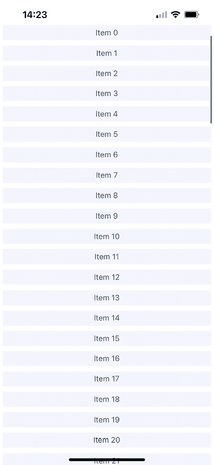
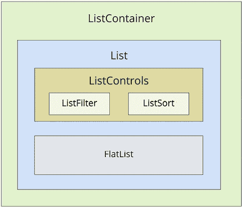
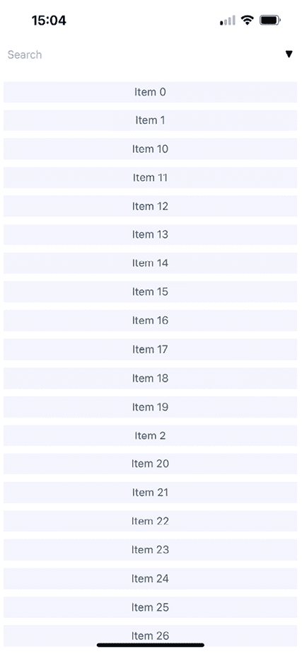
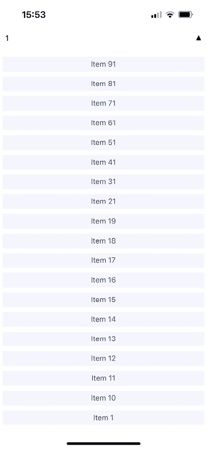

# 20

# 渲染项目列表

在本章中，你将学习如何处理项目列表。列表是常见的 Web 应用程序组件。虽然使用`<ul>`和`<li>`元素构建列表相对简单，但在本地移动平台上做类似的事情要复杂得多。

幸运的是，React Native 提供了一个**项目列表**接口，隐藏了所有的复杂性。首先，你将通过浏览一个示例来了解项目列表的工作方式。然后，你将学习如何构建更改列表中显示的数据的控件。最后，你将看到几个从网络获取项目的示例。

本章我们将涵盖以下主题：

+   渲染数据集合

+   排序和过滤列表

+   获取列表数据

+   懒加载列表

+   实现下拉刷新

# 技术要求

你可以在 GitHub 上找到本章的代码文件，地址为[`github.com/PacktPublishing/React-and-React-Native-5E/tree/main/Chapter20`](https://github.com/PacktPublishing/React-and-React-Native-5E/tree/main/Chapter20)。

# 渲染数据集合

**列表**是显示大量信息最常见的方式：例如，你可以显示你的朋友列表、消息和新闻。许多应用程序包含具有数据集合的列表，React Native 提供了创建这些组件的工具。

让我们从示例开始。你将使用 React Native 组件`FlatList`来渲染列表，它在 iOS 和 Android 上工作方式相同。列表视图接受一个`data`属性，它是一个对象数组。这些对象可以具有你喜欢的任何属性，但它们确实需要一个`key`属性。如果你没有`key`属性，你可以将`keyExtractor`属性传递给`Flatlist`组件，并指示使用什么代替`key`。`key`属性类似于在`<ul>`元素内部渲染`<li>`元素的要求。这有助于列表在列表数据更改时高效渲染。

现在我们来实现一个基本的列表。以下是渲染一个包含 100 项的基本列表的代码：

```js
const data = new Array(100)
  .fill(null)
  .map((v, i) => ({ key: i.toString(), value: `Item ${i}` }));
export default function App() {
  return (
    <View style={styles.container}>
      <FlatList
        data={data}
        renderItem={({ item }) => <Text style={styles.item}>{item.value}</Text>}
      />
    </View>
  );
} 
```

让我们逐步了解这里发生的事情，从`data`常量开始。它包含一个 100 项的数组。这是通过填充一个包含 100 个`null`值的新数组，然后将其映射到一个新数组，该数组包含要传递给`<FlatList>`的对象来创建的。每个对象都有一个`key`属性，因为这是一个要求；其他任何内容都是可选的。在这种情况下，你决定添加一个`value`属性，该属性将在列表渲染时使用。

接下来，你将渲染`<FlatList>`组件。它位于`<View>`容器中，因为列表视图需要高度才能正确工作。`data`和`renderItem`属性被传递给`<FlatList>`，这最终决定了渲染的内容。

初看之下，`FlatList`组件似乎并没有做太多。您是否需要弄清楚项的外观？嗯，是的，`FlatList`组件应该是通用的。它应该擅长处理更新，并将滚动功能嵌入到列表中。以下是用于渲染列表的样式：

```js
import { StyleSheet } from "react-native";
export default StyleSheet.create({
  container: {
    flex: 1,
    flexDirection: "column",
    paddingTop: 40,
  },
  item: {
    margin: 5,
    padding: 5,
    color: "slategrey",
    backgroundColor: "ghostwhite",
    textAlign: "center",
  },
}); 
```

在这里，您正在为列表中的每个项设置样式。否则，每个项都将是纯文本，这将很难区分其他列表项。`container`样式通过将`flex`设置为`1`来设置列表的高度。

让我们看看现在列表看起来像什么：



图 20.1：渲染数据集合

如果您在模拟器中运行此示例，您可以在屏幕上的任何地方单击并按住鼠标按钮，就像用手指一样，然后上下滚动通过项。

在下一节中，您将学习如何添加排序和过滤列表的控件。

# 排序和过滤列表

现在您已经学习了`FlatList`组件的基础知识，包括如何传递数据，让我们向在*渲染数据集合*部分实现的列表添加一些控件。`FlatList`组件可以与其他组件一起渲染：例如，列表控件。它帮助您操作数据源，这最终决定了屏幕上渲染的内容。

在实现列表控制组件之前，回顾这些组件的高级结构可能会有所帮助，这样代码就有更多的上下文。以下是您将要实现的组件结构的示意图：



图 20.2：组件结构

每个这些组件负责的内容如下：

+   `ListContainer`：列表的整体容器；它遵循熟悉的 React 容器模式

+   `List`：一个无状态组件，将相关的状态片段传递给`ListControls`和 React Native 的`ListView`组件

+   `ListControls`：一个组件，它包含各种控件，这些控件可以更改列表的状态

+   `ListFilter`：用于过滤项目列表的控件

+   `ListSort`：用于更改列表排序顺序的控件

+   `FlatList`：实际渲染项的 React Native 组件

在某些情况下，将列表的实现拆分开来可能会增加开销。然而，我认为如果您的列表需要控件，那么您可能正在实现一些将从良好的组件架构中受益的东西。

现在，让我们深入探讨这个列表的实现，从**ListContainer**组件开始：

```js
function mapItems(items: string[]) {
  return items.map((value, i) => ({ key: i.toString(), value }));
}
const array = new Array(100).fill(null).map((v, i) => `Item ${i}`);
function filterAndSort(text: string, asc: boolean): string[] {
  return array
    .filter((i) => text.length === 0 || i.includes(text))
    .sort(
      asc
        ? (a, b) => (a > b ? 1 : a < b ? -1 : 0)
        : (a, b) => (b > a ? 1 : b < a ? -1 : 0)
    );
} 
```

在这里，我们定义了一些实用函数和我们将使用的初始数组。

然后，我们将定义`asc`和`filter`来管理排序和过滤列表，分别使用`useMemo`钩子实现的`data`变量：

```js
export default function ListContainer() {
  const [asc, setAsc] = useState(true);
  const [filter, setFilter] = useState("");
  const data = useMemo(() => {
    return filterAndSort(filter, asc);
  }, [filter, asc]); 
```

它给我们一个避免手动更新的机会，因为当`filter`和`asc`依赖项更新时，它将自动重新计算。它还有助于我们在`filter`和`asc`未更改时避免不必要的重新计算。

这就是我们将此逻辑应用于`List`组件的方式：

```js
return (
  <List
    data={mapItems(data)}
    asc={asc}
    onFilter={(text) => {
      setFilter(text);
    }}
    onSort={() => {
      setAsc(!asc);
    }}
  />
); 
```

如果这看起来有点多，那是因为确实如此。此容器组件有很多状态要处理。它还有一些需要对其子组件提供的不平凡的行为。如果您从封装状态的角度来看，它将更容易接近。它的任务是使用状态数据填充列表，并提供在此状态下操作的功能。

在理想的世界里，此容器的子组件应该是简单而优雅的，因为它们不需要直接与状态交互。让我们看看下一个`List`组件：

```js
export default function List({ data, ...props }: Props) {
  return (
    <FlatList
      data={data}
      ListHeaderComponent={<ListControls {...props}/>}
      renderItem={({ item }) => <Text style={styles.item}>{item.value}</Text>}
    />
  );
} 
```

此组件将来自`ListContainer`组件的状态作为属性，并渲染一个`FlatList`组件。与上一个示例相比，这里的主要区别是`ListHeaderComponent`属性。它渲染了`List`组件的控件。这个属性特别有用，因为它在可滚动列表内容之外渲染控件，确保控件始终可见。让我们看看下一个`ListControls`组件：

```js
type Props = {
  onFilter: (text: string) => void;
  onSort: () => void;
  asc: boolean;
};
export default function ListControls({ onFilter, onSort, asc }: Props) {
  return (
    <View style={styles.controls}>
      <ListFilter onFilter={onFilter} />
      <ListSort onSort={onSort} asc={asc} />
    </View>
  );
} 
```

此组件将`ListFilter`和`ListSort`控件结合在一起。因此，如果您要添加另一个列表控件，您应该在这里添加。

现在让我们看看`ListFilter`的实现：

```js
type Props = {
  onFilter: (text: string) => void;
};
export default function ListFilter({ onFilter }: Props) {
  return (
    <View>
      <TextInput
        autoFocus
        placeholder="Search"
        style={styles.filter}
        onChangeText={onFilter}
      />
    </View>
  );
} 
```

筛选控件是一个简单的文本输入，通过用户类型筛选项目列表。处理此操作的`onFilter`函数来自`ListContainer`组件。

让我们看看下一个`ListSort`组件：

```js
const arrows = new Map([
  [true, "▼"],
  [false, "▲"],
]);
type Props = {
  onSort: () => void;
  asc: boolean;
};
export default function ListSort({ onSort, asc }: Props) {
  return <Text onPress={onSort}>{arrows.get(asc)}</Text>;
} 
```

下面是结果的列表：



图 20.3：排序和筛选列表

默认情况下，整个列表按升序渲染。当用户尚未提供任何内容时，您可以看到占位符**搜索**文本。让我们看看当您输入筛选器和更改排序顺序时，它看起来会是什么样子：



图 20.4：排序顺序和搜索值已更改的列表

此搜索包括包含`1`的项，并按降序排序结果。请注意，您可以先更改顺序，然后输入筛选器。筛选器和排序顺序都是`ListContainer`状态的一部分。

在下一节中，您将学习如何从 API 端点获取列表数据。

# 获取列表数据

通常，您将从某个 API 端点获取列表数据。在本节中，您将了解如何在 React Native 组件中发起 API 请求。好消息是，React Native 已经填充了`fetch()` API，因此您在移动应用程序中的网络代码应该看起来和感觉就像在您的 Web 应用程序中一样。

首先，让我们为我们的列表项构建一个**mock API**，使用返回 promise 的函数，就像`fetch()`一样：

```js
const items = new Array(100).fill(null).map((v, i) => `Item ${i}`);
function filterAndSort(data: string[], text: string, asc: boolean) {
  return data
    .filter((i) => text.length === 0 || i.includes(text))
    .sort(
      asc
        ? (a, b) => (b > a ? -1 : a === b ? 0 : 1)
        : (a, b) => (a > b ? -1 : a === b ? 0 : 1)
    );
}
export function fetchItems(
  filter: string,
  asc: boolean
): Promise<{ json: () => Promise<{ items: string[] }> }> {
  return new Promise((resolve) => {
    resolve({
      json: () =>
        Promise.resolve({
          items: filterAndSort(items, filter, asc),
        }),
    });
  });
} 
```

在 mock API 函数就位后，让我们对`ListContainer`组件做一些修改。现在，你不再使用本地数据源，而是可以使用`fetchItems()`函数从 mock API 加载数据。让我们看看并定义`ListContainer`组件：

```js
export default function ListContainer() {
  const [asc, setAsc] = useState(true);
  const [filter, setFilter] = useState("");
  const [data, setData] = useState<MappedList>([]);
  useEffect(() => {
    fetchItems(filter, asc)
      .then((resp) => resp.json())
      .then(({ items }) => {
        setData(mapItems(items));
      });
  }, []); 
```

我们使用`useState`和`useEffect`钩子定义了状态变量来获取初始列表数据。

现在，让我们来看看我们在`List`组件中新的处理器的用法：

```js
 return (
    <List
      data={data}
      asc={asc}
      onFilter={(text) => {
        fetchItems(text, asc)
          .then((resp) => resp.json())
          .then(({ items }) => {
            setFilter(text);
            setData(mapItems(items));
          });
      }}
      onSort={() => {
        fetchItems(filter, !asc)
          .then((resp) => resp.json())
          .then(({ items }) => {
            setAsc(!asc);
            setData(mapItems(items));
          });
      }}
    />
  );
} 
```

任何修改列表状态的行动都需要在 promise 解析后调用`fetchItems()`并设置适当的状态。

在接下来的部分，你将学习如何懒加载列表数据。

# 懒加载列表

在本节中，你将实现一种不同类型的列表：一个可以无限滚动的列表。有时，用户实际上并不知道他们在寻找什么，所以过滤或排序并不能帮助。想想当你登录账户时看到的 Facebook 新闻源；它是应用程序的主要功能，你很少会寻找特定的事物。你需要通过滚动列表来查看发生了什么。

要使用`FlatList`组件实现这一点，你需要能够在用户滚动到列表末尾时获取更多的 API 数据。为了理解这是如何工作的，你需要大量的 API 数据来操作，生成器在这方面非常出色。所以，让我们修改你在*获取列表数据*部分的示例中创建的 mock，让它持续响应新数据：

```js
function* genItems() {
  let cnt = 0;
  while (true) {
    yield `Item ${cnt++}`;
  }
}
let items = genItems();
export function fetchItems({ refresh }: { refresh?: boolean }) {
  if (refresh) {
    items = genItems();
  }
  return Promise.resolve({
    json: () =>
      Promise.resolve({
        items: new Array(30).fill(null).map(() => items.next().value as string),
      }),
  });
} 
```

使用`fetchItems`，你现在可以在每次到达列表末尾时发起一个新的 API 请求以获取新数据。最终，当内存耗尽时，这将会失败，但我只是想从一般的角度展示你可以在 React Native 中实现无限滚动的方案。现在，让我们看看带有`fetchItems`的`ListContainer`组件的样子：

```js
import React, { useState, useEffect } from "react";
import * as api from "./api";
import List from "./List";
export default function ListContainer() {
  const [data, setData] = useState([]);
  function fetchItems() {
    return api
      .fetchItems({})
      .then((resp) => resp.json())
      .then(({ items }) => {
        setData([
          ...data,
          ...items.map((value) => ({
            key: value,
            value,
          })),
        ]);
      });
  }
  useEffect(() => {
    fetchItems();
  }, []);
  return <List data={data} fetchItems={fetchItems} />;
} 
```

每次调用`fetchItems()`时，响应都会与`data`数组连接。这成为新的列表数据源，而不是像早期示例中那样替换它。

现在，让我们来看看`List`组件，看看如何响应到达列表的末尾：

```js
type Props = {
  data: { key: string; value: string }[];
  fetchItems: () => Promise<void>;
  refreshItems: () => Promise<void>;
  isRefreshing: boolean;
};
export default function List({
  data,
  fetchItems
}: Props) {
  return (
    <FlatList
      data={data}
      renderItem={({ item }) => <Text style={styles.item}>{item.value}</Text>}
      onEndReached={fetchItems}
    />
  );
} 
```

`FlatList`接受`onEndReached`处理程序属性，它将在你滚动到列表末尾时被调用。

如果你运行这个示例，你会看到，当你滚动到屏幕底部时，列表会不断增长。

# 实现下拉刷新

**下拉刷新**手势是移动设备上的一种常见操作。它允许用户在不离开屏幕或手动重新打开应用的情况下，只需下拉即可刷新视图内容，从而触发页面刷新。Tweetie（后来成为 iPhone 上的 Twitter）和 Letterpress 的创造者 Loren Brichter 在 2009 年引入了这一手势。这一手势变得如此流行，以至于苹果将其集成到其 SDK 中，作为`UIRefreshControl`。

要在`FlatList`应用中使用下拉刷新，我们只需传递一些属性和处理器。让我们看看我们的`List`组件：

```js
type Props = {
  data: { key: string; value: string }[];
  fetchItems: () => Promise<void>;
  refreshItems: () => Promise<void>;
  isRefreshing: boolean;
};
export default function List({
  data,
  fetchItems,
  refreshItems,
  isRefreshing,
}: Props) {
  return (
    <FlatList
      data={data}
      renderItem={({ item }) => <Text style={styles.item}>{item.value}</Text>}
      onEndReached={fetchItems}
      onRefresh={refreshItems}
      refreshing={isRefreshing}
    />
  );
} 
```

由于我们提供了`onRefresh`和`refreshing`属性，我们的`FlatList`组件自动启用了下拉刷新手势。当你下拉列表时，将调用`onRefresh`处理器，而`refreshing`属性将启用加载指示器以反映加载状态。

要在`List`组件中应用定义的属性，让我们在`ListContainer`组件中实现带有`isRefreshing`状态的`refreshItems`函数：

```js
 const [isRefreshing, setIsRefreshing] = useState(false);
  function fetchItems() {
    return api
      .fetchItems({})
      .then((resp) => resp.json())
      .then(({ items }) => {
        setData([
          ...data,
          ...items.map((value) => ({
            key: value,
            value,
          })),
        ]);
      });
  } 
```

在`refreshItems`以及`fetchItems`方法中，我们获取列表项，但将它们保存为一个新的列表。此外，请注意，在调用 API 之前，我们更新`isRefreshing`状态将其设置为`true`值，并在最后的代码块中将其设置为`false`，以向`FlatList`提供信息，表明加载已完成。

# 摘要

在本章中，你学习了 React Native 中的`FlatList`组件。这个组件是通用的，因为它不对渲染的项目外观施加任何特定的要求。相反，列表的外观由你决定，让`FlatList`组件帮助高效地渲染数据源。`FlatList`组件还为其渲染的项目提供了一个可滚动的区域。

你实现了一个利用列表视图中的部分标题的示例。这是一个渲染静态内容（如列表控件）的好地方。然后你学习了如何在 React Native 中进行网络调用；它就像在其他任何 Web 应用中使用`fetch()`一样。

最后，你实现了通过仅在滚动到已渲染内容的底部后加载新项目来实现无限滚动的懒列表。此外，我们还添加了一个通过下拉手势刷新该列表的功能。

在下一章中，你将学习如何显示网络调用的进度，以及其他内容。
