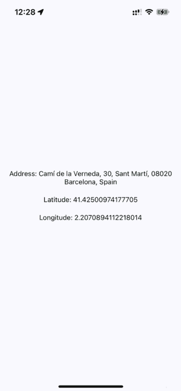
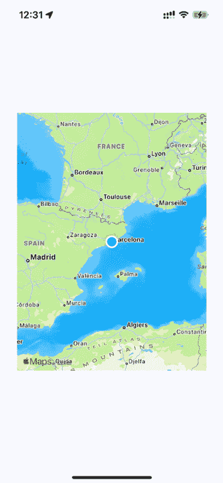
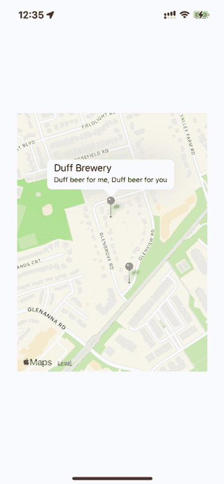
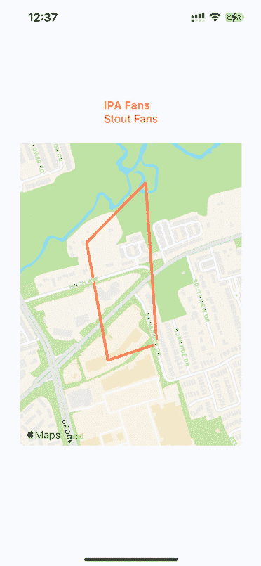
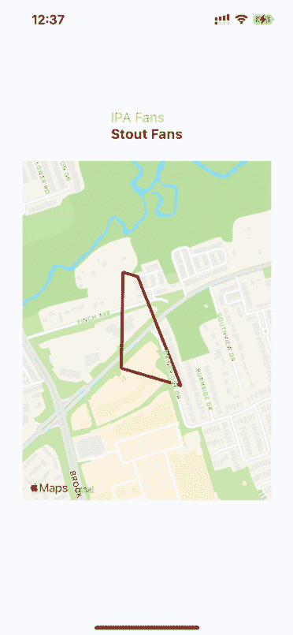

# 21

# 地理位置和地图

在本章中，您将了解 React Native 的地理位置和地图功能。您将从学习如何使用**地理位置 API**开始，然后继续使用`MapView`组件来绘制兴趣点和区域。为此，我们将使用`react-native-maps`包来实现地图。

本章的目标是概述 React Native 中可用的地理位置功能以及`react-native-maps`中的地图功能。

在本章中，我们将介绍我们将要涵盖的主题列表：

+   使用地理位置 API

+   渲染地图

+   标注兴趣点

# 技术要求

您可以在 GitHub 上找到本章的代码文件，链接为[`github.com/PacktPublishing/React-and-React-Native-5E/tree/main/Chapter2`](https://github.com/PacktPublishing/React-and-React-Native-5E/tree/main/Chapter22)1.

# 使用地理位置 API

网络应用用来确定用户位置的地理位置 API 也可以由 React Native 应用使用，因为相同的 API 已经被 polyfilled。除了地图之外，此 API 对于从移动设备的 GPS 获取精确坐标非常有用。然后，您可以使用这些信息向用户显示有意义的地理位置数据。

不幸的是，地理位置 API 返回的数据本身用处不大。您的代码必须进行一些工作，将其转换为有用的东西。例如，纬度和经度对用户来说没有意义，但您可以使用这些数据查找对用户有用的信息。这可能只是显示用户当前的位置那么简单。

让我们实现一个示例，使用 React Native 的**地理位置 API**查找坐标，然后使用这些坐标从 Google Maps API 中查找可读的地理位置信息。

在我们开始编码之前，让我们使用`npx create-expo-app`创建一个项目，然后添加位置模块：

```js
npx expo install expo-location 
```

接下来，我们需要在应用中配置位置权限。在移动应用中访问用户的位置需要用户明确授权。在本例的后续部分，我们将通过调用`Location.requestForegroundPermissionsAsync()`方法来实现这一点。这将向用户显示一个权限对话框，询问他们是否允许或拒绝位置访问。在继续使用位置方法之前，检查返回的状态以查看是否已授予权限非常重要。如果权限被拒绝，您应该在代码中优雅地处理它，并在必要时提示用户在应用设置中授权。

在真实的应用中，在我们请求权限之前，我们应该首先在应用配置中设置这些权限。我们可以通过向`app.json`文件添加插件来完成此操作：

```js
{
  "expo": {
    "plugins": [
      [
        "expo-location",
        {
          "locationAlwaysAndWhenInUsePermission": "Allow $(PRODUCT_NAME) to use your location."
        }
      ]
    ]
  }
} 
```

你应该尽早请求位置权限，例如当你的应用首次启动或当用户首次导航到需要位置信息的屏幕时。通过提前请求权限并妥善处理用户的选项，你可以确保你的应用按预期工作，同时尊重用户的隐私偏好。

当你有一个准备好的项目时，让我们看看 `App` 组件，你可以在这里找到它：[`github.com/PacktPublishing/React-and-React-Native-5E/tree/main/Chapter22/where-am-i/App.tsx`](https://github.com/PacktPublishing/React-and-React-Native-5E/tree/main/Chapter22/where-am-i/App.tsx)。这个组件的目标是在屏幕上渲染地理位置 API 返回的属性，以及查找用户的特定位置并显示它。

要从应用中获取位置，我们需要授予权限。在 `App.tsx` 中，我们已经调用了 `Location.requestForegroundPermissionsAsync()` 来实现这一点。

`setPosition()` 函数在几个地方用作回调，其任务是设置组件的状态。首先，`setPosition()` 设置经纬度坐标。通常，你不会直接显示这些数据，但这是一个示例，展示了作为地理位置 API 一部分可用的数据。其次，它使用 `latitude` 和 `longitude` 值来查找用户当前所在地的名称，使用的是 Google Maps API。

在示例中，`API_KEY` 值为空，你可以在以下链接获取：[`developers.google.com/maps/documentation/geocoding/start`](https://developers.google.com/maps/documentation/geocoding/start)。

`setPosition()` 回调与 `getCurrentPosition()` 一起使用，它仅在组件挂载时调用一次。你还在 `watchPosition()` 中使用 `setPosition()`，它会在用户的位置发生变化时调用回调。

iOS 模拟器和 Android Studio 允许你通过菜单选项更改位置。你不必每次想要测试更改位置时都在物理设备上安装你的应用。

让我们看看当位置数据加载后这个屏幕看起来像什么：



图 21.1：位置数据

获取的地址信息可能比经纬度数据更有用，对于需要查找周围建筑或公司的应用来说效果很好。甚至比物理地址文本更好的是，在地图上可视化用户的物理位置；你将在下一节中学习如何做到这一点。

# 渲染地图

来自 `react-native-maps` 的 `MapView` 组件是你在 React Native 应用中渲染地图的主要工具。它提供了广泛的工具来渲染地图、标记、多边形、热图等。

你可以在网站上找到有关 `react-native-maps` 的更多信息：[`github.com/react-native-maps/react-native-maps`](https://github.com/react-native-maps/react-native-maps)。

现在我们来实现一个基本的`MapView`组件，看看你能够得到什么：

```js
import { View, StatusBar } from "react-native";
import MapView from "react-native-maps";
import styles from "./styles";
StatusBar.setBarStyle("dark-content");
export default () => (
  <View style={styles.container}>
    <MapView style={styles.mapView} showsUserLocation followsUserLocation />
  </View>
); 
```

你传递给`MapView`的两个布尔属性为你做了很多工作。`showsUserLocation`属性会激活地图上的标记，表示运行此应用程序的设备的物理位置。`followsUserLocation`属性告诉地图在设备移动时更新位置标记。

这里是生成的地图：



图 21.2：当前位置

设备的当前位置在地图上被清楚地标记出来。默认情况下，兴趣点也会在地图上渲染。这些是用户附近的事物，以便他们可以看到周围的情况。

通常，在设置`showsUserLocation`时使用`followsUserLocation`是一个好主意。这使得地图缩放到用户所在的位置。

在下一节中，你将学习如何在你的地图上注释兴趣点。

# 注释兴趣点

**注释**正如其名：在基本地图地理之上渲染的附加信息。当你渲染`MapView`组件时，默认情况下你会得到注释。`MapView`组件可以渲染用户的当前位置以及用户周围的兴趣点。这里的挑战可能是你想要显示与你的应用程序相关的兴趣点，而不是默认渲染的那些。

在本节中，你将学习如何在地图上绘制特定位置的标记，以及如何在地图上绘制区域。

## 绘制点

让我们绘制一些当地的酿酒厂！这是你如何将注释传递给`MapView`组件的方法：

```js
<MapView
  style={styles.mapView}
  showsPointsOfInterest={false}
  showsUserLocation
  followsUserLocation
>
  <Marker
    title="Duff Brewery"
    description="Duff beer for me, Duff beer for you"
    coordinate={{
      latitude: 43.8418728,
      longitude: -79.086082,
    }}
  />
  {...}
</MapView> 
```

在这个例子中，我们通过将`showsPointsOfInterest`属性设置为`false`来放弃了这一功能。让我们看看这些酿酒厂的位置在哪里：



图 21.3：绘制点

当你按下显示地图上酿酒厂位置的标记时，会显示呼出窗口。你给`<Marker>`提供的`title`和`description`属性值用于渲染此文本。

## 绘制叠加层

在本章的最后部分，你将学习如何渲染区域叠加层。将区域想象为连接几个点的连线画，而一个点是一个单独的`纬度/经度`坐标。

区域可以服务于许多目的。在我们的例子中，我们将创建一个区域，显示我们更有可能找到 IPA 饮用者还是黑啤饮用者的地方。你可以点击此链接查看完整代码的样子：[`github.com/PacktPublishing/React-and-React-Native-5E/tree/main/Chapter22/plotting-overlays/App.tsx`](https://github.com/PacktPublishing/React-and-React-Native-5E/tree/main/Chapter22/plotting-overlays/App.tsx)。以下是代码的 JSX 部分的样子：

```js
 <View style={styles.container}>
      <View>
        <Text style={ipaStyles} onPress={onClickIpa}>
          IPA Fans
        </Text>
        <Text style={stoutStyles} onPress={onClickStout}>
          Stout Fans
        </Text>
      </View>
      <MapView
        style={styles.mapView}
        showsPointsOfInterest={false}
        initialRegion={{
          latitude: 43.8486744,
          longitude: -79.0695283,
          latitudeDelta: 0.002,
          longitudeDelta: 0.04,
        }}
      >
        {overlays.map((v, i) => (
          <Polygon
            key={i}
            coordinates={v.coordinates}
            strokeColor={v.strokeColor}
            strokeWidth={v.strokeWidth}
          />
        ))}
      </MapView>
    </View> 
```

区域数据由几个定义区域形状和位置的 `纬度/经度` 坐标组成。区域被放置在 `overlays` 状态变量中，我们将它们映射到 `Polygon` 组件。其余的代码主要关于处理当两个文本链接被按下时的状态。

默认情况下，IPA 区域的渲染方式如下：



图 21.4：IPA 粉丝

当按下 **Stout 粉丝** 按钮，IPA 覆盖层将从地图中移除，并添加 stout 区域：



图 21.5：Stout 粉丝

当你需要突出显示一个区域而不是一个 `纬度/经度` 点或地址时，覆盖层非常有用。例如，它可能是一个用于在所选区域或社区中寻找出租公寓的应用程序。

# 摘要

在本章中，你学习了 React Native 中的地理位置和地图绘制。地理位置 API 与其网络版本的工作方式相同。在 React Native 应用程序中使用地图的唯一可靠方法是安装第三方 `react-native-maps` 包。

你看到了基本的 `MapView` 组件配置以及它们如何跟踪用户的位置并显示相关的兴趣点。然后，你看到了如何绘制你自己的兴趣点和感兴趣的区域。

在下一章中，你将学习如何使用类似于 HTML 表单控件的 React Native 组件来收集用户输入。
