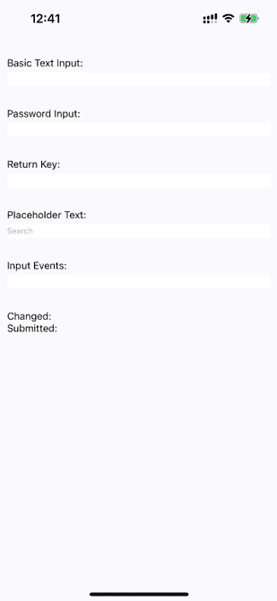
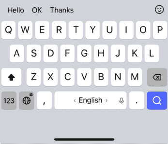
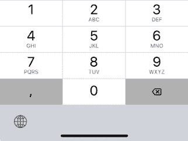
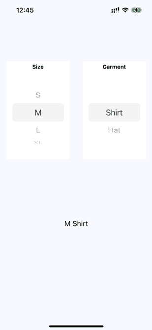
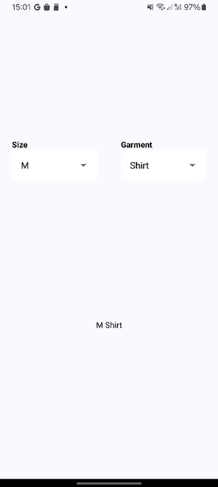
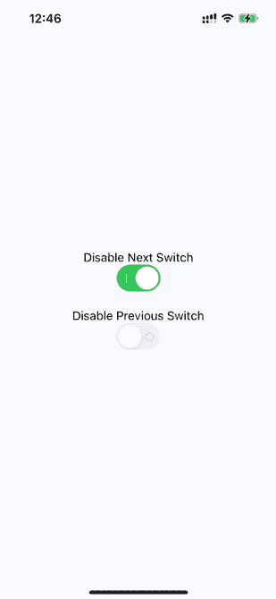
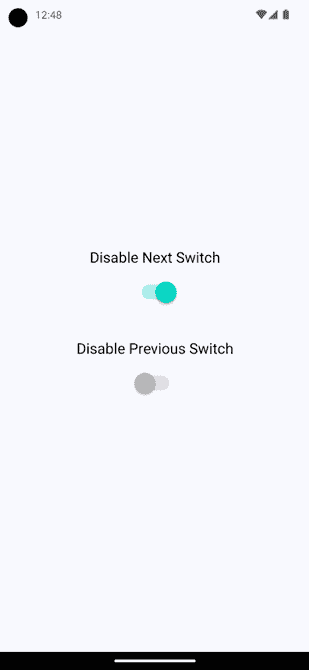
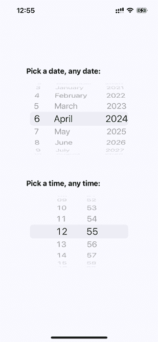
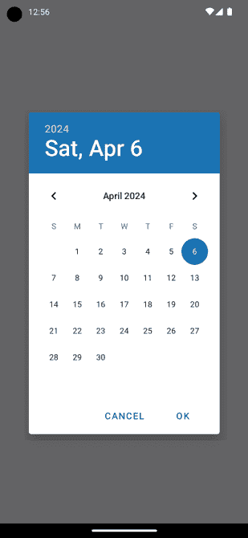

# 22

# 收集用户输入

在 Web 应用中，你可以从所有浏览器上看起来和表现相似的 HTML 表单元素中收集用户输入。在使用原生 UI 平台时，收集用户输入更为复杂。

在本章中，你将学习如何使用各种 React Native 组件来收集用户输入。这些包括文本输入、从选项列表中选择、复选框和日期/时间选择器。所有这些都在注册或登录流程以及购买表单的每个应用中使用。创建此类表单的经验非常有价值，本章将帮助你了解如何在未来的应用中创建任何表单。你将了解 iOS 和 Android 之间的差异以及如何为你的应用实现适当的抽象。

本章将涵盖以下主题：

+   收集文本输入

+   从选项列表中选择

+   在开和关之间切换

+   收集日期/时间输入

# 技术要求

你可以在 GitHub 上找到本章的代码文件，地址为[`github.com/PacktPublishing/React-and-React-Native-5E/tree/main/Chapter2`](https://github.com/PacktPublishing/React-and-React-Native-5E/tree/main/Chapter23)2。

# 收集文本输入

实现文本输入时有很多需要考虑的因素。例如，是否应该有占位文本？这是否是敏感数据，不应该在屏幕上显示？是否应该在用户移动到另一个字段时处理文本？

在 Web 应用中，有一个特殊的`<input>`HTML 元素，允许你收集用户输入。在 React Native 中，我们使用`TextInput`组件来达到这个目的。让我们构建一个示例，渲染几个`<TextInput>`组件的实例：

```js
function Input(props: InputProps) {
  return (
    <View style={styles.textInputContainer}>
      <Text style={styles.textInputLabel}>{props.label}</Text>
      <TextInput style={styles.textInput} {...props} />
    </View>
  );
} 
```

我们已经实现了`Input`组件，我们将多次重用它。让我们看看几个文本输入的使用案例：

```js
export default function CollectingTextInput() {
  const [changedText, setChangedText] = useState("");
  const [submittedText, setSubmittedText] = useState("");
  return (
    <View style={styles.container}>
      <Input label="Basic Text Input:" />
      <Input label="Password Input:" secureTextEntry />
      <Input label="Return Key:" returnKeyType="search" />
      <Input label="Placeholder Text:" placeholder="Search" />
      <Input
        label="Input Events:"
        onChangeText={(e) => {
          setChangedText(e);
        }}
        onSubmitEditing={(e) => {
          setSubmittedText(e.nativeEvent.text);
        }}
        onFocus={() => {
          setChangedText("");
          setSubmittedText("");
        }}
      />
      <Text>Changed: {changedText}</Text>
      <Text>Submitted: {submittedText}</Text>
    </View>
  );
} 
```

我不会深入探讨每个`<TextInput>`组件的功能；`Input`组件中有标签解释了这一点。让我们看看这些组件在屏幕上的样子：



图 22.1：文本输入的变体

纯文本输入显示已输入的文本。**密码输入**字段不显示任何字符。**占位文本**在输入为空时显示。**已更改**的文本状态也显示出来。你无法看到**已提交**的文本状态，因为我没有在虚拟键盘上按下**已提交**按钮之前截图。

让我们看看通过`returnKeyType`属性更改**返回键**文本的输入元素的虚拟键盘：



图 22.2：按键文本已更改的键盘

当键盘的**返回键**反映了用户按下它时将要发生的事情，用户会感到与应用程序更加协调。

另一个常见的用例是更改键盘类型。通过将`keyboardType`属性提供给`TextInput`组件，你将看到不同类型的键盘。当你需要输入 PIN 码或电子邮件地址时，这很方便。以下是一个`numeric`键盘的示例：



图 22.3：数字键盘类型

现在你已经熟悉了收集文本输入，是时候学习如何从选项列表中选择一个值了。

# 从选项列表中选择

在 Web 应用程序中，你通常使用`<select>`元素让用户从选项列表中进行选择。React Native 自带一个`Picker`组件，它在 iOS 和 Android 上都可用，但为了减少 React Native 应用程序的大小，Meta 团队决定在未来版本中删除它，并将`Picker`提取到自己的包中。要使用该包，首先，在一个干净的项目中运行以下命令：

```js
npx expo install @react-native-picker/picker 
```

根据用户所在的平台，对这个组件进行样式设置涉及一些技巧，所以让我们将这些内容全部隐藏在一个通用的`Select`组件中。以下是`Select.ios.js`模块：

```js
export default function Select(props: SelectProps) {
  return (
    <View style={styles.pickerHeight}>
      <View style={styles.pickerContainer}>
        <Text style={styles.pickerLabel}>{props.label}</Text>
        <Picker style={styles.picker} {...props}>
          {props.items.map((i) => (
            <Picker.Item key={i.label} {...i} />
          ))}
        </Picker>
      </View>
    </View>
  );
} 
```

对于一个简单的`Select`组件来说，这确实是一个很大的开销。实际上，要样式化 React Native 的`Picker`组件相当困难，因为它在 iOS 和 Android 上的外观完全不同。尽管如此，我们仍然希望使其更加跨平台。

这里是`Select.android.js`模块：

```js
export default function Select(props: SelectProps) {
  return (
    <View>
      <Text style={styles.pickerLabel}>{props.label}</Text>
      <Picker {...props}>
        {props.items.map((i) => (
          <Picker.Item key={i.label} {...i} />
        ))}
      </Picker>
    </View>
  );
} 
```

这是样式的样子：

```js
container: {
    flex: 1,
    flexDirection: "column",
    backgroundColor: "ghostwhite",
    justifyContent: "center",
  },
  pickersBlock: {
    flex: 2,
    flexDirection: "row",
    justifyContent: "space-around",
    alignItems: "center",
  },
  pickerHeight: {
    height: 250,
  }, 
```

如同通常的`container`和`pickersBlock`样式，我们定义了屏幕的基本布局。接下来，让我们看看`Select`组件的样式：

```js
 pickerContainer: {
    flex: 1,
    flexDirection: "column",
    alignItems: "center",
    backgroundColor: "white",
    padding: 6,
    height: 240,
  },
  pickerLabel: {
    fontSize: 14,
    fontWeight: "bold",
  },
  picker: {
    width: 150,
    backgroundColor: "white",
  },
  selection: {
    flex: 1,
    textAlign: "center",
  }, 
```

现在，你可以渲染你的`Select`组件。以下是`App.js`文件的样子：

```js
const sizes = [
  { label: "", value: null },
  { label: "S", value: "S" },
  { label: "M", value: "M" },
  { label: "L", value: "L" },
  { label: "XL", value: "XL" },
];
const garments = [
  { label: "", value: null, sizes: ["S", "M", "L", "XL"] },
  { label: "Socks", value: 1, sizes: ["S", "L"] },
  { label: "Shirt", value: 2, sizes: ["M", "XL"] },
  { label: "Pants", value: 3, sizes: ["S", "L"] },
  { label: "Hat", value: 4, sizes: ["M", "XL"] },
]; 
```

在这里，我们为我们的`Select`组件定义了默认值。让我们看看最终的`SelectingOptions`组件：

```js
export default function SelectingOptions() {
  const [availableGarments, setAvailableGarments] = useState<typeof garments>(
    []
  );
  const [selectedSize, setSelectedSize] = useState<string | null>(null);
  const [selectedGarment, setSelectedGarment] = useState<number | null>(null); 
```

使用这些钩子，我们已经实现了选择器的状态。接下来，我们将使用并将它们传递到组件中：

```js
 <View style={styles.container}>
      <View style={styles.pickersBlock}>
        <Select
          label="Size"
          items={sizes}
          selectedValue={selectedSize}
          onValueChange={(size: string) => {
            setSelectedSize(size);
            setSelectedGarment(null);
            setAvailableGarments(
              garments.filter((i) => i.sizes.includes(size))
            );
          }}
        />
        <Select
          label="Garment"
          items={availableGarments}
          selectedValue={selectedGarment}
          onValueChange={(garment: number) => {
            setSelectedGarment(garment);
          }}
        />
      </View>
      <Text style={styles.selection}>{selectedSize && selectedGarment && `${selectedSize} ${garments.find((i) => i.value === selectedGarment)?.label}`}</Text>
    </View> 
```

这个示例的基本思想是第一个选择器中选中的选项会改变第二个选择器中可用的选项。当第二个选择器改变时，标签会显示`selectedSize`和`selectedGarment`作为字符串。以下是屏幕的显示方式：



图 22.4：从选项列表中选择

**Size**选择器显示在屏幕的左侧。当**Size**值改变时，屏幕右侧**Garment**选择器中可用的值会改变，以反映尺寸的可用性。两个选择器之后会以字符串的形式显示当前的选择。

这是我们`app`在 Android 设备上的样子：



图 22.5：在 Android 上从选项列表中选择

当`Picker`组件的 iOS 版本渲染一个可滚动的选项列表时，Android 版本只提供打开对话框模态以选择选项的按钮。

在接下来的部分，你将了解在开和关状态之间切换的按钮。

# 在开和关之间切换

在网页表单中，您还会看到另一个常见元素，即复选框。例如，想想在您的设备上切换 Wi-Fi 或蓝牙。React Native 有一个`Switch`组件，在 iOS 和 Android 上都能工作。幸运的是，这个组件比`Picker`组件更容易样式化。让我们看看您可以实现的简单抽象，为您的开关提供标签：

```js
type CustomSwitchProps = SwitchProps & {
  label: string;
};
export default function CustomSwitch(props: CustomSwitchProps) {
  return (
    <View style={styles.customSwitch}>
      <Text>{props.label}</Text>
      <Switch {...props} />
    </View>
  );
} 
```

现在，让我们学习如何使用几个开关来控制应用程序状态：

```js
export default function TogglingOnAndOff() {
  const [first, setFirst] = useState(false);
  const [second, setSecond] = useState(false);
  return (
    <View style={styles.container}>
      <Switch
        label="Disable Next Switch"
        value={first}
        disabled={second}
        onValueChange={setFirst}
      />
      <Switch
        label="Disable Previous Switch"
        value={second}
        disabled={first}
        onValueChange={setSecond}
      />
    </View>
  );
} 
```

这两个开关相互切换对方的`disabled`属性。当第一个开关被切换时，会调用`setFirst()`函数，这将更新第一个状态值。根据`first`的当前值，它将被设置为`true`或`false`。第二个开关的工作方式相同，但它使用`setSecond()`和第二个状态值。

打开一个开关将禁用另一个开关，因为我们已经将每个开关的`disabled`属性值设置为另一个开关的状态。例如，第二个开关有`disabled={first}`，这意味着当第一个开关打开时，它将被禁用。以下是 iOS 上的屏幕截图：



图 22.6：iOS 上的开关切换

这是 Android 上的相同屏幕截图：



图 22.7：Android 上的开关切换

如您所见，我们的`CustomSwitch`组件在 Android 和 iOS 上实现了相同的功能，同时使用了一个组件来处理这两个平台。在下一节中，您将了解如何收集日期/时间输入。

# 收集日期/时间输入

在本章的最后部分，您将学习如何实现日期/时间选择器。React Native 文档建议使用`@react-native-community/datetimepicker`独立日期/时间选择器组件，这意味着处理组件之间的跨平台差异取决于您。

要安装`datetimepicker`，请在项目中运行以下命令：

```js
npx expo install @react-native-community/datetimepicker 
```

因此，让我们从 iOS 的`DatePicker`组件开始：

```js
export default function DatePicker(props: DatePickerProps) {
  return (
    <View style={styles.datePickerContainer}>
      <Text style={styles.datePickerLabel}>{props.label}</Text>
      <DateTimePicker
        mode="date"
        display="spinner"
        value={props.value}
        onChange={(event, date) => {
          if (date) {
            props.onChange(date);
          }
        }}
      />
    </View>
  );
} 
```

这个组件没有太多内容；它只是给`DateTimePicker`组件添加了一个标签。Android 版本的工作方式略有不同；更好的方法是使用**命令式 API**。让我们看看实现方式：

```js
export default function DatePicker({label, value, onChange }: DatePickerProps) {
  return (
    <View style={styles.datePickerContainer}>
      <Text style={styles.datePickerLabel}>{label}</Text>
      <Text
        onPress={() => {
          DateTimePickerAndroid.open({
            value: value,
            mode: "date",
            onChange: (event, date) => {
              if (event.type === "set" && date) {
                onChange(date);
              }
            },
          });
        }}
      >
        {value.toLocaleDateString()}
      </Text>
    </View>
  );
} 
```

两个日期选择器的关键区别在于，Android 版本不使用 iOS 中类似的 React Native 组件`DateTimePicker`。相反，我们必须使用命令式`DateTimePickerAndroid.open()` API。当用户点击我们组件渲染的日期文本并打开日期选择器对话框时，将触发此 API。好消息是，我们组件的这个部分隐藏了这个 API 在声明式组件后面。

我还实现了一个遵循此精确模式的时间选择器组件。因此，而不是在这里列出代码，我建议您从 [`github.com/PacktPublishing/React-and-React-Native-5E/tree/main/Chapter2`](https://github.com/PacktPublishing/React-and-React-Native-5E/tree/main/Chapter22) 下载本书的代码，这样您可以看到细微的差异并运行示例。

现在，让我们学习如何使用我们的日期和时间选择器组件：

```js
export default function CollectingDateTimeInput() {
  const [date, setDate] = useState(new Date());
  const [time, setTime] = useState(new Date());
  return (
    <View style={styles.container}>
      <DatePicker
        label="Pick a date, any date:"
        value={date}
        onChange={setDate}
      />
      <TimePicker
        label="Pick a time, any time:"
        value={time}
        onChange={setTime}
      />
    </View>
  );
} 
```

太棒了！现在，我们有了 `DatePicker` 和 `TimePicker` 组件，可以帮助我们在应用中选择日期和时间。此外，它们在 iOS 和 Android 上都适用。让我们看看选择器在 iOS 上的样子：



图 22.8：iOS 日期和时间选择器

如您所见，iOS 日期和时间选择器使用了您在本章早期学习过的 `Picker` 组件。Android 的选择器看起来大不相同；现在让我们来看看：



图 22.9：Android 日期选择器

Android 版本与 iOS 日期/时间选择器的做法完全不同，但我们可以在两个平台上使用相同的 `DatePicker` 组件。这就结束了本章的内容。

# 摘要

在本章中，我们学习了各种类似于我们习惯的网页表单元素的 React Native 组件。我们首先学习了文本输入以及每个文本输入都有自己的虚拟键盘需要考虑。接下来，我们学习了 `Picker` 组件，它允许用户从选项列表中选择一个项目。然后，我们学习了 `Switch` 组件，它有点像复选框。有了这些组件，您将能够构建任何复杂性的表单。

在最后一节中，我们学习了如何实现适用于 iOS 和 Android 的通用日期/时间选择器。在下一章中，我们将学习 React Native 中的模态对话框。
