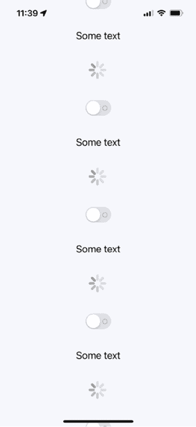
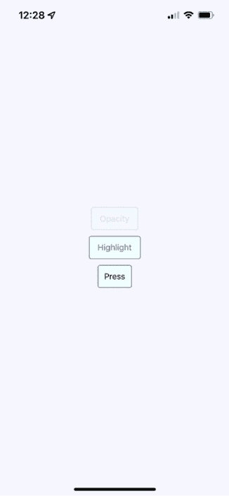
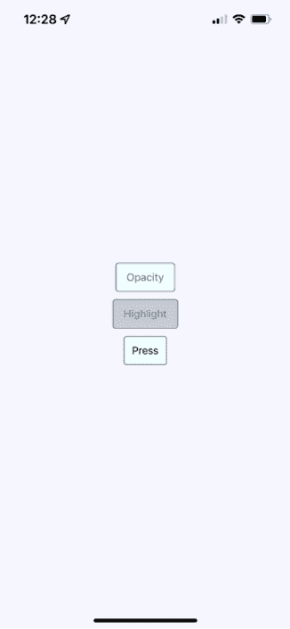
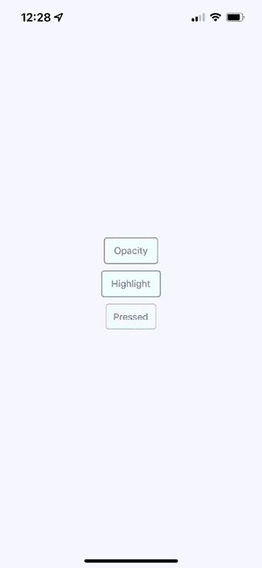
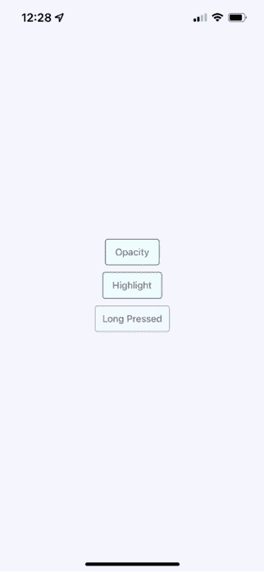
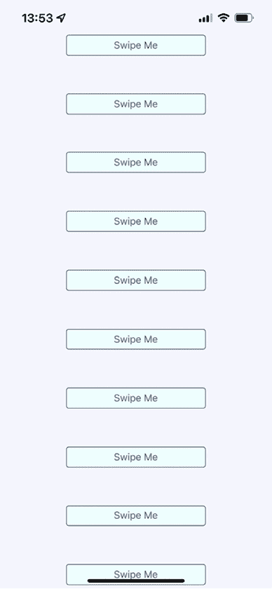
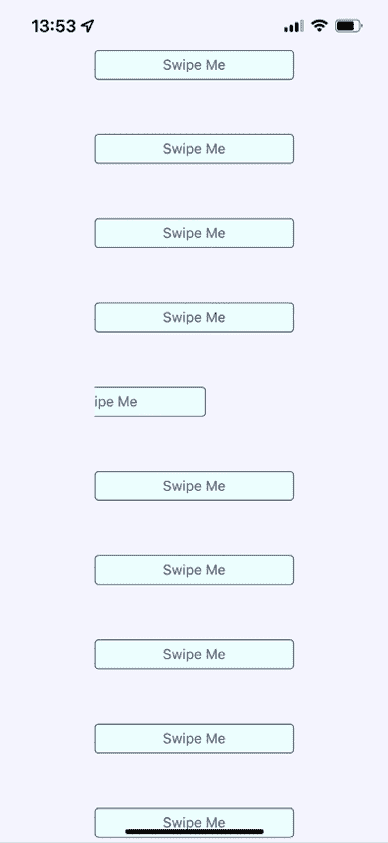

# 第二十三章：响应用户手势

你在这本书中迄今为止实现的全部示例都依赖于用户手势。在传统的网络应用中，你主要处理鼠标事件。然而，触摸屏依赖于用户用手指操纵元素，这与鼠标操作有根本的不同。

在本章中，首先，你将学习滚动。这可能是除了触摸之外最常见的手势。然后，你将学习在用户与你的组件交互时提供适当的反馈级别。最后，你将实现可滑动的组件。

本章的目标是向你展示 React Native 内部的 **手势响应系统** 如何工作，以及该系统通过组件暴露的一些方式。

在本章中，我们将涵盖以下主题：

+   用手指滚动

+   提供触觉反馈

+   使用可滑动和可取消的组件

# 技术要求

你可以在 GitHub 上找到本章的代码文件，地址为 [`github.com/PacktPublishing/React-and-React-Native-5E/tree/main/Chapter2`](https://github.com/PacktPublishing/React-and-React-Native-5E/tree/main/Chapter25)。

# 用手指滚动

在网络应用中，滚动是通过使用鼠标指针来回拖动滚动条或上下滚动，或者通过旋转鼠标滚轮来完成的。这在移动设备上不起作用，因为没有鼠标。所有操作都由屏幕上的手势控制。

例如，如果你想向下滚动，你用你的拇指或食指通过在屏幕上移动手指来物理地向上拉内容。

这样的滚动很难实现，但它变得更复杂。当你在一个移动屏幕上滚动时，会考虑拖动动作的速度。你快速拖动屏幕，然后放手，屏幕会根据你移动手指的速度继续滚动。你也可以在滚动过程中触摸屏幕来停止滚动。

幸运的是，你不必处理大部分这些事情。`ScrollView` 组件为你处理了大部分滚动复杂性。实际上，你已经在 *第二十章*，*渲染项目列表* 中使用了 `ScrollView` 组件。`ListView` 组件已经内置了 `ScrollView`。

你可以通过实现手势生命周期方法来调整用户交互的低级部分。你可能永远不需要这样做，但如果你对此感兴趣，你可以在 [`reactnative.dev/docs/gesture-responder-system`](https://reactnative.dev/docs/gesture-responder-system) 上阅读有关内容。

你可以在 `ListView` 之外使用 `ScrollView`。例如，如果你只是渲染任意内容，如文本和其他小部件：不是列表，换句话说：你只需将其包裹在 `<ScrollView>` 中。以下是一个例子：

```js
export default function App() {
  return (
    <View style={styles.container}>
      <ScrollView style={styles.scroll}>
        {new Array(20).fill(null).map((v, i) => (
          <View key={i}>
            <Text style={[styles.scrollItem, styles.text]}>Some text</Text>
            <ActivityIndicator style={styles.scrollItem} size="large" />
            <Switch style={styles.scrollItem} />
          </View>
        ))}
      </ScrollView>
    </View>
  );
} 
```

`ScrollView` 组件本身并不很有用：它存在是为了包裹其他组件。它需要高度才能正确地工作。以下是滚动样式的样子：

```js
scroll: {
    height: 1,
    alignSelf: "stretch",
  }, 
```

`height`属性设置为`1`，但`alignSelf`的拉伸值允许项目正确显示。以下是最终结果的样子：



图 23.1：ScrollView

当你向下拖动内容时，屏幕右侧有一个垂直滚动条。如果你运行这个示例，你可以尝试各种手势，比如让内容自动滚动然后停止。

当用户在屏幕上滚动内容时，他们会收到视觉反馈。用户在触摸屏幕上的某些元素时也应该收到视觉反馈。

# 提供触摸反馈

在这本书中，你迄今为止使用的 React Native 示例已经使用了纯文本作为按钮或链接。在 Web 应用程序中，为了让文本看起来可以点击，你只需用适当的链接将其包裹起来。React Native 中没有链接组件，所以你可以将文本样式设置为按钮样式。

尝试在移动设备上将文本样式设置为链接的问题在于它们太难按了。按钮提供了更大的目标供手指操作，并且更容易应用触摸反馈。

让我们给一些文本设置按钮样式。这是一个很好的第一步，因为它使文本看起来可以触摸。但你也想当用户开始与按钮交互时给用户提供视觉反馈。React Native 提供了几个组件来帮助实现这一点：

+   `TouchableOpacity`

+   `TouchableHighlight`

+   可按压 API

但在深入代码之前，让我们看看当用户与这些组件交互时，它们在视觉上看起来是什么样子，从`TouchableOpacity`开始：



图 23.2：TouchableOpacity

这里渲染了三个按钮。顶部的一个，标有**不透明度**，当前正被用户按下。按钮在被按下时变暗，这为用户提供重要的视觉反馈。

让我们看看当按下**高亮**按钮时它看起来是什么样子：



图 23.3：可触摸高亮

与在按下时改变不透明度不同，`TouchableHighlight`组件在按钮上添加了一个高亮层。在这种情况下，它使用的是比字体和边框颜色中使用的板岩灰色更透明的版本。

最后一个按钮的例子是由`Pressable`组件提供的。Pressable API 被引入作为核心组件包装器，允许对其定义的任何子组件的不同按下交互阶段。使用这样的组件，我们可以处理`onPressIn`、`onPressOut`（我们将在下一章中探讨）和`onLongPress`回调，并实现我们想要的任何触摸反馈。让我们看看点击`PressableButton`时它看起来是什么样子：



图 23.4：可按压按钮

如果我们继续按住这个按钮，我们将得到一个`onLongPress`事件，按钮将更新：



图 23.5：长按按钮

实际上使用哪种方法并不重要。重要的是，你为用户提供了适当的触摸反馈，让他们在与按钮交互时感到舒适。实际上，你可能会在同一个应用中使用所有这些方法，但用于不同的事情。

让我们创建一个`OpacityButton`和`HighlightButton`组件，这使得使用前两种方法变得容易：

```js
type ButtonProps = {
  label: string;
  onPress: () => void;
};
export const OpacityButton = ({ label, onPress }: ButtonProps) => {
  return (
    <TouchableOpacity
      style={styles.button}
      onPress={onPress}
      activeOpacity={0.5}
    >
      <Text style={styles.buttonText}>{label}</Text>
    </TouchableOpacity>
  );
};
export const HighlightButton = ({ label, onPress }: ButtonProps) => {
  return (
    <TouchableHighlight
      style={styles.button}
      underlayColor="rgba(112,128,144,0.3)"
      onPress={onPress}
    >
      <Text style={styles.buttonText}>{label}</Text>
    </TouchableHighlight>
  );
}; 
```

这里是创建此按钮所使用的样式：

```js
button: {
    padding: 10,
    margin: 5,
    backgroundColor: "azure",
    borderWidth: 1,
    borderRadius: 4,
    borderColor: "slategrey",
  },
  buttonText: {
    color: "slategrey",
  }, 
```

现在让我们看看基于 Pressable API 的按钮：

```js
const PressableButton = () => {
  const [text, setText] = useState("Not Pressed");
  return (
    <Pressable
      onPressIn={() => setText("Pressed")}
      onPressOut={() => setText("Press")}
      onLongPress={() => {
        setText("Long Pressed");
      }}
      delayLongPress={500}
      style={({ pressed }) => [
        {
          opacity: pressed ? 0.5 : 1,
        },
        styles.button,
      ]}
    >
      <Text>{text}</Text>
    </Pressable>
  );
}; 
```

这里是如何将这些按钮放入主应用模块中的：

```js
export default function App() {
  return (
    <View style={styles.container}>
      <OpacityButton onPress={() => {}} label="Opacity" />
      <HighlightButton onPress={() => {}} label="Highlight" />
      <PressableButton />
    </View>
  );
} 
```

注意，`onPress` 回调实际上并没有做任何事情：我们传递它们是因为它们是一个必需的属性。

在下一节中，你将了解当用户在屏幕上滑动元素时提供反馈。

# 使用可滑动和可取消组件

与移动网页应用相比，原生移动应用更容易使用的一部分原因是它们感觉更直观。使用手势，你可以快速了解事物的工作方式。例如，用手指在屏幕上滑动一个元素是一个常见的动作，但这个动作必须是可发现的。

假设你正在使用一个应用，并且你并不完全确定屏幕上的某个功能是什么。所以，你用手指按下并尝试拖动元素。它开始移动。不确定会发生什么，你抬起手指，元素就回到了原位。你刚刚发现了这个应用程序的一部分是如何工作的。

你将使用`Scrollable`组件来实现这种**可滑动**和**可取消**的行为。你可以创建一个相对通用的组件，允许用户将文本从屏幕上滑动掉，当这种情况发生时，调用回调函数。在我们查看通用组件本身之前，让我们看看将渲染滑动组件的代码：

```js
export default function SwipableAndCancellable() {
  const [items, setItems] = useState(
    new Array(10).fill(null).map((v, id) => ({ id, name: "Swipe Me" }))
  );
  function onSwipe(id: number) {
    return () => {
      setItems(items.filter((item) => item.id !== id));
    };
  }
  return (
    <View style={styles.container}>
      {items.map((item) => (
        <Swipeable
          key={item.id}
          onSwipe={onSwipe(item.id)}
          name={item.name}
          width={200}
        />
      ))}
    </View>
  );
} 
```

这将在屏幕上渲染 10 个`<Swipeable>`组件。让我们看看这会是什么样子：



图 23.6：带有可滑动组件的屏幕

现在，如果你开始向左滑动这些项目之一，它就会移动。下面是这个动作的样子：



图 23.7：已滑动的组件

如果你没有滑动足够远，手势将被取消，项目将回到原位，正如预期的那样。如果你完全滑动，项目将从列表中完全移除，屏幕上的项目将填充空出的空间。

现在，让我们看看`Swipeable`组件本身：

```js
type SwipeableProps = {
  name: string;
  width: number;
  onSwipe: () => void;
};
export default function Swipeable({ name, width, onSwipe }: SwipeableProps) {
  function onScroll(e: NativeSyntheticEvent<NativeScrollEvent>) {
    console.log(e.nativeEvent.contentOffset.x);
    e.nativeEvent.contentOffset.x >= width && onSwipe();
  }
  return (
    <View style={styles.swipeContainer}>
      <ScrollView
        horizontal
        snapToInterval={width}
        showsHorizontalScrollIndicator={false}
        scrollEventThrottle={10}
        onScroll={onScroll}
      >
        <View style={[styles.swipeItem, { width }]}>
          <Text style={styles.swipeItemText}>{name}</Text>
        </View>
        <View style={[styles.swipeBlank, { width }]} />
      </ScrollView>
    </View>
  );
} 
```

组件接受`width`属性来指定宽度本身，`snapToInterval`来创建具有滑动取消的翻页行为，以及处理我们可以在其中调用`onSwipe`回调以从列表中删除项目的距离。

要启用向左滑动，我们需要在包含文本的组件旁边添加一个空白组件。以下是用于此组件的样式：

```js
 swipeContainer: {
    flex: 1,
    flexDirection: "row",
    width: 200,
    height: 30,
    marginTop: 50,
  },
  swipeItem: {
    height: 30,
    backgroundColor: "azure",
    justifyContent: "center",
    borderWidth: 1,
    borderRadius: 4,
    borderColor: "slategrey",
  },
  swipeItemText: {
    textAlign: "center",
    color: "slategrey",
  },
  swipeItemBlank: {
    height: 30,
  }, 
```

`swipeItemBlank`样式与`swipeItem`具有相同的高度，但除此之外没有其他内容。它是不可见的。

我们现在已经涵盖了本章的所有主题。

# 摘要

在本章中，我们介绍了在原生平台上的手势与移动网页平台相比有显著差异的观点。我们首先查看`ScrollView`组件，以及它如何通过为包装组件提供原生滚动行为来简化生活。

接下来，我们花了一些时间来实现带有触觉反馈的按钮。这是在移动网页上正确实现的一个棘手领域。我们学习了如何使用`TouchableOpacity`、`TouchableHighlight`和`Pressable` API 组件来完成这项工作。

最后，我们实现了一个通用的`Swipeable`组件。滑动是一个常见的移动模式，它允许用户发现事物的工作方式，而不会感到害怕。

在下一章中，我们将学习如何使用 React Native 控制动画。
