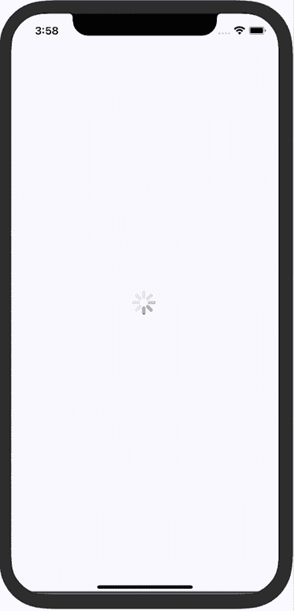
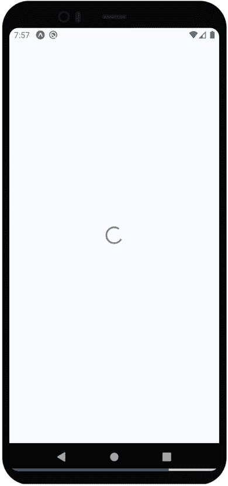
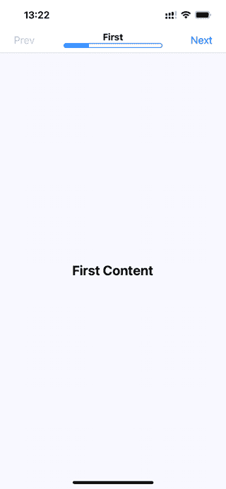
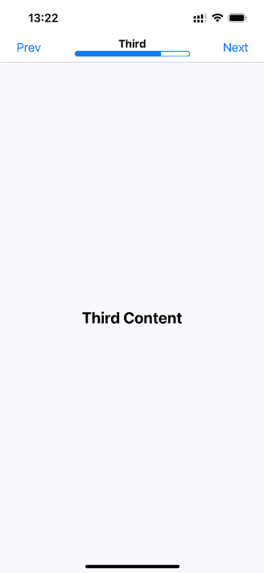

# 24

# 显示进度

本章全部关于向用户传达进度。React Native 有不同类型的组件，用于处理你想要传达的不同类型的进度。首先，你将学习为什么需要在应用中传达进度。然后，你将学习如何实现进度指示器和进度条。最后，你将看到具体的示例，展示如何在数据加载时使用进度指示器进行导航，以及如何使用进度条来传达一系列步骤中的当前位置。

本章涵盖了以下内容：

+   理解进度和可用性

+   指示进度

+   测量进度

+   探索导航指示器

+   步骤进度

# 技术要求

你可以在 GitHub 上找到本章的代码文件，地址为[`github.com/PacktPublishing/React-and-React-Native-5E/tree/main/Chapter2`](https://github.com/PacktPublishing/React-and-React-Native-5E/tree/main/Chapter21)。

# 理解进度和可用性

想象一下，你有一个没有窗户且不发出声音的微波炉。与它交互的唯一方式是按下标有“烹饪”的按钮。这个设备听起来可能很荒谬，但这就是许多软件用户面临的情况：没有进度指示。微波炉在烹饪吗？如果是，我们怎么知道它什么时候会完成？

改善微波炉状况的一种方法是在其中添加蜂鸣声。这样，用户在按下烹饪按钮后就能得到反馈。你已经克服了一个障碍，但用户仍然会问，“我的食物什么时候能准备好？”在你破产之前，你最好添加某种进度测量显示，比如计时器。

并非 UI 程序员不理解这种可用性关注的基本原则；只是他们有事情要做，这类事情在优先级上只是被忽略了。在 React Native 中，有组件可以给用户提供不确定的进度反馈和精确的进度测量。如果你想要良好的用户体验，始终将这些事情作为首要任务是明智的。

现在你已经理解了进度在可用性中的作用，是时候学习如何在 React Native UI 中指示进度了。

# 指示进度

在本节中，你将学习如何使用`ActivityIndicator`组件。正如其名称所暗示的，当你需要向用户指示正在发生某事时，你将渲染此组件。实际的进度可能是不确定的，但至少你有一个标准化的方式来显示正在发生某事，尽管目前还没有结果可以显示。

让我们创建一个示例，以便你可以看到这个组件的外观。以下是`App`组件：

```js
import React from "react";
import { View, ActivityIndicator } from "react-native";
import styles from "./styles";
export default function App() {
  return (
    <View style={styles.container}>
      <ActivityIndicator size="large" />
    </View>
  );
} 
```

`<ActivityIndicator />`组件是平台无关的。以下是它在 iOS 上的外观：



图 24.1：iOS 上的活动指示器

它在屏幕中间渲染一个动画旋转器。这是在`size`属性中指定的较大旋转器。`ActivityIndicator`旋转器也可以是小的，如果您在另一个较小的元素内部渲染它，这更有意义。

现在，让我们看看这在一个 Android 设备上的样子：



图 24.2：Android 上的活动指示器

旋转器的样子不同，正如它应该的那样，但您的应用在两个平台上传达了相同的信息：您正在等待某事。

此示例会无限旋转。但不用担心：接下来会有一个更现实的进度指示器示例，向您展示如何处理导航和加载 API 数据。

# 探索导航指示器

在本章的早期部分，您已经了解了`ActivityIndicator`组件。在本节中，您将学习如何在加载数据的程序导航中使用它。例如，用户从页面或屏幕一导航到页面二。然而，页面二需要从 API 获取数据，以便向用户显示。因此，当这个网络调用正在进行时，显示一个进度指示器比显示一个没有有用信息的屏幕更有意义。

做这件事实际上有点棘手，因为您必须确保每次用户导航到该屏幕时，屏幕所需的数据都是从 API 中获取的。您的目标应该是以下这些：

+   让`Navigator`组件自动获取即将渲染的场景的 API 数据。

+   使用 API 调用返回的 promise 作为显示旋转器和在 promise 解析后隐藏它的手段。

由于您的组件可能不关心是否显示旋转器，让我们将其实现为一个通用的`Wrapper`组件：

```js
export function LoadingWrapper({ children }: Props) {
  const [loading, setLoading] = useState(true);
  useEffect(() => {
    setTimeout(() => {
      setLoading(false);
    }, 1000);
  }, []);
  if (loading) {
    return (
      <View style={styles.container}>
        <ActivityIndicator size="large" />
      </View>
    );
  } else {
    return children;
  }
} 
```

此`LoadingWrapper`组件接受一个`children`组件，并在`loading`条件下返回它（即渲染）。它有一个带有超时的`useEffect()`钩子，当它解析时，它会将`loading`状态更改为`false`。如您所见，`loading`状态决定了是渲染旋转器还是`children`组件。

在`LoadingWrapper`组件已经就位的情况下，让我们看看您将使用`react-navigation`的第一个屏幕组件：

```js
const First = ({ navigation }: Props) => (
  <LoadingWrapper>
    <View style={styles.container}>
      <Button title="Second" onPress={() => navigation.navigate("Second")} />
      <Button title="Third" onPress={() => navigation.navigate("Third")} />
    </View>
  </LoadingWrapper>
); 
```

此组件渲染了一个由我们之前创建的`LoadingWrapper`组件包裹的布局。它包裹了整个屏幕，以便在`setTimeout`方法挂起时显示一个旋转器。这是一种有用的方法，可以在一个地方隐藏额外的逻辑，并在每个页面上重用它。在实际应用中，您可以通过传递额外的属性到`LoadingWrapper`来完全控制该屏幕的`loading`状态。

# 测量进度

仅指示进度正在进行的缺点是用户看不到结束的迹象。这会导致不安的感觉，就像你在没有计时器的微波炉里等待食物烹饪时一样。当你知道已经完成了多少进度以及还剩下多少进度时，你会感觉更好。这就是为什么在可能的情况下，始终使用确定性进度条会更好。

与`ActivityIndicator`组件不同，React Native 中没有跨平台的进度条组件。因此，我们将使用`react-native-progress`库来渲染进度条。

在过去，React-Native 有专门用于显示 iOS 和 Android 进度条的组件，但由于 React-Native 的大小优化，Meta 团队正在努力将这些组件移动到单独的包中。因此，`ProgressViewIOS`和`ProgressBarAndroid`已经被移动到 React-Native 库之外。

现在，让我们构建应用程序将使用的`ProgressBar`组件：

```js
import * as Progress from "react-native-progress";
type ProgressBarProps = {
  progress: number;
};
export default function ProgressBar({ progress }: ProgressBarProps) {
  return (
    <View style={styles.progress}>
      <Text style={styles.progressText}>{Math.round(progress * 100)}%</Text>
      <Progress.Bar width={200} useNativeDriver progress={progress} />
    </View>
  );
} 
```

`ProgressBar`组件接受`progress`属性并渲染标签和进度条。《Progress.Bar />`组件接受一组属性，但我们只需要`width`、`progress`和`useNativeDriver`（用于更好的动画）。现在，让我们将这个组件用于`App`组件：

```js
export default function MeasuringProgress() {
  const [progress, setProgress] = useState(0);
  useEffect(() => {
       let timeoutRef: NodeJS.Timeout | null = null;
    function updateProgress() {
         setProgress((currentProgress) => {
        if (currentProgress < 1) {
          return currentProgress + 0.01;
        } else {
          return 0;
        }
      });
    timeoutRef = setTimeout(updateProgress, 100);
    }
    updateProgress();
    return () => {
      timeoutRef && clearTimeout(timeoutRef);
    };
  }, []);
  return (
    <View style={styles.container}>
      <ProgressBar progress={progress} />
    </View>
  );
} 
```

初始时，`<ProgressBar>`组件渲染为 0%。在`useEffect()`钩子中，`updateProgress()`函数使用计时器来模拟你想要显示进度的真实过程。

在现实世界中，你可能永远不会使用计时器的模拟。然而，在某些特定场景下，这种方法可能非常有价值，例如在显示统计数据或监控文件上传到服务器的进度时。在这些情况下，即使你并不依赖于直接的计时器，你仍然可以访问到当前进度值，并可以使用它。

下面是这个屏幕的样子：


图 24.3：进度条

显示进度的定量度量很重要，这样用户就可以判断某件事需要多长时间。在下一节中，你将学习如何使用步骤进度条来显示用户在导航屏幕中的位置。

# 步骤进度

在这个最后的例子中，你将构建一个应用程序，显示用户通过预定义步骤的进度。例如，将表单分成几个逻辑部分并按这种方式组织它们，当用户完成一个部分时，他们就可以移动到下一个步骤。进度条对用户来说是一个有用的反馈。

你将在导航栏中插入进度条，位于标题下方，这样用户就可以知道他们已经走了多远以及还剩下多远。你还将重用本章前面使用的`ProgressBar`组件。

让我们先看看结果。在这个应用程序中，用户可以导航的屏幕有四个。这是**第一页**（场景）的样子：



图 24.4：第一个屏幕

标题下的进度条反映了用户已经完成了导航的 25%。让我们看看**第三**个屏幕的样子：



图 24.5：第三个屏幕

进度更新以反映用户在路由堆栈中的位置。让我们看看这里的`App`组件：[`github.com/PacktPublishing/React-and-React-Native-5E/blob/main/Chapter21/step-progress-new/App.tsx`](https://github.com/PacktPublishing/React-and-React-Native-5E/blob/main/Chapter21/step-progress-new/App.tsx)。

此应用有四个屏幕。渲染每个屏幕的组件存储在`routes`常量中，然后使用`createNativeStackNavigator()`配置堆栈导航器。创建`routes`数组的原因是它可以由`initialParams`传递给每个路由的`progress`参数使用。为了计算进度，我们取当前路由索引作为路由长度的值。

例如，`Second`位于数字 2 的位置（索引为 1 + 1），数组的长度为 4。这将使进度条达到 50%。

此外，**下一页**和**上一页**按钮调用`navigation.navigate()`时必须传递`routeName`，因此我们在`screenOptions`处理程序中添加了`nextRouteName`和`prevRouteName`变量。

摘要

在本章中，你学习了如何向用户展示幕后正在发生的事情。首先，我们讨论了为什么显示进度对于应用程序的可用性很重要。然后，我们实现了一个基本的屏幕，指示正在进行的进度。之后，我们实现了一个`ProgressBar`组件，用于测量特定的进度量。

指示器适用于不确定的进度。我们实现了在网络调用挂起时显示进度指示器的导航。在最后一节中，我们实现了一个进度条，显示了用户在预定义的步骤中的位置。

在下一章中，我们将探讨 React Native 地图和地理位置数据在实际中的应用。
