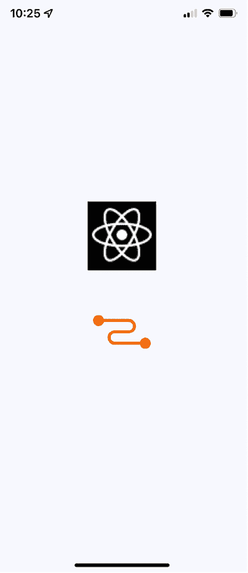
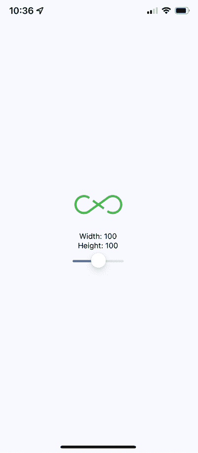
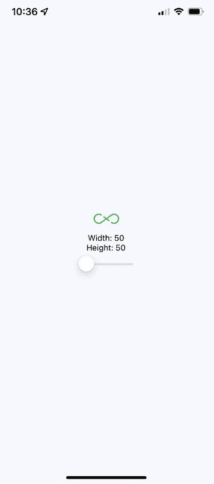
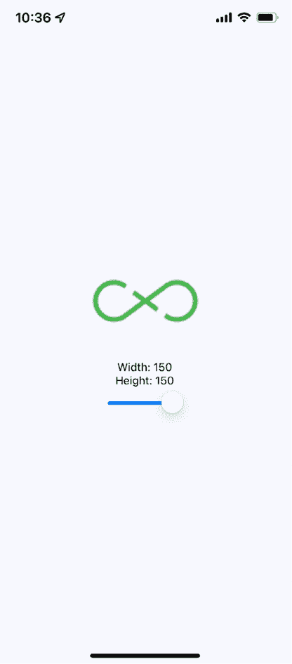
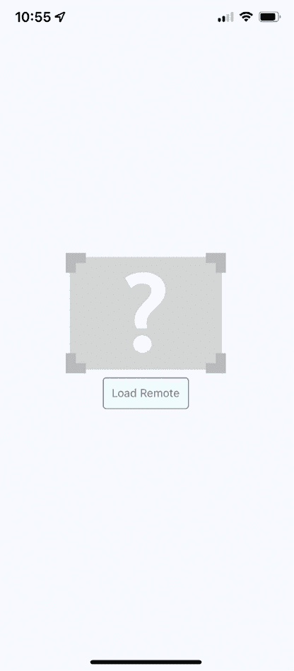
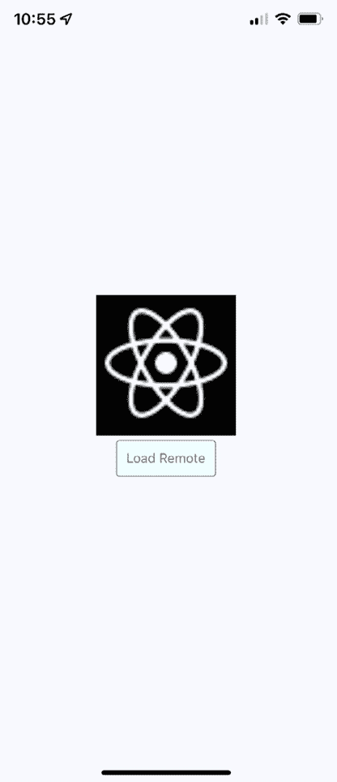
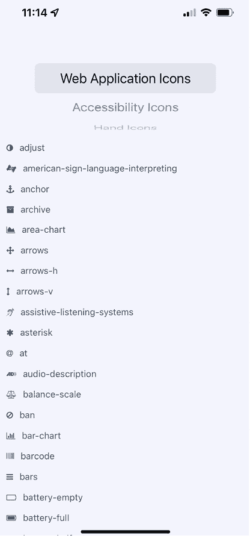

# 27

# 控制图像显示

到目前为止，本书中的示例还没有在移动屏幕上渲染任何图像。这并不反映移动应用程序的现实。Web 应用程序显示了很多图像。如果有什么不同的话，原生移动应用程序比 Web 应用程序更依赖于图像，因为当您有限的空间时，图像是一种强大的工具。

在本章中，您将学习如何使用 React Native 的`Image`组件，从加载不同来源的图像开始。然后，您将学习如何使用`Image`组件来调整图像大小，以及如何为懒加载的图像设置占位符。最后，您将学习如何使用`@expo/vector-icons`包实现图标。这些部分涵盖了在应用程序中使用图像和图标的最常见用例。

我们将在本章中介绍以下主题：

+   加载图像

+   调整图像大小

+   懒加载图像

+   渲染图标

# 技术要求

您可以在 GitHub 上找到本章的代码和图像文件，网址为[`github.com/PacktPublishing/React-and-React-Native-5E/tree/main/Chapter27`](https://github.com/PacktPublishing/React-and-React-Native-5E/tree/main/Chapter27)。

# 加载图像

让我们首先弄清楚如何加载图像。您可以像任何其他 React 组件一样渲染`<Image>`组件并传递其属性。但这个特定的组件需要图像 blob 数据才能发挥作用。**BLOB**（代表**Binary Large Object**，即二进制大对象）是一种用于存储大型、非结构化二进制数据的数据类型。BLOB 通常用于存储多媒体文件，如图像、音频和视频。

让我们看看一些代码：

```js
const reactLogo = "https://reactnative.dev/docs/assets/favicon.png";
const relayLogo = require("./assets/relay.png");
export default function App() {
  return (
    <View style={styles.container}>
      <Image style={styles.image} source={{ uri: reactLogo }} />
      <Image style={styles.image} source={relayLogo} />
    </View>
  );
} 
```

有两种方法可以将 blob 数据加载到`<Image>`组件中。第一种方法是从网络中加载图像数据。这是通过将具有**URI**属性的对象传递给`source`代码来完成的。本例中的第二个`<Image>`组件正在使用本地图像文件。它是通过调用`require()`并将结果传递给`source`代码来实现的。

现在，让我们看看渲染结果是什么样的：



图 27.1：图像加载

这是这些图像使用的样式：

```js
 image: {
    width: 100,
    height: 100,
    margin: 20,
  }, 
```

注意，如果没有设置`width`和`height`样式属性，图像将不会渲染。在下一节中，您将了解当设置`width`和`height`值时图像缩放是如何工作的。

# 调整图像大小

`Image`组件的`width`和`height`样式属性决定了屏幕上渲染的大小。例如，您可能需要在某个时候处理分辨率比您希望在 React Native 应用程序中显示的更大的图像。只需在`Image`上设置`width`和`height`样式属性就足以正确缩放图像。

让我们看看一些代码，这些代码允许您使用控件动态调整图像的尺寸：

```js
export default function App() {
  const source = require("./assets/flux.png");
  const [width, setWidth] = useState(100);
  const [height, setHeight] = useState(100);
  return (
    <View style={styles.container}>
      <Image source={source} style={{ width, height }} />
      <Text>Width: {width}</Text>
      <Text>Height: {height}</Text>
      <Slider
        style={styles.slider}
        minimumValue={50}
        maximumValue={150}
        value={width}
        onValueChange={(value) => {
          setWidth(value);
          setHeight(value);
        }}
      />
    </View>
  );
} 
```

如果您使用默认的 100 x 100 维度，图像看起来是这样的：



图 27.2：100 x 100 图像

这里是缩小后的图像版本：



图 27.3：50 x 50 图像

最后，这里是一个放大后的图像版本：



图 27.4：150 x 150 图像

有一个`resizeMode`属性可以传递给`Image`组件。这决定了缩放后的图像如何适应实际组件的尺寸。您将在本章的*渲染图标*部分看到这个属性的用法。

如您所见，图像的尺寸由`width`和`height`样式属性控制。在应用运行时，可以通过更改这些值来调整图像大小。在下一节中，您将学习如何懒加载图像。

# 懒加载图像

有时，您可能不希望在图像渲染的精确时刻加载图像；例如，您可能正在渲染屏幕上尚未可见的内容。大多数时候，在图像实际可见之前从网络上获取图像源是完全可以接受的。但如果您正在微调应用程序并发现通过网络加载大量图像会导致性能问题，您可以使用懒加载策略。

我认为在移动环境中更常见的用例是处理您已经渲染了一个或多个图像，但网络响应缓慢的场景。在这种情况下，您可能希望渲染一个占位图，以便用户立即看到一些内容，而不是空白空间。那么，让我们开始吧。

首先，您可以实现一个抽象，它封装了加载后要显示的实际图像。以下是该代码：

```js
const placeholder = require("./assets/placeholder.png");
type PlaceholderProps = {
  loaded: boolean;
  style: StyleProp<ImageStyle>;
};
function Placeholder({ loaded, style }: PlaceholderProps) {
  if (loaded) {
    return null;
  } else {
    return <Image style={style} source={placeholder} />;
  }
} 
```

现在，在这里，您可以看到占位图仅在原始图像未加载时才会被渲染：

```js
type Props = {
  style: StyleProp<ImageStyle>;
  resizeMode: ImageProps["resizeMode"];
  source: ImageSourcePropType | null;
};
export default function LazyImage({ style, resizeMode, source }: Props) {
  const [loaded, setLoaded] = useState(false);
  return (
    <View style={style}>
      {!!source ? (
        <Image
          source={source}
          resizeMode={resizeMode}
          style={style}
          onLoad={() => {
            setLoaded(true);
          }}
        />
      ) : (
        <Placeholder loaded={loaded} style={style} />
      )}
    </View>
  );
} 
```

此组件渲染一个包含两个`Image`组件的`View`组件。它还有一个加载状态，初始值为`false`。当`loaded`为`false`时，将渲染占位图。当调用`onLoad()`处理程序时，将`loaded`状态设置为`true`。这意味着占位图将被移除，主图像将显示出来。

现在，让我们使用我们刚刚实现的`LazyImage`组件。您将渲染没有`source`的图像，并且应该显示占位图。让我们添加一个按钮，为懒加载图像提供一个`source`。当它加载时，占位图应该被替换。以下是主`app`模块的外观：

```js
const remote = "https://reactnative.dev/docs/assets/favicon.png";
export default function LazyLoading() {
  const [source, setSource] = useState<ImageSourcePropType | null>(null);
  return (
    <View style={styles.container}>
      <LazyImage
        style={{ width: 200, height: 150 }}
        resizeMode="contain"
        source={source}
      />
      <Button
        label="Load Remote"
        onPress={() => {
          setSource({ uri: remote });
        }}
      />
    </View>
  );
} 
```

这就是屏幕的初始状态：



图 27.5：图像的初始状态

然后，点击**加载远程**按钮，最终看到我们真正想要的图像：



图 27.6：已加载图像

您可能会注意到，根据您的网络速度，占位符图像在您点击 **加载远程** 按钮后仍然可见。这是设计上的考虑，因为您不希望在确定实际图像准备好显示之前移除占位符图像。现在，让我们在我们的 React Native 应用程序中渲染一些图标。

# 渲染图标

在本章的最后部分，您将学习如何在 React Native 组件中渲染图标。使用图标来表示意义可以使网络应用程序更易于使用。那么，为什么原生移动应用程序会有所不同呢？

我们将使用 `@expo/vector-icons` 包将各种矢量字体包拉入您的 React Native 应用程序。这个包已经是我们在应用程序基础上使用的 Expo 项目的组成部分，现在，您可以导入 `Icon` 组件并将它们渲染出来。让我们实现一个示例，根据选择的图标类别渲染几个 **FontAwesome** 图标：

```js
export default function RenderingIcons() {
  const [selected, setSelected] = useState<IconsType>("web_app_icons");
  const [listSource, setListSource] = useState<IconName[]>([]);
  const categories = Object.keys(iconNames);
  function updateListSource(selected: IconsType) {
    const listSource = iconNames[selected] as any;
    setListSource(listSource);
    setSelected(selected);
  }
  useEffect(() => {
    updateListSource(selected);
  }, []); 
```

在这里，我们已经定义了所有必要的逻辑来存储和更新图标数据。接下来，我们将将其应用于布局：

```js
 return (
    <View style={styles.container}>
      <View style={styles.picker}>
        <Picker selectedValue={selected} onValueChange={updateListSource}>
          {categories.map((category) => (
            <Picker.Item key={category} label={category} value={category} />
          ))}
        </Picker>
      </View>
      <FlatList
        style={styles.icons}
        data={listSource.map((value, key) => ({ key: key.toString(), value }))}
        renderItem={({ item }) => (
          <View style={styles.item}>
            <Icon name={item.value} style={styles.itemIcon} />
            <Text style={styles.itemText}>{item.value}</Text>
          </View>
        )}
      />
    </View>
  );
} 
```

当您运行此示例时，您应该看到以下内容：



图 27.7：渲染图标

# 摘要

在本章中，我们学习了如何在 React Native 应用程序中处理图像。在原生移动环境中，图像与在 Web 环境中一样重要：它们改善了用户体验。

我们学习了加载图像的不同方法，以及如何调整图像大小。我们还学习了如何实现懒加载图像，在实际图像加载时显示占位符图像。最后，我们学习了如何在 React Native 应用程序中使用图标。这些技能将帮助您管理图像，并使您的应用程序更具信息性。

在下一章，我们将学习 React Native 中的本地存储，当我们的应用程序离线时，这非常有用。
