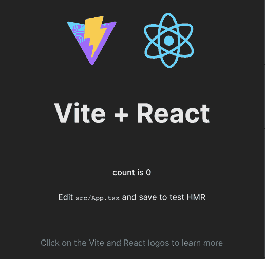

# 1

# React 入门第一步

亲爱的读者们！

本书假设您已经了解 React 是什么以及它能为您解决什么问题。您可能已经使用 React 编写了一个小型/中型应用程序，并希望提高您的技能并解答所有疑问。您应该知道 React 由 Meta 的开发者和 JavaScript 社区内的数百名贡献者维护。React 是创建 UIs 最受欢迎的库之一，它因其与**文档对象模型**（**DOM**）智能交互而闻名，速度快。它包含 JSX，这是一种在 JavaScript 中编写标记的新语法，这要求您改变对关注点分离的看法。它有许多酷炫的功能，例如服务器端渲染，这使您能够编写通用应用程序。

在本章中，我们将探讨一些基本概念，这些概念对于有效地使用 React 至关重要，但对于初学者来说也足够简单，可以自行理解：

+   命令式编程和声明式编程之间的区别

+   React 组件及其实例，以及 React 如何使用元素来控制 UI 流程

+   React 如何改变我们构建 Web 应用程序的方式，强制执行不同的关注点分离新概念，以及其不受欢迎的设计选择背后的原因

+   为什么人们会感到 JavaScript 疲劳，以及您如何避免在接近 React 生态系统时开发者最常犯的错误

# 技术要求

要跟随本书，您需要有一些使用终端运行 Unix 命令的经验。此外，您需要安装**Node.js**。您有两个选择：第一个是从官方网站直接下载 Node.js（[`nodejs.org`](https://nodejs.org)），第二个选项（推荐）是从[`github.com/nvm-sh/nvm`](https://github.com/nvm-sh/nvm)安装**Node 版本管理器**（**NVM**）。

如果您决定使用 NVM，您可以安装任何版本的 Node.js，并通过`nvm install`命令切换版本：

+   `node`是最新版本的别名：

    ```js
    nvm install node 
    ```

+   您还可以安装 Node.js 的全局版本（`nvm`将本地安装最新版本的 Node.js 到用户的计算机上）：

    ```js
    nvm install 19
    nvm install 18
    nvm install 17
    nvm install 16
    nvm install 15 
    ```

+   或者，您可以安装一个非常具体的版本：

    ```js
    nvm install 12.14.3 
    ```

+   安装了不同版本后，您可以通过使用`nvm use`命令在它们之间切换：

    ```js
    nvm use node # for latest version
    nvm use 16 # for the latest version of node 16.X.X
    nvm use 12.14.3 # Specific version 
    ```

+   最后，您可以通过运行以下命令指定默认的 Node.js 版本：

    ```js
    nvm alias default node
    nvm alias default 16
    nvm alias default 12.14.3 
    ```

简而言之，以下是完成本章所需的条件列表：

+   **Node.js (19+)**: [`nodejs.org`](https://nodejs.org)

+   **NVM**: [`github.com/nvm-sh/nvm`](https://github.com/nvm-sh/nvm)

+   **VS Code**: [`code.visualstudio.com`](https://code.visualstudio.com)

+   **TypeScript**: [`www.npmjs.com/package/typescript`](https://www.npmjs.com/package/typescript)

你可以在书的 GitHub 仓库中找到代码：[`github.com/PacktPublishing/React-18-Design-Patterns-and-Best-Practices-Fourth-Edition`](https://github.com/PacktPublishing/React-18-Design-Patterns-and-Best-Practices-Fourth-Edition)。

# 区分声明式和命令式编程

当阅读 React 文档或关于 React 的博客文章时，你无疑会遇到**声明式**这个术语。React 之所以如此强大，其中一个原因就是它强制执行声明式编程范式。

因此，要精通 React，理解声明式编程的含义以及命令式和声明式编程之间的主要区别是至关重要的。最简单的方法是将命令式编程视为描述事物如何工作的方式，将声明式编程视为描述你想要实现的方式。

在命令式世界中，进入酒吧喝啤酒是一个现实生活中的例子，你通常会向酒吧服务员下达以下指示：

1.  找一个杯子并从架子上取下来。

1.  把杯子放在水龙头下。

1.  把手拉到杯满为止。

1.  把杯子递给我。

在声明式世界中，你只需说，“请给我一杯啤酒，好吗？”

声明式方法假设酒吧服务员已经知道如何服务啤酒，这是声明式编程工作方式的一个重要方面。

让我们来看一个 JavaScript 的例子。在这里，我们将编写一个简单的函数，给定一个小写字符串数组，返回一个包含相同字符串的大写数组：

```js
toUpperCase(['foo', 'bar']) // ['FOO', 'BAR'] 
```

解决这个问题的命令式函数可以这样实现：

```js
const toUpperCase = input => { 
  const output = []

  for (let i = 0; i < input.length; i++) { 
    output.push(input[i].toUpperCase())
  } 

  return output
} 
```

首先，创建一个空数组来存放结果。然后，函数遍历输入数组的所有元素，将大写值推入空数组。最后，返回输出数组。

声明式解决方案如下：

```js
const toUpperCase = input => input.map(value => value.toUpperCase()) 
```

输入数组的项被传递给一个`map`函数，该函数返回一个包含大写值的新数组。有一些值得注意的显著差异：前一个例子不太优雅，需要更多的努力才能理解。后者更简洁，更容易阅读，这在大型代码库中，维护性至关重要。

另一个值得提到的方面是，在声明式示例中，不需要使用变量或在执行过程中更新它们的值。声明式编程倾向于避免创建和修改状态。

作为最后的例子，让我们看看 React 声明式意味着什么。我们将尝试解决的问题是在 Web 开发中常见的任务：创建一个切换按钮。

想象一个简单的 UI 组件，比如切换按钮。当你点击它时，如果它之前是灰色（关闭），它会变成绿色（开启）；如果它之前是绿色（开启），它会变成灰色（关闭）。

做这件事的命令式方法如下：

```js
const toggleButton = document.querySelector('#toggle')
toogleButton.addEventListener('click', () => {
  if (toggleButton.classList.contains('on')) {
    toggleButton.classList.remove('on')
    toggleButton.classList.add('off')
  } else {
    toggleButton.classList.remove('off')
    toggleButton.classList.add('on')
  }
}) 
```

它是命令式的，因为需要所有这些指令来更改类。相比之下，使用 React 的声明式方法如下：

```js
// To turn on the Toggle
<Toggle on />
// To turn off the toggle
<Toggle /> 
```

在声明式编程中，开发者只需描述他们想要实现的内容，无需列出所有使它工作的步骤。React 提供声明式方法使得它易于使用，因此生成的代码简单，这通常会导致更少的错误和更高的可维护性。

在下一节中，你将学习 React 元素的工作原理，并了解更多关于如何在 React 组件上传递 props 的上下文。

# React 元素的工作原理

在这本书中，我们假设你已经熟悉组件及其实例，但如果你想要有效地使用 React，你应该了解另一个对象——元素。元素是轻量级的不可变描述，用于表示应该渲染的内容，而组件则是更复杂的具有状态的对象，负责生成元素。

每当你`调用`**createClass**、**extend Component**或**声明一个无状态函数**时，你都在创建一个组件。React 在运行时管理你组件的所有实例，在给定的时间点内存中可以存在同一组件的多个实例。

如前所述，React 遵循声明式范式，无需告诉它如何与 DOM 交互；你只需声明你希望在屏幕上看到的内容，React 就会为你完成工作。使这个过程更具表达性和可读性的一个工具是 JSX，它允许你直接在 JavaScript 代码中编写类似 HTML 的语法。JSX 不是必需的，但在 React 社区中广泛使用。

为了控制 UI 流程，React 使用一种称为元素的特殊类型的对象。这些元素是通过`React.createElement()`函数创建的，或者更常见的是，通过 JSX 语法。元素只包含严格需要表示界面的信息。

下面是一个使用 JSX 创建的元素的示例：

```js
 <Title color="red">
    <h1>Hello, H1!</h1>
  </Title> 
```

此 JSX 代码被转换成如下 JavaScript 对象：

```js
 {
    type: Title,
    props: {
      color: 'red',
      children: {
        type: 'h1',
        props: {
          children: 'Hello, H1!'
        }
      }
    }
  } 
```

元素的类型至关重要，因为它告诉 React 如何处理它。如果类型是字符串，则元素表示一个 DOM 节点；如果是函数，则元素表示一个组件。

你可以嵌套 DOM 元素和组件来创建渲染树，表示应用程序用户界面的结构。通过以分层的方式组织你的元素和组件，你可以创建复杂和动态的 UI。

React 使用一种称为虚拟 DOM 的技术，它是实际 DOM 的内存表示。它比较当前树和新树，以最小化实际 DOM 更新的数量。这个过程称为协调，并由 React DOM 和 React Native 用于为其各自的平台创建 UI。

当一个元素的类型是函数时，React 会调用该函数，并将元素的属性传递给它以获取底层元素。它会递归地重复此过程，直到构建出可以在屏幕上渲染的 DOM 节点树。

总结来说，元素在 React 的声明式范式中的作用至关重要，它允许你创建复杂用户界面，而无需手动管理 DOM 元素的创建和销毁。

通过理解元素和组件如何协同工作，以及 React 如何使用虚拟 DOM 和协调高效地更新 UI，你将能够构建动态且高效的 Web 应用程序。

# 重新学习一切

当第一次使用 React 时，以开放的心态去接近它是至关重要的。这是因为 React 代表了一种新的设计 Web 和移动应用程序的方式，打破了许多传统的最佳实践。

在过去的二十年里，我们已经了解到关注点分离是至关重要的，这通常涉及到将逻辑与模板分离。我们的目标是把 JavaScript 和 HTML 写在不同的文件中，为此已经创建了各种模板解决方案来帮助开发者实现这一目标。

然而，这种方法的缺点是它往往造成了一种分离的错觉。实际上，JavaScript 和 HTML 无论在哪里都是紧密耦合的。为了说明这一点，让我们考虑一个示例模板：

```js
{{#items}} 
  {{#first}} 
    <li><strong>{{name}}</strong></li> 
  {{/first}} 
  {{#link}} 
    <li><a href="{{url}}">{{name}}</a></li> 
  {{/link}} 
{{/items}} 
```

前面的代码片段来自 Mustache 网站，这是最受欢迎的模板系统之一。

第一行告诉 Mustache 遍历一个项目集合。在循环内部，有一些条件逻辑来检查 `#first` 和 `#link` 属性是否存在，并根据它们的值渲染不同的 HTML 片段。变量被括在花括号中。

如果你的应用程序只需要显示一些变量，模板库可能是一个不错的解决方案，但当涉及到开始处理复杂的数据结构时，情况就改变了。模板系统和它们的 **领域特定语言** （**DSL**） 提供了一组功能，并试图提供与真实编程语言相同的功能，而不达到相同的完整性水平。正如示例所示，模板高度依赖于从逻辑层接收的模型来显示信息。

另一方面，JavaScript 与模板渲染的 DOM 元素交互，以更新 UI，即使它们是从不同的文件加载的。同样的问题也适用于样式 – 它们在不同的文件中定义，但在模板中被引用，CSS 选择器遵循标记的结构，因此几乎不可能在不破坏另一个的情况下更改其中一个，这就是 **耦合** 的定义。这就是为什么经典的关注点分离最终变成了更多技术的分离，这当然不是一件坏事，但它并没有解决任何真正的问题。

React 试图通过将模板放在它们应该的位置——逻辑旁边——向前迈出一大步。它这样做的原因是 React 建议你通过组合称为组件的小块来组织你的应用程序。框架不应该告诉你如何分离关注点，因为每个应用程序都有自己的，只有开发者应该决定如何限制它们应用程序的边界。

基于组件的方法彻底改变了我们编写 Web 应用程序的方式，这就是为什么经典的概念——关注点分离——正逐渐被一个更加现代的结构所取代。React 强加的范式并不新鲜，它也不是由其创造者发明的，但 React 为使这个概念主流化做出了贡献，最重要的是，它以更容易被不同水平的专业开发者理解的方式普及了这个概念。

渲染 React 组件看起来像这样：

```js
return ( 
  <button style={{ color: 'red' }} onClick={handleClick}> 
    Click me! 
  </button> 
) 
```

我们都同意，一开始这看起来有点奇怪，但这仅仅是因为我们还不习惯那种语法。一旦我们学会了它，并意识到它的强大；我们就理解了它的潜力。使用 JavaScript 进行逻辑和模板化不仅帮助我们更好地分离关注点，而且还赋予我们更多的能力和表现力，这是我们构建复杂 UI 所需要的东西。

因此，即使混合 JavaScript 和 HTML 的想法一开始听起来很奇怪，但给 React 五分钟时间是至关重要的。开始使用新技术最好的方式是在一个小型项目上尝试，看看效果如何。一般来说，正确的做法总是准备好放弃一切，并改变你的思维方式，如果长期利益值得的话。

另有一个概念相当有争议，难以接受，那就是 React 背后的工程师试图推广给社区的：将样式逻辑也移入组件内部。最终目标是封装创建我们组件所使用的每一种技术，并根据它们的领域和功能来分离关注点。以下是一个从 React 文档中摘取的样式对象的例子：

```js
const divStyle = { 
  color: 'white', 
  backgroundImage: `url(${imgUrl})`, 
  WebkitTransition: 'all', // note the capital 'W' here 
  msTransition: 'all' // 'ms' is the only lowercase vendor prefix 
}

ReactDOM.render(<div style={divStyle}>Hello World!</div>, mountNode) 
```

这套解决方案，其中开发者使用 JavaScript 编写他们的样式，被称为**#CSSinJS**，我们将在第六章*让你的组件看起来更美观*中详细讨论。

在下一节中，我们将看到如何避免由运行 React 应用程序所需的大量配置引起的 JavaScript 疲劳（主要是 webpack）。

# 理解 JavaScript 疲劳

有一种普遍的观点认为 React 由一套庞大的技术和工具组成，如果你想使用它，你就被迫处理包管理器、转译器、模块打包器和无穷无尽的库。这种想法已经非常普遍，并且被广泛传播，以至于它已经被明确定义并命名为**JavaScript 疲劳**。

## 关于 React 的误解

理解 JavaScript 疲劳的原因并不难。React 生态系统中的所有存储库和库都是使用闪亮的新技术、JavaScript 的最新版本和最先进的技术和范式构建的。此外，GitHub 上有大量的 React 模板代码，每个都有数十个依赖项，为任何问题提供解决方案。

然而，重要的是要理解 React 是一个非常小的库，它可以在任何页面（甚至 JSFiddle 内）中使用，就像人们以前使用 jQuery 或 Backbone 一样，只需在关闭 body 元素之前在页面上包含脚本即可。

## 无疲劳地开始使用 React

React 被拆分为两个包：

+   **react**：实现了库的核心功能

+   **react-dom**：包含所有与浏览器相关的功能

原因在于核心包用于支持不同的目标，例如 React DOM 在浏览器上和在移动设备上的 React Native。在单个 HTML 页面内运行 React 应用程序不需要任何包管理器或复杂的操作。

这里是开始使用 React 需要包含在 HTML 中的 URL：

+   `unpkg.com/react@18.2.0/umd/react.production.min.js`

+   `unpkg.com/react-dom@18.2.0/umd/react-dom.production.min.js`

对于简单的 UI，我们只需使用 **createElement** （自 React 17 起称为 **_jsx**）即可，只有在开始构建更复杂的东西时，我们才需要包含一个转译器来启用 JSX 并将其转换为 JavaScript。随着应用的成长，我们可能需要路由器、API 端点和外部依赖项。

## JavaScript 生态系统的优势

尽管 JavaScript 生态系统发展迅速且不断变化，但它提供了几个优势。社区在推动创新和快速演变中发挥着重要作用。一旦宣布或起草了规范，社区中就会有人将其实现为转译器插件或 polyfill，让其他人可以在浏览器供应商达成一致并开始支持它之前进行实验。

这使得 JavaScript 和浏览器与其他语言或平台相比成为一个独特的环境。缺点是变化很快，但这只是找到一个正确平衡的问题，即在押注新技术和保持安全之间找到平衡。

## 再见 Create-React-App，欢迎 Vite！

最近，React 团队决定从他们的官方文档中移除 **create-react-app**，这表明它不再是设置新 React 项目的默认方法。相反，React 现在推荐使用像 Next.js、Remix 或 Gatsby 这样的框架，以获得更全面的解决方案。然而，如果你需要更简单的替代方案，可以选择 Vite 或 Parcel 这样的构建工具。

### Vite 作为解决方案

Vite 是由 Vue.js 的创造者 Evan You 创建的一个构建工具和开发服务器。它利用现代浏览器中本地的 ES 模块功能，以实现快速开发和高效的生成构建。

要使用 Vite 与 React，首先，使用以下命令全局安装 Vite：

```js
 npm install -g create-vite 
```

然后，使用 React TypeScript 模板创建一个新的 Vite 项目：

```js
 create-vite my-react-app --template react-ts 
```

最后，进入新创建的项目文件夹并启动开发服务器：

```js
 cd my-react-app
  npm install
  npm run dev 
```

您应该看到项目默认在端口 **5173** 上运行。



图 1.1：Vite 默认应用

如果您想将端口改为 `3000`，您可以像这样修改 `vite.config.ts` 文件：

```js
 import { defineConfig } from 'vite'
  import react from '@vitejs/plugin-react'
  // https://vitejs.dev/config/
  export default defineConfig({
    plugins: [react()],
    server: {
      port: 3000
    }
  }) 
```

使用 Vite，您可以用最少的依赖来搭建和运行一个 React 应用程序，同时仍然可以访问构建完整的 React 应用程序所需的所有高级技术功能。

# 摘要

在本章中，我们学习了对于理解本书的其余部分非常重要的基本概念，这些概念对于日常使用 React 至关重要。我们现在知道如何编写声明式代码，并且对创建的组件与 React 用于在屏幕上显示其实例的元素之间的区别有了清晰的理解。

我们了解了将逻辑和模板放在一起选择的原因，以及为什么这个不受欢迎的决定对 React 来说是一个巨大的胜利。我们探讨了在 JavaScript 生态系统中为什么会普遍感到疲劳的原因，但我们也已经看到了如何通过遵循迭代方法来避免这些问题。

最后，我们了解了新的 `create-vite` CLI 是什么，我们现在可以开始编写一些真正的代码了。

在下一章中，您将学习 TypeScript 以及如何在项目中使用它。

# 加入我们的 Discord 社区

加入我们的 Discord 空间，与作者和其他读者进行讨论：

[`packt.link/React18DesignPatterns4e`](https://packt.link/React18DesignPatterns4e)


