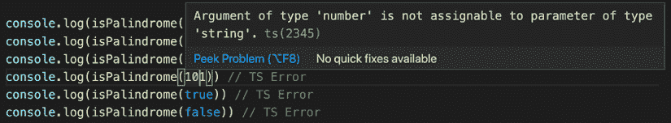
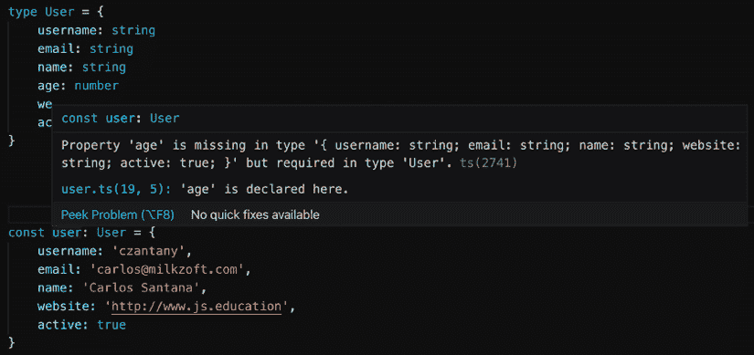
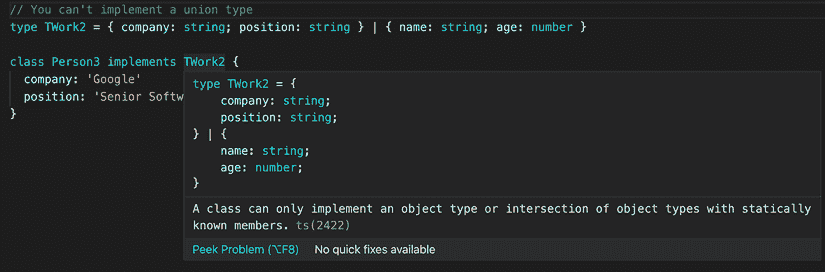
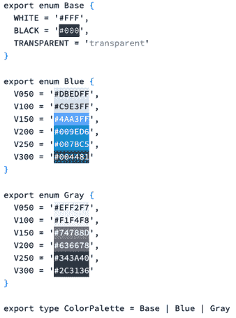

# 2

# 介绍 TypeScript

本章假设你已经有 JavaScript 的经验，并且对通过学习 **TypeScript** 来提高代码质量感兴趣。TypeScript 是一个类型化的 JavaScript 超集，它可以编译成 JavaScript。换句话说，TypeScript 实质上是带有一些额外功能的 JavaScript。

由微软 C# 的创造者 Anders Hejlsberg 设计，TypeScript 是一种开源语言，它增强了 JavaScript 的功能。通过引入静态类型和其他高级功能，TypeScript 帮助开发者编写更可靠和可维护的代码。

在本章中，我们将探讨 TypeScript 的特性和如何将现有的 JavaScript 代码转换为 TypeScript。到本章结束时，你将深入理解 TypeScript 的优势以及如何利用它们来创建更健壮和可扩展的应用程序。

在本章中，我们将涵盖以下主题：

+   TypeScript 的特性

+   将 JavaScript 代码转换为 TypeScript

+   类型

+   接口

+   扩展接口和类型

+   实现接口和类型

+   合并接口

+   枚举

+   命名空间

+   模板字面量类型

+   TypeScript 配置文件

# 技术要求

为了完成本章的内容，你需要以下工具：

+   Node.js 19+

+   Visual Studio Code

# TypeScript 的特性

TypeScript 是一种由微软开发和维护的流行开源编程语言，正迅速在全球开发者中流行起来。它被引入作为一种 JavaScript 的超集，旨在简化更大规模的应用程序的开发，同时提高代码质量和可维护性。TypeScript 利用静态类型并编译成干净的、简单的 JavaScript 代码，确保与现有的 JavaScript 环境兼容。

这门强大的语言带来了一系列强大的特性，使其与众不同，成为许多程序员的优选。值得注意的是，TypeScript 将强类型注入到 JavaScript 中，提供了更好的错误检查并减少了运行时错误。此外，它完全支持面向对象编程，具有类、接口和继承等高级功能。

由于任何有效的 JavaScript 代码也是 TypeScript，因此从 JavaScript 过渡到 TypeScript 可以逐步进行，开发者可以逐步将类型引入到他们的代码库中。这使得 TypeScript 成为小型和大型项目都适用的灵活、可扩展的解决方案。

在本节中，我们将总结 TypeScript 的基本特性，这些特性是你应该利用的：

+   **TypeScript 是 JavaScript**: TypeScript 是 JavaScript 的超集，这意味着你写的任何 JavaScript 代码都将与 TypeScript 兼容。如果你已经知道如何使用 JavaScript，那么你已经拥有了使用 TypeScript 所需的所有知识。你只需要学习如何给你的代码添加类型。所有的 TypeScript 代码最终都会被转换成 JavaScript。

+   **JavaScript 是 TypeScript**：这仅仅意味着你可以将任何有效的`.js`文件重命名为`.ts`扩展名，并且它将工作。

+   **错误检查**：TypeScript 编译代码并检查错误，这有助于在运行代码之前识别问题。

+   **强类型**：默认情况下，JavaScript 不是强类型。使用 TypeScript，你可以为所有变量和函数添加类型，甚至可以指定返回值类型。

+   **支持面向对象编程**：TypeScript 支持类、接口、继承等高级概念。这有助于更好地组织代码并提高其可维护性。

在讨论了 TypeScript 的关键特性之后，让我们深入探讨将 JavaScript 代码转换为 TypeScript 的实际演示。

# 将 JavaScript 代码转换为 TypeScript

在本节中，我们将看到如何将一些 JavaScript 代码转换为 TypeScript。

假设我们必须检查一个单词是否是回文。这个算法的 JavaScript 代码如下：

```js
function isPalindrome(word) {
  const lowerCaseWord = word.toLowerCase()
  const reversedWord = lowerCaseWord.split('').reverse().join('')
  return lowerCaseWord === reversedWord
} 
```

你可以将这个文件命名为`palindrome.ts`。

如你所见，我们接收一个`string`变量（`word`），并返回一个`boolean`值。那么，这如何翻译成 TypeScript？

```js
function isPalindrome(word: string): boolean {
  const lowerCaseWord = word.toLowerCase()
  const reversedWord = lowerCaseWord.split('').reverse().join('')
  return lowerCaseWord === reversedWord
} 
```

你可能正在想，“太好了，我已经将`string`类型指定为`word`，并将函数返回值指定为`boolean`类型，但现在怎么办？”

如果你尝试用与`string`不同的值运行函数，你会得到一个 TypeScript 错误：

```js
 console.log(isPalindrome('Level')) // true
    console.log(isPalindrome('Anna')) // true
    console.log(isPalindrome('Carlos')) // false
    console.log(isPalindrome(101)) // TS Error
    console.log(isPalindrome(true)) // TS Error
    console.log(isPalindrome(false)) // TS Error 
```

所以，如果你尝试将一个数字传递给函数，你会得到以下错误：



图 2.1：类型 number 不能赋值给类型为 string 的参数

这就是为什么 TypeScript 非常有用，因为它会强制你更严格、更明确地对待你的代码。

# 类型

在最后一个例子中，我们看到了如何为我们的函数参数和返回值指定一些原始类型，但你可能想知道如何更详细地描述一个对象或数组。类型可以帮助我们更好地描述我们的对象或数组。例如，假设你想描述一个`User`类型以将信息保存到数据库中：

```js
type User = {
  username: string
  email: string
  name: string
  age: number
  website: string
  active: boolean
}
const user: User = {
  username: 'czantany',
  email: 'carlos@milkzoft.com',
  name: 'Carlos Santana',
  age: 33,
  website: 'http://www.js.education',
  active: true
}
// Let's suppose you will insert this data using Sequelize...
models.User.create({ ...user }} 
```

如果我们忘记添加一个节点或在其中放入一个无效值，我们会得到以下错误：



图 2.2：类型 User 中缺少年龄，但需要

如果你需要可选节点，你可以在节点的年龄旁边始终放置一个`?`，如下面的代码块所示：

```js
type User = {
  username: string
  email: string
  name: string
  age?: number
  website: string
  active: boolean
} 
```

你可以随意命名`type`，但遵循一个良好的实践是添加前缀`T`。例如，`User`类型将变为`TUser`。这样，你可以快速识别它是`type`，而不会混淆地认为它是一个类或 React 组件。

# 接口

**接口**与类型非常相似，有时开发者不知道它们之间的区别。接口可以用来描述对象的形状或函数签名，就像类型一样，但语法不同：

```js
interface User {
  username: string
  email: string
  name: string
  age?: number
  website: string
  active: boolean
} 
```

您可以随意命名接口，但遵循一个良好的实践是添加前缀 `I`。例如，`User` 接口将变为 `IUser`。这样，您可以快速识别它是一个接口，并且不会混淆地认为它是一个类或 React 组件。

接口也可以扩展、实现和合并。

# 扩展接口和类型

接口或类型也可以扩展，但同样，语法将有所不同，如下面的代码块所示：

```js
// Extending an interface
interface IWork {
  company: string
  position: string
}
interface IPerson extends IWork {
  name: string
  age: number
}
// Extending a type
type TWork = {
  company: string
  position: string
}
type TPerson = TWork & {
  name: string
  age: number
}
// Extending an interface into a type
interface IWork {
  company: string
  position: string
}
type TPerson = IWork & {
  name: string
  age: number
} 
```

如您所见，通过使用 `&` 字符，您可以扩展一个类型，而使用 `extends` 关键字扩展接口。

理解接口和类型的扩展为我们深入了解它们的实现铺平了道路。让我们过渡到展示 TypeScript 中的类如何实现这些接口和类型，同时考虑到处理联合类型时的固有约束。

# 实现接口和类型

一个类可以以完全相同的方式实现接口或类型别名。但它不能实现（或扩展）一个命名 `联合类型` 的 *类型别名*。例如：

```js
// Implementing an interface
interface IWork {
  company: string
  position: string
}
class Person implements IWork {
  name: 'Carlos'
  age: 35
}
// Implementing a type
type TWork = {
  company: string
  position: string
}
class Person2 implements TWork {
  name: 'Cristina'
  age: 34
}
// You can't implement a union type
type TWork2 = {   company: string;   position: string } | {   name: string;   age: number }
class Person3 implements TWork2 {
  company: 'Google'
  position: 'Senior Software Engineer'
} 
```

如果您编写前面的代码，您的编辑器将出现以下错误：



图 2.3：一个类只能实现具有静态已知成员的对象类型或对象类型的交集

如您所见，您无法实现联合类型。

# 合并接口

与类型不同，接口可以定义多次，并且将被视为单个接口（所有声明将合并），如下面的代码块所示：

```js
interface IUser {
  username: string
  email: string
  name: string
  age?: number
  website: string
  active: boolean
}
interface IUser {
  country: string
}
const user: IUser = {
  username: 'czantany',
  email: 'carlos@milkzoft.com',
  name: 'Carlos Santana',
  country: 'Mexico',
  age: 35,
  website: 'http://www.js.education',
  active: true
} 
```

这在需要在不同场景下通过重新定义相同的接口来扩展你的接口时非常有用。

# 枚举

**枚举**是 TypeScript 具有的少数几个不是 JavaScript *类型* 级扩展的特性之一。枚举允许开发者定义一组 **命名常量**。使用枚举可以使文档化意图或创建一组不同情况变得更容易。

枚举可以存储数字或字符串值，通常用于提供预定义值。我个人喜欢在主题系统中使用它们来定义一组颜色，如下所示：



图 2.4：用于颜色调板的枚举

接下来，让我们探索 TypeScript 的另一个有用特性，即命名空间。

# 命名空间

您可能在其他编程语言中听说过 **命名空间**，例如 Java 或 C++。在 JavaScript 中，命名空间只是全局作用域中的命名对象。它们充当一个区域，在该区域中，变量、函数、接口或类在局部作用域中被组织并分组在一起，以避免全局作用域中组件之间的命名冲突。

虽然**模块**也用于代码组织，但对于简单用例，命名空间实现起来更为直接。然而，模块提供了命名空间不提供的额外好处，例如代码隔离、捆绑支持、重新导出组件以及重命名组件。

在我的个人项目中，我发现当使用 `styled-components` 时，命名空间对于分组样式很有用，例如：

```js
import styled from 'styled-components'
export namespace CSS {
  export const InputWrapper = styled.div`
    padding: 10px;
    margin: 0;
    background: white;
    width: 250px;
  `
  export const InputBase = styled.input`
    width: 100%;
    background: transparent;
    border: none;
    font-size: 14px;
  `
} 
```

然后当我需要使用它时，我会这样使用它：

```js
import React, { ComponentPropsWithoutRef, FC } from 'react'
import { CSS } from './Input.styled'
export interface Props extends ComponentPropsWithoutRef<'input'> {
  error?: boolean
}
const Input: FC<Props> = ({
  type = 'text',
  error = false,
  value = '',
  disabled = false,
  ...restProps
}) => (
    <CSS.InputWrapper style={error ? { border: '1px solid red' } : {}}>
      <CSS.InputBase type={type} value={value} disabled={disabled} {...restProps} />
    </CSS.InputWrapper>
  ) 
```

这非常有用，因为我不需要担心导出多个样式组件。我只需导出 CSS 命名空间，就可以使用该命名空间内部定义的所有样式组件。

# 模板字符串

在 TypeScript 中，**模板字符串**基于**字符串字面量类型**，可以使用**联合**扩展成多个字符串。这些类型对于定义一个*主题名称*很有用，例如：

```js
 type Theme = 'light' | 'dark' 
```

`Theme` 是一个联合类型，只能分配两种字符串字面量类型之一：`'light'` 或 `'dark'`。这提供了类型安全并防止了由于传递无效值作为主题名称而导致的运行时错误。

使用这种方法，您可以定义一个变量、参数或参数的可能值集合，并确保在编译时只使用有效的值。这使得您的代码更加可靠且易于维护。

# TypeScript 配置文件

目录中存在 `tsconfig.json` 文件表示该目录是 TypeScript 项目的根目录。`tsconfig.json` 文件指定了项目所需的根文件和编译器选项。

您可以在官方 TypeScript 网站上检查所有编译器选项：[`www.typescriptlang.org/tsconfig`](https://www.typescriptlang.org/tsconfig)。

这是我通常在我的项目中使用的 `tsconfig.json` 文件。我总是将它们分为两个文件：`tsconfig.common.json` 文件将包含所有共享的编译器选项，而 `tsconfig.json` 文件将扩展 `tsconfig.common.json` 文件并添加一些特定于该项目的选项。这在您与 **MonoRepos** 一起工作时非常有用。

我的 `tsconfig.common.json` 文件看起来像这样：

```js
{
  "compilerOptions": {
    "allowSyntheticDefaultImports": true,
    "alwaysStrict": true,
    "declaration": true,
    "declarationMap": true,
    "downlevelIteration": true,
    "esModuleInterop": true,
    "experimentalDecorators": true,
    "jsx": "react-jsx",
    "lib": ["DOM", "DOM.Iterable", "ESNext"],
    "module": "commonjs",
    "moduleResolution": "node",
    "noEmit": false,
    "noFallthroughCasesInSwitch": false,
    "noImplicitAny": true,
    "noImplicitReturns": true,
    "outDir": "dist",
    "resolveJsonModule": true,
    "skipLibCheck": true,
    "sourceMap": true,
    "strict": true,
    "strictFunctionTypes": true,
    "strictNullChecks": true,
    "suppressImplicitAnyIndexErrors": false,
    "target": "ESNext"
  },
  "exclude": ["node_modules", "dist", "coverage", ".vscode", "**/__tests__/*"]
} 
```

我的 `tsconfig.json` 文件看起来像这样：

```js
{
  "extends": "./tsconfig.common.json",
  "compilerOptions": {
    "baseUrl": "./packages",
    "paths": {
      "@web-creator/*": ["*/src"]
    }
  }
} 
```

在 *第十四章* 中，我将解释如何创建 MonoRepos 架构。

# 摘要

在本章中，我们介绍了 TypeScript 的基础知识，包括创建基本类型和接口、扩展它们，以及使用枚举、命名空间和模板字符串。我们还探讨了设置第一个 TypeScript 配置文件（`tsconfig.json`）并将其分为两部分——一部分用于共享，另一部分用于扩展 `tsconfig.common.json`。这种方法在处理 MonoRepos 时尤其有用。

在下一章中，我们将深入探讨使用 JSX/TSX 代码，并探索可以应用于改进代码风格的多种配置。你将学习如何利用 TypeScript 的力量来创建高效且易于维护的 React 应用程序。
