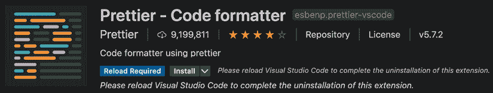
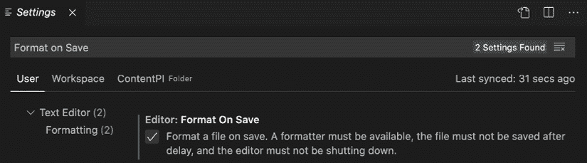

# 3

# 清理您的代码

本章假设您已经具备 **JSX**（**JavaScript XML**）的相关经验，并且有兴趣提高您使用它的技能以有效利用它。为了在使用 JSX/TSX 时不出现任何问题或意外行为，了解其底层工作原理及其作为构建 UI 的有用工具的原因至关重要。

我们的目标是编写干净的 JSX/TSX 代码，维护它，并对其内部工作原理有良好的理解，包括它如何转换为 JavaScript 以及它提供的功能。

通过理解 JSX/TSX 的复杂性，您可以充分利用其全部潜力来构建高效且可扩展的 UI。我们将探讨各种技巧和技术，帮助您编写更好的代码并避免常见的错误。到本章结束时，您将牢固掌握 JSX/TSX 的工作原理以及如何在您的 React 应用程序中有效地使用它。

在本章中，我们将涵盖以下主题：

+   JSX 是什么，为什么我们应该使用它？

+   Babel 是什么，以及我们如何使用它来编写现代 JavaScript 代码？

+   JSX 的主要特性和 HTML 与 JSX 之间的区别。

+   编写优雅且可维护的 JSX 的最佳实践。

+   如何通过 linting（特别是 ESLint）使我们的 JavaScript 代码在应用程序和团队之间保持一致性。

+   函数式编程的基础以及遵循函数式范式将如何帮助我们编写更好的 React 组件。

# 技术要求

要完成本章，您需要以下内容：

+   Node.js 19+

+   Visual Studio Code

# 使用 JSX

在 *第一章* 中，我们看到了 React 如何改变关注点分离的概念，将边界移动到组件内部。我们还学习了 React 如何使用组件返回的元素在屏幕上显示 UI。

现在我们来看看我们如何在组件内部声明元素。

React 提供了两种定义元素的方法。第一种是通过使用 JavaScript 函数，第二种是通过使用 JSX，这是一种可选的类似 XML 的语法。以下是新官方 React.js 文档的截图（[`react.dev`](https://react.dev)）：


图 3.1：React.js 的新官方文档网站

首先，JSX 是人们未能接近 React 的主要原因之一，因为第一次看到主页上的示例，看到 JavaScript 与 HTML 混合在一起，对我们大多数人来说可能看起来很奇怪。

一旦我们习惯了它，我们就会意识到它非常方便，正是因为它与 HTML 类似，对已经在网络上创建过 UI 的人来说看起来非常熟悉。开闭标签使得表示嵌套元素树变得更加容易，这在使用纯 JavaScript 时将是难以阅读和难以维护的。

让我们更详细地了解以下子节中的 JSX。

## Babel

Babel 是一个流行的 JavaScript 编译器，在 React 社区中得到广泛使用。它允许开发者使用最新的语言特性编写代码，如 JSX 和 ES6，这些特性可能尚未在所有浏览器中得到支持。通过将代码转换成更广泛支持的 ES5，Babel 确保你的应用程序在不同浏览器上平稳运行。

要使用 Babel，你首先需要安装必要的包。在旧版本（Babel 6.x）中，你会安装 `babel-cli` 包，它包含了 **babel-node** 和 **babel-core**。然而，在较新版本中，这些包已经被分离成单独的模块：`@babel/core`、`@babel/cli`、`@babel/node` 等等。

要安装 Babel，请按照以下步骤操作：

1.  在全局范围内安装所需的包（尽管通常更喜欢本地安装）：

    ```js
    npm install -g @babel/core @babel/node 
    ```

1.  要使用 Babel 编译 JavaScript 文件，请运行：

    ```js
    babel source.js -o output.js 
    ```

1.  Babel 可以高度配置，你可以使用预设来自定义它。要安装最常用的预设，请运行：

    ```js
    npm install -g @babel/preset-env @babel/preset-react 
    ```

1.  在你的项目根目录中创建一个 `.babelrc` 配置文件，并添加以下内容以告诉 Babel 使用已安装的预设：

    ```js
    {
      "presets": [
        "@babel/preset-env",
        "@babel/preset-react"
      ]
    } 
    ```

现在，你可以在源文件中编写 ES6 和 JSX，Babel 会将它们转换成浏览器兼容的 ES5 JavaScript 代码。

## 创建第一个元素

现在我们支持 JSX 的环境，让我们探索一个基本示例：创建一个 `div` 元素。使用 `_jsx` 函数，我们可以编写：

```js
_jsx('div', {}) 
```

然而，使用 JSX，我们可以简单地编写：

```js
<div /> 
```

这看起来与常规 HTML 类似，但关键的区别在于我们正在 `.js` 文件中编写标记。请注意，JSX 只是一种语法糖，在浏览器中执行之前会被转换成 JavaScript。

当我们运行 Babel 时，我们的 `<div />` 元素被转换成 `_jsx('div', {})`。在构建模板时请记住这一点。

从 **React 17** 开始，`React.createElement('div')` 已被弃用，库现在内部使用 `react/jsx-runtime` 来渲染 JSX。这意味着你不再需要导入 React 对象来编写 JSX 代码。相反，你可以像上一个示例中那样直接编写 JSX。

## DOM 元素和 React 组件

JSX 允许我们创建 HTML 元素和 React 组件，唯一的区别在于它们是否以大写字母开头。例如，要渲染 HTML 按钮，我们使用 `<button />`，而要渲染 `Button` 组件，我们使用 `<Button />`。

第一个按钮被转换成以下形式：

```js
_jsx('button', {}) 
```

第二个被转换成以下形式：

```js
_jsx(Button, {}) 
```

关键区别在于第一次调用时，我们传递 DOM 元素的类型作为字符串，而在第二次调用中，我们传递组件本身。因此，组件必须在作用域中存在才能正常工作。

JSX 还支持自闭合标签，这对于保持代码简洁和避免不必要的标签重复很有用。

## 属性

当你的 DOM 元素或 React 组件有 props 时，JSX 非常方便。使用 XML 在元素上设置属性相当简单：

```js
 
```

在 JavaScript 中，这将是以下内容：

```js
_jsx("img", { 
  src: "https://www.ranchosanpancho.com/images/logo.png", 
  alt: "Cabañas San Pancho" 
}) 
```

这要难读得多，即使只有几个属性，没有一点推理也难以阅读。

## 子元素

JSX 允许你定义子元素来描述元素的树形结构并组合复杂的 UI。一个基本的例子是在其中包含文本的链接，如下所示：

```js
<a href="https://ranchosanpancho.com">Click me!</a> 
```

这将被转换成以下内容：

```js
_jsx( 
  "a", 
  { href: "https://ranchosanpancho.com" }, 
  "Click me!" 
) 
```

我们的链接可以包含在一个 `div` 元素中，以满足某些布局要求，实现这一点的 JSX 片段如下所示：

```js
<div> 
  <a href="https://ranchosanpancho.com">Click me!</a> 
</div> 
```

JavaScript 的等效代码如下：

```js
_jsx( 
  "div", 
  null, 
  _jsx( 
    "a", 
    { href: "https://ranchosanpancho.com" }, 
    "Click me!" 
  ) 
) 
```

现在应该很清楚 JSX 的 *XML-like* 语法是如何使一切更加可读和可维护的，但了解与我们的 JSX 并行的 JavaScript 如何控制元素的创建始终很重要。好处是，我们不仅限于将元素作为元素的子元素，我们还可以使用 JavaScript 表达式，例如函数或变量。

要做到这一点，我们必须将表达式包裹在花括号内：

```js
<div> 
  Hello, {variable}. 
  I'm a {() => console.log('Function')}. 
</div> 
```

同样适用于非字符串属性，如下所示：

```js
<a href={someFunction()}>Click me!</a> 
```

如你所见，任何变量或函数都应该被包裹在花括号内。

## 与 HTML 的区别

到目前为止，我们已经探讨了 JSX 和 HTML 之间的相似之处。现在让我们看看它们之间的一些细微差别以及它们存在的原因。

### 属性

我们必须始终记住 JSX 不是一个标准语言，并且它会被转换成 JavaScript。因此，一些属性不能使用。

例如，我们不得不使用 `className` 而不是 `class`，以及使用 `htmlFor` 而不是 `for`，如下所示：

```js
<label className="awesome-label" htmlFor="name" /> 
```

原因是 `class` 和 `for` 是 JavaScript 的保留字。

### 样式

一个相当显著的区别是 `style` 属性的工作方式。我们将在 *第六章*，*让你的组件看起来更美观* 中更详细地探讨如何使用它，但现在我们将关注它的工作方式。

`style` 属性不接受 CSS 字符串，就像 HTML 那样，而是期望一个 JavaScript 对象，其中样式名称是 *camelCased*：

```js
<div style={{ backgroundColor: 'red' }} /> 
```

如你所见，你可以向 `style` prop 传递一个对象，这意味着如果你愿意，你的样式甚至可以放在一个单独的变量中：

```js
const styles = {
  backgroundColor: 'red'
} 
<div style={styles} /> 
```

这是更好地控制你的内联样式的方法。

### 根

值得注意的是，与 HTML 相比的一个重要区别是，由于 JSX 元素被转换成 JavaScript 函数，而在 JavaScript 中你不能返回两个函数，所以当你有多个同一级别的元素时，你被迫将它们包裹在一个父元素中。

让我们看看一个简单的例子：

```js
<div />
<div /> 
```

这会给我们以下错误：

```js
Adjacent JSX elements must be wrapped in an enclosing tag. 
```

另一方面，以下是可以工作的：

```js
<div> 
  <div /> 
  <div /> 
</div> 
```

以前，React 强制你返回一个被 `<div>` 元素或其他标签包裹的元素；自 **React 16.2.0** 以来，可以直接返回一个数组，如下所示：

```js
return [
  <li key="1">First item</li>, 
  <li key="2">Second item</li>, 
  <li key="3">Third item</li>
] 
```

或者，你甚至可以直接返回一个字符串，如下面的代码块所示：

```js
return 'Hello World!' 
```

此外，React 现在有一个名为`Fragment`的新特性，它也可以作为一个特殊的元素包装器。它可以指定为`React.Fragment`：

```js
import { Fragment } from 'react'
return ( 
  <Fragment>
    <h1>An h1 heading</h1> 
    Some text here. 
    <h2>An h2 heading</h2> 
    More text here.
    Even more text here.
  </Fragment>
) 
```

或者你可以使用空标签（`<></>`）：

```js
return ( 
  <>
    <ComponentA />
    <ComponentB />
    <ComponentC />
  </>
) 
```

`Fragment`不会在 DOM 上渲染任何可见的内容；它只是一个用于包裹你的 React 元素或组件的辅助标签。

### 空格

在开始时可能会有一点小麻烦，再次强调，这涉及到我们应该始终记住 JSX 不是 HTML，即使它有类似 XML 的语法。JSX 处理文本和元素之间的空格的方式与 HTML 不同，这种方式可能不符合直观。

考虑以下代码片段：

```js
<div> 
  <span>My</span> 
  name is 
  <span>Carlos</span> 
</div> 
```

在一个解析 HTML 的浏览器中，这段代码会显示`My name is Carlos`，这正是我们预期的结果。

在 JSX 中，相同的代码会被渲染为`MynameisCarlos`，这是因为三个嵌套的行被转换成了`div`元素的单独子元素，没有考虑到空格。一个常见的解决方案是在元素之间显式地放置一个空格，如下所示：

```js
<div> 
  <span>My</span> 
  {' '}
  name is
  {' '} 
  <span>Carlos</span> 
</div> 
```

如你可能已经注意到的，我们正在使用一个包裹在 JavaScript 表达式中的空字符串来强制编译器在元素之间应用空格。

### 布尔属性

在真正开始之前，还有一些关于你在 JSX 中定义布尔属性的方式值得提及。

如果你设置了一个没有值的属性，JSX 会假设它的值是`true`，这与 HTML 中的`disabled`属性的行为相同，例如。

这意味着如果我们想将属性设置为`false`，我们必须明确地声明为`false`：

```js
<button disabled /> 
_jsx("button", { disabled: true }) 
```

下面是布尔属性的另一个例子：

```js
<button disabled={false} /> 
_jsx("button", { disabled: false }) 
```

在开始时这可能会让人困惑，因为我们可能会认为省略属性意味着`false`，但事实并非如此。在使用 React 时，我们应该始终明确以避免混淆。

## 展开属性

一个重要的特性是`展开属性`操作符（`...`），它来自 ECMAScript“提案”中的 rest/spread 属性，并且在我们想要将 JavaScript 对象的全部属性传递给元素时非常方便。

一种常见的做法可以减少错误，那就是不要通过引用传递整个 JavaScript 对象给子组件，而是使用它们的原始值，这些值可以轻松验证，使组件更加健壮和防错。

让我们看看它是如何工作的：

```js
const attrs = { 
  id: 'myId',
  className: 'myClass'
}
return <div {...attrs} /> 
```

之前的代码会被转换成以下形式：

```js
var attrs = { 
  id: 'myId',
  className: 'myClass'
} 
return _jsx('div', attrs) 
```

## 模板字面量

`模板字面量`是允许嵌入表达式、多行字符串和字符串插值的字符串字面量。它们由反引号（``）字符包围，而不是单引号或双引号。

模板字面量最有用的特性之一是能够使用美元符号和花括号`(${expression})`包含占位符。这允许我们轻松地将变量或复杂的表达式插入到字符串模板中。以下是一个例子：

```js
const name = 'Carlos'
const age = 35
const message = `Hello, my name is ${name} and I am ${age} years old.`
console.log(message) 
```

这将输出以下内容：

```js
Hello, my name is Carlos and I am 35 years old. 
```

除了字符串插值外，模板字符串还支持多行字符串，这使得在不使用加号（`+`）运算符连接多个字符串的情况下编写和阅读复杂的字符串变得更加容易。

## 常见模式

既然我们已经了解了 JSX 的工作原理并能熟练掌握它，我们就准备好按照一些有用的约定和技术来正确地使用它了。

### 多行

让我们从一个非常简单的例子开始。正如之前所述，我们应该优先选择 JSX 而不是 React 的 `_jsx` 函数的主要原因之一是因为其类似 XML 的语法，以及平衡的开启和关闭标签非常适合表示节点树。

因此，我们应该尝试以正确的方式使用它并最大限度地发挥其作用。以下是一个例子；每当有嵌套元素时，我们总是应该使用多行：

```js
<div> 
  <Header /> 
  <div> 
    <Main content={...} /> 
  </div> 
</div> 
```

这比以下情况更可取：

```js
<div><Header /><div><Main content={...} /></div></div> 
```

例外情况是如果子元素不是文本或变量等元素。在这种情况下，保持在同一行上并避免向标记中添加噪音是有意义的，如下所示：

```js
<div> 
  <Alert>{message}</Alert> 
  <Button>Close</Button> 
</div> 
```

总是记得在多行编写元素时将它们包裹在括号内。JSX 总是被替换为函数，而写在新的行上的函数可能会因为自动分号插入而导致意外结果。例如，假设你从渲染方法中返回 JSX，这是你在 React 中创建 UI 的方式。

以下示例工作正常，因为 `div` 元素与 `return` 在同一行上：

```js
return <div /> 
```

然而，以下是不正确的：

```js
return 
  <div /> 
```

原因是，这样你会有以下情况：

```js
return
_jsx("div", null) 
```

这就是为什么你必须将语句包裹在括号中的原因，如下所示：

```js
return ( 
  <div /> 
) 
```

### 多属性

在编写 JSX 时，一个常见的问题是一个元素具有多个属性。一个解决方案是将所有属性都写在同一行上，但这会导致代码行非常长，而我们不希望代码中出现这种情况（参见下一节了解如何强制执行编码风格指南）。

一个常见的解决方案是将每个属性都写在新的行上，缩进一级，然后将关闭括号与开启标签对齐：

```js
<button 
  foo="bar" 
  veryLongPropertyName="baz" 
  onSomething={this.handleSomething} 
/> 
```

### 条件语句

当我们开始处理 `条件语句` 时，事情会变得更有趣，例如，如果我们只想在满足某些条件时渲染某些组件。我们可以在条件中使用 JavaScript 是一个很大的优点，但在 JSX 中有许多表达条件的方式，理解每种方式的优点和问题对于编写既可读又可维护的代码非常重要。

假设我们只想在用户当前登录到我们的应用程序时显示注销按钮。

一个简单的示例片段如下：

```js
let button

if (isLoggedIn) { 
  button = <LogoutButton />
} 

return <div>{button}</div> 
```

这确实可行，但可读性并不高，尤其是当有多个组件和多个条件时。

在 JSX 中，我们可以使用内联条件：

```js
<div> 
  {isLoggedIn && <LoginButton />} 
</div> 
```

这之所以有效，是因为如果条件是`false`，则不会渲染任何内容，但如果条件是`true`，则`LoginButton`的`createElement`函数会被调用，并将元素返回以组成结果树。

如果条件有备选方案（经典的`if...else`语句），并且我们想要，例如，当用户登录时显示注销按钮，否则显示登录按钮，我们可以如下使用 JavaScript 的`if...else`语句：

```js
let button
if (isLoggedIn) { 
  button = <LogoutButton />
} else { 
  button = <LoginButton />
} 

return <div>{button}</div> 
```

或者，更好的是，我们可以使用一个使代码更紧凑的三元条件：

```js
<div> 
  {isLoggedIn ? <LogoutButton /> : <LoginButton />} 
</div> 
```

你可以在流行的仓库中找到使用的三元条件，例如 Redux 现实世界的例子([`github.com/reactjs/redux/blob/master/examples/real-world/src/components/List.js#L28`](https://github.com/reactjs/redux/blob/master/examples/real-world/src/components/List.js#L28))，其中三元条件用于在组件正在获取数据时显示`Loading`标签，或者根据`isFetching`变量的值在按钮内部显示`Load More`：

```js
<button [...]> 
  {isFetching ? 'Loading...' : 'Load More'} 
</button> 
```

现在我们来看当事情变得更加复杂时最好的解决方案，例如，我们必须检查多个变量以确定是否渲染组件：

```js
<div>
  {dataIsReady && (isAdmin || userHasPermissions) && 
    <SecretData />
  }
</div> 
```

在这种情况下，很明显使用内联条件是一个好的解决方案，但可读性受到了严重影响。相反，我们可以在组件内部创建一个辅助函数并在 JSX 中使用它来验证条件：

```js
const MyComponent = ({ dataIsReady, isAdmin, userHasPermissions }) => {
  const canShowSecretData = () => { 
    return dataIsReady && (isAdmin || userHasPermissions)
  } 

  return (
    <div> 
      {canShowSecretData() && <SecretData />} 
    </div>
  )
} 
```

如你所见，这个更改使代码更易于阅读，条件更明确。如果你在 6 个月后查看这段代码，仅通过阅读函数名你仍然可以找到它很清晰。

这同样适用于计算属性。假设你有两个单独的属性用于货币和价值。你可以在`render`内部创建一个价格字符串，而不是这样做，你可以创建一个函数：

```js
const MyComponent = ({ currency, value }) => {
     const getPrice = () => { 
    return `${currency}${value}`
  }

  return <div>{getPrice()}</div>
} 
```

这更好，因为它被隔离了，如果你想要测试它是否包含逻辑，你可以轻松地进行测试。

回到条件语句，我们可以创建一个自定义组件并命名为`RenderIf`来条件性地渲染我们的组件：

```js
import React, { FC, ReactElement } from 'react'
interface Props {
  children: ReactElement | string
  isTrue?: Boolean
  isFalse?: Boolean
}
const RenderIf: FC<Props> = ({ children, isTrue, isFalse }) => {
  if (isTrue === true) {
    return <>{children}</>
  }
  if (isFalse === false) {
    return <>{children}</>
  }
  return null
}
export default RenderIf 
```

我们可以很容易地在我们的项目中使用它，如下所示：

```js
import RenderIf from './RenderIf'
const MyComponent = ({ dataIsReady, isAdmin, userHasPermissions }) => {  
  return (
    <div> 
      <RenderIf isTrue={dataIsReady && (isAdmin || userHasPermissions)}>
        <SecretData />
      </RenderIf> 
    </div>
  )
} 
```

### 循环

在 UI 开发中，显示项目列表是一个非常常见的操作。当涉及到显示列表时，使用 JavaScript 作为模板语言是一个非常不错的选择。

如果我们在 JSX 模板中编写一个返回数组的函数，数组中的每个元素都会被编译成一个元素。

正如我们之前看到的，我们可以在大括号内使用任何 JavaScript 表达式，并且给定一个对象数组，生成元素数组最常见的方式是使用`map`。

让我们深入一个现实世界的例子。假设你有一个用户列表，每个用户都有一个附加的`name`属性。

要创建一个无序列表来显示用户，你可以这样做：

```js
<ul> 
  {users.map(user => <li>{user.name}</li>)} 
</ul> 
```

这个片段既简单又强大，因为 HTML 和 JavaScript 的力量在这里汇聚。

### 子渲染

值得强调的是，我们总是希望保持我们的组件非常小，我们的渲染方法非常干净和简单。

然而，这并不是一个容易实现的目标，尤其是在您迭代创建应用程序时，在第一次迭代中，您不确定如何将组件拆分成更小的部分。那么，当`渲染`方法变得太大难以维护时，我们应该怎么做？一个解决方案是以一种让我们能够保持所有逻辑在同一个组件中的方式将其拆分成更小的函数。

让我们来看一个例子：

```js
const renderUserMenu = () => { 
  // JSX for user menu 
} 

const renderAdminMenu = () => { 
  // JSX for admin menu 
} 

return ( 
  <div> 
    <h1>Welcome back!</h1> 
    {userExists && renderUserMenu()} 
    {userIsAdmin && renderAdminMenu()} 
  </div> 
) 
```

这并不总是被认为是最佳实践，因为这看起来更明显地应该将组件拆分成更小的部分。然而，有时保持渲染方法更干净是有帮助的。例如，在 Redux 的实际应用示例中，使用子渲染方法来渲染*加载更多*按钮。

现在我们已经是 JSX 的高级用户了，是时候继续前进，看看如何在我们的代码中遵循样式指南，以使其保持一致。

# 代码样式

在本节中，您将学习如何通过验证代码风格来实施**EditorConfig**和**ESLint**，从而提高您的代码质量。在您的团队中拥有标准的代码风格并避免使用不同的代码风格非常重要。

## EditorConfig

**EditorConfig**帮助开发者在不同 IDE 之间保持一致的编码风格。

EditorConfig 被许多编辑器支持。您可以在官方网站上检查您的编辑器是否受支持，[`www.editorconfig.org`](https://www.editorconfig.org)。

您需要在您的`root`目录中创建一个名为`.editorconfig`的文件——我使用的配置如下：

```js
root = true
[*]
indent_style = space 
indent_size = 2
end_of_line = lf
charset = utf-8 
trim_trailing_whitespace = true 
insert_final_newline = true
[*.html] 
indent_size = 4
[*.css] 
indent_size = 4
[*.md]
trim_trailing_whitespace = false 
```

您可以使用`[*]`影响所有文件，以及使用`[.extension]`影响特定文件。

## Prettier

**Prettier**是一个有偏见的代码格式化工具，支持多种语言，可以与大多数编辑器集成。这个插件非常有用，因为您可以在保存时格式化代码，您不需要在代码审查中讨论代码风格，这将为您节省大量时间和精力。

如果您使用 Visual Studio Code，您必须首先安装 Prettier 扩展：



图 3.2：Prettier – 代码格式化工具

然后，如果您想在保存文件时配置格式化选项，您需要前往**设置**，搜索`在保存时格式化`，并确认该选项：



图 3.3：配置保存文件时的格式化选项

这将影响您所有的项目，因为它是一个全局设置。如果您只想在特定项目中应用此选项，您必须在您的项目内部创建一个`.vscode`文件夹和一个`settings.json`文件，其中包含以下代码：

```js
{
  "editor.defaultFormatter": "esbenp.prettier-vscode",
  "editor.formatOnSave": true
} 
```

然后，您可以在您的`.prettierrc`文件中配置您想要的选项——这是我通常使用的配置：

```js
{
  "arrowParens": "avoid",
  "bracketSpacing": true,
  "jsxSingleQuote": false,
  "printWidth": 100,
  "quoteProps": "as-needed",
  "semi": false,
  "singleQuote": true,
  "tabWidth": 2,
  "trailingComma": "none",
  "useTabs": false
} 
```

这将帮助您或您的团队标准化代码风格。

## ESLint

编写高质量的代码始终是我们的目标，但错误仍然可能发生，花费数小时追踪由简单的打字错误引起的错误可能会非常令人沮丧。幸运的是，有一些工具可以帮助我们在键入时就捕获这些错误，从而避免简单的语法错误。

如果你来自像 C#这样的静态类型语言，你可能已经习惯了在 IDE 中得到警告。在 JavaScript 世界中，用于代码检查的流行工具是 ESLint。ESLint 是一个于 2013 年发布的开源项目，它高度可配置和可扩展。

在快速发展的 JavaScript 生态系统中，库和技术经常变化，因此拥有一个可以轻松扩展插件和规则的工具至关重要，这些规则可以根据需要启用或禁用。此外，由于像 Babel 这样的转换器和尚未成为标准 JavaScript 版本一部分的实验性语言功能，我们需要能够告诉我们的代码检查器我们在源文件中遵循哪些规则。代码检查器不仅帮助我们更快地捕获错误，而且还强制执行常见的编码风格指南，这对于大型团队尤为重要，因为一致性是关键。

在接下来的章节中，我们将更详细地探讨 ESLint 以及它是如何帮助我们编写更好、更一致的代码的。

### 安装

首先，我们必须安装 ESLint 和一些插件，如下所示：

```js
npm install -g eslint eslint-config-airbnb eslint-config-prettier eslint-plugin-import eslint-plugin-jsx-a11y eslint-plugin-prettier eslint-plugin-react 
```

一旦安装了可执行文件，我们就可以使用以下命令运行它：

```js
eslint source.ts 
```

输出将告诉我们文件中是否有错误。

当我们第一次安装和运行它时，我们没有看到任何错误，因为它完全可配置，并且它没有自带任何默认规则。

### 配置

让我们开始配置 ESLint。它可以通过位于项目根目录的`.eslintrc`文件进行配置。为了添加一些规则，让我们创建一个`.eslintrc`文件，配置为 TypeScript，并添加一条基本规则：

```js
{
  "parser": "@typescript-eslint/parser",
  "plugins": ["@typescript-eslint", "prettier"],
  "extends": [
    "airbnb",
    "eslint:recommended",
    "plugin:@typescript-eslint/eslint-recommended",
    "plugin:@typescript-eslint/recommended",
    "plugin:prettier/recommended"
  ],
  "settings": {
    "import/extensions": [".js", ".jsx", ".ts", ".tsx"],
    "import/parsers": {
      "@typescript-eslint/parser": [".ts", ".tsx"]
    },
    "import/resolver": {
      "node": {
        "extensions": [".js", ".jsx", ".ts", ".tsx"]
      }
    }
  },
  "rules": {
    "semi": [2, "never"]
  }
} 
```

这个配置文件需要一些解释：“`semi`”是规则的名称，而`[2, "never"]`是值。第一次看到它时可能不太直观。

ESLint 规则有三个级别，用于确定问题的严重性：

1.  `off`（或`0`）：规则被禁用。

1.  `warn`（或`1`）：规则是一个警告。

1.  `error`（或`2`）：规则会抛出一个错误。

我们使用值`2`是因为我们希望 ESLint 在代码不遵循规则时每次都抛出错误。第二个参数告诉 ESLint 我们希望分号永远不被使用（相反是*总是*）。ESLint 及其插件都有很好的文档，对于任何单个规则，你都可以找到规则的描述和一些示例，说明它在何时通过以及在何时失败。

现在创建一个`index.ts`文件，内容如下：

```js
const foo = 'bar'; 
```

如果我们运行`eslint index.js`，我们会得到以下结果：

```js
Extra semicolon (semi) 
```

这很好；我们设置了代码检查器，它正在帮助我们遵循第一条规则。

这里有一些我更喜欢关闭或更改的规则：

```js
"rules": {
    "semi": [2, "never"],
    "@typescript-eslint/class-name-casing": "off",
    "@typescript-eslint/interface-name-prefix": "off",
    "@typescript-eslint/member-delimiter-style": "off",
    "@typescript-eslint/no-var-requires": "off",
    "@typescript-eslint/ban-ts-ignore": "off",
    "@typescript-eslint/no-use-before-define": "off",
    "@typescript-eslint/ban-ts-comment": "off",
    "@typescript-eslint/explicit-module-boundary-types": "off",
    "no-restricted-syntax": "off",
    "no-use-before-define": "off",
    "import/extensions": "off",
    "import/prefer-default-export": "off",
    "max-len": [
      "error",
      {
        "code": 100,
        "tabWidth": 2
      }
    ],
    "no-param-reassign": "off",
    "no-underscore-dangle": "off",
    "react/jsx-filename-extension": [
      1,
      {
        "extensions": [".tsx"]
      }
    ],
    "import/no-unresolved": "off",
    "consistent-return": "off",
    "jsx-a11y/anchor-is-valid": "off",
    "sx-a11y/click-events-have-key-events": "off",
    "jsx-a11y/no-noninteractive-element-interactions": "off",
    "jsx-a11y/click-events-have-key-events": "off",
    "jsx-a11y/no-static-element-interactions": "off",
    "react/jsx-props-no-spreading": "off",
    "jsx-a11y/label-has-associated-control": "off",
    "react/jsx-one-expression-per-line": "off",
    "no-prototype-builtins": "off",
    "no-nested-ternary": "off",
    "prettier/prettier": [
      "error",
      {
        "endOfLine": "auto"
      }
    ]
  } 
```

### Git 钩子

为了避免在我们的仓库中有未检查的代码，我们可以通过 Git 钩子在我们流程的某个点上添加 ESLint。例如，我们可以使用`husky`在名为`pre-commit`的 Git 钩子中运行我们的代码检查器，并且运行名为`pre-push`的钩子来运行我们的单元测试也是很有用的。

要安装`husky`，你需要运行以下命令：

```js
npm install --save-dev husky 
```

然后，在我们的`package.json`文件中，我们可以添加这个节点来配置我们想要在 Git 钩子中运行的任务。

编辑`package.json >` `prepare`脚本并运行一次：

```js
 npm pkg set scripts.prepare="husky install"
  npm run prepare 
```

添加一个钩子：

```js
 npx husky add .husky/pre-commit "npm run lint"
  git add .husky/pre-commit 
```

提交一个版本：

```js
 git commit -m "Keep calm and commit"
  # `npm run lint` will run every time you commit 
```

ESLint 命令有一个特殊的选项（标志）叫做`--fix` – 使用这个选项，ESLint 将尝试自动修复我们所有的代码检查错误（不是所有的）。注意这个选项，因为有时它可能会稍微影响我们的代码风格。另一个有用的标志是`--ext`，用于指定我们想要验证的文件扩展名 – 在这种情况下，只验证`.tsx`和`.ts`文件。

在下一节中，你将了解**函数式编程**（**FP**）是如何工作的，以及诸如首类对象、纯净性、不可变性、柯里化和组合等主题。

# 函数式编程

除了遵循最佳实践和使用代码检查器来捕获错误和强制一致性之外，另一种清理我们代码的方法是采用**FP**风格。

正如我们在*第一章*，*React 入门*中讨论的那样，React 的声明式编程方法使我们的代码更易读。FP 也是一种声明式范式，其中避免了副作用，并且数据被视为不可变，这使得代码更容易维护和推理。

尽管我们不会在本节深入探讨 FP，但我们会介绍一些在 React 中常用且你应该了解的概念。

FP 原则，如不可变性、纯净函数和高阶函数，可以帮助我们编写更易于维护和测试的代码。通过将我们的数据视为不可变，我们可以避免副作用，并使我们的应用程序流程更容易推理。总是对相同的输入返回相同输出的纯净函数帮助我们避免意外的副作用，并使我们的代码更容易测试。接受函数作为参数并/或返回函数作为输出的高阶函数可以帮助我们创建更模块化和可重用的代码。

通过采用 FP 风格，我们可以编写更多声明式代码和更少的命令式代码，使我们的组件更容易阅读和推理。

## 首类函数

JavaScript 有首类函数，因为它们被当作任何其他变量一样对待，这意味着你可以将一个函数作为参数传递给其他函数，或者它可以被另一个函数返回并赋值给一个变量。

这允许我们引入**高阶函数**（**HoFs**）的概念。HoFs 是接受一个函数作为参数（可选地还有其他参数），并返回一个函数的函数。返回的函数通常具有一些特殊的行为。

让我们来看一个例子：

```js
const add = (x, y) => x + y
const log = fn => (...args) => { 
  return fn(...args)
}
const logAdd = log(add) 
```

这里，一个函数正在添加两个数字，它增强了一个记录所有参数并执行原始函数的函数。

这个概念非常重要，因为，在 React 世界中，一个常见的模式是使用高阶组件将我们的组件视为函数，并用共同的行为来增强它们。我们将在*第四章*，*探索流行的组合模式*中看到 HOC 和其他模式。

## 纯度

函数式编程的一个重要方面是编写纯函数。你将在 React 生态系统中经常遇到这个概念，特别是如果你查看像 Redux 这样的库。

函数要成为纯函数意味着什么？

一个函数是纯的，当且仅当没有副作用，这意味着函数不会改变任何不是函数本身局部的东西。

例如，一个改变应用程序状态的函数，或修改在更高作用域中定义的变量，或者一个接触外部实体（如**文档对象模型**（**DOM**））的函数，被认为是非纯函数。非纯函数更难调试，而且大多数时候不可能多次应用并期望得到相同的结果。

例如，以下函数是纯函数：

```js
const add = (x, y) => x + y 
```

它可以运行多次，总是得到相同的结果，因为没有任何东西被存储在任何地方，也没有任何东西被修改。

以下函数不是纯函数：

```js
let x = 0
const add = y => (x = x + y) 
```

运行`add(1)`两次，我们得到两个不同的结果。第一次我们得到`1`，但第二次我们得到`2`，即使我们用相同的参数调用相同的函数。我们得到这种行为的原因是全局状态在每次执行后都会被修改。

## 不可变性

我们已经看到了如何编写不改变状态的纯函数，但如果我们需要改变变量的值怎么办？在函数式编程（FP）中，一个函数不是改变变量的值，而是创建一个新的变量并返回它，这个变量具有新的值。

这种处理数据的方式被称为**不可变性**。

一个不可变值是一个不能被改变的值。

让我们来看一个例子：

```js
const add3 = arr => arr.push(3)
const myArr = [1, 2]
add3(myArr); // [1, 2, 3]
add3(myArr); // [1, 2, 3, 3] 
```

前面的函数不遵循不可变性，因为它改变了给定数组的价值。再次强调，如果我们两次调用相同的函数，我们会得到不同的结果。

我们可以使用`concat`将前面的函数改为不可变，它返回一个新数组而不修改给定的数组：

```js
const add3 = arr => arr.concat(3)
const myArr = [1, 2]
const result1 = add3(myArr) // [1, 2, 3]
const result2 = add3(myArr) // [1, 2, 3] 
```

我们运行函数两次后，`myArr`仍然保持其原始值。

## 柯里化

函数式编程中的一个常见技术是柯里化。`柯里化`是将接受多个参数的函数转换为一次接受一个参数并返回另一个函数的过程。让我们通过一个例子来澄清这个概念。

让我们从之前见过的`add`函数开始，将其转换为一个柯里化函数。

假设我们有以下代码：

```js
const add = (x, y) => x + y 
```

我们可以定义函数如下：

```js
const add = x => y => x + y 
```

我们以以下方式使用它：

```js
const add1 = add(1)
add1(2); // 3
add1(3); // 4 
```

这是一种相当方便的编写函数的方法，因为第一个值在应用第一个参数后存储，我们可以多次重用第二个函数。

## 组合

最后，一个在函数式编程中非常重要且可以应用于 React 的概念是**组合**。函数（和组件）可以组合在一起，产生具有更高级功能和属性的新函数。

考虑以下函数：

```js
const add = (x, y) => x + y
const square = x => x * x 
```

这些函数可以组合在一起，创建一个新的函数，该函数先加两个数字，然后将结果加倍：

```js
const addAndSquare = (x, y) => square(add(x, y)) 
```

按照这种范式，我们最终得到的是小型、简单、可测试的纯函数，它们可以组合在一起。

# 摘要

在本章中，我们介绍了 JSX 的基础知识，包括其语法和功能。我们还学习了如何配置 Prettier 和 ESLint 以保持代码库的一致性，并在代码早期阶段捕获错误。此外，我们还探讨了函数式编程的一些基本概念，这些概念可以帮助我们编写更易于维护和测试的代码。

现在我们已经将代码整理得干净、有序，我们准备深入探索 React，并在下一章学习如何编写真正可重用的组件。通过遵循最佳实践和养成良好的编码习惯，我们可以创建易于维护、扩展和测试的 React 应用程序。

# 加入我们的 Discord 社区

加入我们的社区 Discord 空间，与作者和其他读者进行讨论：

[`packt.link/React18DesignPatterns4e`](https://packt.link/React18DesignPatterns4e)


