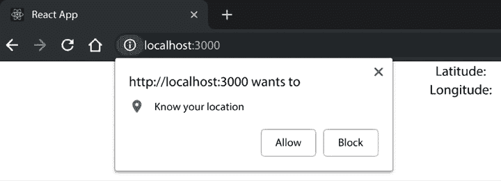
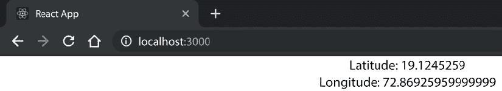

# 第四章：探索流行的组合模式

在本章中，我们将学习如何使组件之间有效地进行通信，这是使用小型、可测试和可维护的组件构建复杂 React 应用程序的关键部分。通过掌握 React 中流行的组合模式和工具，您将能够控制应用程序的每一个部分，并构建可扩展的软件。

让我们深入探讨如何利用这些模式和工具构建更好的 React 应用程序。我们将涵盖以下主题：

+   组件如何使用 props 和 children 进行通信

+   容器和表现模式以及它们如何使我们的代码更易于维护

+   **高阶组件**（**HOCs**）是什么以及如何利用它们以更好的方式构建我们的应用程序

+   子组件模式的功能及其好处

# 技术要求

要完成本章，您需要以下内容：

+   Node.js 19+

+   Visual Studio Code

您可以在本书的 GitHub 仓库中找到本章的代码，网址为[`github.com/PacktPublishing/React-18-Design-Patterns-and-Best-Practices-Fourth-Edition/tree/main/Chapter04`](https://github.com/PacktPublishing/React-18-Design-Patterns-and-Best-Practices-Fourth-Edition/tree/main/Chapter04)。

# 通信组件

使用 React 构建应用程序的关键好处之一是编写 React 组件。通过创建具有清晰界面的小型、**可重用组件**，您可以轻松地将它们组合在一起，以创建既强大又易于维护的复杂应用程序。

具有清晰界面的小型组件可以组合在一起，以创建既强大又易于维护的复杂应用程序。

组合 React 组件很简单；您只需在 render 中包含它们：

```js
const Profile = ({ user }) => ( 
  <>
    <Picture profileImageUrl={user.profileImageUrl} /> 
    <UserName name={user.name} screenName={user.screenName} /> 
  </> 
) 
```

例如，您可以通过简单地组合一个`Picture`组件来显示用户头像，以及一个`UserName`组件来显示用户名和屏幕名，来创建一个`Profile`组件。

以这种方式，您可以非常快速地生成新的用户界面部分，只需编写几行代码。每当您组合组件时，就像前面的例子一样，您可以使用 props 在它们之间共享数据。Props 是父组件将数据传递到树中每个需要它（或其部分）的组件的方式。

```js
Profile is not the direct parent of Picture (the div tag is), but Profile owns Picture because it passes down the props to it.
```

在下一节中，您将了解`children`属性及其正确使用方法。

## 使用 children 属性

有一个特殊的属性可以从所有者传递到其内部定义的组件——`children`。

在 React 文档中，它被描述为`不透明`，因为它是一个不告诉你其包含值的属性。通常，在父组件的渲染中定义的子组件会接收到作为组件自身属性传递的 props，或者在 JSX 中的`_jsx`函数的第二个参数中传递。组件也可以在它们内部定义嵌套组件，并且它们可以使用`children`属性访问这些子组件。

考虑我们有一个具有文本属性的`Button`组件，该属性表示按钮的文本：

```js
const Button = ({ text }) => <button className="btn">{text}</button> 
```

该组件可以使用以下方式：

```js
<Button text="Click me!" /> 
```

这将渲染以下代码：

```js
<button class="btn">Click me!</button> 
```

现在，假设我们想在应用程序的多个部分使用具有相同类名的相同按钮，并且我们还想能够显示比简单的字符串更多的内容。我们的 UI 由带文本的按钮、带文本和图标的按钮以及带文本和标签的按钮组成。

在大多数情况下，一个好的解决方案是向`Button`添加多个参数或创建不同版本的`Button`，每个版本都有其单一的专业化，例如`IconButton`。

然而，我们应该意识到`Button`可能只是一个包装器，我们能够在其中渲染任何元素并使用`children`属性：

```js
const Button = ({ children }) => <button className="btn">{children}</button> 
```

通过传递`children`属性，我们不仅限于简单的单个文本属性，我们还可以将任何元素传递给`Button`，并且它将替换`children`属性进行渲染。

在这种情况下，我们包裹在`Button`组件内的任何元素都将被渲染为具有`btn`类名的按钮元素的子元素。

例如，如果我们想在按钮内渲染一个图像，并在`span`标签内包裹一些文本，我们可以这样做：

```js
<Button> 
     
    <span>Click me!</span> 
</Button> 
```

前面的代码片段在浏览器中的渲染方式如下：

```js
<button class="btn"> 
     
    <span>Click me!</span> 
</button> 
```

这是一种相当方便的方式，允许组件接受任何子元素并将这些元素包裹在预定义的父元素内。

现在，我们可以在`Button`组件内传递图像、标签，甚至其他 React 组件，并且它们将被渲染为其子元素。正如您在前面的示例中看到的，我们将`children`属性定义为数组，这意味着我们可以传递任意数量的元素作为组件的子元素。

我们可以传递单个子元素，如下面的代码所示：

```js
<Button>
    <span>Click me!</span> 
</Button> 
```

现在，让我们在下一节中探索容器和展示模式。

# 探索容器和展示模式

在上一章中，我们看到了如何逐步将耦合组件转换为可重用组件。现在我们将看到如何将类似的模式应用到我们的组件中，使它们更清晰、更易于维护。

React 组件通常包含逻辑和展示的混合。通过逻辑，我们指的是与 UI 无关的任何内容，例如 API 调用、数据处理和事件处理程序。展示是渲染的部分，我们在其中创建要在 UI 上显示的元素。

在 React 中，有一些简单而强大的模式，称为`container`和`presentational`，我们可以在创建组件时应用这些模式，帮助我们分离这两个关注点。

在逻辑和表示之间创建明确的边界不仅使组件更可重用，还提供了许多其他好处，你将在本节中了解到。再次强调，学习新概念的最佳方法之一是通过查看实际示例，所以让我们深入一些代码。

假设我们有一个组件，它使用地理位置 API 来获取用户的当前位置，并在浏览器页面上显示纬度和经度。

首先，我们在`components`文件夹中创建一个`Geolocation.tsx`文件，并使用函数组件定义`Geolocation`组件：

```js
import { useState, useEffect } from 'react'
const Geolocation = () => {}
export default Geolocation 
```

然后我们定义我们的状态：

```js
const [latitude, setLatitude] = useState<number | null>(null)
const [longitude, setLongitude] = useState<number | null>(null) 
```

现在，我们可以使用`useEffect` Hook 来触发对 API 的请求：

```js
useEffect(() => { 
    if (navigator.geolocation) {
      navigator.geolocation.getCurrentPosition(handleSuccess)
        } 
}, [navigator]) 
```

当浏览器返回数据时，我们使用以下函数将结果存储在状态中（在`useEffect` Hook 之前放置此函数）：

```js
const handleSuccess = ({ 
    coords: { latitude, longitude } 
  }: { coords: { latitude: number; longitude: number }}) => { 
    setLatitude(latitude)
    setLongitude(longitude)
} 
```

最后，我们显示纬度和经度值：

```js
return ( 
    <div>
      <h1>Geolocation:</h1>
      <div>Latitude: {latitude}</div> 
      <div>Longitude: {longitude}</div> 
    </div> 
) 
```

需要注意的是，在第一次渲染时，纬度和经度是空的，因为我们是在组件挂载时请求浏览器的坐标。在现实世界的组件中，你可能想在数据返回之前显示一个加载指示器。为此，你可以使用我们在*第三章*，*清理你的代码*中看到的一种条件技术。

现在，这个组件没有任何问题，并且按预期工作。如果能够将其与请求和加载位置的部分分开，以便更快地迭代它，那岂不是很好？

我们将使用容器和表示模式来隔离表示部分。在这个模式中，每个组件都被分成两个更小的组件，每个组件都有其明确的职责。容器了解组件的所有逻辑，是调用 API 的地方。它还处理数据处理和事件处理。

表示组件是定义 UI 的地方，它从容器接收以 props 形式的数据。由于表示组件通常没有逻辑，我们可以将其创建为一个无状态的函数组件。

没有规则规定表示组件不能有状态（例如，它可以在内部保持 UI 状态）。在这种情况下，我们需要一个组件来显示纬度和经度，所以我们将使用一个简单的函数。

首先，我们应该将我们的`Geolocation`组件重命名为`GeolocationContainer`：

```js
const GeolocationContainer = () => {...} 
```

我们还将更改文件名，从`Geolocation.tsx`更改为`GeolocationContainer.tsx`。

这个规则并不是强制性的，但在 React 社区中广泛使用的一种最佳实践是在`Container`组件名称的末尾附加`Container`，并将原始名称给表示组件。

我们还必须更改`render`的实现，并从中删除所有 UI 部分，如下所示：

```js
return <Geolocation latitude={latitude} longitude={longitude} /> 
```

如前文片段所示，我们不是在容器的返回值内部创建 HTML 元素，而是使用当前的表现性组件（我们将在下一节创建），并将状态传递给它。这些状态是纬度和经度，默认为 null，当浏览器触发回调时，它们包含用户的实际位置。

让我们创建一个新文件，命名为`Geolocation.tsx`，在其中定义如下功能组件：

```js
import { FC } from 'react'
type Props = {
  latitude: number
  longitude: number
}
const Geolocation: FC<Props> = ({ latitude, longitude }) => (
  <div>
    <h1>Geolocation:</h1>
    <div>Latitude: {latitude}</div>
    <div>Longitude: {longitude}</div>
  </div>
)
export default Geolocation 
```

功能组件是定义 UI 的一种极其优雅的方式。它们是纯函数，给定一个状态，就返回它的元素。在这种情况下，我们的函数从所有者那里接收纬度和经度，并返回用于显示的标记结构。

第一次在浏览器中运行组件时，浏览器将要求您授权以允许它知道您的位置。



图 4.1：浏览器将要求您的权限以访问您的位置

在您允许浏览器知道您的位置后，您将看到如下内容：



图 4.2：显示纬度和经度

遵循容器和表现性模式，我们创建了一个“哑”或表现性组件，它是可重用的，并且可以轻松地集成到我们的组件中。这使得我们可以方便地传递模拟坐标进行测试或演示。如果应用程序的其他地方需要类似的数据结构，它消除了从头开始构建新组件的需要。相反，我们可以在新容器中封装这个现有的组件。例如，这个容器可以设计为从单独的端点检索纬度和经度信息。

同时，我们团队中的其他开发者可以通过添加一些错误处理逻辑来改进使用地理位置的容器，而不会影响其展示。他们甚至可以构建一个临时的表现性组件，仅用于显示和调试数据，然后在准备就绪时替换为真实的表现性组件。

能够在同一个组件上并行工作对团队来说是一个巨大的胜利，尤其是对于那些构建界面是一个迭代过程的公司。

这种模式简单但非常强大，当应用于大型应用程序时，它可以在开发速度和项目的可维护性方面产生差异。另一方面，如果没有真正的原因就应用这种模式，可能会带来相反的问题，使代码库变得不那么有用，因为它涉及到创建更多文件和组件。

因此，当我们决定一个组件必须按照容器和展示模式进行重构时，我们应该仔细思考。一般来说，正确的路径是从一个单一组件开始，只有在逻辑和展示变得过于耦合时才将其拆分。

在我们的例子中，我们从一个单一组件开始，并意识到我们可以将 API 调用与标记分离。决定将什么放入容器以及什么进入展示并不总是直接的；以下要点应有助于你做出这个决定：

以下是一些容器组件的特点：

+   它们更关注行为。

+   它们渲染它们的展示组件。

+   它们执行 API 调用并操作数据。

+   它们定义事件处理器。

以下是一些展示组件的特点：

+   它们更关注视觉表示。

+   它们渲染 HTML 标记（或其他组件）。

+   它们以 props 的形式从父组件接收数据。

+   它们通常被写成无状态的函数组件。

如你所见，这些模式形成了一个非常强大的工具，将帮助你更快地开发你的网络应用程序。让我们看看下一节中 HOCs 是什么。

# 理解 HOCs

在第三章 *清理你的代码* 的 *函数式编程* 部分，我们介绍了 **高阶函数**（**HOFs**）的概念。HOFs 是接受另一个函数作为参数、增强其行为并返回一个新函数的函数。将 HOFs 的想法应用于组件会导致 **高阶组件**（**HOCs**）的产生。

一个 HOC 看起来是这样的：

```js
const HoC = Component => EnhancedComponent 
```

HOCs 是接受一个组件作为输入并返回一个增强组件作为输出的函数。让我们从一个简单的例子开始，了解增强组件是什么样的。

假设你需要将相同的 `className` 属性附加到每个组件上。你可以手动将 `className` 属性添加到每个渲染方法中，或者你可以编写一个像这样的 HOC：

```js
const withClassName = Component => props => (
  <Component {...props} className="my-class" />
) 
```

在 React 社区中，使用 `with` 前缀为 HOCs（高阶组件）是常见的。

上述代码一开始可能让人感到困惑，所以让我们来分解一下。我们声明了一个 `withClassName` 函数，它接受一个 `Component` 并返回另一个函数。返回的函数是一个函数组件，它接收一些属性并渲染原始组件。收集到的属性被展开，并传递一个值为 `"my-class"` 的 `className` 属性给函数组件。

HOCs 通常会传播它们接收的属性，因为它们旨在保持透明并仅添加新行为。

虽然这个例子很简单且并不特别有用，但它应该能让你更好地理解 HOCs 是什么以及它们看起来像什么。现在，让我们看看我们如何在组件中使用 `withClassName` HOC。

首先，创建一个接收 `className` 并将其应用于 `div` 标签的无状态函数组件：

```js
const MyComponent = ({ className }) => <div className={className} /> 
```

不是直接使用组件，而是将其传递给一个 HOC，如下所示：

```js
const MyComponentWithClassName = withClassName(MyComponent) 
```

将我们的组件包裹在`withClassName`函数中确保它们接收`className`属性。

现在，让我们创建一个更令人兴奋的 HOC 来检测`innerWidth`。首先，创建一个接收`Component`的函数：

```js
 import { useEffect, useState } from 'react'
  const withInnerWidth = Component => props => <Component {...props} /> 
```

使用`with`模式为增强组件提供信息的 HOCs 通常会有前缀。

接下来，定义`innerWidth`状态和`handleResize`函数：

```js
const withInnerWidth = Component => props => {
  const [innerWidth, setInnerWidth] = useState(window.innerWidth)
  const handleResize = () => {
    setInnerWidth(window.innerWidth)
  }
  return <Component {...props} />
} 
```

然后，添加效果：

```js
useEffect(() => {
  window.addEventListener('resize', handleResize)
  return () => {
    window.removeEventListener('resize', handleResize)
  }
}, []) 
```

最后，按照如下方式渲染原始组件：

```js
return <Component {...props} innerWidth={innerWidth} /> 
```

在这里，我们像之前一样展开属性，但同时也传递了`innerWidth`状态。

我们将`innerWidth`值存储为状态，以在不污染组件状态的情况下实现原始行为。相反，我们使用属性。使用属性是提高可重用性的绝佳方式。

现在，使用 HOC 和获取`innerWidth`值是直接的。新的 React Hooks 可以通过创建自定义 Hooks 轻松地替换 HOC。创建一个期望`innerWidth`作为属性的函数组件：

```js
const MyComponent = ({ innerWidth }) => {
  console.log('window.innerWidth', innerWidth)
  // ...
} 
```

如下增强它：

```js
const MyComponentWithInnerWidth = withInnerWidth(MyComponent) 
```

通过使用 HOCs，我们避免了任何状态的污染，并且不需要组件实现任何函数。这意味着组件和 HOC 不是耦合的，并且可以在整个应用程序中重用。

使用属性而不是状态，我们可以创建一个“哑”组件，可以在我们的风格指南中使用，忽略复杂的逻辑，只需传递属性。

在这个特定的情况下，我们可以为支持的每个不同的`innerWidth`大小创建一个组件。考虑以下示例：

```js
<MyComponent innerWidth={320} /> 
```

或者如下：

```js
<MyComponent innerWidth={960} /> 
```

如您所见，通过使用高阶组件（HOCs），我们可以传递一个组件，然后返回一个具有额外功能的新组件。一些常见的 HOCs 包括来自 Redux 的`connect`和来自 Relay 的`createFragmentContainer`。

# 理解函数作为子组件

`FunctionAsChild`模式在 React 社区中得到了共识。它在像**react-motion**这样的流行库中广泛使用，我们将在第五章*为浏览器编写代码*中探讨。

主要概念是，我们不是将子组件作为组件传递，而是定义一个可以接收来自父组件参数的函数。让我们看看它是什么样子：

```js
const FunctionAsChild = ({ children }) => children() 
```

如您所见，`FunctionAsChild`是一个具有子属性定义为函数的组件。它不是用作 JSX 表达式，而是被调用。

之前提到的组件可以这样使用：

```js
<FunctionAsChild>
  {() => <div>Hello, World!</div>}
</FunctionAsChild> 
```

这个例子相当简单：子函数在父组件的渲染方法中执行，返回包裹在`div`标签中的`Hello, World!`文本，该文本在屏幕上显示。

现在，让我们探索一个更有意义的例子，其中父组件将一些参数传递给子函数。

创建一个`Name`组件，它期望一个函数作为子组件，并将`'World'`字符串传递给它：

```js
const Name = ({ children }) => children('World') 
```

之前提到的组件可以这样使用：

```js
<Name>
  {name => <div>Hello, {name}!</div>}
</Name> 
Hello, World! again, but this time the name has been passed by the parent. It should now be clear how this pattern works. Let’s look at the advantages of this approach:
```

+   主要优势是能够封装组件，动态传递变量，而不是使用静态属性，这是高阶组件中常见的做法。一个很好的例子是`Fetch`组件，它被设计用来从特定的 API 端点检索数据，并将其随后返回给其子函数：

    ```js
    <Fetch url="...">
      {data => <List data={data} />}
    </Fetch> 
    ```

+   其次，使用这种方法组合组件不会强迫子组件使用预定义的 prop 名称。由于函数接收变量，使用该组件的开发者可以决定它们的名称。这种灵活性使得“函数作为子组件”解决方案更加灵活。

+   最后，包装器非常可重用，因为它不对接收到的子组件做出任何假设——它只期望一个函数。因此，同一个`FunctionAsChild`组件可以在应用程序的不同部分使用，以服务于各种子组件。

通过采用“函数作为子组件”模式，你可以在 React 应用程序中创建更灵活、多功能和可重用的组件。

# 摘要

在本章中，我们学习了如何有效地使用 props 来组合和通信我们的可重用组件。通过使用 props，我们可以创建定义良好的接口，并使我们的组件彼此解耦。

我们还探索了两种流行的组合模式：容器模式和展示模式，这些模式帮助我们分离逻辑和展示，以便为更专业和专注的组件提供支持。此外，我们还发现了**高阶组件**（**HOCs**）作为处理上下文的一种方式，它允许我们不必将组件紧密耦合到上下文中，以及用于动态组合组件的“函数作为子组件”模式。

在下一章中，我们将深入探讨受控组件与不受控组件、refs、处理事件和 React 中的动画。
